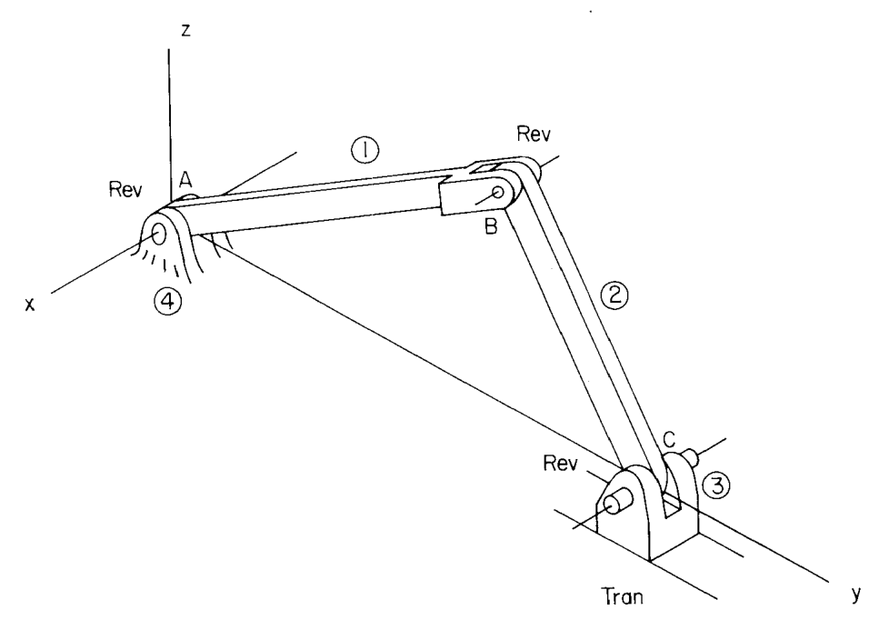
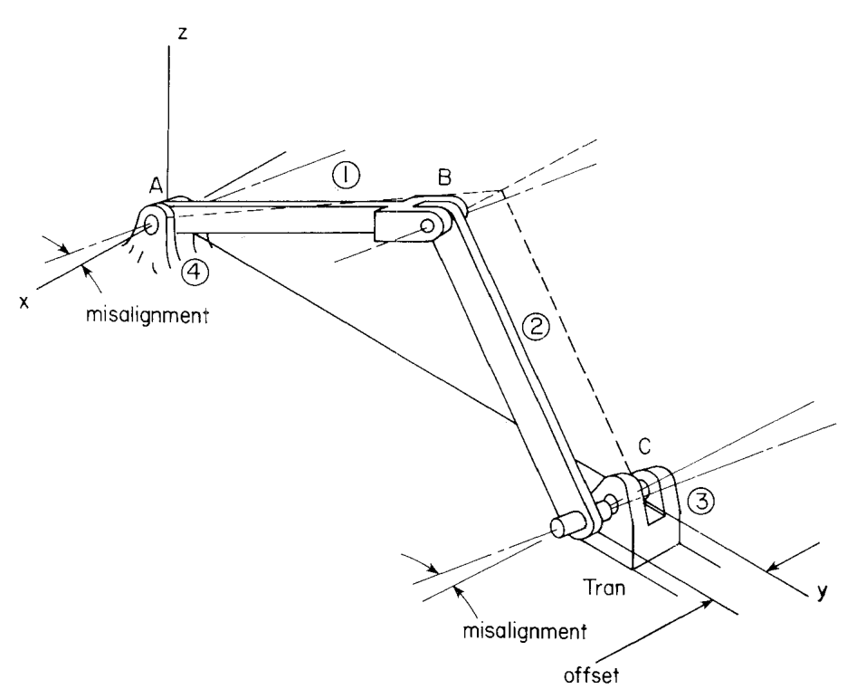
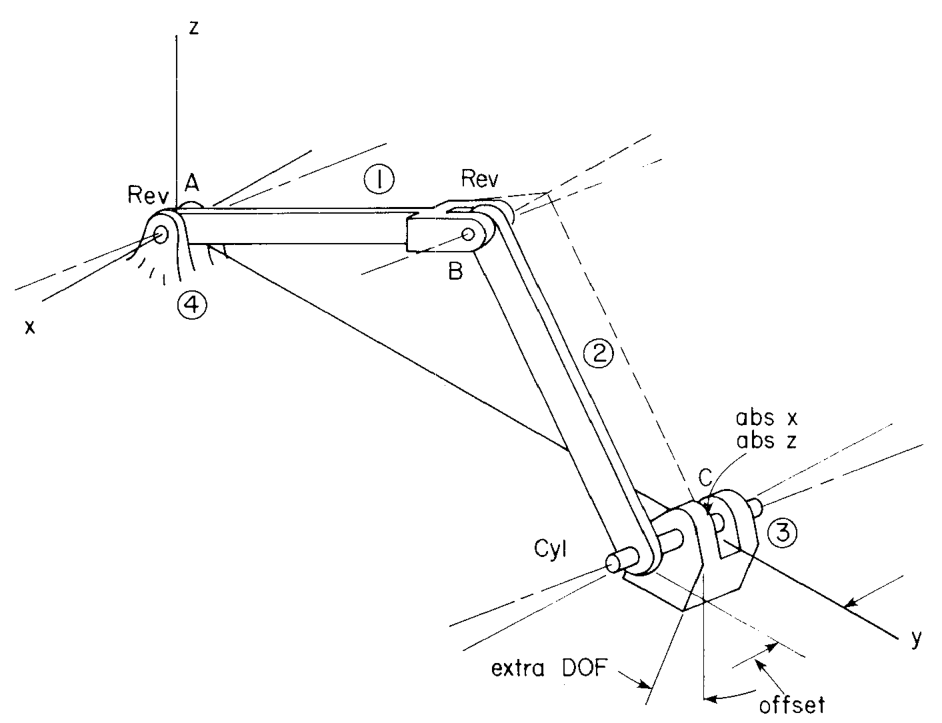

# 10.1 建模与分析技术

> 来源：*Computer Aided Kinematics and Dynamics of Mechanical Systems*，第 10 章，§10.1（书页 393–396）。
> 本文按"文字讲解 + 逐式详细推导"组织，公式推导不跳步骤。

## 引言：本节要解决什么

Ch.9 已经把工具备齐：§9.4 的空间运动副约束库、§9.5 的空间驱动约束库、§9.6 的位置/速度/加速度三段式统一求解框架。本节是第 10 章的开篇，回答一个方法论问题——**把这些构件拼成模型时最容易犯什么错**。

原书开门见山给出了答案：

> The basic techniques for kinematic modeling of spatial mechanisms and machines are identical to those discussed in Section 5.1 for planar systems. The principal and very important difference between modeling planar and spatial kinematic systems concerns the redundancy of constraints. In spatial systems, it is easy to implement what appear to be proper constraints, only to find that redundancies exist.

即：**建模技术本身（定义几何 → 选运动副 → 写约束 → 查自由度）与平面 §5.1 完全照搬，唯一的、而且非常重要的差别是约束冗余（constraint redundancy）**。空间系统里"看起来完全正确的约束"极易实际含有冗余。

主线逻辑：

1. **例 10.1.1 暴露矛盾**：一个逐条看都合理的空间曲柄滑块模型，按计数法算出 $\text{DOF}=-2$（书页 393–394）。
2. **冗余溯源**：三条冗余来自两处几何退化——平行轴自动传递（2 条）+ 共面运动（1 条）。
3. **制造缺陷测试（manufacturing imperfection test）**：用"故意装偏"的物理实验，独立地把 3 条冗余数出来，与溯源结论互相印证（书页 394–395, Fig. 10.1.2）。
4. **一次失败的"修复"**：把移动副换成绝对约束、把转动副换成圆柱副，计数检查通过了，却凭空多出一个自由度（书页 394–395, Fig. 10.1.3）。
5. **结论**：仅凭约束计数的调整可以同时带来冗余约束与非期望的额外自由度；空间运动学分析的其余部分只是平面分析的直接推广（书页 396）。

---

## 10.1 建模与分析技术（Modeling and Analysis Techniques）

### 思路

平面系统里，机构天然共面，约束方程之间的"巧合相关"很少见；空间系统里，"轴线互相平行""若干点共面""两个转动副共轴"这些**几何退化**在真实机械中随处可见——而它们恰好是约束方程线性相关的充分条件。于是模型在形式上合法（每条约束单独看都写对了），在代数上却秩亏（rank-deficient）。

本节用一个最小的空间机构（空间曲柄滑块）把这件事演示完整：先让计数法给出荒谬的负数自由度，再把冗余一条条定位，最后给出诊断手段和反面教材。

### 例 10.1.1：过度约束的空间曲柄滑块

> 4 个刚体：地面 ④、曲柄 ①、连杆 ②、滑块 ③；三个转动副（A、B、C）+ 一个移动副（D）。

#### 第一步：按构件清单计数（counting check，§5.1 步骤 1(a)）

采用 Euler 参数描述姿态时，每个体的广义坐标数为 7（3 平动 + 4 姿态）：

$$
nc = 7\,nb = 7\times 4 = 28
$$

约束方程按类型逐项累加。空间转动副由球副约束 + 平行-1 约束组成（Eq. 9.4.22），共 5 条；空间移动副由平行-1 + 平行-2 + 点积-1 组成（Eq. 9.4.24），也是 5 条；地面约束 6 条；每个体的 Euler 参数归一化约束（Eq. 9.6.3）1 条：

$$
\begin{aligned}
nh^{\text{Rev}} &= 3\times 5 = 15\\
nh^{\text{Tran}} &= 1\times 5 = 5\\
nh^{\text{ground}} &= 6\\
nh^{\mathbf p} &= 4\times 1 = 4\\
nh &= 15+5+6+4 = 30
\end{aligned}
$$

$$
\text{DOF}_{\text{count}} = nc - nh = 28-30 = -2
$$

自由度算出 **$-2$**，这在物理上不可能：约束方程条数超过了系统真正能容纳的独立约束数。

#### 第二步：从"应有自由度"反推冗余条数

该机构显然只有 1 个自由度。于是真正独立的约束方程数是 $nc-\text{DOF}_{\text{真实}} = 28-1 = 27$，多出来的就是冗余：

$$
n_{\text{red}} = nh-\bigl(nc-\text{DOF}_{\text{真实}}\bigr) = 30-(28-1) = 3
$$

等价地，在雅可比层面就是**秩亏**（rank-deficient）：

$$
\operatorname{rank}\boldsymbol\Phi_{\mathbf q} = 27 < 30 = nh
$$

即 30 个行向量里只有 27 个线性无关。

#### 第三步：三条冗余逐一溯源

**(1) 平行轴自动传递 —— 2 条。**

转动副的空间形式是 $\boldsymbol\Phi^s+\boldsymbol\Phi^{p1}$（Eq. 9.4.22），其中 $\boldsymbol\Phi^{p1}$ 含 2 条方程，强迫两体关节 $z''$ 轴平行。A 处约束强制体 ④–① 轴平行，B 处强制体 ①–② 轴平行；由平行的传递性，体 ②–③ 在 C 处的轴平行**自动成立**。C 处的 2 条 $\boldsymbol\Phi^{p1}$ 方程没有提供任何新信息：

$$
\mathbf h_2^{\text{轴}}\parallel\mathbf h_4^{\text{轴}},\quad \mathbf h_2^{\text{轴}}\parallel\mathbf h_1^{\text{轴}} \;\Longrightarrow\; \mathbf h_2^{\text{轴}}\parallel\mathbf h_3^{\text{轴}}\ \text{(自动)}
$$

**(2) 共面运动使 $z$ 方向约束自动满足 —— 1 条。**

A、B 处转动副轴平行（设沿 $\hat{\mathbf z}$），要求体 ①、② 在 $x$-$y$ 平面内运动；体 ③ 与地面的移动副也要求体 ③ 随体系原点落在 $x$-$y$ 平面内。于是点 $C$ 在两个体上的 $z$ 坐标恒相等（且恒为零），球副约束 $\boldsymbol\Phi^s$（Eq. 9.4.7）中 $z$ 方向的那一条**自动满足**：

$$
\bigl(\mathbf r_C\bigr)_{z}\big|_{\text{体 }2} - \bigl(\mathbf r_C\bigr)_{z}\big|_{\text{体 }3} \equiv 0
$$

合计 $2+1=3$ 条，与第二步的 $n_{\text{red}}=3$ 吻合。

> **物理解读**：冗余约束本身并不"坏"，它们是**相容冗余**（consistent redundancy，§3.6）——方程多余但不矛盾，系统照样能装配、能求解。真正的问题是它把模型规模撑大（30 条方程而非 27 条）、让 $\boldsymbol\Phi_{\mathbf q}$ 秩亏、使 Newton–Raphson 的线性方程组奇异，从而在数值实现上必须特殊处理（§4.6）。

### 制造缺陷测试（Manufacturing Imperfection Test）

计数与秩分析都是**代数**判据；原书接着给出一个**几何/物理**判据，即 §5.1 步骤 1(b) 的制造缺陷测试：

> As an alternative check on redundancy, the *manufacturing imperfection test* outlined in step 1(b) of the procedure suggested in Section 5.1 can be applied to this mechanism.

**做法**：把地面 ④ 上 A 处转动副的轴线故意装偏一个微小角度（Fig. 10.1.2 中 A 处的交叉虚线即失配 misalignment），其余一切不变，然后问：**这个系统还能装配（assemble）吗？**

**结论**：

- 若所有其余转动副轴线仍保持平行，则体 ② 与体 ③ 在 C 处的轴线必然**失配**，机构**无法装配**。要在保持平行这一前提下把 C 处两轴重新对齐，必须调整 **2 个参数** → 对应 **2 个冗余度**。
- 第三个冗余度来自共面条件。原书 p.394 的表述是：

  > *A third degree of redundancy exists, since the center point of the revolute joint on body 2 does not lie in the y-z plane; hence there is an offset, which defines one additional degree of redundancy.*

  即完美模型中体 ② 上 C 处转动副的中心点必须落在运动平面内；制造偏差使该中心点离面（出现一个 offset，Fig. 10.1.2 右下角的偏置标注），而约束方程对这种离面偏置毫无约束力——要装配就得再调 1 个参数把它抵消。这与 p.393 中"$z$ 坐标约束冗余"是同一件事的两种说法：p.393 说的是完美模型里那条方程**恒被满足**，p.394 说的是缺陷模型里它**必须靠调整才能满足**。

三种冗余 $(2,2,1)\to 2+1$ 与代数溯源结果完全一致。

**为什么这个测试有效**：冗余约束之所以冗余，是因为一条约束的几何信息已被其他约束蕴含——这种"蕴含"在完美几何下隐藏，一旦把几何轻微扰动（轴线偏一点、点偏出面），蕴含关系破裂，被蕴含的那条约束立刻露出"需要额外调节参数才能满足"的原形。**能的装配扰动 = 冗余的数目**。

### 一次失败的"修复"：圆柱副 + 绝对约束

既然计数法给出 $-2$，一个自然的想法是"调方程数量把计数改对"。原书给了这个反例。

**修改一**：把体 ③ 与体 ④（地面）之间的移动副，换成体 ③ 上点 $C$ 的绝对 $x$ 约束与绝对 $z$ 约束（§9.4 绝对点约束，Eq. 9.4.16，每条 1 个方程）。

$$
nh^{\text{Tran}} = 5 \;\longrightarrow\; nh^{\text{abs}} = 2
$$

$$
nh = 30-3 = 27,\qquad nc-nh = 28-27 = 1
$$

计数检查（§5.1 步骤 1(a)）**通过了**：广义坐标数减约束数恰为 1。

**但这不是好模型**。理由：Fig. 10.1.2 中的失配发生在体 ②–③ 的转动副处，而修改一只动了体 ③–④ 的连接，**根本没有触及那处 offset 不一致**，所以系统仍然无法装配。

**修改二**：为绕过装配困难，再把体 ②–③ 的转动副换成圆柱副（cylindrical joint，Eq. 9.4.23，4 条方程，比转动副少 1 条）。此时机构能装配了（Fig. 10.1.3），代价是：

$$
n_{\text{extra}} = 1 \;\text{（体 ③ 绕圆柱副轴线的自转自由度）}
$$

**教训**（原书 p.396 开头的总结）：

> *Thus, careless adjustment in constraint definition, based only on counting constraint equations, can lead to either or both redundant constraints and unwanted extra degrees of freedom.*

只看计数来调整约束定义，会同时招来两类病：**残留的冗余约束**（修改一没解决的那条）和**非期望的额外自由度**（修改二引入的体 ③ 自转）。两者都是"模型错了但计数对了"。

### 工程准则小结

| 准则 | 内容 | 出处 |
|------|------|------|
| 计数检查必要不充分 | $\text{DOF}=nc-nh$ 只是必要条件；$\text{DOF}<0$ 一定有问题，$\text{DOF}\ge0$ 不代表没问题 | §5.1 步骤 1(a) |
| 用制造缺陷测试验证 | 引入微小失配，若不能装配则存在冗余；调节所需参数个数 = 冗余度 | §5.1 步骤 1(b) |
| 冗余的几何根源 | 平行轴、共面、共点等几何退化 → 雅可比行相关 → 秩亏 | 本节例 10.1.1 |
| 病象可能互相掩盖 | 减少方程数（换更"松"的关节）能掩盖冗余，代价是放出多余自由度 | Fig. 10.1.3 |
| 正解不是"改数量"而是"换类型" | 应换用**不会重复计数**的关节类型（球副、复合关节、距离约束），而不是简单删方程——§10.2 给出正确示范 | §10.2 |

### 本节收尾：与平面分析的关系

> Apart from the need for careful definition of independent kinematic constraints, the kinematic analysis of spatial systems is a direct extension of the kinematic analysis of planar systems. Kinematic analyses of realistic mechanisms are carried out in the remaining sections of this chapter using the DADS computer code [27]. The effects of design variations are studied to illustrate the use of the methods of Chapter 9 in support of the design of mechanical systems.

即：**除了"必须小心界定独立约束"这一件事之外，空间系统运动学分析就是平面运动学分析的直接推广**。本章余下各节用 DADS 程序对真实机构做分析，并通过**设计变更研究**（design variation study）展示 Ch.9 的方法如何支撑机械系统设计——这正是 §10.2（空间曲柄滑块，连杆长度参数研究）、§10.3（空间四连杆，两种等效模型对比）、§10.4（空气压缩机，偏置角参数研究）的主线。

---

## 本节要点回顾

1. 空间建模技术 = 平面建模技术（§5.1），**唯一本质差别是约束冗余**。
2. 例 10.1.1：4 体空间曲柄滑块，$nc=28$、$nh=30$，计数得 $\text{DOF}=-2$；实际 $1$ 自由度 ⇒ $n_{\text{red}}=30-(28-1)=3$，$\operatorname{rank}\boldsymbol\Phi_{\mathbf q}=27$。
3. 三条冗余来源：平行轴自动传递（2 条，C 处 $\boldsymbol\Phi^{p1}$）+ 共面运动使 $C$ 点 $z$ 约束自动满足（1 条）。
4. 制造缺陷测试：把 A 处轴线装偏 ⇒ C 处轴线失配无法装配 ⇒ 需调 2 个参数；再加离面 offset 1 个参数 ⇒ 3 个冗余度。
5. 反面教材：移动副换成绝对 $x$、$z$ 约束后计数正确（$28-27=1$）但仍不可装配；再把转动副换成圆柱副虽可装配，却引入体 ③ 绕轴自转的额外自由度。
6. 结论：**只改方程数量不行，必须改关节类型**；空间分析其余部分与平面一一对应。
