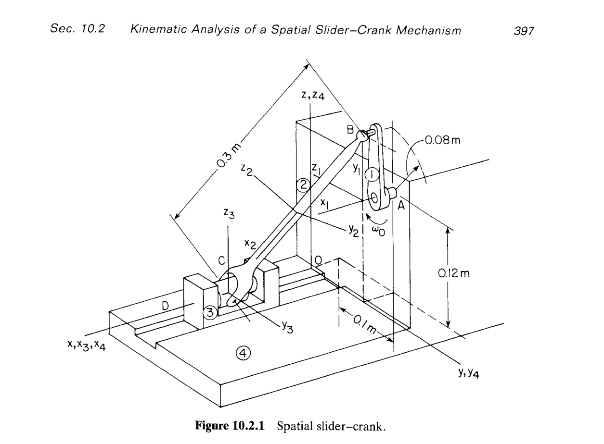
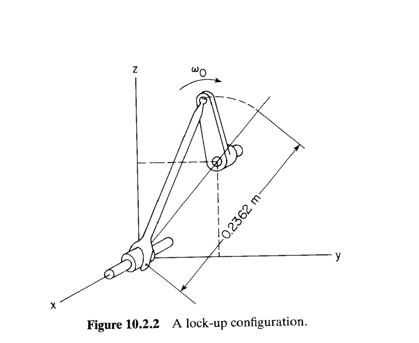
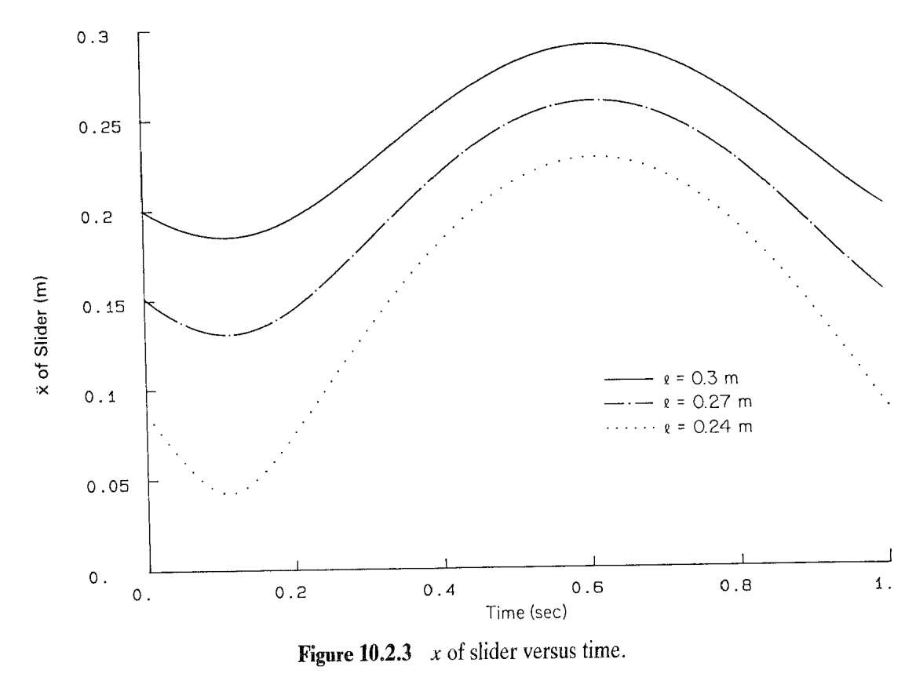
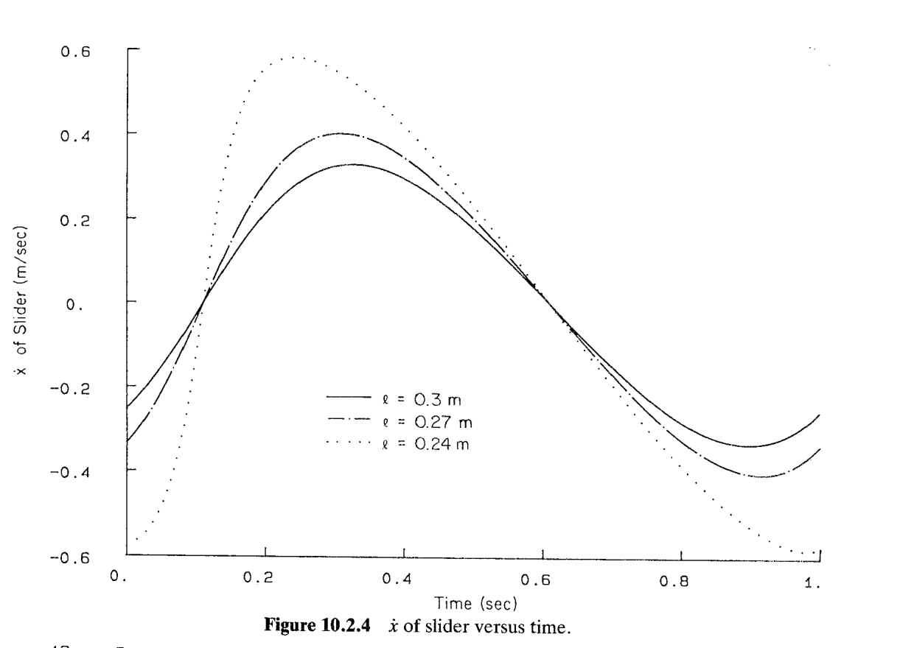
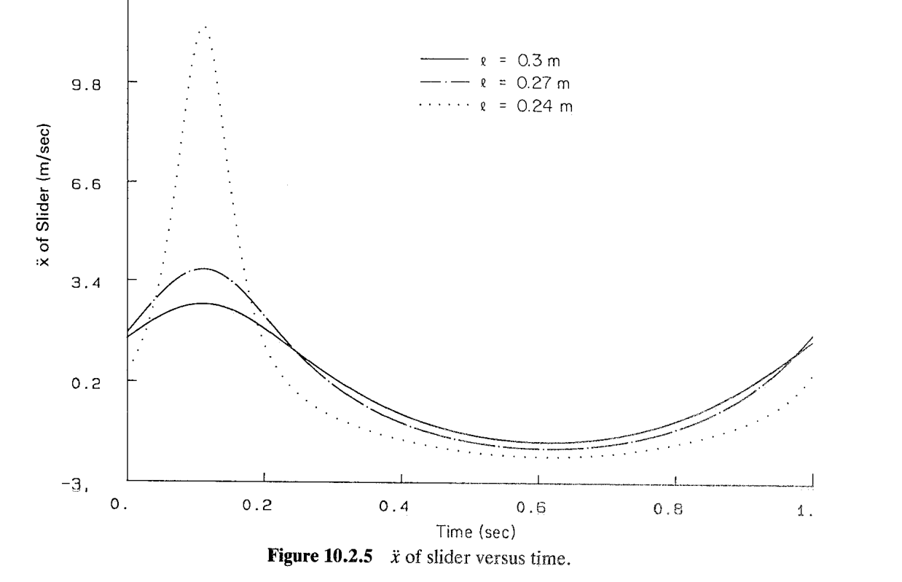

# 10.2 空间曲柄滑块机构的运动学分析

> 来源：*Computer Aided Kinematics and Dynamics of Mechanical Systems*，第 10 章，§10.2（书页 396–401）。
> 本文按"文字讲解 + 逐式详细推导"组织，公式推导不跳步骤；原书跳过的几何推导（锁死阈值、近奇异放大）在本文中补齐。

## 引言：本节要解决什么

§10.1 诊断了空间建模的唯一真正难点——**约束冗余**，并留下一句结论：**正解不是"改方程数量"，而是"换关节类型"**。本节就是这句话的示范：同一个空间曲柄滑块构型，改用不会重复计数的关节类型重新建模，计数检查一次通过（$\text{DOF}=1$），然后按 §9.6 的三段式框架走完**装配 → 驱动 → 位置/速度/加速度分析**的全程，最后用**连杆长度参数研究**展示 Ch.9 的方法如何反过来支撑机械设计。

主线逻辑：

1. **10.2.1 建模**：4 个刚体、7 类约束、$nc=28$、$nh=27\Rightarrow\text{DOF}=1$；六个"关节参考点"（每个体三个）定义每个关节的几何。
2. **10.2.2 装配**：给广义坐标估计值，用 Newton–Raphson（§4.5/§9.6）解出装配构型。
3. **10.2.3 驱动**：把曲柄的相对转角设为时间函数 $\theta=2\pi t$，把 1 个自由度锁死 ⇒ 系统成为运动学确定系统（$28$ 方程 $28$ 未知量）。
4. **10.2.4 分析**：连杆长度取 $0.3,0.27,0.24$ m 三档，输出滑块上 C 点的位置/速度/加速度历程；$\ell<0.2362$ m 时机构**锁死**（Fig. 10.2.2）。
5. **隐藏的几何**：$0.2362$ 这个阈值不是经验值，而是"曲柄销到滑轨的最大距离"；$\ell=0.24$ m 只比它大 3.8 mm，故加速度峰值暴涨（Fig. 10.2.5）——本文第 4 节给出完整推导。

---

## 10.2.1 模型（Model）

### 思路

建模的第一步是**给几何**：空间关节的约束方程（§9.4）需要一个"关节处的局部参考系"，才能写出"两体的某个点重合""两体的某根轴平行"这类条件。原书的做法是**每个体选三个点** $P_i,Q_i,R_i$（在各自随体质心系中给定），用它们张成一个**关节参考三点组**（joint reference triad），再由这些点构造关节定义系。给出几何后，剩下的就是把 §9.4 的方程条数逐项加起来做**计数检查**（counting check，§5.1 步骤 1(a)）。

### 关节参考三点组与关节定义系

对每个体 $i$，在随体质心系 $x'\text{-}y'\text{-}z'$ 中给定三点 $\mathbf s_i'^{P_i},\mathbf s_i'^{Q_i},\mathbf s_i'^{R_i}$，按下述**几何约定**构造关节定义系 $x''\text{-}y''\text{-}z''$（与 §9.4 Eq. 9.4.1 的 $\mathbf f_i,\mathbf g_i,\mathbf h_i$ 一致）：

$$
\mathbf h_i'=\mathbf u\bigl(\mathbf s_i'^{Q_i}-\mathbf s_i'^{P_i}\bigr),\qquad
\mathbf f_i'=\mathbf u\Bigl[\bigl(\mathbf s_i'^{R_i}-\mathbf s_i'^{P_i}\bigr)-\mathbf h_i'\mathbf h_i'^T\bigl(\mathbf s_i'^{R_i}-\mathbf s_i'^{P_i}\bigr)\Bigr],\qquad
\mathbf g_i'=\mathbf h_i'\times\mathbf f_i'
$$

其中 $\mathbf u(\cdot)$ 表示取单位向量。即：

| 点 | 作用 |
|----|------|
| $P_i$ | **关节中心**（关节的作用点，如转动副的轴心、球副的球心） |
| $Q_i$ | 与 $P_i$ 一起定义关节的 $z''$ 轴（如转动副/移动副的轴或滑移方向） |
| $R_i$ | 与 $P_i$ 一起定义关节的 $x''$ 轴（绕 $z''$ 的相位参考） |
| $y''$ | 由右手系补全：$\mathbf g'=\mathbf h'\times\mathbf f'$ |

于是关节定义系在随体系中的变换矩阵（矩阵各列即上述单位向量在该体系中的分量）为

$$
\mathbf C_i^{P}=\bigl[\mathbf f_i',\;\mathbf g_i',\;\mathbf h_i'\bigr]
$$

关节约束的"公共点"写作 $\mathbf s_i'^P=\mathbf C_i^P\mathbf r'^{P_i}$（$P_i$ 相对关节中心的体固矢量），从而 §9.4 的所有方程都能落到这三点上。**原书的重点提示**：$P_i,Q_i$ 是"由关节类型决定"的（不能随便选），而 $R_i$ **可以任意选**——它只定相位，不影响约束的几何。

### 模型清单与自由度计数

> 图 10.2.1：4 个刚体（曲柄 ①、连杆 ②、滑块 ③、地面 ④）；关节 A（①-④ 转动副）、B（①-② 球副）、C（②-③ 转-柱关节）、D（③-④ 移动副），外加连杆与滑块之间的距离约束。

原书的模型清单（Book Table, p.396）：

| 项 | 内容 | 方程数 |
|----|------|--------|
| Bodies | Four bodies，$nc=28$ | — |
| Constraints | Revolute joint (crank, ground) | 5 |
| | Spherical joint (crank, connecting rod) | 3 |
| | Revolute–cylindrical joint (connecting rod, slider) | 3 |
| | Translational joint (slider, ground) | 5 |
| | Distance constraint (connecting rod, slider) | 1 |
| | Ground constraint | 6 |
| | Euler parameter normalization constraint | 4 |
| | **合计** $nh$ | **27** |

用 Euler 参数描述姿态时每体 7 个广义坐标（3 平动 $+$ 4 姿态）：

$$
nc=7\,nb=7\times4=28
$$

逐项核对每个关节的方程数**来自 §9.4 的定义式**（这一步原书省略，但正是"计数检查"能被信任的前提）：

$$
\begin{aligned}
nh^{\text{Rev}}&=\Phi^{s}+\Phi^{p1}=3+2=5 &&\text{(Eq. 9.4.22)}\\
nh^{\text{Sph}}&=\Phi^{s}=3 &&\text{(Eq. 9.4.18)}\\
nh^{\text{RevCyl}}&=\Phi^{d1}(\mathbf h_2,\mathbf h_3)+\Phi^{p2}(\mathbf h_3,\mathbf d_{32})=1+2=3 &&\text{(Eq. 9.4.32)}\\
nh^{\text{Tran}}&=\Phi^{p1}+\Phi^{p2}+\Phi^{d1}=2+2+1=5 &&\text{(Eq. 9.4.24)}\\
nh^{\text{dist}}&=\Phi^{ss}(P_2,P_3,C)=1 &&\text{(Eq. 9.4.8)}\\
nh^{\text{gnd}}&=6 &&\text{(§9.4 绝对约束)}\\
nh^{\mathbf p}&=4\times1=4 &&\text{(Eq. 9.6.3)}
\end{aligned}
$$

$$
nh=5+3+3+5+1+6+4=27
$$

$$
\boxed{\;\text{DOF}=nc-nh=28-27=1\;}
$$

与原书一致。**交叉验证（按动体算）**：三个动体共 $3\times7=21$ 个坐标，减去 3 条归一化约束，再减去闭合回路的 17 条关节/距离约束（$5+3+3+5+1$，地面 6 条已锁死静体）：

$$
21-3-17=1\;\checkmark
$$

### 与 §10.1 病态模型的对照：换关节类型 = 恰好减 3 条方程

§10.1 例 10.1.1 用的是"四个 5 方程关节"的配方（转动副 $\times3$ + 移动副）：

$$
nh_{\text{病态}}=5+5+5+5+6+4=30,\qquad \text{DOF}=28-30=-2
$$

本节换成：B 处**转动副 → 球副**（$-2$）、C 处**转动副 → 转-柱关节**（$-2$）、再**加一条距离约束**（$+1$）：

$$
nh=30-2-2+1=27,\qquad \text{DOF}=-2+2+2-1=+1\;\checkmark
$$

净减 3 条方程，正是 §10.1 用秩分析数出来的 3 个冗余度。**注意**：这不是"删方程"，而是"换关节类型"——减掉的三条正好是 §10.1 指认的"被其余约束蕴含、从而自动满足"的那些方程（平行轴传递、共面退化），所以模型既不再秩亏，也没有放出额外自由度。这正是 §10.1 结论的落地。

### 关节数据表（Tables 10.2.1–10.2.5）

点坐标均写在各体**随体质心系** $x'\text{-}y'\text{-}z'$ 中。

**表 10.2.1 转动副数据（Revolute Joint，关节 A：曲柄 ①–地面 ④）**

| Body | $P\ (x',y',z')$ | $Q\ (x',y',z')$ | $R\ (x',y',z')$ |
|------|-----------------|-----------------|-----------------|
| Crank ① | $(0.0,\ 0.0,\ 0.0)$ | $(1.0,\ 0.0,\ 0.0)$ | $(0.0,\ 0.0,\ 1.0)$ |
| Ground ④ | $(0.0,\ 0.1,\ 0.12)$ | $(1.0,\ 0.1,\ 0.12)$ | $(0.0,\ 0.1,\ 1.12)$ |

**读法**：$P_1=(0,0,0)$ 说明关节中心就在曲柄质心上；$P_4=(0,0.1,0.12)$ 与图 10.2.1 中的两个尺寸（横向 $0.1$ m、竖直 $0.12$ m）对应，即**关节中心 A 在地面系中的坐标**。$P\to Q$ 给出 $z''$ 轴 $=(1,0,0)$ ⇒ **转动轴平行于全局 $x$ 轴**。$R_4-P_4=(0,0,1)$ 给出 $x''$ 轴，$R_1-P_1=(0,0,1)$ 与之同向 ⇒ 两体的关节定义系初始同向。

**表 10.2.2 球副数据（Spherical Joint，关节 B：曲柄 ①–连杆 ②）**

| Body | $P\ (x',y',z')$ | $Q\ (x',y',z')$ | $R\ (x',y',z')$ |
|------|-----------------|-----------------|-----------------|
| Crank ① | $(0.0,\ 0.08,\ 0.0)$ | $(0.0,\ 0.08,\ 1.0)$ | $(1.0,\ 0.08,\ 0.0)$ |
| Connecting rod ② | $(-0.15,\ 0.0,\ 0.0)$ | $(-0.15,\ 0.0,\ 1.0)$ | $(1.15,\ 0.0,\ 0.0)$ |

**读法**：曲柄上的球副中心 $P_1=(0,0.08,0)$ ⇒ **曲柄半径 $r=0.08$ m**（图 10.2.1 中 A 处的 $0.08$ m 弧标注）；连杆上的球副中心 $P_2=(-0.15,0,0)$。球副只给 3 条方程 $\Phi^s$（Eq. 9.4.18），$Q,R$ 只用于定义参考系，**不产生额约束**——这正是"不能重复计数"的关键。

**表 10.2.3 转-柱关节数据（Revolute–Cylindrical Joint，关节 C：连杆 ②–滑块 ③）**

| Body | $P\ (x',y',z')$ | $Q\ (x',y',z')$ | $R\ (x',y',z')$ |
|------|-----------------|-----------------|-----------------|
| Connecting rod ② | $(0.15,\ 0.0,\ 0.0)$ | $(0.15,\ 1.0,\ 0.0)$ | $(1.15,\ 0.0,\ 0.0)$ |
| Slider ③ | $(0.2,\ 0.0,\ 0.0)$ | $(1.2,\ 0.0,\ 0.0)$ | $(0.2,\ 1.0,\ 0.0)$ |

**读法**：连杆上的 C 点 $P_2=(0.15,0,0)$；连杆的 $z''$ 轴 $P_2Q_2=(0,1,0)$。滑块的 $z''$ 轴 $P_3Q_3=(1,0,0)$（即滑轨方向），与连杆的 $z''$ 轴**正交**——所以这里是 $\Phi^{d1}(\mathbf h_2,\mathbf h_3)=0$ 而不是 $\Phi^{p1}$。注意 $P_2=(-0.15,0,0)$（B 点）与 $P_2=(0.15,0,0)$（C 点）在连杆系中的距离

$$
\lvert\mathbf s_2'^{P_B}-\mathbf s_2'^{P_C}\rvert=\lvert(-0.15,0,0)-(0.15,0,0)\rvert=0.30\ \text{m}
$$

**就是连杆长度 $\ell=0.3$ m**——所以 10.2.4 节的"改变连杆长度"= 改变这两个点的间距。

**表 10.2.4 移动副数据（Translational Joint，关节 D：滑块 ③–地面 ④）**

| Body | $P\ (x',y',z')$ | $Q\ (x',y',z')$ | $R\ (x',y',z')$ |
|------|-----------------|-----------------|-----------------|
| Slider ③ | $(0.0,\ 0.0,\ 0.0)$ | $(1.0,\ 0.0,\ 0.0)$ | $(0.0,\ 1.0,\ 0.0)$ |
| Ground ④ | $(0.2,\ 0.0,\ 0.0)$ | $(1.2,\ 0.0,\ 0.0)$ | $(0.2,\ 1.0,\ 0.0)$ |

**读法**：$P_3=(0,0,0)$ ⇒ 滑块质心就在滑轨上；$P_3Q_3=(1,0,0)$、$P_4Q_4=(1,0,0)$ ⇒ **滑轨平行于全局 $x$ 轴**，且由地面 $P_4=(0.2,0,0)$ 定为过原点的 $x$ 轴直线。滑块只有 1 个平动自由度（空间移动副 5 条方程）。

**表 10.2.5 距离约束数据（Distance Constraint，连杆 ②–滑块 ③）**

| Body | $P\ (x',y',z')$ | $Q\ (x',y',z')$ | $R\ (x',y',z')$ | Distance |
|------|-----------------|-----------------|-----------------|----------|
| Connecting rod ② | $(0.15,\ 0.0,\ 0.0)$ | $(0.15,\ 1.0,\ 0.0)$ | $(0.15,\ 0.0,\ 1.0)$ | $1.0$ |
| Slider ③ | $(1.0,\ 0.0,\ 0.0)$ | $(1.0,\ 1.0,\ 0.0)$ | $(1.0,\ 0.0,\ 1.0)$ | |

**读法**：约束是 $\Phi^{ss}=\mathbf d^T\mathbf d-C^2=0$（Eq. 9.4.8），$C=1.0$ m，把"连杆的 C 点"与"滑块上偏离质心 $1.0$ m 的点"之间的距离锁死为 $1.0$ m。它比转-柱关节的 3 条多出**恰好 1 条**方程，把回路自由度数目从 2 收回到 1。

---

## 10.2.2 装配（Assembly）

### 思路

装配（assembly，§4.3）要解 $nc$ 个非线性位置方程的初值问题：给一个"大概对"的初始估计 $\mathbf q^0$，用 Newton–Raphson（Eq. 9.6.11）

$$
\boldsymbol\Phi_\mathbf q\bigl(\mathbf q^{(j)},t\bigr)\,\Delta\mathbf q^{(j)}=-\boldsymbol\Phi\bigl(\mathbf q^{(j)},t\bigr),\qquad
\mathbf q^{(j+1)}=\mathbf q^{(j)}+\Delta\mathbf q^{(j)}
$$

迭代到 $\lvert\boldsymbol\Phi\rvert<\varepsilon_e$ 且 $\lvert\Delta\mathbf q\rvert<\varepsilon_s$。**估计值的质量决定迭代次数乃至是否收敛**（§4.5：估计差会落到另一个分支或发散），故原书先给估计表、再给结果表。

### 位置与姿态估计值（Table 10.2.6）

| Body | $x$ | $y$ | $z$ | $e_1$ | $e_2$ | $e_3$ |
|------|-----|-----|-----|-------|-------|-------|
| Crank ① | $0.0$ | $0.1$ | $0.12$ | $0.71$ | $0.0$ | $0.0$ |
| Connecting rod ② | $0.1$ | $0.05$ | $0.1$ | $-0.21$ | $0.40$ | $-0.1$ |
| Slider ③ | $0.2$ | $0.0$ | $0.0$ | $0.0$ | $0.0$ | $0.0$ |
| Ground ④ | $0.0$ | $0.0$ | $0.0$ | $0.0$ | $0.0$ | $0.0$ |

**两个要点**：

1. 表中只列 $e_1,e_2,e_3$，**隐含 $e_0\approx1$**（小角度近似）。但这样的四元组模长并不为 1：曲柄 $0.71^2=0.504$，连杆 $(-0.21)^2+0.40^2+(-0.1)^2=0.214$。所以装配前必须**归一化**，或让 N-R 连同归一化约束 $\mathbf p^T\mathbf p-1=0$ 一起满足。
2. 曲柄的位置估计 $(0,0.1,0.12)$ **恰好等于关节中心 A 的地面坐标**（表 10.2.1 的 $P_4$）——这是有道理的：表 10.2.1 说关节中心与曲柄质心重合，所以固连在 A 上的体 ① 的质心位置就等于 A。装配结果将对这一点给出独立验证。

### 装配构型（Table 10.2.7）

| Body | $x$ | $y$ | $z$ | $e_0$ | $e_1$ | $e_2$ | $e_3$ |
|------|-----|-----|-----|-------|-------|-------|-------|
| Crank ① | $0.00002$ | $0.09982$ | $0.12005$ | $0.72090$ | $0.69306$ | $0.00004$ | $-0.00004$ |
| Connecting rod ② | $0.09993$ | $0.05183$ | $0.09998$ | $0.88723$ | $-0.21202$ | $0.39833$ | $-0.09569$ |
| Slider ③ | $0.19959$ | $0.00057$ | $-0.00008$ | $1.0$ | $0.0$ | $-0.00012$ | $-0.00025$ |
| Ground ④ | $0.0$ | $0.0$ | $0.0$ | $1.0$ | $0.0$ | $0.0$ | $0.0$ |

装配结果与估计值非常接近（各分量差 $\lesssim10^{-3}$），说明初始估计很好、N-R 只需少数几次迭代。下面用约束方程**逐条独立验算**这张表（这正是"结果可信"的证据，原书未做）：

**(1) 归一化约束 $\mathbf p^T\mathbf p=1$（Eq. 9.6.3）**

$$
\begin{aligned}
\text{①}&:\;0.72090^2+0.69306^2=0.519697+0.480332=1.000029\approx1\;\checkmark\\
\text{②}&:\;0.88723^2+(-0.21202)^2+0.39833^2+(-0.09569)^2=0.787177+0.044952+0.158667+0.009156=0.999952\;\checkmark\\
\text{③}&:\;1.0^2+(-0.00012)^2+(-0.00025)^2=1.0000001\;\checkmark\\
\text{④}&:\;1.0\;\checkmark
\end{aligned}
$$

**(2) 转动关节 A（表 10.2.1）**

曲柄质心就是关节中心，装配给出 $(0.00002,0.09982,0.12005)\approx(0,0.1,0.12)$，与地面 $P_4$ 一致 ⇒ $\Phi^s(\text{A})=\mathbf 0$ ✓。
曲柄转角由 Euler 参数定出（$e_2,e_3\approx0$ ⇒ 转轴为全局 $x$ 轴，与关节 $z''=(1,0,0)$ 一致）：

$$
\chi=2\arccos e_0=2\arccos(0.72090)=87.75^\circ,\qquad \sin(\chi/2)=0.69306\;\checkmark
$$

**(3) 球副 B（表 10.2.2）——两体给出的 B 点必须重合**

曲柄侧：$\mathbf r_B^{(1)}=\mathbf r_1+\mathbf A_1(0,0.08,0)$，绕 $x$ 转 $\chi=87.75^\circ$：

$$
\mathbf r_B^{(1)}=(0.00002,\ 0.09982+0.08\cos 87.75^\circ,\ 0.12005+0.08\sin 87.75^\circ)=(0.00002,\ 0.10297,\ 0.19999)
$$

连杆侧：由 $e=(0.88723,-0.21202,0.39833,-0.09569)$ 算 $\mathbf A_2$ 首列（即连杆局部 $x'$ 轴在全局系中的方向，亦即 $\mathbf C_2^{P}$ 的第一列 $\mathbf f_2$ 的方向）

$$
\mathbf A_2^{(1)}=\begin{bmatrix}e_0^2+e_1^2-e_2^2-e_3^2\\[1pt] 2(e_1e_2+e_0e_3)\\[1pt] 2(e_1e_3-e_0e_2)\end{bmatrix}
=\begin{bmatrix}0.787177+0.044952-0.158666-0.009157\\[1pt] 2(-0.084454-0.084899)\\[1pt] 2(0.020288-0.353412)\end{bmatrix}
=\begin{bmatrix}0.66431\\ -0.33871\\ -0.66625\end{bmatrix}
$$

（模长 $\sqrt{0.66431^2+0.33871^2+0.66625^2}=0.99996$，符合正交矩阵的列单位性 ✓）

于是 $\mathbf r_B^{(2)}=\mathbf r_2+\mathbf A_2(-0.15,0,0)=(0.09993,\ 0.05183,\ 0.09998)-0.15(0.66431,-0.33871,-0.66625)=(0.00028,\ 0.10264,\ 0.19992)$。

$$
\lvert\mathbf r_B^{(1)}-\mathbf r_B^{(2)}\rvert=\lvert(0.00026,-0.00033,-0.00007)\rvert=4.2\times10^{-4}\ \text{m}\approx 0\;\checkmark
$$

（残差 $4\times10^{-4}$ m 量级，与表中 5 位小数的舍入精度相符。）

**(4) 连杆质心 = 两关节点的中点（表 10.2.2 的几何后果）**

$$
\mathbf r_C^{(2)}=\mathbf r_2+0.15\,\mathbf A_2^{(1)}=(0.09993,\ 0.05183,\ 0.09998)+(0.09965,\ -0.05081,\ -0.09994)=(0.19958,\ 0.00102,\ 0.00004)
$$

$$
\frac{\mathbf r_B^{(2)}+\mathbf r_C^{(2)}}{2}=(0.09993,\ 0.05183,\ 0.09998)=\mathbf r_2\;\checkmark
$$

即连杆质心恰是 B、C 的中点——与"连杆两端点 $(\mp0.15,0,0)$ 相对质心对称"完全自洽。同时

$$
\lvert\mathbf r_B^{(2)}-\mathbf r_C^{(2)}\rvert=\lvert(-0.19929,\ 0.10161,\ 0.19987)\rvert=0.29999\approx0.30\ \text{m}=\ell\;\checkmark
$$

**(5) 转-柱关节 C（表 10.2.3）**

$P_2$ 在连杆系 $=(0.15,0,0)$ ⇒ 全局 C 点 $(0.19958,0.00102,0.00004)$，落在滑轨 $\mathcal L=\{(x,0,0)\}$ 上（$y,z\approx0$）✓。
滑块系中 $P_3=(0.2,0,0)$，滑块质心 $(0.19959,0.00057,-0.00008)$ ⇒ $\mathbf r_{P_3}=(0.39959,0.00057,-0.00008)$。于是

$$
\mathbf d_{32}=\mathbf r_{P_3}-\mathbf r_{P_2}=(0.20001,\ -0.00045,\ -0.00012)
$$

其垂直分量的模 $4.7\times10^{-4}$ 相对轴向 $0.2$ 的夹角仅 $0.13^\circ$ ⇒ $\mathbf d_{32}\parallel\mathbf h_3$，正是 $\Phi^{p2}(\mathbf h_3,\mathbf d_{32})=\mathbf 0$ ✓（也说明连杆 C 点被钉在滑轨上）。

**(6) 移动副 D（表 10.2.4）与距离约束（表 10.2.5）**

滑块 $y=0.00057$、$z=-0.00008\approx0$ ⇒ 落在过原点的 $x$ 轴滑轨上 ✓。
距离约束：滑块远点 $=\mathbf r_3+(1.0,0,0)=(1.19959,0.00057,-0.00008)$，

$$
\lvert(1.19959,0.00057,-0.00008)-(0.19958,0.00102,0.00004)\rvert=\lvert(1.00001,-0.00045,-0.00012)\rvert=1.0000\;\checkmark
$$

**小结**：7 类约束全部被装配构型满足（残差均在 $10^{-4}$ 量级，即表格舍入精度）。特别地 $x_{\text{slider}}=0.19959\approx0.2$ ——这一数值将在 10.2.4 节的结果图（Fig. 10.2.3 的 $t=0$ 起始值）中再次出现。

---

## 10.2.3 驱动规格（Driver Specification）

### 思路

装配完成后系统仍有 1 个自由度（$\text{DOF}=1$）。要把它变成**运动学确定**的系统，就得再加 1 条方程——把某个坐标给定成时间函数。原书的表述：

> The crank can only rotate in the revolute joint. Taking the relative angle $\theta$ in the joint as the driving coordinate, it is specified that the crank rotate at $\omega_0=2\pi$ rad/s. The driver is thus specified by the condition $\theta=2\pi t$.

### 驱动约束

曲柄只能绕关节 A 的轴转动，故取**关节内的相对转角** $\theta$ 作为驱动坐标，指定其匀速转动 $\dot\theta=\omega_0=2\pi$ rad/s。这正是 §9.5 的**相对转动驱动**（relative rotational driver，Eq. 9.5.4）：

$$
\Phi^{\text{rotd}}=\theta+2n\pi-C(t)=0,\qquad 0\le C(t)-2n\pi<2\pi
$$

代入 $C(t)=\omega_0t=2\pi t$（积分常数取 0）：

$$
\boxed{\;\Phi^{\text{rotd}}=\theta+2n\pi-2\pi t=0\;\Longrightarrow\;\theta=2\pi t\;}
$$

其中 $2n\pi$ 一项允许 $\theta$ 在 $2\pi$ 的整数倍上"接续"，使 $\theta$ 可以随时间单调增长（一圈一圈转下去），而驱动方程始终只锁 1 个自由度。

**效果**：$nh$ 从 27 增至 28，与 $nc=28$ 相等：

$$
\text{DOF}_{\text{driven}}=nc-(nh+1)=28-28=0
$$

系统成为**运动学确定**（kinematically determined）系统，于是可以按 §9.6 的三段式依次求解：位置方程 —— N-R 求 $\mathbf q(t)$；速度方程 $\boldsymbol\Phi_\mathbf q\dot{\mathbf q}=\boldsymbol\nu$ —— 线性求解；加速度方程 $\boldsymbol\Phi_\mathbf q\ddot{\mathbf q}=\boldsymbol\gamma$ —— **复用同一个系数矩阵**。$\omega_0=2\pi$ rad/s 即 1 转/秒，故 $t=1$ s 时曲柄恰好转满一圈（结果图的时间轴正好取到 1 s）。

---

## 10.2.4 分析：连杆长度参数研究（Analysis）

### 思路

运动学模型建好后，本节用它做**参数研究**（parameter study，§8.2 起贯穿的手法）：只改一个设计参数——**连杆长度 $\ell$**——观察滑块的运动学响应如何变化，从而给出该尺寸的**设计下界**。

原书交代：

> Three runs are made with varying connecting rod lengths of 0.3, 0.27, and 0.24 m. Lock-up occurs when the length of the connecting rod is less than 0.2362 m, as shown in Fig. 10.2.2.

即：$\ell=0.3$（基准）、$0.27$、$0.24$ m 三档；$\ell<0.2362$ m 时机构**锁死**。

**图 10.2.2（锁死构型）**：曲柄与连杆拉成一条直线（连杆完全伸出、与滑轨垂距取到最大），标注的 $0.2362$ m 就是此时"曲柄轴心 A 到滑轨的垂距 $+$ 曲柄半径"，即连杆的**最小可用长度**。

### 补：锁死阈值 0.2362 m 的完整几何推导

原书只给结论"$\ell<0.2362$ m 锁死"，不解释 0.2362 从何而来。它其实完全由表 10.2.1 与表 10.2.4 的几何数据决定，下面补齐。

**第一步：确定滑轨与曲柄轴。**

装配构型中地面 ④ 的 GC 为 $(0,0,0;1,0,0,0)$，故地面随体系与全局系 $x\text{-}y\text{-}z$ 重合。由表 10.2.4，滑轨过点 $(0.2,0,0)$、方向 $(1,0,0)$，即

$$
\mathcal L=\{(x,\,0,\,0)\}
$$

由表 10.2.1，转动关节 A 的中心

$$
\mathbf r_A=(0,\ 0.1,\ 0.12)\ \text{m}
$$

且关节 $z''$ 轴为 $P_1Q_1=(1,0,0)$ ⇒ **曲柄的转动轴平行于全局 $x$ 轴、过 A**。

**第二步：写出曲柄销 B 的轨迹。**

由表 10.2.2，曲柄上的球副中心 $P_1=(0,0.08,0)$ ⇒ 销到转动轴的距离

$$
r=0.08\ \text{m}
$$

（与图 10.2.1 中 A 处 $0.08$ m 的弧标注一致）。曲柄转过相对角 $\theta$ 后，B 仍在平面 $x=0$ 内的圆上：

$$
\mathbf r_B(\theta)=\mathbf r_A+0.08\,(0,\ \cos\theta,\ \sin\theta)
$$

**第三步：销到滑轨的垂距 $\rho(\theta)$。**

因为 $\mathcal L$ 是 $x$ 轴，B 到 $\mathcal L$ 的垂距就是 B 的 $y,z$ 分量构成的模：

$$
\rho^2(\theta)=(0.1+0.08\cos\theta)^2+(0.12+0.08\sin\theta)^2
$$

展开（逐项展开，不跳步）：

$$
\begin{aligned}
\rho^2(\theta)&=0.1^2+2(0.1)(0.08)\cos\theta+0.08^2\cos^2\theta+0.12^2+2(0.12)(0.08)\sin\theta+0.08^2\sin^2\theta\\[2pt]
&=0.1^2+0.12^2+0.08^2\underbrace{(\cos^2\theta+\sin^2\theta)}_{=1}+0.016\cos\theta+0.0192\sin\theta
\end{aligned}
$$

$$
\boxed{\;\rho^2(\theta)=0.0308+0.016\cos\theta+0.0192\sin\theta\;}
$$

**第四步：回路闭合方程 ⇒ 滑块的显式位置解。**

转-柱关节把连杆的 C 端钉在滑轨上（第 10.2.2 节已数值验证 $\mathbf d_{32}\parallel\mathbf h_3$），故 C 的坐标形如 $(x_C,0,0)$；又 B 在平面 $x=0$ 上（$x_B=0$）。连杆长度 $\ell$ 给出

$$
\ell^2=(x_C-x_B)^2+\rho^2(\theta)=x_C^2+\rho^2(\theta)
$$

$$
\boxed{\;x_{\text{slider}}=x_C=\pm\sqrt{\ell^2-\rho^2(\theta)}\;}
$$

（与实际运动对应的是正号分支。）这就把整条回路的运动学**归结为一维显式解**：滑块位置只依赖曲柄角 $\theta$。

**第五步：$\rho$ 的极值。**

$0.016\cos\theta+0.0192\sin\theta$ 的幅值为

$$
\sqrt{0.016^2+0.0192^2}=\sqrt{0.000256+0.00036864}=\sqrt{0.00062464}=0.024993
$$

故

$$
\rho_{\min}=\sqrt{0.0308-0.024993}=\sqrt{0.005807}=0.07620\ \text{m}
$$
$$
\rho_{\max}=\sqrt{0.0308+0.024993}=\sqrt{0.055793}=0.23620\ \text{m}
$$

**第六步：锁死条件。**

$\sqrt{\ell^2-\rho^2}$ 要有实解，必须对**所有** $\theta$ 成立 $\ell\ge\rho(\theta)$，即 $\ell\ge\rho_{\max}$：

$$
\boxed{\;\ell_{\min}=\rho_{\max}=0.15620+0.08=0.2362\ \text{m}\;}
$$

其中

$$
\sqrt{0.1^2+0.12^2}=\sqrt{0.0244}=0.15620\ \text{m}
$$

是**曲柄轴 A 到滑轨的垂距**，加上曲柄半径 $r=0.08$ m 就是"曲柄销能离滑轨多远"的上限——**连杆比它短就永远够不着**。与原书给出的 $0.2362$ m 逐位吻合 ✓。

**物理解读**：$\ell=0.2362$ m 时，在 $\rho=\rho_{\max}$ 的那个曲柄角处 $\sqrt{\ell^2-\rho^2}=0$，$\mathcal L$ 与销的距离恰好等于杆长 ⇒ 位置方程出现**奇异构型**（singular configuration，§3.7），机构在此**锁死**（lock-up，图 10.2.2 正是这一瞬间：杆被拉直）；$\ell<0.2362$ m 时该处无实数解，机构根本转不过去。这就是原书 "near singular design" 的定量含义。

### 补：近奇异放大——为什么 $\ell=0.24$ m 的加速度会暴涨

对 $x_C=\sqrt{\ell^2-\rho^2}$ 逐次求导（链式法则，不跳步）：

$$
\frac{dx_C}{d\theta}=-\frac{\rho\rho'}{\sqrt{\ell^2-\rho^2}}
$$

$$
\frac{d^2x_C}{d\theta^2}=-\frac{(\rho\rho')'}{\sqrt{\ell^2-\rho^2}}+\bigl(-\rho\rho'\bigr)\cdot\Bigl(-\tfrac12\Bigr)\bigl(-2\rho\rho'\bigr)\bigl(\ell^2-\rho^2\bigr)^{-3/2}
=-\frac{(\rho\rho')'}{\sqrt{\ell^2-\rho^2}}-\frac{(\rho\rho')^2}{\bigl(\ell^2-\rho^2\bigr)^{3/2}}
$$

其中

$$
\rho\rho'=\tfrac12\bigl(-0.016\sin\theta+0.0192\cos\theta\bigr),\qquad
\max\lvert\rho\rho'\rvert=\tfrac12\sqrt{0.016^2+0.0192^2}=0.012496
$$

$$
\rho\rho''=\tfrac12\bigl(-0.016\cos\theta-0.0192\sin\theta\bigr)
$$

于是

$$
\boxed{\;\dot x_C\propto\bigl(\ell^2-\rho^2\bigr)^{-1/2},\qquad
\ddot x_C\propto\bigl(\ell^2-\rho^2\bigr)^{-3/2}\;}
$$

$\ell$ 越接近 $\rho_{\max}=0.2362$ m，"临界"角度附近的分母 $\ell^2-\rho^2\to0$，速度被 $-1/2$ 次幂、加速度被 $-3/2$ 次幂放大。这与 §3.7 的结论一致：**奇异构型的一个典型表征就是速度、加速度趋于无穷**。

### 结果图与定量对照（Figs. 10.2.3–10.2.5）

**位置（Fig. 10.2.3）**：用上面的 $\rho_{\min},\rho_{\max}$ 预测 $x_{\text{slider}}$ 的峰谷，与图上读数对照（图值由低分辨率曲线估读）：

| $\ell$ (m) | $x_{\max}=\sqrt{\ell^2-\rho_{\min}^2}$ | 图 10.2.3 峰值 | $x_{\min}=\sqrt{\ell^2-\rho_{\max}^2}$ | 图 10.2.3 谷值 |
|-----------|--------------------------------------|---------------|--------------------------------------|---------------|
| $0.30$ | $0.2902$ | $\approx0.297$ | $0.1849$ | $\approx0.185$ |
| $0.27$ | $0.2590$ | $\approx0.263$ | $0.1308$ | $\approx0.131$ |
| $0.24$ | $0.2276$ | $\approx0.230$ | $0.0425$ | $\approx0.047$ |

峰值/谷值全面吻合。且 $t=0$ 时三曲线的起点 $\sqrt{\ell^2-\rho^2(\theta_0)}$ 分别为 $0.199,\ 0.149,\ 0.084$，与图中 $\approx0.20,\ 0.15,\ 0.08$ 相符；其中 $0.199$ 正是 10.2.2 节装配算出的 $x_{\text{slider}}=0.19959$ ✓ ——**装配结果、显式解与结果图三者互相印证**。

时间上：$\rho$ 取极值处 $\tan\theta=0.0192/0.016\Rightarrow\theta=50.19^\circ$（$\rho$ 最大）、$230.19^\circ$（$\rho$ 最小）；由装配构型曲柄角 $\chi=87.75^\circ$ 与 $\omega_0=2\pi$ rad/s 可定出极小值出现在 $t\approx0.10$ s、极大值出现在 $t\approx0.60$ s，与图中三曲线的谷值（$t\approx0.1$）和峰值（$t\approx0.6$）一致 ✓。

**速度（Fig. 10.2.4）**：由 $\dot x_C\propto(\ell^2-\rho^2)^{-1/2}$，"倍率"应与 $1/\sqrt{\ell^2-\rho^2}$ 同比例。取工作区 $\rho\approx0.2$ m：

| $\ell$ (m) | $\sqrt{\ell^2-0.2^2}$ | $1/\sqrt{\ell^2-\rho^2}$（归一） | 图 10.2.4 峰值（估读） | 归一 |
|-----------|----------------------|--------------------------------|----------------------|------|
| $0.30$ | $0.2236$ | $1.00$ | $0.33$ | $1.00$ |
| $0.27$ | $0.1814$ | $1.23$ | $0.40$ | $1.21$ |
| $0.24$ | $0.1327$ | $1.69$ | $0.58$ | $1.76$ |

比值 $1:1.23:1.69$ 对 $1:1.21:1.76$，几乎重合 ✓ —— 说明速度峰值的差异**纯粹**由奇异放大的分母决定，而不是别的原因。

**加速度（Fig. 10.2.5）**：同一机制换成 $-3/2$ 次幂，放大更快：三档峰值约为 $2.8,\ 3.7,\ 11$ m/s²，$\ell=0.24$ m 比基准高出近一个数量级。原书特别点出：

> Notice the high peak of acceleration in Fig. 10.2.5 when $\ell=0.24$ m, which is a near singular design.

**设计含义（本节的落脚点）**：$\ell=0.24$ m 只比锁死阈值 $0.2362$ m 大 $3.8$ mm（约 1.6%），机构虽未锁死，但加速度峰值已逼近"不可接受"的量级——惯性力 $\propto\ddot x$ 会带来冲击、噪声、磨损。于是这个参数研究直接给出了**设计约束**：连杆长度必须在 $0.2362$ m 之上留足余量；这也正是 §10.1 结尾所说"用 Ch.9 的方法支撑机械系统设计"的具体兑现方式——**先把模型建对（§10.1 的教训），再用模型划定设计边界（§10.2 的实践）**。

---

## 本节要点回顾

1. **建模**：空间关节几何用"关节参考三点组" $P_i,Q_i,R_i$ 给出——$P$ 定关节中心，$PQ$ 定 $z''$ 轴，$PR$ 定 $x''$ 轴（$R$ 可任选）；$y''=\mathbf h\times\mathbf f$ 补全。
2. **计数**：$nc=7\times4=28$；$nh=5(\text{转动副})+3(\text{球副})+3(\text{转-柱})+5(\text{移动副})+1(\text{距离})+6(\text{地面})+4(\text{归一化})=27$ ⇒ $\text{DOF}=1$ ✓。
3. **与 §10.1 对照**：把两个 5 方程关节换成 3 方程的球副/转-柱关节、并加 1 条距离约束，恰好去掉 3 条冗余（$30\to27$，$-2\to+1$）——**"换关节类型"而非"删方程"**。
4. **装配**：估计值（表 10.2.6）只列 $e_1,e_2,e_3$、隐含 $e_0\approx1$，故必须先归一化；装配结果（表 10.2.7）经逐条验算成立：归一化 $=1$、球副 B 两体残差 $4\times10^{-4}$ m、连杆质心 $=$ B、C 中点、$\lvert BC\rvert=0.29999=\ell$、滑块落在滑轨上、$\mathbf d_{32}\parallel\mathbf h_3$（夹角 $0.13^\circ$）、距离约束 $=1.0000$。
5. **驱动**：相对转动驱动 $\Phi^{\text{rotd}}=\theta+2n\pi-2\pi t=0$（Eq. 9.5.4），$\omega_0=2\pi$ rad/s；$nh\to28=nc$，系统运动学确定。
6. **锁死阈值**：$\ell_{\min}=\rho_{\max}=\sqrt{0.1^2+0.12^2}+0.08=0.2362$ m，"曲柄轴到滑轨垂距 $+$ 曲柄半径"——这是**销能离滑轨的最大距离**，比它短则够不着。
7. **近奇异放大**：$x_C=\sqrt{\ell^2-\rho^2(\theta)}$，$\rho^2=0.0308+0.016\cos\theta+0.0192\sin\theta$；$\dot x\propto(\ell^2-\rho^2)^{-1/2}$、$\ddot x\propto(\ell^2-\rho^2)^{-3/2}$。$\ell=0.24$ m 距阈值仅 1.6%，加速度峰值 $\approx11$ m/s²（基准 $0.3$ m 时 $\approx2.8$ m/s²）。
