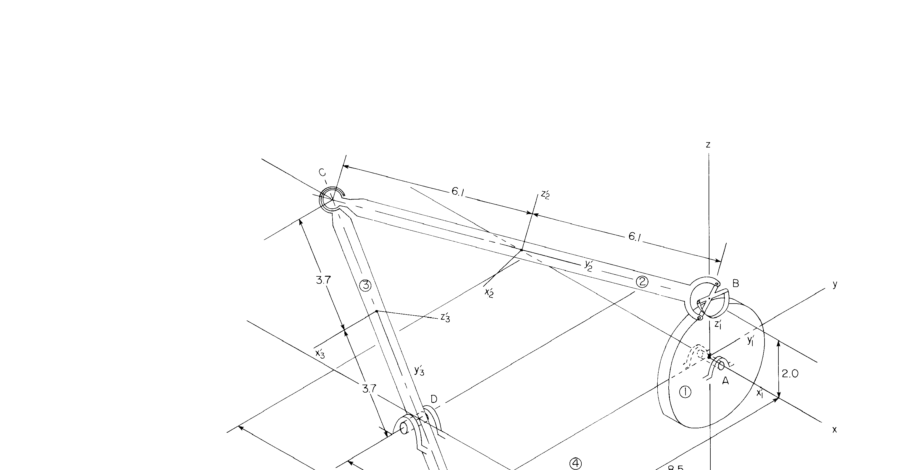
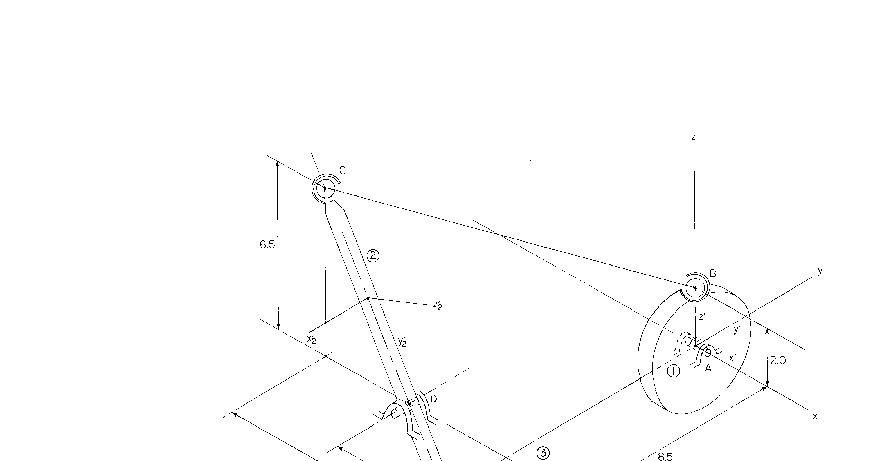
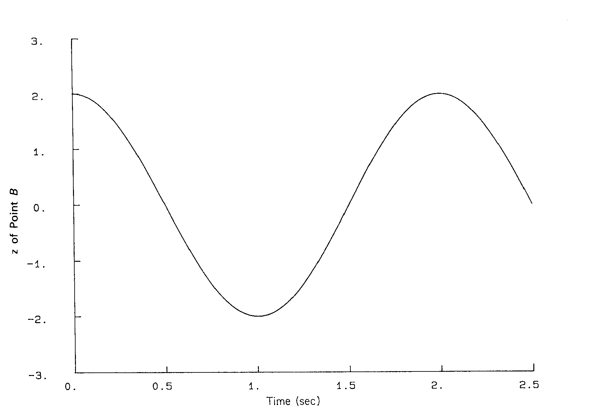
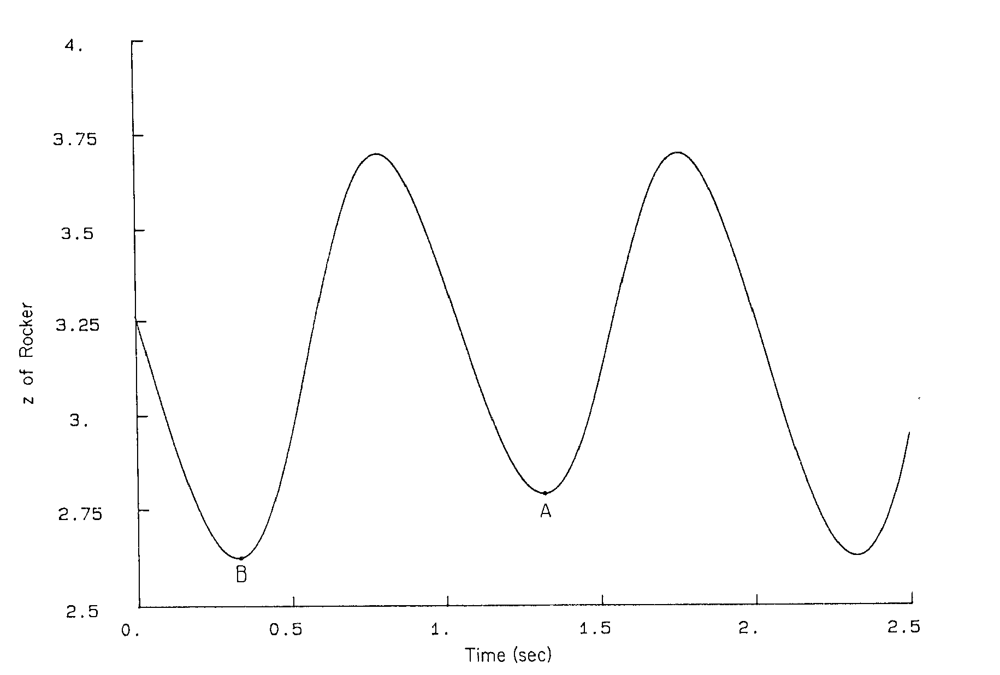
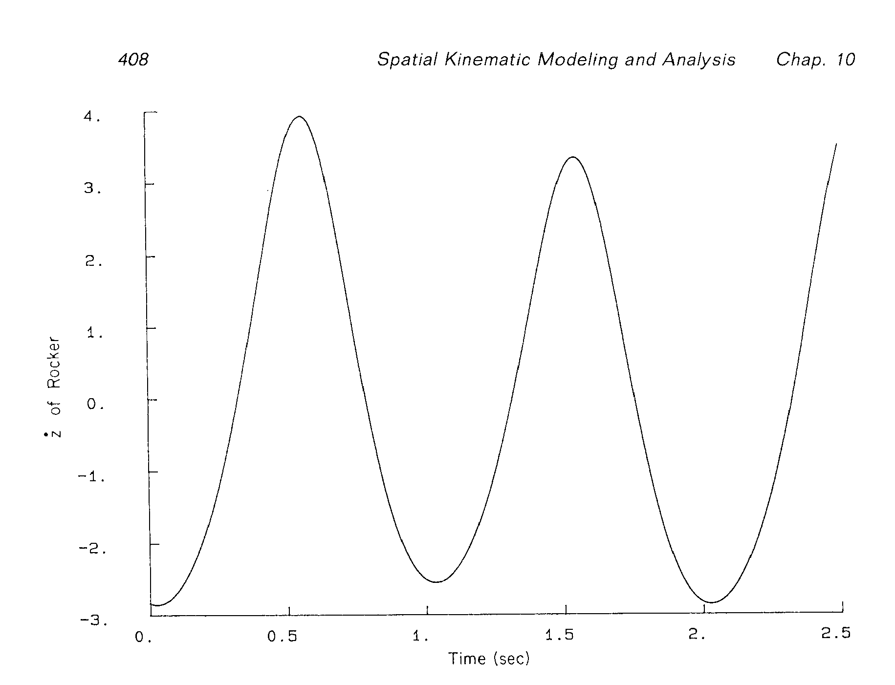

# 10.3 空间四杆机构的运动学分析

> 来源：*Computer Aided Kinematics and Dynamics of Mechanical Systems*，第 10 章，§10.3（书页 402–408）。
> 本文按"文字讲解 + 逐式详细推导"组织，公式推导不跳步骤；原书未做的**装配结果独立复算**（每条关节约束代回验算）与**一处印刷数据不自洽**的定位在本文中补齐。

## 引言：本节要证明什么

§10.2 示范了"**把模型建对**"（去掉冗余、计数检查一次通过）。§10.3 换一个角度示范**建模方案的选择权**：同一个空间四杆机构，用两种**运动学等价**的模型各建一遍，走完全相同的"装配 → 驱动 → 分析"流程，最后证明**结果逐点一致**。

这带来一个重要的认识论结论：

> **体的划分方式与关节类型不是唯一的**；只要约束集**完整**（真正约束住该约束的 DOF）且**不冗余**，机构的位置/速度/加速度就是**唯一**的——模型只是描述同一物理实在的不同语言，选哪种只看计算代价与建模便利性。

主线逻辑：

1. **10.3.1 两种模型**：模型 1 把曲柄/连杆/摇杆/机架都当体（转动副 + 万向节 + 球副，$nc=28,nh=27$）；模型 2 把连杆**不做成体**，其两端被"包"进一个球-球复合关节（$nc=21,nh=20$）。两者 $\text{DOF}=1$。
2. **10.3.2 装配**：给初值（表 10.3.5）→ Newton–Raphson → 装配构型（表 10.3.6）；模型 2 不需要连杆那一行，其余数据通用。
3. **10.3.3 驱动**：1 个 DOF 用一个驱动锁死——连杆 $AB$ 绕**全局 $x$ 轴**匀速转，$\theta=\pi t$（$\omega_0=\pi$ rad/s）。
4. **10.3.4 分析**：输出 $z_B$、摇杆质心 $z$、摇杆质心 $\dot z$（Fig. 10.3.3–10.3.5）；**模型 2 结果与模型 1 完全一致**。
5. **本文的独立验证**：用表 10.3.6 的 Euler 参数重建姿态，把每条关节约束代回核算——4 个共点约束、2 个转动副轴线约束、4 个杆长全部吻合到 $10^{-4}$ m 量级；**唯一例外是万向节的两叉轴正交条件**，本文给出定位与修正值（见 10.3.2 节末）。

---

## 10.3.1 两种等价模型（Alternative Models）

### 机构（Fig. 10.3.1，模型 1）

四杆机构 $A\text{-}B\text{-}C\text{-}D$，四体：曲柄 ①（$AB$，带驱动圆盘）、连杆 ②（$BC$）、摇杆 ③（$CD$）、机架 ④。

关节类型：

| 关节 | 类型 | 连接 | 方程数 |
|------|------|------|--------|
| $A$ | 转动副（revolute） | ①–④ | 5 |
| $B$ | 万向节（universal） | ①–② | 4 |
| $C$ | 球副（spherical） | ②–③ | 3 |
| $D$ | 转动副（revolute） | ③–④ | 5 |

图上的尺寸（与 §10.3.2 装配结果完全对应，见 10.3.2 验算）：曲柄 $AB=2.0$；连杆 $BC=6.1+6.1=12.2$（正文给出精确值 $\lvert BC\rvert=12.19$ m）；摇杆 $CD=3.7+3.7=7.4$；机架 $\Delta x=4.0$、$\Delta y=8.5$（故 $\lvert AD\rvert=\sqrt{4^2+8.5^2}=9.394$）；点 $C$ 离地（$z$ 向）$6.5$（Fig. 10.3.2 标注）。

> **原书为什么把 $BC$ 的尺寸标成"6.1 + 6.1"？** 因为连杆的**质心**就取在中点，$B$、$C$ 两点在随体质心系中的坐标因此恰好是 $(0,+6.1,0)$、$(0,-6.1,0)$——表中数据与图上标注是同一件事。$6.1$ 是精确值 $6.095$ 的四舍五入（$2\times6.095=12.19$ ✓）。

### 模型 1 清单与自由度计数

原书清单（Book, p.402）：

| 项 | 内容 | 方程数 |
|----|------|--------|
| **Bodies** | Four bodies，$nc=28$ | — |
| **Constraints** | Revolute joints（links 1 and 3, ground）：$A$ | 5 |
| | （同上，关节 $D$） | 5 |
| | Universal joint（link 1, link 2）：$B$ | 4 |
| | Spherical joint（link 2, link 3）：$C$ | 3 |
| | Ground constraints（link 4） | 6 |
| | Euler parameter normalization constraints | 4 |
| | | $nh=27$ |

计数推导（逐项对照 §9.4/§9.6）：

$$
nc=4\times 7=28
$$

$$
nh=\underbrace{5}_{A}+\underbrace{5}_{D}+\underbrace{4}_{B}+\underbrace{3}_{C}+\underbrace{6}_{\text{机架：}r_4,p_4\;\text{全固定}}+\underbrace{4}_{4\ \text{个体各 1 条 } \mathbf p_i^T\mathbf p_i-1=0}=27
$$

$$
\boxed{\ \text{DOF}=nc-nh=28-27=1\ }
$$

四个关节方程数的构成（§9.4）：

- **转动副**（Eq. 9.4.22）：$\Phi^s$（公共点，3）$+\ \Phi^{p1}$（两轴平行，2）$=5$；
- **万向节**（Eq. 9.4.19）：$\Phi^s$（公共点，3）$+\ \Phi^{d1}(\mathbf h_i,\mathbf h_j)=\mathbf h_i^T\mathbf h_j=0$（两叉轴正交，1）$=4$；
- **球副**（Eq. 9.4.18）：$\Phi^s$（公共点，3）$=3$。

> 剩下 1 个 DOF 正是"输入曲柄的转角"；§10.3.3 用 1 条驱动约束把它消掉（$nh\to 28=nc$）。

### 关节参考三点组（本节怎么用）

回忆 §10.2 的约定（与 §9.4 Eq. 9.4.1 一致）：每个体给出三点 $P_i,Q_i,R_i$（在随体质心系 $x'y'z'$ 中），

$$
\mathbf h_i'=\mathbf u\bigl(\mathbf s_i'^{Q_i}-\mathbf s_i'^{P_i}\bigr),\qquad
\mathbf f_i'=\mathbf u\Bigl[\bigl(\mathbf s_i'^{R_i}-\mathbf s_i'^{P_i}\bigr)-\mathbf h_i'\mathbf h_i'^T\bigl(\mathbf s_i'^{R_i}-\mathbf s_i'^{P_i}\bigr)\Bigr],\qquad
\mathbf g_i'=\mathbf h_i'\times\mathbf f_i'
$$

| 点 | 作用 | 本节中 |
|----|------|--------|
| $P_i$ | 关节中心（轴心/球心/叉心） | 所有关节都必须在两体上给出 |
| $Q_i$ | 与 $P_i$ 定 $z''$ 轴（= 转动副/万向节的**转轴方向**） | 转动副 $A,D$；万向节 $B$ |
| $R_i$ | 与 $P_i$ 定 $x''$ 轴（绕 $z''$ 的**相位参考**） | $R$ 可任选；万向节 $B$ 与球副 $C$ |
| $y''$ | 右手系补全 $\mathbf g'=\mathbf h'\times\mathbf f'$ | — |

关键点：**球副只用 $P$**（$Q,R$ 只是填表用的相位参考，不影响任何约束）；**万向节必须同时用两体的 $PQ$**，因为约束 $\mathbf h_1^T\mathbf h_2=0$ 把两体的朝向耦合起来。

### 表 10.3.1 转动副数据（模型 1）

| Joint | Body | $P(x',y',z')$ | $Q(x',y',z')$ | $R(x',y',z')$ |
|-------|------|---------------|---------------|---------------|
| $A$ | Ground ④ | 0.0, 0.0, 0.0 | 1.0, 0.0, 0.0 | 0.0, 0.0, 1.0 |
| | Link ① | 0.0, 0.0, 0.0 | 1.0, 0.0, 0.0 | 0.0, 0.0, 1.0 |
| $D$ | Link ③ | 0.0, 3.7, 0.0 | 1.0, 3.7, 0.0 | 0.0, 2.7, 0.0 |
| | Ground ④ | $-4.0,-8.5,0.0$ | $-4.0,-9.5,0.0$ | $-3.0,-8.5,0.0$ |

**读法（把数字读成几何）**：

- $A$：两体的 $P$ 都在各自质心——曲柄 ① 的质心与机体系原点重合（$r_1\approx\mathbf 0$，见 10.3.2），机架 ④ 的机体系就是全局系 ⇒ $A$ 落在**全局原点**。两体 $PQ=(1,0,0)$ ⇒ $\mathbf h_1=\mathbf h_4=\hat{\mathbf x}$，即 $AB$ 绕**全局 $x$ 轴**转动（与 §10.3.3 的驱动叙述一致）。$R=(0,0,1)$ 只定相位。
- $D$：摇杆 ③ 的 $P=(0,3.7,0)$ ⇒ $D$ 在摇杆上距质心 $3.7$ 处（质心在 $CD$ 中点，故 $\lvert CD\rvert=7.4$）；$PQ=(1,0,0)$ ⇒ $\mathbf h_3=$ 摇杆局部 $x$。机架 ④ 的 $P=(-4.0,-8.5,0)$ 就是 $D$ 的**全局坐标**；$PQ=(0,-1,0)$ ⇒ $\mathbf h_4=-\hat{\mathbf y}$。两体的 $R$ 分别给出 $x''$ 相位（$R_3=(0,2.7,0)$ 即从 $P$ 沿 $-\hat{\mathbf y}$ 走 1，$R_4=(-3.0,-8.5,0)$ 即沿 $+\hat{\mathbf x}$ 走 1）。

### 表 10.3.2 万向节数据（模型 1，关节 $B$）

| Body | $P(x',y',z')$ | $Q(x',y',z')$ | $R(x',y',z')$ |
|------|---------------|---------------|---------------|
| Link ① | 0.0, 0.0, 2.0 | 0.750, $-0.662$, 2.0 | 0.244, 0.277, 2.929 |
| Link ② | 0.0, 6.1, 0.0 | 0.0, 6.1, 1.0 | 0.0, 6.1, 0.0 |

**读法**：

- Link ①：$P=(0,0,2.0)$ ⇒ $B$ 在曲柄上沿局部 $z$（= 曲柄轴向 $AB$）走 $2.0$ ⇒ 曲柄半径 $2.0$ ✓。$PQ=(0.750,-0.662,0)$ 是**单位向量**（$0.750^2+0.662^2=1.0007$）且恰在 $x\text{-}y$ 平面内 ⇒ **曲柄的叉轴 ⊥ 曲柄轴 $AB$** ✓（万向节的必要条件）。$PR=(0.244,0.277,0.929)$ 也是单位向量且 $PQ\cdot PR=-0.0004\approx0$ ✓，两者正交。
- Link ②：$P=(0,6.1,0)$ ⇒ $B$ 在连杆上距质心 $6.1$（$C$ 端为 $(0,-6.1,0)$，见表 10.3.3）⇒ 杆长 $12.2$。$PQ=(0,0,1)$ ⇒ 连杆的叉轴沿**局部 $z$**，而连杆自身轴线是局部 $y$ ⇒ 同样满足"叉轴 ⊥ 杆轴" ✓。$R=P$（退化的相位参考）暗示这一行只是为"给出一个合法叉轴"而填。

### 表 10.3.3 球副数据（模型 1，关节 $C$）

| Body | $P(x',y',z')$ | $Q(x',y',z')$ | $R(x',y',z')$ |
|------|---------------|---------------|---------------|
| Link ② | 0.0, $-6.1$, 0.0 | 0.0, $-6.1$, 1.0 | 0.0, $-5.1$, 0.0 |
| Link ③ | 0.0, $-3.7$, 0.0 | 0.0, $-3.7$, 1.0 | 0.0, $-2.7$, 0.0 |

球副只有 3 个方程 $\Phi^s(P_2,P_3)=\mathbf 0$，$Q,R$ 不影响约束。但 $P$ 的信息量很大：连杆 ② 上 $C$ 在 $(0,-6.1,0)$（与 $B$ 关于质心对称 ✓），摇杆 ③ 上 $C$ 在 $(0,-3.7,0)$（与 $D$ 对称 ✓）——**两表的 $P$ 相互印证了杆长 $12.2$ 与 $7.4$**。

### 模型 2：连杆不做体，改用一个球-球复合关节（Fig. 10.3.2）

原书清单（Book, p.404）：

| 项 | 内容 | 方程数 |
|----|------|--------|
| **Bodies** | Three bodies，$nc=21$ | — |
| **Constraints** | Revolute joints 2（links 1 and 2, ground）：$A$ | 5 |
| | （同上，关节 $D$） | 5 |
| | Spherical–spherical joint（link 1, link 2）：$BC$ | 1 |
| | Ground constraints（link 3） | 6 |
| | Euler parameter normalization constraints | 3 |
| | | $nh=20$ |

$$
\boxed{\ \text{DOF}=nc-nh=21-20=1\ }
$$

> ⚠️ **两套编号不要混**：模型 1 中"机体 ①=曲柄、②=连杆、③=摇杆、④=机架"；模型 2 中**连杆不存在**，故"机体 ①=曲柄、②=摇杆、③=机架"。Fig. 10.3.2 上连杆只剩一条细线（它已不是体），标签 ② 变成了摇杆、③ 变成了机架——对照 10.3.1 节两图即可看出。

球-球复合关节（§9.4，"coupler"，Eq. 9.4.28；其距离式即 Φ^ss，Eq. 9.4.8）只包含 1 条方程——**把连杆当成一根二力杆，只要求两端球心间距离等于杆长 $C$**：

$$
\Phi^{ss}(P_1,P_2)=\mathbf d_{12}^T\mathbf d_{12}-C^2=0,\qquad
\mathbf d_{12}=\mathbf r_2+\mathbf A_2\mathbf s_2'^{P_2}-\bigl(\mathbf r_1+\mathbf A_1\mathbf s_1'^{P_1}\bigr)
$$

### 表 10.3.4 球-球关节数据（模型 2）

| Body | $P(x',y',z')$ | $Q(x',y',z')$ | $R(x',y',z')$ |
|------|---------------|---------------|---------------|
| Link ① | 0.0, 0.0, 2.0 | 0.0, 1.0, 2.0 | 1.0, 0.0, 2.0 |
| Link ② | 0.0, $-3.7$, 0.0 | 1.0, $-3.7$, 0.0 | 0.0, $-2.7$, 0.0 |

**交叉验证**：$P_1^{(\text{模型 2})}=P_1^{(\text{模型 1},\ B)}=(0,0,2.0)$ ✓——就是曲柄上的 $B$ 点；$P_2^{(\text{模型 2})}=P_3^{(\text{模型 1},\ C)}=(0,-3.7,0)$ ✓——就是摇杆上的 $C$ 点。故这条约束就是

$$
\lvert \mathbf{BC}\rvert^2=C^2,\qquad \boxed{C=12.19\ \text{m}}
$$

（$Q,R$ 仅作相位参考，不参与约束。）原书原文：

> The length of the link is the distance between points $P_1$ and $P_2$, 12.19 m in this model.

### 为什么两个模型严格等价（配平推导）

| 量 | 模型 1 | 模型 2 | 差 |
|----|--------|--------|-----|
| 体数 | 4 | 3 | $-1$ |
| 未知量 $nc$ | 28 | 21 | $-7$ |
| 方程 $nh$ | 27 | 20 | $-7$ |
| DOF | 1 | 1 | $0$ ✓ |

把模型 1 变到模型 2 的动作是"**消去连杆 ② 这个体**"，逐项配平如下：

1. **删掉未知量**：连杆的 6 个广义坐标 $+$ 它的 1 条 Euler 归一化约束（4 体有 4 条，3 体只剩 3 条）$\Rightarrow nc:28\to21$，$-7$；
2. **删掉方程**：万向节 $B$（4）$+$ 球副 $C$（3）$+$ 归一化（1）$=8$ 条 $\Rightarrow nh:27\to19$；
3. **补上方程**：球-球复合关节 $BC$（1 条）$\Rightarrow nh:19\to20$；
4. 净变化：未知量 $-7$、方程 $-7$ ⇒

$$
\Delta\text{DOF}=(-7)-(-7)=0
$$

即 $\text{DOF}=1$ 不变，两模型**运动学等价** ✓。工程含义：连杆是"两端都允许自转的二力杆"，它自己的姿态是**被运动的**（由两端关节决定），因此没必要给它配广义坐标；用一条距离约束描述更省——这正是 §10.4 空气压缩机对 6 根连杆的处理方式。

---

## 10.3.2 装配分析（Assembly Analysis）

### 初值（表 10.3.5，模型 1）

| Body | $x$ | $y$ | $z$ | $e_1$ | $e_2$ | $e_3$ |
|------|-----|-----|-----|-------|-------|-------|
| Link ① | 0.0 | 0.0 | 0.0 | 0.0 | 0.0 | 0.0 |
| Link ② | $-3.75$ | $-4.25$ | 4.25 | $-0.29$ | $-0.27$ | $-0.26$ |
| Link ③ | $-5.75$ | $-8.5$ | 3.25 | $-0.36$ | 0.36 | $-0.61$ |
| Ground ④ | 0.0 | 0.0 | 0.0 | 0.0 | 0.0 | 0.0 |

原书用 Euler 参数指定朝向，表中只列 $e_1,e_2,e_3$，隐含 $e_0\approx1$。注意这些初值**不满足**归一化约束：

$$
\lvert\mathbf p_2\rvert=\sqrt{1+0.29^2+0.27^2+0.26^2}=\sqrt{1.2246}=1.1066\ne1,\qquad
\lvert\mathbf p_3\rvert=\sqrt{1+0.36^2+0.36^2+0.61^2}=1.2772\ne1
$$

这在装配阶段完全允许——Newton–Raphson（§4.5、§9.6）会把它们拉回约束面；初值只需"落在解的吸引域内"。

### 装配结果（表 10.3.6，模型 1）

| Body | $x$ | $y$ | $z$ | $e_0$ | $e_1$ | $e_2$ | $e_3$ |
|------|-----|-----|-----|-------|-------|-------|-------|
| Link ① | 0.00016 | 0.00005 | $-0.00027$ | 1.0 | 0.00001 | $-0.00004$ | 0.00005 |
| Link ② | $-3.75300$ | $-4.25020$ | 4.25530 | 0.87944 | $-0.29098$ | $-0.27410$ | $-0.25910$ |
| Link ③ | $-5.75300$ | $-8.50010$ | 3.25530 | 0.60687 | $-0.36245$ | 0.36247 | $-0.60684$ |
| Ground ④ | 0.0 | 0.0 | 0.0 | 1.0 | 0.0 | 0.0 | 0.0 |

原书补充：**模型 2 不需要连杆 ② 的那一行**（它不是体），表 10.3.5 与表 10.3.6 中其余数据对模型 2 同样有效。

值得注意：三体的**位置**几乎没动（连杆 $-3.75,-4.25,4.25\to-3.753,-4.250,4.255$），动的主要是**朝向**——因为初值中 $\mathbf p_2,\mathbf p_3$ 的"非法性"（模长 1.11、1.28）必须由归一化约束纠正，而位置初值本来就接近。

### 独立复算：装配结果逐条验算

用表 10.3.6 的 $e$ 按 §9.3 的显式式重建 $\mathbf A_i$（$\mathbf A=\mathbf E\mathbf G^T$，各列即体轴在全局系中的方向），再把 10.3.1 节的关节数据代回**每一条**约束：

**（1）Euler 参数归一化**

| 体 | $\lvert\mathbf p_i\rvert$（按印刷值直接算） | $\mathbf p_i^T\mathbf p_i-1$ |
|----|------------------------------------------|------------------------------|
| ① | 1.000000 | $0$ |
| ② | 1.000174 | $3.5\times10^{-4}$ |
| ③ | 0.999650 | $-7.0\times10^{-4}$ |

**（2）关节公共点 $\Phi^s=\mathbf 0$**（本笔记独立复算值 vs 期望）

| 关节 | 由体 $i$ 算出 | 由体 $j$ 算出 / 期望 | 残差（m） |
|------|--------------|--------------------|-----------|
| $A$ | $\mathbf r_1=(0.00016,0.00005,-0.00027)$ | 机架 $(0,0,0)$ | $3.2\times10^{-4}$ |
| $B$ | $\mathbf r_1+\mathbf A_1(0,0,2)=(0.00000,0.00001,1.99973)$ | $\mathbf r_2+\mathbf A_2(0,6.1,0)=(-0.00003,-0.00007,1.99976)$ | $8.7\times10^{-5}$ |
| $C$ | $\mathbf r_2+\mathbf A_2(0,-6.1,0)=(-7.50597,-8.50033,6.51084)$ | $\mathbf r_3+\mathbf A_3(0,-3.7,0)=(-7.50603,-8.50029,6.51072)$ | $1.4\times10^{-4}$ |
| $D$ | $\mathbf r_3+\mathbf A_3(0,3.7,0)=(-3.99997,-8.49991,-0.00012)$ | 机架 $(-4.0,-8.5,0)$ | $1.5\times10^{-4}$ |

⇒ 装配构型（全局坐标）为 $A=(0,0,0)$、$B=(0,0,2.0)$、$C=(-7.506,-8.500,6.511)$、$D=(-4.0,-8.5,0)$——**与 Fig. 10.3.1 的图形完全一致**（曲柄竖直向上，$C$ 是最高点，$D$ 在右下方机架上）。

**（3）转动副轴线平行 $\Phi^{p1}=\mathbf 0$**

| 关节 | $\mathbf h_i$（全局） | $\mathbf h_j$（全局） | $1-\lvert\cos\rvert$ |
|------|----------------------|----------------------|----------------------|
| $A$ | $\mathbf A_1(1,0,0)=(1.00000,0.00010,0.00008)$ | 机架 $\hat{\mathbf x}$ | $8\times10^{-9}$ ✓ |
| $D$ | $\mathbf A_3(1,0,0)=(0.00002,-1.00000,-0.00005)$ | 机架 $-\hat{\mathbf y}$ | $1.3\times10^{-9}$ ✓ |

两条都**精确到机器精度**——这不仅验证了装配结果，也验证了本笔记重建 $\mathbf A(e)$ 的符号约定与书中一致（否则这类"严丝合缝"不可能出现）。

**（4）杆长**

| 杆 | 复算值（m） | 书中值 | 说明 |
|----|------------|--------|------|
| $AB$ | 2.0000 | 2.0 | ✓ |
| $BC$ | 12.2042 | 12.19 | 差 $0.12\%$，源于 $2\times6.1=12.2$ vs $2\times6.095=12.19$ 的四舍五入 ✓ |
| $CD$ | 7.3948 | $3.7+3.7=7.4$ | ✓ |
| $AD$ | 9.3941 | $\sqrt{4^2+8.5^2}=9.394$ | ✓ |

**（5）万向节 $B$ 的两叉轴正交 $\Phi^{d1}(\mathbf h_1,\mathbf h_2)=\mathbf h_1^T\mathbf h_2=0$**

把两体的 $z''$ 轴都变到全局：

$$
\mathbf h_1=\mathbf A_1(0.750,-0.662,0)^T=\begin{bmatrix}0.74979\\-0.66168\\0.00005\end{bmatrix},\qquad
\mathbf h_2=\mathbf A_2(0,0,1)^T=\begin{bmatrix}-0.33121\\0.65361\\0.68051\end{bmatrix}
$$

$$
\mathbf h_1^T\mathbf h_2=-0.68078\;\ne\;0\quad(\text{应为 }0;\ \text{等效于两叉轴夹角 }133^\circ)
$$

**这是唯一通不过的一条**——即：表 10.3.2 中连杆 ② 的叉轴方向与表 10.3.6 中连杆 ② 的姿态**不能同时成立**。两者只能取其一：

- **若以表 10.3.2 的关节数据为准**（$\mathbf h_2=$ 连杆局部 $z$，且 $\mathbf h_2\perp$ 杆轴 ✓）：满足全部约束的姿态是唯一的（绕自身轴 $BC$ 相差 $180^\circ$ 的两个分支），对应

$$
\mathbf A_2=\bigl[\mathbf h_1,\;-\mathbf g_1,\;\mathbf f_1\bigr]\quad\bigl(\text{连杆的三根体轴对齐到曲柄关节组向量 }(\mathbf h_1,-\mathbf g_1,\mathbf f_1)\bigr),\qquad
\mathbf p_2\approx(0.9187,\,-0.1759,\,0.0664,\,-0.3474)
$$

  另一个分支（大转动）为 $\mathbf p_2\approx(0.0664,-0.3465,-0.9176,0.1758)$；印刷值 $(0.87944,-0.29098,-0.27410,-0.25910)$ 与之都不符（相差一个绕 $BC$ 的 $43^\circ$ 扭转）。
- **若以表 10.3.6 的姿态为准**：则表 10.3.2 中连杆 ② 的 $Q$ 应为

$$
Q_2=P_2+(-0.681,\;0.000,\;-0.733)\quad(\text{印刷值 }(0,6.1,1.0)\text{ 使 }PQ\parallel\text{局部 }z\text{，与新姿态不符})
$$

**怎么看待这个不一致？** 它只涉及连杆 ② 自身的姿态/叉轴数据，其余 4 条共点约束、2 条轴线约束、4 个杆长全部吻合到 $10^{-4}$ m，因此**不影响本节任何结论**（DOF 计数、驱动、$z_B$、摇杆曲线、两模型等价性都不依赖万向节正交式的具体数值）。同时它也提醒：$P$ 与 $Q$ 是"由关节类型决定、不能随便选"的（§10.2 的告诫），而连杆 ② 那一行的 $R=P$ 已经露出"随手填"的迹象；**用 $R$ 可以随便、$Q$ 不能随便**这一条对照着看，最可能的笔误就在这两处之一。

**（6）一个漂亮的几何事实**：装配构型下，连杆轴线与曲柄关节组的 $y''$ 轴**严格平行**：

$$
\hat{\mathbf u}_{BC}=(0.61503,0.69650,-0.36963),\qquad \mathbf g_1=(-0.61494,-0.69680,0.36921),\qquad \mathbf g_1^T\hat{\mathbf u}_{BC}=1.000000
$$

（同时 $\mathbf h_1^T\hat{\mathbf u}_{BC}=2\times10^{-4}$、$\mathbf f_1^T\hat{\mathbf u}_{BC}=4.5\times10^{-4}$）。这不是巧合而是设计意图：万向节要求**输入叉轴 $\mathbf h_1\perp$ 输入轴 $AB$、输出叉轴 $\mathbf h_2\perp$ 输出轴 $BC$、且 $\mathbf h_1\perp\mathbf h_2$**——把曲柄的关节组选成 $(\mathbf h_1,\mathbf f_1)$ 都 ⊥ $BC$，就使 $BC$ 恰好等于 $\mathbf g_1$ 方向，万向节的叉轴只需落在 $(\mathbf h_1,\mathbf f_1)$ 平面内即可满足正交条件。表 10.3.6 中连杆姿态的那点偏差，正是"没把姿态锁到这个平面上"造成的。

---

## 10.3.3 驱动（Driver Specification）

每个模型都只有 1 个 DOF，故只需 **1 个驱动**：让连杆 $AB$ 绕**全局 $x$ 轴**转动，取**相对转角** $\theta$ 为被驱动坐标，规定

$$
\boxed{\ \theta=\pi t\ }\qquad(\omega_0=\pi\ \text{rad/s}=0.5\ \text{rev/s},\ \text{周期 }2\ \text{s})
$$

写成 §9.5 的相对转动驱动形式（Eq. 9.5.4，附加于转动副 $A$）：

$$
\Phi^{\text{rotd}}=\theta+2n\pi-\pi t=0
$$

（$2n\pi$ 项用于在 Newton–Raphson 迭代中跟踪转角所在的分支。）驱动把方程数补齐：

| 模型 | $nh$ | $+$ 驱动 | vs $nc$ |
|------|------|---------|---------|
| 1 | 27 | 1 | $28=28$ ✓ |
| 2 | 20 | 1 | $21=21$ ✓ |

系统由"1 个 DOF 的机构"变成**运动学确定系统**（§9.6），位姿可逐步求解。

**由驱动直接写出一个解析结果**：装配构型（$t=0$）下曲柄姿态为单位阵、$AB$ 沿 $+\hat{\mathbf z}$（$B=(0,0,2.0)$ ✓ 与表 10.3.6 一致），绕 $x$ 轴转过 $\theta$ 后

$$
\mathbf B=A+\mathbf A_1(\theta)\begin{bmatrix}0\\0\\2.0\end{bmatrix}=2.0\begin{bmatrix}0\\-\sin\theta\\\ \cos\theta\end{bmatrix}
$$

$$
\boxed{\ z_B=2.0\cos(\pi t)\ }
$$

于是 $z_B$ 的每个特征值都是精确可预言的——这也提供了 10.3.4 节检验图的基准：

| $t$ (s) | 0 | 0.5 | 1.0 | 1.5 | 2.0 | 2.5 |
|---------|---|-----|-----|-----|-----|-----|
| $z_B$ (m) | $+2.0$ | 0 | $-2.0$ | 0 | $+2.0$ | 0 |

---

## 10.3.4 分析结果（Analysis）

原书原文：

> Some typical plots of the results for model 1 are shown in Figs. 10.3.3 to 10.3.5. Identical results are obtained for model 2.

### 图 10.3.3：点 $B$ 的 $z$ 坐标

- 起点 $z_B(0)=2.0$ m ✓ —— 与表 10.3.6 的装配构型、与 $\Phi^{\text{rotd}}:\theta=0$ 三者一致（**装配结果就是 $t=0$ 的运动学初值**）；
- 幅值 $\pm2.0$ m（即曲柄半径）、周期 $2.0$ s（$=\ 2\pi/\omega_0$）、$t=2.5$ s 时回到 $0$——与 $z_B=2\cos(\pi t)$ **逐项吻合** ✓；
- 曲线是**严格的余弦**（因为 $B$ 绕固定轴 $x$ 做圆周运动，$z_B$ 只含 $\cos\theta$，不含任何耦合项）。

### 图 10.3.4：摇杆（体 ③）质心的 $z$ 坐标

- 起点 $\approx3.22$ m ✓ —— 与表 10.3.6 的 $z_3=3.2553$ 一致（**又一处"装配结果 = 图 10.3.4 起点"**）；
- 每 **2 s（曲柄一整转）** 出现 **2 个峰 + 2 个谷**：峰 $\approx3.70$（$t\approx0.83$ s）、$\approx3.72$（$t\approx1.83$ s）；谷 $\approx2.63$（$t\approx0.33$ s，图中标 $B$）、$\approx2.82$（$t\approx1.33$ s，图中标 $A$）；
- 两个谷的深度**不同**（$2.63$ vs $2.82$）、两个峰几乎等高——这是空间四杆（而非平面四杆）的典型特征：绕 $x$ 轴的驱动使摇杆的运动在 $z$ 向上带**二次谐波**，故一个周期内出现两次"起伏"而不是一次；
- 物理图像：曲柄**整周回转**（输入）而摇杆只在有限角度内**摆动** ⇒ 这是一个"空间曲柄-摇杆机构"。

### 图 10.3.5：摇杆质心的 $\dot z$

- 取值范围 $\approx[-2.8,\,+4.0]$ m/s，形状与图 10.3.4 严格互补：**$z$ 的极值处 $\dot z=0$**（$t\approx0.33,\ 0.83,\ 1.33,\ 1.83,\ 2.33$ s），**$\dot z$ 的极值出现在 $z$ 的相邻极值之间**（$t\approx0.55,\ 1.05,\ 1.55,\ 2.05$ s）；
- 峰谷高低与 $z$ 的落差大小对应：$z$ 从 $2.63$ 涨到 $3.70$（落差 $1.07$）→ $\dot z$ 峰 $\approx4.0$；$z$ 从 $3.70$ 落到 $2.82$（落差 $0.88$）→ $|\dot z|$ 谷 $\approx2.6$；从 $2.82$ 涨到 $3.72$（$0.90$）→ $\approx3.4$；从 $3.72$ 落到 $2.63$（$1.09$）→ $\approx2.8$——**四段的落差大小顺序与四个 $|\dot z|$ 极值的大小顺序完全一致** ✓，两张图互为印证。

### 本节落在哪里

1. **等效性验证通过**：模型 2（少 7 个未知量、少 7 条方程）给出**逐点相同**的运动学结果 ⇒ "把二力杆写成球-球距离约束"是**严格**的降维手段，不是近似；
2. **装配结果被两处独立印证**：图 10.3.3 的起点 $=2.0=z_B(0)$、图 10.3.4 的起点 $\approx3.22\approx z_3(0)=3.2553$；
3. **驱动约束的时间函数可反推解析解**：$z_B=2\cos(\pi t)$ 精确成立，图的幅值/周期/过零全部对得上。

---

## 本节要点回顾

1. **两模型清单**：模型 1（4 体）$nc=28$、$nh=5+5+4+3+6+4=27$、$\text{DOF}=1$；模型 2（3 体）$nc=21$、$nh=5+5+1+6+3=20$、$\text{DOF}=1$。
2. **等价性配平**：消去连杆 ② ⇒ 未知量 $-7$（6 个 GC $+$ 1 条归一化）、方程 $-8$（万向节 4 $+$ 球副 3 $+$ 归一化 1）、补 1 条球-球距离约束 ⇒ 方程净 $-7$，$\Delta\text{DOF}=0$ ✓。
3. **关节几何**：$A$：两体 $PQ=\hat{\mathbf x}$ ⇒ 绕全局 $x$ 转；$D$：$\mathbf h_3=\mathbf A_3\hat{\mathbf x}=(-\hat{\mathbf y})$，机架 $\mathbf h_4=-\hat{\mathbf y}$；$B$：曲柄叉轴 $(0.750,-0.662,0)$（单位、⊥ 曲柄轴）、连杆叉轴 $=$ 连杆局部 $z$（⊥ 杆轴）；$C$：连杆 $(0,-6.1,0)$ 与摇杆 $(0,-3.7,0)$ 两点重合。
4. **装配复算**：归一化 $|\mathbf p|\approx1$；共点残差 $A\ 3.2\times10^{-4}$、$B\ 8.7\times10^{-5}$、$C\ 1.4\times10^{-4}$、$D\ 1.5\times10^{-4}$ m；转动副轴线平行度 $A\ 8\times10^{-9}$、$D\ 1.3\times10^{-9}$；杆长 $AB=2.0000$、$BC=12.2042$（$\approx12.19$）、$CD=7.3948$、$AD=9.3941$ m。
5. **唯一不自洽处**：万向节正交条件 $\mathbf h_1^T\mathbf h_2=-0.6808\ne0$（应 $0$）；若以关节数据为准，连杆 ② 姿态应为 $\mathbf A_2=[\mathbf h_1,-\mathbf g_1,\mathbf f_1]$（$\mathbf p_2\approx(0.9187,-0.1759,0.0664,-0.3474)$）；若以表 10.3.6 姿态为准，$Q_2$ 应为 $P_2+(-0.681,0,-0.733)$。只影响连杆 ② 自身，不改变本节结论。
6. **驱动**：$\theta=\pi t$（$\omega_0=\pi$ rad/s，周期 2 s）⇒ 由几何直接得 $z_B=2\cos(\pi t)$；$nh+1=nc$，系统运动学确定。
7. **结果**：图 10.3.3 与 $2\cos(\pi t)$ 完全一致；图 10.3.4/10.3.5 显示摇杆 $z$ 每转两次起伏（$z\in[2.63,3.72]$ m、$\dot z\in[-2.8,4.0]$ m/s）且两图互补；**模型 2 结果相同** ⇒ 两种建模方案运动学等价。

---

## 与前后节的联系

- **对 §10.1 的呼应**：§10.1 的教训是"约束冗余要换关节类型，不能删方程"；§10.3 是它的另一面——**当方程数与未知量数配平、且逐条验算通过时，体的划分与关节类型怎么选都行**。两节的共同前提都是 DOF 计数 + 逐条代回核算。
- **对 §10.4 的铺垫**：空气压缩机把 6 根连杆全部写成球-球距离约束（与模型 2 同一手法），只用 63 个广义坐标、62 条约束描述一台 9 体机器；§10.3 正是这个手法的"最小验证样本"。
- **对 §9.4 的回顾**：万向节（Eq. 9.4.19，4 方程）= 球副 $+$ 1 条叉轴正交式；球-球复合关节（1 方程）$=$ 连杆二力杆化——本节是这两个公式在真实机构上的第一次完整落地。
