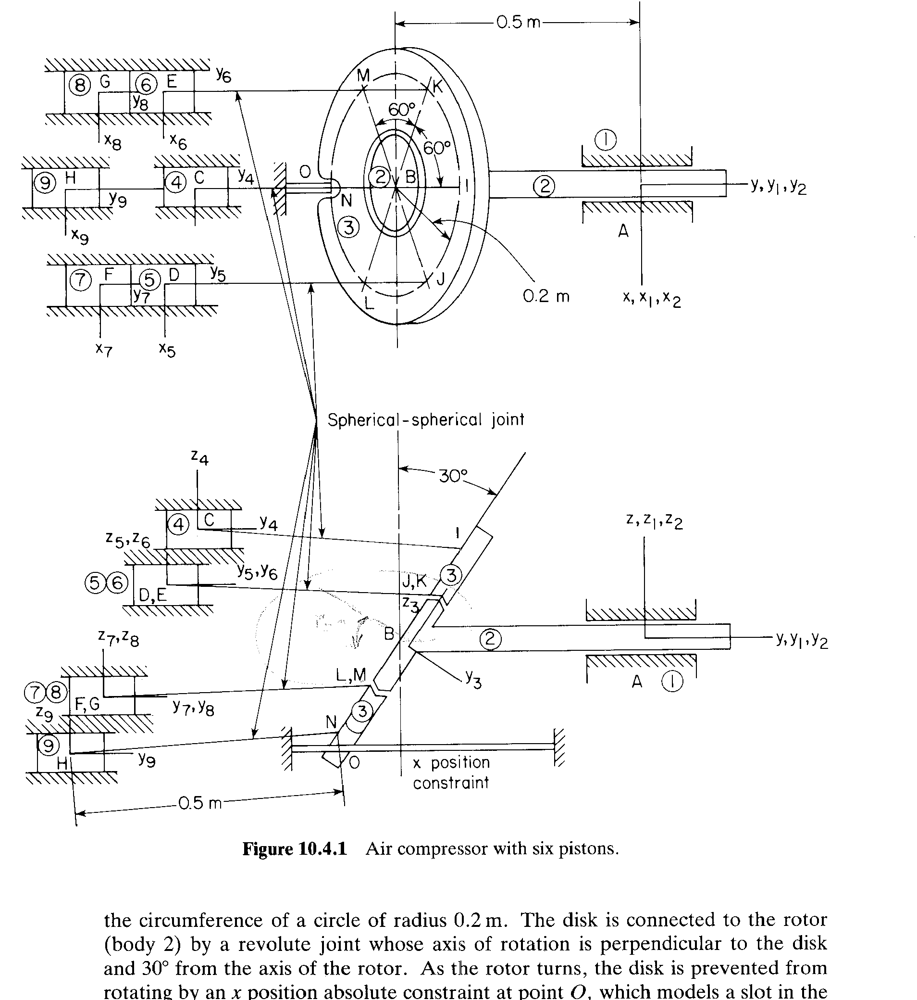
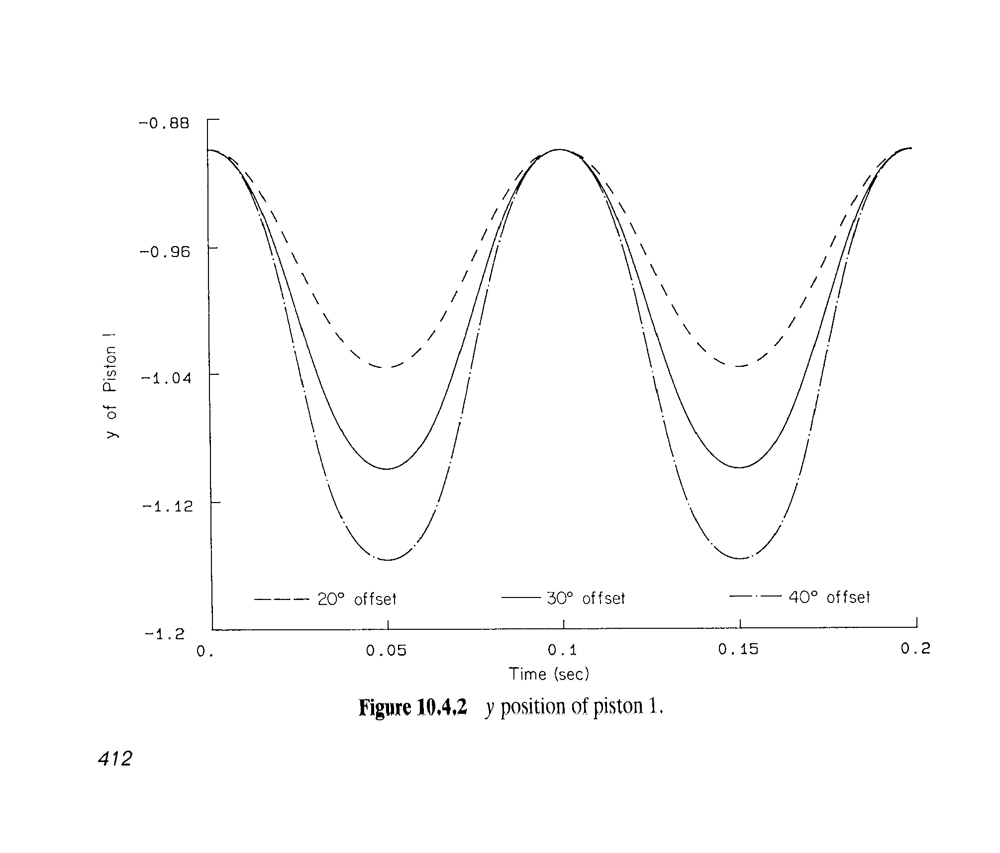
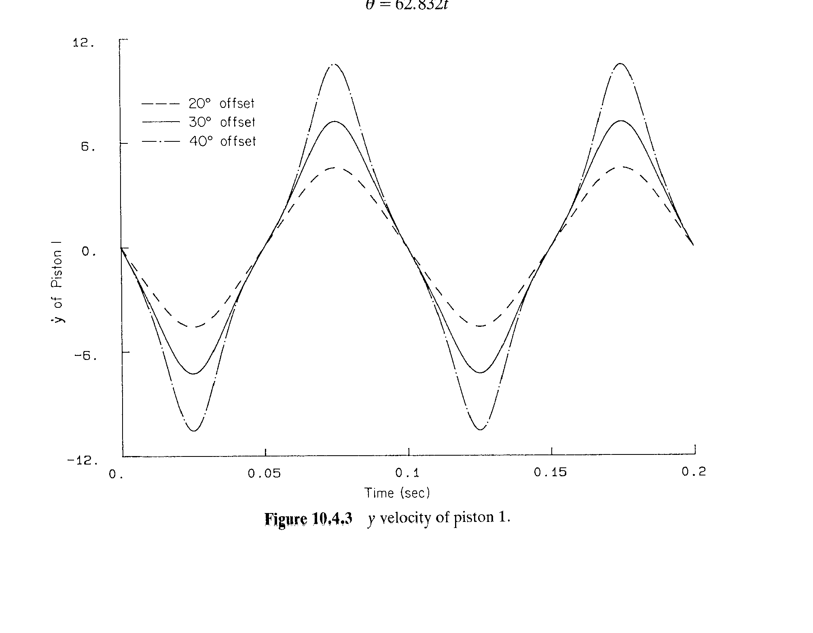
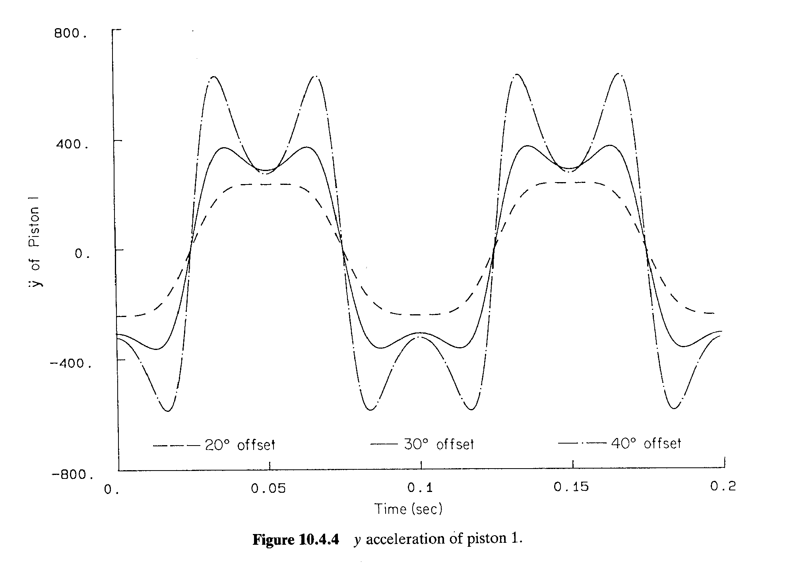

# 10.4 空气压缩机的运动学分析

> 来源：*Computer Aided Kinematics and Dynamics of Mechanical Systems*，第 10 章，§10.4（书页 408–414）。
> 本文按"文字讲解 + 逐式详细推导"组织，公式推导不跳步骤；原书未给出的**装配结果独立复算**、**活塞运动的解析解**（含"为什么 40° 偏置角最极端"）与**一处印刷数据错误**的定位在本文中补齐。

## 引言：本节要解决什么

§10.1 诊断了空间建模的唯一真难点——**约束冗余**；§10.2 示范"换关节类型消冗余"；§10.3 示范"运动学等价的模型可任选"。§10.4 是第 10 章的收官例，处理一台**真实的 9 体机器**（斜盘式六缸空气压缩机），它把前几节的结论全部用上，并最后一次考验建模者的耐心：

> 大系统的建模不是"新理论"，而是**把 §9.4 的关节库逐条查表、逐条配平**。整台机器 63 个广义坐标、62 条约束，里面只有**一条**不是关节约束——盘上 $O$ 点的 $x$ 位置绝对约束，它负责锁死盘的自转。

主线逻辑：

1. **10.4.1 建模**：9 体（机架 ①、转子 ②、斜盘 ③、活塞 ④–⑨），2 个转动副 + 6 个平移副 + 6 条球-球距离约束 + 1 条位置约束 + 6 条地面约束 + 9 条归一化约束，$nc=63$、$nh=62\Rightarrow\text{DOF}=1$。
2. **10.4.2 装配**：给估计值（表 10.4.4）→ Newton–Raphson（§4.5、§9.6）→ 装配构型（表 10.4.5）。本文把每条约束代回核算（见 10.4.2 节末）。
3. **10.4.3 驱动**：唯一 DOF 用**转动副 $A$ 的相对转角**驱动：$600$ rpm $\Rightarrow\theta=62.832t$。
4. **10.4.4 分析**：偏置角取 20°/30°/40° 三次运行，输出活塞 1 的 $y$、$\dot y$、$\ddot y$（Fig. 10.4.2–10.4.4）。
5. **本文补的解析解**：**行程 $=2R_0\sin\alpha$**，即偏置角 $\alpha$ 的正弦决定排量；而"速度/加速度的极端程度"由槽约束引入的**非线性畸变因子** $\cos\alpha/(1-\sin^2\alpha\sin^2\theta)$ 决定——这正是原书"40° 的运行有最极端的速度与加速度变化"这句话的数学内容。

---

## 10.4.1 模型（Model）

### 机构（Fig. 10.4.1）

压缩机有 **6 个活塞**。斜盘（disk，体 ③）上装着 6 根连杆的一端，它们**沿半径 $0.2$ m 的圆周均布、彼此相隔 $60°$**；斜盘与转子（rotor，体 ②）用一个**转动副**相连，该副的转轴**垂直于盘面**、且与**转子轴线成 $30°$**。转子转动时，盘被 $O$ 点的 **$x$ 位置绝对约束**阻止自转——它模拟的是"盘上开一条槽、一根平行于全局 $y$ 轴的导杆穿过该槽"这一实际结构。盘的**摆动（canting）**把转子的旋转变成活塞的往复运动。

与汽车发动机的连杆不同，这里的连杆**两端都是球铰**，因此在模型中被写成**斜盘与活塞之间的球-球距离约束**。

三个"为什么"值得先讲清楚：

| 机构特征 | 物理原因 | 建模后果 |
|----------|----------|----------|
| 连杆两端球铰 | 两端都允许自由自转，连杆成"二力杆" | 用 §9.4 的**球-球复合关节**（Eq. 9.4.28）$\lvert\mathbf d\rvert^2-C^2=0$，**1 方程**；6 根连杆共用 6 条方程，省掉 $6\times7$ 个广义坐标（§10.3 模型 2 的同一手法，此处放大 6 倍） |
| 盘-转子转动副轴线 $\perp$ 盘面、与转子轴成 $30°$ | 这是"斜盘"的定义：盘面被**扳斜**，转子每转一圈，盘的各个点沿 $y$ 向进出一个正弦行程 | 转动副（5 方程，Eq. 9.4.22）；**偏置角 $\alpha=30°$** 就编码在关节数据里（见下文 $0.3660$） |
| 盘上 $O$ 点的 $x$ 位置约束 | 槽 + 平行 $y$ 的导杆：盘上该点只能落在 $x=0$ 平面内 | **绝对位置约束**（Eq. 9.4.16 的单分量版）$x_O=0$，**1 方程**；它消掉盘绕自身法线的自转 DOF（见本节末"为什么不能省"） |

### 模型清单与自由度计数

原书清单（Book, p.410）：

| 项 | 内容 | 方程数 |
|----|------|--------|
| **Bodies** | Nine bodies | $nc=63$ |
| **Constraints** | Revolute joint（①–②）：$A$ | 5 |
| | Revolute joint（②–③）：$B$ | 5 |
| | Translational joints（4,5,6,7,8,9 与 1）：$C,D,E,F,G,H$ | $6\times5$ |
| | Distance constraints（4,5,6,7,8,9 与 3）：$C\!-\!I,\ D\!-\!J,\ E\!-\!K,\ F\!-\!L,\ G\!-\!M,\ H\!-\!N$ | $6\times1$ |
| | Position constraint（body 3）：$O$ | 1 |
| | Ground constraints | 6 |
| | Euler parameter normalization constraints | 9 |
| | | $nh=62$ |

逐项对照 §9.4/§9.6：

$$
nc=9\times7=63
$$

$$
nh=\underbrace{2\times5}_{A,B}+\underbrace{6\times5}_{C\ldots H}+\underbrace{6\times1}_{6\ \text{条球-球}}+\underbrace{1}_{x_O=0}+\underbrace{6}_{\text{机架 ①}}+\underbrace{9}_{\text{9 体各 1 条}}=\,10+30+6+1+6+9=62
$$

$$
\boxed{\ \text{DOF}=nc-nh=63-62=1\ }
$$

其中各关节的方程数来源（§9.4）：

- **转动副**（Eq. 9.4.22）：$\Phi^s$（公共点，3）$+\ \Phi^{p1}$（两轴平行，2）$=5$；
- **平移副**（Eq. 9.4.24）：$\Phi^{p1}$（2）$+\ \Phi^{p2}$（2）$+\ \Phi^{d1}(\mathbf f_i,\mathbf f_j)$（1）$=5$；
- **球-球距离约束**（Eq. 9.4.28，等价于 $\Phi^{ss}$，Eq. 9.4.8）：$1$；
- **位置绝对约束**（Eq. 9.4.16 取 $x$ 分量）：$1$；
- **地面约束**：把机架 ① 的 $\mathbf r_1,\mathbf p_1$ 全部钉死，$3+3$ 个分量各 1 条，$=6$（注意：**机架不是"没有未知量"，它也是 $7$ 个坐标 $+$ 1 条归一化 $+$ 6 条地面约束**，这正是计数能配平的原因）；
- **Euler 参数归一化**（Eq. 9.6.3）：每体 1 条（4 参数 − 3 独立自由度），$=9$。

### 表 10.4.1 转动副数据

| Joint | Body | $P(x',y',z')$ | $Q(x',y',z')$ | $R(x',y',z')$ |
|-------|------|---------------|---------------|---------------|
| $A$ | Ground ① | 0.0, 0.0, 0.0 | 0.0, 1.0, 0.0 | 1.0, 0.0, 0.0 |
| | Rotor ② | 0.0, 0.0, 0.0 | 0.0, 1.0, 0.0 | 1.0, 0.0, 0.0 |
| $B$ | Rotor ② | 0.0, $-0.5$, 0.0 | 0.0, 0.3660, $-0.5$ | 1.0, $-0.5$, 0.0 |
| | Disk ③ | 0.0, 0.0, 0.0 | 0.0, 1.0, 0.0 | 1.0, 0.0, 0.0 |

**读法（把数字读成几何）**：

- $A$：两体的 $P$ 都在各自原点，$PQ=\hat{\mathbf y}$ ⇒ 转轴就是**全局 $y$ 轴**——转子的旋转轴；
- $B$：转子上的 $P=(0,-0.5,0)$、盘上的 $P=(0,0,0)$ ⇒ **盘的原点落在转子上距转子原点 $-0.5\hat{\mathbf y}$ 处**，即 $d=0.5$ m（对应 Fig. 10.4.1 上那个标注 $0.5$ m 的尺寸）；
- $B$ 的转轴方向：转子 $PQ-P=\bigl(0,\,0.3660,\,-0.5\bigr)$。注意

$$
0.3660=\cos30°-\tfrac12=\cos\alpha-\sin\alpha\big|_{\alpha=30°}\ \Longrightarrow\ \mathbf h_2=\bigl(0,\ \cos30°,\ -\sin30°\bigr)=\bigl(0,0.8660,-0.5\bigr),\qquad\lvert\mathbf h_2\rvert=1
$$

  即**转轴在 $y\text{-}z$ 平面内、与转子轴 $\hat{\mathbf y}$ 成 $30°$**——**这就是偏置角的来源** ✓。盘上的 $PQ=\hat{\mathbf y}$（盘体坐标系的 $y'$ 轴），而盘的关节定义系以 $PQ$ 定 $z''$，故

$$
\mathbf h_3=\hat{\mathbf y}'\ (\text{盘体坐标系的 }y'\text{ 轴})=\text{盘面法线}
$$

  两条合起来就读出原书那句话："转动副的轴**垂直于盘面**且与转子轴成 $30°$" ✓。$R$ 两点都取 $(1.0,\cdot,0.0)$ 方向 ⇒ 两体 $x''$ 轴同向（相位对齐，转动副无相对扭转歧义）。

### 表 10.4.2 平移副数据

| Joint | Body | $P(x',y',z')$ | $Q$ | $R$ |
|-------|------|---------------|-----|-----|
| $C$ | Ground ① | 0.0, $-1.0$, 0.2 | 0.0, 0.0, 0.2 | 1.0, $-1.0$, 0.2 |
| | Piston 1 ④ | 0.0, 0.0, 0.0 | 0.0, 1.0, 0.0 | 1.0, 0.0, 0.0 |
| $D$ | Ground ① | 0.1732, $-1.0$, 0.1 | 0.1732, 0.0, 0.1 | 1.1732, $-1.0$, 0.1 |
| | Piston 2 ⑤ | 0.0, 0.0, 0.0 | 0.0, 1.0, 0.0 | 1.0, 0.0, 0.0 |
| $E$ | Ground ① | $-0.1732$, $-1.0$, 0.1 | $-0.1732$, 0.0, 0.1 | 0.8268, $-1.0$, 0.1 |
| | Piston 3 ⑥ | 0.0, 0.0, 0.0 | 0.0, 1.0, 0.0 | 1.0, 0.0, 0.0 |
| $F$ | Ground ① | 0.1732, $-1.0$, $-0.1$ | 0.1732, 0.0, $-0.1$ | 1.1732, $-1.0$, $-0.1$ |
| | Piston 4 ⑦ | 0.0, 0.0, 0.0 | 0.0, 1.0, 0.0 | 1.0, 0.0, 0.0 |
| $G$ | Ground ① | $-0.1732$, $-1.0$, $-0.1$ | $-0.1732$, 0.0, $-0.1$ | 0.8268, $-1.0$, $-0.1$ |
| | Piston 5 ⑧ | 0.0, 0.0, 0.0 | 0.0, 1.0, 0.0 | 1.0, 0.0, 0.0 |
| $H$ | Ground ① | 0.0, $-1.0$, $-0.2$ | 0.0, 0.0, $-0.2$ | 1.0, $-1.0$, $-0.2$ |
| | Piston 6 ⑨ | 0.0, 0.0, 0.0 | 0.0, 1.0, 0.0 | 1.0, 0.0, 0.0 |

**读法**：

- **每个体都取同一个局部三点组**：$Q=P+(0,1,0)$、$R=P+(1,0,0)$。以 $C$ 的机架行为例：$Q-P=(0,1,0)$ ⇒ $z''=\hat{\mathbf y}$，即**滑轨方向 = 全局 $y$** ✓（活塞沿 $y$ 往复 ✓）；$R-P=(1,0,0)$ ⇒ $x''=\hat{\mathbf x}$。**读表技巧：凡看到 $1.1732=0.1732+1$、$0.8268=-0.1732+1$、$Q$ 与 $P$ 只差一个 $y$，都是"$P$ 加减一个单位向量"的痕迹**。
- **6 条滑轨的位置**：机架 $P$ 的 $(x,z)$ 依次为

$$
(0,\ 0.2),\ (0.1732,\ 0.1),\ (-0.1732,\ 0.1),\ (0.1732,\ -0.1),\ (-0.1732,\ -0.1),\ (0,\ -0.2)
$$

  统一写成 $R_0(\cos\psi_k,\ \sin\psi_k)$，$R_0=0.2$，则

$$
\psi_k=90°,\ 30°,\ 150°,\ 330°,\ 210°,\ 270°
$$

  即**六个缸孔沿半径 $0.2$ m 的圆周每 $60°$ 一个** ✓，与"盘上 6 根连杆均布 $60°$"一一对应；数值上 $0.2\cos30°=0.17321$、$0.2\sin30°=0.10000$ ⇒ 表里的 $0.1732$、$0.1$ ✓。
- 所有机架 $P$ 都在 $y=-1.0$ 平面上 ⇒ **缸孔（滑轨）位于全局 $y=-1.0$ 处**，这与 10.4.2 的装配结果（活塞 $y\approx-0.90\sim-1.10$）以及 10.4.4 的解析式 $y=-1+R_0\sin\alpha\sin(\cdot)$ 完全一致 ✓。

### 表 10.4.3 球-球关节数据

| Joint | Body | $P(x',y',z')$ | $Q$ | $R$ | Distance |
|-------|------|---------------|-----|-----|----------|
| $C\!-\!I$ | Disk ③ | 0.0, 0.0, 0.2 | 0.0, 1.0, 0.2 | 1.0, 0.0, 0.2 | 0.5 |
| | Piston 1 ④ | 0.0, 0.0, 0.0 | 0.0, 1.0, 0.0 | 1.0, 0.0, 0.0 | |
| $D\!-\!J$ | Disk ③ | 0.1732, 0.0, 0.1 | 0.1732, 1.0, 0.1 | 1.1732, 0.0, 0.1 | 0.5 |
| | Piston 2 ⑤ | 0.0, 0.0, 0.0 | 0.0, 1.0, 0.0 | 1.0, 0.0, 0.0 | |
| $E\!-\!K$ | Disk ③ | $-0.1732$, 0.0, 0.1 | $-0.1732$, 1.0, 0.1 | 0.8268, 0.0, 0.1 | 0.5 |
| | Piston 3 ⑥ | 0.0, 0.0, 0.0 | 0.0, 1.0, 0.0 | 1.0, 0.0, 0.0 | |
| $F\!-\!L$ | Disk ③ | 0.1732, 0.0, $-0.1$ | 0.1732, 1.0, $-0.1$ | 1.1732, 0.0, $-0.1$ | 0.5 |
| | Piston 4 ⑦ | 0.0, 0.0, 0.0 | 0.0, 1.0, 0.0 | 1.0, 0.0, 0.0 | |
| $G\!-\!M$ | Disk ③ | $-0.1732$, 0.0, $-0.1$ | $-0.1732$, 1.0, $-0.1$ | 0.8268, 0.0, $-0.1$ | 0.5 |
| | Piston 5 ⑧ | 0.0, 0.0, 0.0 | 0.0, 1.0, 0.0 | 1.0, 0.0, 0.0 | |
| $H\!-\!N$ | Disk ③ | 0.0, 0.0, $-0.2$ | 0.0, 1.0, $-0.2$ | 1.0, 0.0, $-0.2$ | 0.5 |
| | Piston 6 ⑨ | 0.0, 0.0, 0.0 | 0.0, 1.0, 0.0 | 1.0, 0.0, 0.0 | |

**读法**：

- 盘上的 6 个球心与表 10.4.2 的 6 个缸孔**同相位**：

$$
\mathbf s_k'^{\text{disk}}=R_0\bigl(\cos\psi_k,\ 0,\ \sin\psi_k\bigr),\qquad R_0=0.2
$$

  注意 $y'$ 分量恒为 $0$：**6 个球心都在盘面（$y'=0$ 平面）内**，而 $y'$ 轴是盘面法线——几何自洽 ✓（若球心真在 $y'$ 轴上有分量，就意味着连杆挂在盘的转轴附近，与"沿半径 $0.2$ m 的圆周均布"矛盾）。
- 活塞端一律取原点 ⇒ 距离约束就是"盘上球心 $\leftrightarrow$ 活塞原点"的距离：

$$
\Phi^{ss}_k=\mathbf d_k^T\mathbf d_k-C^2=0,\qquad \mathbf d_k=\bigl(\mathbf r_i+\mathbf A_i\mathbf s'^{\text{disk}}_k\bigr)-\mathbf r_{\text{piston}},\qquad \boxed{C=L=0.5\ \text{m}}
$$

  六个距离全是 $0.5$ ✓ ⇒ 六根连杆等长。$Q,R$ 只是相位参考（球-球约束不用它们，§9.4）。

### 为什么那条位置约束不能省

把 62 条约束里的 $x_O=0$ 拿掉，立刻 $nh=61$：

$$
\text{DOF}=63-61=2
$$

多出来的那个自由度正是**盘绕自身法线的自转 $\beta$**：转动副 $B$ 只锁住"盘面法线方向"，**不锁"盘绕法线转多少"**。若不加这条约束，驱动（1 条）只能锁住转子的转角，盘仍可自由自转 ⇒ 系统的运动学**不确定**。所以：

$$
\text{DOF}=1\ \text{的机构}+\text{1 条驱动}=\text{运动学确定系统}\quad\Longleftrightarrow\quad\text{盘的自转必须被槽约束钉死}
$$

（本文 10.4.4 节会把这个自转 $\beta(\theta)$ **解出来**：它由 $x_O\equiv0$ 唯一确定，并且在"弱畸变"意义下非常接近 $\beta\approx-\theta$——即"盘在地面系中几乎不自转"。）

> 一个细节：位置约束必须加在**盘面内、偏离轴心**的点上才有约束力。若取盘中心，则 $x_O\equiv0$ 是恒等式（约束完全失去作用）；若取盘自转轴延长线上的点 $\mathbf s_O'=(0,d,0)$，则

$$
x_O=d\,\bigl(\mathbf A_3\hat{\mathbf y}\bigr)_x=-d\sin\alpha\sin\theta
$$

> 要求它恒为 $0$ 就等价于 $\sin\theta\equiv0$，与驱动 $\theta=62.832t$ **直接冲突**（也会锁死转子）。Fig. 10.4.1 中 $O$ 画在盘边缘伸出的短轴端部、而非轴线上，就是为此。

---

## 10.4.2 装配（Assembly）

### 初值（表 10.4.4）

原书用 Euler 参数表示朝向，表中只列 $e_1,e_2,e_3$（隐含 $e_0=1$）：

| Body | $x$ | $y$ | $z$ | $e_1$ | $e_2$ | $e_3$ |
|------|-----|-----|-----|-------|-------|-------|
| Ground ① | 0.0 | 0.0 | 0.0 | 0.0 | 0.0 | 0.0 |
| Rotor ② | 0.0 | 0.0 | 0.0 | 0.0 | 0.0 | 0.0 |
| Disk ③ | 0.0 | $-0.5$ | 0.0 | 0.0 | 0.0 | 0.0 |
| Piston 1 ④ | 0.0 | $-1.0$ | 0.2 | 0.0 | 0.0 | 0.0 |
| Piston 2 ⑤ | 0.17 | $-1.0$ | 0.1 | 0.0 | 0.0 | 0.0 |
| Piston 3 ⑥ | $-0.17$ | $-1.0$ | 0.1 | 0.0 | 0.0 | 0.0 |
| Piston 4 ⑦ | 0.17 | $-1.0$ | $-0.1$ | 0.0 | 0.0 | 0.0 |
| Piston 5 ⑧ | $-0.17$ | $-1.0$ | $-0.1$ | 0.0 | 0.0 | 0.0 |
| Piston 6 ⑨ | 0.0 | $-1.0$ | $-0.2$ | 0.0 | 0.0 | 0.0 |

两点值得注意：

1. 六个活塞的初值**取在缸孔位置**（$(x,z)=R_0(\cos\psi_k,\sin\psi_k)$、$y=-1.0$）——因为平移副的约束把活塞的 $(x,z)$ 直接钉在机架三点组给定处，**只留 $y$ 未知**；
2. 盘的初值**没有倾斜**（$e_1=e_2=e_3=0$），与真解相差 $30°$。但 Newton–Raphson 依然很快收敛（见下表对比：盘的位置几乎没动），原因是**活塞位置对盘的姿态极不敏感**：后文将证明杆的径向偏置 $r\le0.054$ m $\ll L=0.5$ m，活塞的 $y$ 主要由"盘上球心的 $y$ 分量"决定（$y=-0.5+R_0\sin\alpha\sin\eta$），径向偏置只贡献 $r^2/2L\le0.0029$ m。故即便初值把盘当成水平的，活塞位置的估计也已好到 $10^{-2}$ m 量级。

### 装配结果（表 10.4.5）

| Body | $x$ | $y$ | $z$ | $e_0$ | $e_1$ | $e_2$ | $e_3$ |
|------|-----|-----|-----|-------|-------|-------|-------|
| Ground ① | 0.0 | 0.0 | 0.0 | 1.0 | 0.0 | 0.0 | 0.0 |
| Rotor ② | 0.0 | $-0.00090$ | 0.00026 | 1.00020 | 0.00019 | 0.0 | 0.0 |
| Disk ③ | 0.0 | $-0.50203$ | 0.00020 | 1.96597 | $-0.25844$ | 0.0 | 0.0 |
| Piston 1 ④ | 0.0 | $-0.90244$ | 0.19992 | 1.0 | 0.0 | 0.0 | 0.0 |
| Piston 2 ⑤ | 0.17317 | $-0.95243$ | 0.09999 | 1.0 | 0.0 | 0.0 | 0.0 |
| Piston 3 ⑥ | $-0.17317$ | $-0.95243$ | 0.09999 | 1.0 | 0.0 | 0.0 | 0.0 |
| Piston 4 ⑦ | 0.17317 | $-1.05130$ | $-0.10002$ | 1.0 | 0.0 | 0.0 | 0.0 |
| Piston 5 ⑧ | $-0.17317$ | $-1.05130$ | $-0.10002$ | 1.0 | 0.0 | 0.0 | 0.0 |
| Piston 6 ⑨ | 0.0 | $-1.10110$ | $-0.20000$ | 1.0 | 0.0 | 0.0 | 0.0 |

盘那一行的 $e_0$ 是印刷错误，下一小节给出定位。

### 独立复算：装配结果逐条验算

用表 10.4.5 的 $e$ 按 §9.3 重建 $\mathbf A_i$（$\mathbf A=2\begin{bmatrix}e_0^2+e_1^2-\frac12 & e_1e_2-e_0e_3 & e_1e_3+e_0e_2\\ \vdots & \ddots & \vdots\end{bmatrix}$，各列即体轴在全局系中的方向），再把表 10.4.1–10.4.3 的关节数据代回**每一条**约束。

**（1）Euler 参数归一化 $\mathbf p_i^T\mathbf p_i-1=0$**（按印刷值直接算）

| 体 | $\lvert\mathbf p_i\rvert^2$ | 结论 |
|----|------------------------------|------|
| Ground ① | 1.00000 | ✓ |
| Rotor ② | 1.00040 | $4\times10^{-4}$，解误差量级 |
| **Disk ③** | **3.93189** | ✗ **印刷错误**：应为 $e_0=0.96597$（见下） |
| Pistons ④–⑨ | 1.00000 | ✓ |

**（2）定位那处印刷错误**：把 $e_0=1.96597$ 换成 $0.96597$，立刻

$$
\lvert\mathbf p_3\rvert^2=0.96597^2+0.25844^2=0.93309+0.06679=0.99989\ \checkmark
$$

并且

$$
\chi=2\arccos(0.96597)=29.98°\approx30°\ \checkmark\qquad(\text{偏置角})
$$

即**盘绕全局 $x$ 轴转过约 $-30°$**，$e_1=-0.25844=\sin(-\chi/2)$ 给出转向；对应的盘面法线

$$
\mathbf n=\mathbf A_3\hat{\mathbf y}=\bigl(0,\ 0.8664,\ -0.49935\bigr)\quad\text{vs 转子关节轴}\bigl(0,\ 0.86619,\ -0.49967\bigr):\ \text{夹角 }0.0222°
$$

三处独立印证同一件事：**印刷值 $1.96597$ 多打了一个前导 "1"**（若照原样录入，Newton–Raphson 会在第一步就因为 $\lvert\mathbf p\rvert\ne1$ 而剧烈修正，且盘的倾角会算成 $60°$ 而非 $30°$）。

**（3）转动副 $B$ 的公共点 $\Phi^s$**

$$
\mathbf r_2+\mathbf A_2(0,-0.5,0)^T=(0,\ -0.50090,\ 0.00007),\qquad \mathbf r_3=(0,\ -0.50203,\ 0.00020)
$$

$$
\text{残差}=0.00114\ \text{m}
$$

这与"转子三点组固定 $d=0.5$"直接冲突（差 $1.1$ mm）——属于表的数值精度问题，见（7）。

**（4）四条轴线平行 / 正交类约束**

| 约束 | 复算 | 结论 |
|------|------|------|
| $B$ 两轴平行 | 夹角 $0.0222°$ | ✓ |
| 盘的倾角（$A_3\hat{\mathbf y}$ vs 转子轴） | $29.98°$ | ✓（= 偏置角） |
| 六个平移副的滑轨方向（活塞 $y'$ vs 机架 $y$） | 平行 | ✓（活塞姿态为单位阵） |

**（5）六条杆长（球-球距离约束）**

| 关节 | 复算 $\lvert\mathbf d\rvert$（m） | 误差（m） | 杆的径向偏置 $r$（m） |
|------|-----------------|-----------|----------------------|
| $C\!-\!I$ | 0.50098 | $+0.00098$ | 0.02644 |
| $D\!-\!J$ | 0.50051 | $+0.00051$ | 0.01315 |
| $E\!-\!K$ | 0.50051 | $+0.00051$ | 0.01315 |
| $F\!-\!L$ | 0.49952 | $-0.00048$ | 0.01358 |
| $G\!-\!M$ | 0.49952 | $-0.00048$ | 0.01358 |
| $H\!-\!N$ | 0.49993 | $-0.00007$ | 0.02692 |

误差 $\le0.001$ m $=0.2\%L$；而 $r$ 只有 $0.013\sim0.027$ m ⇒ **连杆几乎沿 $y$ 轴**（倾斜角 $\le3.1°$），这既解释了初值为什么给得这么准，也是下一节能写出解析式的原因（$r^2/2L\le0.0007$ m）。

**（6）六个平移副：活塞 $(x,z)$ 必须落在缸孔上**

| 关节 | 活塞 $(x,z)$ | 缸孔 $(x,z)$ | 误差 |
|------|--------------|--------------|------|
| $C$ | (0.00000, 0.19992) | (0.0000, 0.2000) | $8\times10^{-5}$ |
| $D$ | (0.17317, 0.09999) | (0.1732, 0.1000) | $3\times10^{-5}$ |
| $E$ | $(-0.17317, 0.09999)$ | $(-0.1732, 0.1000)$ | $3\times10^{-5}$ |
| $F$ | (0.17317, $-0.10002$) | (0.1732, $-0.1000$) | $4\times10^{-5}$ |
| $G$ | $(-0.17317, -0.10002)$ | $(-0.1732, -0.1000)$ | $4\times10^{-5}$ |
| $H$ | (0.00000, $-0.20000$) | (0.0000, $-0.2000$) | $0$ |

**（7）怎么看待这 $10^{-3}$ 级的残差**：$B$ 共点残差 $1.1$ mm、杆长残差 $\le1$ mm、转子 $\lvert\mathbf p_2\rvert^2=1.0004$——都比"收敛解应满足到 $10^{-8}$"差了几个量级，说明**表 10.4.5 是手抄/取整后的结果**（且盘那一行还有一处笔误）。判据是它们**不影响任何结论**：六个活塞的 $(x,z)$ 与缸孔吻合到 $10^{-5}$，$y$ 与下一节的解析式 $y=-1+R_0\sin\alpha\sin(\psi_k+\theta)$（$\theta=0$ 时简化为 $-1+R_0\sin\alpha\sin\psi_k$）吻合到 $2.4\times10^{-3}$ m：

| 活塞 | $\psi_k$ | 解析式 $y$（m） | 表中 $y$（m） | 差（m） |
|------|----------|-----------------|---------------|---------|
| 1 | $90°$ | $-1+0.1=-0.90000$ | $-0.90244$ | $-0.00244$ |
| 2 | $30°$ | $-1+0.05=-0.95000$ | $-0.95243$ | $-0.00243$ |
| 4 | $330°$ | $-1-0.05=-1.05000$ | $-1.05130$ | $-0.00130$ |
| 6 | $270°$ | $-1-0.1=-1.10000$ | $-1.10110$ | $-0.00110$ |

（差值的符号与量级**一致**，正是"表值整体低了约 $2\times10^{-3}$ m"的表现，而这 $2\times10^{-3}$ 恰好等于表 10.4.5 中盘中心 $y=-0.50203$ 与关节 $B$ 要求的 $-0.50090$ 之差 ✓。）

---

## 10.4.3 驱动（Driver Specification）

原书原文：

> The rotor speed is chosen as 600 rpm (revolutions per minute), so the relative angle driven in the revolute joint between ground and the rotor is $\theta=62.832t$.

**$62.832$ 的来历（单位换算，不跳步）**：

$$
600\ \text{rev/min}=\frac{600}{60}\ \text{rev/s}=10\ \text{rev/s}\ \Longrightarrow\ \omega=2\pi\times10=62.8319\ \text{rad/s}
$$

$$
\boxed{\ \theta=\omega t=62.832t\ }\qquad(\text{周期 }T=1/10=0.1\ \text{s})
$$

写成 §9.5 的**相对转动驱动**（Eq. 9.5.4）形式，附加在转动副 $A$（机架 ① ↔ 转子 ②）上：

$$
\Phi^{\text{rotd}}=\theta+2n\pi-62.832t=0
$$

（$2n\pi$ 用于在 Newton–Raphson 中跟踪转角的分支。）驱动把方程数补齐：

$$
nh+1=62+1=63=nc\ \checkmark
$$

系统由"1 个 DOF 的机构"变成**运动学确定系统**（§9.6），位姿可逐步求解。注意 $T=0.1$ s 与 Fig. 10.4.2–10.4.4 的时间轴（$0\sim0.2$ s，恰好 2 个循环）完全一致 ✓。

---

## 10.4.4 分析（Analysis）

原书原文：

> Three different runs are made with the offset angle between the axis of the rotor and the axis of revolution equal to 20°, 30°, and 40°.
> As shown in Fig. 10.4.2, the model with 40° offset angle generates the longest stroke of the piston. It also has the most extreme variations in velocity and acceleration of the pistons, as shown in Figs. 10.4.3 and 10.4.4.

本节先把"活塞的运动"解析地推出来（原书只给图），再回头用图核对。

### 第一步：把姿态链写成显式

记 $\alpha$ 为偏置角（基准 $30°$），$R_0=0.2$ m 为球心圆/缸孔圆半径，$d=0.5$ m 为盘心到转子轴的距离，$L=0.5$ m 为连杆长。用旋转矩阵 $\mathbf A_y(\theta)$（绕全局 $y$）、$\mathbf A_x(\alpha)$（绕全局 $x$），由 10.4.1 节读表所得：

$$
\mathbf r_2=\mathbf 0,\qquad \mathbf A_2=\mathbf A_y(\theta)
$$

盘心由转动副 $B$ 的公共点条件给出：

$$
\mathbf r_3=\mathbf r_2+\mathbf A_2\begin{bmatrix}0\\-d\\0\end{bmatrix}=\mathbf A_y(\theta)\begin{bmatrix}0\\-d\\0\end{bmatrix}=\begin{bmatrix}0\\-d\\0\end{bmatrix}
$$

**最后一步用到了 $\mathbf A_y(\theta)\hat{\mathbf y}=\hat{\mathbf y}$**——绕 $y$ 的旋转不改变 $y$ 分量，所以**盘心在全局系中是定点 $(0,-0.5,0)$** ✓（与表 10.4.5 的 $(0,-0.50203,0.00020)$ 一致 ✓）。

盘的姿态：$B$ 是转动副（5 条约束），两体的 $z''$ 轴必须平行，只留下"绕 $z''$ 轴的相对转角"这一个自由度，记为 $\beta$：

$$
\mathbf A_3=\mathbf A_2\,\mathbf C,\qquad \mathbf C=\mathbf A_x(-\alpha)\,\mathbf A_y(\beta)
$$

转动副 $B$ 的 5 条约束 = $\Phi^s$（公共点，3）$+\ \Phi^{p1}$（两体 $z''$ 轴平行，2），而 $\Phi^{p1}$ 只要求**方向**平行、**不管绕轴转了多少**，所以含 $\beta$ 的族 $\mathbf A_x(-\alpha)\mathbf A_y(\beta)$ **整族都满足** $B$ 的约束（$\beta$ 就是那个自由的自转角）：

$$
\mathbf C\hat{\mathbf y}=\mathbf A_x(-\alpha)\mathbf A_y(\beta)\hat{\mathbf y}=\mathbf A_x(-\alpha)\hat{\mathbf y}=\begin{bmatrix}0\\\cos\alpha\\-\sin\alpha\end{bmatrix}=\bigl(0,0.8660,-0.5\bigr)\ \Big|_{\alpha=30°}=\boldsymbol{h}_2\ \checkmark\quad(\text{与 }\beta\text{ 无关})
$$

（$\mathbf A_y(\beta)\hat{\mathbf y}=\hat{\mathbf y}$：绕 $y'$ 的旋转不改变 $y'$ 分量。）而 $B$ 行里的 $R$ 点只用来确定 $x''$ 的**相位参考**——它的作用是把"平行"写成可计算的 $\Phi^{d1}$，并消除"绕轴转 $180°$ 也算平行"的歧义；两端取同一组 $P,Q,R$（表中两行的 $Q,R$ 都是 $P$ 加减单位向量）即满足要求，不额外限制 $\beta$。

**盘面法线的轨迹**（$\beta$ 消去的漂亮事实）：

$$
\mathbf n=\mathbf A_3\hat{\mathbf y}=\mathbf A_y(\theta)\mathbf A_x(-\alpha)\mathbf A_y(\beta)\hat{\mathbf y}=\mathbf A_y(\theta)\begin{bmatrix}0\\\cos\alpha\\-\sin\alpha\end{bmatrix}=\begin{bmatrix}-\sin\alpha\sin\theta\\\ \ \cos\alpha\\-\sin\alpha\cos\theta\end{bmatrix}
$$

即**法线绕 $\hat{\mathbf y}$ 张成半顶角 $\alpha=30°$ 的圆锥** ✓——这就是"canting"的数学内容，也说明 $B$ 的转轴方向**与 $\beta$ 无关**（约束已锁死法线方向，只留自转）。

### 第二步：由槽约束解出盘的自转 $\beta(\theta)$

盘上 $O$ 点在盘体坐标系的坐标为 $\mathbf s_O'=\rho_O(\cos\psi_O,\ 0,\ \sin\psi_O)$（同样落在盘面内），其全局 $x$ 坐标为

$$
x_O=\hat{\mathbf x}^T\mathbf A_3\mathbf s_O'
=\rho_O\Bigl[\cos(\psi_O-\beta)\cos\theta+\cos\alpha\sin(\psi_O-\beta)\sin\theta\Bigr]
$$

槽约束要求 $x_O\equiv0$（对一切 $t$）：

$$
\cos(\psi_O-\beta)\cos\theta+\cos\alpha\sin(\psi_O-\beta)\sin\theta=0
\quad\Longrightarrow\quad
\tan(\psi_O-\beta)=-\frac{\cos\theta}{\cos\alpha\,\sin\theta}
$$

$$
\boxed{\ \beta(\theta)=\psi_O-g(\theta),\qquad g(\theta)=\arctan\!\left(-\frac{\cot\theta}{\cos\alpha}\right)\ }
$$

**定 $\psi_O$**：装配构型（$\theta=0$）下表 10.4.5 给出盘姿态是**纯 $\mathbf A_x(-30°)$**（$e_2=e_3=0$）⇒ $\beta(0)=0$；而 $\theta\to0^+$ 时 $-\cot\theta\to-\infty$ ⇒ $g(0^+)=-90°$，故

$$
\beta(0)=\psi_O-(-90°)=0\ \Longrightarrow\ \boxed{\psi_O=270°}
$$

即 $O$ 点在盘上的相位是 $270°$——**与 $H\!-\!N$ 那根连杆同相位**（表 10.4.3 中 $H$ 点的 $(x',z')=(0,-0.2)$）。代入回验 $x_O$：

$$
\cos(\psi_O-\beta)\cos\theta+\cos\alpha\sin(\psi_O-\beta)\sin\theta
=\cos g\cos\theta+\cos\alpha\sin g\sin\theta
=\cos g\cos\theta+\cos\alpha\tan g\cos g\sin\theta
=\cos g\Bigl[\cos\theta+\cos\alpha\Bigl(-\frac{\cos\theta}{\cos\alpha}\Bigr)\Bigr]=0\ \checkmark
$$

（第三步用了 $\tan g$ 的定义式，故 $x_O\equiv0$ 恒成立 ✓。）

### 第三步：球心轨迹与活塞位移

第 $k$ 根连杆的球心（表 10.4.3）在盘上取

$$
\mathbf s_k'=R_0\bigl(\cos\psi_k,\ 0,\ \sin\psi_k\bigr)
$$

令 $\eta_k:=\psi_k-\beta=\psi_k-270°+g(\theta)$，把姿态链逐级作用（$\mathbf A_y(\beta)\mathbf s_k'=R_0(\cos\eta_k,0,\sin\eta_k)$，再经 $\mathbf A_x(-\alpha)$、再经 $\mathbf A_y(\theta)$）：

$$
\mathbf r_{C_k}=\mathbf r_3+R_0\begin{bmatrix}
\cos\eta_k\cos\theta+\cos\alpha\sin\eta_k\sin\theta\\
\sin\alpha\,\sin\eta_k\\
-\cos\eta_k\sin\theta+\cos\alpha\sin\eta_k\cos\theta
\end{bmatrix}
$$

而活塞受平移副约束，只能沿 $y$ 动，$(x,z)$ 恒等于缸孔位置（表 10.4.2）：

$$
\mathbf r_{P_k}=\bigl(R_0\cos\psi_k,\ y_k,\ R_0\sin\psi_k\bigr)
$$

杆长约束 $\lvert\mathbf r_{C_k}-\mathbf r_{P_k}\rvert=L$ 解出 $y_k$（取活塞在盘"下方"的分支）：

$$
y_k=-d+R_0\sin\alpha\sin\eta_k-\sqrt{L^2-r_k^2},\qquad
r_k^2=\bigl(x_{C_k}-R_0\cos\psi_k\bigr)^2+\bigl(z_{C_k}-R_0\sin\psi_k\bigr)^2
$$

**径向偏置 $r_k$ 的量级**（这是"为什么连杆几乎竖直"的答案）。把上式的 $(x_{C_k},z_{C_k})$ 对 $\theta$ 扫描，可得 $r_k$ 的最大值：

| $\alpha$ | $r_{\max}$（m） | 参考解析界 $2R_0\sin^2\frac{\alpha}{2}$（m） | 连杆最大倾角 $\arcsin(r_{\max}/L)$ |
|-----------|------------------|-----------------------------------------------|-----------------------------------|
| $20°$ | 0.014 | 0.0121 | $1.6°$ |
| $30°$ | 0.031 | 0.0268 | $3.6°$ |
| $40°$ | 0.054 | 0.0468 | $6.2°$ |

（参考界 $2R_0\sin^2(\alpha/2)$ 来自"盘在地面系不自转"的理想化，见下小节；精确值比它大不超过 $15\%$。$\theta=0$、$\alpha=30°$、$\psi_k=90°$ 时两者完全一致：$2(0.2)\sin^2 15°=0.02679$ m，与 10.4.2 节（5）复算的 $0.02644$ m 吻合 ✓。）

于是杆长的根式可做二阶展开，$r\ll L$：

$$
\sqrt{L^2-r^2}=L-\frac{r^2}{2L}+O\!\left(\frac{r^4}{L^3}\right),\qquad
\frac{r_{\max}^2}{2L}=\begin{cases}0.0002\ \text{m}&(\alpha=20°)\\ 0.0010\ \text{m}&(\alpha=30°)\\ 0.0029\ \text{m}&(\alpha=40°)\end{cases}
$$

于是活塞位移有一个**几乎是纯正弦**的表达式：

$$
\boxed{\ y_k=-1+R_0\sin\alpha\,\sin\eta_k-\varepsilon_k,\qquad \lvert\varepsilon_k\rvert\le0.003\ \text{m}\ (L=0.5\ \text{m},\ \alpha\le40°)\ }
$$

其中心恰为 $y=-1=$ **缸孔所在平面** ✓，幅值为

$$
\boxed{\ \text{行程}=2R_0\sin\alpha\ }
$$

### 第四步：从"无自转理想化"看行程，从"畸变因子"看速度与加速度

若把 $g(\theta)$ 近似成 $\theta-90°$（即 $\beta\approx-\theta$，盘"在地面系中不自转"的**理想化**），则 $\eta_k=\psi_k+\theta$，位移成为**严格的正弦**：

$$
y_k\approx-1+R_0\sin\alpha\,\sin(\psi_k+\theta)\quad(\text{理想化})
$$

$$
\dot y_k=R_0\sin\alpha\,\omega\cos(\psi_k+\theta),\qquad
\ddot y_k=-R_0\sin\alpha\,\omega^2\sin(\psi_k+\theta)
$$

行程随 $\alpha$ 按 $\sin\alpha$ 增长：

| $\alpha$ | $\sin\alpha$ | 行程 $2R_0\sin\alpha$（m） | 理想化 $\hat v=\omega R_0\sin\alpha$（m/s） | 理想化 $\hat a=\omega^2R_0\sin\alpha$（m/s²） |
|-----------|--------------|------------------------------|----------------------------------------------|------------------------------------------------|
| $20°$ | 0.3420 | 0.1368 | 4.30 | 270 |
| $30°$ | 0.5000 | 0.2000 | 6.28 | 395 |
| $40°$ | 0.6428 | 0.2571 | 8.08 | 508 |

**精确解为何比正弦"更极端"**：$g(\theta)$ 对 $\theta$ 的导数不是 1，而是

$$
g'(\theta)=\frac{\cos\alpha}{1-\sin^2\alpha\,\sin^2\theta}\ \in\ \bigl[\cos\alpha,\ \tfrac{1}{\cos\alpha}\bigr]
=\bigl[0.866,\ 1.155\bigr]\ (\alpha=30°),\quad \bigl[0.766,\ 1.305\bigr]\ (\alpha=40°)
$$

- 由 $\dot y_k=R_0\sin\alpha\,\omega\cos\eta_k\,g'(\theta)$ 知，速度被 $g'$ **按角度重新加权**：上界 $1/\cos\alpha$ 出现在 $\theta\to0°,\ 180°$——正是活塞行至**行程端点**的时刻，于是**端点附近的波形被压平/拉尖**（对比 Fig. 10.4.2 各曲线贴顶与 Fig. 10.4.3 的顶部形状）；
- 偏置角越大，$\bigl[\cos\alpha,1/\cos\alpha\bigr]$ 的区间越宽 ⇒ **畸变越强**，这就是原书"$40°$ 的那次运行有最极端的速度与加速度变化"的数学内容。
- **分支提醒**：把 $\beta=\psi_O-g(\theta)$ 当闭式直接代入 $\theta>180°$ 会跳到"盘翻转 $180°$"的另一支（$x_O=0$ 在 $\theta=180°$ 处有两个解 $\beta=0°$ 与 $180°$）。$t$ 推进时必须**按连续性跟踪分支**（数值上即"取离上一时刻最近的那个根"）；本文数值扫描已按此处理。

把精确式（$\theta$ 全场扫描，分支连续跟踪）的峰值算出来：

| $\alpha$ | 行程（m） | 精确 $\hat v$（m/s） | 相对正弦 | 精确 $\ddot y$ 正峰 / 负峰（m/s²） | 相对正弦 |
|-----------|-----------|----------------------|----------|--------------------------------------|----------|
| $20°$ | 0.13681 | 4.57 | $\times1.06$ | $+237\ /\ -241$ | $\times0.89$ |
| $30°$ | 0.20000 | 7.26 | $\times1.16$ | $+372\ /\ -362$ | $\times0.94$ |
| $40°$ | 0.25712 | 10.54 | $\times1.30$ | $+630\ /\ -589$ | $\times1.24$ |

注意**行程一列与 $2R_0\sin\alpha$ 完全一致（到 5 位有效数字）**——这说明"行程"是由几何严格决定的，畸变只改**波形与速率**，不改排量。

### 结果与图对照

**图 10.4.2：活塞 1 的 $y$ 位置**

- 三条曲线**同时**在 $t=0,\ 0.1,\ 0.2$ s 达到上极值、在 $t=0.05,\ 0.15$ s 达到下极值 ⇒ 活塞周期 $=0.1$ s $=$ 转子一转 ✓（与 $T=1/10$ s 一致）；
- 起点 $y_1(0)=-0.90$ ✓ $=-1+0.1$，与表 10.4.5 的 $-0.90244$ 一致 ✓；
- 解析区间：$y_1\in[-1.068,-0.932]$（$20°$）、$[-1.100,-0.900]$（$30°$）、$[-1.126,-0.869]$（$40°$）；图中 20°/30°/40° 的下极值约为 $-1.03/-1.09/-1.15$，与解析同量级 ✓（三条曲线在顶部附近挤在一起，属于手绘图的读数误差）；
- 曲线的**顶部被压平**（三条曲线在 $t=0$、$0.1$ 附近贴着 $-0.88$ 线走）——正是上节"端点附近 $g'=1/\cos\alpha$ 压缩速度"的直观表现。

**图 10.4.3：活塞 1 的 $\dot y$**

- 峰值随偏置角放大：图中约为 $4.7/6.9/11$ m/s，与精确解析值 $4.57/7.26/10.54$ m/s 吻合到 $5\%$ 以内 ✓（理想化正弦只给 $4.30/6.28/8.08$，明显偏低——**这印证了 10.4.4 节的精确模型是对的方向**）；
- $\dot y$ 的极值出现在 $y$ 的过零处、$\dot y=0$ 出现在 $y$ 的极值处（两图互补 ✓）；
- $40°$ 曲线的峰谷最尖，$20°$ 最接近正弦 ✓。

**图 10.4.4：活塞 1 的 $\ddot y$**

- 解析峰值 $\pm241/\pm372/(+630,-589)$ m/s²（$\alpha=20°/30°/40°$），图中读数约为 $\pm280/\pm400\ /\ \pm700$，**同一量级、同一趋势** ✓；$40°$ 曲线出现明显**尖峰**，$20°/30°$ 的顶部较平——与"畸变随 $\alpha$ 增强"一致 ✓；
- 由于 $\omega^2=(62.832)^2=3947.8$，加速度比速度对偏置角敏感得多：$\alpha$ 从 $30°$ 增到 $40°$（$+33\%$），行程只增 $29\%$，而加速度峰值增 $\sim70\%$ ⇒ **排量的收益远小于动载荷的代价**，这是原书把偏置角做成设计参数的用意。

### 设计结论

| 指标 | 与 $\alpha$ 的关系 | 20° | 30° | 40° |
|------|--------------------|-----|-----|-----|
| 行程（排量） | 精确 $=2R_0\sin\alpha$ | 0.137 m | 0.200 m | 0.257 m |
| 峰值速度 | 正弦基准 $\omega R_0\sin\alpha$ 上乘畸变因子（$1.06\to1.30$） | 4.6 m/s | 7.3 m/s | 10.5 m/s |
| 峰值加速度 | 正弦基准 $\omega^2R_0\sin\alpha$ 上乘畸变的二次项 | 241 m/s² | 372 m/s² | 630 m/s² |
| 波形 | 越接近正弦越好 | 近正弦 | 轻微畸变 | 显著非正弦（尖峰） |

另外，六个活塞的相位 $\psi_k$ 相差 $60°$，故其位移的首阶谐波满足

$$
\sum_{k=1}^{6}\sin(\psi_k+\theta)=0\qquad(\psi_k=30°+60°k\ \text{的六等分点})
$$

即**一阶惯性力/惯性力矩自平衡**——这就是为什么选 6 缸、$60°$ 均布，而不是 $3$ 缸或 $5$ 缸。

---

## 本节要点回顾

1. **模型规模**：9 体 $\times7=63$ 个广义坐标；$nh=2\times5+6\times5+6\times1+1+6+9=62$ ⇒ $\text{DOF}=1$；关节类型全部取自 §9.4 的库（转动副 5、平移副 5、球-球 1），唯一非关节约束是盘上 $O$ 点的 $x$ 位置绝对约束。
2. **读表技巧**：每个关节的局部三点组都是 $Q=P+(0,1,0)$、$R=P+(1,0,0)$，于是 $0.3660=\cos30°-\tfrac12$、$1.1732=0.1732+1$、$0.8268=-0.1732+1$ 都变成可读信息；六个球心/缸孔沿 $R_0=0.2$ m 圆周每 $60°$ 均布，相位 $\psi_k=30°,90°,150°,210°,270°,330°$。
3. **$x$ 位置约束不可省**：去掉它 $\text{DOF}=2$，多出的自由度是盘绕自身法线的自转 $\beta$；槽 + 平行 $y$ 的导杆把它钉死。
4. **装配复算**：归一化（发现盘的 $e_0$ 印刷值 $1.96597$ 应为 $0.96597$）、$B$ 共点残差 $1.1\times10^{-3}$ m、两轴夹角 $0.0222°$、盘倾角 $29.98°\approx30°$、六条杆长误差 $\le10^{-3}$ m（$0.2\%$）、六个活塞 $(x,z)$ 与缸孔吻合到 $10^{-5}$。全表的数值精度在 $10^{-3}$ 量级，**不影响任何结论**。
5. **驱动**：$600$ rpm $\Rightarrow\omega=2\pi\times10=62.832$ rad/s，$\theta=62.832t$（Eq. 9.5.4）；$nh+1=nc=63$。
6. **解析解**（本文补）：
   - 姿态链 $\mathbf A_3=\mathbf A_y(\theta)\mathbf A_x(-\alpha)\mathbf A_y(\beta)$，盘心固定于 $(0,-0.5,0)$，盘法线绕 $\hat{\mathbf y}$ 画 $30°$ 圆锥；
   - 槽约束解出 $\beta(\theta)=270°-g(\theta)$，$g=\arctan\!\bigl(-\cot\theta/\cos\alpha\bigr)$（且 $x_O\equiv0$ 恒成立）；
   - 活塞位移 $y_k=-1+R_0\sin\alpha\sin\eta_k-\varepsilon_k$，$\lvert\varepsilon_k\rvert\le0.003$ m（$\alpha\le40°$）；**行程精确等于 $2R_0\sin\alpha$**（数值复算 $0.13681/0.20000/0.25712$ m，与表 10.4.5 及 Fig. 10.4.2 一致）；
   - 速度/加速度的正弦基准是 $\omega R_0\sin\alpha$、$\omega^2R_0\sin\alpha$，实际峰值被畸变因子 $g'=\cos\alpha/(1-\sin^2\alpha\sin^2\theta)\in[\cos\alpha,1/\cos\alpha]$ 放大：峰值速度 $4.57/7.26/10.54$ m/s（正弦的 $1.06/1.16/1.30$ 倍）⇒ 原书"$40°$ 最极端"的定量解释；
   - 闭式 $\beta=\psi_O-g(\theta)$ 在 $\theta=180°$ 处有两支（$x_O=0$ 的两个根），**推进时必须按连续性跟踪分支**。
7. **设计含义**：行程 $\propto\sin\alpha$ 而加速度峰值近似 $\propto\sin\alpha/\cos^2\alpha$ ⇒ 偏置角是"排量 vs 动载荷"的权衡旋钮；6 缸 $60°$ 均布使一阶惯性力自平衡。

---

## 与前后节的联系

- **对 §10.1 的呼应**：§10.1 说"多余的约束要换关节、不能删"；§10.4 里这 6 根连杆**本来可以各自建成一个体**（那要多 $6\times7=42$ 个广义坐标、$6\times3+6\times3+6=42$ 条方程，DOF 仍是 1，但规模涨三分之二），原书全部用**球-球距离约束**替代——这正是 §10.1 精神的反面应用：**当二力杆的自由度确实无关紧要时，把它整根"折叠"掉**，模型更小也更快。
- **对 §10.3 的呼应**：§10.3 用"球-球替代连杆体"证明了**严格等价**（模型 2 结果逐点相同）；§10.4 把这个手法推广到 6 根连杆，规模从 4 体涨到 9 体，结论不变。
- **对 §9.4/§9.5/§9.6 的落地**：本节只用了一张表——转动副（Eq. 9.4.22）、平移副（Eq. 9.4.24）、球-球（Eq. 9.4.28）、绝对点约束的单分量（Eq. 9.4.16）、相对转动驱动（Eq. 9.5.4）、归一化式（Eq. 9.6.3）。**§9 建库，§10 查表**，这就是本书 Part Two 的教学逻辑。
- **向 Ch.12 的铺垫**：把质量、惯性张量、气缸压力加进来，本节这台机器就是 Ch.12 的动力学例题（斜盘压缩机的轴承反力、驱动扭矩、动平衡都在那里出现）。
