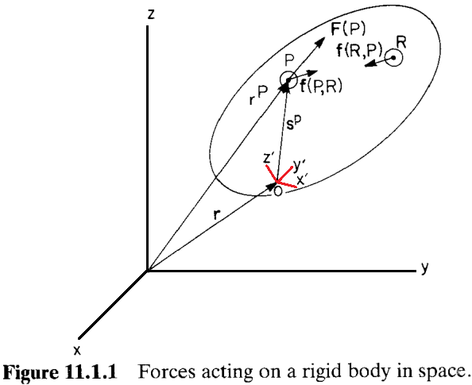
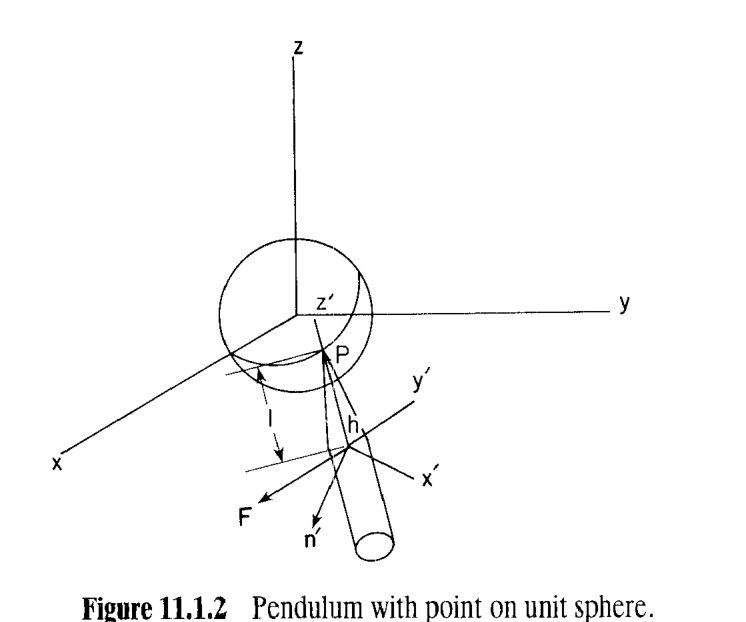
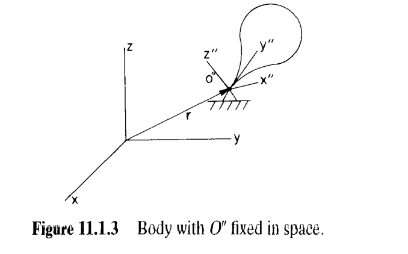
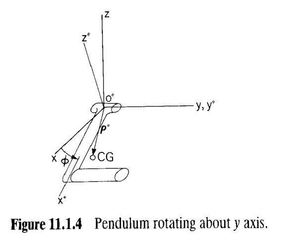

# 11.1 空间刚体的运动方程

> 来源：*Computer Aided Kinematics and Dynamics of Mechanical Systems*，第 11 章，§11.1（书页 416–425）。
> 本文以"文字讲解 + 逐式详细推导"组织，公式推导不跳步骤。
> 本文补齐原书跳过的若干代数（惯性矩阵矩阵式的逐项来源、第四/第五积分交换次序的一般方法、11.1.11 中七项的去向），并把 §6.1 平面版与本节逐项对照。

## 引言：第 11 章与本节要解决什么

第 11 章是 Part Two（空间系统）的动力学核心，与 Part One 的第 6 章（平面动力学）**逐节对应**。第 9、10 章已经把空间运动学的工具（Euler 参数、关节库、约束冗余诊断）建好，本章在其上加"力"。原书开篇（p.416）用三段话把两章的差别一次讲清：

1. 平面动力学（第 6 章）的**基本思想在空间照样成立**；实质差别只有一条——**角速度效应更复杂**。平面里角速度是标量 $\dot\phi$、可以与别的量交换次序；空间里角速度是 3×1 向量 $\boldsymbol\omega'$，叉积不可交换，于是**连单个刚体**的运动方程都会冒出非线性项。
2. 因此本章**重心在"运动方程的建立"而不在"解析算例"**：姿态的代数复杂性把第 6 章那种干净的手算例题挤掉了。真正可搬运的是**方程的形式**——第 6 章与第 11 章的运动方程形式几乎逐项对应，这正是 DADS 这类程序能同时吃下平面与空间系统的原因。
3. 计算方法（第 7 章）同样照搬：空间 DAE 与平面 DAE 的差别全部集中在几个矩阵块上（§11.6）。软件把复杂度藏起来了，但"用软件而不被软件坑"仍要求工程师懂**公式是怎么来的**。

§11.1 完成第一件事：**把单个刚体的运动方程从牛顿定律推出来**，并给出三个层次的结果：

- Eq. 11.1.19 **变分 Newton–Euler 方程**——含约束时它才是完整方程（约束以 $\delta\Phi$ 的形式进入）；
- Eq. 11.1.20 **Newton–Euler 方程**——无约束；
- Eq. 11.1.23 **欧拉方程**——一点固定、无姿态约束；陀螺仪/对称陀螺的基本方程。

主线逻辑：

1. **A–C（p.417–419）**：对微元 $dm(P)$ 写牛顿第二定律 → 乘虚位移 $\delta\mathbf r^P$ 并对质量积分（d'Alembert 原理）→ **证明刚体内力的虚功恒为零** → 得虚功方程 11.1.7 → 代入 $\delta\mathbf r^P$（11.1.8）与 $\ddot{\mathbf r}^P$（11.1.9）→ 展开成七项 11.1.11。
2. **D（p.420–421）**：把随动系原点搬到质心 → 两个含 $\int\mathbf s'^Pdm$ 的交叉项消失（11.1.13）→ 第四积分给出**惯性矩阵** $\mathbf J'$（11.1.16–11.1.17）→ 第五积分给出**陀螺项** $\tilde{\boldsymbol\omega}'\mathbf J'\boldsymbol\omega'$（11.1.18）→ 合成 11.1.19、11.1.20。
3. **例 11.1.1（p.421–422）**：球面约束如何进方程——把 $\delta\Phi$ 乘 Lagrange 乘子 $\lambda$ 加进虚功方程，得约束运动方程，$\lambda$ 就是约束力。
4. **E（p.422–423）**：一点固定的刚体——$\delta\mathbf r\equiv\mathbf 0$，平移部分整体消失，方程退化为 11.1.22；无姿态约束时即**欧拉方程** 11.1.23。
5. **例 11.1.2（p.423–425）**：绕全局 $y$ 轴转动的摆。$\phi$ 单自由度时方程退化为 $J_{y''y''}\ddot\phi=n_{y''}$（11.1.26），而**惯性积** $J_{x''y''},J_{z''y''}$ 只出现在关节**反力矩**（11.1.28）里——这是"惯性积何时要紧"的定量答案。

> **范围说明**：书页 425 下半页已进入 §11.2（质心与惯性属性），不在本文范围；本文只覆盖 §11.1。书页 416 是第 11 章开篇（引言段），一并纳入。

---

## 一、刚体上的微元

如下图所示，有一刚体，刚体坐标系为 $x'\text{-}y'\text{-}z'$，刚体坐标系原点在全局坐标系下的向量表示为 $\mathbf r$。
现有刚体上任意一点 $P$，其在刚体坐标系中的向量表示为 $\mathbf s'^P$，在全局坐标系下为 $\mathbf r^P$。取点 $P$ 附近的微元，其质量为 $dm(P)$（这里是将刚体质量 $m$ 看作是一个场），则该微元的受力情况为：

$$\ddot{\mathbf r}^P dm(P)-\mathbf F(P)\,dm(P)-\int_m\mathbf f(P,R)\,dm(R)\,dm(P)=\mathbf 0 \tag{11.1.1}$$

其中各分量含义如下（特别要注意 $\mathbf F(P)$ 和 $\mathbf f(P,R)$ 是力场）：
| 符号 | 含义 | 量纲 |
|------|------|------|
| $\ddot{\mathbf r}^Pdm(P)$ | 微元的惯性力（质量×加速度） | 力 |
| $\mathbf F(P)$ | 作用在 $P$ 处**单位质量**的外力 | 力/质量 |
| $\mathbf f(P,R)$ | $R$ 处微元作用在 $P$ 处微元的**单位质量**内力 | 力/质量 |

## 二、三维空间下的虚功原理

### 1. 微元受力公式，在刚体上的积分

对 （Eq 11.1.1）两边乘以虚位移 $\delta\mathbf r^{P}$ 的转置，并积分（注意，虚位移 $\delta\mathbf r^P$ 隐含条件：满足刚体约束，具体的距离约束见下一小节），得到：

$$\int_m\delta\mathbf r^{PT}\ddot{\mathbf r}^Pdm(P)-\int_m\delta\mathbf r^{PT}\mathbf F(P)\,dm(P)-\int_m\int_m\delta\mathbf r^{PT}\mathbf f(P,R)\,dm(R)\,dm(P)=0 \tag{11.1.2}$$

先研究其中的第三项。注意到，根据牛顿第三定律 $\mathbf f(P,R)dm(P)dm(R)=-\mathbf f(R,P)dm(R)dm(P)$：

$$
\begin{aligned}
\int_m\int_m\delta\mathbf r^{PT}\mathbf f(P,R)\,dm(R)\,dm(P)&=\frac12\int_m\int_m\delta\mathbf r^{PT}\mathbf f(P,R)\,dm(R)\,dm(P)+\frac12\int_m\int_m\delta\mathbf r^{RT}\mathbf f(R,P)\,dm(P)\,dm(R)\\
&=\frac12\int_m\int_m\Bigl(\delta\mathbf r^{PT}\mathbf f(P,R)-\delta\mathbf r^{RT}\mathbf f(P,R)\Bigr)dm(P)\,dm(R)\\
&=\frac12\int_m\int_m(\delta\mathbf r^P-\delta\mathbf r^R)^T\mathbf f(P,R)\,dm(P)\,dm(R)
\end{aligned}
\tag{11.1.3}
$$

### 2. 刚体的距离约束，对刚体内力的假设

为了进一步展开上面的式子，我们先引入刚体模型的数学表述：**任意两点之间一条距离固定**：$(\mathbf r^P-\mathbf r^R)^T(\mathbf r^P-\mathbf r^R)=C$，对两侧取变分，得到

$$2(\mathbf r^P-\mathbf r^R)^T(\delta\mathbf r^P-\delta\mathbf r^R)=0\;\Longrightarrow\;(\delta\mathbf r^P-\delta\mathbf r^R)^T(\mathbf r^P-\mathbf r^R)=0$$

不加证明的，认为刚体内部的内力，其方向就是沿着两点之间的连线的（其中 $k$ 为常数）：

$$\mathbf f(P,R)=k(\mathbf r^P-\mathbf r^R)$$

> 原书 p.418 标明，上面结论并不是牛顿第三定律的普遍推论——第三定律只保证两者等值反向，对具体方向并没有要求。事实上，例如**电场中的带电粒子、磁场中的电偶极子、非均匀引力场中的质点**均不满足上式。该式只对本书讨论的通常环境下的刚体生效。

### 3. 虚功原理

将内力的表达式代入 (Eq 11.1.3)，得到：

$$\int_m\int_m(\delta\mathbf r^P-\delta\mathbf r^R)^T\mathbf f(P,R)\,dm(P)\,dm(R)=\int_m\int_m(\delta\mathbf r^P-\delta\mathbf r^R)^T*k(\mathbf r^P-\mathbf r^R)\,dm(P)\,dm(R)=0$$

即

$$\int_m\int_m\delta\mathbf r^{PT}\mathbf f(P,R)\,dm(P)\,dm(R)=0 \tag{11.1.6}$$

把 (11.1.6) 代回 (11.1.2)，内力项消失：

$$\int_m\delta\mathbf r^{PT}\ddot{\mathbf r}^Pdm(P)-\int_m\delta\mathbf r^{PT}\mathbf F(P)\,dm(P)=0 \tag{11.1.7}$$

对一切**与约束相容**的虚位移 $\delta\mathbf r^P$ 成立。这就是空间版的 **d'Alembert 原理（虚功原理）**：惯性力虚功 = 外力虚功，与平面 §6.1 的 Eq. 6.1.4 完全同型。

## 三、从微元到刚体

Eq 11.1.7 中两项中，都包含带有"$P$"的变量（即 $\delta\mathbf r^P,\ddot{\mathbf r}^P$），现在要将其转换掉。

### 1. 转换虚位移项 $\delta\mathbf r^P$

由于 $\delta\boldsymbol\pi=A\,\delta\boldsymbol\pi'$，根据 Eq 9.2.21，有：

$$\delta\tilde{\boldsymbol\pi}=A\,\delta\tilde{\boldsymbol\pi}'A^T$$

则将其代入 Eq 9.2.49：

$$
\begin{aligned}
\delta\mathbf r^P&=\delta\mathbf r+\delta\tilde{\boldsymbol\pi}\mathbf s^P\\
&=\delta\mathbf r+A\delta\tilde{\boldsymbol\pi}'A^TA\mathbf s'^P\\
&=\delta\mathbf r+A\delta\tilde{\boldsymbol\pi}'\mathbf s'^P
\end{aligned}
$$

注意到 Tilde 运算符满足反交换律 $\tilde{\mathbf a}\mathbf b=-\tilde{\mathbf b}\mathbf a$，于是

$$\delta\mathbf r^P=\delta\mathbf r-A\tilde{\mathbf s}'^P\delta\boldsymbol\pi' \tag{11.1.8}$$

$$\delta\mathbf r^{PT}=\delta\mathbf r^T+\delta\boldsymbol\pi'^T\tilde{\mathbf s}'^PA^T$$

### 2. 转换加速度项 $\ddot{\mathbf r}^P$

根据 Eq 9.2.41，$\ddot{\mathbf r}^P=\ddot{\mathbf r}+\ddot{\mathbf A}\mathbf s'^P$。对于 $\ddot{\mathbf A}$，展开如下：

$$\ddot{\mathbf A}=\frac{d}{dt}\bigl(\mathbf A\tilde{\boldsymbol\omega}'\bigr)=\dot{\mathbf A}\tilde{\boldsymbol\omega}'+\mathbf A\dot{\tilde{\boldsymbol\omega}}'=\mathbf A\tilde{\boldsymbol\omega}'\tilde{\boldsymbol\omega}'+\mathbf A\dot{\tilde{\boldsymbol\omega}}'$$

代回得到：

$$\ddot{\mathbf r}^P=\ddot{\mathbf r}+\mathbf A\dot{\tilde{\boldsymbol\omega}}'\mathbf s'^P+\mathbf A\tilde{\boldsymbol\omega}'\tilde{\boldsymbol\omega}'\mathbf s'^P \tag{11.1.9}$$

### 3. 代回

把 (11.1.8)、(11.1.9) 代入 (11.1.7)：

$$\int_m(\delta\mathbf r^T+\delta\boldsymbol\pi'^T\tilde{\mathbf s}'^PA^T)(\ddot{\mathbf r}+\mathbf A\dot{\tilde{\boldsymbol\omega}}'\mathbf s'^P+\mathbf A\tilde{\boldsymbol\omega}'\tilde{\boldsymbol\omega}'\mathbf s'^P)\,dm(P)-\int_m(\delta\mathbf r^T+\delta\boldsymbol\pi'^T\tilde{\mathbf s}'^PA^T)\mathbf F(P)\,dm(P)=0$$

对一切与约束相容的 $\delta\mathbf r,\delta\boldsymbol\pi'$ 成立。定义刚体坐标系下的外力 $\mathbf F'(P)\equiv A^T\mathbf F(P)$，并将上式进一步展开得到**刚体受力的一般表达式**：

$$
\delta\mathbf r^T\ddot{\mathbf r}\int_m dm(P)+\delta\mathbf r^T\!\left(\mathbf A\dot{\tilde{\boldsymbol\omega}}'+\mathbf A\tilde{\boldsymbol\omega}'\tilde{\boldsymbol\omega}'\right)\int_m\mathbf s'^P\,dm(P)
+\;\delta\boldsymbol\pi'^T\int_m\mathbf s'^Pdm(P)\,\mathbf A^T\ddot{\mathbf r}\\
+\delta\boldsymbol\pi'^T\int_m\tilde{\mathbf s}'^P\dot{\tilde{\boldsymbol\omega}}'\mathbf s'^P\,dm(P)+\delta\boldsymbol\pi'^T\int_m\tilde{\mathbf s}'^P\tilde{\boldsymbol\omega}'\tilde{\boldsymbol\omega}'\mathbf s'^P\,dm(P)\\
-\;\delta\mathbf r^T\int_m\mathbf F(P)\,dm(P)-\delta\boldsymbol\pi'^T\int_m\tilde{\mathbf s}'^P\mathbf F'(P)\,dm(P)=0 \tag{11.1.11}$$

## 四、展开刚体受力的各个子项

Eq 11.1.11 包含七项，**其去向如下表**，下面会分别讨论：

| 项 | 内容 | 归宿 |
|----|------|------|
| ① | $\delta\mathbf r^T\ddot{\mathbf r}\int dm$ | 质量 $m$ |
| ② | $\delta\mathbf r^T\mathbf A(\dot{\tilde{\boldsymbol\omega}}'+\tilde{\boldsymbol\omega}'\tilde{\boldsymbol\omega}')\int\mathbf s'dm$ | 质心条件 ⇒ 在质心系**消失** |
| ③ | $\delta\boldsymbol\pi'^T\int\mathbf s'dm\,\mathbf A^T\ddot{\mathbf r}$ | 同上 ⇒ **消失** |
| ④ | $\delta\boldsymbol\pi'^T\int\tilde{\mathbf s}'\dot{\tilde{\boldsymbol\omega}}'\mathbf s'dm$ | 惯性矩阵 ⇒ $\mathbf J'\dot{\boldsymbol\omega}'$ |
| ⑤ | $\delta\boldsymbol\pi'^T\int\tilde{\mathbf s}'\tilde{\boldsymbol\omega}'\tilde{\boldsymbol\omega}'\mathbf s'dm$ | 陀螺项 ⇒ $\tilde{\boldsymbol\omega}'\mathbf J'\boldsymbol\omega'$ |
| ⑥ | $-\delta\mathbf r^T\int\mathbf Fdm$ | 合外力 |
| ⑦ | $-\delta\boldsymbol\pi'^T\int\tilde{\mathbf s}'\mathbf F'dm$ | 外力矩 |

### 1. 刚体的质量

对刚体上各个微元的质量进行积分，就得到了刚体的总质量（同 Eq 6.1.12），这正对应着表格中的**第一项**：

$$m\equiv\int_m dm(P) \tag{11.1.12}$$

### 2. 质心坐标系

同 Eq 6.1.13，定义质心坐标系下，满足：

$$\int_m\mathbf s'^Pdm(P)=\mathbf 0 \tag{11.1.13}$$

则此时显然表格中的**第二项和第三项都会变为0**。

### 3. 合外力与合外力矩

同 Eq 6.1.16 和 Eq 6.1.17a，定义刚体受到的合外力和合外力矩：

$$\mathbf F\equiv\int_m\mathbf F(P)\,dm(P) \tag{11.1.14}$$

$$\mathbf n'\equiv\int_m\tilde{\mathbf s}'^P\mathbf F'(P)\,dm(P) \tag{11.1.15}$$

其中，$\mathbf n'$ 是关于质心的外力矩（注意力矩一定要指定一个参考点）。则以上两个变量恰好对应着表格中的**第六项和第七项**。

### 4. 转动惯量

Eq 11.1.11 中的**第四项**，可以进行如下展开，其中，$\mathbf J$ 被称为**转动惯量**：

$$
\int_m\tilde{\mathbf s}'^P\dot{\tilde{\boldsymbol\omega}}'\mathbf s'^Pdm(P)=-\left(\int_m\tilde{\mathbf s}'^P\tilde{\mathbf s}'^Pdm(P)\right)\dot{\boldsymbol\omega}'\equiv\mathbf J'\dot{\boldsymbol\omega}'
$$

注意到，由 (9.1.28) $\tilde{\mathbf a}\tilde{\mathbf b}=\mathbf b\mathbf a^T-(\mathbf a^T\mathbf b)\mathbf I$，因此：

$$
\begin{aligned}
\tilde{\mathbf s}'^P\tilde{\mathbf s}'^P&=\mathbf s'^P(\mathbf s'^P)^T-(\mathbf s'^P)^T\mathbf s'^P\mathbf I\\
&=\begin{bmatrix}x'^P\\ y'^P \\ z'^P\end{bmatrix}\begin{bmatrix}x'^P & y'^P & z'^P\end{bmatrix}-((x'^P)^2+(y'^P)^2+(z'^P)^2)\mathbf I\\
&=-\begin{bmatrix}(y'^P)^2+(z'^P)^2 & -x'^Py'^P & -x'^Pz'^P\\ -x'^Py'^P & (x'^P)^2+(z'^P)^2 & -y'^Pz'^P\\ -x'^Pz'^P & -y'^Pz'^P & (x'^P)^2+(y'^P)^2\end{bmatrix}
\end{aligned}
$$

因此展开 $\mathbf J$ 得到：
$$\mathbf J'\equiv-\int_m\tilde{\mathbf s}'^P\tilde{\mathbf s}'^Pdm(P)=\int_m\begin{bmatrix}(y'^P)^2+(z'^P)^2 & -x'^Py'^P & -x'^Pz'^P\\ -x'^Py'^P & (x'^P)^2+(z'^P)^2 & -y'^Pz'^P\\ -x'^Pz'^P & -y'^Pz'^P & (x'^P)^2+(y'^P)^2\end{bmatrix}dm(P) \tag{11.1.17}$$

术语：对角元称为**惯性矩（moments of inertia）**，非对角元（带负号）称为**惯性积（products of inertia）**；且 $\mathbf J'=\mathbf J'^T$ 是对称矩阵。

### 5. 科式力 Gyroscopic Torque

Eq 11.1.11 中的**第五项**是 $\int_m\tilde{\mathbf s}'^P\tilde{\boldsymbol\omega}'\tilde{\boldsymbol\omega}'\mathbf s'^P\,dm(P)$。首先注意到，根据 Eq 9.1.31 $\tilde{\mathbf a}\tilde{\mathbf b}=\tilde{\mathbf b}\tilde{\mathbf a}+\mathbf b\mathbf a^T-\mathbf a\mathbf b^T$，有：

$$\tilde{\mathbf s}'^P\tilde{\boldsymbol\omega}'=\tilde{\boldsymbol\omega}'\tilde{\mathbf s}'^P+\boldsymbol\omega'(\mathbf s'^P)^T-\mathbf s'^P\boldsymbol\omega'^T$$

将其代入第五项的被积分项中：
$$
\tilde{\mathbf s}'^P\tilde{\boldsymbol\omega}'\tilde{\boldsymbol\omega}'\mathbf s'^P
=-\tilde{\mathbf s}'^P\tilde{\boldsymbol\omega}'\tilde{\mathbf s}'^P\boldsymbol\omega'
=-\tilde{\boldsymbol\omega}'\tilde{\mathbf s}'^P\tilde{\mathbf s}'^P\boldsymbol\omega'-\boldsymbol\omega'(\mathbf s'^P)^T\tilde{\mathbf s}'^P\boldsymbol\omega'+\mathbf s'^P\boldsymbol\omega'^T\tilde{\mathbf s}'^P\boldsymbol\omega'
$$

注意到，由于叉乘的性质，$\mathbf s'^P$ 一定垂直于 $\tilde{\mathbf s}'^P\boldsymbol\omega'$，因此 $(\mathbf s'^P)^T\tilde{\mathbf s}'^P\boldsymbol\omega'=0$，同理 $\boldsymbol\omega'^T\tilde{\mathbf s}'^P\boldsymbol\omega'=0$，因此上式中只剩下了第一项非零。因此：

$$
\int_m\tilde{\mathbf s}'^P\tilde{\boldsymbol\omega}'\tilde{\boldsymbol\omega}'\mathbf s'^Pdm(P)
=\int_m-\tilde{\boldsymbol\omega}'\tilde{\mathbf s}'^P\tilde{\mathbf s}'^P\boldsymbol\omega'dm(P)
=\tilde{\boldsymbol\omega}'\left(-\int_m\tilde{\mathbf s}'\tilde{\mathbf s}'dm(P)\right)\boldsymbol\omega'=\tilde{\boldsymbol\omega}'\mathbf J'\boldsymbol\omega' \tag{11.1.18}
$$

这一项被称之为 Gyroscopic Torque，二维情况下是没有这个力的。

## 五、代入刚体受力的各个子项 —— Newton–Euler 方程

把 (11.1.12) ~ (11.1.18) 代回 (11.1.11)：

$$\delta\mathbf r^T\bigl[m\ddot{\mathbf r}-\mathbf F\bigr]+\delta\boldsymbol\pi'^T\bigl[\mathbf J'\dot{\boldsymbol\omega}'+\tilde{\boldsymbol\omega}'\mathbf J'\boldsymbol\omega'-\mathbf n'\bigr]=0 \tag{11.1.19}$$

对一切与作用在刚体上的约束相容的 $\delta\mathbf r,\delta\boldsymbol\pi'$ 成立——即得到**变分 Newton–Euler 运动方程**（variational Newton–Euler equations of motion）。

若**没有任何约束**（刚体在空间自由运动），$\delta\mathbf r,\delta\boldsymbol\pi'$ 完全任意，两个系数必须各自为零：

$$m\ddot{\mathbf r}=\mathbf F,\qquad \mathbf J'\dot{\boldsymbol\omega}'=\mathbf n'-\tilde{\boldsymbol\omega}'\mathbf J'\boldsymbol\omega' \tag{11.1.20}$$

即得到无约束刚体的 **Newton–Euler 方程**。

## 六、例题

### 例 11.1.1：球面上的摆——约束如何进入运动方程

> 刚体上 $z'$ 轴上一点 $P$ 被约束在单位球面上运动（Fig. 11.1.2）。

把 $P$ 取在 $z'$ 轴上，则 $\mathbf s'^P=\mathbf h'$（$z'$ 轴的惯性位置为 $\mathbf r+A\mathbf h'$。点 $P$ 落在单位球面上即 $(\mathbf r+A\mathbf h')^T(\mathbf r+A\mathbf h')=1$，故约束方程为

$$\Phi=(\mathbf r+A\mathbf h')^T(\mathbf r+A\mathbf h')-1=0$$

#### 第一步：约束的变分（原书给的四行，逐行补理由）

$$\delta\Phi=2(\mathbf r+A\mathbf h')^T(\delta\mathbf r+\delta\mathbf A\mathbf h')$$

$$=2(\mathbf r+A\mathbf h')^T\delta\mathbf r+2(\mathbf r+A\mathbf h')^T\mathbf A\delta\tilde{\boldsymbol\pi}'\mathbf h'$$

（用 §9.2 的虚旋转公式 $\delta\mathbf A\mathbf h'=\mathbf A\delta\tilde{\boldsymbol\pi}'\mathbf h'$，Eq. 9.2.47；再用 (9.1.25) 把 $\delta\tilde{\boldsymbol\pi}'\mathbf h'$ 翻成 $-\tilde{\mathbf h}'\delta\boldsymbol\pi'$）

$$=2(\mathbf r+A\mathbf h')^T\delta\mathbf r-2(\mathbf r+A\mathbf h')^T\mathbf A\tilde{\mathbf h}'\delta\boldsymbol\pi'$$

$$=2(\mathbf r+A\mathbf h')^T\delta\mathbf r-\bigl(2\mathbf r^T\mathbf A\tilde{\mathbf h}'+2\mathbf h'^T\tilde{\mathbf h}'\bigr)\delta\boldsymbol\pi'$$

（展开 $(\mathbf r+A\mathbf h')^T\mathbf A\tilde{\mathbf h}'=\mathbf r^T\mathbf A\tilde{\mathbf h}'+\mathbf h'^T\mathbf A^T\mathbf A\tilde{\mathbf h}'$，而 $\mathbf A^T\mathbf A=\mathbf I$）

$$=2(\mathbf r+A\mathbf h')^T\delta\mathbf r-\bigl(2\mathbf r^T\mathbf A\tilde{\mathbf h}'\bigr)\delta\boldsymbol\pi'=0$$

（最后一步用 $\mathbf h'^T\tilde{\mathbf h}'=\mathbf h'^T(\mathbf h'\times\cdot)=0$，因为 $\tilde{\mathbf h}'\mathbf h'=\mathbf h'\times\mathbf h'=\mathbf 0$）

#### 第二步：拉格朗日乘子把约束"抬"进方程

根据 6.3.2 拉格朗日乘子定理，(11.1.19) 只对**与约束相容**的虚位移成立，而 $\delta\Phi=0$ 正是那个相容性的一阶条件。把 $\lambda\,\delta\Phi$ 加进 (11.1.19) 后，$\delta\mathbf r,\delta\boldsymbol\pi'$ 可以任意选取，各自系数为零：

$$\delta\mathbf r^T\bigl[m\ddot{\mathbf r}-\mathbf F+2\lambda(\mathbf r+\mathbf A\mathbf h')\bigr]+\delta\boldsymbol\pi'^T\bigl[\mathbf J'\dot{\boldsymbol\omega}'+\tilde{\boldsymbol\omega}'\mathbf J'\boldsymbol\omega'-\mathbf n'+2\lambda\tilde{\mathbf h}'\mathbf A^T\mathbf r\bigr]=0$$

（$\delta\boldsymbol\pi'$ 里的附加项：$-2\lambda\mathbf r^T\mathbf A\tilde{\mathbf h}'\delta\boldsymbol\pi'=+2\lambda(\tilde{\mathbf h}'\mathbf A^T\mathbf r)^T\delta\boldsymbol\pi'$，用到 $\mathbf r^T\mathbf A\tilde{\mathbf h}'=-(\tilde{\mathbf h}'\mathbf A^T\mathbf r)^T$。）

#### 第三步：运动方程

$$\boxed{m\ddot{\mathbf r}+2(\mathbf r+\mathbf A\mathbf h')\lambda=\mathbf F}\qquad\boxed{\mathbf J'\dot{\boldsymbol\omega}'+2\tilde{\mathbf h}'\mathbf A^T\mathbf r\,\lambda=\mathbf n'-\tilde{\boldsymbol\omega}'\mathbf J'\boldsymbol\omega'}$$

加上约束方程 $\Phi=0$，共 7 个方程解 7 个未知量 $(\mathbf r,\mathbf p,\lambda)$。

**物理意义**：$\lambda$ 就是球面约束的乘子，$2\lambda(\mathbf r+A\mathbf h')$ 是沿**球面法线**（即从球心指向 $P$ 的方向 $\mathbf r^P$）的约束力——与平面 §6.6 的"乘子 = 约束反力"结论完全一致。另外注意：**约束项以 $\delta\Phi$ 的形式进入，形式与碰到的具体约束无关**——这正是后面 §11.3 处理整个多体系统的统一入口。

### E. 一点固定的刚体：非质心随动系与欧拉方程（Eq. 11.1.21–11.1.23）

> 

#### 思路

陀螺、单摆、绕固定轴转的曲柄，都有**一个点 $O''$ 在惯性空间中不动**（Fig. 11.1.3 里画成地面斜线阴影的连接点）。此时平移三个自由度整体消失，方程应该只剩转动部分。但**质心一般不在 $O''$ 上**，所以随动系必须改放到 $O''$（记 $x''\text{-}y''\text{-}z''$，原点 $O''$），此时 (11.1.13) 的 $\int\mathbf s''^Pdm=\mathbf 0$ **不再成立**。所幸 (11.1.11) 里含 $\int\mathbf s''^Pdm$ 的两项都还带着 $\delta\mathbf r$ 或 $\ddot{\mathbf r}$，而它们被固定点条件直接杀掉了。

#### E.1 固定点的运动学条件（Eq. 11.1.21）

$$\mathbf r=\mathbf c,\qquad \dot{\mathbf r}=\ddot{\mathbf r}=\mathbf 0,\qquad \delta\mathbf r=\mathbf 0 \tag{11.1.21}$$

（$\mathbf r$ 是 $O''$ 的惯性位置；$\delta\mathbf r=\mathbf 0$ 因为 $O''$ 不允许有任何虚位移。）

#### E.2 代入 (11.1.11)（Eq. 11.1.22）

逐项过一遍（系名换成 $x''\text{-}y''\text{-}z''$，$\mathbf s''^P$ 自 $O''$ 量起）：

- ① 项 $\delta\mathbf r^T\ddot{\mathbf r}\int dm$：含 $\delta\mathbf r$ ⇒ 消失；
- ② 项 $\delta\mathbf r^T\mathbf A(\cdots)\int\mathbf s''^Pdm$：含 $\delta\mathbf r$ ⇒ 消失（**与 $\int\mathbf s''^Pdm\ne\mathbf 0$ 无关**，这是关键）；
- ③ 项 $\delta\boldsymbol\pi''^T\int\mathbf s''^Pdm\,\mathbf A^T\ddot{\mathbf r}$：含 $\ddot{\mathbf r}=\mathbf 0$ ⇒ 消失；
- ⑥ 项 $-\delta\mathbf r^T\int\mathbf Fdm$：含 $\delta\mathbf r$ ⇒ 消失；
- ④⑤⑦ 项保留，其推导与 §D.3、§D.4、§D.2 一字不差（$\mathbf s'\to\mathbf s''$、$\boldsymbol\omega'\to\boldsymbol\omega''$；积分值不同，但定义式同型），得 $\mathbf J''\dot{\boldsymbol\omega}''$、$\tilde{\boldsymbol\omega}''\mathbf J''\boldsymbol\omega''$、$\mathbf n''$。

$$\delta\boldsymbol\pi''^T\bigl[\mathbf J''\dot{\boldsymbol\omega}''+\tilde{\boldsymbol\omega}''\mathbf J''\boldsymbol\omega''-\mathbf n''\bigr]=0 \tag{11.1.22}$$

对一切与**附加姿态约束**相容的虚转动 $\delta\boldsymbol\pi''$ 成立。

**这就是"一点固定"的价值**：平移方程被自动消掉，只剩一个 3 维的转动虚功方程。同时它也告诉我们，若还要给姿态加约束（例如把陀螺装进万向支架），只要把对应的 $\lambda\delta\Phi$ 加进来即可，形式与例 11.1.1 完全一样。

#### E.3 无姿态约束 ⇒ 欧拉方程（Eq. 11.1.23）

$\delta\boldsymbol\pi''$ 任意 ⇒ 系数为零：

$$\mathbf J''\dot{\boldsymbol\omega}''=\mathbf n''-\tilde{\boldsymbol\omega}''\mathbf J''\boldsymbol\omega'' \tag{11.1.23}$$

即刚体的**欧拉方程（Euler equations of motion）**。原书提醒：**右端的角速度非线性使封闭解一般不存在**——陀螺运动"难"的数学根源就在这里（历史上只有 Kovalevskaya 那一类可积特例）。

### 例 11.1.2：绕 $y$ 轴转动的摆（惯性积如何变成反力矩）

> 一点固定的摆，只能绕全局 $y$ 轴转动；随体 $y''$ 轴与全局 $y$ 轴重合（Fig. 11.1.4）。

#### 第一步：随动系与变换矩阵

绕 $y$ 轴转 $\phi$ 的变换矩阵（§9.2）：

$$\mathbf s=\mathbf A\mathbf s''=\begin{bmatrix}\cos\phi & 0 & \sin\phi\\ 0 & 1 & 0\\ -\sin\phi & 0 & \cos\phi\end{bmatrix}\mathbf s''$$

#### 第二步：角运动学（Eq. 11.1.24）

直接计算（或由 $\tilde{\boldsymbol\omega}''=\mathbf A^T\dot{\mathbf A}$）得角速度、角加速度、虚转动都沿 $y''$ 轴：

$$\boldsymbol\omega''=\begin{bmatrix}0\\ \dot\phi\\ 0\end{bmatrix},\qquad \dot{\boldsymbol\omega}''=\begin{bmatrix}0\\ \ddot\phi\\ 0\end{bmatrix},\qquad \delta\boldsymbol\pi''=\begin{bmatrix}0\\ \delta\phi\\ 0\end{bmatrix} \tag{11.1.24}$$

#### 第三步：代入 (11.1.22)（Eq. 11.1.25）

两块分别算：

$$\mathbf J''\dot{\boldsymbol\omega}''=\mathbf J''\begin{bmatrix}0\\ \ddot\phi\\ 0\end{bmatrix}=\ddot\phi\,\mathbf J''\text{ 的第 2 列}=\begin{bmatrix}J_{x''y''}\ddot\phi\\ J_{y''y''}\ddot\phi\\ J_{z''y''}\ddot\phi\end{bmatrix}$$

$$\tilde{\boldsymbol\omega}''\mathbf J''\boldsymbol\omega''=\boldsymbol\omega''\times\bigl(\mathbf J''\boldsymbol\omega''\bigr)=\begin{bmatrix}0\\ \dot\phi\\ 0\end{bmatrix}\times\dot\phi\begin{bmatrix}J_{x''y''}\\ J_{y''y''}\\ J_{z''y''}\end{bmatrix}=\begin{bmatrix}\dot\phi\cdot\dot\phi J_{z''y''}-0\cdot\dot\phi J_{y''y''}\\ 0\cdot\dot\phi J_{x''y''}-0\cdot\dot\phi J_{z''y''}\\ 0\cdot\dot\phi J_{y''y''}-\dot\phi\cdot\dot\phi J_{x''y''}\end{bmatrix}=\begin{bmatrix}J_{z''y''}\dot\phi^2\\ 0\\ -J_{x''y''}\dot\phi^2\end{bmatrix}$$

（叉积按 $\mathbf a\times\mathbf b=(a_2b_3-a_3b_2,\;a_3b_1-a_1b_3,\;a_1b_2-a_2b_1)$ 逐项代。）代入得

$$[0,\;\delta\phi,\;0]\left\{\begin{bmatrix}J_{x''y''}\ddot\phi\\ J_{y''y''}\ddot\phi\\ J_{z''y''}\ddot\phi\end{bmatrix}+\begin{bmatrix}J_{z''y''}\dot\phi^2\\ 0\\ -J_{x''y''}\dot\phi^2\end{bmatrix}-\begin{bmatrix}n_{x''}\\ n_{y''}\\ n_{z''}\end{bmatrix}\right\}=0 \tag{11.1.25}$$

#### 第四步：重力在随体系中的分量

重力在惯性系中为 $\mathbf F=-mg\mathbf k$；左乘 $\mathbf A^T$ 换算到 $x''\text{-}y''\text{-}z''$：

$$\mathbf F''=\mathbf A^T\mathbf F=mg\begin{bmatrix}\sin\phi\\ 0\\ -\cos\phi\end{bmatrix}$$

#### 第五步：关于 $O''$ 的力矩（(11.1.15) 的非质心版）

设质心在 $x''\text{-}y''\text{-}z''$ 中的位置为 $\boldsymbol\rho''=[\rho_{x''},\rho_{y''},\rho_{z''}]^T$，则 $\mathbf n''=\tilde{\boldsymbol\rho}''\mathbf F''=\boldsymbol\rho''\times\mathbf F''$ 逐项算：

$$\mathbf n''=mg\begin{bmatrix}\rho_{y''}(-\cos\phi)-\rho_{z''}\cdot 0\\ \rho_{z''}\sin\phi-\rho_{x''}(-\cos\phi)\\ \rho_{x''}\cdot 0-\rho_{y''}\sin\phi\end{bmatrix}=mg\begin{bmatrix}-\rho_{y''}\cos\phi\\ \rho_{z''}\sin\phi+\rho_{x''}\cos\phi\\ -\rho_{y''}\sin\phi\end{bmatrix}$$

#### 第六步：方程退化为单自由度（Eq. 11.1.26）

$\delta\boldsymbol\pi''=[0,\delta\phi,0]^T$ 与括号中点积，等价于**只取括号的第 2 行**。另外 $T_{y''}=0$（转动关节允许绕 $y''$ 自由转），故

$$\boxed{J_{y''y''}\ddot\phi=n_{y''}=mg\bigl(\rho_{z''}\sin\phi+\rho_{x''}\cos\phi\bigr)} \tag{11.1.26}$$

**只有 $y''$ 轴的惯性矩出现**（原书特意点出这一点）：原因就是虚转动向量只有一个 $\delta\phi$ 分量。而惯性积 $J_{x''y''},J_{z''y''}$ 在 (11.1.25) 的第 1、3 行里，它们**不影响运动**，只影响反力矩。

#### 第七步：关节反力矩（Eq. 11.1.27–11.1.28）

转动关节允许绕 $y''$ 自由转动，故它只能提供垂直于转轴的两个力矩分量：

$$\mathbf T''=[T_{x''},\;0,\;T_{z''}]^T \tag{11.1.27}$$

把它当**外力矩**并入 (11.1.22)（进入方式与外力 $\mathbf F$ 相同，都是减号）：

$$\delta\boldsymbol\pi''^T\bigl[\mathbf J''\dot{\boldsymbol\omega}''+\tilde{\boldsymbol\omega}''\mathbf J''\boldsymbol\omega''-\mathbf n''-\mathbf T''\bigr]=0$$

取 $x''$、$z''$ 两行（$y''$ 行给出 (11.1.26)，与 $T_{y''}=0$ 自洽）：

$$T_{x''}=J_{z''y''}\dot\phi^2+J_{x''y''}\ddot\phi-n_{x''},\qquad T_{z''}=-J_{x''y''}\dot\phi^2+J_{z''y''}\ddot\phi-n_{z''} \tag{11.1.28}$$

**这就是惯性积的"可见后果"**：若摆关于 $x''\text{-}z''$ 平面（或 $y''\text{-}z''$ 平面）对称，则 $J_{x''y''}=J_{z''y''}=0$，反力矩只剩 $-n_{x''},-n_{z''}$（纯重力矩），转动关节不需要额外的动态反力矩；反之，**惯性积越大，关节承受的动态反力矩越大**。原书结论：在不对称（asymmetry）存在的场合，惯性积对系统中的力有实质性影响——这是配重、对称化设计、轴承选型的定量依据。

### 与平面情形（§6.1）的逐项对照

| 平面 §6.1 | 空间 §11.1 | 差别 |
|-----------|-----------|------|
| 虚功方程 Eq. 6.1.4 | Eq. 11.1.7 | 同型 |
| 变分运动方程 Eq. 6.1.11 | Eq. 11.1.19 | 同型，但姿态量是三维向量 |
| $m\ddot{\mathbf r}=\mathbf F$，$J'\ddot\phi=n$（Eq. 6.1.19） | $m\ddot{\mathbf r}=\mathbf F$，$\mathbf J'\dot{\boldsymbol\omega}'=\mathbf n'-\tilde{\boldsymbol\omega}'\mathbf J'\boldsymbol\omega'$（Eq. 11.1.20） | 空间多**陀螺项** |
| $J'$ 为标量 | $\mathbf J'$ 为 3×3 对称矩阵（Eq. 11.1.17） | 空间存在**惯性积** |
| 平行轴定理 $J''=J'+m\lvert\boldsymbol\rho''\rvert^2$（Eq. 6.1.22） | $\mathbf J''=\mathbf C^T\mathbf J'\mathbf C+m(\cdots)$（§11.2） | 空间需旋转变换 |
| $\omega'$ 即 $\dot\phi$，可直接积分 | $\boldsymbol\omega'$ 是准坐标，**不能积分**（§9.3） | 必须引入 Euler 参数（§11.3） |

### 本节小结

1. **一条思路贯穿全节**：微元牛顿方程 →（虚位移加权）消内力 → 展开成七项 → 把积分一个个"认出来"（$m$、$\mathbf 0$、$\mathbf J'$、$\mathbf F$、$\mathbf n'$）→ 变分 Newton–Euler 方程。
2. **质心随体系的价值**：只用一个条件 $\int\mathbf s'^Pdm=\mathbf 0$，就把七项砍到五项——平面与空间共用这一招。
3. **空间新增的两样东西**：$\mathbf J'$ 是矩阵（多出惯性积）、旋转方程多出陀螺项 $\tilde{\boldsymbol\omega}'\mathbf J'\boldsymbol\omega'$。前者在**反力矩**中显形（例 11.1.2），后者在**运动本身**中显形（欧拉方程无非线性不可解）。
4. **约束的统一入口**：$\lambda\,\delta\Phi$ 加进变分方程——例 11.1.1 演示了这一步，§11.3 把它系统化到多体系统（$\boldsymbol\Phi_\mathbf q^T\boldsymbol\lambda$ 就此出现）。

### 原书习题对应

| 习题 | 内容 | 对应本文 |
|------|------|----------|
| Prob. 11.1.1 | 证明 (11.1.3) 的对称化 | §B.2 |
| Prob. 11.1.2 | 展开 (11.1.10) 得 (11.1.11) | §C.3 |
| Prob. 11.1.3 | 说明 $\boldsymbol\omega'$ 为何不能直接积分、为何需要 Euler 参数 | §D.5 末尾 |
