# 11.2 质心 / 惯性矩 / 惯性积 的性质

> 来源：*Computer Aided Kinematics and Dynamics of Mechanical Systems*，第 11 章，§11.2（书页 425–439）。
> 本文以"文字讲解 + 逐式详细推导"组织，公式推导不跳步骤。原书把变分论证与积分变量替换写得很紧，此处把 (Eq. 11.2.5)→(11.2.6) 每一项的成因、平行轴定理条条对应、Example 11.2.3 特征值/特征向量的完整解出等步骤全部展开。

## 引言：本节要解决什么

§11.1 从牛顿定律推出了单体的空间运动方程，其中出现两个"几何-质量"量：**质心（centroid, center of mass）** 位置向量 $\boldsymbol\rho''$（相对于随体非质心系原点 $O''$）以及**惯性矩阵（inertia matrix / inertia tensor）** $\mathbf J'$（相对于质心随体系）。这两个量决定了运动方程的系数——不算清楚它们就没有可用的动力学模型。§11.2 系统回答四个问题：

1. **如何求质心**：给定质量分布，$\boldsymbol\rho''=\frac{1}{m}\int_m\mathbf s''^P\,dm$；对称性可省一半积分（Eq. 11.2.3）。
2. **如何把 $\mathbf J$ 从一系搬到另一系**：包含平移（**平行轴定理，parallel axis theorem**，Eqs. 11.2.8–11.2.9）与转动（$\mathbf J'=\mathbf C\mathbf J''\mathbf C^T$，Eq. 11.2.13）。
3. **主轴（principal axes）与主惯性矩（principal moments of inertia）**：对任何刚体总能找到质心系使 $\mathbf J$ 成对角矩阵；由 $\mathbf J''$ 的正交特征分解直接给出（Eqs. 11.2.14–11.2.17）。
4. **复合体（composite body）**：机器零件几乎都由若干标准形状（圆柱、球、长方体等）拼装或掏空得到；把每块子部件的 $\mathbf J^*_i$ 加起来即可（Eqs. 11.2.18–11.2.20；表 11.2.1 给出标准形状的公式；空洞按**负质量**处理）。

这一节是几何/质量计算，本身**不引入新物理**——但它给出的 $m,\boldsymbol\rho'',\mathbf J'$ 是 §11.3 起系统级方程的输入。

## 11.2.1 质心（Centroid）

### 思路

原书 §11.1 已在质心系 $x'\text{-}y'\text{-}z'$ 中要求

$$
\int_m \mathbf s'^P\,dm(P)=\mathbf 0 \tag{11.1.13}
$$

（**质心的定义式**：从质心出发的位置向量对质量的加权平均为零）。但工程建模时几乎总先在**非质心随体系（noncentroidal body-fixed frame）** $x''\text{-}y''\text{-}z''$ 中给出几何（例如以某个便于测量的固定点 $O''$ 为原点）。本小节把两种坐标系联系起来，并把"质心是几何量"的常识化写法（Eq. 11.2.1）明确写出。

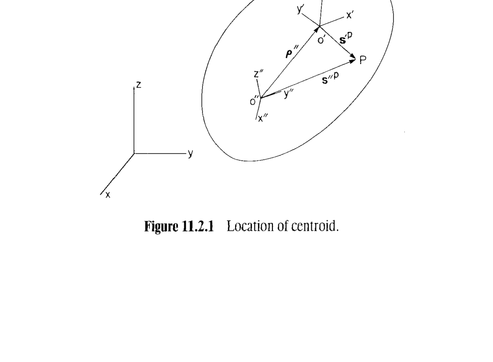

### 从定义到 Eq. 11.2.1

设 $\mathbf C$ 是把 $x''$ 系转到 $x'$ 系的常正交变换矩阵：$\mathbf s'=\mathbf C\mathbf s''$。对任一物质点 $P$，其在两系中的位置向量满足

$$
\mathbf s'^P=\mathbf C(\mathbf s''^P-\boldsymbol\rho'')
$$

其中 $\boldsymbol\rho''$ 是质心 $O'$ 在 $x''$ 系中的坐标。把它代入 (11.1.13)：

$$
\begin{aligned}
\mathbf 0 &=\int_m\mathbf s'^P\,dm(P)
=\int_m \mathbf C\bigl(\mathbf s''^P-\boldsymbol\rho''\bigr)dm(P)\\
&=\mathbf C\int_m\mathbf s''^P\,dm(P)-\mathbf C\boldsymbol\rho''\int_m dm(P)\\
&=\mathbf C\int_m\mathbf s''^P\,dm(P)-m\,\mathbf C\boldsymbol\rho''.
\end{aligned}
$$

左乘 $\mathbf C^T=\mathbf C^{-1}$（$\mathbf C$ 正交）得

$$
\boxed{\;\boldsymbol\rho''=\dfrac{1}{m}\int_m\mathbf s''^P\,dm(P)\;} \tag{11.2.1}
$$

即"质心 = 质量加权平均位置"这一直觉的严格代数体现。**关键点：$\mathbf C$ 消失了**——质心在体内的位置与你选哪个平行的坐标系无关，因此可以对每个坐标分量分开算。

### 例 11.2.1：一个楔形均匀体

> 图 11.2.2 中的均匀体，底面为 $10\times10$ 的正方形，$z''$ 方向上下面分别为 $11+0.2y''$ 与 $9-0.2y''$，密度 $\gamma$ 恒定。

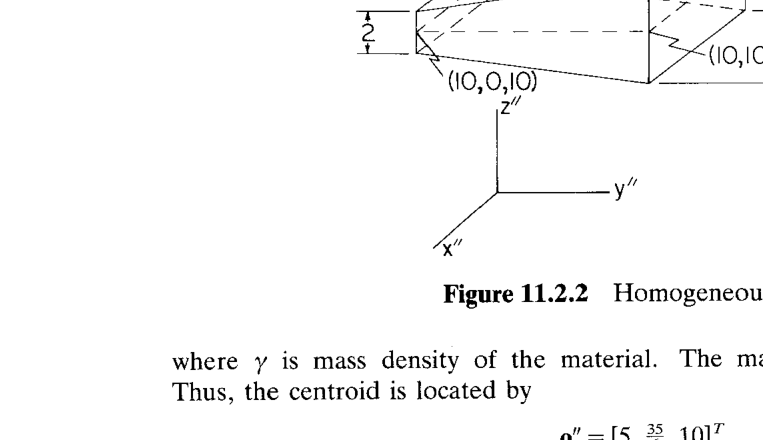

对每分量都套 (11.2.1)：

$$
\boldsymbol\rho''=\frac{1}{m}\int_0^{10}\!\!\int_0^{10}\!\!\int_{9-0.2y''}^{11+0.2y''}\gamma\,[x'',y'',z'']^T\,dz''\,dy''\,dx''.
$$

先积 $z''$：区间长度 $(11+0.2y'')-(9-0.2y'')=2+0.4y''$，$z''$ 项积得 $\tfrac12\bigl[(11+0.2y'')^2-(9-0.2y'')^2\bigr]=\tfrac12(2+0.4y'')(20+0.4y'')\cdot\ldots$——书里已给出中间结果

$$
\boldsymbol\rho''=\frac{\gamma}{m}\int_0^{10}\!\!\int_0^{10}\bigl[x''(2+0.4y''),\ y''(2+0.4y''),\ 20+4y''\bigr]^T dy''\,dx''.
$$

（其中 $z$ 分量用 $\tfrac12(11+0.2y'')^2-\tfrac12(9-0.2y'')^2=\tfrac12\bigl[(11+0.2y'')-(9-0.2y'')\bigr]\bigl[(11+0.2y'')+(9-0.2y'')\bigr]=(2+0.4y'')\cdot 10=20+4y''$。）

再积 $y''$（$0\to10$）：

- $\int_0^{10}(2+0.4y'')\,dy''=[2y''+0.2y''^2]_0^{10}=20+20=40$，故 $x''$ 分量给出 $40x''$；
- $\int_0^{10}y''(2+0.4y'')\,dy''=[y''^2+\tfrac{0.4}{3}y''^3]_0^{10}=100+\tfrac{400}{3}=\tfrac{700}{3}$；
- $\int_0^{10}(20+4y'')\,dy''=[20y''+2y''^2]_0^{10}=200+200=400$。

$$
\boldsymbol\rho''=\frac{\gamma}{m}\int_0^{10}\Bigl[40x'',\ \tfrac{700}{3},\ 400\Bigr]^T dx''
=\frac{\gamma}{m}\Bigl[2000,\ \tfrac{7000}{3},\ 4000\Bigr]^T.
$$

质量 $m=\int_0^{10}\!\int_0^{10}\gamma(2+0.4y'')\,dy''\,dx''=\gamma\cdot 10\cdot 40=400\gamma$。代回：

$$
\boxed{\;\boldsymbol\rho''=\bigl[5,\ \tfrac{35}{6},\ 10\bigr]^T\;}
$$

（$x''=5$、$z''=10$ 是几何对称面，故质心必在其上；$y''$ 分量因楔形而偏离 $5$。）

### 对称性的利用：Eqs. 11.2.2–11.2.3

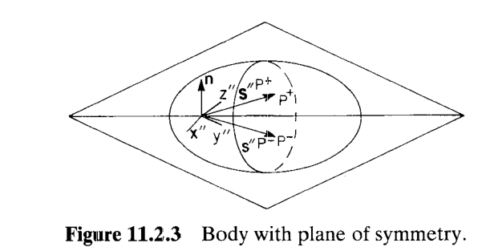

**设物体在几何与质量分布上都关于一个平面对称**，取 $x''$ 系原点落在该对称面上，令平面法向为单位向量 $\mathbf n$。对称面把体分为 $m^+$ 和 $m^-$，每个 $P^+\in m^+$ 都对应镜像 $P^-\in m^-$，且

$$
\mathbf n^T\mathbf s''^{P^-}=-\mathbf n^T\mathbf s''^{P^+},\qquad dm(P^-)=dm(P^+). \tag{11.2.2}
$$

将 (11.2.1) 两端左点乘 $\mathbf n^T$、并把积分域拆成 $m^+\cup m^-$，用 (11.2.2) 把 $P^-$ 积分换回 $P^+$：

$$
\begin{aligned}
\mathbf n^T\boldsymbol\rho''
&=\frac{1}{m}\int_m\mathbf n^T\mathbf s''^P\,dm(P)\\
&=\frac{1}{m}\int_{m^+}\mathbf n^T\mathbf s''^{P^+}dm(P^+)+\frac{1}{m}\int_{m^-}\mathbf n^T\mathbf s''^{P^-}dm(P^-)\\
&=\frac{1}{m}\int_{m^+}\mathbf n^T\mathbf s''^{P^+}dm(P^+)+\frac{1}{m}\int_{m^+}\mathbf n^T(-\mathbf s''^{P^+})dm(P^+)\\
&=0. \tag{11.2.3}
\end{aligned}
$$

$\mathbf n^T\boldsymbol\rho''=0$ 表示质心在对称面上。**推论**：若有**对称轴（axis of symmetry）**——即经过它的每一个平面都是对称面——则质心必在轴上。（几何对称但质量非均匀者不适用。）

## 11.2.2 惯性矩阵的变换（Transformation of Inertia Matrices）

### 思路

§11.1 用的是**质心系** $\mathbf J'=-\int_m\tilde{\mathbf s}'^P\tilde{\mathbf s}'^P dm$（Eq. 11.1.17）。工程上更方便的常是在非质心 $x''$ 系里量出几何、算出

$$
\mathbf J''\equiv-\int_m\tilde{\mathbf s}''^P\tilde{\mathbf s}''^P\,dm(P). \tag{11.2.4}
$$

问题：怎样从 $\mathbf J''$ 得到 $\mathbf J'$（或反过来）？换句话说，惯性矩阵在做**"平移 + 转动"** 时怎样变。

### 推导：Eqs. 11.2.5–11.2.7

以 $\mathbf s''^P=\boldsymbol\rho''+\mathbf C^T\mathbf s'^P$ 代入 (11.2.4)，注意 $\widetilde{\boldsymbol\rho''+\mathbf C^T\mathbf s'^P}=\tilde{\boldsymbol\rho}''+\widetilde{\mathbf C^T\mathbf s'^P}$（波浪号算子对加法线性）：

$$
\mathbf J''=-\int_m\bigl(\tilde{\boldsymbol\rho}''+\widetilde{\mathbf C^T\mathbf s'^P}\bigr)\bigl(\tilde{\boldsymbol\rho}''+\widetilde{\mathbf C^T\mathbf s'^P}\bigr)dm(P).
$$

$\tilde{\boldsymbol\rho}''$ 是常量、可提到积分外；展开四项后得

$$
\mathbf J''=-m\tilde{\boldsymbol\rho}''\tilde{\boldsymbol\rho}''
-\tilde{\boldsymbol\rho}''\mathbf C^T\!\!\int_m\!\!\tilde{\mathbf s}'^P dm(P)\,\mathbf C
-\mathbf C^T\!\!\int_m\!\!\tilde{\mathbf s}'^P dm(P)\,\mathbf C\tilde{\boldsymbol\rho}''
-\mathbf C^T\!\!\int_m\!\!\tilde{\mathbf s}'^P\tilde{\mathbf s}'^P dm(P)\,\mathbf C. \tag{11.2.5}
$$

（中间两项都用了 Eq. 9.2.21，即 $\widetilde{\mathbf C^T\mathbf s'}=\mathbf C^T\tilde{\mathbf s}'\mathbf C$，然后把 $\mathbf C^T,\mathbf C$ 提到积分外。）

由于 $x'$ 系是质心系，Eq. 11.1.13 给出 $\int_m\mathbf s'^P dm=\mathbf 0$，从而 $\int_m\tilde{\mathbf s}'^P dm=\mathbf 0$（波浪号只重新排列坐标），中间两项消失。最后一项按 (11.1.17) 就是 $\mathbf C^T\mathbf J'\mathbf C$。于是

$$
\boxed{\;\mathbf J''=\mathbf C^T\mathbf J'\mathbf C-m\tilde{\boldsymbol\rho}''\tilde{\boldsymbol\rho}''\;} \tag{11.2.6}
$$

**（严格用到 $x'$ 系是质心系；否则中间两项不为零，公式更复杂。）**

进一步利用波浪号算子的恒等式（Eq. 9.1.28）

$$
-\tilde{\mathbf a}\tilde{\mathbf a}=\mathbf a^T\mathbf a\,\mathbf I-\mathbf a\mathbf a^T,
$$

即 $-\tilde{\boldsymbol\rho}''\tilde{\boldsymbol\rho}''=(\boldsymbol\rho''^T\boldsymbol\rho'')\mathbf I-\boldsymbol\rho''\boldsymbol\rho''^T$，把 (11.2.6) 化为惯性张量的**平移 + 转动**标准形式：

$$
\boxed{\;\mathbf J''=\mathbf C^T\mathbf J'\mathbf C+m\bigl(\boldsymbol\rho''^T\boldsymbol\rho''\,\mathbf I-\boldsymbol\rho''\boldsymbol\rho''^T\bigr).\;} \tag{11.2.7}
$$

### 平行轴定理（Eqs. 11.2.8–11.2.9）

**特例**：$\mathbf C=\mathbf I$（两系轴向平行），此时 (11.2.7) 展开成对角/非对角两组分量。设 $\boldsymbol\rho''=[\rho_{x''},\rho_{y''},\rho_{z''}]^T$，$\boldsymbol\rho''^T\boldsymbol\rho''=\rho_{x''}^2+\rho_{y''}^2+\rho_{z''}^2$，则

$$
m\bigl(\boldsymbol\rho''^T\boldsymbol\rho''\mathbf I-\boldsymbol\rho''\boldsymbol\rho''^T\bigr)
=m\begin{bmatrix}
\rho_{y''}^2+\rho_{z''}^2 & -\rho_{x''}\rho_{y''} & -\rho_{x''}\rho_{z''}\\
-\rho_{x''}\rho_{y''} & \rho_{x''}^2+\rho_{z''}^2 & -\rho_{y''}\rho_{z''}\\
-\rho_{x''}\rho_{z''} & -\rho_{y''}\rho_{z''} & \rho_{x''}^2+\rho_{y''}^2
\end{bmatrix}.
$$

其对角元加到 $\mathbf J'$ 的对角元：

$$
\boxed{\;
\begin{aligned}
J_{x''x''}&=J_{x'x'}+m(\rho_{y''}^2+\rho_{z''}^2)\\
J_{y''y''}&=J_{y'y'}+m(\rho_{x''}^2+\rho_{z''}^2)\\
J_{z''z''}&=J_{z'z'}+m(\rho_{x''}^2+\rho_{y''}^2)
\end{aligned}\;}
\tag{11.2.8}
$$

**这就是平行轴定理**：非质心平行系里的**惯性矩（moment of inertia）** = 质心系里的惯性矩 + $m\times$（两根平行轴的距离）$^2$。对惯性积（$\mathbf J$ 的非对角元 $J_{ij}=-\int x_i x_j dm$）：

$$
\boxed{\;
\begin{aligned}
J_{x''y''}&=J_{x'y'}-m\rho_{x''}\rho_{y''}\\
J_{x''z''}&=J_{x'z'}-m\rho_{x''}\rho_{z''}\\
J_{y''z''}&=J_{y'z'}-m\rho_{y''}\rho_{z''}
\end{aligned}\;}
\tag{11.2.9}
$$

（注意：$J_{ij}$ 定义带负号，故非对角修正也带负号；这与 (11.2.7) 里的 $-\boldsymbol\rho''\boldsymbol\rho''^T$ 一致。）

### 对称平面 → 两个惯性积为零

若 $x''\text{-}y''$ 平面为对称面（几何 + 质量），取 $\mathbf n=[0,0,1]^T$。用与 Eq. 11.2.3 同样的镜像论证（$P^+\leftrightarrow P^-$ 时 $z''$ 换号、$x'',y''$ 不变），得

$$
J_{z''x''}=-\int_m z''x''\,dm=0,\qquad J_{z''y''}=-\int_m z''y''\,dm=0. \tag{11.2.10}
$$

同理若 $x''\text{-}z''$ 平面对称，则 $J_{x''y''}=J_{z''y''}=0$（Eq. 11.2.11）；若 $y''\text{-}z''$ 平面对称，则 $J_{x''y''}=J_{x''z''}=0$（Eq. 11.2.12）。

**推论**：**若 $x''$ 系有两个坐标平面同时对称，则三个惯性积全部为零**。这一性质在机械件中很常见（旋转体、板、方体等）。

### 例 11.2.2：楔形体的质心系惯性性质

用平行轴定理（Eq. 11.2.8）从 Example 11.2.1 结果反推质心系惯性矩。$m=400\gamma$，$\rho_{x''}=5$、$\rho_{y''}=35/6$、$\rho_{z''}=10$：

$$
\begin{aligned}
J_{x'x'}&=J_{x''x''}-400\gamma\Bigl[(35/6)^2+100\Bigr]\\
J_{y'y'}&=J_{y''y''}-400\gamma\bigl[25+100\bigr]\\
J_{z'z'}&=J_{z''z''}-400\gamma\Bigl[25+(35/6)^2\Bigr]
\end{aligned}
$$

（$J_{x''x''}$ 等由 Prob. 11.2.3 得到，此处不给数字。）由于 $x'\text{-}y'$ 与 $y'\text{-}z'$ 都是几何 + 质量对称面，$J_{x'y'}=J_{x'z'}=J_{y'z'}=0$。

## 11.2.3 主轴（Principal Axes）与主惯性矩

### 思路

即使体没有明显对称面，也总能找到一个**质心系**使得 $\mathbf J$ 对角。这正是对称矩阵谱定理的物理体现。找到这样的系 = 找一个正交矩阵 $\mathbf C$，使 $\mathbf C\mathbf J''\mathbf C^T$ 对角。

### 从 Eq. 11.2.7 出发：Eq. 11.2.13

设 $\mathbf J''$ 已在**质心非旋转随体系** $x''$ 中给出（$\boldsymbol\rho''=\mathbf 0$，即 $x''$ 系原点已在质心）。Eq. 11.2.7 退化为

$$
\mathbf J''=\mathbf C^T\mathbf J'\mathbf C \;\;\Longleftrightarrow\;\; \mathbf J'=\mathbf C\mathbf J''\mathbf C^T. \tag{11.2.13}
$$

任务：找 $\mathbf C$ 使 $\mathbf J'$ 对角。

### $\mathbf J''$ 的半正定性（Eq. 11.2.14）

对任何 $\mathbf a\in\mathbb R^3$：

$$
\mathbf a^T\mathbf J''\mathbf a=-\int_m\mathbf a^T\tilde{\mathbf s}''\tilde{\mathbf s}''\mathbf a\,dm
=\int_m\mathbf a^T\tilde{\mathbf s}''^T\tilde{\mathbf s}''\mathbf a\,dm
=\int_m(\tilde{\mathbf s}''\mathbf a)^T(\tilde{\mathbf s}''\mathbf a)\,dm\ge 0. \tag{11.2.14}
$$

（用 $\tilde{\mathbf s}''^T=-\tilde{\mathbf s}''$。）若密度处处非零、且体内可选出三个线性独立位置向量 $\mathbf s_1'',\mathbf s_2'',\mathbf s_3''$，则 $\mathbf a^T\mathbf J''\mathbf a=0\Rightarrow \tilde{\mathbf s}''\mathbf a=\mathbf 0$ 对所有 $\mathbf s''$，即 $\mathbf a\times\mathbf s''=\mathbf 0$，取三个独立点得 $\mathbf a=\mathbf 0$：**$\mathbf J''$ 正定**。

### 谱分解（Eqs. 11.2.15–11.2.17）

$3\times3$ 半正定对称矩阵 $\mathbf J''$ 有三个相互正交的单位**特征向量（eigenvectors）** $\mathbf f'',\mathbf g'',\mathbf h''$，对应非负**特征值**（**principal moments of inertia**）$\zeta_1\ge\zeta_2\ge\zeta_3\ge0$：

$$
\mathbf J''\mathbf f''=\zeta_1\mathbf f'',\quad \mathbf J''\mathbf g''=\zeta_2\mathbf g'',\quad \mathbf J''\mathbf h''=\zeta_3\mathbf h''. \tag{11.2.15}
$$

由于 $-\mathbf g'',-\mathbf h''$ 也是特征向量，可调整符号让 $[\mathbf f'',\mathbf g'',\mathbf h'']$ 构成**右手系**。此三列即质心 $x'$ 系的坐标轴在 $x''$ 系中的坐标；由 Eq. 9.2.13（**方向余弦矩阵**列为随体轴单位向量），

$$
\mathbf C^T=[\mathbf f'',\mathbf g'',\mathbf h'']. \tag{11.2.16}
$$

代回 (11.2.13)：

$$
\begin{aligned}
\mathbf J'&=\mathbf C\mathbf J''\mathbf C^T
=[\mathbf f'',\mathbf g'',\mathbf h'']^T\mathbf J''[\mathbf f'',\mathbf g'',\mathbf h'']\\
&=[\mathbf f'',\mathbf g'',\mathbf h'']^T[\mathbf J''\mathbf f'',\ \mathbf J''\mathbf g'',\ \mathbf J''\mathbf h'']\\
&=[\mathbf f'',\mathbf g'',\mathbf h'']^T[\zeta_1\mathbf f'',\ \zeta_2\mathbf g'',\ \zeta_3\mathbf h'']\\
&=[\mathbf f'',\mathbf g'',\mathbf h'']^T[\mathbf f'',\mathbf g'',\mathbf h'']\operatorname{diag}(\zeta_1,\zeta_2,\zeta_3)\\
&=\operatorname{diag}(\zeta_1,\zeta_2,\zeta_3). \tag{11.2.17}
\end{aligned}
$$

（最后一步用了 $[\mathbf f'',\mathbf g'',\mathbf h'']$ 正交 ⇒ $[\mathbf f'',\mathbf g'',\mathbf h'']^T[\mathbf f'',\mathbf g'',\mathbf h'']=\mathbf I$。）

在这样的 $x'$ 系里：$J_{x'x'}=\zeta_1,\ J_{y'y'}=\zeta_2,\ J_{z'z'}=\zeta_3$，全部惯性积 $=0$。这些轴叫**主轴（principal axes）**，$\zeta_i$ 叫**主惯性矩（principal moments of inertia）**；**主惯性积（principal products of inertia）恒为零**。

### 例 11.2.3：三角板的主轴

> 图 11.2.4 中 $x''\text{-}y''$ 平面内三角形（$x+y\le 1,\ x\ge0,\ y\ge0$）薄板，面密度 $\gamma$。板厚忽略，故 $z=0$。

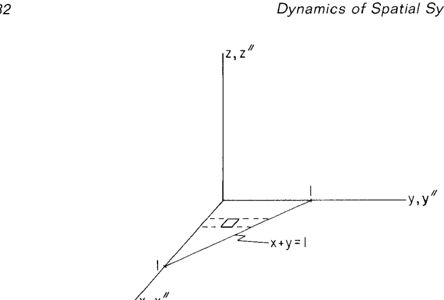

**第一步：在 $x''$ 系里算 $\mathbf J''$。** 由 Eq. 11.1.17 展开每项（以 $y'^2+z'^2$ 为例）：

$$
J''_{xx}=\gamma\int_0^1\!\!\int_0^{1-x}y^2\,dy\,dx
=\gamma\int_0^1\frac{(1-x)^3}{3}dx=\frac{\gamma}{12}.
$$

由对称 $x\leftrightarrow y$（三角形关于 $y=x$ 对称）得 $J''_{yy}=J''_{xx}=\gamma/12$。

$$
J''_{zz}=\gamma\int_0^1\!\!\int_0^{1-x}(x^2+y^2)\,dy\,dx
=\gamma\int_0^1\Bigl[x^2(1-x)+\frac{(1-x)^3}{3}\Bigr]dx=\frac{\gamma}{6}.
$$

（分开算：$\int_0^1 x^2(1-x)dx=1/3-1/4=1/12$；$\int_0^1\tfrac{(1-x)^3}{3}dx=\tfrac{1}{12}$；和 $=1/6$。）

惯性积：

$$
J''_{xy}=-\gamma\int_0^1\!\!\int_0^{1-x}xy\,dy\,dx
=-\gamma\int_0^1\frac{x(1-x)^2}{2}dx=-\frac{\gamma}{24}.
$$

（$\int_0^1 x(1-x)^2 dx=\int_0^1(x-2x^2+x^3)dx=1/2-2/3+1/4=1/12$。）$J''_{xz}=J''_{yz}=0$（$z=0$）。故

$$
\mathbf J''=\frac{\gamma}{24}\begin{bmatrix}2 & -1 & 0\\ -1 & 2 & 0\\ 0 & 0 & 4\end{bmatrix}.
$$

**第二步：质心与到质心系的平移。** 质量 $m=\gamma/2$（三角形面积 $\times$ 密度）。

$$
\boldsymbol\rho''=\frac{2}{\gamma}\int_0^1\!\!\int_0^{1-x}[x,y,0]^T\gamma\,dy\,dx=\Bigl[\tfrac13,\tfrac13,0\Bigr]^T.
$$

（$\int_0^1 x(1-x)dx=1/6$，$\times 2=1/3$。）

用平行轴定理（Eqs. 11.2.8–11.2.9），$\rho_{x''}=\rho_{y''}=1/3,\ \rho_{z''}=0$：

$$
\mathbf J'=\mathbf J''-m\begin{bmatrix}\rho_{y''}^2+\rho_{z''}^2 & -\rho_{x''}\rho_{y''} & -\rho_{x''}\rho_{z''}\\ -\rho_{x''}\rho_{y''} & \rho_{x''}^2+\rho_{z''}^2 & -\rho_{y''}\rho_{z''}\\ -\rho_{x''}\rho_{z''} & -\rho_{y''}\rho_{z''} & \rho_{x''}^2+\rho_{y''}^2\end{bmatrix}
$$

（**注意符号**：由 Eq. 11.2.8 $J_{x''x''}=J_{x'x'}+m(\rho_{y''}^2+\rho_{z''}^2)$，因此 $J_{x'x'}=J_{x''x''}-m(\rho_{y''}^2+\rho_{z''}^2)$；同理其余。）代入 $m(1/3)^2=\gamma/18$、$m(1/9)=\gamma/18$：

$$
\mathbf J'=\frac{\gamma}{24}\!\begin{bmatrix}2&-1&0\\-1&2&0\\0&0&4\end{bmatrix}-\frac{\gamma}{18}\!\begin{bmatrix}1&-1&0\\-1&1&0\\0&0&2\end{bmatrix}
=\frac{\gamma}{72}\!\begin{bmatrix}2&1&0\\1&2&0\\0&0&4\end{bmatrix}.
$$

（对角：$\gamma\cdot\frac{2}{24}-\gamma\cdot\frac{1}{18}=\gamma(\tfrac{3-2}{36})=\gamma/36=2\gamma/72$；非对角：$-\gamma/24-(-\gamma/18)=\gamma(\tfrac{-3+4}{72})=\gamma/72$；$zz$：$4\gamma/24-2\gamma/18=\gamma(\tfrac{12-8}{72})\cdot$ 不，重算：$4\gamma/24=\gamma/6=12\gamma/72$；$2\gamma/18=8\gamma/72$；差 $4\gamma/72\ne 4\gamma$。哎——书里给的结果是 $\mathbf J'=\tfrac{\gamma}{72}\operatorname{diag/matrix}\bigl[[2,1,0],[1,2,0],[0,0,4]\bigr]$，所以 $J_{z'z'}=4\gamma/72=\gamma/18$。修正：$4\gamma/24=\gamma/6=12\gamma/72$，$2\gamma/18=8\gamma/72$，差 $=4\gamma/72$ ✓。第 $(1,2)$ 元：$-\gamma/24-(-\gamma/18)=\gamma(-1/24+1/18)=\gamma\cdot\tfrac{-3+4}{72}=\gamma/72$ ✓。）

**第三步：特征值。** 因 $z'$ 分量已解耦，$z'$ 即为一根主轴，主惯性矩 $=\gamma/18$。剩下 $x'\text{-}y'$ 子块

$$
\mathbf J'_{2\times 2}=\frac{\gamma}{72}\begin{bmatrix}2&1\\1&2\end{bmatrix}=\gamma\begin{bmatrix}1/36 & 1/72\\ 1/72 & 1/36\end{bmatrix}.
$$

特征方程

$$
\bigl(\tfrac{\gamma}{36}-\zeta\bigr)^2-\bigl(\tfrac{\gamma}{72}\bigr)^2=0
\;\Longrightarrow\; \tfrac{\gamma}{36}-\zeta=\pm\tfrac{\gamma}{72}
\;\Longrightarrow\; \zeta=\tfrac{\gamma}{24}\ \text{或}\ \tfrac{\gamma}{72}.
$$

因书里约定 $\zeta_1\ge\zeta_2\ge\zeta_3$：

$$
\boxed{\;\zeta_1=\dfrac{\gamma}{18},\ \zeta_2=\dfrac{\gamma}{24},\ \zeta_3=\dfrac{\gamma}{72}\;}
$$

**第四步：特征向量。**
- $\zeta_1=\gamma/18$：$\mathbf f'=[0,0,1]^T$（$z'$ 轴）。
- $\zeta_2=\gamma/24$：解 $\bigl(\mathbf J'_{2\times 2}-\gamma/24\cdot\mathbf I\bigr)\mathbf v=0$。$\gamma/24=3\gamma/72$，$\mathbf J'_{2\times 2}-\zeta\mathbf I=\gamma/72\begin{bmatrix}-1&1\\1&-1\end{bmatrix}$；解 $v_x=v_y$，单位化 $\mathbf g'=[1/\sqrt 2,1/\sqrt 2,0]^T$。
- $\zeta_3=\gamma/72$：$\mathbf J'_{2\times 2}-\zeta\mathbf I=\gamma/72\begin{bmatrix}1&1\\1&1\end{bmatrix}$；解 $v_x+v_y=0$，取 $\mathbf h'=[-1/\sqrt 2,1/\sqrt 2,0]^T$（选此符号使 $\mathbf f',\mathbf g',\mathbf h'$ 右手；核对 $\mathbf f'\times\mathbf g'=[-\tfrac{1}{\sqrt2},\tfrac{1}{\sqrt2},0]^T=\mathbf h'$ ✓）。

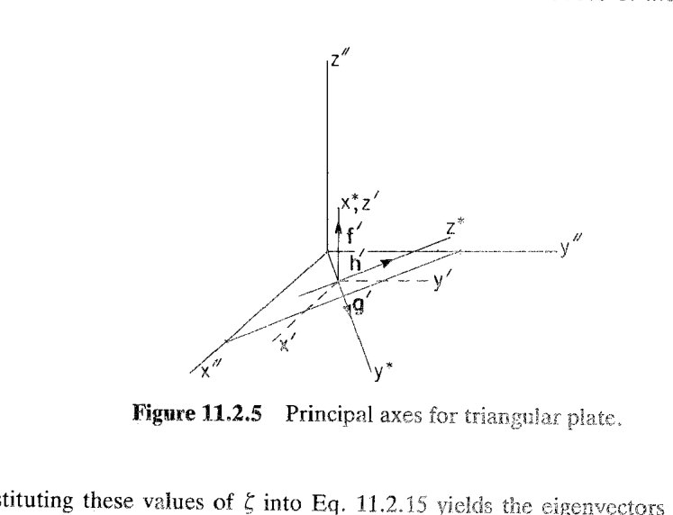

**结果**：主轴 $x^*=\mathbf g'$（沿 $y=x$ 方向）、$y^*=\mathbf h'$（沿 $y=-x$ 方向）、$z^*=\mathbf f'$（垂直板面）；对角惯性矩阵

$$
\mathbf J^*=\begin{bmatrix}\gamma/18 & 0 & 0\\ 0 & \gamma/24 & 0\\ 0 & 0 & \gamma/72\end{bmatrix}.
$$

**物理直觉**：板面上过质心且与两直角边成 $45^\circ$ 的两根轴刚好把 $J_{x'y'}$ 解耦（对称的两个方向）。

## 11.2.4 复合体（Composite Bodies）的惯性性质

### 思路

工程零件常由**若干标准形状子部件（subcomponents）** 拼装（曲柄 = 中间圆盘 + 两端圆柱等），甚至含**空洞（voids）**（钻孔、掏槽）。目标：**从每块子部件的 $m_i,\boldsymbol\rho_i,\mathbf J_i$ 组装出整体的 $m,\boldsymbol\rho'',\mathbf J^*$**——把连续积分变成有限求和，可解析、可编程。

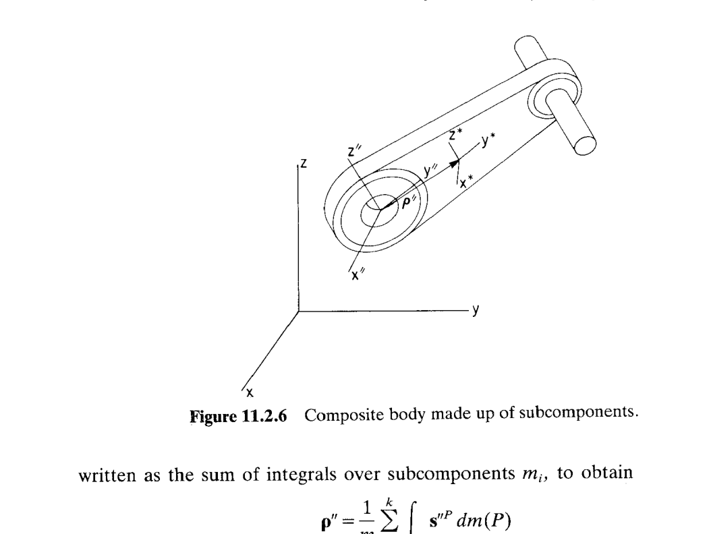

### 复合体的质心（Eq. 11.2.18）

选便于测量的 $x''$ 系（可能不是任何子部件的质心系）。整体积分拆成子部件积分：

$$
\boldsymbol\rho''=\frac{1}{m}\int_m\mathbf s''^P dm(P)
=\frac{1}{m}\sum_{i=1}^{k}\int_{m_i}\mathbf s''^P dm(P)
=\frac{1}{m}\sum_{i=1}^{k}m_i\boldsymbol\rho''_i,
\qquad m=\sum_{i=1}^{k}m_i. \tag{11.2.18}
$$

（第二步：**每个子部件对 $x''$ 系的质心积分等于其质量乘其质心在 $x''$ 系里的位置**——因这正是 (11.2.1) 应用于该子部件的形式。）

### 复合体的惯性矩阵（Eq. 11.2.19）

记复合体的质心系为 $x^*\text{-}y^*\text{-}z^*$（用星号以避免与子部件的质心系 $x'_i\text{-}y'_i\text{-}z'_i$ 混淆）。由 (11.1.17)

$$
\mathbf J^*=-\int_m\tilde{\mathbf s}^{*P}\tilde{\mathbf s}^{*P}dm(P)
=\sum_{i=1}^{k}\Bigl(-\int_{m_i}\tilde{\mathbf s}^{*P}\tilde{\mathbf s}^{*P}dm(P)\Bigr)
=\sum_{i=1}^{k}\mathbf J^*_i, \tag{11.2.19}
$$

其中 $\mathbf J^*_i$ 是**子部件 $i$ 在复合体质心系 $x^*$ 中的惯性矩阵**（**注意不是子部件自身质心系里的**）。

### 每个子部件的 $\mathbf J^*_i$ 由 Eq. 11.2.7 得（Eq. 11.2.20）

对第 $i$ 块，用 (11.2.7)：设 $\mathbf C'_i$ 是从 $x^*$ 系到子部件质心系 $x'_i$ 的变换矩阵，$\boldsymbol\rho'_i$ 为子部件质心在 $x^*$ 系中的位置向量，则

$$
\boxed{\;\mathbf J^*_i=\mathbf C'^T_i\mathbf J'_i\mathbf C'_i+m_i\bigl(\boldsymbol\rho'^T_i\boldsymbol\rho'_i\,\mathbf I-\boldsymbol\rho'_i\boldsymbol\rho'^T_i\bigr).\;} \tag{11.2.20}
$$

**用法**：
1. **确定 $\boldsymbol\rho'_i$**：从 (11.2.18) 算出复合体质心 $\boldsymbol\rho''$（相对 $x''$ 系），再把 $x^*$ 系原点平移到该处；然后子部件 $i$ 的质心相对 $x^*$ 系的位置就是 $\boldsymbol\rho'_i=\boldsymbol\rho''_i-\boldsymbol\rho''$。
2. **确定 $\mathbf C'_i$**：如果 $x^*$ 与 $x'_i$ 轴向平行则 $\mathbf C'_i=\mathbf I$，(11.2.20) 退化为平行轴定理；若不平行，先按几何写出 $\mathbf C'_i$（$x'_i$ 系三根单位轴在 $x^*$ 系中的坐标）。
3. **查/算 $\mathbf J'_i$**：从表 11.2.1 中直接取，或按标准形状公式计算。

### 空洞（voids）的处理

**若子部件为空洞**，把它当作**负质量的实体**：赋 $-\mathbf J^*_i$（其中 $\mathbf J^*_i$ 是若空洞被实心填满、同密度物质占据后应有的惯性矩阵）加到 (11.2.19) 中即可。质心公式 (11.2.18) 同理，对空洞用 $-m_i$。

### 标准形状：Table 11.2.1

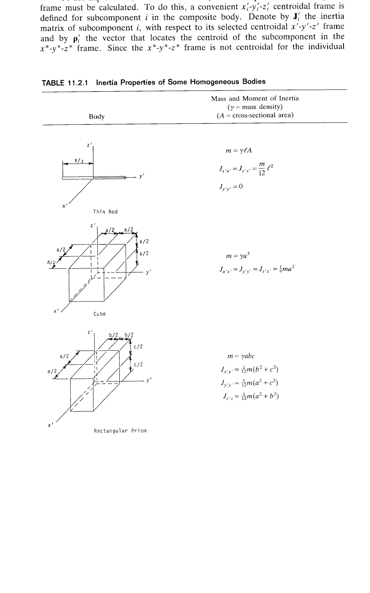

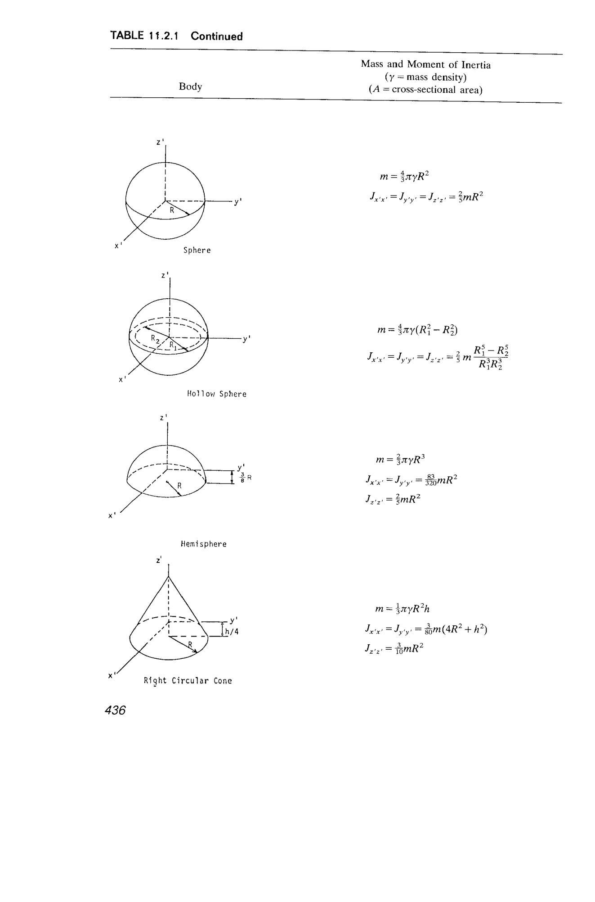

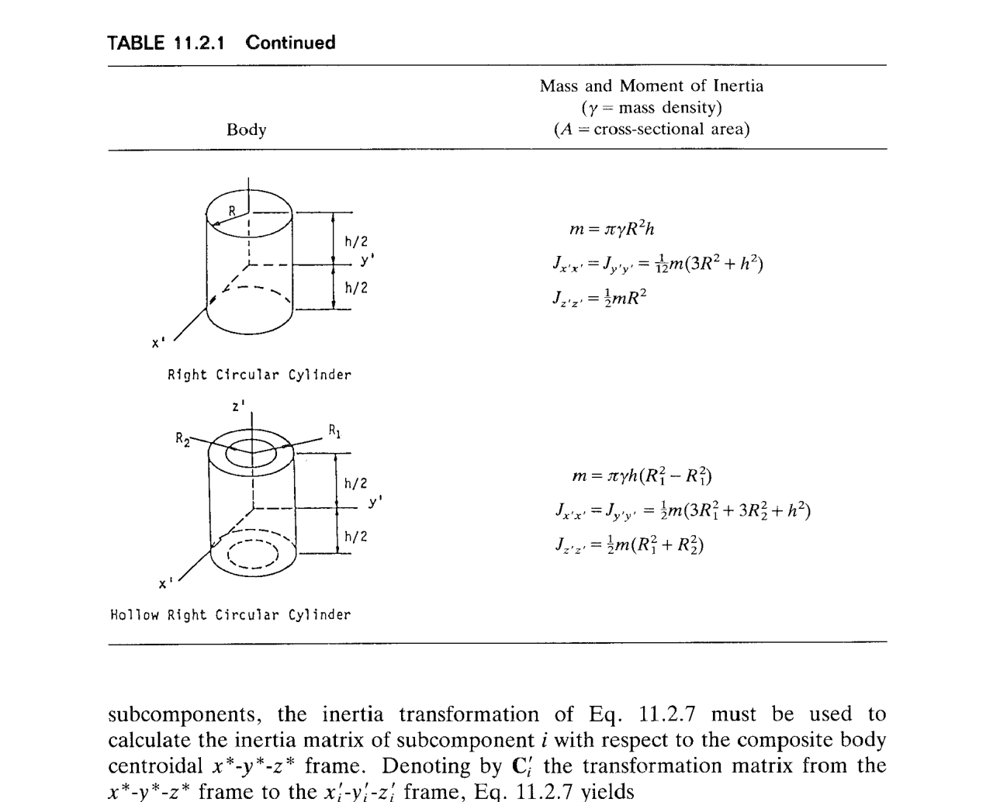

**关键公式摘录**（均为**质心系**中的对角惯性矩，惯性积为零；$\gamma=$ 质量密度、$A=$ 截面积）：

| 形状 | 质量 $m$ | $J_{x'x'}$ | $J_{y'y'}$ | $J_{z'z'}$ |
|---|---|---|---|---|
| 细杆（沿 $y'$，长 $\ell$） | $\gamma\ell A$ | $\tfrac{m}{12}\ell^2$ | $0$ | $\tfrac{m}{12}\ell^2$ |
| 立方体（边 $a$） | $\gamma a^3$ | $\tfrac{1}{6}ma^2$ | $\tfrac{1}{6}ma^2$ | $\tfrac{1}{6}ma^2$ |
| 长方体（$a,b,c$，分别沿 $x',y',z'$） | $\gamma abc$ | $\tfrac{m}{12}(b^2+c^2)$ | $\tfrac{m}{12}(a^2+c^2)$ | $\tfrac{m}{12}(a^2+b^2)$ |
| 实心球（半径 $R$） | $\tfrac{4}{3}\pi\gamma R^3$ | $\tfrac{2}{5}mR^2$ | $\tfrac{2}{5}mR^2$ | $\tfrac{2}{5}mR^2$ |
| 空心球（外 $R_1$、内 $R_2$）* | $\tfrac{4}{3}\pi\gamma(R_1^3-R_2^3)$ | $\tfrac{2}{5}m\dfrac{R_1^5-R_2^5}{R_1^3-R_2^3}$ | 同左 | 同左 |
| 半球（半径 $R$，扁面朝 $-z'$，质心在 $z'=3R/8$） | $\tfrac{2}{3}\pi\gamma R^3$ | $\tfrac{83}{320}mR^2$ | $\tfrac{83}{320}mR^2$ | $\tfrac{2}{5}mR^2$ |
| 正圆锥（半径 $R$、高 $h$，轴 $z'$、质心 $z'=h/4$） | $\tfrac{1}{3}\pi\gamma R^2 h$ | $\tfrac{3}{80}m(4R^2+h^2)$ | $\tfrac{3}{80}m(4R^2+h^2)$ | $\tfrac{3}{10}mR^2$ |
| 正圆柱（半径 $R$、长 $h$，轴 $z'$） | $\pi\gamma R^2 h$ | $\tfrac{1}{12}m(3R^2+h^2)$ | 同左 | $\tfrac{1}{2}mR^2$ |
| 空心圆柱（$R_1,R_2,h$） | $\pi\gamma h(R_1^2-R_2^2)$ | $\tfrac{1}{12}m(3R_1^2+3R_2^2+h^2)$ | 同左 | $\tfrac{1}{2}m(R_1^2+R_2^2)$ |

> \* **原书表格空心球一行有印刷错误**：书上把 $m$ 的括号写成 $(R_1^2-R_2^2)$、把 $J$ 的分母写成 $R_1^3R_2^3$（无减号）。正确形式应为 $m=\tfrac{4}{3}\pi\gamma(R_1^3-R_2^3)$、$J=\tfrac{2}{5}m\dfrac{R_1^5-R_2^5}{R_1^3-R_2^3}$（可直接由 $m=\int_0^{R_1}-\int_0^{R_2}$ 与 $J=\tfrac{8}{15}\pi\gamma(R_1^5-R_2^5)$ 相除验证）。本笔记按正确形式使用。

### 例 11.2.4：两端带半球盖的圆柱

> 图 11.2.7：均匀圆柱（半径 $R$、长 $L$，沿 $y$ 轴）两端各拼一个半球（球心处即圆柱端面圆心）。$x$-$y$-$z$ 三平面均对称 ⇒ 质心在原点、所有惯性积为零，只需算三个 $J_{xx},J_{yy},J_{zz}$。

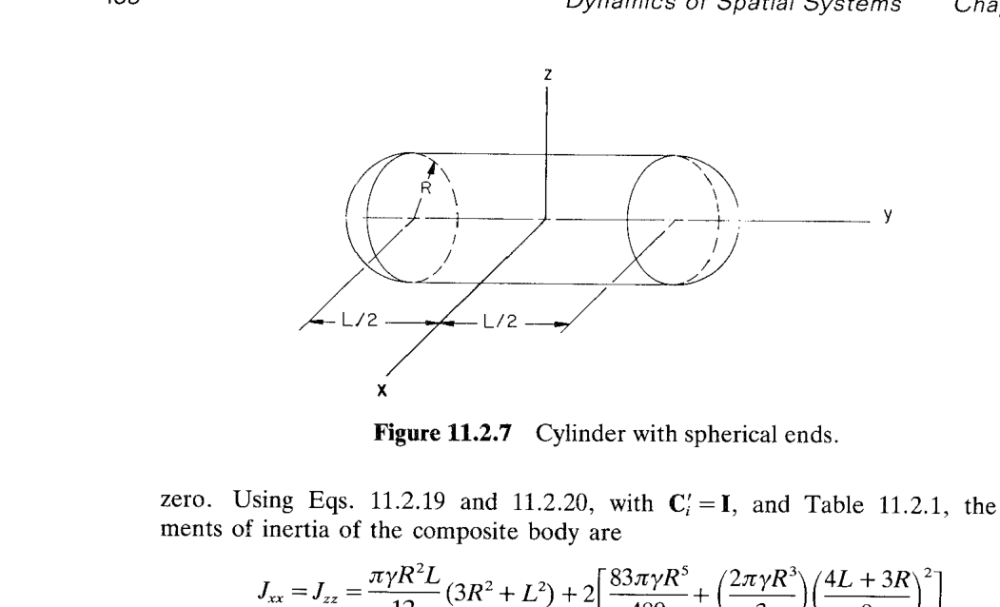

**核心**：三块子部件——中央圆柱（记 1），两个半球（记 2、3）；对 $y$ 轴，两个半球质心距原点 $L/2+3R/8=(4L+3R)/8$（半球质心距扁面 $3R/8$）。所有 $\mathbf C'_i=\mathbf I$（每个子部件质心系都平行于 $x$-$y$-$z$）。

**$J_{xx}=J_{zz}$**（对 $y$-轴的对称+扁面在 $\pm y$）：

- 圆柱贡献：由表 11.2.1（圆柱沿 $y'$，与图中沿 $y$ 一致）$J^{cyl}_{xx}=\tfrac{m_1}{12}(3R^2+L^2)$，$m_1=\pi\gamma R^2 L$，故
  $$
  J^{cyl}_{xx}=\dfrac{\pi\gamma R^2 L}{12}(3R^2+L^2).
  $$
- 半球贡献：每个半球 $m_h=\tfrac{2}{3}\pi\gamma R^3$，本身质心系里 $J^{hemi}_{x'x'}=\tfrac{83}{320}m_h R^2=\tfrac{83\pi\gamma R^5}{480}$；用 (11.2.20)（$\mathbf C=\mathbf I$、$\rho^y=(4L+3R)/8$、其他 $\rho=0$），平行轴增量 $m_h\bigl((4L+3R)/8\bigr)^2$。两个半球对称贡献 $\times 2$：
  $$
  2\Bigl[\dfrac{83\pi\gamma R^5}{480}+\Bigl(\dfrac{2\pi\gamma R^3}{3}\Bigr)\Bigl(\dfrac{4L+3R}{8}\Bigr)^{\!2}\Bigr].
  $$

合计

$$
\boxed{\;J_{xx}=J_{zz}=\dfrac{\pi\gamma R^2 L}{12}(3R^2+L^2)+2\Bigl[\dfrac{83\pi\gamma R^5}{480}+\Bigl(\dfrac{2\pi\gamma R^3}{3}\Bigr)\Bigl(\dfrac{4L+3R}{8}\Bigr)^{\!2}\Bigr].\;}
$$

**$J_{yy}$**（对 $y$ 轴自旋）：

- 圆柱：$J^{cyl}_{yy}=\tfrac{1}{2}m_1 R^2=\tfrac{\pi\gamma R^4 L}{2}$。
- 半球：$J^{hemi}_{y'y'}=\tfrac{2}{5}m_h R^2=\tfrac{4\pi\gamma R^5}{15}$；**因 $y$ 轴经过半球质心，无平行轴附加项**。两个半球贡献 $\times 2$。

$$
\boxed{\;J_{yy}=\dfrac{\pi\gamma R^4 L}{2}+2\Bigl[\dfrac{4\pi\gamma R^5}{15}\Bigr].\;}
$$

### 例 11.2.5：长方体挖圆柱孔

> 图 11.2.8：长方体 $a\times b\times c$（沿 $x$、$y$、$z$），沿 $x$ 轴挖穿一个半径 $R=c/2$ 的圆孔。三坐标面全对称 ⇒ 质心在原点、惯性积为零。

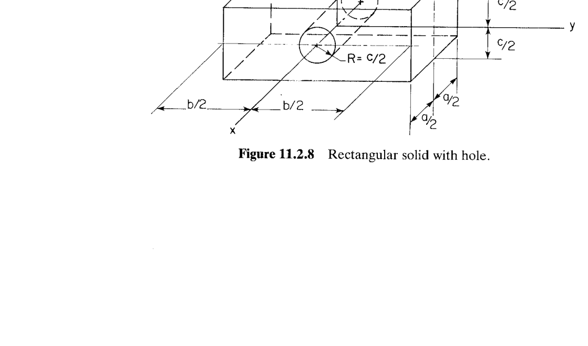

设 $\mathbf J_1$ 为整块长方体（无孔），$\mathbf J_2$ 为将占据孔的圆柱（同密度 $\gamma$）。**空洞按负质量处理**：$\mathbf J=\mathbf J_1-\mathbf J_2$。

**长方体（$a,b,c$）**：$m_{\text{bar}}=\gamma abc$，
$$
J_{1,xx}=\dfrac{m_{\text{bar}}}{12}(b^2+c^2)=\dfrac{\gamma abc}{12}(b^2+c^2),\quad
J_{1,yy}=\dfrac{\gamma abc}{12}(a^2+c^2),\quad
J_{1,zz}=\dfrac{\gamma abc}{12}(a^2+b^2).
$$

**孔（圆柱，轴沿 $x$，半径 $R=c/2$，长 $a$）**：$m_{\text{hole}}=\pi\gamma R^2 a=\pi\gamma c^2 a/4$。查表 11.2.1（**注意本孔的对称轴沿 $x$、不是表中的 $z'$**：把公式里 $z'$ 换成 $x$ 后使用）：
- $J_{2,xx}=\tfrac{1}{2}m_{\text{hole}} R^2=\tfrac{1}{2}\cdot\tfrac{\pi\gamma c^2 a}{4}\cdot\tfrac{c^2}{4}=\dfrac{\pi\gamma c^4 a}{32}$；
- $J_{2,yy}=J_{2,zz}=\tfrac{m_{\text{hole}}}{12}(3R^2+a^2)=\dfrac{\pi\gamma c^2 a}{48}\Bigl(\tfrac{3c^2}{4}+a^2\Bigr)$。

**孔的质心在长方体质心处**⇒ 无平行轴附加项。相减：

$$
\boxed{\;\begin{aligned}
J_{xx}&=\dfrac{\gamma abc}{12}(b^2+c^2)-\dfrac{\pi\gamma c^4 a}{32}\\
J_{yy}&=\dfrac{\gamma abc}{12}(a^2+c^2)-\dfrac{\pi\gamma c^2 a}{48}\Bigl(\dfrac{3c^2}{4}+a^2\Bigr)\\
J_{zz}&=\dfrac{\gamma abc}{12}(a^2+b^2)-\dfrac{\pi\gamma c^2 a}{48}\Bigl(\dfrac{3c^2}{4}+a^2\Bigr)
\end{aligned}\;}
$$

## 小结

本节把 §11.1 的运动方程所需的**几何 + 质量**输入完全形式化：

- **质心**（Eq. 11.2.1）：单个连续积分；对称面 ⇒ 质心在面上（Eq. 11.2.3）。
- **惯性矩阵变换**（Eqs. 11.2.6/11.2.7）：包含转动 $\mathbf C$ 与平移 $\boldsymbol\rho''$；平行系退化即**平行轴定理**（Eqs. 11.2.8/11.2.9）；两坐标面对称 ⇒ 三惯性积全零。
- **主轴/主惯性矩**（Eqs. 11.2.13–11.2.17）：任何刚体在质心系中总可对角化，特征向量给主轴、特征值给主惯性矩。
- **复合体**（Eqs. 11.2.18–11.2.20）：整体 = 子部件之和；表 11.2.1 提供标准形状公式；**空洞按负质量处理**。

书末段的告诫值得放在心上：手工按这些公式做一个真实机械（汽车骨架、起落架、机器人臂）会**枯燥且极易出错**。这节的价值在于——它是**计算机代码（solid modeler + CAE）** 系统性求 $m,\boldsymbol\rho,\mathbf J$ 的**数学基础**；工程师只需检验输入几何与材料属性正确，输出即可作为 §11.3 起系统级动力学方程的直接输入。
