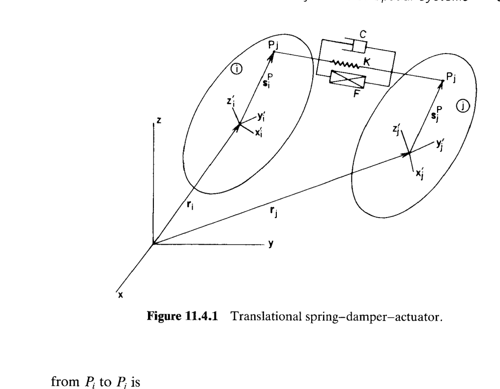
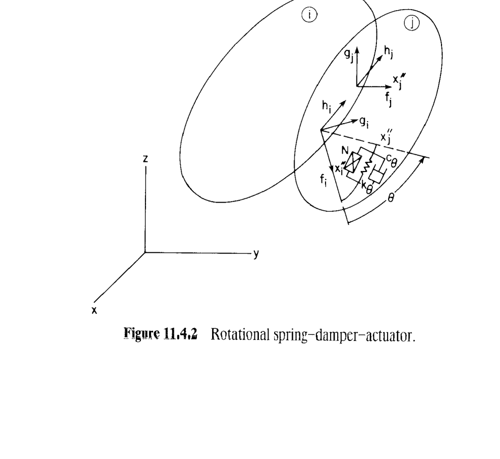

# 11.4 内力（Internal Forces）

> 来源：*Computer Aided Kinematics and Dynamics of Mechanical Systems*，第 11 章，§11.4（书页 445–449）。
> 本节把第 6 章为平面系统写的 **TSDA / RSDA 力元**（§6.2）搬到空间系统。骨架完全相同——**用虚功定义广义力**——差别只是把"平面旋转 $\delta\phi$"换成"空间随体虚旋转 $\delta\boldsymbol\pi'$"，并用第 9 章的两条桥梁（Eq. 9.2.40 与 Eq. 9.2.50）把 $\dot{\mathbf A},\delta\mathbf A$ 换成 $\boldsymbol\omega',\delta\boldsymbol\pi'$。全部推导按"每步不跳"的规矩逐式写出，把书上"by Eq. 9.2.40 has been used"这类一句话跳过的地方全部补齐。
>
> 书上有一处**明显笔误**：Eq. 11.4.14 前多一个负号（与 Eq. 9.2.62 和 Eq. 11.4.15 的取号不自洽）。文末**书上笔误**一节单列并解释。

## 引言：本节要解决什么

前面 §11.3 完成了**运动学约束**在空间动力学方程里的处理：约束力通过 Lagrange 乘子 $\boldsymbol\lambda$ 以 $\boldsymbol\Phi_{\mathbf r}^T\boldsymbol\lambda,\boldsymbol\Phi_{\boldsymbol\pi'}^T\boldsymbol\lambda$ 的形式进入 Eq. 11.3.11 / 11.3.29 的**左端**。但真实机械系统还有一大类"非约束但会做功"的力：**弹簧、阻尼器、液压/气动作动器**——它们既不像重力那样对每个质点独立作用，也不像铰链约束那样使自由度减少，而是**成对**地作用在两个刚体上、以两点相对运动为自变量。这类力元在 §11.3 的方程里位于**右端**广义力 $\mathbf F^A,\mathbf n'^A$，本节告诉你怎么把它们**写成显式的 $\mathbf Q_i,\mathbf Q_j$**。

书上开头一句话点出为什么"虚功法"在空间比在平面还好用：

> The virtual work approach is even more attractive for spatial systems than for planar systems, since relationships for virtual rotations are available.

平面情形只有一个转动自由度 $\phi$，广义力对 $\delta\phi$ 的系数就是力矩；空间有 3 个转动自由度，$\delta\boldsymbol\pi'$ 是 3×1 的**准坐标**（quasi-coordinate）虚旋转向量。第 9 章一整套 $\mathbf A,\mathbf G,\mathbf B$ 与 $\delta\boldsymbol\pi',\boldsymbol\omega'$ 的关系（Eq. 9.2.40 / 9.2.50 / 9.3.34 / 9.3.41 / 9.2.61 / 9.2.62）恰好把"变分 $\delta\mathbf A$"化成"$\delta\boldsymbol\pi'$ 的线性代数"，于是虚功 $\delta W$ 天然是 $[\delta\mathbf r_i^T,\delta\boldsymbol\pi_i'^T,\delta\mathbf r_j^T,\delta\boldsymbol\pi_j'^T]$ 的线性形式，其系数就是想要的广义力。

主线逻辑：

1. **TSDA**（§11.4.1）：连接体 $i$ 上点 $P_i$、体 $j$ 上点 $P_j$ 的沿线力。
   - 几何：$\mathbf d_{ij}$（Eq. 11.4.1）、长度 $\ell=\lVert\mathbf d_{ij}\rVert$（Eq. 11.4.2）。
   - 长度变化率：$\dot\ell$（Eq. 11.4.3–11.4.4），由 $\mathbf d_{ij}$ 的时间导数并用 $\dot{\mathbf A}=\mathbf A\tilde{\boldsymbol\omega}'$ 消掉 $\dot{\mathbf A}$。
   - 力大小：$f=k(\ell-\ell_0)+c\dot\ell+F(\ell,\dot\ell)$（Eq. 11.4.6）。
   - 虚功：$\delta W=-f\,\delta\ell$（Eq. 11.4.7）→ 展开 $\delta\ell$ → 广义力 Eq. 11.4.10（对 $\delta\boldsymbol\pi'$）或 Eq. 11.4.11（对 $\delta\mathbf p$，Euler 参数形式）。
   - 奇异：$\ell\to 0$ 时用 L'Hôpital（Eq. 11.4.5）。

2. **RSDA**（§11.4.2）：绕**共同轴**（转动副 / 圆柱副 / 螺旋副）作用的扭簧–阻尼–作动器。
   - 相对转角 $\theta+2n_{\mathrm{rev}}\pi$，$\theta$ 由 Eq. 9.2.31 定义，$\delta\theta,\dot\theta$ 由 Eq. 9.2.61 / 9.2.62。
   - 力矩大小：$n=k_\theta(\theta+2n_{\mathrm{rev}}\pi)+c_\theta\dot\theta+N$（Eq. 11.4.12）。
   - 虚功：$\delta W=-n\,\delta\theta$（Eq. 11.4.13）→ 广义力 Eq. 11.4.16（只有转动分量非零，因为扭矩纯粹是转动效应）。

---

## §11.4.0 前置：§11.3 的收尾（书页 445 上半页）

书页 445 上半页仍属于 §11.3.2 的收尾，把 Eq. 11.3.29（Euler 参数系统加速度方程）与运动学约束、Euler 参数归一化约束、以及它们的速度方程组合成完整的**空间混合微分–代数运动方程组**。要点：

- **完整未知量**：$\mathbf r,\mathbf p,\dot{\mathbf r},\dot{\mathbf p}$ 加乘子 $\boldsymbol\lambda,\boldsymbol\lambda^{\mathbf p}$。
- **初值处理**：位置初值给 $\mathbf r(t_0),\mathbf p(t_0)$（满足 Eqs. 11.3.2 / 11.3.3）；速度初值物理上最自然的是**角速度** $\boldsymbol\omega'$ 而非 $\dot{\mathbf p}$，因此保留 Eq. 11.3.13 形式的速度约束，并用 Eq. 9.3.34 把 $\boldsymbol\omega'$ 换成 $2\mathbf G\dot{\mathbf p}$：

$$
\mathbf B_{\mathbf r}'\dot{\mathbf r}+2\mathbf B_{\boldsymbol\omega'}\mathbf G\dot{\mathbf p}=\mathbf v' \tag{11.3.30}
$$

联合 Eqs. 11.3.14 与 11.3.23 就能唯一定 $\dot{\mathbf r}(t_0),\dot{\mathbf p}(t_0)$。

- **两种形式的算法差别**（Eq. 11.3.11 一阶 vs Eq. 11.3.29 二阶）：Eq. 11.3.11 左上系数 $\mathbf M,\mathbf J'$ 是**常量**，Eq. 11.3.29 的左上出现**依赖坐标**的 $\mathbf G^T\mathbf J'\mathbf G$，会影响矩阵分解与积分器性能——这是 §11.6 数值方法要处理的问题。

以上是 §11.3 的尾声；从"11.4 INTERNAL FORCES"起进入本节主体。

---

## §11.4.1 平动弹簧–阻尼–作动器（Translational Spring–Damper–Actuator, TSDA）

### 思路

TSDA（**平动弹簧–阻尼–作动器**）是一根"拉不硬、压不实"的柔顺连线：一端固定在体 $i$ 的点 $P_i$，另一端固定在体 $j$ 的点 $P_j$，产生沿 $P_iP_j$ 方向的力（弹簧回复 + 阻尼耗散 + 通用作动器力）。工程实例——汽车悬挂减震器、机床防振支柱、气缸驱动作动器——都属此类。

对空间系统，几何量分四层：

1. 从体固定系分量 $\mathbf s_i'^P,\mathbf s_j'^P$ → 全局分量 $\mathbf A_i\mathbf s_i'^P,\mathbf A_j\mathbf s_j'^P$；
2. 全局位置 $\mathbf r_i+\mathbf A_i\mathbf s_i'^P,\mathbf r_j+\mathbf A_j\mathbf s_j'^P$；
3. 相对向量 $\mathbf d_{ij}$（Eq. 11.4.1）；
4. 长度 $\ell$、长度变化率 $\dot\ell$、长度变分 $\delta\ell$。

第 4 层就是虚功公式的自变量：$\delta W=-f\,\delta\ell$。整节推导就是把 $\delta\ell$ 用 $\delta\mathbf r_i,\delta\mathbf r_j,\delta\boldsymbol\pi_i',\delta\boldsymbol\pi_j'$ 表出、然后读出系数。

### 元件几何：向量 $\mathbf d_{ij}$ 与长度 $\ell$

设体 $i$ 上点 $P_i$、体 $j$ 上点 $P_j$。**从 $P_i$ 指向 $P_j$** 的向量为

$$
\mathbf d_{ij}=\mathbf r_j+\mathbf A_j\mathbf s_j'^P-\mathbf r_i-\mathbf A_i\mathbf s_i'^P \tag{11.4.1}
$$

长度的**平方**（避开开方，方便求导）

$$
\ell^{2}=\mathbf d_{ij}^{T}\mathbf d_{ij} \tag{11.4.2}
$$

约定 $\ell\ge 0$。

### 长度变化率 $\dot\ell$（Eq. 11.4.3 → 11.4.4）

**第 1 步**：对 Eq. 11.4.2 两边关于时间求导。$\mathbf d_{ij}^T\mathbf d_{ij}$ 的时间导数是标量，用乘积法则并利用标量转置相等 $\dot{\mathbf d}_{ij}^T\mathbf d_{ij}=\mathbf d_{ij}^T\dot{\mathbf d}_{ij}$：

$$
2\ell\dot\ell=2\,\mathbf d_{ij}^{T}\dot{\mathbf d}_{ij} \tag{11.4.3}
$$

**第 2 步**：对 Eq. 11.4.1 关于时间求导。$\mathbf s_i'^P,\mathbf s_j'^P$ 是**常量**（体固定系中的位置）：

$$
\dot{\mathbf d}_{ij}=\dot{\mathbf r}_j+\dot{\mathbf A}_j\mathbf s_j'^P-\dot{\mathbf r}_i-\dot{\mathbf A}_i\mathbf s_i'^P
$$

**第 3 步**：$\ell\ne 0$ 时两边除以 $2\ell$，代入第 2 步：

$$
\dot\ell=\Bigl(\frac{\mathbf d_{ij}}{\ell}\Bigr)^{T}(\dot{\mathbf r}_j+\dot{\mathbf A}_j\mathbf s_j'^P-\dot{\mathbf r}_i-\dot{\mathbf A}_i\mathbf s_i'^P) \tag{11.4.4a}
$$

这是 Eq. 11.4.4 的**第一行**。$\dot{\mathbf A}$ 出现，得换成 $\boldsymbol\omega'$。

**第 4 步（用 Eq. 9.2.40 消 $\dot{\mathbf A}$）**：Eq. 9.2.40 给出 $\dot{\mathbf A}=\mathbf A\tilde{\boldsymbol\omega}'$，故

$$
\dot{\mathbf A}_i\mathbf s_i'^P=\mathbf A_i\tilde{\boldsymbol\omega}_i'\mathbf s_i'^P.
$$

再用 tilde 恒等式 $\tilde{\mathbf a}\mathbf b=-\tilde{\mathbf b}\mathbf a$（即 $\mathbf a\times\mathbf b=-\mathbf b\times\mathbf a$）：

$$
\tilde{\boldsymbol\omega}_i'\mathbf s_i'^P=-\tilde{\mathbf s}_i'^P\boldsymbol\omega_i'
\quad\Longrightarrow\quad
\dot{\mathbf A}_i\mathbf s_i'^P=-\mathbf A_i\tilde{\mathbf s}_i'^P\boldsymbol\omega_i'.
$$

同理 $\dot{\mathbf A}_j\mathbf s_j'^P=-\mathbf A_j\tilde{\mathbf s}_j'^P\boldsymbol\omega_j'$。回代 Eq. 11.4.4a：

$$
\dot\ell=\Bigl(\frac{\mathbf d_{ij}}{\ell}\Bigr)^{T}(\dot{\mathbf r}_j-\mathbf A_j\tilde{\mathbf s}_j'^P\boldsymbol\omega_j'-\dot{\mathbf r}_i+\mathbf A_i\tilde{\mathbf s}_i'^P\boldsymbol\omega_i') \tag{11.4.4}
$$

（注意 $-\dot{\mathbf A}_i\mathbf s_i'^P=+\mathbf A_i\tilde{\mathbf s}_i'^P\boldsymbol\omega_i'$，与 $\dot{\mathbf A}_j\mathbf s_j'^P$ 号相反——这就是式中 $-\boldsymbol\omega_j'$ 与 $+\boldsymbol\omega_i'$ 的来历。）

### 奇异处理：$\ell\to 0$ 时的 L'Hôpital 规则（Eq. 11.4.5）

Eq. 11.4.4 首项 $\mathbf d_{ij}/\ell$ 是**方向单位向量**——只要 $\ell>0$ 就良定义。若 $P_i,P_j$ 瞬时重合（$\ell=0$，$\mathbf d_{ij}=\mathbf 0$），$0/0$ 型未定式。用 L'Hôpital：

$$
\lim_{\ell\to 0}\frac{\mathbf d_{ij}}{\ell}=\left.\frac{\dot{\mathbf d}_{ij}}{\dot\ell}\right|_{\ell=0} \tag{11.4.5}
$$

**只在** $\ell$ 逼近 0 时才用；工程 TSDA 一般设有物理最小长度限位，这条主要是数值稳健性用。

### 元件内力 $f$（Eq. 11.4.6）

**张力（tension）为正**——即把 $P_i,P_j$ 拉近的方向为正的 $f$。元件合力大小

$$
\boxed{\;f=k(\ell-\ell_0)+c\,\dot\ell+F(\ell,\dot\ell)\;} \tag{11.4.6}
$$

三项分别是：
- $k(\ell-\ell_0)$：**线弹簧**（弹簧系数 $k$，自由长度 $\ell_0$）；
- $c\,\dot\ell$：**线性阻尼**（阻尼系数 $c$）；
- $F(\ell,\dot\ell)$：**通用作动器力**（可以是非线性弹簧、双线性阻尼、液压作动器指令等，允许显式依赖长度和速率——但书上此处**没有**把 $t$ 单列，与 Eq. 6.2.10 不同；若作动器指令随时间变化，把 $t$ 通过其它状态"隐式"藏进 $F$ 中即可）。

### 虚功 $\delta W$（Eq. 11.4.7 → 11.4.9）

**符号约定**：正的 $\delta\ell$ 使 $P_i,P_j$ 分离；正的 $f$ 是把两端拉近的**张力**。因此 $f,\delta\ell$ 同为正时，元件对系统做**负功**：

$$
\delta W=-f\,\delta\ell \tag{11.4.7}
$$

要把 Eq. 11.4.7 展开成 $\delta\mathbf r_i,\delta\boldsymbol\pi_i',\delta\mathbf r_j,\delta\boldsymbol\pi_j'$ 的线性组合，须先求 $\delta\ell$。

**第 1 步（求 $\delta\ell$，与 $\dot\ell$ 完全平行）**：把 Eq. 11.4.4a 中的"$d/dt$"换成"$\delta$"即得

$$
\delta\ell=\Bigl(\frac{\mathbf d_{ij}}{\ell}\Bigr)^{T}(\delta\mathbf r_j+\delta\mathbf A_j\mathbf s_j'^P-\delta\mathbf r_i-\delta\mathbf A_i\mathbf s_i'^P).
$$

**第 2 步（用 Eq. 9.2.50 消 $\delta\mathbf A$）**：Eq. 9.2.50 说 $\delta\mathbf A=\mathbf A\,\delta\tilde{\boldsymbol\pi}'$（其中 $\delta\tilde{\boldsymbol\pi}'$ 是 $\delta\boldsymbol\pi'$ 的 tilde 算子）。同 $\dot{\mathbf A}$ 一样用 tilde 恒等式：

$$
\delta\mathbf A_i\mathbf s_i'^P=\mathbf A_i\,\delta\tilde{\boldsymbol\pi}_i'\mathbf s_i'^P=-\mathbf A_i\tilde{\mathbf s}_i'^P\,\delta\boldsymbol\pi_i'.
$$

同理 $\delta\mathbf A_j\mathbf s_j'^P=-\mathbf A_j\tilde{\mathbf s}_j'^P\,\delta\boldsymbol\pi_j'$。代回：

$$
\delta\ell=\Bigl(\frac{\mathbf d_{ij}}{\ell}\Bigr)^{T}(\delta\mathbf r_j-\mathbf A_j\tilde{\mathbf s}_j'^P\,\delta\boldsymbol\pi_j'-\delta\mathbf r_i+\mathbf A_i\tilde{\mathbf s}_i'^P\,\delta\boldsymbol\pi_i') \tag{11.4.8}
$$

**第 3 步（代回 Eq. 11.4.7）**：

$$
\delta W=-\frac{f}{\ell}\,\mathbf d_{ij}^{T}(\delta\mathbf r_j-\mathbf A_j\tilde{\mathbf s}_j'^P\,\delta\boldsymbol\pi_j'-\delta\mathbf r_i+\mathbf A_i\tilde{\mathbf s}_i'^P\,\delta\boldsymbol\pi_i') \tag{11.4.9}
$$

### 广义力（虚旋转形式，Eq. 11.4.10）

由 $\delta W=\mathbf Q_i^T\begin{bmatrix}\delta\mathbf r_i\\\delta\boldsymbol\pi_i'\end{bmatrix}+\mathbf Q_j^T\begin{bmatrix}\delta\mathbf r_j\\\delta\boldsymbol\pi_j'\end{bmatrix}$，逐项收集系数。

**对 $\delta\mathbf r_i$**：Eq. 11.4.9 中 $-\mathbf d_{ij}^T$ 前面还有 $-\dfrac{f}{\ell}$，两次负号相乘为 $+\dfrac{f}{\ell}\mathbf d_{ij}^T$。此为**行向量**；作为 $\mathbf Q_i$ 的位移块（列向量），转置得 $\mathbf Q_i^{\mathbf r}=\dfrac{f}{\ell}\mathbf d_{ij}$。

**对 $\delta\boldsymbol\pi_i'$**：系数 $-\dfrac{f}{\ell}\mathbf d_{ij}^T(\mathbf A_i\tilde{\mathbf s}_i'^P)$。转置成列并用 $\tilde{\mathbf s}'^{PT}=-\tilde{\mathbf s}'^P$（tilde 反对称）：

$$
\mathbf Q_i^{\boldsymbol\pi'}=-\frac{f}{\ell}(\mathbf A_i\tilde{\mathbf s}_i'^P)^{T}\mathbf d_{ij}=-\frac{f}{\ell}\tilde{\mathbf s}_i'^{PT}\mathbf A_i^{T}\mathbf d_{ij}=\frac{f}{\ell}\tilde{\mathbf s}_i'^{P}\mathbf A_i^{T}\mathbf d_{ij}.
$$

**对 $\delta\mathbf r_j$**：系数 $-\dfrac{f}{\ell}\mathbf d_{ij}^T$，转置成列即 $\mathbf Q_j^{\mathbf r}=-\dfrac{f}{\ell}\mathbf d_{ij}$。

**对 $\delta\boldsymbol\pi_j'$**：系数 $+\dfrac{f}{\ell}\mathbf d_{ij}^T\mathbf A_j\tilde{\mathbf s}_j'^P$。转置：

$$
\mathbf Q_j^{\boldsymbol\pi'}=\frac{f}{\ell}(\mathbf A_j\tilde{\mathbf s}_j'^P)^{T}\mathbf d_{ij}=-\frac{f}{\ell}\tilde{\mathbf s}_j'^{P}\mathbf A_j^{T}\mathbf d_{ij}.
$$

拼接：

$$
\boxed{\;\mathbf Q_i=\frac{f}{\ell}\begin{bmatrix}\mathbf d_{ij}\\[4pt]\tilde{\mathbf s}_i'^{P}\mathbf A_i^{T}\mathbf d_{ij}\end{bmatrix},\qquad
\mathbf Q_j=-\frac{f}{\ell}\begin{bmatrix}\mathbf d_{ij}\\[4pt]\tilde{\mathbf s}_j'^{P}\mathbf A_j^{T}\mathbf d_{ij}\end{bmatrix}\;} \tag{11.4.10}
$$

**物理读法**：位移块 $\pm f\,\mathbf d_{ij}/\ell$ 就是"力大小 × 方向单位向量"——沿 $\mathbf d_{ij}$ 方向、张力时把 $j$ 拉向 $i$。转动块含 $\mathbf A_i^T\mathbf d_{ij}$（把全局 $\mathbf d_{ij}$ 表在体固定系）再左乘 $\tilde{\mathbf s}_i'^P$——正是**力矩** $\mathbf s_i'^P\times(\mathbf A_i^T\,\text{force})$ 在体固定系的表达（力作用点相对质心的力臂×力）。$\mathbf Q_i,\mathbf Q_j$ 的位移块**等大反向**——这就是牛顿第三定律。

### 广义力（Euler 参数形式，Eq. 11.4.11）

若积分器用 Euler 参数 $\mathbf p$（Eq. 11.3.29 形式），须把 $\delta\boldsymbol\pi'$ 换成 $\delta\mathbf p$。Eq. 9.3.41 给出

$$
\delta\boldsymbol\pi_i'=2\mathbf G_i\,\delta\mathbf p_i,\qquad \delta\boldsymbol\pi_j'=2\mathbf G_j\,\delta\mathbf p_j.
$$

代入 Eq. 11.4.9 后 $\delta\boldsymbol\pi_i'$ 前的系数（行向量）由 $-\dfrac{f}{\ell}\mathbf d_{ij}^T\mathbf A_i\tilde{\mathbf s}_i'^P$ 变为

$$
-\frac{f}{\ell}\mathbf d_{ij}^T\mathbf A_i\tilde{\mathbf s}_i'^P\cdot 2\mathbf G_i=-\frac{2f}{\ell}\mathbf d_{ij}^T\mathbf A_i\tilde{\mathbf s}_i'^P\mathbf G_i.
$$

转置成列并用 $\tilde{\mathbf s}'^{PT}=-\tilde{\mathbf s}'^P$：

$$
\mathbf Q_i^{\mathbf p}=-\frac{2f}{\ell}\mathbf G_i^{T}\tilde{\mathbf s}_i'^{PT}\mathbf A_i^{T}\mathbf d_{ij}=\frac{2f}{\ell}\mathbf G_i^{T}\tilde{\mathbf s}_i'^{P}\mathbf A_i^{T}\mathbf d_{ij}.
$$

同理 $\mathbf Q_j^{\mathbf p}=-\dfrac{2f}{\ell}\mathbf G_j^{T}\tilde{\mathbf s}_j'^{P}\mathbf A_j^{T}\mathbf d_{ij}$。汇总：

$$
\boxed{\;\mathbf Q_i=\frac{f}{\ell}\begin{bmatrix}\mathbf d_{ij}\\[4pt]2\mathbf G_i^{T}\tilde{\mathbf s}_i'^{P}\mathbf A_i^{T}\mathbf d_{ij}\end{bmatrix},\qquad
\mathbf Q_j=-\frac{f}{\ell}\begin{bmatrix}\mathbf d_{ij}\\[4pt]2\mathbf G_j^{T}\tilde{\mathbf s}_j'^{P}\mathbf A_j^{T}\mathbf d_{ij}\end{bmatrix}\;} \tag{11.4.11}
$$

**观察**：Eq. 11.4.11 的转动块 = Eq. 11.4.10 转动块 × $2\mathbf G_i^T$（对 $j$ 同理）——完全符合"变分 $\delta\boldsymbol\pi'=2\mathbf G\,\delta\mathbf p$ 的转置乘法"。

### 插进 §11.3 的方程

- **Eq. 11.3.11**（Newton–Euler 一阶形式）：把 Eq. 11.4.10 的 $\mathbf Q_i,\mathbf Q_j$ 位移块加到 $\mathbf F^A$，转动块加到 $\mathbf n'^A$。
- **Eq. 11.3.29**（Euler 参数二阶形式）：把 Eq. 11.4.11 的位移块加到 $\mathbf F^A$，转动块加到 $2\mathbf G^T\mathbf n'^A+8\dot{\mathbf G}^T\mathbf J'\dot{\mathbf G}\mathbf p$ 那一行的**广义力项**（因为该行已经是"对 $\mathbf p$"的形式）。

---

## §11.4.2 旋转弹簧–阻尼–作动器（Rotational Spring–Damper–Actuator, RSDA）

### 思路

**旋转弹簧–阻尼–作动器（RSDA）**：绕两体的**共同转轴**作用的扭簧 + 转动阻尼 + 通用作动器力矩。适用关节：**转动副（revolute joint）、圆柱副（cylindrical joint）、螺旋副（screw joint）**——三者都具备"一个共同的转动轴 $\mathbf h_i=\mathbf h_j$"。这个共同轴由 Eqs. 9.4.11–9.4.12 或 Eqs. 9.4.15–9.4.18 保证。

RSDA 与 TSDA 的**结构完全平行**，但比 TSDA 简单：

- TSDA 里 $\ell$ 是几何长度，涉及**平动**和**转动**双重变分；
- RSDA 里 $\theta$ 是相对转角，只涉及**转动**变分——因此 $\mathbf Q_i,\mathbf Q_j$ 的位移块**恒为零**。

第 9 章 §9.2 例 9.2.7 已经把 $\delta\theta$ 与 $\dot\theta$ 用 $\delta\boldsymbol\pi',\boldsymbol\omega'$ 表出（Eqs. 9.2.61, 9.2.62），本节直接拿来当**代入公式**。

### 累积角与力矩大小（Eq. 11.4.12）

在共同轴上定义**关节定义系**：体 $i$ 上 $x_i''\text-y_i''\text-z_i''$，体 $j$ 上 $x_j''\text-y_j''\text-z_j''$，$z_i''=z_j''=\mathbf h_i$（共同轴）。从 $x_i''$ 轴**逆时针**转到 $x_j''$ 轴的夹角记为 $\theta$，由 Eq. 9.2.31 计算，其值只在**一个基本周期** $[0,2\pi)$ 内。

对**多圈**转动引入圈数 $n_{\mathrm{rev}}\in\mathbb Z$（"n_rev"，或"number of revolutions"），累积转角为 $\theta+2n_{\mathrm{rev}}\pi$——与 §9.5 相对转动驱动（Eq. 9.5.4）里的做法完全一致。$n_{\mathrm{rev}}$ 需要**软件运行时**监测 $\theta$ 是否穿过 $0/2\pi$ 边界来累加/递减。

**变分**：$2n_{\mathrm{rev}}\pi$ 是常数，故 $\delta\theta$ 和 $\dot\theta$ 与不加 $2n_{\mathrm{rev}}\pi$ 时**完全一致**——用 Eqs. 9.2.61 / 9.2.62 直接给出。

力矩大小（作用在 $x_j''\text-y_j''\text-z_j''$ 系上、相对 $x_i''\text-y_i''\text-z_i''$ 系为**逆时针为正**）：

$$
\boxed{\;n=k_\theta(\theta+2n_{\mathrm{rev}}\pi)+c_\theta\,\dot\theta+N(\theta+2n_{\mathrm{rev}}\pi,\dot\theta)\;} \tag{11.4.12}
$$

三项含义与 TSDA 完全对偶：
- $k_\theta(\theta+2n_{\mathrm{rev}}\pi)$：**扭簧**（$k_\theta$ 扭转刚度）；累积角为 $0$ 且 $n_{\mathrm{rev}}=0$ 时弹簧无扭矩——注意扭簧的"自由角"在这里选为 $0$，若实际自由角非零，把 $N$ 里再减掉常数或平移 $\theta$ 的定义即可。
- $c_\theta\,\dot\theta$：**转动阻尼**。
- $N(\theta+2n_{\mathrm{rev}}\pi,\dot\theta)$：**通用作动器力矩**（伺服、步进电机指令等，允许显式依赖角度与角速度）。

**注意**：与 TSDA 的 $f$ 一样，Eq. 11.4.12 也**没有**显式的 $t$ 参数；时间依赖的作动器指令须"藏进" $N$ 的其它状态里。

### 虚功（Eq. 11.4.13）

$n$ 是逆时针为正，$\delta\theta$ 也是逆时针为正——同 TSDA 的 $f$ 与 $\delta\ell$ 一样，同号时元件对系统做**负功**：

$$
\delta W=-n\,\delta\theta \tag{11.4.13}
$$

### 相对角速度 $\dot\theta$（Eq. 11.4.14；书上此式有笔误）

**书上打印的形式**：

$$
\dot\theta=-\mathbf h_i'^{T}(\mathbf A_i^{T}\mathbf A_j\boldsymbol\omega_j'-\boldsymbol\omega_i') \tag{11.4.14}
$$

按 Eq. 9.2.62 直接给出（例 9.2.7）：

$$
\dot\theta=\mathbf h_i'^{T}(\mathbf A_i^{T}\mathbf A_j\boldsymbol\omega_j'-\boldsymbol\omega_i').
$$

两者相差一个负号——**书上 Eq. 11.4.14 有笔误**（详见文末"书上笔误"一节）。这个笔误**不影响 Eq. 11.4.15 / 11.4.16**，因为 Eq. 11.4.15 是直接用 Eq. 9.2.61 代入 Eq. 11.4.13 得到，走的是 $\delta\theta$ 路线、没有经过 Eq. 11.4.14。

### 虚功展开（Eq. 11.4.15）

**第 1 步**：Eq. 9.2.61 给出

$$
\delta\theta=\mathbf h_i'^{T}(\mathbf A_i^{T}\mathbf A_j\,\delta\boldsymbol\pi_j'-\delta\boldsymbol\pi_i').
$$

**第 2 步**：代入 Eq. 11.4.13：

$$
\delta W=-n\,\mathbf h_i'^{T}(\mathbf A_i^{T}\mathbf A_j\,\delta\boldsymbol\pi_j'-\delta\boldsymbol\pi_i') \tag{11.4.15}
$$

### 广义力（Eq. 11.4.16）

由 $\delta W=\mathbf Q_i^T\begin{bmatrix}\delta\mathbf r_i\\\delta\boldsymbol\pi_i'\end{bmatrix}+\mathbf Q_j^T\begin{bmatrix}\delta\mathbf r_j\\\delta\boldsymbol\pi_j'\end{bmatrix}$ 逐项收集：

- **$\delta\mathbf r_i,\delta\mathbf r_j$ 系数**：Eq. 11.4.15 里根本不含平动虚位移——故位移块**恒为零**（$\mathbf Q_i^{\mathbf r}=\mathbf Q_j^{\mathbf r}=\mathbf 0$）。物理：扭矩不做直接的平动虚功。
- **$\delta\boldsymbol\pi_i'$ 系数（行向量）**：$-n\cdot(-\mathbf h_i'^{T})=+n\,\mathbf h_i'^{T}$。转置成列：$\mathbf Q_i^{\boldsymbol\pi'}=n\,\mathbf h_i'$。
- **$\delta\boldsymbol\pi_j'$ 系数**：$-n\,\mathbf h_i'^{T}\mathbf A_i^{T}\mathbf A_j$。转置：$\mathbf Q_j^{\boldsymbol\pi'}=-n\,(\mathbf A_i^{T}\mathbf A_j)^{T}\mathbf h_i'=-n\,\mathbf A_j^{T}\mathbf A_i\,\mathbf h_i'$。

拼接：

$$
\boxed{\;\mathbf Q_i=\begin{bmatrix}\mathbf 0\\n\,\mathbf h_i'\end{bmatrix},\qquad
\mathbf Q_j=-\begin{bmatrix}\mathbf 0\\n\,\mathbf A_j^{T}\mathbf A_i\,\mathbf h_i'\end{bmatrix}\;} \tag{11.4.16}
$$

**读法**：$\mathbf Q_i^{\boldsymbol\pi'}=n\,\mathbf h_i'$——就是"力矩大小 $n$ 沿体 $i$ 固定系中的共同轴 $\mathbf h_i'$"。$\mathbf Q_j^{\boldsymbol\pi'}=-n\,\mathbf A_j^{T}\mathbf A_i\mathbf h_i'=-n\,\mathbf h_j'$（因为 $\mathbf A_i\mathbf h_i'=\mathbf h_i=\mathbf h_j=\mathbf A_j\mathbf h_j'$ 意味着 $\mathbf A_j^T\mathbf A_i\mathbf h_i'=\mathbf h_j'$）——大小相等、沿轴反向。牛顿第三定律再次成立。

**注意**：$\mathbf h_j'=\mathbf A_j^T\mathbf A_i\mathbf h_i'$ 这个等号在**运动学上被约束保证**——转动副 / 圆柱副 / 螺旋副的约束方程里都含 $\mathbf h_i-\mathbf h_j=\mathbf 0$（即 $\mathbf A_i\mathbf h_i'=\mathbf A_j\mathbf h_j'$）。所以书上 Eq. 11.4.16 里选**用 $\mathbf A_j^{T}\mathbf A_i\mathbf h_i'$ 而不是直接 $\mathbf h_j'$**——这是**算法便利**：$\mathbf h_i',\mathbf h_j'$ 是常量（体固定），但 $\mathbf A_i,\mathbf A_j$ 每步都要更新；写成 $\mathbf A_j^T\mathbf A_i\mathbf h_i'$ 可以让扭矩响应"两体转动余量"的历史一致，不必信任约束数值残差为零。

### Euler 参数形式

若要 $\mathbf Q_i,\mathbf Q_j$ 对 $\delta\mathbf p$ 的形式，把 Eq. 11.4.16 的转动块**左乘** $2\mathbf G_i^T,2\mathbf G_j^T$（因 $\delta\boldsymbol\pi_i'=2\mathbf G_i\,\delta\mathbf p_i$，$\delta\boldsymbol\pi_i'$ 的系数向量转置后要左乘 $(2\mathbf G_i)^T$）：

$$
\mathbf Q_i^{\mathbf p}=[\mathbf 0;\;2\mathbf G_i^{T}n\,\mathbf h_i'],\qquad
\mathbf Q_j^{\mathbf p}=-[\mathbf 0;\;2\mathbf G_j^{T}n\,\mathbf A_j^{T}\mathbf A_i\,\mathbf h_i'].
$$

书上以文字表述为"Eq. 11.4.15 must be multiplied on the left by $2\mathbf G_i$ and $2\mathbf G_j$, respectively"——就是这一步。

---

## 与 §6.2 的对偶速查表

TSDA / RSDA 的推导在平面（§6.2）和空间（§11.4）之间**完全平行**，差别仅是"用什么坐标写变分"。整理如下：

| 步骤 | 平面 §6.2（TSDA） | 空间 §11.4（TSDA） |
|------|-------------------|---------------------|
| 元件向量 | $\mathbf d_{ij}=\mathbf r_j+\mathbf A_j\mathbf s_j'-\mathbf r_i-\mathbf A_i\mathbf s_i'$（6.2.6） | $\mathbf d_{ij}=\mathbf r_j+\mathbf A_j\mathbf s_j'^P-\mathbf r_i-\mathbf A_i\mathbf s_i'^P$（11.4.1） |
| $\dot{\mathbf A}\to$ 角速度 | $\dot{\mathbf A}=\mathbf B\dot\phi$（$\mathbf B\equiv\partial\mathbf A/\partial\phi$） | $\dot{\mathbf A}=\mathbf A\tilde{\boldsymbol\omega}'$（9.2.40） |
| $\delta\mathbf A\to$ 虚旋转 | $\delta\mathbf A=\mathbf B\,\delta\phi$ | $\delta\mathbf A=\mathbf A\,\delta\tilde{\boldsymbol\pi}'$（9.2.50） |
| tilde 恒等式简化 | 无（$\mathbf s'$ 只 2 维） | $\tilde{\boldsymbol\omega}'\mathbf s'^P=-\tilde{\mathbf s}'^P\boldsymbol\omega'$ |
| $\delta\ell$ | 系数含 $\mathbf B\mathbf s'$ | 系数含 $-\mathbf A\tilde{\mathbf s}'^P$ |
| 力大小 | $f=k(\ell-\ell_0)+c\dot\ell+F(\ell,\dot\ell,t)$（6.2.10） | 同上，去掉 $t$（11.4.6） |
| 广义力位移块 | $\pm\dfrac{f}{\ell}\mathbf d_{ij}$（6.2.14） | 同上（11.4.10） |
| 广义力转动块 | $\dfrac{f}{\ell}\mathbf d_{ij}^{T}\mathbf B\mathbf s'$（标量） | $\dfrac{f}{\ell}\tilde{\mathbf s}'^{P}\mathbf A^{T}\mathbf d_{ij}$（向量） |

RSDA 亦然：

| 步骤 | 平面 §6.2（RSDA） | 空间 §11.4（RSDA） |
|------|-------------------|---------------------|
| 相对转角 | $\theta_{ij}=\phi_j-\phi_i$（6.2.16） | $\theta$ 由 Eq. 9.2.31 定义，累积 $\theta+2n_{\mathrm{rev}}\pi$ |
| $\delta\theta$ | $\delta\phi_j-\delta\phi_i$ | $\mathbf h_i'^{T}(\mathbf A_i^{T}\mathbf A_j\,\delta\boldsymbol\pi_j'-\delta\boldsymbol\pi_i')$（9.2.61） |
| $\dot\theta$ | $\dot\phi_j-\dot\phi_i$ | $\mathbf h_i'^{T}(\mathbf A_i^{T}\mathbf A_j\boldsymbol\omega_j'-\boldsymbol\omega_i')$（9.2.62） |
| 力矩大小 | $n=k_\theta(\theta-\theta_0)+c_\theta\dot\theta+N$（6.2.18） | $n=k_\theta(\theta+2n_{\mathrm{rev}}\pi)+c_\theta\dot\theta+N$（11.4.12） |
| 广义力（转动） | $\pm n$（标量） | $\pm n\,\mathbf h_i',\;\mp n\,\mathbf A_j^{T}\mathbf A_i\mathbf h_i'$（向量） |

结论：平面 $\to$ 空间的**唯一改动**是"把 $\delta\phi$ 换成 $\delta\boldsymbol\pi'$、把力矩标量换成沿轴向量、用 tilde 恒等式代替直接展开"，其余全部照抄。

---

## 书上笔误：Eq. 11.4.14 的负号

Eq. 9.2.62（书页 380 左右，本 wiki `9.2-kinematics-rigid-body-space.md` Eq. 9.2.62）明确写作

$$
\dot\theta=\mathbf h_i'^{T}(\mathbf A_i^{T}\mathbf A_j\boldsymbol\omega_j'-\boldsymbol\omega_i').
$$

但 Eq. 11.4.14 打印为

$$
\dot\theta=-\mathbf h_i'^{T}(\mathbf A_i^{T}\mathbf A_j\boldsymbol\omega_j'-\boldsymbol\omega_i').
$$

两者相差一个整体负号。要辨谁对，用**内在一致性**检查：Eq. 11.4.15 走的是"$\delta\theta$ 路线"，把 Eq. 9.2.61（$\delta\theta$ 无负号）直接代入 Eq. 11.4.13：

$$
\delta W=-n\,\delta\theta=-n\,\mathbf h_i'^{T}(\mathbf A_i^{T}\mathbf A_j\,\delta\boldsymbol\pi_j'-\delta\boldsymbol\pi_i').
$$

**括号内无额外负号**——这与 Eq. 11.4.15 印刷一致。同样地，$\dot\theta$ 是 $\delta\theta$ 的时间导数版本（把 $\delta$ 换成 $d/dt$、$\delta\boldsymbol\pi'$ 换成 $\boldsymbol\omega'$），也应**无额外负号**，与 Eq. 9.2.62 一致。

**结论**：Eq. 11.4.14 的负号是书上的**印刷错误**；正确形式即 Eq. 9.2.62。这个笔误不影响后续 Eq. 11.4.15 / 11.4.16 的正确性（后者从未经过 Eq. 11.4.14）。工程/编程上使用时**必须以 Eq. 9.2.62 为准**。

---

## 本节要点回收

1. **TSDA 广义力四件套**：
   - 几何 Eq. 11.4.1；长度 Eq. 11.4.2；
   - 变化率 Eq. 11.4.4（用 Eq. 9.2.40 消 $\dot{\mathbf A}$）；
   - 力大小 Eq. 11.4.6；
   - 广义力 Eq. 11.4.10（虚旋转形式）或 Eq. 11.4.11（Euler 参数形式）。

2. **RSDA 广义力四件套**：
   - 累积转角 $\theta+2n_{\mathrm{rev}}\pi$；
   - 力矩大小 Eq. 11.4.12；
   - 虚功 Eq. 11.4.13；
   - 广义力 Eq. 11.4.16（位移块恒为零；转动块 $\pm n\mathbf h_i'$）。

3. **奇异处理**：$\ell\to 0$ 用 Eq. 11.4.5（L'Hôpital）；工程上不常触发，但数值实现要防 $\ell/\ell$ 分母 underflow。

4. **接入 §11.3 的方程**：TSDA / RSDA 的 $\mathbf Q_i,\mathbf Q_j$ 加到 Eq. 11.3.11 或 Eq. 11.3.29 的**右端广义力项**。

5. **与 §6.2 完全对偶**：平面版换个"$\delta\phi\to\delta\boldsymbol\pi'$、力矩标量→沿轴向量、$\mathbf B\to -\mathbf A\tilde{\mathbf s}'^P$、tilde 恒等式代替直接展开"即得空间版。

6. **注意 Eq. 11.4.14 的书上笔误**（详见前节）。
