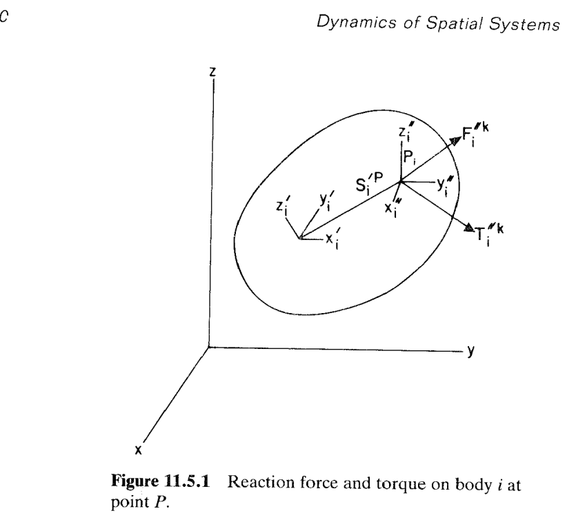

# 11.5 逆动力学、平衡分析与关节反力（Inverse Dynamics, Equilibrium Analysis, and Reaction Forces in Joints）

> 来源：*Computer Aided Kinematics and Dynamics of Mechanical Systems*，第 11 章，§11.5（书页 449–451 上半页；p.451 下半页起为 §11.6，不在本节范围）。
> 本节把 Part One 中 §6.4–§6.6 三节内容一次性搬到空间系统。前两段（逆动力学、平衡分析）只做"结构与平面完全相同、公式细节不同"的**声明**，没有新推导；本节的**核心推导**在第三段：由变分运动方程导出关节反力/反力矩 $\mathbf{F}_i''^k,\mathbf{T}_i''^k$ 的显式公式（Eq. 11.5.6）。整个推导只用到两块材料——Eq. 11.5.1（虚功恒等式，形式同 Eq. 6.6.2）与 Eq. 9.2.51（$\delta\mathbf{r}^P=\delta\mathbf{r}-\mathbf{A}\tilde{\mathbf{s}}'^P\delta\boldsymbol\pi'$）——再加一次坐标变换 $\mathbf{C}_i$（从关节定义系到质心体固定系）就落地。

## 引言：本节要解决什么

回顾 Part One，平面动力学 §6.4/§6.5/§6.6 分别处理了三个**姊妹问题**：

1. **逆动力学**（§6.4）：系统被 $n_c$ 个运动学 + 驱动约束**唯一确定**运动（DOF=0，"kinematically driven"），求驱动力/驱动力矩使系统按给定 $\mathbf{q}(t)$ 运动。
2. **平衡分析**（§6.5）：$\ddot{\mathbf{q}}=\dot{\mathbf{q}}=\mathbf{0}$ 时系统的构型，即外力下静止解。
3. **关节反力**（§6.6）：由约束 Lagrange 乘子 $\boldsymbol\lambda$ 反算作用在关节上的**物理反力**与**反力矩**（在关节定义系表出）。

本节做的事情就是把这三条**逐字**搬到空间系统。书上明确写"the matrix form of these equations is identical to that encountered for planar systems"——**流程、算法、子程序都不变**，只是把"平面标量 $\dot\phi,\ddot\phi$"换成"空间向量 $\boldsymbol\omega',\dot{\boldsymbol\omega}'$"、"平面 Jacobian $\boldsymbol\Phi_{\phi_i}$"换成"空间 Jacobian $\boldsymbol\Phi_{\pi_i'}$"、"平面反力矩 $T_i''^k$（标量）"换成"空间反力矩 $\mathbf{T}_i''^k$（3×1 向量）"。

主线逻辑（对应书上三段）：

1. **逆动力学**：先用 Ch.9 的位置/速度/加速度分析定构型，再代数解 $\boldsymbol\lambda$（Eq. 11.3.11 或 11.3.29），最后由本节的 Eq. 11.5.6 反算反力/反力矩。矩阵形式与 §6.4 完全一致。
2. **平衡分析**：三种手段（动态沉降、直接解平衡方程、势能最小化）均可用，与 §6.5 相同。
3. **关节反力推导**：唯一需要新写公式的地方——从 Eq. 11.5.1 出发，坐标系统一到关节定义系，导出 Eq. 11.5.6。

## 逆动力学（对应 §6.4）

书上原文只有一段，翻译并展开为流程：

> The inverse dynamics of kinematically driven spatial systems follow exactly the same approach as for planar systems presented in Section 6.4.

对**运动学驱动**（DOF = 0）的空间系统，逆动力学分三步（与 §6.4 完全同构）：

1. **运动学**：用 §9.6 的位置/速度/加速度分析求出 $\mathbf{r}(t),\mathbf{p}(t),\dot{\mathbf{r}}(t),\boldsymbol\omega'(t),\ddot{\mathbf{r}}(t),\dot{\boldsymbol\omega}'(t)$——这一步与动力学**无关**，只解约束方程组。
2. **代数解乘子**：把已知的 $\ddot{\mathbf{r}},\dot{\boldsymbol\omega}'$ 代入 Eq. 11.3.11 的前两块，得到关于 $\boldsymbol\lambda$ 的**线性代数方程**（不再是微分方程）：

    $$
    \begin{aligned}
    \boldsymbol\Phi_r^T\boldsymbol\lambda &= \mathbf{F}^A - \mathbf{M}\ddot{\mathbf{r}},\\
    \boldsymbol\Phi_{\pi'}^T\boldsymbol\lambda &= \mathbf{n}'^A - \mathbf{J}'\dot{\boldsymbol\omega}' - \tilde{\boldsymbol\omega}'\mathbf{J}'\boldsymbol\omega'.
    \end{aligned}
    $$

    合成 $(\boldsymbol\Phi_r^T,\boldsymbol\Phi_{\pi'}^T)^T\boldsymbol\lambda = \text{RHS}$。运动学驱动时行数=列数=$n_c$，且 Jacobian 满秩，故可解。
3. **反力**：把解出的 $\boldsymbol\lambda$ 按各约束 $k$ 分块得 $\boldsymbol\lambda^k$，代入本节末尾的 Eq. 11.5.6，即可得到作用在体 $i$ 上关节 $k$ 位置的物理反力 $\mathbf{F}_i''^k$ 与反力矩 $\mathbf{T}_i''^k$（在关节定义系 $x_i''\text{-}y_i''\text{-}z_i''$ 中表出）。

关键点：**矩阵形式**与 §6.4 一致——同一套 LU / Newton 子程序，可以直接被空间程序调用；差别只在"生成 Jacobian $\boldsymbol\Phi_r,\boldsymbol\Phi_{\pi'}$ 与右端项 $\tilde{\boldsymbol\omega}'\mathbf{J}'\boldsymbol\omega'$"的部件上。

## 平衡分析（对应 §6.5）

> Equilibrium analysis for spatial systems follows exactly the same pattern as in the case of planar systems in Section 6.5.

**平衡**在 §6.5 定义为 $\ddot{\mathbf{q}}=\dot{\mathbf{q}}=\mathbf{0}$ 的构型；空间对应就是 $\ddot{\mathbf{r}}=\dot{\mathbf{r}}=\mathbf{0}$ 且 $\dot{\boldsymbol\omega}'=\boldsymbol\omega'=\mathbf{0}$。此时 Eq. 11.3.11 前两块退化为**平衡方程**：

$$
\boldsymbol\Phi_r^T\boldsymbol\lambda = \mathbf{F}^A,\qquad
\boldsymbol\Phi_{\pi'}^T\boldsymbol\lambda = \mathbf{n}'^A,\qquad
\boldsymbol\Phi(\mathbf{q})=\mathbf{0}.
$$

未知量是 $(\mathbf{q},\boldsymbol\lambda)$，方程对 $\mathbf{q}$ **非线性**，稳定/不稳定平衡都满足——与 Eq. 7.5.2 的平面情形结构一致。可用的三条路径（书上原话）：

- **动态沉降**（dynamic settling）：加人工阻尼积分至稳态。稳健但慢；对稳定平衡有效。
- **直接解平衡方程**：Newton-Raphson 迭代 $(\mathbf{q},\boldsymbol\lambda)$。快，但对初值敏感、会收敛到不稳定解。
- **最小总势能**（minimum total potential energy）：仅**保守系统**适用；把 $\min V(\mathbf{q})$ 转成约束优化 $\min V\text{ s.t. }\boldsymbol\Phi=\mathbf{0}$，自动挑出稳定平衡。

书上一句"The numerical considerations in spatial system equilibrium analysis are identical to those in planar systems presented in Section 6.5"——**这里没有新算法**，直接引用 §6.5 与 §7.5 的公式与子程序。

## 关节反力与反力矩（对应 §6.6，本节主要推导）

### 图与设置

考虑第 $k$ 个关节，其约束方程为 $\boldsymbol\Phi^k=\mathbf{0}$，对应的 Lagrange 乘子记作 $\boldsymbol\lambda^k$。在体 $i$ 上任取关节定义点 $P_i$（书上简称 $P$），关联三套参考系（见图 11.5.1）：

- **惯性系** $x\text{-}y\text{-}z$；
- **质心体固定系** $x_i'\text{-}y_i'\text{-}z_i'$，姿态矩阵 $\mathbf{A}_i$ 从体系到惯性系；
- **关节定义系** $x_i''\text{-}y_i''\text{-}z_i''$，姿态相对**体系** $x_i'$ 由方向余弦矩阵 $\mathbf{C}_i$ 描述（$\mathbf{C}_i$ 也就是 §9.4 里的 $\mathbf{C}_i^P=[\mathbf{f}_i',\mathbf{g}_i',\mathbf{h}_i']$，列为关节定义轴的体系分量）。

关节反力/反力矩 $\mathbf{F}_i''^k,\mathbf{T}_i''^k$ 是**在关节定义系中表出**的 3×1 向量（这正是工程师做强度校核时想要的坐标）。

### 起点：虚功恒等式（Eq. 11.5.1）

把约束 $k$ **剪断**、替换为外力形式的物理反力 $\mathbf{F}_i''^k$ 和反力矩 $\mathbf{T}_i''^k$。由平面情形 Eqs. 6.6.1–6.6.2 的直接类比（§6.6 已做过详细论证，此处不重复），要求这一对**外力**与被剪去的**约束力**在**任意虚位移**下做的虚功完全相同（差一符号，因为一方来自方程左端、另一方来自方程右端）：

$$
-\bigl(\delta\mathbf{r}_i^T\boldsymbol\Phi_{r_i}^{kT}\boldsymbol\lambda^k+\delta\boldsymbol\pi_i'^T\boldsymbol\Phi_{\pi_i'}^{kT}\boldsymbol\lambda^k\bigr)
=\delta\mathbf{r}_i''^{PT}\mathbf{F}_i''^k+\delta\boldsymbol\pi_i''^T\mathbf{T}_i''^k
\tag{11.5.1}
$$

- 左端来自"约束 $k$ 出现在系统变分方程 Eq. 11.3.4 中的项 $\delta\mathbf{r}_i^T\boldsymbol\Phi_{r_i}^{kT}\boldsymbol\lambda^k+\delta\boldsymbol\pi_i'^T\boldsymbol\Phi_{\pi_i'}^{kT}\boldsymbol\lambda^k$"，其**负号**表示这部分被"搬到右端"化成外力。
- 右端是新引入的外力（$\mathbf{F}_i''^k$ 作用在点 $P_i$）与外力矩（$\mathbf{T}_i''^k$）的虚功——它们**必须写在关节定义系**，因为工程师给出的是 $x_i''\text{-}y_i''\text{-}z_i''$ 分量。
- **两端的虚位移不同**：左端 $(\delta\mathbf{r}_i,\delta\boldsymbol\pi_i')$ 是**质心**在惯性系/体系里的虚位移；右端 $(\delta\mathbf{r}_i''^P,\delta\boldsymbol\pi_i'')$ 是**点 $P_i$** 在关节系里的虚位移。要"匹配系数解出 $\mathbf{F}_i''^k,\mathbf{T}_i''^k$"，就必须把左端也**换到关节定义系**——这是接下来 Eqs. 11.5.2–11.5.4 干的事。

### 坐标系变换（Eqs. 11.5.2–11.5.4）

**第一步：从质心到点 $P$（Eq. 9.2.51 的直接搬用）。** 由 §9.2 的**刚体点虚位移公式**（准坐标形式）：

$$
\delta\mathbf{r}_i^P=\delta\mathbf{r}_i-\mathbf{A}_i\tilde{\mathbf{s}}_i'^P\,\delta\boldsymbol\pi_i'
\tag{11.5.2}
$$

- $\delta\mathbf{r}_i^P$ 是点 $P_i$ 在**惯性系**中的虚位移；
- $\mathbf{s}_i'^P$ 是 $P_i$ 在**体系** $x_i'\text{-}y_i'\text{-}z_i'$ 中的常量位置向量；$\tilde{\mathbf{s}}_i'^P$ 是它的斜对称矩阵；
- $\delta\boldsymbol\pi_i'$ 是体 $i$ 在**体系**中的虚旋转（准坐标形式，见 §9.2 Eq. 9.2.48）。

**第二步：从惯性系换到关节定义系。** $\mathbf{C}_i$ 是从关节系 $x_i''\text{-}y_i''\text{-}z_i''$ 到**体系** $x_i'\text{-}y_i'\text{-}z_i'$ 的方向余弦矩阵（$\mathbf{C}_i$ 的列 = 关节轴单位向量在体系中的分量），所以从体系到关节系的正向变换是 $\mathbf{C}_i^T$（正交，$\mathbf{C}_i^{-1}=\mathbf{C}_i^T$）。综合姿态矩阵 $\mathbf{A}_i$（体系 → 惯性系），得：

$$
\begin{aligned}
\delta\mathbf{r}_i^P&=\mathbf{A}_i\mathbf{C}_i\,\delta\mathbf{r}_i''^P\\
\delta\boldsymbol\pi_i'&=\mathbf{C}_i\,\delta\boldsymbol\pi_i''
\end{aligned}
\tag{11.5.3}
$$

第一行读作：点 $P_i$ 的关节系虚位移 $\delta\mathbf{r}_i''^P$，先经 $\mathbf{C}_i$ 转到体系（$\mathbf{C}_i\delta\mathbf{r}_i''^P$），再经 $\mathbf{A}_i$ 转到惯性系。第二行同理：$\delta\boldsymbol\pi_i''$（关节系表出的虚转）先经 $\mathbf{C}_i$ 转到体系即 $\delta\boldsymbol\pi_i'$。

**第三步：把 $\delta\mathbf{r}_i$ 反解为 $(\delta\mathbf{r}_i''^P,\delta\boldsymbol\pi_i'')$。** 从 Eq. 11.5.2 反解 $\delta\mathbf{r}_i$：

$$
\delta\mathbf{r}_i=\delta\mathbf{r}_i^P+\mathbf{A}_i\tilde{\mathbf{s}}_i'^P\,\delta\boldsymbol\pi_i'.
$$

代入 Eq. 11.5.3 两式：

$$
\delta\mathbf{r}_i=\mathbf{A}_i\mathbf{C}_i\,\delta\mathbf{r}_i''^P+\mathbf{A}_i\tilde{\mathbf{s}}_i'^P\mathbf{C}_i\,\delta\boldsymbol\pi_i''
\tag{11.5.4}
$$

至此，$\delta\mathbf{r}_i$ 与 $\delta\boldsymbol\pi_i'$ 都表成了**关节系虚位移** $(\delta\mathbf{r}_i''^P,\delta\boldsymbol\pi_i'')$ 的线性组合（系数是 $\mathbf{A}_i,\mathbf{C}_i,\tilde{\mathbf{s}}_i'^P$）。这两组变量在关节定义系里**互相独立**且**任意**，这个独立性是下一步"匹配系数得 Eq. 11.5.6"的关键。

### 代入并读出反力（Eqs. 11.5.5–11.5.6）

把 Eq. 11.5.4 与 Eq. 11.5.3 的第二行代入 Eq. 11.5.1 的左端，逐项计算转置（注意 $(AB)^T=B^TA^T$，$\mathbf{A}_i^T\mathbf{A}_i=\mathbf{I}$ 不用，因为要保留 $\mathbf{A}_i^T$）：

$$
\begin{aligned}
\delta\mathbf{r}_i^T\boldsymbol\Phi_{r_i}^{kT}\boldsymbol\lambda^k
&=\bigl(\mathbf{A}_i\mathbf{C}_i\delta\mathbf{r}_i''^P+\mathbf{A}_i\tilde{\mathbf{s}}_i'^P\mathbf{C}_i\delta\boldsymbol\pi_i''\bigr)^T\boldsymbol\Phi_{r_i}^{kT}\boldsymbol\lambda^k\\
&=\delta\mathbf{r}_i''^{PT}\mathbf{C}_i^T\mathbf{A}_i^T\boldsymbol\Phi_{r_i}^{kT}\boldsymbol\lambda^k
 +\delta\boldsymbol\pi_i''^{T}\mathbf{C}_i^T\tilde{\mathbf{s}}_i'^{PT}\mathbf{A}_i^T\boldsymbol\Phi_{r_i}^{kT}\boldsymbol\lambda^k,\\[4pt]
\delta\boldsymbol\pi_i'^T\boldsymbol\Phi_{\pi_i'}^{kT}\boldsymbol\lambda^k
&=(\mathbf{C}_i\delta\boldsymbol\pi_i'')^T\boldsymbol\Phi_{\pi_i'}^{kT}\boldsymbol\lambda^k
 =\delta\boldsymbol\pi_i''^{T}\mathbf{C}_i^T\boldsymbol\Phi_{\pi_i'}^{kT}\boldsymbol\lambda^k.
\end{aligned}
$$

把这两条相加、乘以负号，作为 Eq. 11.5.1 的左端；再把 Eq. 11.5.1 的右端 $\delta\mathbf{r}_i''^{PT}\mathbf{F}_i''^k+\delta\boldsymbol\pi_i''^T\mathbf{T}_i''^k$ 也移到左端，得到

$$
\delta\mathbf{r}_i''^{PT}\bigl(\mathbf{F}_i''^k+\mathbf{C}_i^T\mathbf{A}_i^T\boldsymbol\Phi_{r_i}^{kT}\boldsymbol\lambda^k\bigr)
+\delta\boldsymbol\pi_i''^{T}\bigl(\mathbf{T}_i''^k+\mathbf{C}_i^T\boldsymbol\Phi_{\pi_i'}^{kT}\boldsymbol\lambda^k+\mathbf{C}_i^T\tilde{\mathbf{s}}_i'^{PT}\mathbf{A}_i^T\boldsymbol\Phi_{r_i}^{kT}\boldsymbol\lambda^k\bigr)=0
\tag{11.5.5}
$$

因为 $\delta\mathbf{r}_i''^P$ 与 $\delta\boldsymbol\pi_i''$ **各分量都任意独立**，两个大括号必须**同时为零**——即得关节反力与反力矩的显式公式：

$$
\boxed{\;
\begin{aligned}
\mathbf{F}_i''^k &= -\mathbf{C}_i^T\mathbf{A}_i^T\boldsymbol\Phi_{r_i}^{kT}\boldsymbol\lambda^k,\\[2pt]
\mathbf{T}_i''^k &= -\mathbf{C}_i^T\bigl(\boldsymbol\Phi_{\pi_i'}^{kT}-\tilde{\mathbf{s}}_i'^{P}\mathbf{A}_i^T\boldsymbol\Phi_{r_i}^{kT}\bigr)\boldsymbol\lambda^k.
\end{aligned}\;}
\tag{11.5.6}
$$

**关于第二式的符号**——书上的 $\mathbf{T}_i''^k$ 里第二项写作 $-\tilde{\mathbf{s}}_i'^{P}$ 而 Eq. 11.5.5 中相应项系数是 $+\tilde{\mathbf{s}}_i'^{PT}$。二者一致，因为斜对称矩阵满足 $\tilde{\mathbf{s}}^T=-\tilde{\mathbf{s}}$：

$$
+\mathbf{C}_i^T\tilde{\mathbf{s}}_i'^{PT}\mathbf{A}_i^T\boldsymbol\Phi_{r_i}^{kT}\boldsymbol\lambda^k
=-\mathbf{C}_i^T\tilde{\mathbf{s}}_i'^{P}\mathbf{A}_i^T\boldsymbol\Phi_{r_i}^{kT}\boldsymbol\lambda^k.
$$

把它并入 $\boldsymbol\Phi_{\pi_i'}^{kT}$ 项并提出总的负号，就得到 Eq. 11.5.6 的书写形式。

### 物理解读

三个矩阵各司其职：

- $\boldsymbol\Phi_{r_i}^{kT}\boldsymbol\lambda^k$：约束 $k$ **在惯性系里**对体 $i$ 质心的等效力（未经坐标转换），单位是 [力]；这一项**必然出现**在反力表达式里，因为反力就是"打断约束后必须补上的外力"。
- $\mathbf{A}_i^T$：从惯性系换到**体系**；再乘 $\mathbf{C}_i^T$ 换到**关节定义系**——两步串联把力从惯性系一路旋转到工程师想读的关节系。故 $\mathbf{F}_i''^k=-\mathbf{C}_i^T\mathbf{A}_i^T\boldsymbol\Phi_{r_i}^{kT}\boldsymbol\lambda^k$ 的负号来自"外力 = **减去** 约束项"。
- $\mathbf{T}_i''^k$ 中的两项分别来源不同：$\boldsymbol\Phi_{\pi_i'}^{kT}\boldsymbol\lambda^k$ 是**约束直接给出的力矩**（约束方程含姿态时才非零，如球副对姿态无约束 → 该项为零 → 球副无反力矩，与工程直觉一致）；$-\tilde{\mathbf{s}}_i'^P\mathbf{A}_i^T\boldsymbol\Phi_{r_i}^{kT}\boldsymbol\lambda^k$ 是"**平移约束力关于质心的力臂**"贡献——把作用在点 $P$ 的反力平移到质心时必然产生的附加力矩 $\mathbf{s}'^P\times\mathbf{F}$（斜对称矩阵实现叉乘）。

### 与平面版 §6.6 的一一对应

| §6.6（平面） | §11.5（空间） | 差别 |
|---|---|---|
| $\delta\phi_i$（标量） | $\delta\boldsymbol\pi_i'$（3×1） | 转动自由度 1→3 |
| $\boldsymbol\Phi_{\phi_i}^{kT}$（列向量） | $\boldsymbol\Phi_{\pi_i'}^{kT}$（矩阵/列向量组） | Jacobian 加宽 |
| $T_i''^k$（标量） | $\mathbf{T}_i''^k$（3×1） | 反力矩变向量 |
| $\mathbf{A}_i$ 是 2×2 平面旋转 | $\mathbf{A}_i$ 是 3×3 姿态阵 | 姿态维度 |
| $\mathbf{C}_i$ 是 2×2 关节系变换 | $\mathbf{C}_i$ 是 3×3 关节系变换（Eq. 9.4.1） | 变换阵变大 |
| Eq. 6.6.8: $\mathbf{F}_i''^k=-\mathbf{C}_i^T\mathbf{A}_i^T\boldsymbol\Phi_{r_i}^{kT}\boldsymbol\lambda^k$ | Eq. 11.5.6 第一式：形式**完全相同** | 只是里面的矩阵维度换了 |
| Eq. 6.6.9: $T_i''^k=-\mathbf{C}_i^T(\boldsymbol\Phi_{\phi_i}^{kT}-\tilde{\mathbf{s}}_i'^P\mathbf{A}_i^T\boldsymbol\Phi_{r_i}^{kT})\boldsymbol\lambda^k$ | Eq. 11.5.6 第二式：形式**完全相同** | 平面 $\tilde{\mathbf{s}}'^P$ 是 2×2 反对称，空间是 3×3 |

**结论**：**同一套公式、同一套子程序**——只要底层的 $\boldsymbol\Phi_{r_i},\boldsymbol\Phi_{\pi_i'}$（空间）或 $\boldsymbol\Phi_{r_i},\boldsymbol\Phi_{\phi_i}$（平面）由通用的约束库给出，反力计算的代码是**一份**。这正是书上强调"the matrix form of these equations is identical"的实用含义。

## 补充：Euler 参数形式的反力计算

如果动力学是用 **Eq. 11.3.29 的 Euler 参数形式**求解的，得到的乘子是**同一个** $\boldsymbol\lambda^k$（对应运动学约束 $\boldsymbol\Phi^k=\mathbf{0}$，与 Euler 参数归一化乘子 $\boldsymbol\lambda^{\mathbf{p}}$ 无关）。因为 $\boldsymbol\Phi_{r_i}$ 与 $\boldsymbol\Phi_{\pi_i'}$ 只是"变量对 $\mathbf{r}_i$ 和对准坐标 $\delta\boldsymbol\pi_i'$ 的偏导"，与是否用 Euler 参数表示姿态**无关**——所以 **Eq. 11.5.6 直接可用**，不需要额外乘 $\mathbf{G}$ 因子。这与 §11.4 中"把 $\mathbf{Q}_i,\mathbf{Q}_j$ 转到 Euler 参数广义力需要左乘 $2\mathbf{G}$"是不同的场合（反力表达式已经站在准坐标 $\delta\boldsymbol\pi_i''$ 侧、结果输出到关节系，与 Euler 参数无关）。

## 本节速查表

| 编号 | 公式 | 说明 |
|---|---|---|
| Eq. 11.5.1 | $-(\delta\mathbf{r}_i^T\boldsymbol\Phi_{r_i}^{kT}\boldsymbol\lambda^k+\delta\boldsymbol\pi_i'^T\boldsymbol\Phi_{\pi_i'}^{kT}\boldsymbol\lambda^k)=\delta\mathbf{r}_i''^{PT}\mathbf{F}_i''^k+\delta\boldsymbol\pi_i''^T\mathbf{T}_i''^k$ | 剪断约束 $k$ 的虚功恒等式（空间版 6.6.2） |
| Eq. 11.5.2 | $\delta\mathbf{r}_i^P=\delta\mathbf{r}_i-\mathbf{A}_i\tilde{\mathbf{s}}_i'^P\delta\boldsymbol\pi_i'$ | 由 Eq. 9.2.51 直接搬来 |
| Eq. 11.5.3 | $\delta\mathbf{r}_i^P=\mathbf{A}_i\mathbf{C}_i\delta\mathbf{r}_i''^P,\ \delta\boldsymbol\pi_i'=\mathbf{C}_i\delta\boldsymbol\pi_i''$ | 关节系 → 体系 → 惯性系 |
| Eq. 11.5.4 | $\delta\mathbf{r}_i=\mathbf{A}_i\mathbf{C}_i\delta\mathbf{r}_i''^P+\mathbf{A}_i\tilde{\mathbf{s}}_i'^P\mathbf{C}_i\delta\boldsymbol\pi_i''$ | 组合 11.5.2 与 11.5.3 |
| Eq. 11.5.5 | 代入后按 $\delta\mathbf{r}_i''^P,\delta\boldsymbol\pi_i''$ 展开、逐项归并 | 中间步骤 |
| Eq. 11.5.6 | $\mathbf{F}_i''^k=-\mathbf{C}_i^T\mathbf{A}_i^T\boldsymbol\Phi_{r_i}^{kT}\boldsymbol\lambda^k,\ \mathbf{T}_i''^k=-\mathbf{C}_i^T(\boldsymbol\Phi_{\pi_i'}^{kT}-\tilde{\mathbf{s}}_i'^P\mathbf{A}_i^T\boldsymbol\Phi_{r_i}^{kT})\boldsymbol\lambda^k$ | **本节的产出**：关节反力/反力矩在关节定义系中的显式表达 |

## 与前后章节的接口

- **上游**：Eq. 11.3.11 或 Eq. 11.3.29 给出 $\boldsymbol\lambda$（含各约束的分块 $\boldsymbol\lambda^k$）；§9.2 提供 $\mathbf{A}_i,\tilde{\mathbf{s}}_i'^P$；§9.4 提供 $\mathbf{C}_i$（关节定义系）与各类关节的 $\boldsymbol\Phi_{r_i}^k,\boldsymbol\Phi_{\pi_i'}^k$。
- **下游**：Eq. 11.5.6 的输出直接给工程师做**关节强度校核**（轴承选型、连杆截面设计等）。
- **数值**：本节完全**代数**——不需要新的积分器，只需要一个通用的 LU 求解 + 若干矩阵乘。对应的软件位置就是 §11.6 中提到的 DADS 结果后处理阶段。
