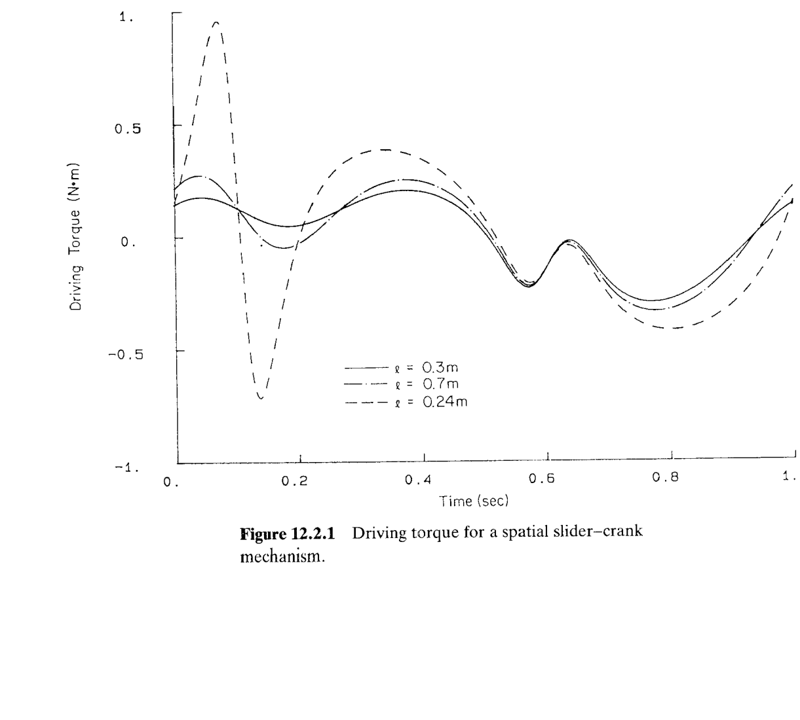
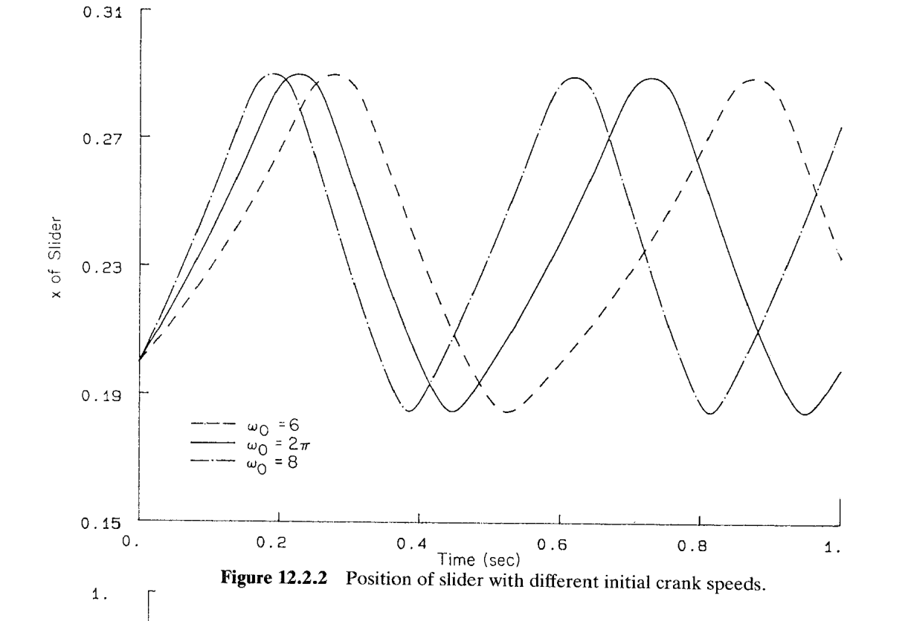
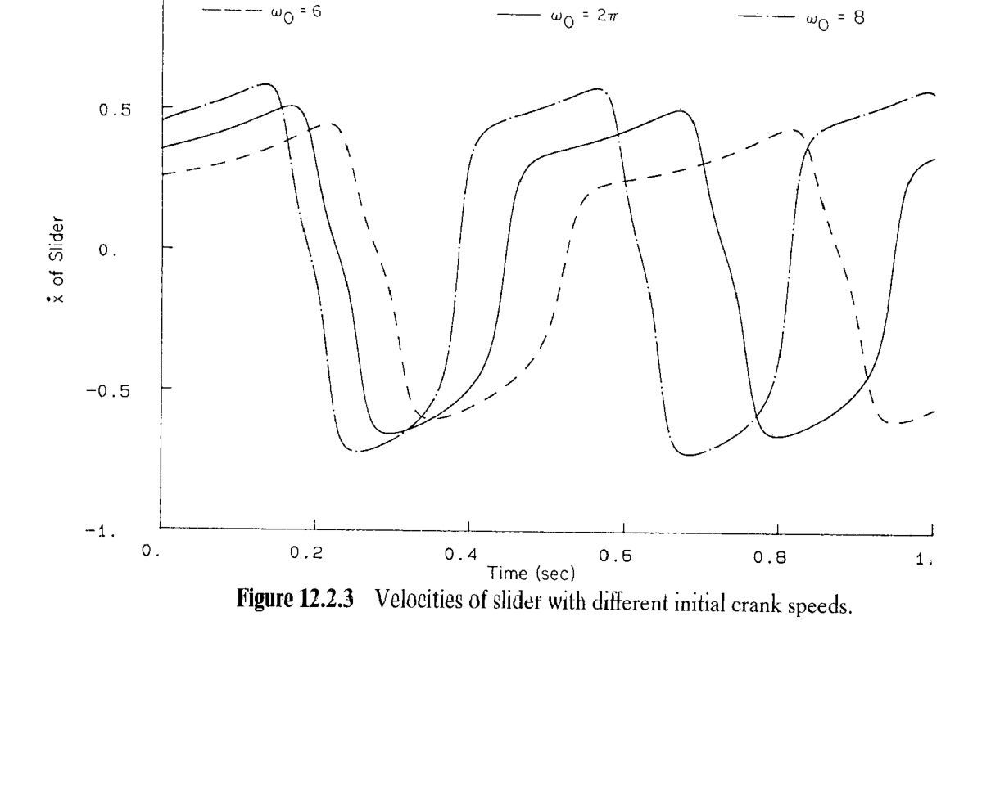
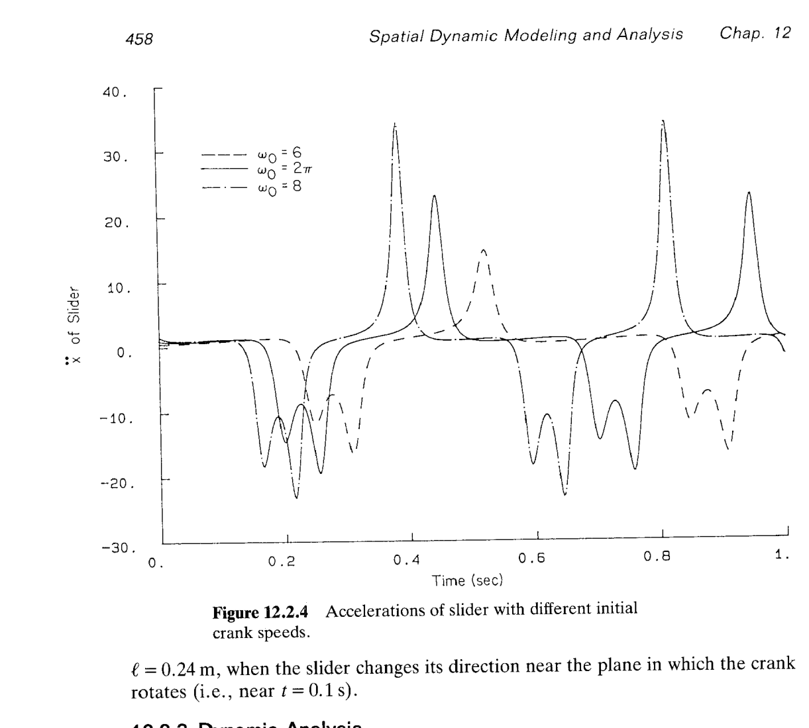

# 12.2 空间曲柄滑块机构的动力学分析

> 来源：*Computer Aided Kinematics and Dynamics of Mechanical Systems*，第 12 章，§12.2（书页 455 下段起—458 中段止；p.458 底 §12.3 起，不在本节范围）。
> 本节把 §10.2 建立的**空间曲柄滑块机构**（4 体、1 DOF、Fig. 10.2.1）拿来做完整的动力学分析。§12.1 三阶段流程中，本节只跑 **阶段 B 逆动力学**（§12.2.2）与 **阶段 C 瞬态动力学**（§12.2.3）——不做平衡分析（保守系统 + 完全驱动，平衡态不是重点）。核心工程发现：
>
> - **逆动力学**：连杆长度 $\ell$ 接近 §10.2 已算过的**锁死阈值** $\ell_{\min}=0.2362$ m 时（近奇异设计 near-singular design），维持恒定曲柄转速所需的驱动力矩在滑块换向瞬间发生剧烈突变——反映了 $\ell\to\ell_{\min}$ 时 $\dot x_C,\ddot x_C$ 的奇异放大。
> - **瞬态动力学**：名义设计 $\ell=0.3$ m 下系统保守，运动周期性；初始曲柄角速度 $\omega_0$ 越大，周期越短、加速度峰值越高——非线性 Hamiltonian 系统的能量-周期依赖。

## 引言：本节要解决什么

§10.2 已经把空间曲柄滑块的**运动学**做完了：4 个体（曲柄①、连杆②、滑块③、地面④）；关节 A（①-④ 转动关节）、B（①-② 球关节）、C（②-③ 转-柱复合关节）、D（③-④ 移动关节）；以及连杆两端的**距离约束** $\Phi^{ss}=\mathbf d^T\mathbf d-\ell^2=0$。加上驱动约束 $\theta=2\pi t$，$\text{DOF}=0$，位置/速度/加速度分析可以逐点求解。§10.2 还给出了两个关键几何量：

- 曲柄销到滑轨的垂距的平方：$\rho^2=0.0308+0.016\cos\theta+0.0192\sin\theta$
- 锁死长度：$\ell_{\min}=\sqrt{0.1^2+0.12^2}+0.08=0.2362$ m

**§12.2 只做一件新事**——把 §11.3 的空间约束运动方程 Eq. 11.3.11 应用到这个 4 体系统上：

1. **§12.2.1 Model**：给运动学模型补上惯性数据（Table 12.2.1）——除此以外，动力学计算所需的一切都在 §10.2。
2. **§12.2.2 Inverse Dynamic Analysis**：把曲柄的转速锁定为 $\omega=2\pi$ rad/s，反求驱动力矩 $n_{\text{drv}}(t)$，通过参数扫描 $\ell\in\{0.3,\,0.27,\,0.24\}$ m 观察其对**近奇异**的敏感性。
3. **§12.2.3 Dynamic Analysis**：换成给曲柄初速度 $\omega_0\in\{6,\,2\pi,\,8\}$ rad/s、放开驱动约束、对完整 DAE 做时间积分，观察 $\omega_0$ 对系统响应的影响。

---

## §12.2.1 模型（Model）

### 思路

**运动学部分完全复用 §10.2**（Fig. 10.2.1、Tables 10.2.1–10.2.5）：4 体、$nc=7\times 4=28$、$nh=27$、$\text{DOF}=1$；姿态用 Euler 参数、位置用 $\mathbf r$；曲柄由**相对转动驱动**（Eq. 9.5.4）$\theta+2n\pi-2\pi t=0$ 锁定 60 rpm。§12.2.1 只补一件东西：**每体的质量与主轴惯性矩**。

### Table 12.2.1 惯性数据

各体的随体系原点选在**质心**、坐标轴选为**主轴**（principal axes，§11.2），故惯性积恒为零，惯性矩阵 $\mathbf J_i'=\operatorname{diag}(I_{x'x'},I_{y'y'},I_{z'z'})$：

| 体 | 质量 (kg) | $I_{x'x'}$ | $I_{y'y'}$ | $I_{z'z'}$ | $I_{x'y'}$ | $I_{y'z'}$ | $I_{z'x'}$ |
|---|---------|-----------|-----------|-----------|-----------|-----------|-----------|
| Crank ① | 0.12 | 0.0001 | 0.00001 | 0.0001 | 0 | 0 | 0 |
| Connecting rod ② | 0.5 | 0.004 | 0.0004 | 0.004 | 0 | 0 | 0 |
| Slider ③ | 2.0 | 0.0001 | 0.0001 | 0.0001 | 0 | 0 | 0 |
| Ground ④ | 1.0 | 1.0 | 1.0 | 1.0 | 0 | 0 | 0 |

几处值得留意：

- **滑块最重**（$m_3=2.0$ kg），远大于曲柄（0.12 kg）和连杆（0.5 kg）。**含义**：系统的动能几乎全在滑块的平动上，滑块的 $\ddot x$ 是驱动力矩的主要来源。
- **连杆的 $I_{y'y'}=0.0004$**（$y'$ 是杆长方向），仅为 $I_{x'x'}=I_{z'z'}=0.004$ 的 $1/10$。**含义**：与实际长杆细杆的几何一致——绕自身轴转的转动惯量远小于绕横向轴。
- **地面 $m_4=1$ kg、$\mathbf J_4'=\mathbf I$** 只是软件占位（地面在动力学中被 6 条绝对约束锁死，惯性不进入方程），$0$ 也可，本书按格式统一填了。

### 力与初值

原书 §12.2 没有列出任何**外力**（$\mathbf F^A=\mathbf n'^A=\mathbf 0$，只有惯性效应；重力显式忽略，视为水平放置或仅关心相对惯性响应）。

- **逆动力学阶段**：位置/速度/加速度初值都由 §10.2 的运动学求解给出——曲柄以 $\omega=2\pi$ rad/s 恒转，$t=0$ 时 $\theta=0$。
- **瞬态阶段**：位置初值取运动学初始构型（$\theta_0=0$，全体广义坐标由 §9.6 装配解出）；速度初值只指定 $\omega_0=\dot\theta(0)\in\{6,\,2\pi,\,8\}$ rad/s，其他体的初速度由**运动学**从曲柄传递（$\ddot{\mathbf q}$ 由 §11.3.11 决定，不需要额外指定）。

---

## §12.2.2 逆动力学分析（Inverse Dynamic Analysis）

### 思路

**逆动力学**是 §12.1 阶段 B：把 DOF 全部由驱动约束"顶死"——这里 $\theta=2\pi t$，$\text{DOF}=1-1=0$，$\mathbf q(t),\dot{\mathbf q}(t),\ddot{\mathbf q}(t)$ **完全由 §10.2 的运动学决定**——然后代回 Eq. 11.3.11，只剩下一次代数解得到 $\boldsymbol\lambda$。乘子中对应驱动约束（转动驱动）的分量，就是曲柄轴上所需的**驱动力矩** $n_{\text{drv}}$。

**关键问题**：驱动力矩 $n_{\text{drv}}(t)$ 对连杆长 $\ell$ 有多敏感？§12.2.2 用三种取值 $\ell\in\{0.3,\,0.27,\,0.24\}$ m 做参数扫描——注意最后一档 $\ell=0.24$ 距 §10.2 算出的锁死长度 $\ell_{\min}=0.2362$ m 只有 $0.24-0.2362=0.0038$ m 的余量（相对 1.6%）——这是典型的**近奇异设计**。

### 从 Eq. 11.3.11 到"驱动力矩" 的解读

逆动力学时 $\ddot{\mathbf r},\dot{\boldsymbol\omega}'$ 已知，Eq. 11.3.11 前两行成为对 $\boldsymbol\lambda$ 的线性方程：

$$
\begin{bmatrix}\boldsymbol\Phi_{\mathbf r}^T\\[2pt]\boldsymbol\Phi_{\boldsymbol\pi'}^T\end{bmatrix}\boldsymbol\lambda
=\begin{bmatrix}\mathbf F^A-\mathbf M\ddot{\mathbf r}\\[2pt]\mathbf n'^A-\mathbf J'\dot{\boldsymbol\omega}'-\tilde{\boldsymbol\omega}'\mathbf J'\boldsymbol\omega'\end{bmatrix}
$$

在本例 $\mathbf F^A=\mathbf n'^A=\mathbf 0$，简化为

$$
\boxed{\;\begin{bmatrix}\boldsymbol\Phi_{\mathbf r}^T\\[2pt]\boldsymbol\Phi_{\boldsymbol\pi'}^T\end{bmatrix}\boldsymbol\lambda
=-\begin{bmatrix}\mathbf M\ddot{\mathbf r}\\[2pt]\mathbf J'\dot{\boldsymbol\omega}'+\tilde{\boldsymbol\omega}'\mathbf J'\boldsymbol\omega'\end{bmatrix}\;}
$$

**物理翻译**：约束反力必须**恰好**抵消每体的惯性力/惯性力矩（陀螺项 $\tilde{\boldsymbol\omega}'\mathbf J'\boldsymbol\omega'$）。乘子的每一分量按其所属约束回接到关节上：

- 属于**运动学约束**（关节 A/B/C/D、距离约束、Euler 归一化）的乘子 $\to$ **关节反力/反力矩**（Eqs. 11.5.4–11.5.6）
- 属于**驱动约束** $\theta-2\pi t=0$ 的乘子 $\lambda_{\text{drv}}$ $\to$ **曲柄轴上需要外加的驱动力矩** $n_{\text{drv}}=\lambda_{\text{drv}}$（雅可比是 $\partial\theta/\partial\theta=1$，故直接就是力矩本身）

### $\ell$ 对驱动力矩的影响：Fig. 12.2.1

**图 12.2.1（Driving torque）**：三条曲线分别对应 $\ell=0.3$ m（实线）、$\ell=0.27$ m（点划线；书上图例误印为"0.7m"）、$\ell=0.24$ m（虚线）。仿真时间 $t\in[0,1]$ s，正好一个曲柄周期（$T=2\pi/\omega=1$ s）。

**观察 1：整体形状相近，$\ell=0.24$ 的曲线在 $t\approx 0.05\text{–}0.15$ s 剧烈放大。**峰值从 $\ell=0.3$ 的 $\sim 0.25$ N·m 冲到 $\ell=0.24$ 的 $\sim 0.95$ N·m（约 4 倍），谷值也对应加深，波形出现"$\Lambda$"型的锐利凸起。

**观察 2：$t\approx 0.05\text{–}0.15$ s 恰好是滑块的换向时刻**。曲柄角 $\theta=\omega t\in[0.1\pi,\,0.3\pi]$ rad，$\rho^2=0.0308+0.016\cos\theta+0.0192\sin\theta$ 在 $\theta=\arctan(0.0192/0.016)=\arctan(1.2)\approx 0.876$ rad（书上原语言"near the plane in which the crank rotates"即 $\theta\approx\pi/2\cdot 0.56\approx 0.28\pi$ rad，$t\approx 0.14$ s）附近取得**最大值** $\rho_{\max}=0.23620$ m。在这一构型上 $\dot\rho=0$，故 $\dot x_C=-\rho\dot\rho/\sqrt{\ell^2-\rho^2}=0$——**滑块换向的瞬间**。

**观察 3：换向瞬间恰好是 $\ell^2-\rho^2$ 最小的时刻**。$\ell=0.24$ m 时 $\ell^2-\rho_{\max}^2=0.0576-0.05579\approx 0.00181$ m²，故 $\sqrt{\ell^2-\rho_{\max}^2}\approx 0.0426$ m 极小。虽然 $\dot x_C=0$，但 $\ddot x_C$ 由更高阶项主导：

$$
x_C=\sqrt{\ell^2-\rho^2}\;\Rightarrow\;\ddot x_C=-\frac{\ddot\rho^2\rho^2+\dots}{\text{某种含 }(\ell^2-\rho^2)^{3/2}\text{ 的项}}
$$

（一般公式见 §10.2 术语表条目 *singular amplification*：$\ddot x_C\propto(\ell^2-\rho^2)^{-3/2}$，随 $\ell\to\rho_{\max}$ 迅速发散。）

### 驱动力矩尖峰的物理起源

**惯性力放大链**：滑块 $m_3=2$ kg 承担系统主要动能。$\ddot x_C$ 在换向瞬间被 $(\ell^2-\rho^2)^{-3/2}$ 放大 → 滑块惯性力 $F_{\text{iner}}=-m_3\ddot x_C$ 被放大 → 该力通过连杆传回曲柄销 → 曲柄销力 $\times$ 曲柄半径 $r=0.08$ m 得到反抗曲柄旋转的力矩 → 为维持 $\omega$ 恒定所需的驱动力矩 $n_{\text{drv}}$ 必须与之相抗，故也被同倍数放大。

数量级估算（$\ell=0.24$ m）：
- $\ddot x_C\sim(\ell^2-\rho_{\max}^2)^{-3/2}\cdot\text{数量级 1}$ 项 $\sim (0.00181)^{-3/2}\sim 1.3\times 10^4$（无量纲量放大因子）
- 与之相比 $\ell=0.30$ 时 $\ell^2-\rho_{\max}^2=0.09-0.05579\approx 0.0342$，$(0.0342)^{-3/2}\approx 158$
- 比值 $\approx 83$，实际图上峰值放大约 4 倍——只有比值 $\sim 83^{1/2}$（因为惯性力还含 $\rho,\dot\rho,\ddot\rho$ 的其它项，并非全被 $(\ell^2-\rho^2)^{-3/2}$ 主导）

**结论**：连杆长选得过短、逼近 §10.2 的锁死阈值时，系统本身并没有"卡死"（$\ell>\ell_{\min}$ 就能完成一整圈），但**维持恒转所需的驱动力矩**会在特定构型附近出现巨大尖峰——这是**近奇异设计的动力学代价**，直接对应到伺服电机的**峰值扭矩**规格。设计上应给 $\ell$ 留出足够的余量（原书隐含推荐 $\ell=0.3$ m，$\ell/\ell_{\min}=1.27$ 时曲线平滑）。

---

## §12.2.3 动力学分析（Dynamic Analysis）

### 思路

**阶段 C**：放开驱动约束，只留几何约束（$\text{DOF}=1$），给曲柄一个初始角速度 $\omega_0$，让系统按 Eq. 11.3.11 或 Eq. 11.3.29 自然演化。取名义连杆长 $\ell=0.3$ m（远离奇异），对 $\omega_0\in\{6,\,2\pi\approx 6.28,\,8\}$ rad/s 三个初值做三次时间积分。

**期望**：系统无耗散（$\mathbf F^A=\mathbf n'^A=\mathbf 0$，无阻尼、无摩擦），是 **1-DOF 保守系统**——总能量 $E=T$（无势能，或等价地重力被忽略）守恒。取 1-DOF 独立坐标 $\theta$（曲柄角），运动方程可归约为

$$
\tfrac12\,I_{\text{eff}}(\theta)\,\dot\theta^2=E=\text{const},\qquad
\dot\theta=\pm\sqrt{2E/I_{\text{eff}}(\theta)}
$$

其中 $I_{\text{eff}}(\theta)$ 是把 $m_3\dot x_C^2+m_2\lvert\dot{\mathbf r}_2\rvert^2+\dots$ 全部按运动学关系折算到 $\dot\theta$ 上的**广义等效惯量**（关于 $\theta$ 是 $2\pi$-周期函数）。这类 1-DOF Hamiltonian 系统运动**必然周期**，周期由 $E$ 决定：

$$
T(E)=\oint\frac{\mathrm d\theta}{\dot\theta(E,\theta)}=\int_0^{2\pi}\sqrt{\frac{I_{\text{eff}}(\theta)}{2E}}\,\mathrm d\theta
$$

**$\omega_0$↑ ⇒ $E\uparrow$ ⇒ $\dot\theta$ 处处更大 ⇒ 周期 $T$ 缩短**（$T\propto 1/\sqrt E$ 是均匀比例的情形；非均匀势下也一定递减）。

### 滑块位置：Fig. 12.2.2

**图 12.2.2（Slider position $x_3(t)$）**：三条曲线（虚线 $\omega_0=6$、实线 $\omega_0=2\pi$、点划线 $\omega_0=8$）都在 $x\in[0.187,\,0.29]$ m 之间振荡，**振荡边界与 $\omega_0$ 无关**——因为 $x_C=\sqrt{\ell^2-\rho^2}$ 的极值只由几何 $\rho_{\min},\rho_{\max}$ 决定，与速度无关。

**周期与 $\omega_0$ 的关系**：
- $\omega_0=8$ rad/s：曲线穿越 $[0,\,1]$ s **约 1.4 个周期**（点划线；周期 $\approx 0.72$ s）
- $\omega_0=2\pi\approx 6.28$ rad/s：**恰好 1 个周期**（实线；周期 $=1$ s，与 $2\pi/\omega_0=1$ 匹配）
- $\omega_0=6$ rad/s：**约 0.9 个周期**（虚线；周期 $\approx 1.11$ s）

三条曲线均**呈周期性**（起点与一周期后终点吻合），验证保守系统的运动积分是周期轨道。$\omega_0=2\pi$ 那条恰好周期等于 $1/\omega_0$ 的 $2\pi$ 倍是特殊——一般 $\omega_0\neq 2\pi$ 时 $T$ 不等于 $2\pi/\omega_0$，因为 $\theta$ 随时间**非匀速**演化（$I_{\text{eff}}(\theta)$ 非常数）。

### 滑块速度：Fig. 12.2.3

**图 12.2.3（Slider velocity $\dot x_3(t)$）**：速度峰值从 $\omega_0=6$ 的 $\pm 0.35$ m/s 冲到 $\omega_0=8$ 的 $\pm 0.7$ m/s。**峰值与 $\omega_0$ 大致成线性**：初始角速度大约翻倍（6→8 上升 33%，或 6→2π 上升 4.7%），滑块速度峰值也按类似比例升高。

**波形不对称**：滑块向正 $x$（前进）速度峰值约 $+0.55$ m/s、向 $-x$（回退）峰值 $-0.75$ m/s，$|\dot x_{\max}^-|>|\dot x_{\max}^+|$。这是**曲柄滑块几何**的特征——快回效应（quick-return）的空间版：$x_C=\sqrt{\ell^2-\rho^2}$ 关于 $\rho$ 是非线性映射，导致正负半周动力学非对称。

### 滑块加速度：Fig. 12.2.4

**图 12.2.4（Slider acceleration $\ddot x_3(t)$）**：与位置、速度截然不同——加速度呈现**孤立的尖峰**结构。$\omega_0=8$ 峰值 $\sim 35$ m/s²、$\omega_0=2\pi$ 峰值 $\sim 25$ m/s²、$\omega_0=6$ 峰值 $\sim 15$ m/s²。**峰值大致按 $\omega_0^2$ 缩放**（比值 8²/6²=1.78，实际 35/15=2.3；有偏差因加速度还含 $\ddot\theta$ 而非仅 $\dot\theta^2$）。

**峰值时刻**都发生在**滑块换向附近**——$\dot x_3=0$ 但 $\rho\to\rho_{\max}$ 使 $|\ddot x_3|$ 由 $(\ell^2-\rho^2)^{-3/2}$ 类项主导（尽管 $\ell=0.3$ 远离奇异，此项仍显著）。加速度尖峰对应到实体上就是**关节反力峰值**——滑块与滑轨、球副 B、转-柱铰 C 的接触应力峰值都出现在此时——这是**动平衡设计**（如加重块、平衡杆）关心的目标时刻。

### $\omega_0$ 与响应的定量关系

| $\omega_0$ (rad/s) | 周期 $T$ (s) | $\dot x_3$ 峰值 (m/s) | $\ddot x_3$ 峰值 (m/s²) |
|--------------------|------------|--------------------|-----------------------|
| 6 | $\approx 1.11$ | $\approx 0.4$ | $\approx 15$ |
| $2\pi\approx 6.28$ | $\approx 1.00$ | $\approx 0.55$ | $\approx 25$ |
| 8 | $\approx 0.72$ | $\approx 0.7$ | $\approx 35$ |

- **位置振幅几乎不变**（几何决定的两个死点位置）
- **速度峰值** $\propto\omega_0^1$（近似）
- **加速度峰值** $\propto\omega_0^2$（近似，含 $\ddot\theta$ 的修正）
- **周期** $\propto 1/\omega_0$（近似；$I_{\text{eff}}(\theta)$ 非常数使精确关系偏离纯反比）

这几条尺度关系在**任何 1-DOF 保守机构**上都成立（把整个系统看作一个"广义单摆"），是快速估算峰值的实用工具。

---

## §12.2 综合发现

### 逆动力学揭示的设计边界

**近奇异 $\ell=0.24$ m 案例**在几何学上是**允许**的（$\ell>\ell_{\min}=0.2362$），运动学求解一切正常。但一进入动力学：

- **换向瞬间**的驱动力矩尖峰达 $\sim 1$ N·m，是名义设计（$\ell=0.3$ m）的 4 倍；
- 这个尖峰**不是外力引起的**——本例外力全为零——完全来自"维持恒转"这一运动学约束**要求**的惯性平衡；
- 若把驱动电机换成**扭矩饱和**的伺服电机（如额定 0.3 N·m），$\ell=0.24$ 的设计**会失去恒速控制**：电机吃不住尖峰 → 曲柄减速 → 系统脱离设计工况。

**教训**：单看运动学的自由度余量（$\ell/\ell_{\min}\ge 1$）**不足以**判断设计合格；必须通过动力学看**峰值驱动力矩**是否在执行器能力范围内。这正是 §12.1 强调的"逆动力学分析支持机械设计"的具体体现。

### 瞬态动力学揭示的能量-周期结构

**保守系统 $\to$ 周期运动**是 1-DOF 系统的一般结论；$\omega_0$ 变化仅改变**运动的能量水平**（total mechanical energy），进而改变周期与峰值。但**周期性运动本身**是稳健的——即使 $\omega_0$ 从 6 变到 8，运动的定性图景（振幅、非对称形状）不变。

对比 §12.3 之后（如 §12.4 空气压缩机、§12.6 调速器）**含耗散/驱动**的情形，本节的"保守 + 完全可逆"是一个干净的对照组：任何观察到的现象都能干净地归因到**几何**（$\ell,\ell_{\min}$）与**惯性**（Table 12.2.1）——没有力元、没有摩擦。

### 与 §10.2 的呼应

| 现象 | §10.2 运动学层面 | §12.2 动力学层面 |
|-----|------------------|-------------------|
| 锁死阈值 $\ell_{\min}=0.2362$ m | $x_C=\sqrt{\ell^2-\rho^2}$ 在 $\ell=\rho_{\max}$ 时定义域断裂 | 无（$\ell>\ell_{\min}$ 时机构能转） |
| 近奇异 $\ell=0.24$ m 的放大 | $\dot x_C\propto (\ell^2-\rho^2)^{-1/2}$，$\ddot x_C\propto (\ell^2-\rho^2)^{-3/2}$ 峰值升高（Fig. 10.2.5） | **驱动力矩尖峰**——动力学的"惩罚"（Fig. 12.2.1） |
| 换向瞬间 | 滑块速度过零点 | 加速度**峰值**处，且驱动力矩**尖峰**处 |
| $\rho$ 极值定滑块行程 | $x_3\in[\sqrt{\ell^2-\rho_{\max}^2},\sqrt{\ell^2-\rho_{\min}^2}]$ | 位置振幅（Fig. 12.2.2）几何决定，与 $\omega_0$ 无关 |

**§10.2 的运动学几何量在 §12.2 的动力学结果中都留下了指纹**——这就是"运动学模型是动力学模型的前提"（§12.1 首句）的具体含义。

---

## 阅读脉络回顾

§12.2 作为 Ch.12 的第一个案例，规模最小（4 体 1 DOF）却把 §12.1 三阶段流程演示得最清楚：

1. **§12.2.1**：只给 4 行惯性表就完成建模——运动学（§10.2）承担了绝大部分工作量。
2. **§12.2.2**：一次代数解 + $\ell$ 参数扫描，揭示了 §10.2 中"看似安全"的近奇异设计的动力学代价。
3. **§12.2.3**：完整时间积分，验证保守系统的周期性，并给出 $\omega_0$ 对速度/加速度峰值的定量缩放。

下一节 **§12.3 空间四连杆**将把注意力转向阶段 A **平衡分析**——同时展示**多平衡态**（局部极小 vs 全局极小）与**建模等价性**（Model 1 vs Model 2）的问题。
