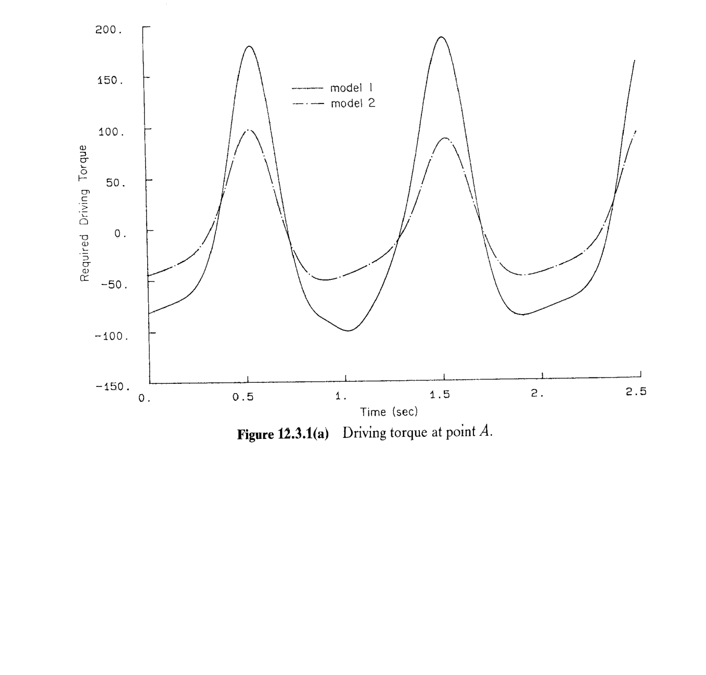
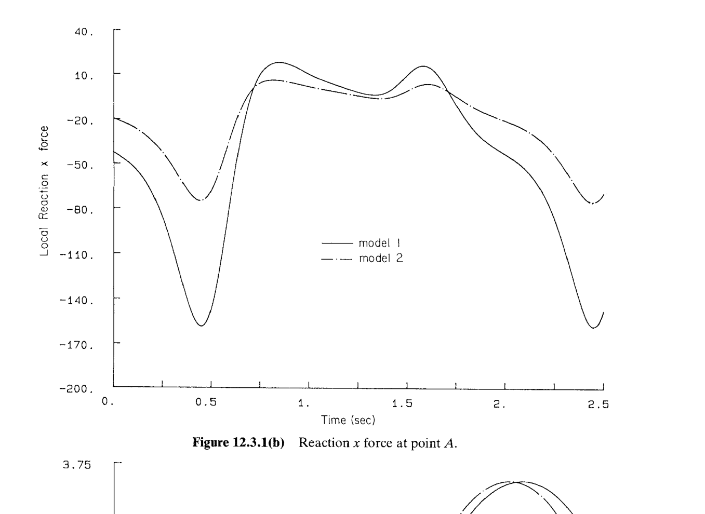
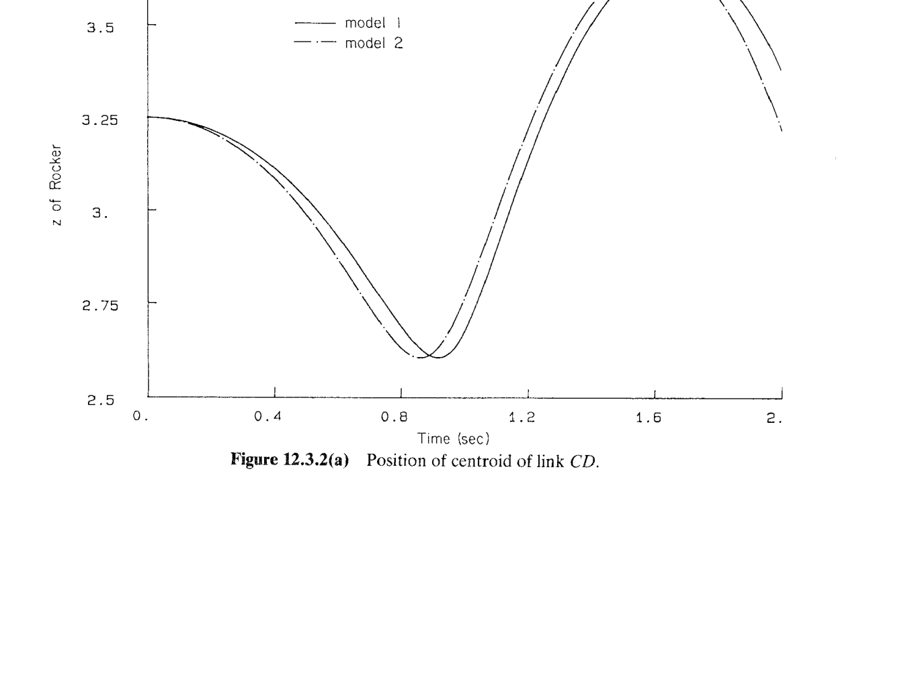
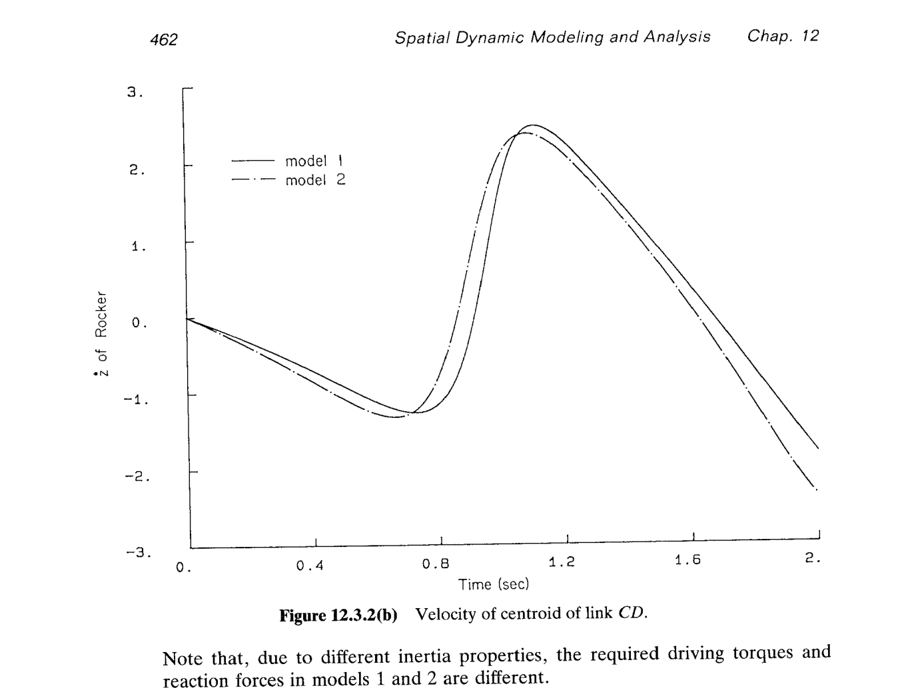

# 12.3 空间四杆机构的动力学分析

> 来源：*Computer Aided Kinematics and Dynamics of Mechanical Systems*，第 12 章，§12.3（书页 458 底段起—462 中段止；p.462 底 §12.4 起，不在本节范围）。
> 本节把 §10.3 建立的**空间四杆机构**（Fig. 10.3.1/10.3.2 两种**运动学等价**模型）拿来做**完整三阶段**动力学分析：平衡（§12.3.2）→ 逆动力学（§12.3.3）→ 瞬态动力学（§12.3.4）。核心工程发现：
>
> - **平衡多解性**：同一机构的两个模型收敛到**不同**的稳定平衡——Model 1 落在 Fig. 10.3.4 的**浅**局部极小 $A$（$z_3=2.792$），Model 2 落在**深**局部极小 $B$（$z_2^{(\text{M2})}=2.622$）。原书将其归因于**Newton–Raphson 起点不同 + 非线性多解**。
> - **逆动力学与瞬态动力学**：两模型给出**不同**的力矩/反力/响应曲线（Model 2 幅值约为 Model 1 的**一半**）——运动学等价但**动力学不等价**，差异源于 Model 2 忽略了连杆 $BC$ 的惯性（$I_{x'x'}=12.4$，机构中最大主惯量）。**运动性质相同**（周期、相位关系），**只是响应幅值/时间尺度差一个惯量常数**。

## 引言：本节要解决什么

§10.3 已经把这台空间四杆机构的**运动学**做完了：两种运动学等价模型（Model 1：4 体、$nc=28,nh=27$，用 universal + spherical；Model 2：3 体、$nc=21,nh=20$，用一条 spherical-spherical 距离约束替代连杆），DOF=1；驱动 $\theta=\pi t$；解析结果 $z_B=2\cos(\pi t)$；两模型的 $z_3(t)$、$\dot z_3(t)$ **逐点相同**。

**§12.3 只做一件新事**——补上惯性数据后走完 §12.1 三阶段流程，回答：**运动学等价的两种模型，动力学结果一致吗？**

主线逻辑：
1. **§12.3.1 备选模型（Alternative Models）**：Table 12.3.1 给出 Model 1 各体的质量与主惯量；Model 2 的做法极为节俭——**"直接把 Table 12.3.1 中的 Link ② 那一行删掉"**。
2. **§12.3.2 平衡分析（Equilibrium Analysis）**：重力沿 $-\hat{\mathbf z}$、无其他外力；以 §10.3 装配构型（Table 10.3.6）为 Newton 起点，动态沉降（§7.5）到平衡态。两模型收敛到**不同**局部极小 ⇒ 非线性多解。
3. **§12.3.3 逆动力学分析（Inverse Dynamic Analysis）**：完全复用 §10.3.3 的驱动 $\theta=\pi t$；用 Eq. 11.3.11 反求驱动力矩 $n_{\text{drv}}(t)$ 与关节 $A$ 处反力沿 $\hat{\mathbf x}$ 的分量。两模型的**周期与相位相同、幅值差一半**。
4. **§12.3.4 瞬态动力学分析（Dynamic Analysis）**：撤去驱动约束、在曲柄上施加恒定逆时针力矩 $n=10\ \text{N·m}$，从 §10.3 装配构型**静止**起动；看摇杆 $CD$ 质心的 $z$ 与 $\dot z$。Model 2 因少了 $BC$ 转动惯量，**响应更快**（时间超前）。

---

## §12.3.1 备选模型（Alternative Models）

### 思路

运动学部分完全复用 §10.3.1（Fig. 10.3.1 & 10.3.2、Tables 10.3.1–10.3.6）；本节只补一件东西：**每体的质量与主惯量**。由 §10.3.1 复述机构：

- **Model 1**（Fig. 10.3.1）4 体：曲柄 ① $AB$（$|AB|=2$ m）、连杆 ② $BC$（$|BC|=12.19$ m）、摇杆 ③ $CD$（$|CD|=7.4$ m）、机架 ④；关节 $A,D$ 为**转动关节**，$B$ 为**万向节**，$C$ 为**球副**。
- **Model 2**（Fig. 10.3.2）3 体：曲柄 ①、摇杆 ②、机架 ③；连杆 $BC$ 用一条**球-球距离约束** $\Phi^{ss}$（Eq. 9.4.28）代替。

⚠️ **两套编号不要混**：Model 1 中"体 ①=曲柄、②=连杆、③=摇杆、④=机架"；Model 2 中**连杆不存在**，故"体 ①=曲柄、②=摇杆、③=机架"。

### Table 12.3.1 惯性数据（Model 1）

各体在**质心随体系** $x'y'z'$（§11.2）中，坐标轴选为**主轴**（惯性积 $I_{x'y'}=I_{y'z'}=I_{z'x'}$ 恒为零）：

| 体 | 质量 (kg) | $I_{x'x'}$ | $I_{y'y'}$ | $I_{z'z'}$ | $I_{x'y'}$ | $I_{y'z'}$ | $I_{z'x'}$ |
|----|---------|-----------|-----------|-----------|-----------|-----------|-----------|
| Link ① $AB$ | 2.0 | 4.0 | 2.0 | 0.0 | 0 | 0 | 0 |
| Link ② $BC$ | 1.0 | 12.4 | 0.01 | 0.0 | 0 | 0 | 0 |
| Link ③ $CD$ | 1.0 | 4.54 | 0.01 | 0.0 | 0 | 0 | 0 |
| Ground ④ | 1.0 | 1.0 | 1.0 | 1.0 | 0 | 0 | 0 |

**逐体读数与合理性验证**：

- **Link ① 曲柄**：$B$ 在体系 $(0,0,2)$（Table 10.3.2）⇒ 曲柄轴沿局部 $z'$；带**驱动圆盘**（Fig. 10.3.1）故不是薄杆；主惯量 $I_{x'x'}=4.0,\ I_{y'y'}=2.0,\ I_{z'z'}=0$——数值反映"带盘的杆"的横向惯量偏大、绕自身轴（$z'$）按薄杆理想化为零。
- **Link ② 连杆**：$B\to C$ 沿局部 $y'$（$B=(0,6.1,0),\ C=(0,-6.1,0)$，Tables 10.3.2–10.3.3）⇒ 杆轴沿 $y'$；按细杆公式
$$
I_{x'x'}=I_{z'z'}=\tfrac{1}{12}mL^2=\tfrac{1}{12}\cdot 1\cdot 12.19^2=12.383\approx 12.4\ \checkmark,\qquad I_{y'y'}\approx 0\ (\text{印刷 }0.01)\ \checkmark
$$
**印刷值 $I_{z'z'}=0.0$ 是明显笔误**——它按对称性应等于 $I_{x'x'}=12.4$（细杆绕两条横向轴的惯量相同）。本节后续所有力矩/反力计算须按 $I_{z'z'}=12.4$ 理解，否则连杆绕 $z'$ 的转动惯量凭空消失。
- **Link ③ 摇杆**：$C\to D$ 沿局部 $y'$（$C=(0,-3.7,0),\ D=(0,3.7,0)$，Tables 10.3.1、10.3.3）⇒
$$
I_{x'x'}=I_{z'z'}=\tfrac{1}{12}\cdot 1\cdot 7.4^2=4.5633\approx 4.54\ \checkmark,\qquad I_{y'y'}\approx 0\ (\text{印刷 }0.01)\ \checkmark
$$
印刷值 $I_{z'z'}=0.0$ **仍是笔误**（应 $=4.54$）。
- **Ground**：$m=1,\ \mathbf J'=\mathbf I$ 只是软件占位——6 条绝对约束把机架完全锁死，惯性不进方程；与 §12.2.1 的处理完全一致。

### Model 2 的惯性数据

原书原文（p.459）：
> Properties for the bodies that make up model 2 are obtained by simply ignoring link 2 in Table 12.3.1.

即：**从 Table 12.3.1 中直接删掉 Link ② 那一行**，剩下 Link ①（曲柄）、Link ③（重新编号为 Model 2 的 Link ②，摇杆）、Ground。工程含义：把 $BC$ 当作**二力杆**——两端球铰，杆本身自由地绕自身轴自转（§10.3 已论证），其惯性对系统动力学的贡献被完全忽略。

**这是 §12.3.3、§12.3.4 两模型结果不同的根本原因**：Eq. 11.3.11 左端块对角惯性矩阵 $\operatorname{diag}(\mathbf M,\mathbf J')$ 里最大的主惯量 $I_{x'x'}=12.4$（Link ②）在 Model 2 中被整块抹掉。逆动力学时（右端已知 $\ddot{\mathbf r},\dot{\boldsymbol\omega}'$）$\mathbf J'\dot{\boldsymbol\omega}'$ 与陀螺项 $\tilde{\boldsymbol\omega}'\mathbf J'\boldsymbol\omega'$ 减小 ⇒ 反解出的力矩减小；瞬态动力学时（右端外力矩相同、左端惯性块小）$\dot{\boldsymbol\omega}'$ 增大 ⇒ 响应更快。

---

## §12.3.2 平衡分析（Equilibrium Analysis）

### 思路

**§12.1 阶段 A**：重力 $\mathbf g=-g\hat{\mathbf z}$，无其他外力，无驱动。沿 §7.5 的**动态沉降法**（或直接对 $\boldsymbol\Phi=\mathbf 0,\ \boldsymbol\Phi_{\mathbf q}^T\boldsymbol\lambda=\mathbf Q^A$ 做 Newton–Raphson）积分 Eq. 11.3.11 至 $\dot{\mathbf q}=\ddot{\mathbf q}=\mathbf 0$。§10.3 装配构型（Table 10.3.6）用作 Newton 起点。

**物理预判**（原书 p.459）：重力使连杆/摇杆的质心向 $z\downarrow$ 方向下坠，最终 $z_2,z_3$ 应落在 §10.3.4 Fig. 10.3.4 描绘的 $z(t)$ 曲线的**局部极小**附近——那条曲线的两个谷分别是 $A\approx 2.82$（浅谷）与 $B\approx 2.63$（深谷）。**哪个谷被选中取决于 Newton 起点更近哪个吸引域**。

### Table 12.3.2 Model 1 平衡构型

| Body | $x$ | $y$ | $z$ | $e_0$ | $e_1$ | $e_2$ | $e_3$ |
|------|-----|-----|-----|-------|-------|-------|-------|
| Link ① | 0.0 | 0.0 | 0.0 | 0.4722 | $-0.8815$ | 0.0 | 0.0 |
| Link ② | 0.4281 | $-3.418$ | 2.238 | 0.3080 | $-0.1269$ | 0.9065 | $-0.2595$ |
| Link ③ | $-1.572$ | $-8.5$ | 2.792 | 0.2932 | $-0.6435$ | 0.6435 | $-0.2932$ |
| Ground ④ | 0.0 | 0.0 | 0.0 | 1.0 | 0.0 | 0.0 | 0.0 |

**独立复算 (1)：Euler 参数归一化 $\mathbf p_i^T\mathbf p_i=1$**
$$
\lvert\mathbf p_1\rvert^2=0.4722^2+0.8815^2=0.22297+0.77704=1.00001\ \checkmark
$$
$$
\lvert\mathbf p_2\rvert^2=0.3080^2+0.1269^2+0.9065^2+0.2595^2=0.09486+0.01610+0.82174+0.06734=1.00004\ \checkmark
$$
$$
\lvert\mathbf p_3\rvert^2=0.2932^2+0.6435^2+0.6435^2+0.2932^2=0.08597+0.41409+0.41409+0.08597=1.00012\ \checkmark
$$

**独立复算 (2)：曲柄 ① 姿态 → 点 $B$ 的全局位置**

$\mathbf p_1=(0.4722,-0.8815,0,0)$，$e_2=e_3=0$ ⇒ 转轴只在 $\hat{\mathbf x}$ 方向。由 Euler 定理（§9.3, Eq. 9.3.2）：
$$
e_0=\cos\tfrac{\chi}{2}=0.4722\;\Longrightarrow\;\tfrac{\chi}{2}=\arccos 0.4722=61.83^\circ,\;\chi=123.66^\circ
$$
$$
\mathbf e=(-0.8815,0,0)^T=\mathbf u\sin\tfrac{\chi}{2}=\mathbf u\cdot 0.8815\;\Longrightarrow\;\mathbf u=(-1,0,0)
$$
即"绕 $-\hat{\mathbf x}$ 转 $123.66^\circ$" $\Leftrightarrow$ "绕 $+\hat{\mathbf x}$ 转 $-123.66^\circ$"。相应旋转矩阵（§9.3, Eq. 9.3.26）：
$$
\mathbf A_1=\begin{bmatrix}1&0&0\\0&\cos(-123.66^\circ)&-\sin(-123.66^\circ)\\0&\sin(-123.66^\circ)&\cos(-123.66^\circ)\end{bmatrix}=\begin{bmatrix}1&0&0\\0&-0.5541&\ 0.8324\\0&-0.8324&-0.5541\end{bmatrix}
$$

$B$ 在曲柄体系的坐标 $(0,0,2)$（Table 10.3.2），全局位置：
$$
\mathbf r_B=\mathbf r_1+\mathbf A_1\begin{bmatrix}0\\0\\2\end{bmatrix}=\mathbf 0+\begin{bmatrix}0\\2\cdot 0.8324\\2\cdot(-0.5541)\end{bmatrix}=\begin{bmatrix}0\\+1.665\\-1.108\end{bmatrix}\ \text{m}
$$

对比装配构型 $B_0=(0,0,+2.0)$（Table 10.3.6）⇒ 曲柄从"竖直向上"顺时针绕 $\hat{\mathbf x}$ 转了 $123.66^\circ$，$B$ 甩到 $+y$、$-z$ 方向。**含义**：曲柄不能纯粹垂直向下悬挂（$\chi=180^\circ$ 时 $B=(0,0,-2)$，则 $|BC|=|\ (-1.572,-8.5,2.792)+\mathbf A_3(0,-3.7,0)-B\ |$ 无法维持 $12.19$）；重力势能最小的 $\chi$ 是几何约束流形上一个非平凡值 $123.66^\circ$。

**独立复算 (3)：摇杆 ③ 的 $z_3=2.792$ 与 Fig. 10.3.4 局部极小的对应**

Fig. 10.3.4（§10.3.4，Model 1 的运动学结果）显示 $z_3(t)$ 在一个曲柄周期（2 s）内有两个谷：**浅谷 $A\approx 2.82$**、**深谷 $B\approx 2.63$**。装配构型 $z_3(0)=3.2553$ 是"起始位置"，从这里沿约束流形下坠时，走到浅谷 $A$ 就已经是相对极小、Newton 收敛于此：
$$
z_3^{\text{eq}}=2.792\ \approx\ z_3^A\approx 2.82\quad(\text{差 }0.03\text{ m，来自"运动学 kinematic 曲线"vs"静态平衡"的微小差异})
$$

$\Rightarrow$ **Model 1 落在浅局部极小 $A$**（稳定平衡）。

### Table 12.3.3 Model 2 平衡构型（含 "Point A"）

| Body | $x$ | $y$ | $z$ | $e_0$ | $e_1$ | $e_2$ | $e_3$ |
|------|-----|-----|-----|-------|-------|-------|-------|
| Link ①（曲柄） | 0.0 | 0.0 | 0.0 | 0.8665 | 0.4992 | 0.0 | 0.0 |
| Link ②（摇杆） | $-6.610$ | $-8.5$ | 2.622 | 0.6530 | $-0.2713$ | 0.2713 | $-0.6530$ |
| Ground | 0.0 | 0.0 | 0.0 | 1.0 | 0.0 | 0.0 | 0.0 |
| **Point A** | 0.0 | $-1.730$ | 1.003 | — | — | — | — |

**"Point A" 是什么？** Fig. 10.3.2（Model 2）把球-球复合关节的两个端点直接标注为"点 $A$（曲柄侧）"和"点 $B$（摇杆侧）"——即 Model 1 中的 $B$ 与 $C$，在 Model 2 中被复用为 $A$ 与 $B$。表末"Point A"行给出**该关节端点的全局坐标**，作为独立复算的目标——它就是曲柄末端在全局系中的位置。

**独立复算 (1)：Euler 参数归一化**
$$
\lvert\mathbf p_1\rvert^2=0.8665^2+0.4992^2=0.75082+0.24920=1.00002\ \checkmark
$$
$$
\lvert\mathbf p_2\rvert^2=0.6530^2+0.2713^2+0.2713^2+0.6530^2=0.42641+0.07360+0.07360+0.42641=0.99999\ \checkmark
$$

**独立复算 (2)：曲柄 ① 姿态 → Point A 全局位置**

$\mathbf p_1=(0.8665,+0.4992,0,0)$：
$$
e_0=\cos\tfrac{\chi}{2}=0.8665\;\Longrightarrow\;\tfrac{\chi}{2}=\arccos 0.8665=30.0^\circ,\;\chi=60.0^\circ
$$
$$
\mathbf e=(+0.4992,0,0)^T=\mathbf u\sin 30^\circ=\mathbf u\cdot 0.5\;\Longrightarrow\;\mathbf u=(+1,0,0)
$$
即"绕 $+\hat{\mathbf x}$ 转 $+60^\circ$"（**与 Model 1 的 $-\hat{\mathbf x}$、$123.66^\circ$ 完全不同的分支！**）。旋转矩阵：
$$
\mathbf A_1=\begin{bmatrix}1&0&0\\0&\cos 60^\circ&-\sin 60^\circ\\0&\sin 60^\circ&\cos 60^\circ\end{bmatrix}=\begin{bmatrix}1&0&0\\0&\ 0.5000&-0.8660\\0&\ 0.8660&\ 0.5000\end{bmatrix}
$$

Point A（= Model 1 中的 $B$）的全局位置：
$$
\mathbf r_A=\mathbf r_1+\mathbf A_1\begin{bmatrix}0\\0\\2\end{bmatrix}=\mathbf 0+\begin{bmatrix}0\\2\cdot(-0.8660)\\2\cdot 0.5000\end{bmatrix}=\begin{bmatrix}0\\-1.732\\+1.000\end{bmatrix}\ \text{m}
$$

$$
\boxed{\ \mathbf r_A^{\text{复算}}=(0,\ -1.732,\ +1.000)\ \text{vs. 印刷值 }(0,\ -1.730,\ +1.003)\ \text{差 }\le 3\times10^{-3}\ \text{m}\ \checkmark\ }
$$

三分量逐个吻合 ⇒ 复算既确认了 Table 12.3.3 的归一化、又确认了旋转轴方向与 §9.3 的符号约定。

**独立复算 (3)：Model 2 摇杆 $z_2^{(\text{M2})}=2.622$ 与 Fig. 10.3.4 深局部极小 $B$**
$$
z_2^{(\text{M2}),\text{eq}}=2.622\ \approx\ z_3^B\approx 2.63\quad(\text{差 }0.008\text{ m})
$$

$\Rightarrow$ **Model 2 落在深局部极小 $B$**！

### 平衡分析的核心结论：非线性系统的多解性

| 项 | Model 1 | Model 2 |
|----|---------|---------|
| 曲柄旋转轴 $\mathbf u$ | $-\hat{\mathbf x}$ | $+\hat{\mathbf x}$ |
| 曲柄旋转角 $\chi$ | $123.66^\circ$ | $60.0^\circ$ |
| 关节 $B$ / Point A 全局位置 | $(0,\ +1.665,\ -1.108)$ | $(0,\ -1.732,\ +1.000)$ |
| 摇杆质心 $z$ | $2.792$（浅谷 $A$） | $2.622$（深谷 $B$） |

**表面看两模型运动学等价**（§10.3 已证）**但静态平衡落到不同分支**——不是矛盾，而是**非线性平衡方程在约束流形上的多解性**：

- 平衡方程 $\boldsymbol\Phi_{\mathbf q}^T\boldsymbol\lambda=\mathbf Q^A,\ \boldsymbol\Phi=\mathbf 0$ 对 $(\mathbf q,\boldsymbol\lambda)$ 非线性；
- Fig. 10.3.4 的两个谷 $A,B$ **都**是 $V(\mathbf q)=g\sum_i m_i z_i$（重力势能）在约束流形上的**局部极小**，两者**都稳定**；
- Newton–Raphson 是**局部**算法——起点稍偏（Model 2 因少一个体的方程/未知量，Newton 步长/方向与 Model 1 不同）就收敛到不同分支；
- Model 1 从装配构型（$z_3=3.2553$）下坠先遇到 $A$；Model 2 因少一层"缓冲"（Link ② 的姿态不再是自由变量），下坠路径直接越过 $A$ 进入 $B$ 的吸引域。

原书原文（p.460）：

> This is another illustration of the effect of nonlinearities in the kinematics and dynamics of machines, leading to multiple solutions.

**工程启示**：同一机构在有限扰动下可能"跳"到另一稳态构型（如四杆过死点后翻越）；平衡分析必须**探索多个初始估计**——只跑一次 Newton 得到的"平衡"不是**唯一**的。

---

## §12.3.3 逆动力学分析（Inverse Dynamic Analysis）

### 思路

**§12.1 阶段 B**：完全复用 §10.3.3 的驱动 $\theta=\pi t$（$\omega_0=\pi$ rad/s，曲柄周期 $T=2$ s）把 DOF 顶死 ⇒ $\mathbf q(t),\dot{\mathbf q}(t),\ddot{\mathbf q}(t)$ 由 §10.3 的运动学完全给出。代入 Eq. 11.3.11：

$$
\begin{bmatrix}\mathbf M & \mathbf 0 & \boldsymbol\Phi_{\mathbf r}^T\\ \mathbf 0 & \mathbf J' & \boldsymbol\Phi_{\boldsymbol\pi'}^T\\ \boldsymbol\Phi_{\mathbf r} & \boldsymbol\Phi_{\boldsymbol\pi'} & \mathbf 0\end{bmatrix}\begin{bmatrix}\ddot{\mathbf r}\\ \dot{\boldsymbol\omega}'\\ \boldsymbol\lambda\end{bmatrix}=\begin{bmatrix}\mathbf F^A\\ \mathbf n'^A-\tilde{\boldsymbol\omega}'\mathbf J'\boldsymbol\omega'\\ \boldsymbol\gamma\end{bmatrix}\tag{11.3.11}
$$

由于 $\ddot{\mathbf r},\dot{\boldsymbol\omega}'$ 已由运动学解出，前两行块合并为对 $\boldsymbol\lambda$ 的线性方程：

$$
\begin{bmatrix}\boldsymbol\Phi_{\mathbf r}^T\\ \boldsymbol\Phi_{\boldsymbol\pi'}^T\end{bmatrix}\boldsymbol\lambda=\begin{bmatrix}\mathbf F^A-\mathbf M\ddot{\mathbf r}\\ \mathbf n'^A-\tilde{\boldsymbol\omega}'\mathbf J'\boldsymbol\omega'-\mathbf J'\dot{\boldsymbol\omega}'\end{bmatrix}
$$

其中 $\mathbf F^A=-m_i g\hat{\mathbf z}$（每体重力，与前段同）、$\mathbf n'^A=\mathbf 0$（重力过质心矩为零）。$\boldsymbol\lambda$ 中对应驱动约束（关节 $A$ 的转动驱动 Eq. 9.5.4）的分量即**驱动力矩** $n_{\text{drv}}(t)$；关节 $A$ 处的反力沿 $\hat{\mathbf x}$ 的分量由 §6.6 的公式（空间版类推）
$$
\mathbf F_i^{k}=-\mathbf C_i^T\mathbf A_i^T\boldsymbol\Phi_{\mathbf r_i}^{k\,T}\boldsymbol\lambda^k
$$
给出（这里 $k=$ 关节 $A$，$i=$ 曲柄）。

### Fig. 12.3.1(a) 驱动力矩

**读数**：

| | Model 1 | Model 2 |
|---|---------|---------|
| 峰值（$t\approx 0.5,\ 1.5$ s） | $\approx +180$ N·m | $\approx +100$ N·m |
| 谷值（$t\approx 1.0$ s） | $\approx -95$ N·m | $\approx -45$ N·m |
| 周期 | $\approx 1$ s | $\approx 1$ s |

**关键观察 1：周期 $\approx 1$ s，不是曲柄周期 $2$ s**。为什么？——Fig. 10.3.4 已经告诉我们：$z_3(t)$ 在一个曲柄周期（$2$ s）内出现**两个**谷（$A$ 与 $B$），即摇杆质量的加减速在一个曲柄周期内往复**两次**。加速度周期 = 力矩周期，故驱动力矩以**二倍频**响应。

**关键观察 2：力矩正负都出现**，说明重力+惯性力对曲柄的作用力矩在一个周期内**换向**——前半周需克服负载做正功、后半周被负载"推着走"要制动。这是**保守系统**在恒 $\omega$ 驱动下的一般特征（一个周期内驱动做的净功为零，等于耗散功——此处无耗散所以就是零）。

**关键观察 3：Model 2 幅值约为 Model 1 的一半**。Model 2 把 Link ② 的 $I_{x'x'}=12.4$（机构中最大的主惯量，远大于任一其它主惯量）归零 ⇒ 陀螺项 $\tilde{\boldsymbol\omega}'\mathbf J'\boldsymbol\omega'$ 与惯性项 $\mathbf J'\dot{\boldsymbol\omega}'$ 都少了主要贡献 ⇒ 反解出的 $\boldsymbol\lambda$（对应力矩分量）按比例减小。这是**动力学不等价**的直接量化证据。

### Fig. 12.3.1(b) 关节 $A$ 处反力 $x$ 分量

**读数**：

| | Model 1 | Model 2 |
|---|---------|---------|
| 深谷（$t\approx 0.5,\ 2.5$ s） | $\approx -160$ N | $\approx -75$ N |
| 平坦段（$t\in[0.75,1.75]$ s） | $-20\sim +15$ N | $-15\sim +5$ N |
| 周期 | $\approx 1$ s | $\approx 1$ s |

**读法**：
- 周期 $1$ s 与 (a) 同因——摇杆二倍频；
- Model 1 深谷 $\approx -160$ N 出现在曲柄摆过下方极端位置时（$t\approx 0.5,\ 2.5$ s，均为峰值力矩时刻）——重力+惯性效应沿 $-\hat{\mathbf x}$ 合成为对 $A$ 的最强拉力；
- $t\in[0.75,1.75]$ s 曲线相对平坦（$\approx -20$ 到 $+15$ N）——摇杆越过"深谷—浅谷"过渡区时惯性效应相对较小；
- Model 2 深谷 $\approx -75$ N，同样约为 Model 1 的**一半**——原因同 (a)：Link ② 的 $I_{x'x'}=12.4$ 归零。

**原书对本节的一句话总结**（p.462）：
> Note that, due to different inertia properties, the required driving torques and reaction forces in models 1 and 2 are different.

---

## §12.3.4 瞬态动力学分析（Dynamic Analysis）

### 思路

**§12.1 阶段 C**：**撤去驱动约束**（DOF 恢复为 1），只在曲柄上施加**恒定逆时针力矩** $n=10\ \text{N·m}$（作用于关节 $A$，绕 $\hat{\mathbf x}$）；初始位置取 §10.3 装配构型（Table 10.3.5），初始速度**全部为零**（"started from rest"）。数值积分完整 DAE Eq. 11.3.11（§7.3 算法），输出摇杆 $CD$ 质心的 $z$ 与 $\dot z$。

**实施细节**：Model 1 中"摇杆"是 Link ③；Model 2 中因 Link ② 被删除，"摇杆"重新编号为 Link ②。图例把两者统一称为"link $CD$"。

### Fig. 12.3.2(a) 摇杆 $CD$ 质心的 $z$ 坐标

**读数**：

| 阶段 | Model 1 | Model 2 |
|------|---------|---------|
| 起点 $t=0$ | $z(0)=3.25$ ✓ Table 10.3.6 | 同 |
| 谷底 | $z\approx 2.60$，$t\approx 0.92$ s | $z\approx 2.60$，$t\approx 0.88$ s |
| 峰值 | $z\approx 3.72$，$t\approx 1.65$ s | $z\approx 3.72$，$t\approx 1.60$ s |
| $t=2$ s | $z\approx 3.31$ | $z\approx 3.24$ |

**过程解读**：
1. $t\in[0,\ 0.9]$：曲柄从静止起动，重力先"帮"逆时针力矩把摇杆拉下 ⇒ $z_{CD}$ 单调下降到谷底 $\approx 2.60$；
2. $t\in[0.9,\ 1.65]$：过谷后机构几何"扔"摇杆向上 ⇒ $z_{CD}$ 急速上冲到峰值 $\approx 3.72$；
3. $t>1.65$：继续沿机构约束下滑。

**Model 2 略微超前**（谷底早 $0.04$ s、峰值早 $0.05$ s、$t=2$ s 时相差 $\approx 0.07$ m）。

**为什么 Model 2 超前？**——Eq. 11.3.11 左端惯性块 Model 2 少了 $I_{x'x'}=12.4$ 一大块 ⇒ 相同外力矩 $n=10\ \text{N·m}$ 下 $\dot{\boldsymbol\omega}'$ 更大 ⇒ 相同时间内走得更远。**物理直觉**：一辆重车（Model 1）加速慢、一辆轻车（Model 2）加速快，同样施加 $10$ N·m 时轻车更早到达每个特征位置。

### Fig. 12.3.2(b) 摇杆 $CD$ 质心的 $\dot z$

**读数**：

| 阶段 | Model 1 | Model 2 |
|------|---------|---------|
| 起点 $t=0$ | $\dot z(0)=0$ ✓（静止） | 同 |
| 谷底（$z$ 下降最陡） | $\dot z\approx -1.2$，$t\approx 0.75$ s | $\dot z\approx -1.25$，$t\approx 0.70$ s |
| 过零点（谷 → 上升） | $t\approx 0.92$ s | $t\approx 0.88$ s |
| 峰值（$z$ 上升最陡） | $\dot z\approx +2.5$，$t\approx 1.10$ s | $\dot z\approx +2.6$，$t\approx 1.05$ s |
| $t=2$ s | $\dot z\approx -1.7$ | $\dot z\approx -2.3$ |

**关键的相位关系**（严格的微分关系）：
- $\dot z=0$ 的时刻恰好是 $z$ 曲线极值时刻（$z$ 谷底 $t\approx 0.92$ s、$z$ 峰 $t\approx 1.65$ s，对应 $\dot z$ 过零）；
- $\dot z$ 极值时刻是 $z$ 曲线的**拐点**（下降最陡与上升最陡处）。

Model 2 的 $\dot z$ 幅值略大（谷 $-1.25$ vs $-1.2$、峰 $+2.6$ vs $+2.5$），且过零早 $\approx 0.04$ s——**与 (a) 的时间超前完全一致**（$z$ 走得快 $\Leftrightarrow$ 相同时刻 $\dot z$ 大）。

### 原书对本节的总结（p.462）

> Because the inertia properties of link BC are ignored in model 2, different dynamic response is obtained. Note that the basic character of motion is the same, but the response of model 2 is faster due to its lower inertia.

**关键定性判断**：**"运动性质相同"**（周期结构、峰谷交替、$z$–$\dot z$ 相位关系、极值位置）**"只是响应更快"**——这与 §12.3.3 中"两模型力矩/反力幅值相差近一半"的观察是**同一件事的两面**：把系统等效惯性砍掉一半，动力学**时间尺度**收缩、**空间形态**不变。

---

## 本节要点回顾

1. **§12.3.1 惯性数据**：Table 12.3.1 给 4 体（Model 1）；Link ②/③ 的印刷 $I_{z'z'}=0$ 应按对称性理解为 $I_{z'z'}=I_{x'x'}$（$12.4/4.54$）——细杆公式 $\tfrac{1}{12}mL^2$ 独立验证：$\tfrac{1}{12}\cdot 1\cdot 12.19^2=12.38\approx 12.4$、$\tfrac{1}{12}\cdot 1\cdot 7.4^2=4.56\approx 4.54$ ✓。Model 2 直接删掉 Link ② 那一行——工程近似"$BC$ 二力杆惯性可忽略"。
2. **§12.3.2 平衡多解性**：
   - Model 1 平衡（Table 12.3.2）$z_3=2.792$ ⇒ Fig. 10.3.4 的**浅**局部极小 $A$；曲柄绕 $-\hat{\mathbf x}$ 转 $123.66^\circ$，$B$ 落到 $(0,+1.665,-1.108)$ m。
   - Model 2 平衡（Table 12.3.3）$z_2^{(\text{M2})}=2.622$ ⇒ Fig. 10.3.4 的**深**局部极小 $B$；曲柄绕 $+\hat{\mathbf x}$ 转 $60.0^\circ$，"Point A"$=(0,-1.732,+1.000)$ m 与印刷值 $\le 3\times 10^{-3}$ m 吻合。
   - **结论**：非线性系统的**多解性**——Newton 起点差之毫厘决定收敛到哪个稳定平衡；同一机构可能"跳"到不同稳态。
3. **§12.3.3 逆动力学**：$\theta=\pi t$；Fig. 12.3.1(a) 驱动力矩、Fig. 12.3.1(b) 关节 $A$ 反力 $x$ 分量；**周期 $\approx 1$ s 而非曲柄周期 $2$ s**——Fig. 10.3.4 的摇杆 $z(t)$ 二倍频驱动；**Model 2 幅值约为 Model 1 一半**（力矩峰 $100$ vs $180$、反力谷 $-75$ vs $-160$），源于 Link ② 的 $I_{x'x'}=12.4$ 被归零。
4. **§12.3.4 瞬态动力学**：$n=10\ \text{N·m}$ 恒力矩、静止起动；Fig. 12.3.2 显示**运动形态相同（谷 → 上冲 → 峰 → 下滑）、Model 2 时间超前** $\approx 0.05$ s——同一件"惯性差异"的另一副面孔。
5. **贯穿两阶段的一句话**：§10.3 证明两模型**运动学等价**；§12.3 证明**动力学不等价**（差一个 $I_{x'x'}=12.4$ 的连杆惯性）。工程含义：**二力杆化**是运动学层面的严格降维、动力学层面的近似——是否可接受取决于该连杆的惯量是否显著。此处连杆恰好是**最大主惯量所在体**，故动力学差异显著（幅值差一半、响应时间超前 $\ge 5\%$）。

---

## 与前后节的联系

- **对 §12.1 三阶段流程的贯彻**：§12.3 是本章中唯一**三阶段都走完**的样例——曲柄滑块（§12.2）跳过平衡、空气压缩机（§12.4）跳过平衡、车辆（§12.5）跳过逆动力学、调速器（§12.6）走三阶段但强调控制反馈。
- **对 §10.3 的呼应**：§10.3 验证运动学等价性（$z_B=2\cos(\pi t)$、图形逐点相同）；§12.3 反其道行之——把等价性拆解到动力学层面，得到**幅值差一半**的量化结论。
- **对 §7.5 的呼应**：动态沉降法或 Newton–Raphson 求平衡都是**局部**方法；本节的两个不同平衡（$A/B$）是原地演示"起点决定收敛"的经典例子——**Nonlinear equilibrium is multi-valued**。
- **对 §11.3 的应用**：Eq. 11.3.11 的三种用法——平衡（$\ddot{\mathbf q}=\dot{\mathbf q}=\mathbf 0$，只解代数方程）、逆动力学（$\ddot{\mathbf q}$ 已知，解 $\boldsymbol\lambda$）、瞬态动力学（全联立 DAE 时间积分）——在 §12.3 三小节中被完整巡演一遍。
- **对 §9.3 Euler 参数的应用**：Table 12.3.2/12.3.3 中的 $(e_0,\mathbf e)$ 被本笔记逐条重建旋转矩阵，独立验证归一化 $\mathbf p^T\mathbf p=1$ 与关节端点全局位置（Point A 三分量吻合到 $10^{-3}$ m）——Euler 参数的**可核算性**由此充分展示。
