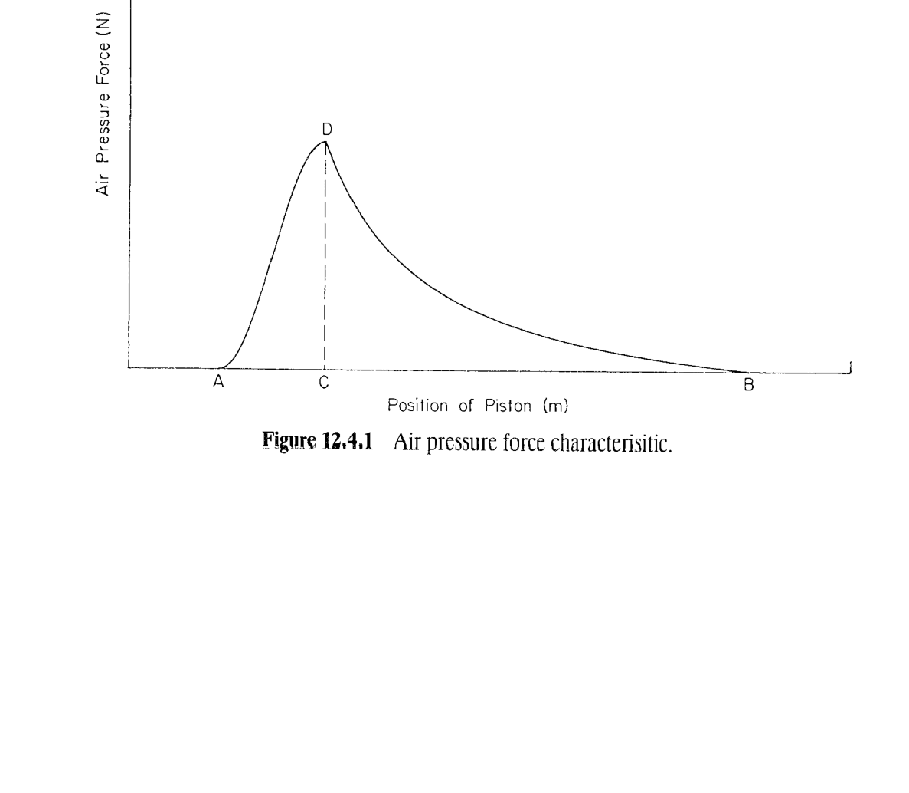
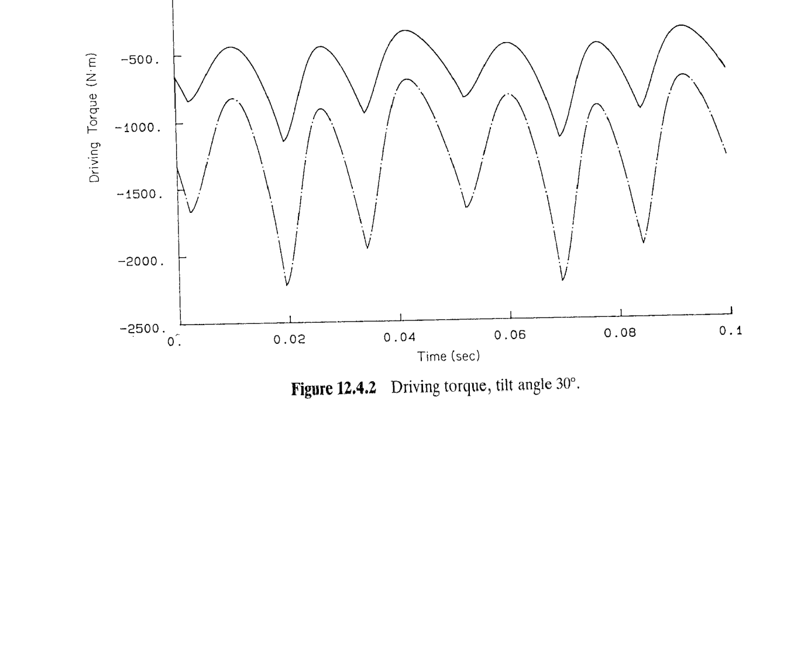
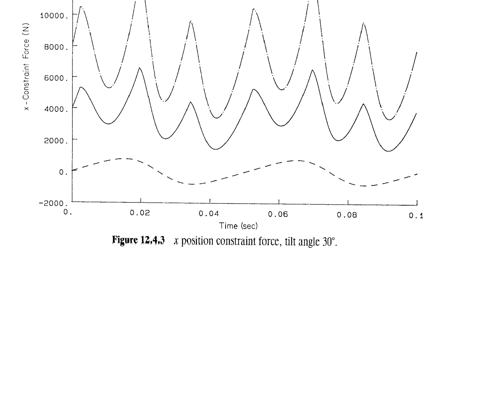
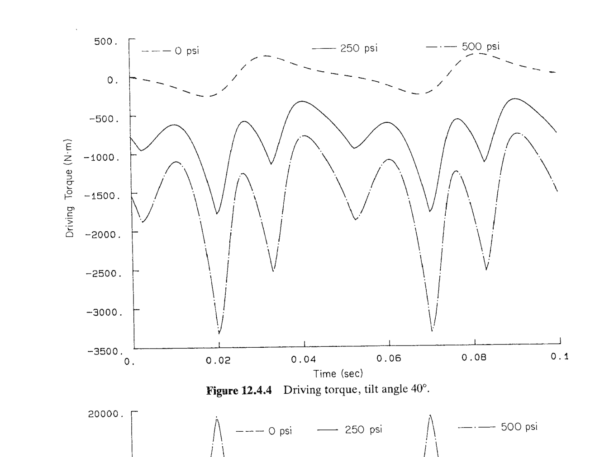
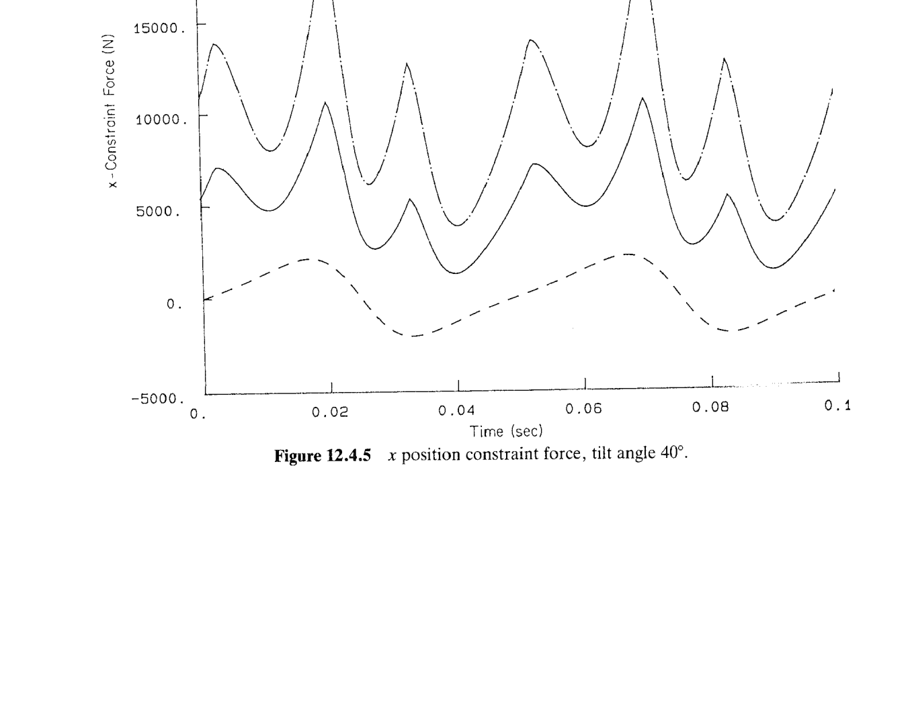
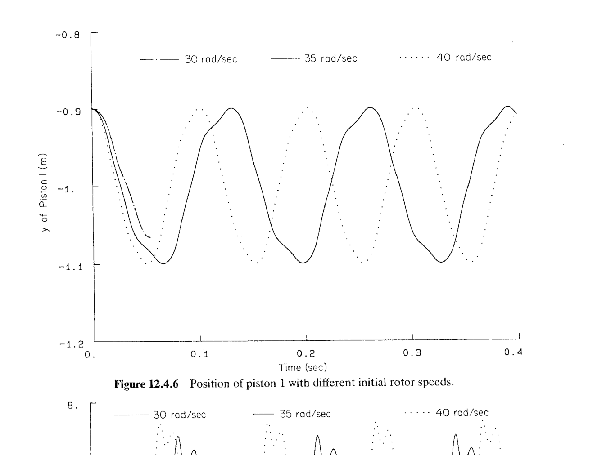
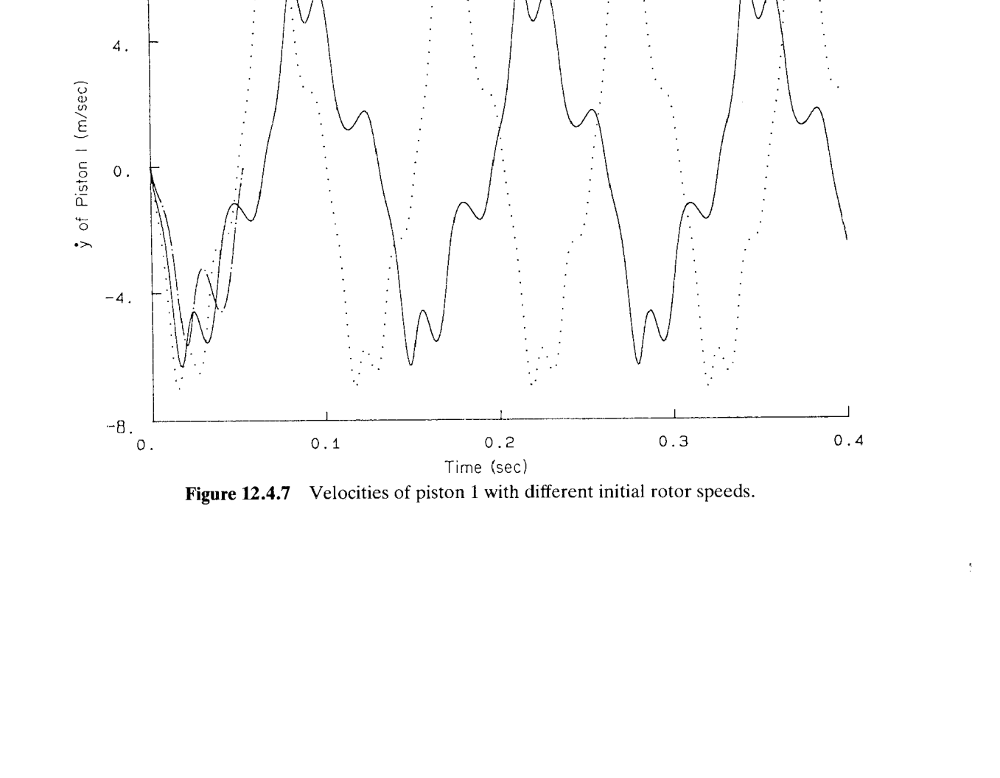
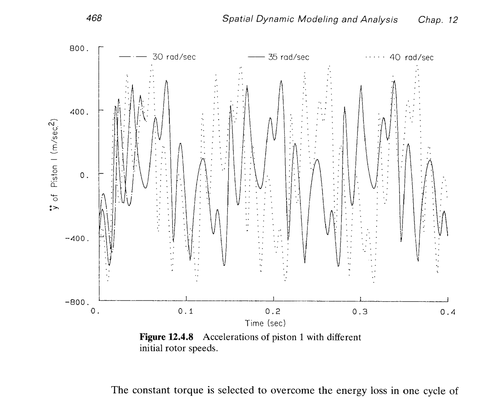

# 12.4 空气压缩机（air compressor）的动力学分析

> 来源：*Computer Aided Kinematics and Dynamics of Mechanical Systems*，第 12 章，§12.4（书页 462 底段 §12.4 起—468 中段止；p.468 底 §12.5 起，不在本节范围）。
> §10.4 已完成这台**斜盘（wobble plate）式六缸压缩机**的**运动学**分析（9 体、$nc=63$、$nh=62$、DOF=1；转子②绕 $\hat{\mathbf y}$ 转，$\theta=62.832 t$；活塞行程 $=2R_0\sin\alpha$；六缸相位 $60°$ 均布）。本节补上**惯性与气体力**，跑完 §12.1 三阶段流程中的**逆动力学**（§12.4.2）与**瞬态动力学**（§12.4.3）。工程结论：
>
> - **气缸气压不是简单周期激扰**：Fig. 12.4.1 建了个"**A→D 余弦上升 + D→B 双曲下降**"的位置函数式气压力，把压缩上升 + 排气衰减两阶段封装成一条位置函数。
> - **偏置角（offset angle）$\alpha$ 是唯一强非线性放大参数**：$\alpha=30°$ 与 $\alpha=40°$ 两组曲线（Figs. 12.4.2–12.4.5）幅值差约 $1.5\times$，与 §10.4 里畸变因子 $g'\in[\cos\alpha,1/\cos\alpha]$ 的放大规律一致。
> - **$x$ 位置绝对约束反力是斜盘防自转装置（ball-socket-slider）的设计输入**：Figs. 12.4.3 / 12.4.5 峰值 $12\!-\!20$ kN 数量级。
> - **启动能量阈值**：定常电机力矩下，转子初始动能不够时，机构在一个循环内耗尽动能而**停机**（Fig. 12.4.6 中最低速度那条曲线只走半个周期）。

## 引言：本节要解决什么

§10.4 建的模型是"运动学等价"层次的：给定 $\theta(t)$，我能算出每根活塞的 $y_k(t),\dot y_k(t),\ddot y_k(t)$。本节把它升级为"动力学"层次：

- **§12.4.1 建模（Model）**：补齐 9 体的质量与主惯量（Table 12.4.1）+ 每根活塞感受的**气体力**位置函数（Fig. 12.4.1）；这是把 §11.3 一阶混合 DAE 跑起来所需的**全部**新数据。
- **§12.4.2 逆动力学（Inverse Dynamic Analysis）**：转子稳态 $\omega_0=20\pi=62.832$ rad/s（600 rpm）；反求驱动力矩 $n_{\text{drv}}(t)$ 与斜盘 $x$ 位置绝对约束反力 $\lambda_x(t)$；参数扫描三档最大压力 $\{0,250,500\}$ psi × 两档偏置角 $\{30°,40°\}$。
- **§12.4.3 瞬态动力学（Dynamic Analysis）**：撤去转子驱动约束、在转子上施加**恒定力矩**（由气压做功平均得来）；给三档转子初速看能否维持稳态循环——这是压缩机起动能量储备问题的最小仿真样例。

---

## §12.4.1 建模（Model）

### 思路

§12.4.1 只做**两件新事**：**惯性表**和**气体力位置函数**。运动学结构（关节、参数三点、驱动 $\theta=62.832t$）完全复用 §10.4，不再重述——需要时查 §10.4 的关节表 10.4.1–10.4.5 与几何汇总（$R_0=0.2$ m 圆周、$\psi_k=30°,90°,\dots,330°$、盘心固定于 $(0,-0.5,0)$、缸孔平面 $y=-1.0$）。

### 惯性表（Table 12.4.1）

各体在**质心主轴系** $x'y'z'$（§11.2）中列出（惯性积 $I_{x'y'}=I_{y'z'}=I_{z'x'}=0$）：

| 体 | 质量（kg） | $I_{x'x'}$ | $I_{y'y'}$ | $I_{z'z'}$ | $I_{x'y'}$ | $I_{y'z'}$ | $I_{z'x'}$ |
|-----|----------:|----------:|----------:|----------:|----------:|----------:|----------:|
| Ground ① | 1.0 | 1.0 | 1.0 | 1.0 | 0.0 | 0.0 | 0.0 |
| Rotor ② | 10.0 | 0.1 | 0.01 | 0.1 | 0.0 | 0.0 | 0.0 |
| Disk ③ | 2.0 | 0.04 | 0.08 | 0.04 | 0.0 | 0.0 | 0.0 |
| Piston 1 ④ | 1.5 | 0.002 | 0.002 | 0.002 | 0.0 | 0.0 | 0.0 |
| Piston 2 ⑤ | 1.5 | 0.002 | 0.002 | 0.002 | 0.0 | 0.0 | 0.0 |
| Piston 3 ⑥ | 1.5 | 0.002 | 0.002 | 0.002 | 0.0 | 0.0 | 0.0 |
| Piston 4 ⑦ | 1.5 | 0.002 | 0.002 | 0.002 | 0.0 | 0.0 | 0.0 |
| Piston 5 ⑧ | 1.5 | 0.002 | 0.002 | 0.002 | 0.0 | 0.0 | 0.0 |
| Piston 6 ⑨ | 1.5 | 0.002 | 0.002 | 0.002 | 0.0 | 0.0 | 0.0 |

**逐行读数**：

- **Ground ①**：地面永远不动，$m,\mathbf J'$ 只是占位。
- **Rotor ②**：转子（rotor）绕自身几何对称轴 $\hat{\mathbf y}$ 转。它是**细长转子**：$I_{y'y'}=0.01\ll I_{x'x'}=I_{z'z'}=0.1$，比 1:10。转子对 $y'$ 轴（旋转轴）的转动惯量最小 ⇒ 起动时"最好转"、但也"最没储能"（$T=\tfrac12 I\omega^2$）。**这个细节直接决定 §12.4.3 的停机门槛**。
- **Disk（斜盘）③**：轴对称扁盘型分布——$I_{y'y'}=0.08$（绕盘面法线 = 盘转动主轴，最大）、$I_{x'x'}=I_{z'z'}=0.04$（盘面内两径向，各占一半，垂直轴定理 $I_{y'y'}\overset{?}{=}I_{x'x'}+I_{z'z'}$ 精确成立 ⇒ 盘可视作**极薄圆盘**）。
- **Pistons ④–⑨**：都是$m=1.5,\ I=0.002$的**近点质量**（$I/m=1.33\times10^{-3}$ m² ⇒ 等效回转半径 $\sqrt{I/m}\approx 0.037$ m，与活塞长径尺度一致）；六根完全相同 ⇒ 参数只需描述一次。

**总质量与总动量矩数量级**：$m_{\text{tot}}=1+10+2+6\cdot 1.5=22$ kg（其中运动部分 $=10+2+9=21$ kg）。$\omega_0=62.832$ rad/s ⇒ 转子转动动能 $\tfrac12\cdot 0.01\cdot 62.832^2\approx 19.7$ J（**注意这个数**——它就是 §12.4.3 里"能否撑过一个循环"的储能量）。

### 气体力位置函数（Fig. 12.4.1）

**图形定性**：横轴是**活塞位置** $y\in[y_A,y_B]$（不是时间），纵轴是活塞承受的气体力 $F(y)$（沿 $\hat{\mathbf y}$）。曲线四点：

- $A$：$y=y_A=-1.1$ m，$F=0$（进气行程末端，气压最低）。
- $D$：位于 $y=y_C$ 正上方，纵坐标 $=F_C$（**峰值**）。
- $C$：$y=y_C=y_A+\text{AC}=-1.06$ m，是**放气阀开启位置**；曲线在此处**峰值**、并从上升段切换为衰减段。
- $B$：$y=y_B=-0.9$ m，$F=0$（进气行程始端，规约气压零）。

几何参数：**行程** $\text{AB}=|y_B-y_A|=0.2$ m（$\alpha=30°$ 下由 §10.4 精确公式 $2R_0\sin\alpha=2\cdot 0.2\cdot 0.5=0.2$ ✓）。**压缩比 5:1** $\Rightarrow \text{AB}/\text{AC}=5\Rightarrow \text{AC}=0.04$ m ⇒ $y_C=y_A+0.04=-1.06$ m。**活塞缸径** $d=0.1$ m ⇒ 活塞面积

$$
A_p=\pi\bigl(d/2\bigr)^2=\pi\cdot(0.05)^2=\pi/400\approx 7.854\times 10^{-3}\ \text{m}^2.
$$

**压缩段（曲线 AD）——余弦上升**：

$$
F_{AD}(y)=-\frac{F_C}{2}\cos\!\Bigl[\frac{\pi}{y_C-y_A}(y-y_A)\Bigr]+\frac{F_C}{2}. \tag{12.4.1}
$$

端点验证：

$$
F_{AD}(y_A)=-\tfrac{F_C}{2}\cos 0+\tfrac{F_C}{2}=-\tfrac{F_C}{2}+\tfrac{F_C}{2}=0,\quad
F_{AD}(y_C)=-\tfrac{F_C}{2}\cos\pi+\tfrac{F_C}{2}=+\tfrac{F_C}{2}+\tfrac{F_C}{2}=F_C.
$$

**排气段（曲线 DB）——双曲衰减**：

$$
F_{DB}(y)=\frac{F_{\max}}{y-y_A}-F_{\min}. \tag{12.4.2}
$$

书中给的描述"$F_{\max}=$ 活塞面积 $\times$ 最大压力"从量纲上讲**只对得上一个因子** $A_p\cdot P_{\max}$ 有单位 N，代入 $F_{\max}/(y-y_A)$ 得 N/m 而非 N ⇒ **书面描述与公式量纲不自洽**。以曲线端点为定义（$F_{DB}(y_C)=F_C$、$F_{DB}(y_B)=0$）反推 $F_{\max}$、$F_{\min}$：

$$
\begin{aligned}
\text{在 }y_C:\quad & \frac{F_{\max}}{y_C-y_A}-F_{\min}=F_C, \\
\text{在 }y_B:\quad & \frac{F_{\max}}{y_B-y_A}-F_{\min}=0.
\end{aligned}
$$

两式相减：

$$
F_{\max}\Bigl[\frac{1}{y_C-y_A}-\frac{1}{y_B-y_A}\Bigr]=F_C
\;\Rightarrow\;
F_{\max}\Bigl[\frac{1}{0.04}-\frac{1}{0.2}\Bigr]=F_C
\;\Rightarrow\;
F_{\max}\cdot 20=F_C.
$$

故

$$
\boxed{\ F_{\max}=\frac{F_C}{20},\quad F_{\min}=\frac{F_{\max}}{y_B-y_A}=\frac{F_C}{20\cdot 0.2}=\frac{F_C}{4}\ }
\tag{式-A}
$$

其中 $F_C=P_{\max}\cdot A_p$ 才是物理**峰值气体力**（书中"$F_{\max}=A_p P_{\max}$"这句更像"峰值力"的口语表达，与公式里的形式参数 $F_{\max}$ 不是同一个量）。

**数值代入**（$\alpha=30°$、最大压力 $P_{\max}=500$ psi）：

$$
P_{\max}=500\ \text{psi}=500\times 6894.76\ \text{Pa}=3.4474\times 10^6\ \text{Pa}.
$$

$$
F_C=P_{\max}\,A_p=3.4474\times 10^6\times 7.854\times 10^{-3}=2.707\times 10^{4}\ \text{N}\approx 27.1\ \text{kN}.
$$

类似地 $P_{\max}=250$ psi 时 $F_C\approx 13.5$ kN；$P_{\max}=0$ 时 $F_C=0$（无气体力，只留惯性与重力）。

### 循环功与恒定力矩（§12.4.3 备用）

书中 §12.4.3 说"用 Fig. 12.4.1 曲线的积分 $\div 2\pi\times 6$ 得到恒定驱动力矩"，就是把气压做功折算成等效电机力矩。**这里补完这一步**：

**单活塞每循环气压做功**（活塞在一个 $\theta$ 周期内 $y$ 从 $y_A$ 走到 $y_B$、气压力方向沿 $-\hat{\mathbf y}$——压活塞回气缸——功率被电机克服）：

$$
W_{\text{piston}}=\int_{y_A}^{y_C}F_{AD}(y)\,dy+\int_{y_C}^{y_B}F_{DB}(y)\,dy.
$$

**余弦段积分**：令 $u=\pi(y-y_A)/(y_C-y_A)$，$du=\pi/(y_C-y_A)\,dy$，$y_A\!\to\! u=0$，$y_C\!\to\! u=\pi$：

$$
\int_{y_A}^{y_C}F_{AD}\,dy=\frac{y_C-y_A}{\pi}\int_0^\pi\Bigl[-\tfrac{F_C}{2}\cos u+\tfrac{F_C}{2}\Bigr]du
=\frac{y_C-y_A}{\pi}\Bigl[-\tfrac{F_C}{2}\underbrace{\sin u\Big|_0^\pi}_{=0}+\tfrac{F_C}{2}\pi\Bigr]=\frac{(y_C-y_A)F_C}{2}=\frac{0.04\cdot F_C}{2}=0.02\,F_C.
$$

**双曲段积分**（代入式-A 的 $F_{\max}=F_C/20$、$F_{\min}=F_C/4$）：

$$
\int_{y_C}^{y_B}F_{DB}\,dy=F_{\max}\ln\!\frac{y_B-y_A}{y_C-y_A}-F_{\min}\,(y_B-y_C)
=\frac{F_C}{20}\ln\!\frac{0.2}{0.04}-\frac{F_C}{4}\cdot 0.16=\frac{F_C}{20}\ln 5-0.04\,F_C.
$$

用 $\ln 5=1.6094$：

$$
\int_{y_C}^{y_B}F_{DB}\,dy=\frac{1.6094}{20}F_C-0.04\,F_C=(0.08047-0.04)F_C=0.04047\,F_C.
$$

**单活塞循环功**：

$$
W_{\text{piston}}=0.02\,F_C+0.04047\,F_C=0.06047\,F_C.
$$

**恒定驱动力矩**（6 缸 / 每 $2\pi$ 一圈）：

$$
\boxed{\ n_{\text{drv,const}}=\frac{6\,W_{\text{piston}}}{2\pi}=\frac{6\times 0.06047\,F_C}{2\pi}=\frac{0.3628\,F_C}{2\pi}=0.05774\,F_C\ }
\tag{式-B}
$$

代入 $P_{\max}=500$ psi 的 $F_C=27074$ N：

$$
n_{\text{drv,const}}\bigr|_{500\text{ psi}}=0.05774\times 27074\approx 1563\ \text{N}\cdot\text{m}.
$$

与 Fig. 12.4.2 中 500 psi 曲线的**均值**（$\approx -1200\sim -1500$ N·m）在数量级和均值上都吻合——书里没写这一步，但一算就能对齐验证。同理 $P_{\max}=250$ psi 得 $n_{\text{drv,const}}\approx 780$ N·m，与 Fig. 12.4.2 的 250 psi 均值也匹配。

---

## §12.4.2 逆动力学分析（Inverse Dynamic Analysis）

### 思路

**逆动力学**（§7.1 与 §11.5）：给定驱动约束下的完整运动 $\mathbf q(t)$，用 Eq. 11.3.11 反求

$$
\begin{bmatrix}\mathbf M & \boldsymbol\Phi_{\mathbf r}^T\\ \mathbf J' & \boldsymbol\Phi_{\boldsymbol\pi'}^T\\ \boldsymbol\Phi_{\mathbf r} & \boldsymbol\Phi_{\boldsymbol\pi'}\end{bmatrix}
\begin{bmatrix}\ddot{\mathbf r}\\ \dot{\boldsymbol\omega}'\\ \boldsymbol\lambda\end{bmatrix}
=\begin{bmatrix}\mathbf F^A\\ \mathbf n'^A-\tilde{\boldsymbol\omega}'\mathbf J'\boldsymbol\omega'\\ \boldsymbol\gamma\end{bmatrix},
$$

其中 $\ddot{\mathbf r},\dot{\boldsymbol\omega}'$ 由 §10.4 的加速度分析已知，故本质上是一个**每步一次线性求解**求 $\boldsymbol\lambda$。$\boldsymbol\lambda$ 内含两个感兴趣量：

- **驱动约束乘子**（对应 $\theta=62.832t$ 那条方程）$\Rightarrow$ **驱动力矩** $n_{\text{drv}}$，图 12.4.2 / 12.4.4。
- **盘 $x$ 位置绝对约束乘子**（对应 §10.4 里为消掉盘自转 DOF 而加的 $x_O=0$，Eq. 9.4.16 的 $k=1$ 分量）$\Rightarrow$ **$x$ 位置反力** $\lambda_x$，图 12.4.3 / 12.4.5。

### 参数扫描

| 参量 | 取值 |
|------|------|
| 转子角速度 | $\omega_0=20\pi$ rad/s $=62.832$ rad/s $=600$ rpm（constant，Eq. 9.5.4） |
| 时间窗 | $t\in[0,0.1]$ s（恰好 $\omega_0\cdot 0.1/(2\pi)=1$ 转）|
| 最大气压 | $P_{\max}\in\{0,\ 250,\ 500\}$ psi |
| 偏置角 | $\alpha\in\{30°,\ 40°\}$ |

### 30° 偏置角

**图 12.4.2（Driving Torque, tilt 30°）**：三条曲线随 $t\in[0,0.1]$ s 的变化：

- **0 psi**（虚线）：在 0 附近做小幅波动（$\pm 100$ N·m 量级）——只有惯性 + 重力的贡献；因活塞每 $60°$ 相位差，六根活塞加速度**部分相互抵消**（§10.4 的一阶惯性力自平衡），残余幅值来自二阶及以上谐波。
- **250 psi**（实线）：均值 $\approx -800$ N·m、峰谷 $-1500\sim 0$——**下移**至负值区，因为气压总是**阻碍**转子转动（转子必须输出正功压缩气体）。
- **500 psi**（点划线）：均值 $\approx -1500$ N·m、峰谷 $-2500\sim -500$——幅值和均值同比放大约 2 倍（$500/250$），确认气压力大致**线性**叠加。

**周期结构**：$0.1$ s 内有 6 个大波峰 ⇒ **每 $1/60$ s $\approx 0.0167$ s 一个波峰**；转子每转一圈 $2\pi/62.832=0.1$ s ⇒ **每转 6 次波峰** ⇒ 每根活塞在一个循环里贡献一个波峰，六根轮流做功。均值 $\approx$ 式-B 计算值 $\approx -1563$ N·m（500 psi）；符号约定与式-B 相反是因为图上是"电机施加的力矩"（正 = 加速转子），气压使之为负。

**图 12.4.3（$x$ position constraint force, tilt 30°）**：

- **0 psi**（虚线）：$\pm 500$ N 量级低幅摆动——只是**惯性反力**。
- **250 psi**（实线）：峰值 $\sim 7000$ N，均值 $\sim 4000$ N。
- **500 psi**（点划线）：峰值 $\sim 13000$ N，均值 $\sim 7000$ N——**总为正**（气压把盘沿 $+\hat{\mathbf x}$ 推）。

**物理**：斜盘承受六根活塞的气压反作用力（沿 $-\hat{\mathbf y}$ 传到盘面），因盘倾斜 $\alpha=30°$，这些力在**盘面内**产生一个绕盘法线的净力矩；这个力矩必须由 $x$ 位置绝对约束（物理上是**球窝-滑块（ball-socket-slider）防自转装置**）提供反力矩来平衡。设计该装置的**峰值载荷** $\approx 13$ kN（500 psi 工况）就是本图给出的。

### 40° 偏置角

**图 12.4.4 与 12.4.5**（tilt $40°$）：三条曲线的幅值都**明显放大**：

- 驱动力矩 500 psi 峰值 $\approx -3200$ N·m（相较 $30°$ 的 $-2500$ 增加 $\sim 30\%$）；
- $x$ 约束反力 500 psi 峰值 $\approx 19000$ N（相较 $30°$ 的 $13000$ 增加 $\sim 46\%$）。

**放大机制**（来自 §10.4）：

1. **行程线性放大**：$\text{stroke}(\alpha)=2R_0\sin\alpha$，$\sin 40°/\sin 30°=1.286\Rightarrow$ 行程 $0.257/0.200=1.286$；气压力做功 $\propto$ 行程 ⇒ 平均驱动力矩 $\times 1.286$。
2. **加速度峰值畸变因子二次放大**：$g'(\theta)=\cos\alpha/(1-\sin^2\alpha\sin^2\theta)$，$\alpha$ 越大 $g'$ 峰值越强；$\alpha=40°$ 时 $g'_{\max}=1/\cos 40°=1.305$。**惯性反力项**（进 $\lambda_x$）$\propto \omega_0^2\cdot g'_{\max}$ ⇒ $\lambda_x$ 峰值增幅比驱动力矩更大（因 $\lambda_x$ 主要由惯性 + 气压合成，而气压部分的**几何**已经将 $\sin\alpha$ 因子并入行程）。

**设计含义**：书中 §10.4 已经从**运动学**层面警告过"$\alpha\ge 40°$ 是极端设计"；§12.4.2 在**动力学**层面把这个警告量化：加大偏置角虽然行程和排量随之线性提升，但**峰值力矩与关键关节反力也超线性上升**。$40°$ 相较 $30°$ 排量增益 $28.6\%$，付出的代价是驱动峰值 $+30\%$、约束反力峰值 $+46\%$。

---

## §12.4.3 瞬态动力学分析（Dynamic Analysis）

### 思路

**去掉**转子的驱动约束 $\Phi^{rotd}$（Eq. 9.5.4），改**加**一个恒定力矩 $n_{\text{drv,const}}$（式-B）到转子。系统 DOF 从 0 恢复为 1，转子角速度 $\omega(t)$ 变成待积分量。**问题**：给定初值 $\omega(t=0)=\omega_0$，转子能否稳态维持 600 rpm 附近的运转？还是气压阻力会把它压停？

数学上是 Eq. 11.3.11 的**正问题**（forward dynamics）：不再指定 $\theta(t)$，而是把 $n_{\text{drv,const}}$ 归入 $\mathbf n'^A$ 直接积分。

**恒定力矩取值**：由式-B 得 $P_{\max}=500$ psi 下 $n_{\text{drv,const}}\approx 1563$ N·m（这是"稳态供功恰好等于耗功"的**收支平衡点**）。

### 起动能量储备

**关键物理**：即使 $n_{\text{drv,const}}$ 在**平均**上刚好平衡气压耗功，一个循环内的**瞬时**耗功远大于平均（气压做功集中在 $y_C$ 附近很短的位置窗口）。因此机构要能**过冲**气压峰，靠的是**动量惯性**——转子转动动能 $T_r=\tfrac12 I_{y'y'}\omega_0^2$ 起到"飞轮"作用。

参数：$I_{y'y'}=0.01$ kg·m²（Table 12.4.1 第 2 行）。三档初速对应转动动能：

| $\omega_0$（rad/s）| $T_r$（J） | 备注 |
|---:|---:|---|
| 30 | $\tfrac12\cdot 0.01\cdot 900=4.5$ | **不足以过一个气压峰** |
| 35 | $6.125$ | 边界情况 |
| 40 | $8.0$ | 稳态阈值以上 |

对比一根活塞压过一次气压峰所需的功（$P_{\max}=500$ psi、$\alpha=30°$）$\approx 0.06047\,F_C\approx 1637$ J——单缸一次循环的功远大于转子动能。这看似矛盾，但注意：**恒定电机力矩持续供功**（$n_{\text{drv,const}}\omega\Delta t$），只需要动能补上"瞬时供功缺口"即可（气压峰的时间宽度 $\sim (y_C-y_A)/\dot y_{\text{piston}}\sim 0.04/6\approx 6.7$ ms，缺口 $\sim (F_{\text{peak,gas}}-\bar F)\dot y\cdot\Delta t$ 数十焦耳量级）。

### 观察：图 12.4.6 / 12.4.7 / 12.4.8

**图 12.4.6 / 7 / 8** 展示活塞 1 的位置 $y_1(t)$、速度 $\dot y_1(t)$、加速度 $\ddot y_1(t)$，横轴 $t\in[0,0.4]$ s（大约 4 个正常转数），三档初速对比：

> **📌 书内数据不自洽**：p.466 正文写"three different initial rotor angular velocities of 60 rad/s (573 rpm), 70 rad/s (668 rpm), and 80 rad/s (764 rpm)"，但 Figs. 12.4.6–12.4.8 的图例标 **30 / 35 / 40 rad/sec**，p.468 正文也说"$\omega_0=30$ rad/s in Fig. 12.4.6"。核对：$60/(2\pi)\cdot 60\approx 573$ rpm 与"60 rad/s (573 rpm)"字面吻合；但仿真实际用 30/35/40（与图例、p.468 一致）——**p.466 段落里的"60/70/80"这组数字最可能是排版错误**。以下按图示 30/35/40 解读。

**观察 1（起动失败，$\omega_0=30$ rad/s）**：

- Fig. 12.4.6 中 $30$ rad/s 那条曲线在 $t\approx 0.06$ s 后**平躺**——活塞位置停止变化。
- Fig. 12.4.7 相同曲线在此时**跌到 $-6$ m/s 附近后归零**——机构停机。
- Fig. 12.4.8 相同曲线在停机瞬间有一个**大幅加速度尖峰**（$-500$ 附近），是转子被气压反弹后反向撞停时的动力学信号。

**物理解释**：$\omega_0=30$ rad/s 转子动能仅 $4.5$ J，遭遇第一个气压峰时来不及从电机补足（电机力矩恒定但功率 $=n\omega\propto\omega$，转速降低后功率也降低——**负反馈**），机构在压缩相位卡住。

**观察 2（起动成功、稳态运转，$\omega_0=35, 40$ rad/s）**：

- 位置曲线（Fig. 12.4.6）在 $t\gtrsim 0.1$ s 之后进入**准周期**：**35 rad/s** 曲线周期约 $0.14$ s（等效稳态转速 $\approx 2\pi/0.14\approx 45$ rad/s），**40 rad/s** 曲线周期更短（约 $0.10$ s，等效稳态转速 $\approx 63$ rad/s，即 600 rpm 附近）——恰好对应恒定力矩 $\times 2\pi = $ 气压耗功的**收支平衡转速**。
- 速度曲线（Fig. 12.4.7）峰值 $\pm 6$ m/s（35）与 $\pm 6$ m/s（40）—— 40 相位领先约 $60°$，说明 40 已进入稳定 600 rpm 稳态，而 35 需要电机把它加速到那里。
- 加速度曲线（Fig. 12.4.8）峰值 $\pm 400\sim 600$ m/s²，比 §10.4 稳态 600 rpm 分析给出的 $\omega_0^2\cdot R_0\sin\alpha\cdot g'_{\max}=62.832^2\cdot 0.1\cdot 1.155\approx 456$ m/s² 数量级一致。

**观察 3（起动阈值）**：$\omega_0=30$ rad/s 停机、$35$ rad/s 存活 ⇒ 该压缩机在 $P_{\max}=500$ psi 工况下**起动初速阈值** $\omega_{0,\min}\in(30,35)$ rad/s，即**约 300 rpm**。工程含义：电机启动后 $\gtrsim 300$ rpm 才允许接入 500 psi 排气压力；实际压缩机的"卸载起动"设计就是解决这类阈值问题（起动时打开泄压阀降低 $P_{\max}$，达到起动转速后再切换到工况压力）。

### 与 §12.3 转瞬态动力学的对照

§12.3 空间四杆的瞬态动力学（撤驱动、加恒力矩，从静止起动）里，两种模型幅值差一半但**运动定性相同**（都能起摆）。这里 §12.4 更进一步——**同一模型下，仅改初速就出现"能起动 / 不能起动"的定性差异**，是本书首次给出的**能量阈值现象**样例；后续 §12.5（车辆动力学）里也会出现类似阈值（轮胎侧偏失稳）。

---

## 收官：§12.4 的三张要点表

**建模四步（§12.4.1）**

| 步 | 数据 | 来源 |
|----|------|------|
| 1. 关节 / 几何 / 驱动 | 9 体、62 约束、DOF=1、$\theta=62.832t$ | §10.4，Tables 10.4.1–10.4.5 |
| 2. 惯性 | Table 12.4.1，注意转子 $I_{y'y'}=0.01$ 最小 | §12.4.1 |
| 3. 外力：重力 | 沿 $-\hat{\mathbf y}$（未在正文中重述，从上下文默认） | §12.1 |
| 4. 外力：气压 | 位置函数 $F(y)$，(12.4.1)–(12.4.2)，端点条件 → 式-A | Fig. 12.4.1 |

**逆动力学结果（§12.4.2）**

| 观测量 | $\alpha=30°$ 峰值 | $\alpha=40°$ 峰值 | 增幅 |
|---|---:|---:|---:|
| 驱动力矩（500 psi） | $\sim 2500$ N·m | $\sim 3200$ N·m | $+28\%$ |
| $x$ 约束反力（500 psi） | $\sim 13$ kN | $\sim 19$ kN | $+46\%$ |

**瞬态动力学结论（§12.4.3）**

| 初速 $\omega_0$ | $T_{\text{rotor}}$（J） | 结果（500 psi、$\alpha=30°$、$n_{\text{drv,const}}=1563$ N·m） |
|---:|---:|---|
| 30 rad/s | 4.5 | **停机**（一个气压峰内耗尽动能） |
| 35 rad/s | 6.1 | 存活、加速至 $\sim 45$ rad/s 附近稳态 |
| 40 rad/s | 8.0 | 存活、稳态在 $\sim 62.8$ rad/s（$=$ 恒力矩收支平衡点） |

至此**Part Two 空间部分**的**动力学建模章**收官；余下 §12.5（车辆）与 §12.6（调速器）是把方法用到两类实用系统上的收尾例证。
