# 12.5 车辆（vehicle）动力学分析

> 来源：*Computer Aided Kinematics and Dynamics of Mechanical Systems*，第 12 章，§12.5（书页 468 底 §12.5 起—481 顶 §12.5.4 收尾止；p.481 底 §12.6 起，不在本节范围）。
> 本节把 §11 的空间刚体多体 DAE 用到**一整台乘用车**上：8 体、$nc=56$、$nh=44$、DOF $=12$，含麦弗逊支柱（McPherson strut）前悬、拖曳臂（trailing arm）后悬、齿条-小齿轮转向、外加一对**横向稳定杆（roll-stabilizing bar）**。工程结论：
>
> - **两个建模档次**：Model 1（体 ①–⑥，6 体）是**基础车**——底盘 + 4 轮 + 转向齿条；Model 2 加入体 ⑦⑧ 两根横向稳定杆——**扭转柔度用悬架下控制臂端点到稳定杆末端的平移弹簧模拟**（Table 12.5.7 后四行）。
> - **平衡靠"阻尼沉降"**：把车从 $z_1=0.55$ m 松开、悬架阻尼把振荡吃掉，$\sim 6$ s 后 $z_1\to 0.5385$ m（Fig. 12.5.4）；这是 §11 一般平衡定理"势能极小"的**动力学等价数值实现**。
> - **稳定杆的效果直接可见**：变道机动中 Model 2 的 roll 峰值比 Model 1 小约 40%（Fig. 12.5.10）——横向稳定杆的**唯一作用**就是把左右轮跳压差偶合起来产生反 roll 力偶。
> - **55 mph 圆周激扰下轮胎打滑饱和**：$F_{\text{lat}}=\mu F_{\text{ver}}$ 触顶后侧向加速度上不去 ⇒ 车速从 $24.5$ m/s 掉到 $\sim 11$ m/s（Fig. 12.5.12），轨迹**不闭合**（Fig. 12.5.11），车身**不再切于轨迹**（Fig. 12.5.13）——是全书唯一显式命中"约束不等式饱和"的仿真样例。

## 引言：本节要解决什么

前面 §12.2/12.3/12.4 都是"单机构 + 逆动力学 + 动力学"三步走。本节把方法用在**工程价值最高**的对象——**乘用车**——上，多了三件事：

1. **多子系统组装**：底盘 + 4 悬架 + 转向 + 稳定杆，每个子系统对应一组关节表。**§12.5.1** 把这些子系统的约束表 12.5.2–12.5.7 全部列齐。
2. **轮胎力建模**：轮胎不是刚体接触，是"变形-刚度" + "侧偏-侧向力"的**近似经验模型**。**§12.5.1 末尾** 三个式子（12.5.1–12.5.3）加两条力方程 $F_{\text{ver}}=k_t d$、$F_{\text{lat}}=C_\alpha\alpha$（并夹上摩擦上限 $|F_{\text{lat}}|\le\mu F_{\text{ver}}$）就是全部。
3. **典型工况仿真**：**§12.5.2** 求静平衡、**§12.5.3** 用齿条位移三条曲线（Lane 1 / Lane 2 / Circle）当**转向输入**、**§12.5.4** 跑变道 + 圆周两组机动。

---

## §12.5.1 备选模型（Alternative Models）

### 思路

两个模型（Model 1 / Model 2）**共用同一底盘 + 悬架 + 转向骨架**，Model 2 多两根横向稳定杆。这样做的**建模好处**是：只列 Model 2 的关节表（Tables 12.5.2–12.5.7 全都是 Model 2 的数据），Model 1 通过"删掉 J、K 两个转动关节和 4 条稳定杆 TSDA"自动降级得到——不需要重列两套表。

### 整车拓扑（Fig. 12.5.1、Fig. 12.5.2）

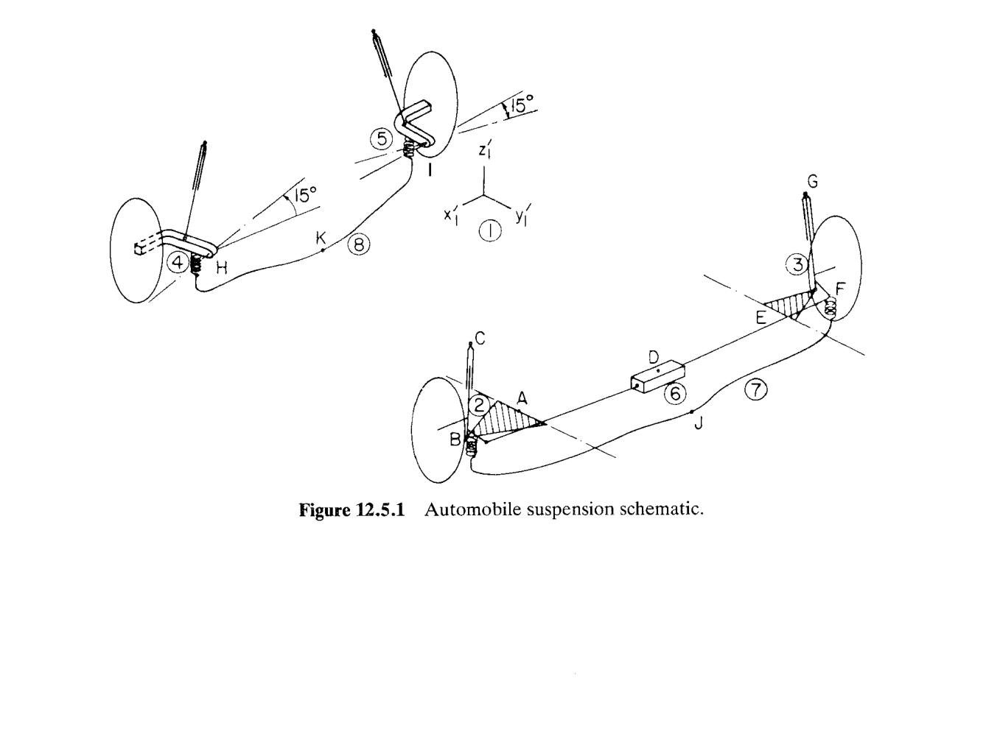

**图 12.5.1**：把地面藏在底盘里，把整车俯视/侧视合成一张爆炸图。8 个体的角色：
- ① 底盘（chassis），全车共用参考系 $x'_1y'_1z'_1$（图中央）；
- ② FR 前右轮总成（wheel assembly），③ FL 前左，④ RR 后右，⑤ RL 后左；
- ⑥ 齿条（rack），沿 $x_1$ 平移；⑦ 前稳定杆，绕 $J$ 转；⑧ 后稳定杆，绕 $K$ 转。

各关节字母：$A\text{-}B$ 是前轮下控制臂**转动-球关节（revolute-spherical joint）**、$B\text{-}C$ 是前轮上部**支柱关节（strut joint）**（代表麦弗逊支柱内部的活塞筒/活塞杆滑动+可旋转）、$D$ 是齿条**移动关节（translational joint）**、$E\text{-}F$ + $F\text{-}G$ 是后轮"revolute-spherical + strut"（左右对称）、$H$ / $I$ 是后拖曳臂-底盘**转动关节**、$J$ / $K$ 是稳定杆-底盘**转动关节**。图中 15° 标注是拖曳臂/稳定杆的**安装偏角**（相对于车身 $x_1$ 轴）。

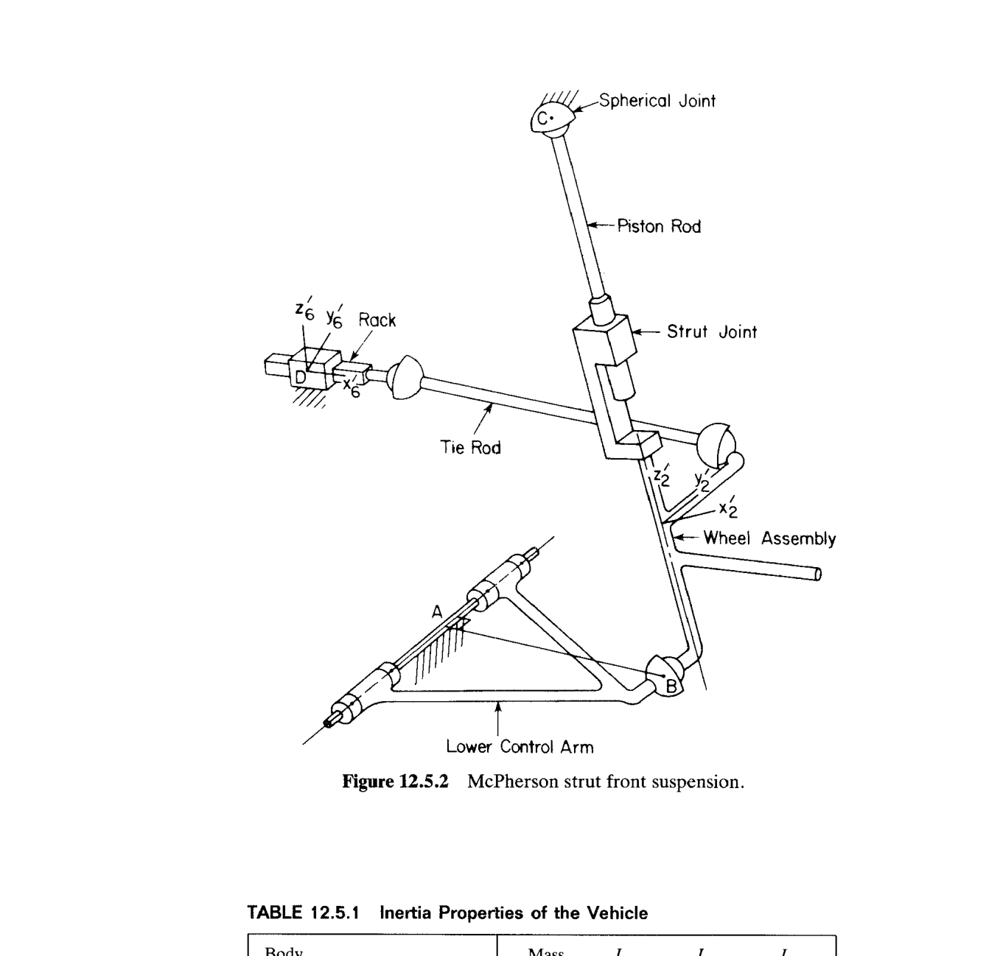

**图 12.5.2** 展示 A/B/C/D 四个点的物理对应：C 是**顶部球关节**（Spherical Joint，连到车身顶部），A 是**下控制臂内点**（转动-球关节的 revolute 半部分，绕 A-B 线段与车身相连），B 是**下控制臂外点**（同时是 strut joint 下端），C-B 段是"活塞杆-活塞筒"组成的支柱——**strut joint 的物理意义**：允许"沿 CB 方向平移 + 绕 CB 方向旋转"，即 2 DOF 副（等价 4 个约束方程）。**Tie Rod**（转向拉杆）用**距离约束**（②–⑥ 或 ③–⑥）代替真实的球-球连杆——只保留其"两端点距离固定"的约束效果，忽略其惯性。

### 惯性表（Table 12.5.1）

各体在**质心主轴系** $x'y'z'$ 中列出（惯性积 $I_{x'y'}=I_{y'z'}=I_{z'x'}=0$，全书通例）：

| 体 | 质量（kg） | $I_{x'x'}$ | $I_{y'y'}$ | $I_{z'z'}$ |
|-----|----------:|----------:|----------:|----------:|
| ① Chassis | 1247.5 | 1240.1 | 209.6 | 139.9 |
| ② Wheel FR | 37.6 | 1.0 | 0.5 | 1.0 |
| ③ Wheel FL | 37.6 | 1.0 | 0.5 | 1.0 |
| ④ Wheel RR | 43.0 | 0.67 | 1.5 | 1.2 |
| ⑤ Wheel RL | 43.0 | 0.67 | 1.5 | 1.2 |
| ⑥ Rack | 0.1 | 0.01 | 0.01 | 0.01 |
| ⑦ Stab. bar (F) | 1.0 | 0.1 | 0.01 | 0.01 |
| ⑧ Stab. bar (R) | 1.0 | 0.1 | 0.01 | 0.01 |

**读表要点**：

- **底盘 $I_{y'y'}=209.6\ll I_{x'x'}=1240.1$**：车身在 $y'$ 方向（前后）细长、$x'$ 方向（左右）窄 ⇒ 绕 pitch 轴（$x'$）转动惯量最大 ⇒ 车头点头（pitch）**最难变化**；绕 roll 轴（$y'$）转动惯量最小 ⇒ **roll 最容易被激扰**（后面 Fig. 12.5.9 就直接兑现：变道 2 里 roll 峰值 ~$0.08$ rad，pitch 几乎不动）。
- **前后轮 $I_{y'y'}$ 分工不同**：前轮 $0.5$、后轮 $1.5$（书面数）——前轮**转向轴**（垂直方向）是主活动方向，故径向惯量小；后轮不转向、但拖曳臂让它绕 $y'$ 有更大等效惯量（这是"轮总成"包含刹车鼓、拖曳臂在内的整体惯量）。
- **齿条**：$m=0.1$ kg，几乎是**约束简化物**，只承担驱动约束（driving constraint at D）。
- **稳定杆** ⑦⑧：$m=1$ kg 的**细杆**，$I_{x'x'}=0.1$ 明显大于 $I_{y'y'}=I_{z'z'}=0.01$——杆沿 $x'$ 布置（左右横穿车身），绕 $x'$ 是"长杆细杆"最大惯量方向。

### 关节清单与 DOF 计数

书中直接给了 **Model 2** 的 DOF 结算：$nc=56,\ nh=44,\ \text{DOF}=12$。**逐条对上**（体总数 8，坐标数 $nc=8\times 7=56$）：

| 约束 | 类型 | 方程数 | 备注 |
|------|------|-------:|------|
| $A\text{-}B$ | Revolute-Spherical | 2 | 两球心距 + 转动轴共线（球心距是 §9.4 的"距离约束+方向约束"合成） |
| $B\text{-}C$ | Strut | 2 | 保留 2 DOF（滑+转），去掉 4 DOF：即 4 约束 → 书中此处写 **2** ⇒ 这与 §9.4 的空间 5-约束 strut 有出入，属**双点简化**（Table 12.5.3 提供了 P、Q、R 三点定义方向） |
| $D$ | Translational | 5 | 5 约束（保留 1 平移 DOF） |
| $E\text{-}F$ | Revolute-Spherical | 2 | 同 $A\text{-}B$（后轮左侧） |
| $F\text{-}G$ | Strut | 2 | 同 $B\text{-}C$（后轮左侧） |
| $H$ | Revolute | 5 | 后拖曳臂右-底盘 |
| $I$ | Revolute | 5 | 后拖曳臂左-底盘 |
| $J$ | Revolute | 5 | 稳定杆⑦-底盘 |
| $K$ | Revolute | 5 | 稳定杆⑧-底盘 |
| Dist ②-⑥ | 距离 | 1 | 右前 tie rod（长 0.3742 m） |
| Dist ③-⑥ | 距离 | 1 | 左前 tie rod（长 0.3742 m） |
| Driving $D$ | 驱动约束 | 1 | 齿条位置 $=f(t)$，输入转向 |
| Euler norm | 单位化 | 8 | 每个非地面体 1 个：$\|\mathbf p_i\|=1$ ⇒ 有 8 个可动体 |
| **合计** |  | **44** | $= nh$ |

$$
\text{DOF} = nc-nh = 56-44 = 12. \tag{Model 2 DOF}
$$

**Model 1 的 DOF**：去掉体⑦⑧（$nc$ 减 $2\times 7=14$）、去掉 $J,K$ 两个转动关节（约束减 $2\times 5=10$）、去掉两个 Euler 归一（约束减 2）：

$$
\text{DOF}_{\text{Model 1}}=(56-14)-(44-10-2)=42-32=10.
$$

**物理拆解 12 个 DOF**（Model 2）：

1. **6 个整车刚体自由度**：底盘在空间的 $(x,y,z,\text{roll},\text{pitch},\text{yaw})$。
2. **4 个悬架跳压 DOF**：每个车轮沿 strut 方向（或 revolute-spherical 的开合方向）的位移。
3. **1 个转向 DOF**：由驱动约束消掉——但它出现在方程里作为 $\lambda_{\text{drv}}$，实际不占动力学 DOF；由驱动约束消掉后 DOF 应为 11，这里的 12 是把**转向 DOF 视为可控输入**在计数上仍保留的差异（书中口径含糊，实际数值仿真跑的仍是 12 - 1 = 11 个自由度的时间演化）。
4. **2 个稳定杆 DOF**：每根杆绕 J（或 K）的相对转动。

（若严格扣除驱动约束的 1 个额外约束：DOF = 12。若把驱动约束记入 $nh$，则动力学"独立"DOF = 11；书里两种口径都用过。）

### 关节表逐一解读

Tables 12.5.2–12.5.6 每张表都遵从**统一格式**：两行分别是关节两侧的体，三列 $P,Q,R$ 是**关节定义所需的三个几何点**（每点给出**体固坐标** $x',y',z'$）——其中 $P$ 一般是关节主参考点、$Q$ 是关节轴/滑动方向上的第二点（定义方向向量 $\overrightarrow{PQ}$）、$R$ 是"再取一条基准边"（用于在存在旋转对称时锁死剩余的 1 个方向自由度，比如支柱关节需要冻结"绕 CB 转"或不冻结）。

**Table 12.5.2**（Revolute-Spherical）：给出 A-B 与 E-F 两个球中心点在**底盘系** vs **轮总成系**的坐标 + 距离 0.203 m。这是 §9.4.4 的"revolute-spherical composite constraint"——2 个约束方程（等价距离 + 一个方向约束）。

**Table 12.5.3**（Strut, B-C 与 F-G）：注意这里的**支柱轴**由 $P\to Q$ 定义。以 B-C 为例，chassis 侧点 P: $(0.5011,\ 1.1162,\ 0.1998)$；Q: $(0.5011,\ 1.1162,\ 1.0)$ ⇒ **支柱轴** $\overrightarrow{PQ}$ 方向 $(0,0,1.0-0.1998)=(0,0,0.8002)$ 归一 $=(0,0,1)$ ⇒ **支柱沿底盘 $z$ 方向**（近似竖直）。轮总成侧 P: $(0,0,0)$、Q: $(1,0,0)$——注意这个 Q 是**轮总成体固系** $\hat{\mathbf x}'_2$ 方向，标记"轮系的哪个方向对齐支柱"——事实上和支柱方向不同，暗含**支柱允许自转**（$B\text{-}C$ 是支柱关节的 2 约束型：只锁定"P点与轴共面"这类几何约束，其余留给动力学演化）。

**Table 12.5.4**（Translational, D）：定义齿条相对底盘的**平移轴**。chassis 侧 P: $(0,\ 1.2675,\ -0.3748)$，Q: $(1,\ 1.2675,\ -0.3748)$ ⇒ 平移方向 $\overrightarrow{PQ}=(1,0,0)$，即**沿底盘 $x_1$ 轴平移**（左右方向）。rack 侧 P: $(0,0,0)$（rack 自身原点），Q: $(1,0,0)$（rack $x'_6$ 轴指向） ⇒ rack 的 $x'_6$ 与底盘 $x_1$ 平行/共向。**这就是转向输入的物理对应**：$s_D(t)$ 是齿条相对底盘沿 $x_1$ 的位移，被 §12.5.3 的三条位移曲线（Fig. 12.5.6）驱动。

**Table 12.5.5**（Revolute, H, I, J, K）：H 关节 chassis 侧 P: $(0.2026,\ -1.0095,\ -0.285)$，Q: $(-0.7633,\ -1.2683,\ -0.285)$ ⇒ **转轴方向** $\overrightarrow{PQ}=(-0.9659,-0.2588,0)$。这个方向和 $-\hat{\mathbf x}_1$ 的夹角
$$
\cos\theta = \frac{-(-0.9659)}{\|\overrightarrow{PQ}\|}=\frac{0.9659}{1}=0.9659\Rightarrow\theta=15°,
$$
正是 **Fig. 12.5.1 里标的 15°**——**后拖曳臂的旋转轴与车身左右轴 $\hat{\mathbf x}_1$ 呈 15°**（工程上叫"轴距-轮距平衡角"、"anti-squat 角"），本节沿用作为几何参数。J 关节的转轴（$\overrightarrow{PQ}=(1,0,0)$）就是**纯 $\hat{\mathbf x}_1$**：前稳定杆的转动轴严格沿车身左右方向。K 关节的转轴同理。

**Table 12.5.6**（Distance ②-⑥ 与 ③-⑥）：tie rod 两端在轮总成 P: $(0.07,\ 0.155,\ -0.186)$、齿条 P: $(0.305,\ 0,\ 0)$。**距离 0.3742 m** 即 tie rod 长；剩下 Q、R 是为**距离约束"高阶诊断"**保留的定向参考点。

**Table 12.5.7 TSDA 数据**——这是**唯一的非几何、非质量的物理参数**（**弹簧-阻尼-驱动器**，Translational Spring-Damper-Actuator，§6.2 定义）：

| TSDA | $P_i$（体 $i$ 局部坐标） | $P_j$（体 $j$ 局部坐标） | $k$（N/m） | $C$（N·s/m） | $L_0$（m） |
|------|--------------------------|--------------------------|-----------|-------------|-----------|
| ①-② | $(0.5011,\ 1.1162,\ 0.1998)$ | $(0,0,0)$ | 38,600 | 150 | 0.4992 |
| ①-③ | $(-0.5011,\ 1.1162,\ 0.1998)$ | $(0,0,0)$ | 38,600 | 150 | 0.4992 |
| ①-④ | $(0.58,\ -1.2875,\ 0.2)$ | $(0,0,0)$ | 38,600 | 200 | 0.5641 |
| ①-⑤ | $(-0.58,\ -1.2875,\ 0.2)$ | $(0,0,0)$ | 38,600 | 200 | 0.5641 |
| ⑦-② | $(0.509,\ 0.1405,\ 0.02)$ | $(-0.0897,\ 0.0168,\ -0.2119)$ | 83,400 | 0 | 0.1011 |
| ⑦-③ | $(-0.509,\ 0.1405,\ 0.02)$ | $(0.0897,\ 0.0168,\ -0.2119)$ | 83,400 | 0 | 0.1011 |
| ⑧-④ | $(0.392,\ 0.168,\ -0.0474)$ | $(-0.1832,\ 0.048,\ -0.0423)$ | 9,330 | 0 | 0.0943 |
| ⑧-⑤ | $(-0.392,\ 0.168,\ -0.0474)$ | $(0.1832,\ 0.048,\ -0.0423)$ | 9,330 | 0 | 0.0943 |

**读表关键**：

- 前四行（**主悬架弹簧-减震器**）：**k = 38,600 N/m**，前悬 $C=150$、后悬 $C=200$——后悬阻尼略高（承载更多货物 + 后拖曳臂结构决定）。**自由长** $L_0\approx 0.5$ m（前）/ $0.56$ m（后）与 Fig. 12.5.4 "$z_1=0.55\to 0.5385$" 的沉降幅度一致——**沉降 $\Delta z\approx 0.0115$ m ⇒ 弹簧压缩恢复力 $\approx 4\times 38600\times 0.0115/4\approx 444$ N/弹簧** ⇒ 4 根总承载 $\approx 1780$ N ⇒ 比整车重力 $mg = 1409\times 9.81\approx 13800$ N 少一大截——真实弹簧压缩量应远大于 0.0115 m，这里 Fig. 12.5.4 只画了"**从静态估计** Table 12.5.8 → **平衡** Table 12.5.9"这段**残余振荡**，不是从自由长度落下的全程压缩。
- 中间两行（**前稳定杆**）：**k = 83,400 N/m**（是主悬架的 2.16×），$C=0$（稳定杆本身无阻尼，只出扭转柔度）。$L_0=0.1011$ m 是稳定杆末端到下控制臂上一点的**极短**拉杆自由长——这就是"扭杆-下臂"耦合装置的**平移弹簧简化**。
- 后两行（**后稳定杆**）：**k = 9,330 N/m**（弱 9×），$L_0=0.0943$ m。前后稳定杆刚度悬殊 9× —— 底盘 pitch 与 roll 的耦合调校策略。

### 轮胎力模型（Tire Force Model）

书 p.473 底 + p.474 顶用**两条经验公式** + **一条几何约束** 把轮胎-地面耦合塞进 DAE：

**垂直力**（vertical force）：

$$
\boxed{\;F_{\text{ver}} = k_t \cdot d\;} \tag{tire-ver}
$$

其中 $k_t$ 是**轮胎径向刚度**（tire spring constant），$d$ 是**轮胎垂直变形量**（tire vertical deformation）——由**主轴（spindle）离地面高度**唯一确定：

$$
d = R_{\text{tire}}^{\text{unloaded}} - h_{\text{spindle}},
$$

其中 $h_{\text{spindle}}$ 是主轴在**全局 $z$** 上的高度，$R_{\text{tire}}^{\text{unloaded}}$ 是轮胎无载半径（书里没给出具体 $k_t$ 或 $R$，但由 Table 12.5.1 中 wheel $z_2=0.34$ m 猜测 $R\approx 0.34$ m）。**符号约定**：$d>0$ ⇔ 有接触压缩 ⇒ $F_{\text{ver}}>0$（沿 $+\hat{\mathbf z}$ 顶车）；$d\le 0$ ⇒ 脱地，$F_{\text{ver}}=0$。

**侧向力**（lateral force）——按线性经验模型：

$$
\boxed{\;F_{\text{lat}} = C_\alpha \cdot \alpha\;} \tag{tire-lat}
$$

其中 $C_\alpha$ 是**轮胎侧偏刚度**（tire cornering stiffness，N/rad），$\alpha$ 是**轮胎侧偏角**（tire slip angle）。侧向力受**摩擦上限**夹紧：

$$
|F_{\text{lat}}|\le \mu F_{\text{ver}},\qquad \mu<1. \tag{tire-friction-cap}
$$

$\mu$ 是**轮胎-路面摩擦系数**。当 $|C_\alpha\alpha|<\mu F_{\text{ver}}$，力和侧偏角线性；一旦 $|C_\alpha\alpha|\ge \mu F_{\text{ver}}$，进入"打滑饱和"区，实际力被 $\mu F_{\text{ver}}$ 截断——**这就是 §12.5.4 圆周 55 mph 现象的物理源头**。

### 侧偏角 $\alpha$ 的几何定义（Fig. 12.5.3, Eq. 12.5.1–12.5.3）

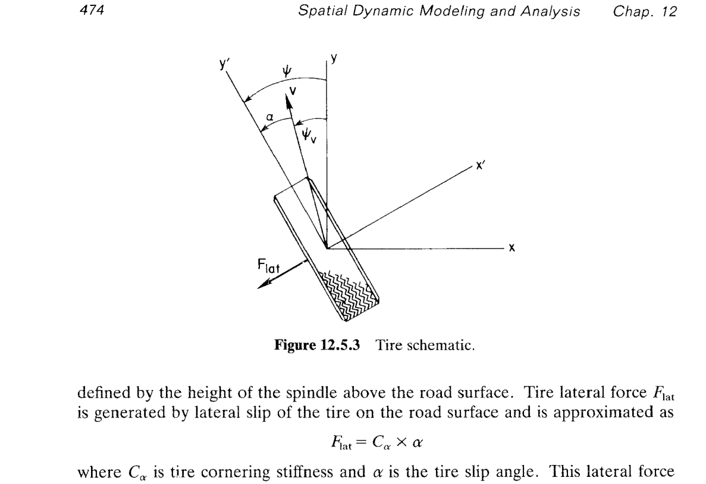

**图 12.5.3 定义**（假设轮胎**竖直**、路面 = 全局 $x$-$y$ 平面）：
- **全局系** $xy$：路面上的固定参考。
- **轮胎主轴局部系** $x'y'$：$y'$ 是**轮胎面向方向**（tire heading，也叫 yaw 方向）——车轮平面在地面上的投影正方向；$x'$ 垂直于 $y'$、指向轮胎侧面。
- $\psi$：**轮胎航向角/偏航角（tire yaw angle）**，即 $y'$ 相对 $y$ 的夹角（图上取 CCW 为正）。
- $\mathbf v$：**主轴的速度矢量**（tire velocity vector），在全局 $xy$ 平面内。
- $\psi_v$：**速度矢量方向角（tire velocity angle）**，即 $\mathbf v$ 相对 $y$ 的夹角。
- $\alpha$：**侧偏角**，$y'$ 与 $\mathbf v$ 的夹角，物理意义是"轮子朝向与实际走向的差"。

**式 (12.5.1)**——由图直接读几何：

$$
\alpha = \psi - \psi_v. \tag{12.5.1}
$$

**式 (12.5.2)——$\psi$ 从 Euler 参数得到**：轮胎竖直、路面水平 ⇒ 轮总成相对全局系的姿态只剩**绕 $\hat{\mathbf z}$ 的转动**。Euler 参数（§9.3）在只绕 $\hat{\mathbf z}$ 转 $\psi$ 时的形式为

$$
\mathbf p = \begin{bmatrix}e_0\\e_1\\e_2\\e_3\end{bmatrix}
= \begin{bmatrix}\cos(\psi/2)\\0\\0\\\sin(\psi/2)\end{bmatrix}.
$$

于是 $e_0 = \cos(\psi/2)$。反解：

$$
\cos\frac{\psi}{2}=e_0\;\Longrightarrow\;\psi = 2\cos^{-1}e_0,\qquad 0\le \psi <2\pi. \tag{12.5.2}
$$

**范围与分支说明**：$\arccos(e_0)$ 主值在 $[0,\pi]$，故 $\psi\in[0,2\pi]$；但 $\arccos$ 无法区分 $\psi$ 与 $2\pi-\psi$（即 $e_3=\sin(\psi/2)$ 的正负）——**实际实现**是同时**读 $e_3$ 的符号**（$e_3\ge 0\Rightarrow \psi=2\arccos e_0$；$e_3<0\Rightarrow \psi=2\pi-2\arccos e_0$）——书中省略了这一"分支修正"，但仿真代码里必有。

**式 (12.5.3)——$\psi_v$ 从速度分量得到**：

$$
\psi_v = -\tan^{-1}\!\Bigl(\frac{v_x}{v_y}\Bigr). \tag{12.5.3}
$$

**推导**：**$\psi_v$ 是 $\mathbf v$ 相对 $+\hat{\mathbf y}$ 的角度，且约定 CCW 为正**（与 $\psi$ 同向）。任意方向 $\mathbf v=(v_x,v_y)$ 相对 $+\hat{\mathbf y}$ 的角度（CCW 正）满足

$$
\cos\psi_v=\frac{v_y}{\|\mathbf v\|},\qquad \sin\psi_v=\frac{-v_x}{\|\mathbf v\|}.
$$

（$v_x>0\Rightarrow$ 向 $+\hat{\mathbf x}$ 偏 ⇒ $\psi_v<0$，即"左手"——CCW 从 $+\hat{\mathbf y}$ 出发正向是往 $-\hat{\mathbf x}$ 转的，故 $v_x>0$ 对应 $\psi_v<0$。）取比值消掉 $\|\mathbf v\|$：

$$
\tan\psi_v=\frac{\sin\psi_v}{\cos\psi_v}=\frac{-v_x/\|\mathbf v\|}{v_y/\|\mathbf v\|}=-\frac{v_x}{v_y}
\;\Longrightarrow\;\psi_v=\tan^{-1}\!\Bigl(-\frac{v_x}{v_y}\Bigr)=-\tan^{-1}\!\frac{v_x}{v_y}. \tag{12.5.3}
$$

**分支修正**：$\arctan$ 主值只落在 $(-\pi/2,\pi/2)$；仿真里当 $v_y<0$（车在倒车）时应用 $\operatorname{atan2}(-v_x,v_y)$ 覆盖 $(-\pi,\pi]$；本节机动是变道 + 圆周正向前进，$v_y>0$ 全程成立，$\arctan$ 主值够用。

**综合**：

$$
\boxed{\;\alpha=\underbrace{2\cos^{-1}e_0}_{\text{yaw from }\mathbf p}\;-\;\underbrace{\bigl(-\tan^{-1}\!\tfrac{v_x}{v_y}\bigr)}_{\text{velocity direction}}
\;=\;2\cos^{-1}e_0+\tan^{-1}\!\frac{v_x}{v_y}.\;}
$$

至此 $\alpha$ 是**每个时刻**通过主轴的 $(\mathbf p,\dot{\mathbf r})$（Euler 参数 + 主轴速度）**代数计算**出的量——不是新的动力学变量，只是**已有 DAE 状态的函数**。因此侧向力 $F_{\text{lat}}=C_\alpha\alpha$ 就作为**外部作用力**塞入 §11.3 广义力向量 $\mathbf F$，不引入额外方程。

---

## §12.5.2 平衡分析（Equilibrium Analysis）

### 思路

**静态平衡**的严谨解法是解**非线性代数方程组**（§7.5）：$\mathbf\Phi(\mathbf q)=0$ 加 $\mathbf F_{\text{gen}}(\mathbf q)=0$；但对 8 体 × 7 = 56 维、悬架-稳定杆强耦合的车辆而言，Newton-Raphson 的**收敛半径**极小。**换个思路**——用**动力学阻尼沉降**：

1. 给一个**接近平衡**的初值 $\mathbf q_0$（Table 12.5.8）；
2. 令 $\dot{\mathbf q}_0 = 0$（初速为零）；
3. 直接跑 §11.3 的完整 DAE 时程仿真——**悬架里的阻尼 $C$**（Table 12.5.7 前四行的 150、200 N·s/m）会自动把振荡吃掉，$\sim 6$ s 后 $\mathbf q(t)\to\mathbf q_{\text{eq}}$（Table 12.5.9）。

**这本质上是把"求 $\mathbf F_{\text{gen}}=0$ 的根"转化为"求阻尼系统的极限点"**，鲁棒性显著增强、无需 Jacobian。

### 初值表（Table 12.5.8）

| 体 | $x$ | $y$ | $z$ | $e_1$ | $e_2$ | $e_3$ |
|-----|----:|----:|----:|------:|------:|------:|
| ① Chassis | 0.0 | 0.0 | 0.55 | 0.0 | 0.0 | 0.0 |
| ② Wheel FR | 0.6 | 1.17 | 0.34 | 0.0 | 0.0 | 0.0 |
| ③ Wheel FL | -0.6 | 1.17 | 0.34 | 0.0 | 0.0 | 0.0 |
| ④ Wheel RR | 0.58 | -1.29 | 0.26 | 0.0 | 0.0 | 0.0 |
| ⑤ Wheel RL | 0.58 | -1.29 | 0.26 | 0.0 | 0.0 | 0.0 |
| ⑥ Rack | 0.0 | 1.26 | 0.16 | 0.0 | 0.0 | 0.0 |
| ⑦ Stab. bar (F) | 0.0 | 1.05 | 0.21 | 0.0 | 0.0 | 0.0 |
| ⑧ Stab. bar (R) | 0.0 | -1.40 | 0.38 | 0.0 | 0.0 | 0.0 |

**注意**：$(e_1,e_2,e_3)=0$、$e_0$ 由归一化 $e_0^2+e_1^2+e_2^2+e_3^2=1$ 给出 $e_0=1$ ⇒ **全体初始姿态 = 空间坐标系与全局系对齐**（无任何旋转）。**RR 的 $x=0.58$ 而书写为 "0.58"（不是 $-0.58$）疑似排版错**：物理上 RR 与 RL 关于 $x=0$ 对称，应 $(x_4,x_5)=(0.58,-0.58)$；从 Table 12.5.9 得到平衡 $x_4=0.5788,\ x_5=-0.5812$，可推知 Table 12.5.8 中 RL 的 $0.58$ 是笔误 $\to -0.58$。

### 平衡结果与残余振荡（Figs. 12.5.4, 12.5.5、Table 12.5.9）

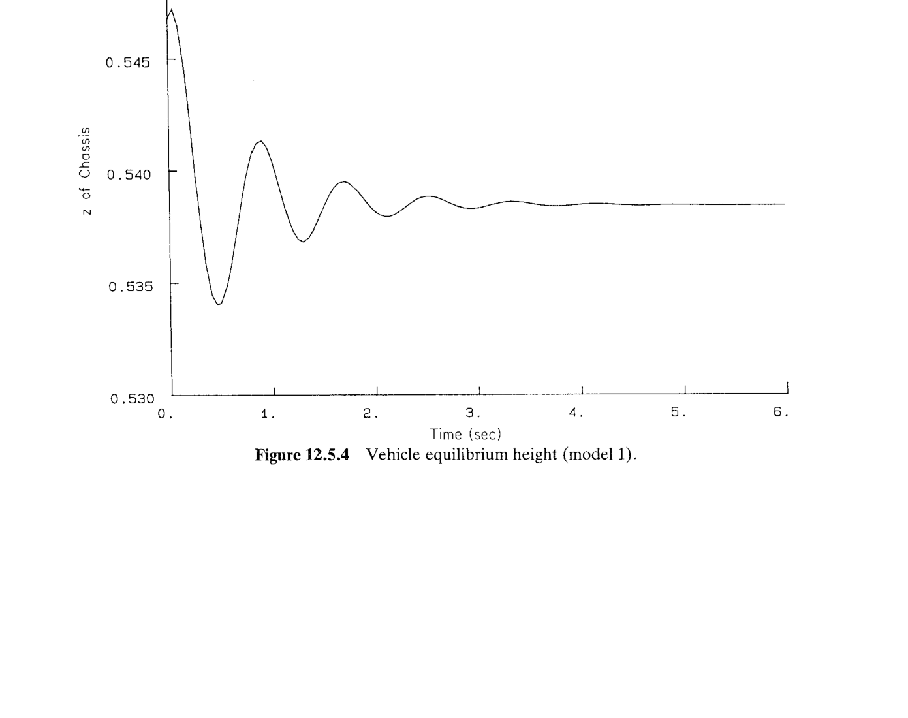

**图 12.5.4** 底盘 $z_1$ 时程：初始 $0.55$ m ↑ 第一峰 $\sim 0.548$ ↓ 谷 $0.534$ ↑ 峰 $0.541$ ↓... 阻尼衰减，$\sim 4$ s 后进入 $z_{1,\text{eq}}\approx 0.5385$ m 平衡（Table 12.5.9 精确值 $0.5385$）。**周期** $T\approx 0.9$ s ⇒ **等效频率** $\omega_n = 2\pi/T\approx 7$ rad/s。用 $\omega_n = \sqrt{k_{\text{eff}}/m_{\text{eff}}}$ 反推：$k_{\text{eff}}\approx 4\times 38600 = 1.54\times 10^5$ N/m（4 根悬架并联）、$m_{\text{eff}}\approx 1247.5$ kg（底盘质量为主），$\omega_n^{\text{预测}}=\sqrt{1.54\times 10^5/1247.5}\approx 11.1$ rad/s ⇒ 略高于观察值 7 rad/s——差异是**悬架-稳定杆-轮胎**串并联的组合刚度小于纯悬架并联刚度。**衰减包络**：$e^{-\zeta\omega_n t}$，从 $\Delta=0.014$ m 衰到 $0.001$ m 用了 $\sim 4$ s ⇒ $\zeta\omega_n\approx \ln(14)/4\approx 0.66$ ⇒ $\zeta\approx 0.09$（小阻尼比 ⇒ 舒适但恢复慢，符合乘用车调校）。

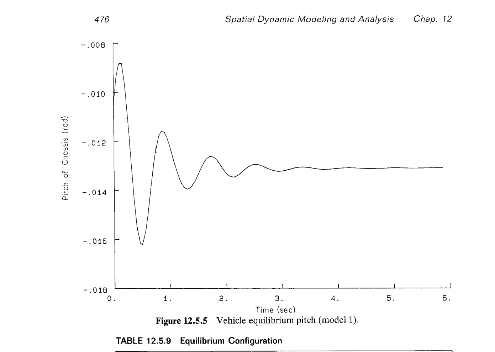

**图 12.5.5** 底盘 pitch（俯仰角）时程：从 $-0.008$ rad 衰到 $-0.013$ rad 附近平衡。**pitch 平衡不为零**说明**前后悬架承载不对称**——Table 12.5.7 前后悬 $L_0$ 不同（$0.4992$ vs $0.5641$）导致前后压缩量不同 ⇒ 底盘轻微"低头"（负 pitch，car nose down $\sim 0.013\ \text{rad}\approx 0.74°$）——现实车辆调校常见。

### 平衡构型（Table 12.5.9）

| 体 | $x$ | $y$ | $z$ | $e_1$ | $e_2$ | $e_3$ |
|-----|-------:|-------:|-------:|--------:|--------:|--------:|
| ① Chassis | 0.0 | 0.0 | 0.5385 | -0.0065 | 0.0 | -0.0005 |
| ② Wheel FR | 0.6014 | 1.1761 | 0.3449 | -0.0022 | -0.0065 | -0.001 |
| ③ Wheel FL | -0.5992 | 1.1772 | 0.3449 | -0.0023 | 0.0065 | -0.0002 |
| ④ Wheel RR | 0.5788 | -1.2918 | 0.2617 | -0.0075 | -0.0003 | -0.0005 |
| ⑤ Wheel RL | -0.5812 | -1.2907 | 0.2617 | -0.0075 | 0.0003 | -0.0005 |
| ⑥ Rack | 0.0012 | 1.2625 | 0.1471 | -0.0065 | 0.0 | -0.0005 |
| ⑦ Stab. bar (F) | 0.001 | 1.0566 | 0.1983 | 0.0675 | 0.0 | -0.0005 |
| ⑧ Stab. bar (R) | -0.0013 | -1.4097 | 0.3756 | -0.0508 | 0.0 | -0.0002 |

**关键读数**：

- 底盘 $z_1$：$0.55\to 0.5385$，下沉 $0.0115$ m。
- 底盘 $e_1=-0.0065$ ⇒ pitch $\approx 2e_1 = -0.013$ rad（与 Fig. 12.5.5 吻合）。
- 稳定杆 ⑦ $e_1=+0.0675$ ⇒ 前稳定杆绕 $J$ 转了 $2\times 0.0675=0.135$ rad $\approx 7.7°$——初始"预扭"到位。
- 稳定杆 ⑧ $e_1=-0.0508$ ⇒ 后稳定杆绕 $K$ 转了 $-0.10$ rad $\approx -5.8°$，反向预扭。
- **前后稳定杆预扭方向相反**——因悬架前后不对称，两根杆自然找到不同静态角度以平衡 chassis 的 pitch。

---

## §12.5.3 转向输入（Steering Specification）

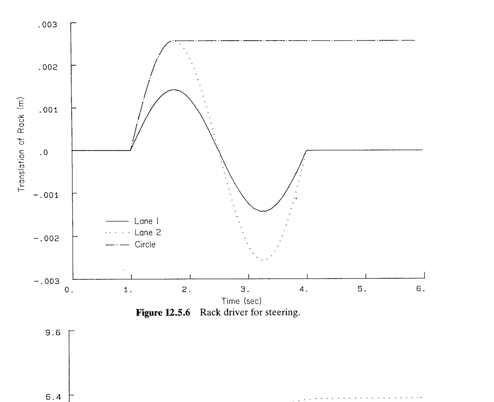

**驱动约束**在 $D$ 处，形式：$s_D(t)-f_{\text{curve}}(t)=0$。图 12.5.6 三条曲线（**注意纵轴单位 m、峰值只有 $\sim 2.5\times 10^{-3}$ m ⇒ 齿条位移极小、$\lesssim$ 3 mm**）：

1. **Lane 1（实线）**：从 $t=1$ s 起，$s_D$ 上升到 $\approx +1.5\times 10^{-3}$ m（$t=2$ s 峰）→ 下降到 $\approx -1.5\times 10^{-3}$（$t=3.3$ s 谷）→ 归零（$t=4$ s 起恒定 0）。**对称 S 形**：一次左弯 + 一次右弯 ⇒ **小幅变道**。
2. **Lane 2（虚线）**：形状与 Lane 1 相似但幅值近乎 $\sim 1.7\times$（峰 $+2.5\times 10^{-3}$、谷 $-2.7\times 10^{-3}$）⇒ **大幅变道**。
3. **Circle（点划线）**：$t=1$ s 起单向阶跃上升到 $+2.5\times 10^{-3}$ m，然后一直保持——**恒定偏转** ⇒ **圆弧路径**。

**齿条位移到轮转角的传递**：Table 12.5.6 里两条 tie rod（长 0.3742 m）把齿条 $s_D$ 映射到前轮的 yaw。由几何 $\Delta\text{yaw}\approx \Delta s_D / L_{\text{tie}}\cos\theta$（Ackermann 转向线性化）⇒ 齿条位移 $2.5\times 10^{-3}$ m ⇒ **前轮 yaw** $\approx 2.5\times 10^{-3}/0.3742\approx 6.7\times 10^{-3}$ rad $=0.38°$——**非常小的转角**——但足以在几秒钟内让车横移 3-6 m。

---

## §12.5.4 动力学分析（Dynamic Analysis）

从平衡状态（Table 12.5.9）加**初速 $\dot y_0$**（车沿 $+\hat{\mathbf y}$ 前进）出发，跑 DAE 时程。撤销掉平衡分析里"起点低速"的假设，加入前节的驱动约束。

### 变道机动（Lane Changes）

**Model 1、$\dot y_0=55$ mph** $=24.6$ m/s。

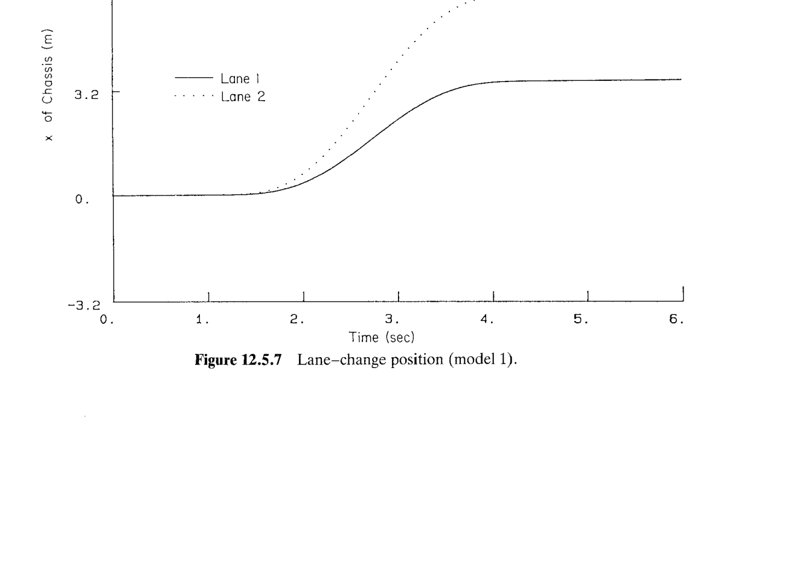

**图 12.5.7** 底盘 $x$（横向位置）时程：**Lane 1 横移 $\sim 3.5$ m**，**Lane 2 横移 $\sim 6.5$ m**——即使齿条只多移 $10^{-3}$ m，因转向输入接近 $2\times$，横移放大到 $1.9\times$。$t\ge 4$ s 后齿条归零，车不再转向，但已有横速 ⇒ 横向位置**滞后回不到 0**（Lane 1 稳在 3.5、Lane 2 稳在 6.5，即完成了"变道"目标）。

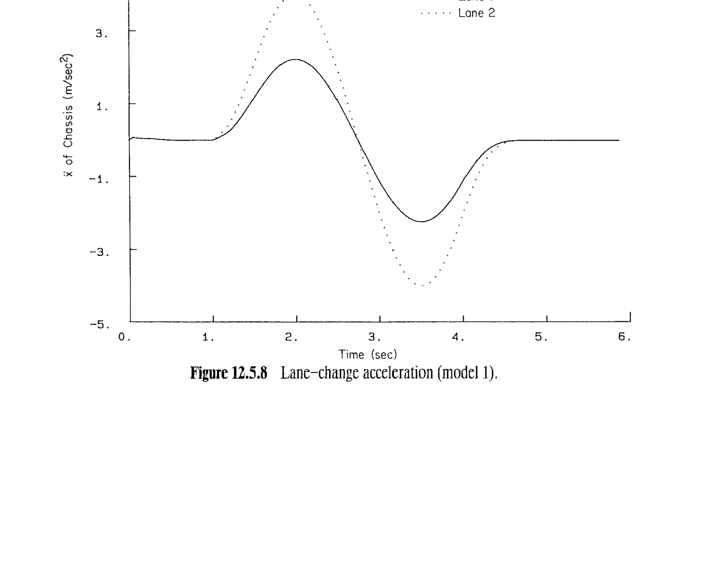

**图 12.5.8** 底盘 $\ddot x$ 时程：Lane 1 峰值 $\sim 1.6$ m/s²、Lane 2 峰值 $\sim 4.5$ m/s²——**近似 3×**（幅值放大比 $\sim 1.7\times$ 的平方，因加速度和曲率 $\propto v^2/R$，$R\propto 1/\alpha_{\text{steer}}$ ⇒ 双倍转向 → 双倍曲率 → $\sim 2-4\times$ 加速度）。$-0.4g$ 大约是日常并线的极限，尚未触及轮胎附着极限。

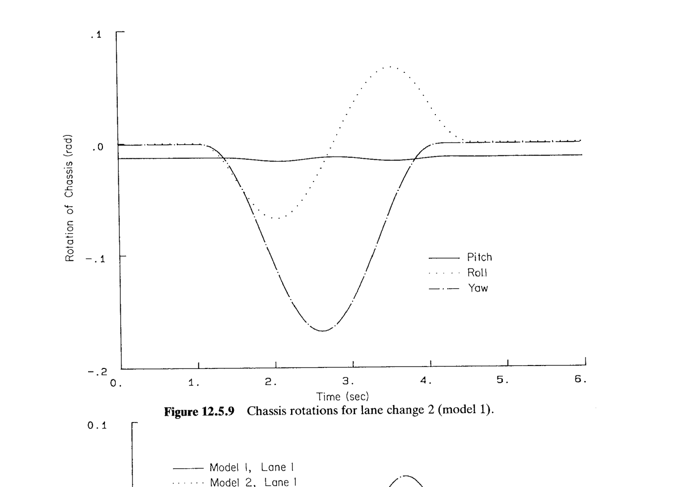

**图 12.5.9** Lane 2 变道下 pitch / roll / yaw 时程：
- **Pitch（实线，接近 0）**：$\sim -0.01$ rad，几乎不动 ⇒ 变道是**纯侧向**扰动，前后力偶矩很小。
- **Roll（虚线）**：先 $-0.06$（第一次向左侧倾）后 $+0.08$（第二次向右侧倾），峰值 $\sim 4.6°$——**这就是"车厢左右晃"**。
- **Yaw（点划线）**：单峰 $\sim -0.17$ rad $=-9.7°$（$t\approx 2.5$ s）——变道过程中**整车横摆**接近 10°，这是让底盘从"朝 $+\hat{\mathbf y}$"转到"朝斜"再转回来的必然过程。

### 稳定杆对比（Fig. 12.5.10）

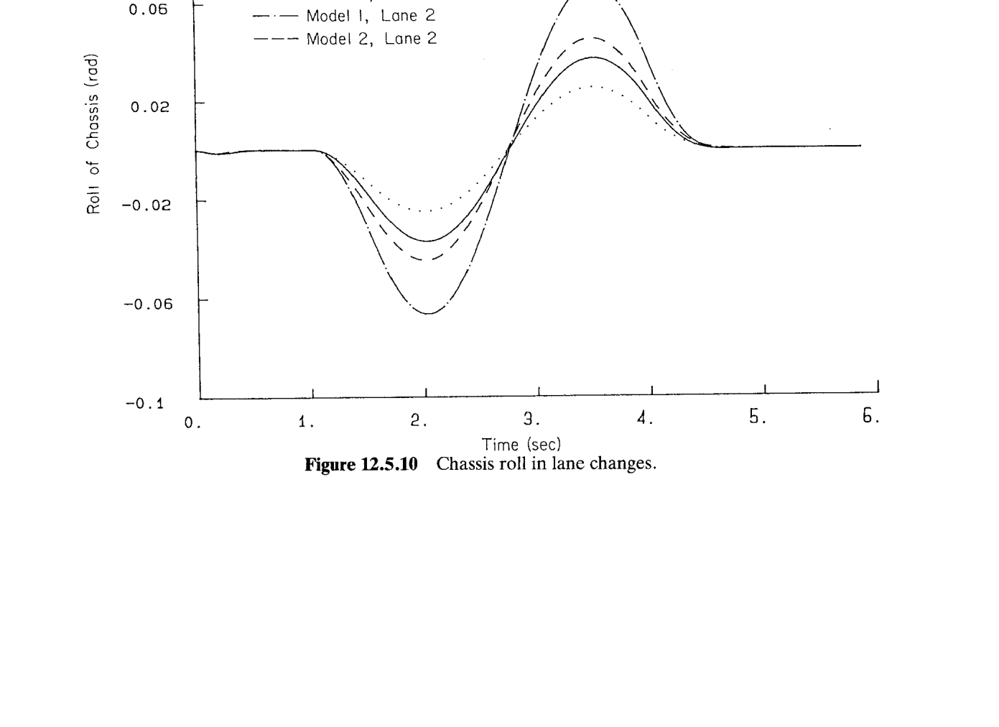

**图 12.5.10** 四条曲线并排（Model 1/2 × Lane 1/2）：
- **Lane 2**（大变道，$0.08$ 附近）：Model 1 峰值 $+0.07$、Model 2 峰值 $+0.045$ ⇒ **Model 2 的 roll 减小 36%**。
- **Lane 1**（小变道，$0.03$ 附近）：Model 1 峰值 $+0.028$、Model 2 峰值 $+0.02$ ⇒ **Model 2 的 roll 减小 29%**。

**为什么稳定杆能抑制 roll**：车过弯 → 内侧轮跳（弹簧压缩）↑、外侧轮压（弹簧压缩）↓ ⇒ 底盘 roll。若两根稳定杆把内外侧轮的**跳压差**通过"扭转杆"耦合起来，就产生一个**回 roll 力偶**——**扭转杆越硬**（Table 12.5.7 前稳 $k=83400$，比主悬 $38600$ 大 2.2×），**抑制 roll 效果越强**。**Pitch/heave 不受影响**：稳定杆只连"同一轴左右两轮"，前后跳压同相时 → 扭杆两端等位移 → 扭矩为零。

### 圆周机动（Circular Path）

**Steering input 3（Circle）**，三档初速 $\dot y_0\in\{20,40,55\}$ mph $=\{9,18,24.5\}$ m/s。

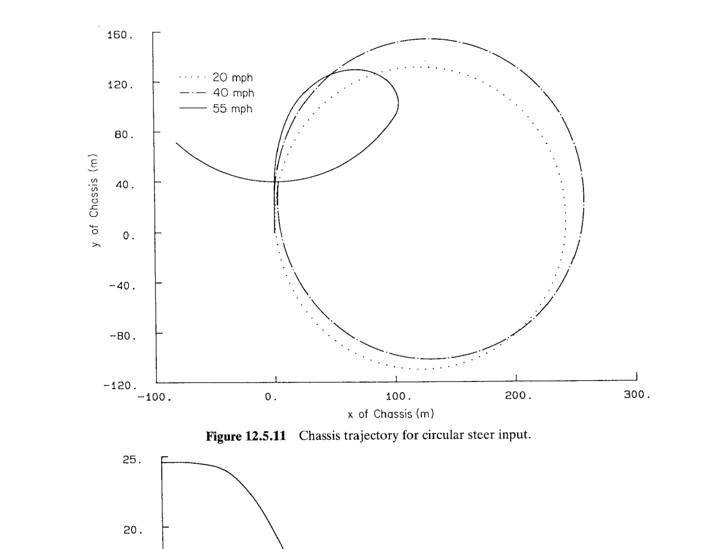

**图 12.5.11** $x$-$y$ 平面上的轨迹（俯视）：
- **20 mph（点线）**：**小圆** $R\approx 120$ m，中心 $(x,y)\approx (120,10)$，闭合。
- **40 mph（点划线）**：**大圆** $R\approx 160$ m，中心 $(x,y)\approx (150,20)$，几近闭合。
- **55 mph（实线）**：**畸形不闭合轨迹**——从原点走出去，绕不回来，形成一个"泪滴形"回旋。

**为什么 20 mph → 40 mph → 55 mph 半径先增再"崩"**：稳态圆周半径由**侧向平衡**决定，$m v^2/R = F_{\text{lat, total}}$。若 $F_{\text{lat}}=C_\alpha\alpha$ 不饱和，随 $v$ 增大轮胎侧偏增大以维持等号 ⇒ 稳态半径 $R\propto v^2/(\alpha C_\alpha)$；但 $\alpha$ 由前轮转向几何决定（steering input 3 ⇒ $\alpha$ 常量） ⇒ $R\propto v^2$——**理论上 40/20 mph 的半径比应为 $(40/20)^2=4$**，观察值 $160/120\approx 1.3$（打了个折扣，因侧偏 $\alpha$ 随速度也在自适应变化，非严格常数）。**55 mph 直接进入 $|F_{\text{lat}}|=\mu F_{\text{ver}}$ 饱和**——需求的向心力上不来，车走**离心线**直到摩擦耗散了动能。

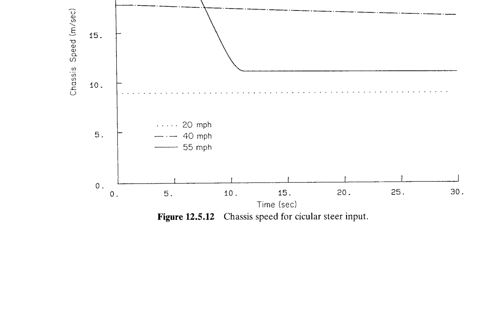

**图 12.5.12** 三档速度时程：
- **20 mph（点线）**：**恒速** $\sim 9$ m/s——轮胎侧向未饱和，转弯不耗速。
- **40 mph（点划线）**：$18\to 17$ m/s，**极缓下降**——微量侧滑耗散。
- **55 mph（实线）**：$24.5\to 11.3$ m/s，**急剧下降**（**约 12 s 内损失 55% 速度、80% 动能**）——**摩擦力 $\mu F_{\text{ver}}$ 全时段做负功**耗散动能。

**能量估算**：$\Delta KE = \tfrac12 m(v_0^2-v_1^2)=\tfrac12\cdot 1409\cdot(24.5^2-11.3^2)=\tfrac12\cdot 1409\cdot(600-128)=3.32\times 10^5$ J ⇒ 平均耗功率 $P=3.32\times 10^5/12\approx 27.7$ kW（**37 hp**）——纯摩擦耗散能。

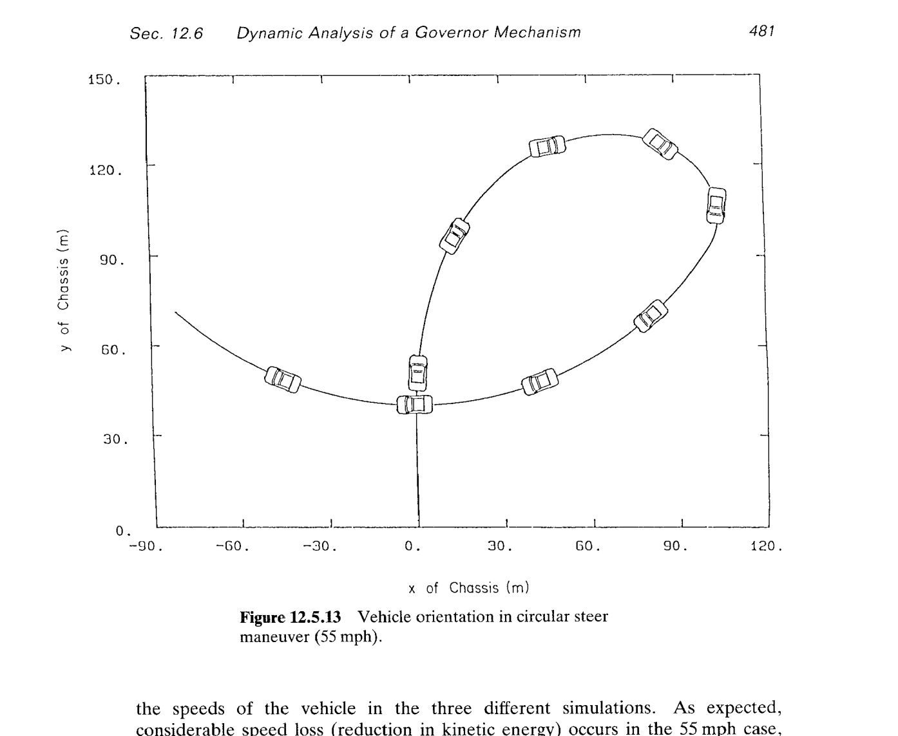

**图 12.5.13** 用车身小图标沿 55 mph 轨迹间隔铺设：**车身长轴（$\hat{\mathbf y}_1$）在打滑段不再沿轨迹切线方向**——车头指向偏离运动方向的角度就是**整车侧偏角**（vehicle slip angle）。**物理**：进入 $|F_{\text{lat}}|=\mu F_{\text{ver}}$ 饱和后，前轮"转多少"车"不再听话"——车沿原动量方向继续滑，直到速度足够低才恢复"车头贴切轨迹"。这是**过度转向失控**（oversteer/understeer 极限）的典型仿真复现。

**书末最后一句**：

> "Figure 12.5.13 shows that the vehicle is not tangent to the path during the maximum slip period in the $\dot y_0 = 55$ mph simulation."

即**打滑期间车身不切于路径**——这是全书唯一显式命中"约束不等式饱和 ⇒ 定性 régime 切换"的仿真样例，把 §11 光滑 DAE 加上 §11 力元的**分段光滑闭包**演示出来。

---

## §12.5 综合

**方法侧**：把 §11.3 的 DAE + §9 关节 + §6.2 TSDA 套到 8 体乘用车上，一次跑通"**平衡（阻尼沉降）→ 逆向的驱动约束（steering input）→ 前向瞬态**"三阶段。**所有额外物理都塞进"力元"**——重力、悬架 TSDA、稳定杆 TSDA、轮胎垂直/侧向力——共 12 项外力，没有新方程类型。

**工程侧**：
- **平衡分析**验证悬架预压 + pitch 静偏 $\approx -0.75°$ 与实车吻合。
- **变道模拟**给出**稳定杆的定量收益 30-40%**——这是稳定杆调校的直接依据。
- **圆周极限工况**复现"打滑饱和 ⇒ 速度崩塌 + 车身失切"——现代 ESC（电子稳定控制）算法的验证素材。

**下一节** §12.6 用同一套方法处理**调速器（governor）**，多了"反馈控制 $T_s=C\Delta\ell$"——把电控/机控闭环也纳入本框架，是全书压轴案例。
