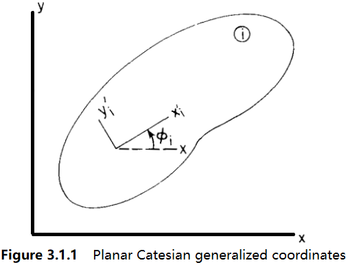
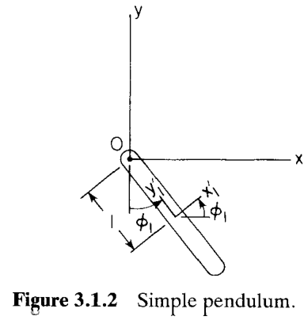
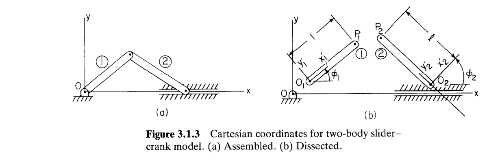
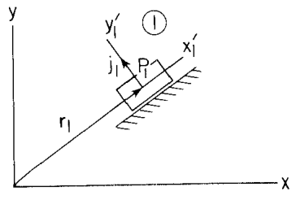
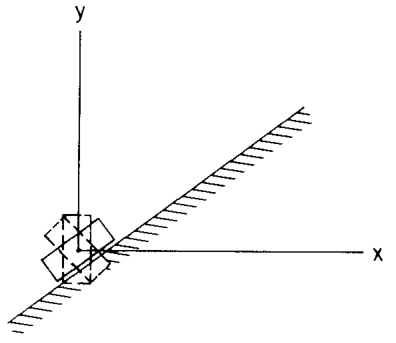

# 3.1 平面笛卡尔运动学：基本概念

> 来源：*Computer Aided Kinematics and Dynamics of Mechanical Systems, Vol. 1*，第 3 章，3.1 节（书页 48–57）。
> 本文以"文字讲解 + 逐式详细推导"组织，公式推导不跳步骤；例题保留完整推导。

---

## 引言：本节要解决什么

第 2 章给了平面向量、矩阵、坐标变换矩阵 $\mathbf{A}(\phi)$ 和矩阵微积分记号 $\boldsymbol{\Phi}_\mathbf{q}$ 等数学工具。本节是**全书方法论的奠基节**，用最简单的机构（单摆、曲柄滑块、斜滑块）把"计算机辅助运动学分析"的整套套路完整演示一遍。主线逻辑是：

1. 选一套**笛卡尔广义坐标** $\mathbf{q}_i=[x,y,\phi]_i^T$ 描述每个刚体的构型；
2. 把物理关节（joint）约束写成**约束方程** $\boldsymbol{\Phi}^K(\mathbf{q},t)=\mathbf{0}$（强调：约束方程必须**唯一确定**关节的几何，否则会出现约束失效）；
3. 加上**驱动约束** $\boldsymbol{\Phi}^D(\mathbf{q},t)=\mathbf{0}$，凑成方阵系统 $\boldsymbol{\Phi}(\mathbf{q},t)=\mathbf{0}$；
4. 对时间求导得到**速度方程**和**加速度方程**，三者都靠同一个**雅可比 $\boldsymbol{\Phi}_\mathbf{q}$**；
5. 当 $\boldsymbol{\Phi}_\mathbf{q}$ 非奇异时三段都可逐时刻数值求解；当它奇异时整套仿真崩溃（Example 3.1.3）。

本章后续各节就是在搭建一个"关节约束库"，让步骤 2 系统化、可由计算机自动完成。

---

## 一、基本术语

- **刚体 (rigid body)**：颗粒之间距离恒定的质点系。每个颗粒在随体运动的**随体参考系 (body-fixed reference frame)** 中由常位置向量定位。现实中固体都会变形，但当变形位移相比整体运动很小时，刚体假设可接受（例：发动机连杆整体动力学可用刚体，但若要算连杆应力则不能忽略变形）。本书基本都用刚体假设。
- **机构 (mechanism)**：一组可作相对运动的刚体集合（经典连杆、车辆、起落架、发动机等）。
- **运动学 (kinematics)**：研究互连体系统的位置、速度、加速度，**不涉及产生运动的力**。
- **运动学综合 (kinematic synthesis)**：找出能产生期望运动特性的机构几何。**运动学分析 (kinematic analysis)**：几何确定后预测其位置/速度/加速度。本书专注于分析。

### 广义坐标与笛卡尔广义坐标

唯一确定机构中所有刚体的位置与朝向的一组变量，称为**构型 (configuration)**，这组变量即**广义坐标 (generalized coordinates)**。广义坐标既可以选成**相互独立的**（independent，每个坐标都能自由取值），也可以选成**相互不独立的**（dependent，即坐标个数多于自由度，多出来的坐标须满足约束方程才合法）。

广义坐标记为列向量

$$\mathbf{q} \equiv [q_1, q_2, \dots, q_{nc}]^T$$

其中 $nc$ 为广义坐标总数。

二维平面下，每个刚体有一个**刚体固连 $x'\text{-}y'$ 参考系**（body-fixed reference frame，也简称为**刚体坐标系**，如图 3.1.1）来说明其构型（specify the configuration）。刚体 $i$ 的构型由两部分定位：刚体坐标系原点的全局坐标 $\mathbf{r}_i=[x,y]_i^T$，刚体坐标系相对全局坐标系系的转角 $\phi_i$。于是刚体 $i$ 的**平面笛卡尔广义坐标**（Cartesian generalized coordinates）为

$$\mathbf{q}_i \equiv [x, y, \phi]_i^T$$

若系统包含 $nb$ 个刚体，则笛卡尔广义坐标总数为

$$\boxed{nc = 3 \times nb}$$

系统广义坐标向量 $\mathbf{q}=[\mathbf{q}_1^T, \mathbf{q}_2^T, \dots, \mathbf{q}_{nb}^T]^T$。一般来说，**笛卡尔广义坐标是非独立的（Independent）**。

---

## 二、运动学约束（Kinematic Constraints）

两个刚体之间的运动学约束在它们的相对运动上施加条件。如果约束只和广义坐标 $\mathbf{q}$ 及时间 $t$ 有关，和速度等无关时，称这样的约束为**完整约束 (holonomic constraint)**。

$nh$ 个不显含时间的完整约束为：

$$\boldsymbol{\Phi}^K(\mathbf{q}) = [\Phi_1^K(\mathbf{q}), \dots, \Phi_{nh}^K(\mathbf{q})]^T = \mathbf{0} \tag{3.1.1}$$

显含时间的完整约束为：

$$\boldsymbol{\Phi}^K(\mathbf{q}, t) = \mathbf{0} \tag{3.1.2}$$

- 若 $\Phi_i^K$ **不显含**时间 $t$，称为**定常约束 (stationary constraint)**；
- 若 $\Phi_i^K$ **显含**时间 $t$，称为**时变约束 (time-dependent constraint)**；
- 凡**不能**化为上述纯坐标代数形式 $\boldsymbol{\Phi}(\mathbf{q},t)=\mathbf{0}$ 的约束，统称**非完整约束 (nonholonomic constraint)**。

**本书只讨论完整约束**，故后文"约束"默认指完整约束。

---

## 三、自由度与驱动约束

若 $nc > nh$，则约束方程（3.1.1 或 3.1.2）数目不足以确定 $\mathbf{q}$。若约束相容且独立（即不互相冲突，且互相无关，精确定义见 3.6 节），则系统的**自由度 (DOF)** 为

$$\boxed{\text{DOF} = nc - nh}$$

要确定运动，工程师须在运动学约束方程之外，额外提供DOF个信息。有两种方式，可选其一：

1. 给出 DOF 个**驱动条件**，代数地唯一确定 $\mathbf{q}(t)$ —— 即**运动学分析**（Kinematic Analysis，第 3–5 章）；
2. 给出作用力，则 $\mathbf{q}(t)$ 是运动微分方程的解 —— 即**动力学分析**（Dynamic Analysis，第 6–8 章）。

在当前章节，我们先讨论运动学分析。在这种方法中，需要手动给定 DOF 个独立的**驱动约束 (driving constraints)**

$$\boldsymbol{\Phi}^D(\mathbf{q}, t) = \mathbf{0} \tag{3.1.3}$$

把运动学约束（3.1.2）与驱动约束（3.1.3）拼起来：

$$\boldsymbol{\Phi}(\mathbf{q}, t) = \begin{bmatrix} \boldsymbol{\Phi}^K(\mathbf{q}, t) \\ \boldsymbol{\Phi}^D(\mathbf{q}, t) \end{bmatrix} = \mathbf{0} \tag{3.1.4}$$

此时 $\boldsymbol{\Phi}$ 有 $nc$ 个方程、$nc$ 个未知量（方阵系统），可解出 $\mathbf{q}(t)$。这样的系统称为**运动学驱动的 (kinematically driven)**。

> Ronin 注：约束方程组 $\boldsymbol{\Phi}$ 中并**不一定要包含 DOF 个驱动约束。这一项可以没有，也可以不足 DOF 个**。此时雅克比非方阵。

---

## 四、Example 3.1.1：单摆

> 单摆在原点 $O$（$x\text{-}y$ 系原点）处通过转动关节（revolute joint）连接，连杆长为 1（局部 $x'$ 方向单位长）。

### 运动学约束

把"杆端通过关节固定在原点"的条件写成：杆上 $x'$ 轴端点（局部坐标 $[1,0]^T$）的全局位置应处处与几何一致。结果是

$$\boldsymbol{\Phi}^K(\mathbf{q}) \equiv \begin{bmatrix} x_1 - \sin\phi_1 \\ y_1 + \cos\phi_1 \end{bmatrix} = \mathbf{0} \tag{3.1.5}$$

其中 $\mathbf{q}=[x_1, y_1, \phi_1]^T$。显然式 (3.1.5) 可解出 $x_1, y_1$ 作为 $\phi_1$ 的函数，所以一个独立变量 $\phi_1$ 就能指定运动 —— 即 **DOF = 1**（$nc=3,\ nh=2$）。

### 增加驱动约束

DOF=1，还需要一个**驱动约束**：手动指定 $\phi_1$ 的时间历程

$$\boldsymbol{\Phi}^D(\mathbf{q}, t) \equiv \phi_1 - f(t) = 0 \tag{3.1.6}$$

合并 (3.1.5) 与 (3.1.6) 得系统约束方程：

$$\boldsymbol{\Phi}(\mathbf{q}, t) = \begin{bmatrix} \boldsymbol{\Phi}^K(\mathbf{q}) \\ \boldsymbol{\Phi}^D(\mathbf{q}, t) \end{bmatrix} = \begin{bmatrix} x_1 - \sin\phi_1 \\ y_1 + \cos\phi_1 \\ \phi_1 - f(t) \end{bmatrix} = \mathbf{0} \tag{3.1.7}$$

### 雅可比非奇异性检验

3.6 节将证明：若 $\boldsymbol{\Phi}_\mathbf{q}$ 非奇异（即 $|\boldsymbol{\Phi}_\mathbf{q}|\ne 0$）于满足 (3.1.7) 的某个 $\mathbf{q}$，则 (3.1.7) 可解出 $\mathbf{q}(t)$。

雅可比按定义为各分量对各坐标的偏导（$\mathbf{q}=[x_1,y_1,\phi_1]^T$），代入 $\Phi_1=x_1-\sin\phi_1,\ \Phi_2=y_1+\cos\phi_1,\ \Phi_3=\phi_1-f(t)$：

$$
\boldsymbol{\Phi}_\mathbf{q} =
\begin{bmatrix}
\dfrac{\partial \Phi_1}{\partial x_1} & \dfrac{\partial \Phi_1}{\partial y_1} & \dfrac{\partial \Phi_1}{\partial \phi_1} \\[10pt]
\dfrac{\partial \Phi_2}{\partial x_1} & \dfrac{\partial \Phi_2}{\partial y_1} & \dfrac{\partial \Phi_2}{\partial \phi_1} \\[10pt]
\dfrac{\partial \Phi_3}{\partial x_1} & \dfrac{\partial \Phi_3}{\partial y_1} & \dfrac{\partial \Phi_3}{\partial \phi_1}
\end{bmatrix}
=
\begin{bmatrix}
\dfrac{\partial (x_1-\sin\phi_1)}{\partial x_1} & \dfrac{\partial (x_1-\sin\phi_1)}{\partial y_1} & \dfrac{\partial (x_1-\sin\phi_1)}{\partial \phi_1} \\[10pt]
\dfrac{\partial (y_1+\cos\phi_1)}{\partial x_1} & \dfrac{\partial (y_1+\cos\phi_1)}{\partial y_1} & \dfrac{\partial (y_1+\cos\phi_1)}{\partial \phi_1} \\[10pt]
\dfrac{\partial (\phi_1-f)}{\partial x_1} & \dfrac{\partial (\phi_1-f)}{\partial y_1} & \dfrac{\partial (\phi_1-f)}{\partial \phi_1}
\end{bmatrix}
=
\begin{bmatrix}
1 & 0 & -\cos\phi_1 \\[6pt]
0 & 1 & -\sin\phi_1 \\[6pt]
0 & 0 & 1
\end{bmatrix}
$$

这是上三角矩阵，行列式等于对角线乘积：

$$|\boldsymbol{\Phi}_\mathbf{q}| = \begin{vmatrix} 1 & 0 & -\cos\phi_1 \\ 0 & 1 & -\sin\phi_1 \\ 0 & 0 & 1 \end{vmatrix} = 1 \cdot 1 \cdot 1 = 1 \tag{3.1.8}$$

恒等于 1（与构型无关），故**始终非奇异**。这保证了，使用第 4 章的数值方法，一定可以在离散的时间点求解 $\mathbf{q}$。

---

## 五、速度方程与加速度方程

数值方法只能给出离散时刻的 $\mathbf{q}$，**无法把 $\mathbf{q}$ 当显式时间函数直接求导**得到 $\dot{\mathbf{q}},\ddot{\mathbf{q}}$。下面介绍通过对约束方程 (3.1.4) 求时间导数来获取 $\dot{\mathbf{q}},\ddot{\mathbf{q}}$。

### 5.1 速度方程

把 $\boldsymbol{\Phi}(\mathbf{q},t)=\mathbf{0}$ 两边对 $t$ 求全导数。$\boldsymbol{\Phi}$ 通过 $\mathbf{q}$ 和显式 $t$ 依赖时间，故

$$\dot{\boldsymbol{\Phi}} = \boldsymbol{\Phi}_\mathbf{q}\,\dot{\mathbf{q}} + \boldsymbol{\Phi}_t = \mathbf{0}$$

移项得**速度方程**：

$$\boxed{\boldsymbol{\Phi}_\mathbf{q}\,\dot{\mathbf{q}} = -\boldsymbol{\Phi}_t \equiv \boldsymbol{\nu}} \tag{3.1.9}$$

其中 $\boldsymbol{\Phi}_t \equiv \partial\boldsymbol{\Phi}/\partial t$（只对显式 $t$ 求偏导）。若 $\boldsymbol{\Phi}_\mathbf{q}$ 非奇异，基于(3.1.9) 乘以逆矩阵就可解出 $\dot{\mathbf{q}}$。

### 5.2 加速度方程

将 $\dot{\boldsymbol{\Phi}} = \boldsymbol{\Phi}_\mathbf{q}(\mathbf{q},t)\,\dot{\mathbf{q}} + \boldsymbol{\Phi}_t(\mathbf{q},t) = \mathbf{0}$，再对 $t$ 求全导数，得到：

$$\boldsymbol{\Phi}_\mathbf{q}\ddot{\mathbf{q}} + (\boldsymbol{\Phi}_\mathbf{q}\dot{\mathbf{q}})_\mathbf{q}\dot{\mathbf{q}} + \boldsymbol{\Phi}_{\mathbf{q}t}\dot{\mathbf{q}} + \boldsymbol{\Phi}_{t\mathbf{q}}\dot{\mathbf{q}} + \boldsymbol{\Phi}_{tt} = \mathbf{0}$$

由于**混合偏导相等** $\boldsymbol{\Phi}_{t\mathbf{q}}=\boldsymbol{\Phi}_{\mathbf{q}t}$，两个含 $\dot{\mathbf{q}}$ 的一阶项合并为 $2\boldsymbol{\Phi}_{\mathbf{q}t}\dot{\mathbf{q}}$。移项得**加速度方程**：

$$\boxed{\boldsymbol{\Phi}_\mathbf{q}\ddot{\mathbf{q}} = -(\boldsymbol{\Phi}_\mathbf{q}\dot{\mathbf{q}})_\mathbf{q}\dot{\mathbf{q}} - 2\boldsymbol{\Phi}_{\mathbf{q}t}\dot{\mathbf{q}} - \boldsymbol{\Phi}_{tt} \equiv \boldsymbol{\gamma}} \tag{3.1.10}$$

同样的，如果$\boldsymbol{\Phi}_\mathbf{q}$ 非奇异，基基于(3.1.10) 乘以逆矩阵就可解出 $\ddot{\mathbf{q}}$。

### 5.3 雅可比的中心地位

$\boldsymbol{\Phi}_\mathbf{q}$ 称为**雅可比矩阵 (Jacobian)**。它出现在速度方程 (3.1.9) 与加速度方程 (3.1.10) 中，是约束机械系统运动学与动力学中**最重要的矩阵**。

### 5.4 右端项的二阶导数构造

加速度方程右端 $\boldsymbol{\gamma}$ 需要二阶导数。对运动学驱动的完整系统（合并约束 $\boldsymbol{\Phi}$ 共 $nc$ 行、坐标 $\mathbf{q}$ 共 $nc$ 个）：

$$\boldsymbol{\Phi}_{tt} = \left[\frac{\partial^2 \Phi_i}{\partial t^2}\right]_{nc\times 1}, \qquad
\boldsymbol{\Phi}_{\mathbf{q}t} = \left[\frac{\partial^2 \Phi_i}{\partial q_j\,\partial t}\right]_{nc\times nc}$$

$(\boldsymbol{\Phi}_\mathbf{q}\dot{\mathbf{q}})_\mathbf{q}$ 按定义展开为

$$(\boldsymbol{\Phi}_\mathbf{q}\dot{\mathbf{q}})_\mathbf{q}
= \left[\frac{\partial}{\partial q_j}\Big(\sum_{k=1}^{nc}\frac{\partial \Phi_i}{\partial q_k}\dot{q}_k\Big)\right]_{nc\times nc}
= \left[\sum_{k=1}^{nc}\frac{\partial^2 \Phi_i}{\partial q_j\,\partial q_k}\dot{q}_k\right]_{nc\times nc}$$

> **专题：维度为什么是 $nc$（兼谈原书的 $nh$ 记法）**
>
> 加速度方程 (3.1.10) $\boldsymbol{\Phi}_\mathbf{q}\ddot{\mathbf{q}}=\boldsymbol{\gamma}$ 要能解出 $\ddot{\mathbf{q}}$，$\boldsymbol{\Phi}_\mathbf{q}$ **必须是方阵**。对运动学驱动系统（式 3.1.4），合并约束 $\boldsymbol{\Phi}=\big[\boldsymbol{\Phi}^K;\ \boldsymbol{\Phi}^D\big]$ 含 $nh$ 个运动学约束 + $(nc-nh)$ 个驱动约束，**共 $nc$ 行**，于是各量维度统一为 $nc$：
> $$\underbrace{\boldsymbol{\Phi}_\mathbf{q}}_{nc\times nc}\ \underbrace{\ddot{\mathbf{q}}}_{nc\times 1}=\underbrace{\boldsymbol{\gamma}}_{nc\times 1},\qquad
> \boldsymbol{\Phi}_{tt}\,(nc\times1),\ \ \boldsymbol{\Phi}_{\mathbf{q}t}\,(nc\times nc),\ \ (\boldsymbol{\Phi}_\mathbf{q}\dot{\mathbf{q}})_\mathbf{q}\,(nc\times nc)$$
>
> **维度怎么数**：对 $t$ 求导不增列（$t$ 是单个标量），对 $\mathbf{q}$ 求一次导则添 $nc$ 列。所以
> - $\boldsymbol{\Phi}$ 是 $nc\times1$ ⟹ $\boldsymbol{\Phi}_{tt}$ 仍是 $nc\times1$；
> - $\boldsymbol{\Phi}_{\mathbf{q}t}$ 先对 $\mathbf{q}$（+$nc$ 列）再对 $t$（不增列）⟹ $nc\times nc$；
> - $(\boldsymbol{\Phi}_\mathbf{q}\dot{\mathbf{q}})_\mathbf{q}$：$\boldsymbol{\Phi}_\mathbf{q}\dot{\mathbf{q}}$ 是 $nc\times1$ 向量，再对 $\mathbf{q}$ 求导 ⟹ $nc\times nc$。
>
> **与原书记法的差异**：原书第 53 页把 $\boldsymbol{\Phi}_{tt},\boldsymbol{\Phi}_{\mathbf{q}t}$ 标成 $nh\times1,\ nh\times nc$（沿用"约束库里 $nh$ 个运动学约束"的通用写法），却把 $(\boldsymbol{\Phi}_\mathbf{q}\dot{\mathbf{q}})_\mathbf{q}$ 标成 $nc\times nc$，二者并不自洽。在式 (3.1.10) 求解整个驱动系统的语境下，行数应统一为 $nc$，本笔记据此把 $nh$ 改为 $nc$。（若只考察纯运动学约束子块 $\boldsymbol{\Phi}^K$，则相应行数为 $nh$。）

### 5.5 把通用公式代回单摆（Example 3.1.1 续）

$\boldsymbol{\Phi}_{tt}$ 是对约束向量逐分量求二阶时间偏导（求偏导时 $\mathbf{q}$ 视为与 $t$ 无关），仅 $\Phi_3=\phi_1-f(t)$ 显含 $t$：

$$
\boldsymbol{\Phi}_{tt}
= \frac{\partial^2}{\partial t^2}
\begin{bmatrix} x_1-\sin\phi_1 \\ y_1+\cos\phi_1 \\ \phi_1-f(t) \end{bmatrix}
=
\begin{bmatrix}
\dfrac{\partial^2 (x_1-\sin\phi_1)}{\partial t^2} \\[10pt]
\dfrac{\partial^2 (y_1+\cos\phi_1)}{\partial t^2} \\[10pt]
\dfrac{\partial^2 (\phi_1-f(t))}{\partial t^2}
\end{bmatrix}
=
\begin{bmatrix} 0 \\[6pt] 0 \\[6pt] -\ddot{f}(t) \end{bmatrix}
$$

$\boldsymbol{\Phi}_{\mathbf{q}t}$ 是对雅可比 $\boldsymbol{\Phi}_\mathbf{q}$ 再求一次显式时间偏导，而 $\boldsymbol{\Phi}_\mathbf{q}$ 的各元素都不显含 $t$：

$$
\boldsymbol{\Phi}_{\mathbf{q}t}
= \frac{\partial}{\partial t}\,\boldsymbol{\Phi}_\mathbf{q}
= \frac{\partial}{\partial t}
\begin{bmatrix}
1 & 0 & -\cos\phi_1 \\[4pt]
0 & 1 & -\sin\phi_1 \\[4pt]
0 & 0 & 1
\end{bmatrix}
=
\begin{bmatrix}
0 & 0 & 0 \\[4pt]
0 & 0 & 0 \\[4pt]
0 & 0 & 0
\end{bmatrix}
= \mathbf{0}
$$

接下来求解 $(\boldsymbol{\Phi}_\mathbf{q}\dot{\mathbf{q}})_\mathbf{q}\,\dot{\mathbf{q}}$：

$$
\begin{aligned}
(\boldsymbol{\Phi}_\mathbf{q}\dot{\mathbf{q}})_\mathbf{q}\,\dot{\mathbf{q}}
&=\left(
\begin{bmatrix}
1 & 0 & -\cos\phi_1 \\
0 & 1 & -\sin\phi_1 \\
0 & 0 & 1
\end{bmatrix}
\begin{bmatrix} \dot{x}_1 \\ \dot{y}_1 \\ \dot{\phi}_1 \end{bmatrix}
\right)_{\!\mathbf{q}}\dot{\mathbf{q}}
=\begin{bmatrix} \dot{x}_1 - \dot{\phi}_1\cos\phi_1 \\ \dot{y}_1 - \dot{\phi}_1\sin\phi_1 \\ \dot{\phi}_1 \end{bmatrix}_{\!\mathbf{q}}\dot{\mathbf{q}} \\[12pt]
&=\begin{bmatrix}
0 & 0 & \dot{\phi}_1\sin\phi_1 \\
0 & 0 & -\dot{\phi}_1\cos\phi_1 \\
0 & 0 & 0
\end{bmatrix}
\begin{bmatrix} \dot{x}_1 \\ \dot{y}_1 \\ \dot{\phi}_1 \end{bmatrix}
=\begin{bmatrix} \dot{\phi}_1^{\,2}\sin\phi_1 \\ -\dot{\phi}_1^{\,2}\cos\phi_1 \\ 0 \end{bmatrix}
\end{aligned}
$$

代入 (3.1.10)，$\boldsymbol{\gamma}=-(\boldsymbol{\Phi}_\mathbf{q}\dot{\mathbf{q}})_\mathbf{q}\dot{\mathbf{q}}-2\boldsymbol{\Phi}_{\mathbf{q}t}\dot{\mathbf{q}}-\boldsymbol{\Phi}_{tt}$：

$$\boldsymbol{\Phi}_\mathbf{q}\ddot{\mathbf{q}}
= -\begin{bmatrix} \dot{\phi}_1^{\,2}\sin\phi_1 \\ -\dot{\phi}_1^{\,2}\cos\phi_1 \\ 0 \end{bmatrix}
- \mathbf{0}
- \begin{bmatrix} 0 \\ 0 \\ -\ddot{f}(t)\end{bmatrix}
= \begin{bmatrix} -\dot{\phi}_1^{\,2}\sin\phi_1 \\ \dot{\phi}_1^{\,2}\cos\phi_1 \\ \ddot{f}(t) \end{bmatrix}$$

由于 $\boldsymbol{\Phi}_\mathbf{q}$ 为上三角且 $|\boldsymbol{\Phi}_\mathbf{q}|=1$ 非奇异，可逆，得

$$
\ddot{\mathbf{q}}
= \boldsymbol{\Phi}_\mathbf{q}^{-1}
\begin{bmatrix} -\dot{\phi}_1^{\,2}\sin\phi_1 \\ \dot{\phi}_1^{\,2}\cos\phi_1 \\ \ddot{f}(t) \end{bmatrix}
=
\begin{bmatrix}
1 & 0 & \cos\phi_1 \\
0 & 1 & \sin\phi_1 \\
0 & 0 & 1
\end{bmatrix}
\begin{bmatrix} -\dot{\phi}_1^{\,2}\sin\phi_1 \\ \dot{\phi}_1^{\,2}\cos\phi_1 \\ \ddot{f}(t) \end{bmatrix}
=
\begin{bmatrix}
\ddot{f}(t)\cos\phi_1 - \dot{\phi}_1^{\,2}\sin\phi_1 \\[4pt]
\ddot{f}(t)\sin\phi_1 + \dot{\phi}_1^{\,2}\cos\phi_1 \\[4pt]
\ddot{f}(t)
\end{bmatrix}
$$

---

## 六、Example 3.1.2：曲柄滑块

> Example 2.4.3 用相对角坐标建模过曲柄滑块。这里改用图 3.1.3 的笛卡尔坐标：曲柄（体 1，局部 $x'$ 长 1）、连杆/滑块耦合体（体 2，长 $\ell$）。

### 三个几何约束条件

装配机构需施加三组几何条件：

1. **曲柄上 $O_1$ 与原点 $O$ 重合**：$x_1=0,\ y_1=0$（两个标量方程）。
2. **耦合体上 $O_2$ 落在 $x$ 轴**：$y_2=0$（一个方程）。
3. **曲柄上 $P_1$ 与耦合体上 $P_2$ 重合**：$\mathbf{r}^{P_1}=\mathbf{r}^{P_2}$，即

$$\mathbf{r}^{P_1} \equiv \begin{bmatrix} x_1 + \cos\phi_1 \\ y_1 + \sin\phi_1 \end{bmatrix}
= \begin{bmatrix} x_2 - \ell\sin\phi_2 \\ y_2 + \ell\cos\phi_2 \end{bmatrix} \equiv \mathbf{r}^{P_2}$$

其中 $P_1$ 在曲柄局部 $[1,0]^T$ 处（用 $\mathbf{A}(\phi_1)[1,0]^T=[\cos\phi_1,\sin\phi_1]^T$）；$P_2$ 在耦合体局部 $[0,\ell]^T$ 处（用 $\mathbf{A}(\phi_2)[0,\ell]^T=[-\ell\sin\phi_2,\ell\cos\phi_2]^T$）。把这两个分量方程移项即得下式的第 4、5 行。

### 系统运动学约束

以 $\mathbf{q}=[x_1, y_1, \phi_1, x_2, y_2, \phi_2]^T$（$nc=6$）：

$$\boldsymbol{\Phi}^K(\mathbf{q}) = \begin{bmatrix}
x_1 \\
y_1 \\
y_2 \\
x_1 - x_2 + \cos\phi_1 + \ell\sin\phi_2 \\
y_1 - y_2 + \sin\phi_1 - \ell\cos\phi_2
\end{bmatrix} = \mathbf{0} \tag{3.1.11}$$

设 (3.1.11) 独立（3.6 节验证），则 $\text{DOF}=nc-nh=6-5=1$。需一个驱动约束：令曲柄以常角速度 $\omega$ 转动

$$\boldsymbol{\Phi}^D(\mathbf{q}, t) \equiv \phi_1 - \omega t = 0 \tag{3.1.12}$$

$$\boldsymbol{\Phi}(\mathbf{q}, t) = \begin{bmatrix} \boldsymbol{\Phi}^K(\mathbf{q}) \\ \boldsymbol{\Phi}^D(\mathbf{q}) \end{bmatrix} = \mathbf{0} \tag{3.1.13}$$

### 速度方程

对 (3.1.13) 求时间导数 $\boldsymbol{\Phi}_\mathbf{q}\dot{\mathbf{q}}=-\boldsymbol{\Phi}_t$。逐行求偏导得 $6\times6$ 雅可比：

$$\boldsymbol{\Phi}_\mathbf{q}\,\dot{\mathbf{q}} =
\begin{bmatrix}
1 & 0 & 0 & 0 & 0 & 0 \\
0 & 1 & 0 & 0 & 0 & 0 \\
0 & 0 & 0 & 0 & 1 & 0 \\
1 & 0 & -\sin\phi_1 & -1 & 0 & \ell\cos\phi_2 \\
0 & 1 & \cos\phi_1 & 0 & -1 & \ell\sin\phi_2 \\
0 & 0 & 1 & 0 & 0 & 0
\end{bmatrix}
\begin{bmatrix} \dot{x}_1 \\ \dot{y}_1 \\ \dot{\phi}_1 \\ \dot{x}_2 \\ \dot{y}_2 \\ \dot{\phi}_2 \end{bmatrix}
= -\boldsymbol{\Phi}_t
= -\frac{\partial}{\partial t}\begin{bmatrix} x_1 \\ y_1 \\ y_2 \\ x_1-x_2+\cos\phi_1+\ell\sin\phi_2 \\ y_1-y_2+\sin\phi_1-\ell\cos\phi_2 \\ \phi_1-\omega t \end{bmatrix}
= \begin{bmatrix} 0 \\ 0 \\ 0 \\ 0 \\ 0 \\ \omega \end{bmatrix} \tag{3.1.14}$$

### 加速度方程

对 (3.1.14) 再求时间导数，由通用公式 $\boldsymbol{\Phi}_\mathbf{q}\ddot{\mathbf{q}}=\boldsymbol{\gamma}$，其中 $\boldsymbol{\gamma}=-(\boldsymbol{\Phi}_\mathbf{q}\dot{\mathbf{q}})_\mathbf{q}\dot{\mathbf{q}}-2\boldsymbol{\Phi}_{\mathbf{q}t}\dot{\mathbf{q}}-\boldsymbol{\Phi}_{tt}$。注意到：

$$\boldsymbol{\Phi}_{tt}=\frac{\partial^2}{\partial t^2}\begin{bmatrix} x_1 \\ y_1 \\ y_2 \\ x_1-x_2+\cos\phi_1+\ell\sin\phi_2 \\ y_1-y_2+\sin\phi_1-\ell\cos\phi_2 \\ \phi_1-\omega t \end{bmatrix}=\mathbf{0},\qquad
\boldsymbol{\Phi}_{\mathbf{q}t}=\frac{\partial}{\partial t}\boldsymbol{\Phi}_\mathbf{q}=\mathbf{0}
\;\Longrightarrow\;
\boldsymbol{\gamma}=-(\boldsymbol{\Phi}_\mathbf{q}\dot{\mathbf{q}})_\mathbf{q}\dot{\mathbf{q}}$$

由 (3.1.14) 左端得约束速度 $\boldsymbol{\Phi}_\mathbf{q}\dot{\mathbf{q}}$，对 $\mathbf{q}=[x_1,y_1,\phi_1,x_2,y_2,\phi_2]^T$ 求偏导得 $(\boldsymbol{\Phi}_\mathbf{q}\dot{\mathbf{q}})_\mathbf{q}$：

$$\boldsymbol{\Phi}_\mathbf{q}\dot{\mathbf{q}}=
\begin{bmatrix}
\dot{x}_1 \\ \dot{y}_1 \\ \dot{y}_2 \\
\dot{x}_1-\dot{x}_2-\dot{\phi}_1\sin\phi_1+\ell\dot{\phi}_2\cos\phi_2 \\
\dot{y}_1-\dot{y}_2+\dot{\phi}_1\cos\phi_1+\ell\dot{\phi}_2\sin\phi_2 \\
\dot{\phi}_1
\end{bmatrix}
\;\xrightarrow{\;\partial/\partial\mathbf{q}\;}\;
(\boldsymbol{\Phi}_\mathbf{q}\dot{\mathbf{q}})_\mathbf{q}=
\begin{bmatrix}
0&0&0&0&0&0 \\
0&0&0&0&0&0 \\
0&0&0&0&0&0 \\
0&0&-\dot{\phi}_1\cos\phi_1&0&0&-\ell\dot{\phi}_2\sin\phi_2 \\
0&0&-\dot{\phi}_1\sin\phi_1&0&0&\ell\dot{\phi}_2\cos\phi_2 \\
0&0&0&0&0&0
\end{bmatrix}$$

右乘 $\dot{\mathbf{q}}$ 并取负，得 (3.1.15)：

$$\boldsymbol{\Phi}_\mathbf{q}\,\ddot{\mathbf{q}}
=-(\boldsymbol{\Phi}_\mathbf{q}\dot{\mathbf{q}})_\mathbf{q}\dot{\mathbf{q}}
=-\begin{bmatrix}
0 \\ 0 \\ 0 \\
-\dot{\phi}_1^{\,2}\cos\phi_1-\ell\dot{\phi}_2^{\,2}\sin\phi_2 \\
-\dot{\phi}_1^{\,2}\sin\phi_1+\ell\dot{\phi}_2^{\,2}\cos\phi_2 \\
0
\end{bmatrix}
=\begin{bmatrix}
0 \\ 0 \\ 0 \\
\dot{\phi}_1^{\,2}\cos\phi_1 + \ell\dot{\phi}_2^{\,2}\sin\phi_2 \\
\dot{\phi}_1^{\,2}\sin\phi_1 - \ell\dot{\phi}_2^{\,2}\cos\phi_2 \\
0
\end{bmatrix} \tag{3.1.15}$$

剩下的就是利用 (3.1.14) 乘以逆矩阵求解 $\dot{\mathbf{q}}(t_i)$ ，以及利用 (3.1.15) 解出 $\ddot{\mathbf{q}}(t_i)$。

---

## 七、Example 3.1.3：斜滑块——一个"致命构型"反例

> 用图 3.1.4 的滑块说明计算机辅助运动学中**必须避免**的隐患：约束方程在某构型下失效，导致雅可比奇异、仿真崩溃。

### 7.1 约束方程

滑块体 1 沿滑轨 $y=x$ 滑动，朝向固定（局部 $x'$ 沿滑轨）。写两条约束：

**条件 1**：$P_1$ 保持在滑轨 $y=x$ 上

$$\Phi_1 \equiv y_1 - x_1 = 0 \tag{3.1.16}$$

**条件 2**：局部 $y'$ 轴与滑轨正交（$y'$ 与 $\mathbf{r}_1$ 沿滑轨）。用 $\mathbf{j}_1=\mathbf{A}(\phi_1)[0,1]^T$ 表示全局坐标系下的局部 $y'$ 单位向量，要求 $\mathbf{r}_1$ 与 $\mathbf{j}_1$ 之内积为零：

$$\Phi_2 \equiv \mathbf{r}_1^T\mathbf{j}_1 = \mathbf{r}_1^T\mathbf{A}(\phi_1)\begin{bmatrix}0\\1\end{bmatrix}
= y_1\cos\phi_1 - x_1\sin\phi_1 = 0 \tag{3.1.17}$$

推导：$\mathbf{A}(\phi_1)[0,1]^T=[-\sin\phi_1,\cos\phi_1]^T$，与 $\mathbf{r}_1=[x_1,y_1]^T$ 作内积得 $x_1(-\sin\phi_1)+y_1\cos\phi_1=y_1\cos\phi_1-x_1\sin\phi_1$。

**驱动约束**（$P_1$ 水平速度分量为 $v$）：

$$\Phi^D \equiv x_1 - vt = 0 \tag{3.1.18}$$

### 7.2 雅可比与可解性

以 $\mathbf{q}=[x_1,y_1,\phi_1]^T$，$\boldsymbol{\Phi}=[\Phi_1,\Phi_2,\Phi^D]^T$，逐行求偏导：

$$\boldsymbol{\Phi}_\mathbf{q} =
\begin{bmatrix}
-1 & 1 & 0 \\
-\sin\phi_1 & \cos\phi_1 & -y_1\sin\phi_1 - x_1\cos\phi_1 \\
1 & 0 & 0
\end{bmatrix}$$

沿第 3 行展开（只有 $[3,1]=1$ 非零，代数余子式符号 $(-1)^{3+1}=+1$）：

$$|\boldsymbol{\Phi}_\mathbf{q}|
= 1\cdot\begin{vmatrix} 1 & 0 \\ \cos\phi_1 & -y_1\sin\phi_1 - x_1\cos\phi_1\end{vmatrix}
= -(y_1\sin\phi_1 + x_1\cos\phi_1)$$

故只要 $\mathbf{r}_1\ne\mathbf{0}$，一切正常。

### 7.3 奇异构型与约束失效

然而当滑块中心位于原点（$\mathbf{r}_1=\mathbf{0}$，即 $x_1=y_1=0$）时 $|\boldsymbol{\Phi}_\mathbf{q}|=0$，雅可比**奇异**，运动学与驱动约束无法唯一确定运动，计算机求解必然因奇异雅可比而失败。

这在数学上令人困惑，因为 $\mathbf{r}_1=\mathbf{0}$ 处**物理上毫无困难**（习题 3.2.3）。问题出在约束方程的选取：在 $\mathbf{r}_1=\mathbf{0}$ 时式 (3.1.17) 对**任意 $\phi_1$** 都成立（图 3.1.5），即约束 $\Phi_2$ **失效**——不再限制朝向自由度，雅可比因此秩亏（奇异），方程组无法唯一确定运动。

> **教训**：即便在如此简单的例子里，也可能因导出"无法唯一定义系统运动学"的约束方程而犯下致命建模错误。更复杂的关节、尤其是 Part II 的空间系统中，这种危险更大。工程师必须确保所用约束方程**可靠地**描述系统行为；哪怕只在一个点失效（如本例），整个系统仿真都会崩溃。

