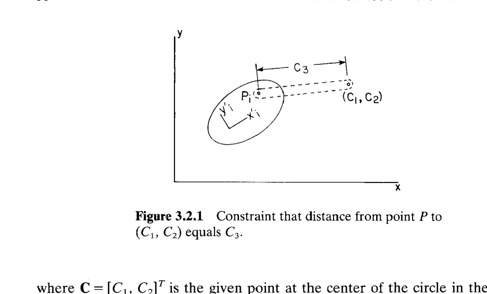
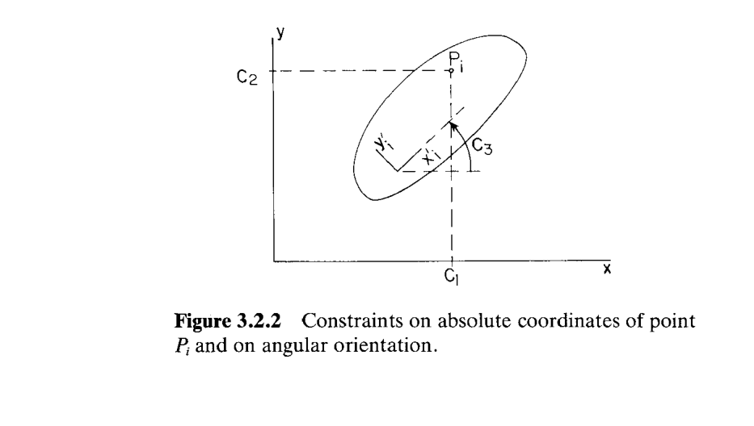
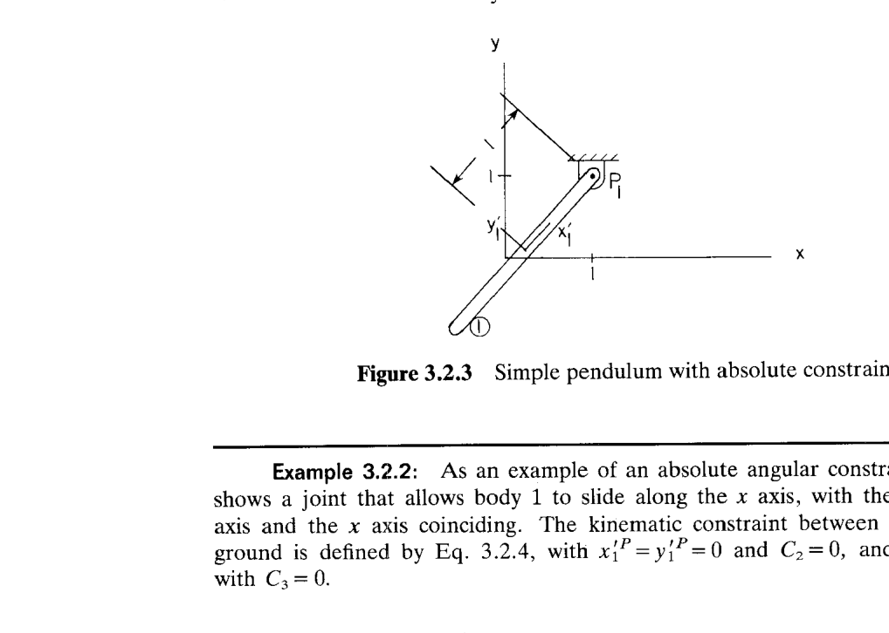
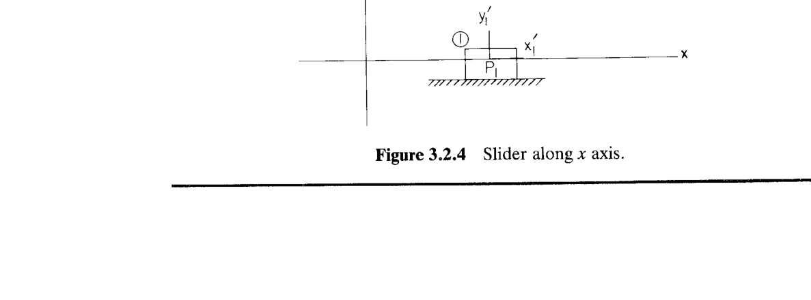

# 3.2 体-地约束（绝对约束 Absolute Constraints）

> 来源：*Computer Aided Kinematics and Dynamics of Mechanical Systems, Vol. 1*，第 3 章，3.2 节（书页 57–60）。
> 本文以"文字讲解 + 逐式详细推导"组织，公式推导不跳步骤；例题保留完整推导。

---

## 引言：本节要解决什么

3.1 节把"计算机辅助运动学分析"的整套流程（广义坐标 → 约束方程 → 位置/速度/加速度分析）演示了一遍。本节开始**系统化地建库**：给出体 $i$ 与地面（即固定的全局 $x$-$y$ 参考系）之间最基本的四种约束，供后续章节反复调用。

由于"地面"不引入新的广义坐标，这些约束只关联单个体 $i$ 的三个坐标 $\mathbf{q}_i=[x_i,y_i,\phi_i]^T$。四种约束按被限制的量分类：

| 类型 | 记号 | 直观含义 | 约束数 |
|------|------|----------|-------|
| 绝对距离约束（absolute distance constraint） | $\Phi^{ad(i)}$ | 点 $P_i$ 只能在以 $\mathbf{C}$ 为心、$C_3$ 为半径的圆上 | 1 |
| 绝对位置约束（absolute position constraint），$x$ 方向 | $\Phi^{ax(i)}$ | 点 $P_i$ 的 $x$ 坐标固定为 $C_1$ | 1 |
| 绝对位置约束，$y$ 方向 | $\Phi^{ay(i)}$ | 点 $P_i$ 的 $y$ 坐标固定为 $C_2$ | 1 |
| 绝对角度约束（absolute angular constraint） | $\Phi^{a\phi(i)}$ | 体 $i$ 的转角固定为 $C_3$ | 1 |

每一种都要写出四样东西：**约束方程**、**雅可比 $\Phi_{\mathbf{q}_i}$**、**速度方程右端项 $\nu$**、**加速度方程右端项 $\gamma$**——这是 3.1 节确立的统一模板，本节乃至第 3 章后续所有约束节都严格按这个模板走。

**共同前置量**（来自第 2 章）：点 $P$ 在全局系中的位置

$$
\mathbf{r}_i^P \;=\; \mathbf{r}_i + \mathbf{A}_i\,\mathbf{s}_i'^P
\;=\;\begin{bmatrix} x_i + x_i'^P\cos\phi_i - y_i'^P\sin\phi_i \\ y_i + x_i'^P\sin\phi_i + y_i'^P\cos\phi_i \end{bmatrix},
\qquad \mathbf{A}_i=\begin{bmatrix}\cos\phi_i & -\sin\phi_i\\ \sin\phi_i & \cos\phi_i\end{bmatrix},
$$

其中 $\mathbf{s}_i'^P=[x_i'^P,y_i'^P]^T$ 是点 $P$ 在体 $i$ 随体系中的**常**坐标。求偏导时反复用到

$$
\frac{d\mathbf{A}_i}{d\phi_i}=\mathbf{B}_i=\begin{bmatrix}-\sin\phi_i & -\cos\phi_i\\ \cos\phi_i & -\sin\phi_i\end{bmatrix},
\qquad \frac{d\mathbf{B}_i}{d\phi_i}=-\mathbf{A}_i.
$$

后者用于加速度右端项的时间二阶求导。

---

## 一、绝对距离约束

### 思路

Fig. 3.2.1 描绘的物理场景：体 $i$ 上取一点 $P_i$，在全局系里固定一点 $\mathbf{C}=[C_1,C_2]^T$，规定 $P_i$ 到 $\mathbf{C}$ 的距离恒为 $C_3>0$。这对应"一段固定长度的连杆用转动关节把体 $i$ 一端铰接到地面 $\mathbf{C}$ 点"——$P_i$ 只能在以 $\mathbf{C}$ 为心、$C_3$ 为半径的圆弧上运动。此约束**消除一个自由度**。

### 约束方程

距离的平方等于 $C_3^2$（避免平方根，方便求导）：

$$
\begin{aligned}
\Phi^{ad(i)} &\equiv (\mathbf{r}_i^P - \mathbf{C})^T(\mathbf{r}_i^P - \mathbf{C}) - C_3^2 \\
&= (x_i + x_i'^P\cos\phi_i - y_i'^P\sin\phi_i - C_1)^2 \\
&\quad + (y_i + x_i'^P\sin\phi_i + y_i'^P\cos\phi_i - C_2)^2 - C_3^2 \;=\; 0.
\end{aligned}
\tag{3.2.1}
$$

### 雅可比 $\Phi_{\mathbf{q}_i}^{ad(i)}$

对 $\mathbf{q}_i=[x_i,y_i,\phi_i]^T$ 逐项求偏导。先用链式法则得矩阵形式，再展开成三个分量。

**第一步：向量-向量链式法则。** 记 $\mathbf{u}\equiv\mathbf{r}_i^P-\mathbf{C}$，则 $\Phi^{ad(i)}=\mathbf{u}^T\mathbf{u}-C_3^2$。由第 2 章 Eq. 2.6.3（对称二次型求导），

$$
\Phi_{\mathbf{q}_i}^{ad(i)} \;=\; 2\,\mathbf{u}^T\,\frac{\partial \mathbf{u}}{\partial \mathbf{q}_i}
\;=\; 2(\mathbf{r}_i^P - \mathbf{C})^T\,\frac{\partial \mathbf{r}_i^P}{\partial \mathbf{q}_i}.
$$

**第二步：$\mathbf{r}_i^P=\mathbf{r}_i+\mathbf{A}_i\mathbf{s}_i'^P$ 对 $\mathbf{q}_i$ 求偏导。** 因为 $\mathbf{s}_i'^P$ 为常向量：

$$
\frac{\partial \mathbf{r}_i^P}{\partial x_i}=\begin{bmatrix}1\\0\end{bmatrix},\quad
\frac{\partial \mathbf{r}_i^P}{\partial y_i}=\begin{bmatrix}0\\1\end{bmatrix},\quad
\frac{\partial \mathbf{r}_i^P}{\partial \phi_i}=\mathbf{B}_i\,\mathbf{s}_i'^P.
$$

拼成 $2\times 3$ 矩阵：$\dfrac{\partial \mathbf{r}_i^P}{\partial \mathbf{q}_i}=\begin{bmatrix}\mathbf{I}_2 & \mathbf{B}_i\mathbf{s}_i'^P\end{bmatrix}$。代回：

$$
\boxed{\;\Phi_{\mathbf{q}_i}^{ad(i)} \;=\; 2\bigl[(\mathbf{r}_i^P-\mathbf{C})^T,\; \mathbf{s}_i'^{PT}\mathbf{B}_i^T(\mathbf{r}_i^P-\mathbf{C})\bigr].\;}
\tag{3.2.2}
$$

**第三步：展成分量式（用于程序）。** 前两个分量直接读出

$$
[\Phi_{\mathbf{q}_i}^{ad(i)}]_1=2(x_i^P-C_1),\qquad [\Phi_{\mathbf{q}_i}^{ad(i)}]_2=2(y_i^P-C_2).
$$

第三个分量需要把 $\mathbf{B}_i\mathbf{s}_i'^P$ 算出来：

$$
\mathbf{B}_i\mathbf{s}_i'^P
=\begin{bmatrix}-\sin\phi_i & -\cos\phi_i\\ \cos\phi_i & -\sin\phi_i\end{bmatrix}\begin{bmatrix}x_i'^P\\ y_i'^P\end{bmatrix}
=\begin{bmatrix}-x_i'^P\sin\phi_i - y_i'^P\cos\phi_i\\ \phantom{-}x_i'^P\cos\phi_i - y_i'^P\sin\phi_i\end{bmatrix},
$$

所以

$$
\begin{aligned}
[\Phi_{\mathbf{q}_i}^{ad(i)}]_3
&= 2\,(\mathbf{r}_i^P-\mathbf{C})^T\mathbf{B}_i\mathbf{s}_i'^P \\
&= 2\bigl[-(x_i^P-C_1)(x_i'^P\sin\phi_i + y_i'^P\cos\phi_i)+ (y_i^P-C_2)(x_i'^P\cos\phi_i - y_i'^P\sin\phi_i)\bigr],
\end{aligned}
$$

与式 (3.2.2) 的展开完全一致。

### 速度方程右端项

$\Phi^{ad(i)}$ 不显含 $t$（约束是**定常**的），所以

$$
\nu^{ad(i)} \;=\; -\Phi_t \;=\; 0.
\tag{3.1.9 特例}
$$

### 加速度方程右端项 $\gamma^{ad(i)}$

**方法 A（直接二阶时间求导，最省事）。** 由 $\Phi^{ad(i)}\equiv 0$ 得 $\ddot{\Phi}^{ad(i)}=0$，把这个"全导数"拆成 $\Phi_{\mathbf{q}}\ddot{\mathbf{q}}$ 与 $\gamma$ 两部分即可读出 $\gamma$。

一次求导：

$$
\dot{\Phi}^{ad(i)} \;=\; 2(\mathbf{r}_i^P-\mathbf{C})^T\dot{\mathbf{r}}_i^P,\qquad
\dot{\mathbf{r}}_i^P=\dot{\mathbf{r}}_i+\mathbf{B}_i\mathbf{s}_i'^P\,\dot\phi_i,
$$

其中 $\dot{\mathbf{A}}_i=\mathbf{B}_i\dot\phi_i$。二次求导：

$$
\ddot{\Phi}^{ad(i)}
= 2\dot{\mathbf{r}}_i^{PT}\dot{\mathbf{r}}_i^P + 2(\mathbf{r}_i^P-\mathbf{C})^T\ddot{\mathbf{r}}_i^P.
$$

其中 $\ddot{\mathbf{r}}_i^P$ 还要展开一次：

$$
\ddot{\mathbf{r}}_i^P
= \ddot{\mathbf{r}}_i + \dot{\mathbf{B}}_i\mathbf{s}_i'^P\,\dot\phi_i + \mathbf{B}_i\mathbf{s}_i'^P\,\ddot\phi_i
= \ddot{\mathbf{r}}_i - \mathbf{A}_i\mathbf{s}_i'^P\,\dot\phi_i^{\,2} + \mathbf{B}_i\mathbf{s}_i'^P\,\ddot\phi_i,
$$

因为 $\dot{\mathbf{B}}_i=(d\mathbf{B}_i/d\phi_i)\dot\phi_i=-\mathbf{A}_i\dot\phi_i$。合并：

$$
\ddot{\Phi}^{ad(i)}
= 2\dot{\mathbf{r}}_i^{PT}\dot{\mathbf{r}}_i^P
+ 2(\mathbf{r}_i^P-\mathbf{C})^T\ddot{\mathbf{r}}_i
+ 2\,\mathbf{s}_i'^{PT}\mathbf{B}_i^T(\mathbf{r}_i^P-\mathbf{C})\,\ddot\phi_i
- 2(\mathbf{r}_i^P-\mathbf{C})^T\mathbf{A}_i\mathbf{s}_i'^P\,\dot\phi_i^{\,2}.
$$

前两项之和 $+$ $\ddot\phi_i$ 项即 $\Phi_{\mathbf{q}_i}^{ad(i)}\ddot{\mathbf{q}}_i$（对照式 3.2.2 的三分量）；剩下一项即 $-\gamma^{ad(i)}$。所以

$$
\boxed{\;\gamma^{ad(i)}
= -2\bigl[\,\dot{\mathbf{r}}_i^{PT}\dot{\mathbf{r}}_i^P - \mathbf{s}_i'^{PT}\mathbf{A}_i^T(\mathbf{r}_i^P-\mathbf{C})\,\dot\phi_i^{\,2}\,\bigr].\;}
\tag{3.2.??}
$$

（书中式号并未新给，可视为并入式 3.1.10 的具体化。）

**方法 B（书中系统求导法）。** 定义标量 $\Phi_{\mathbf{q}_i}\dot{\mathbf{q}}_i=\dot\Phi$，再对 $\mathbf{q}_i$ 求偏导后与 $\dot{\mathbf{q}}_i$ 内积：

$$
\gamma^{ad(i)} = -\,\bigl(\Phi_{\mathbf{q}_i}^{ad(i)}\dot{\mathbf{q}}_i\bigr)_{\mathbf{q}_i}\dot{\mathbf{q}}_i
= -\frac{\partial}{\partial \mathbf{q}_i}\Bigl\{2(\mathbf{r}_i^P-\mathbf{C})^T\dot{\mathbf{r}}_i + 2\,\mathbf{s}_i'^{PT}\mathbf{B}_i^T(\mathbf{r}_i^P-\mathbf{C})\,\dot\phi_i\Bigr\}\,\dot{\mathbf{q}}_i.
$$

按项对 $x_i,y_i,\phi_i$ 求偏导、乘以 $\dot x_i,\dot y_i,\dot\phi_i$ 再合并，用到 Eq. 2.6.3 与 Eq. 2.6.8（$\mathbf{B}_i^T\mathbf{B}_i=\mathbf{I}_2$，$\mathbf{B}_i^T\mathbf{A}_i$ 等价关系），得到与方法 A 相同的表达式：

$$
\gamma^{ad(i)} = -2\bigl[\dot{\mathbf{r}}_i^{PT}\dot{\mathbf{r}}_i^P - \mathbf{s}_i'^{PT}\mathbf{A}_i^T(\mathbf{r}_i^P-\mathbf{C})\,\dot\phi_i^{\,2}\bigr].
$$

两条路殊途同归，表明方法 A 的技巧化解构不是巧合，而是式 3.1.10 通用公式在此约束上的具体化。

### 为何要求 $C_3>0$

若 $C_3=0$，式 3.2.1 变成 $(\mathbf{r}_i^P-\mathbf{C})^T(\mathbf{r}_i^P-\mathbf{C})=0$，即两个二次和为零，等价于**两个**方程 $x_i^P=C_1$、$y_i^P=C_2$ 同时成立——一个记号 $\Phi^{ad(i)}$ 却打包了两个约束，违背了"一个 $\Phi$ 对应一维约束"的记账规则。同时按式 3.2.2，$\mathbf{r}_i^P=\mathbf{C}$ 使雅可比 $\Phi_{\mathbf{q}_i}^{ad(i)}=\mathbf{0}$，后续位置/速度分析会因雅可比奇异而崩溃。因此写距离约束时要**显式规定** $C_3>0$，$C_3=0$ 场景必须改用下面两条位置约束分开写。

---

## 二、绝对位置约束（$x$ / $y$ 方向）

### 思路

Fig. 3.2.2 上半部分：让体 $i$ 上的点 $P_i$ 只能沿平行于 $y$ 轴的槽滑动（$x$ 坐标固定为 $C_1$），或只能沿平行于 $x$ 轴的槽滑动（$y$ 坐标固定为 $C_2$）。物理上就是一根钉子插在直槽里。每种消除一个自由度。

### 约束方程

由 $\mathbf{r}_i^P=[x_i^P,y_i^P]^T$ 的展开式直接写出：

$$
\begin{aligned}
\Phi^{ax(i)} &\equiv x_i^P - C_1 = x_i + x_i'^P\cos\phi_i - y_i'^P\sin\phi_i - C_1 = 0, & (3.2.3)\\
\Phi^{ay(i)} &\equiv y_i^P - C_2 = y_i + x_i'^P\sin\phi_i + y_i'^P\cos\phi_i - C_2 = 0. & (3.2.4)
\end{aligned}
$$

### 雅可比

各自对 $\mathbf{q}_i=[x_i,y_i,\phi_i]^T$ 逐项求偏导。对 $\Phi^{ax(i)}$：

$$
\frac{\partial \Phi^{ax(i)}}{\partial x_i}=1,\quad
\frac{\partial \Phi^{ax(i)}}{\partial y_i}=0,\quad
\frac{\partial \Phi^{ax(i)}}{\partial \phi_i}=-x_i'^P\sin\phi_i - y_i'^P\cos\phi_i.
$$

对 $\Phi^{ay(i)}$：

$$
\frac{\partial \Phi^{ay(i)}}{\partial x_i}=0,\quad
\frac{\partial \Phi^{ay(i)}}{\partial y_i}=1,\quad
\frac{\partial \Phi^{ay(i)}}{\partial \phi_i}=x_i'^P\cos\phi_i - y_i'^P\sin\phi_i.
$$

写成行向量：

$$
\boxed{
\begin{aligned}
\Phi_{\mathbf{q}_i}^{ax(i)} &= [\,1,\; 0,\; -x_i'^P\sin\phi_i - y_i'^P\cos\phi_i\,],\\
\Phi_{\mathbf{q}_i}^{ay(i)} &= [\,0,\; 1,\;\phantom{-}x_i'^P\cos\phi_i - y_i'^P\sin\phi_i\,].
\end{aligned}
}
\tag{3.2.5}
$$

**注**：第三列正好是 $(\mathbf{B}_i\mathbf{s}_i'^P)$ 的第一、第二个分量——因为 $\partial\mathbf{r}_i^P/\partial\phi_i=\mathbf{B}_i\mathbf{s}_i'^P$，取 $x$/$y$ 分量即得。

### 速度与加速度右端项

两约束都不显含 $t$，故 $\nu^{ax(i)}=\nu^{ay(i)}=0$。

$\gamma$ 用方法 A 直接算最快。对 $\Phi^{ax(i)}$ 两次求导：

$$
\dot{\Phi}^{ax(i)} = \dot x_i + (-x_i'^P\sin\phi_i - y_i'^P\cos\phi_i)\,\dot\phi_i.
$$

对时间再求一次导：

$$
\ddot{\Phi}^{ax(i)} = \ddot x_i + (-x_i'^P\sin\phi_i - y_i'^P\cos\phi_i)\,\ddot\phi_i + \frac{d}{dt}(-x_i'^P\sin\phi_i - y_i'^P\cos\phi_i)\,\dot\phi_i.
$$

其中

$$
\frac{d}{dt}(-x_i'^P\sin\phi_i - y_i'^P\cos\phi_i) = (-x_i'^P\cos\phi_i + y_i'^P\sin\phi_i)\,\dot\phi_i.
$$

代回：

$$
\ddot{\Phi}^{ax(i)} = \underbrace{\ddot x_i + (-x_i'^P\sin\phi_i - y_i'^P\cos\phi_i)\,\ddot\phi_i}_{\Phi_{\mathbf{q}_i}^{ax(i)}\,\ddot{\mathbf{q}}_i} + (-x_i'^P\cos\phi_i + y_i'^P\sin\phi_i)\,\dot\phi_i^{\,2} = 0.
$$

移项得 $\Phi_{\mathbf{q}_i}\ddot{\mathbf{q}}_i = -(-x_i'^P\cos\phi_i+y_i'^P\sin\phi_i)\dot\phi_i^{\,2} = \gamma^{ax(i)}$，即

$$
\boxed{\;\gamma^{ax(i)} = (x_i'^P\cos\phi_i - y_i'^P\sin\phi_i)\,\dot\phi_i^{\,2}.\;}
$$

对 $\Phi^{ay(i)}$ 完全平行地做一遍：

$$
\dot{\Phi}^{ay(i)} = \dot y_i + (x_i'^P\cos\phi_i - y_i'^P\sin\phi_i)\,\dot\phi_i,
$$
$$
\frac{d}{dt}(x_i'^P\cos\phi_i - y_i'^P\sin\phi_i) = (-x_i'^P\sin\phi_i - y_i'^P\cos\phi_i)\,\dot\phi_i,
$$
$$
\ddot{\Phi}^{ay(i)} = \ddot y_i + (x_i'^P\cos\phi_i - y_i'^P\sin\phi_i)\,\ddot\phi_i + (-x_i'^P\sin\phi_i - y_i'^P\cos\phi_i)\,\dot\phi_i^{\,2} = 0,
$$
$$
\boxed{\;\gamma^{ay(i)} = (x_i'^P\sin\phi_i + y_i'^P\cos\phi_i)\,\dot\phi_i^{\,2}.\;}
$$

**物理直观**：$\gamma^{ax}$ 与 $\gamma^{ay}$ 的因子分别是 $\mathbf{A}_i\mathbf{s}_i'^P$ 的 $x$、$y$ 分量。当体 $i$ 以角速度 $\dot\phi_i$ 转动时，点 $P_i$ 相对随体系原点做圆周运动，产生**向心加速度** $|\mathbf{A}_i\mathbf{s}_i'^P|\dot\phi_i^{\,2}$，指向随体系原点。若 $P_i$ 的 $x$ 或 $y$ 坐标被冻结，体本身的 $x_i$、$y_i$ 加速度必须去抵消这个向心分量——$\gamma^{ax},\gamma^{ay}$ 正是它。

---

## 三、绝对角度约束

### 思路与方程

规定体 $i$ 的转角

$$
\Phi^{a\phi(i)} \equiv \phi_i - C_3 = 0.
\tag{3.2.6}
$$

Fig. 3.2.2 中，$C_3$ 是体 $i$ 上标注的角度（例如把车身相对全局系锁死为固定朝向）。

### 雅可比、$\nu$、$\gamma$

对 $\mathbf{q}_i=[x_i,y_i,\phi_i]^T$ 求偏导：

$$
\Phi_{\mathbf{q}_i}^{a\phi(i)} = [\,0,\; 0,\; 1\,].
\tag{3.2.7}
$$

不含 $t$：$\nu^{a\phi(i)}=0$。二阶求导 $\ddot{\Phi}^{a\phi(i)}=\ddot\phi_i=0$，即 $\Phi_{\mathbf{q}_i}\ddot{\mathbf{q}}_i=\ddot\phi_i$，故

$$
\gamma^{a\phi(i)} = 0.
$$

一句话总结（§3.2 的四种约束，$\nu,\gamma$）：

$$
\nu^{ad(i)} = \nu^{ax(i)} = \nu^{ay(i)} = \nu^{a\phi(i)} = 0,
$$

$$
\gamma^{a\phi(i)} = 0,\quad
\gamma^{ax(i)} = (x_i'^P\cos\phi_i - y_i'^P\sin\phi_i)\dot\phi_i^{\,2},\quad
\gamma^{ay(i)} = (x_i'^P\sin\phi_i + y_i'^P\cos\phi_i)\dot\phi_i^{\,2}.
$$

---

## 例 3.2.1：单摆的绝对约束表述

> **设定**：Fig. 3.2.3。体 1（单摆杆，长度 2 单位）的随体系 $x_1'$-$y_1'$ 原点取在**杆的几何中心**，$x_1'$ 轴沿杆指向下方端点。销钉 $P_1$ 位于 $x_1'^P=1$、$y_1'^P=0$（即杆的上端），并被物理上固定在全局系点 $(C_1,C_2)=(1,1)$。求约束方程、雅可比、$\nu$、$\gamma$。

### 约束方程

把销钉钉在 $(1,1)$ 就是"点 $P_1$ 的 $x$、$y$ 坐标各被固定"，直接调用式 3.2.3–3.2.4，代 $x_1'^P=1,y_1'^P=0,C_1=1,C_2=1$：

$$
\begin{aligned}
\Phi^{ax(1)} &= x_1 + \cos\phi_1 - 1 = 0,\\
\Phi^{ay(1)} &= y_1 + \sin\phi_1 - 1 = 0.
\end{aligned}
$$

两条约束、三个坐标，$\text{DOF}=3-2=1$——正是单摆应有的 1 自由度（摆角 $\phi_1$）。

**几何检查**：从 $x_1=1-\cos\phi_1,\; y_1=1-\sin\phi_1$ 得

$$
(x_1-1)^2+(y_1-1)^2=\cos^2\phi_1+\sin^2\phi_1=1,
$$

即体 1 的几何中心 $\mathbf{r}_1=[x_1,y_1]^T$ 落在以 $(1,1)$ 为心、半径 1 的圆上——正是杆中心到销钉 $P_1$ 的距离。物理正确。

### 雅可比与右端项

调用式 3.2.5：

$$
\begin{aligned}
\Phi_{\mathbf{q}_1}^{ax(1)} &= [\,1,\;0,\;-\sin\phi_1\,],\\
\Phi_{\mathbf{q}_1}^{ay(1)} &= [\,0,\;1,\;\phantom{-}\cos\phi_1\,].
\end{aligned}
$$

$\nu^{ax(1)}=\nu^{ay(1)}=0$（无时间依赖，稳态几何）。$\gamma$ 由上节公式：

$$
\gamma^{ax(1)} = \cos\phi_1\,\dot\phi_1^{\,2},\qquad
\gamma^{ay(1)} = \sin\phi_1\,\dot\phi_1^{\,2}.
$$

**与 Example 3.1.1 的等价**：3.1.1 节里用的是 $\Phi^{ad(1)}=(x_1)^2+(y_1)^2 - (\ell/2)^2=0$ 等（一根杆中心到 $O$ 距离固定），本例改用"钉住 $P_1$"的两个位置约束等价刻画同一物理系统——书中原话 "the constraint equations for the simple pendulum of Example 3.1.1 could have been written in this way"，正是强调建模选择的多样性：**同一机构可以有多组等效的约束方程**，工程师可选最方便的一组。

---

## 例 3.2.2：沿 $x$ 轴滑动的滑块

> **设定**：Fig. 3.2.4。体 1 只能沿全局 $x$ 轴平移，且随体 $x_1'$ 轴始终与全局 $x$ 轴重合。参考点 $P_1$ 取在随体系原点（即 $x_1'^P=y_1'^P=0$）。

### 约束方程

"$P_1$ 始终在 $x$ 轴上"= 其 $y$ 坐标恒为 0，调用式 3.2.4，代 $x_1'^P=y_1'^P=0,\;C_2=0$：

$$
\Phi^{ay(1)} = y_1 + 0\cdot\sin\phi_1 + 0\cdot\cos\phi_1 - 0 = y_1 = 0.
$$

"随体 $x_1'$ 轴与全局 $x$ 轴重合"= 转角 $\phi_1$ 恒为 0，调用式 3.2.6，代 $C_3=0$：

$$
\Phi^{a\phi(1)} = \phi_1 - 0 = \phi_1 = 0.
$$

两条约束、三个坐标，$\text{DOF}=1$——正是滑块沿 $x$ 方向的 1 自由度平动。

### 雅可比与右端项

$$
\Phi_{\mathbf{q}_1}^{ay(1)} = [\,0,\;1,\;0\,],\qquad
\Phi_{\mathbf{q}_1}^{a\phi(1)} = [\,0,\;0,\;1\,].
$$

（因 $x_1'^P=y_1'^P=0$，$\phi_1$-分量退化为 0。）$\nu=\gamma=\mathbf{0}$。整个约束子系统的雅可比

$$
\begin{bmatrix}\Phi^{ay(1)}_{\mathbf{q}_1}\\ \Phi^{a\phi(1)}_{\mathbf{q}_1}\end{bmatrix}
=\begin{bmatrix}0 & 1 & 0\\ 0 & 0 & 1\end{bmatrix}
$$

只锁死 $y_1$ 和 $\phi_1$，保留 $x_1$ 自由——正是"沿 $x$ 轴滑动"的运动子空间。

---

## 小结

- 本节把"体-地"关系抽出四种最基本的**绝对约束**：距离、位置-$x$、位置-$y$、角度。每种都完成了三件事：**约束方程**、**雅可比**、**加速度右端项 $\gamma$**（$\nu$ 一律为 0，因约束不显含时间）。
- 三种非平凡的 $\gamma$ 均正比于 $\dot\phi_i^{\,2}$，物理上是 $P_i$ 绕随体系原点的**向心加速度**在全局系的对应分量投影。
- $C_3>0$ 是距离约束能"记账为 1 个方程"的必要条件；若 $C_3=0$，应该改用两条位置约束分开写。
- 例 3.2.1 展示**同一物理机构可有多种等价约束建模**（单摆既可用绝对距离约束，也可用两条绝对位置约束）；例 3.2.2 展示如何**用绝对约束叠加得到轨道约束**（$y=0$ + $\phi=0$ ⇒ 沿 $x$ 轴滑动）。
- 3.5 节的"绝对驱动"将把这四种约束里的常数 $C_k$ 换成 $C_k(t)$，直接沿用本节推得的雅可比——本节是驱动约束节的**原型**。
