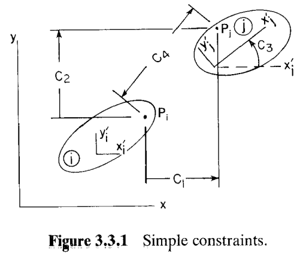
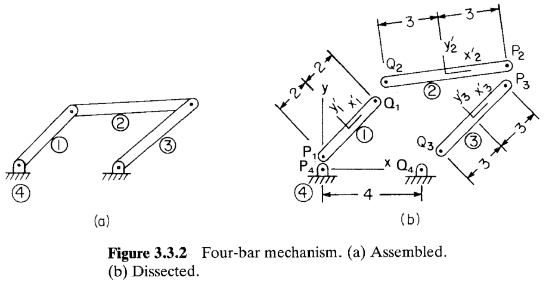
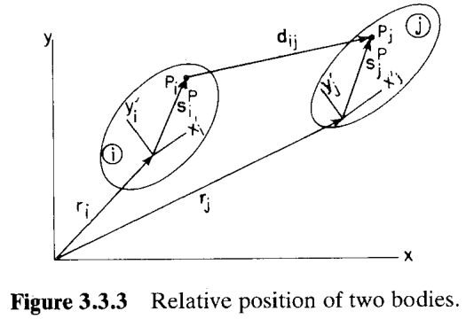
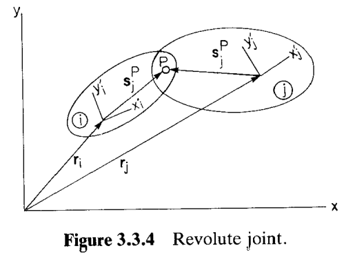
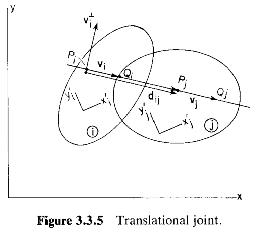
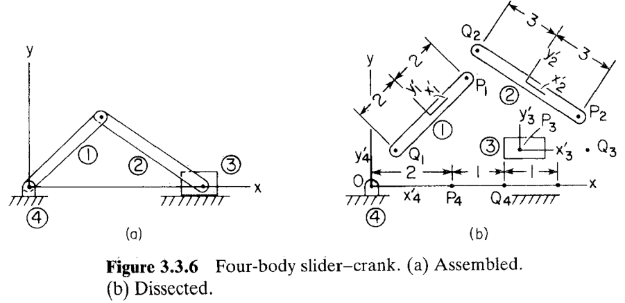
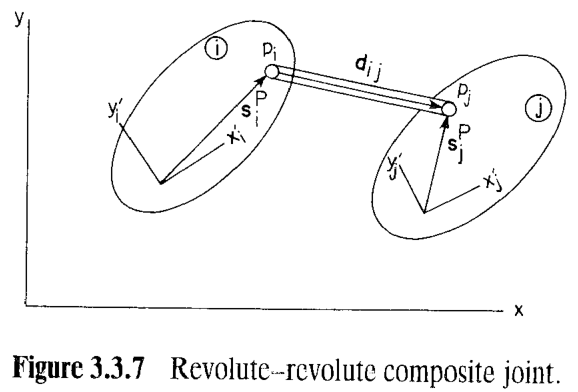
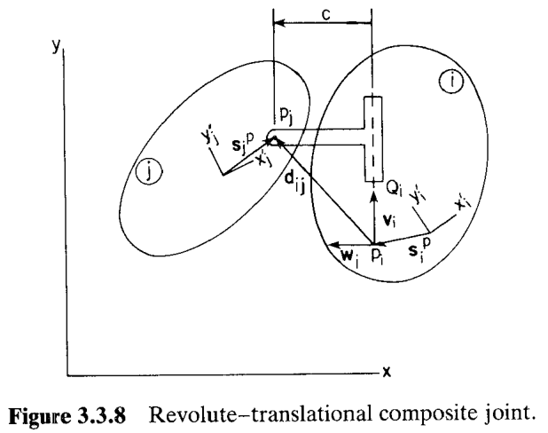

# 3.3 刚体-刚体约束（相对约束 Relative Constraints）

> 来源：*Computer Aided Kinematics and Dynamics of Mechanical Systems, Vol. 1*，第 3 章，3.3 节（书页 61–70）。
> 本文以"文字讲解 + 逐式详细推导"组织，公式推导不跳步骤；例题保留完整推导。

---

## 引言：本节要解决什么

3.2 节给出的绝对约束（absolute constraint）只把单个刚体绑到全局系。真实机构中，**绝大多数关节（joint）连接的是两个刚体**：一根曲柄和一根连杆、一个活塞和一个缸。本节系统化地建立"刚体-刚体"约束库，供后续所有机构建模复用。

组织顺序遵循"由简到繁"：

1. **3.3.1** 相对坐标约束（Relative Coordinate Constraints）——4 种最简单的一元代数式（相对 $x/y/\phi/$ 距离），是 3.2 节绝对约束的直接推广。
2. **3.3.2** 转动关节（revolute joint）和移动关节（translational joint）——两种真正的物理关节，各消除 2 个自由度；此处开始需要引入辅助向量、图形推导。
3. **3.3.3** 复合关节（composite joint）——用一根**无质量连杆**（coupler / massless link）把两个基本关节串起来，避开为连杆引入 3 个额外坐标。

**核心方法论**（p.61）：所写的约束方程必须"**蕴含关节的几何**（imply the geometry of the joint）"，而不仅仅是"**与关节几何相容**（implied by the geometry of the joint）"。Example 3.1.3 演示过后一种做法会失败——它写出的方程虽被物理构型满足，却不能反过来限制刚体只在关节允许的自由度上运动，数值上迟早发散。3.3 节的每一处推导都会在末尾**验证**这一点。

---

## 3.3.1 相对坐标约束（Relative Coordinate Constraints）

### 思路

3.2 节的绝对约束将刚体 $i$ 上一点 $P_i$ 的全局坐标 $x_i^P, y_i^P$（或刚体的转角 $\phi_i$）钉在给定常数上；这里只需把"常数"换成"刚体 $j$ 上另一点 $P_j$ 的对应量"，就得到相对约束。图 3.3.1 把 4 种情形叠在一张图里：$C_1$ 是相对 $x$ 的差，$C_2$ 是相对 $y$ 的差，$C_3$ 是相对转角，$C_4$ 是两点距离。

回忆点 $P$ 在全局坐标系中的坐标（Eq. 2.4.8）：

$$
\mathbf{r}_i^P = \mathbf{r}_i + \mathbf{A}_i\mathbf{s}_i^{\prime P}.
$$

写成分量形式：

$$
\begin{bmatrix} x_i^P \\ y_i^P \end{bmatrix}
= \begin{bmatrix} x_i \\ y_i \end{bmatrix}
+ \begin{bmatrix} \cos\phi_i & -\sin\phi_i \\ \sin\phi_i & \phantom{-}\cos\phi_i \end{bmatrix}
  \begin{bmatrix} x_i^{\prime P} \\ y_i^{\prime P} \end{bmatrix}.
$$

展开得：

$$
\begin{aligned}
x_i^P &= x_i + x_i^{\prime P}\cos\phi_i - y_i^{\prime P}\sin\phi_i, \\
y_i^P &= y_i + x_i^{\prime P}\sin\phi_i + y_i^{\prime P}\cos\phi_i.
\end{aligned}
$$

后续 4 种约束都由此展开。

### (1) 相对 $x$ 约束

**约束方程：** 要求 $P_j$ 与 $P_i$ 的 $x$ 分量之差等于常数 $C_1$：

$$
\Phi^{rx(i,j)} \equiv x_j^P - x_i^P - C_1
= x_j + x_j^{\prime P}\cos\phi_j - y_j^{\prime P}\sin\phi_j - x_i - x_i^{\prime P}\cos\phi_i + y_i^{\prime P}\sin\phi_i - C_1 = 0. \tag{3.3.1}
$$

**雅可比（Jacobian）：** 直接逐分量求偏导。对 $\mathbf{q}_i = [x_i, y_i, \phi_i]^T$：

$$
\frac{\partial \Phi^{rx(i,j)}}{\partial x_i} = -1, \qquad
\frac{\partial \Phi^{rx(i,j)}}{\partial y_i} = 0,
$$

$$
\frac{\partial \Phi^{rx(i,j)}}{\partial \phi_i}
= -x_i^{\prime P}(-\sin\phi_i) + y_i^{\prime P}\cos\phi_i
= x_i^{\prime P}\sin\phi_i + y_i^{\prime P}\cos\phi_i.
$$

对 $\mathbf{q}_j = [x_j, y_j, \phi_j]^T$ 同理：

$$
\frac{\partial \Phi^{rx(i,j)}}{\partial x_j} = 1, \quad
\frac{\partial \Phi^{rx(i,j)}}{\partial y_j} = 0, \quad
\frac{\partial \Phi^{rx(i,j)}}{\partial \phi_j} = -x_j^{\prime P}\sin\phi_j - y_j^{\prime P}\cos\phi_j.
$$

写成行向量：

$$
\boxed{
\begin{aligned}
\Phi_{\mathbf{q}_i}^{rx(i,j)} &= [-1,\ 0,\ x_i^{\prime P}\sin\phi_i + y_i^{\prime P}\cos\phi_i], \\
\Phi_{\mathbf{q}_j}^{rx(i,j)} &= [\ 1,\ 0,\ -x_j^{\prime P}\sin\phi_j - y_j^{\prime P}\cos\phi_j].
\end{aligned}
}\tag{3.3.2}
$$

**速度方程右端 $\nu$。** 由 $\Phi^{rx(i,j)}$ 不显式含 $t$，$\Phi_t = 0$，故（Eq. 3.1.9）
$$
\boxed{ \nu^{rx(i,j)} = -\Phi_t = 0. }
$$

**加速度方程右端 $\gamma$。** 由 Eq. 3.1.10（$\Phi$ 无 $t$ 时的简化形式）：
$$
\gamma^{rx(i,j)} = -(\Phi_{\mathbf{q}}\dot{\mathbf{q}})_{\mathbf{q}}\dot{\mathbf{q}}.
$$

先算 $\Phi_{\mathbf{q}}\dot{\mathbf{q}}$（一个标量，取 Eq. 3.3.2 对应位置乘 $\dot x, \dot y, \dot\phi$）：

$$
\begin{aligned}
\Phi_{\mathbf{q}}^{rx}\dot{\mathbf{q}}
&= -\dot x_i + \bigl(x_i^{\prime P}\sin\phi_i + y_i^{\prime P}\cos\phi_i\bigr)\dot\phi_i \\
&\quad + \dot x_j - \bigl(x_j^{\prime P}\sin\phi_j + y_j^{\prime P}\cos\phi_j\bigr)\dot\phi_j.
\end{aligned}
$$

再对 $\mathbf{q}$ 求梯度并与 $\dot{\mathbf{q}}$ 相乘。只有含 $\phi_i$ 的项 $(\cdots)\dot\phi_i$ 对 $\phi_i$ 有导数——常量 $\dot\phi_i$ 视为参数，不再求导——：

$$
\frac{\partial}{\partial \phi_i}\bigl[(x_i^{\prime P}\sin\phi_i + y_i^{\prime P}\cos\phi_i)\dot\phi_i\bigr]
= (x_i^{\prime P}\cos\phi_i - y_i^{\prime P}\sin\phi_i)\dot\phi_i.
$$

乘以 $\dot\phi_i$ 得 $(x_i^{\prime P}\cos\phi_i - y_i^{\prime P}\sin\phi_i)\dot\phi_i^2$。$j$ 部分给出 $-(x_j^{\prime P}\cos\phi_j - y_j^{\prime P}\sin\phi_j)\dot\phi_j^2$。合并再加负号：

$$
\boxed{\begin{aligned}
\gamma^{rx(i,j)}
&= -(x_i^{\prime P}\cos\phi_i - y_i^{\prime P}\sin\phi_i)\dot\phi_i^2 \\
&\quad + (x_j^{\prime P}\cos\phi_j - y_j^{\prime P}\sin\phi_j)\dot\phi_j^2.
\end{aligned}}
$$

**几何意义。** $\nu = 0$ 说明"没有主动输入"；$\gamma$ 的两项恰是刚体 $i$、刚体 $j$ 上 $P$ 点作圆周运动的**向心加速度沿 $x$ 方向的分量**，符号相反是因为约束方程写成 $x_j^P - x_i^P$。

---

### (2) 相对 $y$ 约束

方程：
$$
\Phi^{ry(i,j)} \equiv y_j^P - y_i^P - C_2
= y_j + x_j^{\prime P}\sin\phi_j + y_j^{\prime P}\cos\phi_j - y_i - x_i^{\prime P}\sin\phi_i - y_i^{\prime P}\cos\phi_i - C_2 = 0. \tag{3.3.3}
$$

雅可比（同法逐项求导）：
$$
\boxed{
\begin{aligned}
\Phi_{\mathbf{q}_i}^{ry(i,j)} &= [\,0,\ -1,\ -x_i^{\prime P}\cos\phi_i + y_i^{\prime P}\sin\phi_i\,], \\
\Phi_{\mathbf{q}_j}^{ry(i,j)} &= [\,0,\ \ 1,\ \ x_j^{\prime P}\cos\phi_j - y_j^{\prime P}\sin\phi_j\,].
\end{aligned}
}\tag{3.3.4}
$$

速度方程：
$$ \boxed{\nu^{ry(i,j)} = 0 } $$

$\gamma$ 用同样办法（对 $\Phi_{\mathbf{q}}\dot{\mathbf{q}}$ 再求梯度）：
$$
\boxed{\begin{aligned}
\gamma^{ry(i,j)}
&= -(x_i^{\prime P}\sin\phi_i + y_i^{\prime P}\cos\phi_i)\dot\phi_i^2 \\
&\quad + (x_j^{\prime P}\sin\phi_j + y_j^{\prime P}\cos\phi_j)\dot\phi_j^2.
\end{aligned}}
$$

---

### (3) 相对 $\phi$ 约束

$$
\Phi^{r\phi(i,j)} \equiv \phi_j - \phi_i - C_3 = 0. \tag{3.3.5}
$$

雅可比只有 $\phi$ 分量非零：
$$
\Phi_{\mathbf{q}_i}^{r\phi(i,j)} = [0, 0, -1], \qquad
\Phi_{\mathbf{q}_j}^{r\phi(i,j)} = [0, 0, 1]. \tag{3.3.6}
$$

雅可比是常量 → $(\Phi_{\mathbf{q}}\dot{\mathbf{q}})_{\mathbf{q}} = \mathbf{0}$，故
$$
\nu^{r\phi(i,j)} = 0, \qquad \gamma^{r\phi(i,j)} = 0.
$$

**物理意义。** 这个约束把两刚体角速度锁死为常量：$\dot\phi_j = \dot\phi_i$。它比 3.3.2 节的转动关节更"强"——转动关节只锁定位置，允许 $\dot\phi_j - \dot\phi_i$ 变化。

---

### (4) 相对距离约束

要求点 $P_i$、$P_j$ 之间的欧氏距离等于给定常数 $C_4 > 0$。用 $\mathbf{d}_{ij}$ 记两点连接向量（后续 Eq. 3.3.9 会正式记号化）：

$$
\Phi^{rd(i,j)} \equiv (\mathbf{r}_i^P - \mathbf{r}_j^P)^T(\mathbf{r}_i^P - \mathbf{r}_j^P) - C_4^2 = 0.
$$

按 Eq. 2.4.8 展开分量：
$$
\begin{aligned}
\Phi^{rd(i,j)}
&= (x_i + x_i^{\prime P}\cos\phi_i - y_i^{\prime P}\sin\phi_i - x_j - x_j^{\prime P}\cos\phi_j + y_j^{\prime P}\sin\phi_j)^2 \\
&\quad + (y_i + x_i^{\prime P}\sin\phi_i + y_i^{\prime P}\cos\phi_i - y_j - x_j^{\prime P}\sin\phi_j - y_j^{\prime P}\cos\phi_j)^2 \\
&\quad - C_4^2 = 0.
\end{aligned}\tag{3.3.7}
$$

**雅可比。** 记 $\mathbf{u} = \mathbf{r}_i^P - \mathbf{r}_j^P$。则 $\Phi^{rd} = \mathbf{u}^T\mathbf{u} - C_4^2$，
$$
\frac{\partial \Phi^{rd}}{\partial \mathbf{q}_i}
= 2\mathbf{u}^T\frac{\partial \mathbf{u}}{\partial \mathbf{q}_i}
= 2\mathbf{u}^T\frac{\partial \mathbf{r}_i^P}{\partial \mathbf{q}_i}.
$$

由 $\mathbf{r}_i^P = \mathbf{r}_i + \mathbf{A}_i\mathbf{s}_i^{\prime P}$：
$$
\frac{\partial \mathbf{r}_i^P}{\partial \mathbf{r}_i} = \mathbf{I}_{2\times2}, \qquad
\frac{\partial \mathbf{r}_i^P}{\partial \phi_i} = \mathbf{B}_i\mathbf{s}_i^{\prime P},
$$
其中 $\mathbf{B}_i = \partial\mathbf{A}_i/\partial\phi_i$（Eq. 2.6.3）。合并成 $2\times3$ 分块：
$$
\frac{\partial \mathbf{r}_i^P}{\partial \mathbf{q}_i} = [\mathbf{I},\ \mathbf{B}_i\mathbf{s}_i^{\prime P}].
$$

所以
$$
\Phi_{\mathbf{q}_i}^{rd(i,j)} = 2[\mathbf{u}^T,\ \mathbf{u}^T\mathbf{B}_i\mathbf{s}_i^{\prime P}]
= 2\bigl[(\mathbf{r}_i^P - \mathbf{r}_j^P)^T,\ \mathbf{s}_i^{\prime PT}\mathbf{B}_i^T(\mathbf{r}_i^P - \mathbf{r}_j^P)\bigr],
$$

其中末项做了标量转置（$\mathbf{u}^T\mathbf{B}_i\mathbf{s}_i^{\prime P}$ 是标量，等于其自身的转置）。对 $\mathbf{q}_j$ 反号（因 $\mathbf{u}$ 对 $\mathbf{q}_j$ 依赖是 $-\mathbf{r}_j^P$）：

$$
\boxed{
\begin{aligned}
\Phi_{\mathbf{q}_i}^{rd(i,j)} &= 2\bigl[(\mathbf{r}_i^P - \mathbf{r}_j^P)^T,\ \ \mathbf{s}_i^{\prime PT}\mathbf{B}_i^T(\mathbf{r}_i^P - \mathbf{r}_j^P)\bigr], \\
\Phi_{\mathbf{q}_j}^{rd(i,j)} &= 2\bigl[-(\mathbf{r}_i^P - \mathbf{r}_j^P)^T,\ -\mathbf{s}_j^{\prime PT}\mathbf{B}_j^T(\mathbf{r}_i^P - \mathbf{r}_j^P)\bigr].
\end{aligned}
}\tag{3.3.8}
$$

**速度、加速度右端。** 无显含时间：

$$ \boxed{ \nu^{rd(i,j)} = 0 }$$

加速度右端 $\gamma$ 与 3.2.1 节的绝对距离约束 $\gamma^{ad(i)}$ 结构完全同型（只需把 $\mathbf{C}$ 换成 $\mathbf{r}_j^P$）。逐项展开 $-(\Phi_{\mathbf{q}}\dot{\mathbf{q}})_{\mathbf{q}}\dot{\mathbf{q}}$：

$$
\begin{aligned}
\gamma^{rd(i,j)} = -2\{
&(\dot{\mathbf{r}}_i - \dot{\mathbf{r}}_j)^T(\dot{\mathbf{r}}_i - \dot{\mathbf{r}}_j) \\
&+ (\dot{\mathbf{r}}_i - \dot{\mathbf{r}}_j)^T(\mathbf{B}_i\mathbf{s}_i^{\prime P}\dot\phi_i - \mathbf{B}_j\mathbf{s}_j^{\prime P}\dot\phi_j) \\
&- (\mathbf{s}_i^{\prime PT}\mathbf{A}_i^T\dot\phi_i^2 - \mathbf{s}_j^{\prime PT}\mathbf{A}_j^T\dot\phi_j^2)(\mathbf{r}_i^P - \mathbf{r}_j^P) \\
&+ (\mathbf{s}_i^{\prime PT}\mathbf{B}_i^T\dot\phi_i - \mathbf{s}_j^{\prime PT}\mathbf{B}_j^T\dot\phi_j)(\dot{\mathbf{r}}_i - \dot{\mathbf{r}}_j + \mathbf{B}_i\mathbf{s}_i^{\prime P}\dot\phi_i - \mathbf{B}_j\mathbf{s}_j^{\prime P}\dot\phi_j)
\}.
\end{aligned}
$$

利用 $\dot{\mathbf{r}}_i^P = \dot{\mathbf{r}}_i + \mathbf{B}_i\mathbf{s}_i^{\prime P}\dot\phi_i$（Eq. 2.6.5）把前两行合并为 $(\dot{\mathbf{r}}_i^P - \dot{\mathbf{r}}_j^P)^T(\dot{\mathbf{r}}_i^P - \dot{\mathbf{r}}_j^P)$；第四行用 $\mathbf{B}_i^T\mathbf{B}_i = \mathbf{I}$ 与 $\mathbf{B}_i^T\mathbf{A}_j = \mathbf{R}^T\mathbf{A}_{ij}$（Eq. 2.6.8 的恒等式）合并入第三行相消部分，最终留下：

$$
\boxed{
\gamma^{rd(i,j)} = -2\bigl\{(\dot{\mathbf{r}}_i^P - \dot{\mathbf{r}}_j^P)^T(\dot{\mathbf{r}}_i^P - \dot{\mathbf{r}}_j^P) - (\mathbf{s}_i^{\prime PT}\mathbf{A}_i^T\dot\phi_i^2 - \mathbf{s}_j^{\prime PT}\mathbf{A}_j^T\dot\phi_j^2)(\mathbf{r}_i^P - \mathbf{r}_j^P)\bigr\}.
}
$$

**关于 $C_4 > 0$。** 与 3.2.1 节的绝对距离一样：$C_4 = 0$ 会让雅可比 Eq. 3.3.8 的**前四列**（$\mathbf{r}_i^P - \mathbf{r}_j^P$ 部分）全为零，且约束方程退化——两点重合时任何微小扰动都自动违反约束的物理含义（"两点保持距离 0"其实是转动关节，需要 3.3.2 处理）。$C_4 > 0$ 同时排除**物理奇异**（两点重合）和**数学奇异**（雅可比行秩缺失）。

---

### Example 3.3.1：两刚体曲柄滑块（Slider–Crank）

> 用 Examples 2.4.3 / 3.1.2 的双刚体曲柄滑块模型（Fig. 3.1.3）。

**建模方式。** 把两根杆装在地面上，用以下 3+2 = 5 个约束（$nb = 2$）：

- $O_1$ 上的绝对 $x$ 约束（Eq. 3.2.3，$C_1 = 0$）——把曲柄绕原点铰接固定；
- $O_1$ 上的绝对 $y$ 约束（Eq. 3.2.4，$C_2 = 0$）——同上，锁定 $y$；
- $O_2$ 上的绝对 $y$ 约束（Eq. 3.2.4，$C_2 = 0$）——滑块沿 $x$ 轴滑；
- $P_1$ 与 $P_2$ 之间的相对 $x$ 约束（Eq. 3.3.1，$C_1 = 0$）；
- $P_1$ 与 $P_2$ 之间的相对 $y$ 约束（Eq. 3.3.3，$C_2 = 0$）——最后两条把曲柄末端 $P_1$ 与滑块上的销 $P_2$ 强制重合，即"转动关节"。

自由度：$\text{DOF} = 3nb - nh = 6 - 5 = 1$。系统只剩曲柄转角一个独立坐标。（其他建模方式见 Prob. 3.3.2。）

---

### Example 3.3.2：四连杆（four-bar）机构——**多种等价模型**

> 三根活动杆加地面（$nb$ 视模型而异），几何见 Fig. 3.3.2。

四个转动耦合分别在 $(P_1, P_4)$、$(Q_1, Q_2)$、$(P_2, P_3)$、$(Q_3, Q_4)$。用图 3.3.2(b) 所示的刚体上局部坐标 $x_k'\text{-}y_k'$ 编号后，可以给出多种"运动学等价"（kinematically equivalent）模型：

**模型 1** — 3 根活动刚体 1, 2, 3；共 8 约束：
- (i) $P_1$ 与 $Q_3$ 分别有绝对 $x$、$y$ 约束（4 个）；
- (ii) $Q_1$-$Q_2$ 之间和 $P_2$-$P_3$ 之间分别有相对 $x$、$y$ 约束（4 个）。
- $\text{DOF} = 3nb - nh = 3\times3 - 8 = 9 - 8 = 1$。

**模型 2** — 3 根活动刚体 1, 3（不含 2）；5 约束：
- (i) $P_1$ 与 $Q_3$ 的绝对 $x$、$y$ 约束（4 个）；
- (ii) $Q_1$ 与 $P_3$ 之间的一个相对距离约束（相当于把"耦合杆"缩成一个 $\Phi^{rd}$，见 3.3.3 节复合关节的思路）。
- $\text{DOF} = 6 - 5 = 1$。

**模型 3** — 活动刚体 1、2；5 约束：
- (i) $P_1$ 上的绝对 $x$、$y$ 约束；
- (ii) $P_2$ 与固定点 $Q_4$ 之间的绝对距离约束；
- (iii) $Q_1$ 与 $Q_2$ 之间的相对 $x$、$y$ 约束。
- $\text{DOF} = 6 - 5 = 1$。

**模型 4** — 活动刚体 2 单独；2 约束：
- (i) $Q_2$ 从固定点 $P_4$、$P_2$ 从固定点 $Q_4$ 各一个绝对距离约束。
- $\text{DOF} = 3 - 2 = 1$。

**四个模型运动学等价，但驱动能力不同**（p.64 原文）：
- 想驱动**刚体 1 的转角** $\phi_1$（曲柄绝对转角），**模型 4 不行**——模型 4 里根本没有刚体 1；
- 想驱动**刚体 3 的转角** $\phi_3$，**模型 3 和 4 都不行**——两者都不含刚体 3。

**用途。** 这个例子提前给出后续 §3.5（驱动约束）的伏笔：**建模自由度不仅要看 DOF 数，还要看想输入的量是否真的作为坐标出现在模型里**。

---

## 3.3.2 转动关节与移动关节（Revolute and Translational Joints）

### 思路

3.3.1 的四种约束都能"用一行代数式当场写出来"。真正的关节——**转动关节**（revolute joint，允许绕共点相对转）和**移动关节**（translational joint，允许沿共轴相对滑）——需要**几何辅助向量**来推导，然后再化简成便于数值计算的代数形式。

先给出通用的"连接向量"记号：如图 3.3.3 所示，刚体 $i$、$j$ 上各选一点 $P_i$、$P_j$，则**连接向量**
$$
\mathbf{d}_{ij} = \mathbf{r}_j + \mathbf{s}_j^P - \mathbf{r}_i - \mathbf{s}_i^P
= \mathbf{r}_j^P - \mathbf{r}_i^P. \tag{3.3.9}
$$

其中 $\mathbf{s}_k^P = \mathbf{A}_k\mathbf{s}_k^{\prime P}$（随体系→全局系）。这个向量在 3.3.2、3.3.3 全节反复出现。

---

### 转动关节（Revolute Joint）

**物理定义。** 刚体 $i$、$j$ 共有一个铰点 $P$，允许绕它相对转动，别的都不许——即一个旋转轴承。若把 $j$ 固定，$i$ 只剩单个转动自由度；反之亦然。所以转动关节**消除 2 个自由度**。数据：$\mathbf{s}_i^{\prime P}$ 在 $x_i'\text{-}y_i'$ 系、$\mathbf{s}_j^{\prime P}$ 在 $x_j'\text{-}y_j'$ 系。

**约束方程。** "点 $P_i$、$P_j$ 重合" $\Longleftrightarrow$ $\mathbf{d}_{ij} = \mathbf{0}$。由 Eq. 3.3.9：
$$
\boldsymbol{\Phi}^{r(i,j)} = \mathbf{r}_i + \mathbf{s}_i^P - \mathbf{r}_j - \mathbf{s}_j^P
= \mathbf{r}_i + \mathbf{A}_i\mathbf{s}_i^{\prime P} - \mathbf{r}_j - \mathbf{A}_j\mathbf{s}_j^{\prime P} = \mathbf{0}. \tag{3.3.10}
$$

写成分量：
$$
\boldsymbol{\Phi}^{r(i,j)} =
\begin{bmatrix}
x_i + x_i^{\prime P}\cos\phi_i - y_i^{\prime P}\sin\phi_i - x_j - x_j^{\prime P}\cos\phi_j + y_j^{\prime P}\sin\phi_j \\
y_i + x_i^{\prime P}\sin\phi_i + y_i^{\prime P}\cos\phi_i - y_j - x_j^{\prime P}\sin\phi_j - y_j^{\prime P}\cos\phi_j
\end{bmatrix} = \mathbf{0}. \tag{3.3.11}
$$

**"蕴含几何"验证。** Eq. 3.3.11 直接推出 $\mathbf{d}_{ij} = \mathbf{0}$，即 $P_i$、$P_j$ 在全局系里点对点重合，正是转动关节的物理定义。合格。

**雅可比。** 从 Eq. 3.3.10 逐块求偏导（利用 Eq. 2.6.3：$\partial\mathbf{A}_i/\partial\phi_i = \mathbf{B}_i$）：
$$
\frac{\partial\boldsymbol{\Phi}^{r(i,j)}}{\partial \mathbf{r}_i} = \mathbf{I}, \qquad
\frac{\partial\boldsymbol{\Phi}^{r(i,j)}}{\partial \phi_i} = \mathbf{B}_i\mathbf{s}_i^{\prime P}.
$$

拼成 $2\times3$ 分块：
$$
\boxed{
\boldsymbol{\Phi}_{\mathbf{q}_i}^{r(i,j)} = [\mathbf{I},\ \mathbf{B}_i\mathbf{s}_i^{\prime P}], \qquad
\boldsymbol{\Phi}_{\mathbf{q}_j}^{r(i,j)} = [-\mathbf{I},\ -\mathbf{B}_j\mathbf{s}_j^{\prime P}].
}\tag{3.3.12}
$$

**速度、加速度右端。** $\boldsymbol{\Phi}^{r(i,j)}$ 无显含 $t$，故（Eq. 3.1.9）
$$
\boldsymbol{\nu}^{r(i,j)} = \mathbf{0}.
$$

$\gamma$ 需要计算 $-(\boldsymbol{\Phi}_{\mathbf{q}}\dot{\mathbf{q}})_{\mathbf{q}}\dot{\mathbf{q}}$。由 Eq. 3.3.12：
$$
\boldsymbol{\Phi}_{\mathbf{q}}^{r}\dot{\mathbf{q}}
= \dot{\mathbf{r}}_i + \mathbf{B}_i\mathbf{s}_i^{\prime P}\dot\phi_i - \dot{\mathbf{r}}_j - \mathbf{B}_j\mathbf{s}_j^{\prime P}\dot\phi_j.
$$

再对 $\mathbf{q}$ 求梯度，$\dot{\mathbf{r}}, \dot\phi$ 视为参数。$\dot{\mathbf{r}}$ 项对 $\mathbf{q}$ 导数为 0；只有 $\mathbf{B}_k\mathbf{s}_k^{\prime P}\dot\phi_k$ 项对 $\phi_k$ 有导数。用 Eq. 2.6.8 的核心恒等式 $\partial \mathbf{B}_k/\partial\phi_k = -\mathbf{A}_k$：

$$
\frac{\partial}{\partial\phi_i}(\mathbf{B}_i\mathbf{s}_i^{\prime P}\dot\phi_i) = -\mathbf{A}_i\mathbf{s}_i^{\prime P}\dot\phi_i,
\qquad
\frac{\partial}{\partial\phi_j}(-\mathbf{B}_j\mathbf{s}_j^{\prime P}\dot\phi_j) = \mathbf{A}_j\mathbf{s}_j^{\prime P}\dot\phi_j.
$$

再乘以 $\dot\phi_i, \dot\phi_j$：
$$
(\boldsymbol{\Phi}_{\mathbf{q}}\dot{\mathbf{q}})_{\mathbf{q}}\dot{\mathbf{q}}
= -\mathbf{A}_i\mathbf{s}_i^{\prime P}\dot\phi_i^2 + \mathbf{A}_j\mathbf{s}_j^{\prime P}\dot\phi_j^2.
$$

加负号即得：
$$
\boxed{
\boldsymbol{\gamma}^{r(i,j)} = \mathbf{A}_i\mathbf{s}_i^{\prime P}\dot\phi_i^2 - \mathbf{A}_j\mathbf{s}_j^{\prime P}\dot\phi_j^2.
}
$$

**几何意义**。$\mathbf{A}_i\mathbf{s}_i^{\prime P}\dot\phi_i^2 = \mathbf{s}_i^P\dot\phi_i^2$ 恰是刚体 $i$ 上 $P$ 点绕刚体 $i$ 原点的**向心加速度**在全局系中的表达。$\gamma$ 是两刚体各自的向心项之差；与 Eq. 3.3.10 的差号一致。

---

### Example 3.3.3：以 4 个转动关节建模的四连杆

> 四连杆（图 3.3.2），4 个转动耦合都用 Eq. 3.3.11 建模。

**建模步骤。**
1. 把地面记作 body 4，用绝对 $x, y, \phi$ 约束（Eqs. 3.2.3, 3.2.4, 3.2.6）加上 $\mathbf{s}^{\prime P} = \mathbf{0}$、$C_k = 0$（$k = 1,2,3$）——这样 $x_4'\text{-}y_4'$ 就与全局 $x\text{-}y$ 重合。这一步给出 **3 个约束**。
2. 4 个物理转动关节按 Eq. 3.3.11 分别列出，每个 2 个约束，共 **8 个约束**：
   - (i) 刚体 1 与 4（地）：$\mathbf{s}_1^{\prime P} = [-2, 0]^T$，$\mathbf{s}_4^{\prime P} = \mathbf{0}$；
   - (ii) 刚体 1 与 2：$\mathbf{s}_1^{\prime Q} = [2, 0]^T$，$\mathbf{s}_2^{\prime Q} = [-3, 0]^T$；
   - (iii) 刚体 2 与 3：$\mathbf{s}_2^{\prime P} = [3, 0]^T$，$\mathbf{s}_3^{\prime P} = [3, 0]^T$；
   - (iv) 刚体 3 与 4：$\mathbf{s}_3^{\prime Q} = [-3, 0]^T$，$\mathbf{s}_4^{\prime Q} = [4, 0]^T$。

**自由度。** $nb = 4$，$nh = 3 + 4\times2 = 11$：
$$
\text{DOF} = 3nb - nh = 3\times4 - 11 = 12 - 11 = 1.
$$

（前提：所有约束彼此独立。）

---

### 移动关节（Translational Joint）

**物理定义。** 刚体 $j$ 上有一条槽（或键），刚体 $i$ 上有一条与之共轴的直块（或键条），只允许沿共同中心线相对平移。若 $j$ 固定，$i$ 只剩一个平移自由度。移动关节**消除 2 个自由度**。

**建模几何。** 在刚体 $i$ 上取两个**不重合点** $P_i$、$Q_i$，两点连线定义该刚体上的平移方向：
$$
\mathbf{v}_i = \mathbf{r}_i^P - \mathbf{r}_i^Q = \mathbf{A}_i\mathbf{v}_i', \qquad
\mathbf{v}_i' = [x_i^{\prime P} - x_i^{\prime Q},\ y_i^{\prime P} - y_i^{\prime Q}]^T \text{ (常量向量)}.
$$

同样在刚体 $j$ 上取 $P_j$、$Q_j$（也在滑动方向上），$\mathbf{v}_j = \mathbf{A}_j\mathbf{v}_j'$。变长的连接向量仍是 $\mathbf{d}_{ij}$（Eq. 3.3.9）。

**"移动关节 = 三向量共线"**。$\mathbf{v}_i$、$\mathbf{v}_j$、$\mathbf{d}_{ij}$ 必须始终共线；由于 $\mathbf{v}_j$、$\mathbf{d}_{ij}$ 分别在刚体 $i$、$j$ 上共享一个点（$P_i$ 或 $Q_i$），共线 $\Longleftrightarrow$ 都与 $\mathbf{v}_i$ 平行 $\Longleftrightarrow$ 都与 $\mathbf{v}_i^\perp$ 正交。这样得到两条标量方程：
$$
\boldsymbol{\Phi}^{t(i,j)}
= \begin{bmatrix} (\mathbf{v}_i^\perp)^T\mathbf{d}_{ij} \\ (\mathbf{v}_i^\perp)^T\mathbf{v}_j \end{bmatrix} = \mathbf{0}.
$$

其中 $\mathbf{v}_i^\perp = \mathbf{R}\mathbf{v}_i = \mathbf{A}_i\mathbf{R}\mathbf{v}_i'$（用 2D 旋转矩阵 $\mathbf{R}$ 与 $\mathbf{A}_i$ 的可交换性 $\mathbf{RA} = \mathbf{AR}$，见 Ch.2）。展开（利用 $\mathbf{B}_i = \mathbf{A}_i\mathbf{R}$，$\mathbf{B}_i^T = \mathbf{R}^T\mathbf{A}_i^T$，$\mathbf{A}_{ij} = \mathbf{A}_i^T\mathbf{A}_j$）：

$$
\begin{aligned}
(\mathbf{v}_i^\perp)^T\mathbf{d}_{ij}
&= \mathbf{v}_i^{\prime T}\mathbf{R}^T\mathbf{A}_i^T(\mathbf{r}_j + \mathbf{A}_j\mathbf{s}_j^{\prime P} - \mathbf{r}_i - \mathbf{A}_i\mathbf{s}_i^{\prime P}) \\
&= \mathbf{v}_i^{\prime T}\mathbf{B}_i^T(\mathbf{r}_j - \mathbf{r}_i) + \mathbf{v}_i^{\prime T}\mathbf{B}_i^T\mathbf{A}_j\mathbf{s}_j^{\prime P} - \mathbf{v}_i^{\prime T}\mathbf{R}^T\mathbf{s}_i^{\prime P},
\end{aligned}
$$

其中最后一项用了 $\mathbf{A}_i^T\mathbf{A}_i = \mathbf{I}$。同理
$$
(\mathbf{v}_i^\perp)^T\mathbf{v}_j = \mathbf{v}_i^{\prime T}\mathbf{R}^T\mathbf{A}_i^T\mathbf{A}_j\mathbf{v}_j' = \mathbf{v}_i^{\prime T}\mathbf{B}_i^T\mathbf{A}_j\mathbf{v}_j'.
$$

$$
\boxed{
\boldsymbol{\Phi}^{t(i,j)}
= \begin{bmatrix}
\mathbf{v}_i^{\prime T}\mathbf{B}_i^T(\mathbf{r}_j - \mathbf{r}_i) + \mathbf{v}_i^{\prime T}\mathbf{B}_i^T\mathbf{A}_j\mathbf{s}_j^{\prime P} - \mathbf{v}_i^{\prime T}\mathbf{R}^T\mathbf{s}_i^{\prime P} \\
\mathbf{v}_i^{\prime T}\mathbf{B}_i^T\mathbf{A}_j\mathbf{v}_j'
\end{bmatrix} = \mathbf{0}.
}\tag{3.3.13}
$$

**"蕴含几何"验证。**
- 若 $\mathbf{d}_{ij} \neq \mathbf{0}$：Eq. 3.3.13 第一行说 $\mathbf{d}_{ij} \perp \mathbf{v}_i^\perp$，即 $\mathbf{d}_{ij}\parallel\mathbf{v}_i$；第二行说 $\mathbf{v}_j\parallel\mathbf{v}_i$。三个向量方向一致；再由共点性质得共线。
- 若 $\mathbf{d}_{ij} = \mathbf{0}$：两"锚点"重合。此时第二行仍保证 $\mathbf{v}_j\parallel\mathbf{v}_i$，三个向量都从同一点出发且两两平行，仍共线。

两种情况都给出移动关节的物理条件，方程合格。

**雅可比。** 直接从 $\boldsymbol{\Phi}^{t(i,j)} = [(\mathbf{v}_i^\perp)^T\mathbf{d}_{ij},\ (\mathbf{v}_i^\perp)^T\mathbf{v}_j]^T$ 求导。以第一行为例（记为 $\Phi_1$）：

$$
\frac{\partial \Phi_1}{\partial \mathbf{r}_i}
= (\mathbf{v}_i^\perp)^T\frac{\partial \mathbf{d}_{ij}}{\partial \mathbf{r}_i}
= (\mathbf{v}_i^\perp)^T(-\mathbf{I}) = -\mathbf{v}_i^{\prime T}\mathbf{B}_i^T.
$$

对 $\phi_i$，$\mathbf{v}_i^\perp$ 和 $\mathbf{d}_{ij}$ 都依赖于 $\phi_i$：

$$
\frac{\partial \Phi_1}{\partial \phi_i}
= \Bigl(\frac{\partial \mathbf{v}_i^\perp}{\partial \phi_i}\Bigr)^T\mathbf{d}_{ij}
+ (\mathbf{v}_i^\perp)^T\frac{\partial \mathbf{d}_{ij}}{\partial \phi_i}.
$$

用 $\mathbf{v}_i^\perp = \mathbf{R}\mathbf{A}_i\mathbf{v}_i'$，$\partial\mathbf{A}_i/\partial\phi_i = \mathbf{B}_i = \mathbf{A}_i\mathbf{R}$：

$$
\frac{\partial \mathbf{v}_i^\perp}{\partial \phi_i} = \mathbf{R}\mathbf{B}_i\mathbf{v}_i' = \mathbf{R}\mathbf{A}_i\mathbf{R}\mathbf{v}_i' = -\mathbf{A}_i\mathbf{v}_i' = -\mathbf{v}_i,
$$

（用了 $\mathbf{R}^2 = -\mathbf{I}$）。所以第一项：
$$
(-\mathbf{v}_i)^T\mathbf{d}_{ij} = -\mathbf{v}_i^{\prime T}\mathbf{A}_i^T(\mathbf{r}_j - \mathbf{r}_i) - \mathbf{v}_i^{\prime T}\mathbf{A}_i^T\mathbf{A}_j\mathbf{s}_j^{\prime P} + \mathbf{v}_i^{\prime T}\mathbf{A}_i^T\mathbf{A}_i\mathbf{s}_i^{\prime P}.
$$

第二项：$\partial \mathbf{d}_{ij}/\partial \phi_i = -\mathbf{B}_i\mathbf{s}_i^{\prime P}$，故
$$
(\mathbf{v}_i^\perp)^T(-\mathbf{B}_i\mathbf{s}_i^{\prime P}) = -\mathbf{v}_i^{\prime T}\mathbf{R}^T\mathbf{A}_i^T\mathbf{B}_i\mathbf{s}_i^{\prime P} = -\mathbf{v}_i^{\prime T}\mathbf{R}^T\mathbf{R}\mathbf{s}_i^{\prime P} = -\mathbf{v}_i^{\prime T}\mathbf{s}_i^{\prime P},
$$
（用了 $\mathbf{A}_i^T\mathbf{A}_i = \mathbf{I}$、$\mathbf{R}^T\mathbf{R} = \mathbf{I}$）。

合并：$\mathbf{v}_i^{\prime T}\mathbf{A}_i^T\mathbf{A}_i\mathbf{s}_i^{\prime P} = \mathbf{v}_i^{\prime T}\mathbf{s}_i^{\prime P}$ 与后一项恰好抵消，剩下
$$
\frac{\partial \Phi_1}{\partial \phi_i} = -\mathbf{v}_i^{\prime T}\mathbf{A}_i^T(\mathbf{r}_j - \mathbf{r}_i) - \mathbf{v}_i^{\prime T}\mathbf{A}_{ij}\mathbf{s}_j^{\prime P}.
$$

第二行 $\Phi_2 = \mathbf{v}_i^{\prime T}\mathbf{B}_i^T\mathbf{A}_j\mathbf{v}_j'$ 对 $\mathbf{r}_i$ 显然为 0；对 $\phi_i$ 用同一恒等式得 $-\mathbf{v}_i^{\prime T}\mathbf{A}_{ij}\mathbf{v}_j'$。

对 $\mathbf{q}_j$ 类似（现在 $\mathbf{v}_i^\perp$ 与 $\phi_j$ 无关）。最终：

$$
\boxed{
\begin{aligned}
\boldsymbol{\Phi}_{\mathbf{q}_i}^{t(i,j)} &=
\begin{bmatrix}
-\mathbf{v}_i^{\prime T}\mathbf{B}_i^T & -\mathbf{v}_i^{\prime T}\mathbf{A}_i^T(\mathbf{r}_j - \mathbf{r}_i) - \mathbf{v}_i^{\prime T}\mathbf{A}_{ij}\mathbf{s}_j^{\prime P} \\
\mathbf{0} & -\mathbf{v}_i^{\prime T}\mathbf{A}_{ij}\mathbf{v}_j'
\end{bmatrix}, \\
\boldsymbol{\Phi}_{\mathbf{q}_j}^{t(i,j)} &=
\begin{bmatrix}
\mathbf{v}_i^{\prime T}\mathbf{B}_i^T & \mathbf{v}_i^{\prime T}\mathbf{A}_{ij}\mathbf{s}_j^{\prime P} \\
\mathbf{0} & \mathbf{v}_i^{\prime T}\mathbf{A}_{ij}\mathbf{v}_j'
\end{bmatrix}.
\end{aligned}
}\tag{3.3.14}
$$

**速度、加速度右端。** $\boldsymbol{\Phi}^{t(i,j)}$ 无显含 $t$，故 $\boldsymbol{\nu}^{t(i,j)} = \mathbf{0}$。

$\gamma$ 的推导：把 Eq. 3.3.13 直接对 $t$ 求两次导，或者用 $\mathbf{G}^t := \boldsymbol{\Phi}_{\mathbf{q}}^{t(i,j)}\dot{\mathbf{q}}$ 再求 $-(\mathbf{G}^t)_{\mathbf{q}}\dot{\mathbf{q}}$。按 Eq. 3.3.14 展开：
$$
\mathbf{G}^t = \boldsymbol{\Phi}_{\mathbf{q}}^{t(i,j)}\dot{\mathbf{q}}
= \begin{bmatrix}
\mathbf{v}_i^{\prime T}\mathbf{B}_i^T(\dot{\mathbf{r}}_j - \dot{\mathbf{r}}_i) + \mathbf{v}_i^{\prime T}\mathbf{A}_{ij}\mathbf{s}_j^{\prime P}(\dot\phi_j - \dot\phi_i) - \mathbf{v}_i^{\prime T}\mathbf{A}_i^T(\mathbf{r}_j - \mathbf{r}_i)\dot\phi_i \\
\mathbf{v}_i^{\prime T}\mathbf{A}_{ij}\mathbf{v}_j'(\dot\phi_j - \dot\phi_i)
\end{bmatrix}.
$$

再对 $\mathbf{q}$ 求梯度并右乘 $\dot{\mathbf{q}}$，用 Eqs. 2.4.12 与 2.6.8（$\partial\mathbf{B}_i/\partial\phi_i = -\mathbf{A}_i$、$\partial\mathbf{A}_i/\partial\phi_i = \mathbf{B}_i$）合并同类项，得

$$
\boxed{
\boldsymbol{\gamma}^{t(i,j)} = -
\begin{bmatrix}
\mathbf{v}_i^{\prime T}\bigl[\mathbf{B}_i^T\mathbf{A}_j\mathbf{s}_j^{\prime P}(\dot\phi_j - \dot\phi_i)^2
- \mathbf{B}_i^T(\mathbf{r}_j - \mathbf{r}_i)\dot\phi_i^2
- 2\mathbf{A}_i^T(\dot{\mathbf{r}}_j - \dot{\mathbf{r}}_i)\dot\phi_i\bigr] \\
0
\end{bmatrix}.
}
$$

（第二个分量为 0，因为对应的方程 Eq. 3.3.13 第二行只依赖 $\phi_i, \phi_j$，二阶导中所有"$\dot\phi$ 与 $\dot{\mathbf{r}}$ 乘积项"都不出现，剩下的项恰好与 Eq. 3.3.13 第二行本身成比例——由于 Eq. 3.3.13 = 0，也为 0。）

---

### Example 3.3.4：四刚体曲柄滑块（Four-Body Slider–Crank）

> 与 Examples 2.4.3 / 3.1.2 的两刚体简化模型不同，Fig. 3.3.6 用四刚体完整建模：曲柄、连杆、滑块、地。

**建模步骤。**
1. **地面 body 4**：绝对 $x, y, \phi$ 约束（Eqs. 3.2.3, 3.2.4, 3.2.6）加 $\mathbf{s}^{\prime P} = \mathbf{0}$、$C_k = 0$（$k = 1,2,3$）——3 个约束。
2. **3 个转动关节**（Eq. 3.3.11）——每个 2 个约束，共 6 个：
   - (i) 刚体 1 与 4：$\mathbf{s}_1^{\prime Q} = [-2, 0]^T$，$\mathbf{s}_4^{\prime Q} = \mathbf{0}$；
   - (ii) 刚体 1 与 2：$\mathbf{s}_1^{\prime P} = [2, 0]^T$，$\mathbf{s}_2^{\prime Q} = [-3, 0]^T$；
   - (iii) 刚体 2 与 3：$\mathbf{s}_2^{\prime P} = [3, 0]^T$，$\mathbf{s}_3^{\prime P} = \mathbf{0}$.
3. **1 个移动关节**（刚体 3、4 之间，Eq. 3.3.13）——2 个约束：
   $$
   \mathbf{s}_3^{\prime P} = \mathbf{0}, \quad \mathbf{v}_3' = [1, 0]^T, \quad \mathbf{s}_4^{\prime P} = [2, 0]^T, \quad \mathbf{v}_4' = [1, 0]^T.
   $$

**自由度**：$nb = 4$，$nh = 3 + 3\times2 + 2 = 11$。
$$
\text{DOF} = 3\times4 - 3 - 3\times2 - 2 = 12 - 11 = 1.
$$

---

## 3.3.3 复合关节（Composite Joints）

### 思路

许多机构里，某个刚体唯一的作用是把两个基本关节"串"在一起——例如一根中间连杆，两端各接一个转动关节。若严格建模，需要引入这根连杆的 3 个坐标 $[x, y, \phi]$ 和它两端的 4 个约束方程（$2\times 2$），一共"+3 坐标, +4 约束, 净消 1 自由度"。

**观察**：这根连杆的 3 个坐标既不参与外部驱动、也不参与外部力（在动力学里叫**无质量连杆** massless link），所以完全可以**消掉**：直接对连杆两端点写一条约束，等价地表达那 1 个自由度削减。这就是**复合关节**（composite joint）——写 1 条方程代替"+3 坐标, +4 约束"的显式建模。

以下两种最常用：
- **转动–转动复合**（revolute–revolute，简称 RR）——两端都是转动关节，即 Eq. 3.3.7 相对距离约束在 $C_4 = C$ 时的特例；
- **转动–移动复合**（revolute–translational，简称 RT）——一端转动、另一端移动，新推一条约束。

---

### 转动–转动复合关节（Revolute–Revolute）

一根长度为 $C > 0$ 的连杆两端各有一个转动关节，与刚体 $i$、$j$ 分别铰接于 $P_i$、$P_j$。连杆刚性 $\Longleftrightarrow$ $|\mathbf{d}_{ij}| \equiv C$：

$$
\boxed{
\Phi^{rr(i,j)} \equiv (x_i^P - x_j^P)^2 + (y_i^P - y_j^P)^2 - C^2 = 0.
}\tag{3.3.15}
$$

这**就是** Eq. 3.3.7 相对距离约束（$C_4 = C$）。因此：
- 雅可比直接引用 Eq. 3.3.8（把 $C_4$ 换成 $C$）；
- $\nu^{rr(i,j)} = 0$；
- $\gamma^{rr(i,j)} = \gamma^{rd(i,j)}$（同 Eq. 3.3.7 的 $\gamma$，见 3.3.1 (4)）。

**为什么消得掉那 3 个坐标？** 完整建模时增加的 3 个连杆坐标 $[x_c, y_c, \phi_c]$ 中，$(x_c, y_c)$ 被两端的转动关节完全决定（例如取连杆中点），而 $\phi_c$ 恰好是连杆的姿态；由于连杆两端都是**转动**关节（不约束 $\phi_c$），$\phi_c$ 是自由的**内部自由度**——它不影响两端刚体的相对构型，从而可以从系统中彻底消除，代价只是把"两端刚性"这一条约束保留下来。

---

### 转动–移动复合关节（Revolute–Translational）

**几何设置**（Fig. 3.3.8）。刚体 $i$ 上有一条移动滑轨（由 $P_i$、$Q_i$ 两点确定方向），刚体 $j$ 上有一个转动铰点 $P_j$；连杆连接两者：一端在刚体 $j$ 上是转动关节，另一端沿刚体 $i$ 的滑轨可移动。**有向距离** $C$ 表示"转动铰点到滑轨的有向距离"（在滑轨左侧为正，见图中标注）。

**自由度分析。** 若把 $j$ 固定，连杆可绕 $P_j$ 转，同时刚体 $i$ 可沿 $\mathbf{v}_i$ 平移；也就是说刚体 $i$ 相对 $j$ 有 **2 个残余自由度**——转动与平移。转动–移动关节应只消除 **1 个自由度**（把"$P_j$ 到滑轨的距离"锁在 $C$），因此这里只需 **1 条标量约束方程**。

**推导。** 构造从滑轨指向其左侧的单位向量 $\mathbf{w}_i$：
$$
\mathbf{w}_i = \frac{1}{v_i}\mathbf{v}_i^\perp = \frac{1}{v_i}\mathbf{A}_i\mathbf{R}\mathbf{v}_i',
\qquad v_i = |\mathbf{v}_i| = |\mathbf{v}_i'|. \tag{3.3.16}
$$

（$v_i$ 是 $P_i$、$Q_i$ 间的常量距离，与构型无关。）"$P_j$ 到滑轨的有向距离等于 $C$" $\Longleftrightarrow$ $\mathbf{w}_i^T\mathbf{d}_{ij} = C$：

$$
\begin{aligned}
\Phi^{rt(i,j)}
&\equiv \mathbf{w}_i^T\mathbf{d}_{ij} - C \\
&= \tfrac{1}{v_i}\mathbf{v}_i^{\prime T}\mathbf{R}^T\mathbf{A}_i^T(\mathbf{r}_j + \mathbf{A}_j\mathbf{s}_j^{\prime P} - \mathbf{r}_i - \mathbf{A}_i\mathbf{s}_i^{\prime P}) - C \\
&= \tfrac{1}{v_i}\bigl[\mathbf{v}_i^{\prime T}\mathbf{B}_i^T(\mathbf{r}_j - \mathbf{r}_i) + \mathbf{v}_i^{\prime T}\mathbf{B}_i^T\mathbf{A}_j\mathbf{s}_j^{\prime P} - \mathbf{v}_i^{\prime T}\mathbf{R}^T\mathbf{s}_i^{\prime P}\bigr] - C = 0.
\end{aligned}\tag{3.3.17}
$$

化简用到 $\mathbf{B}_i^T = \mathbf{R}^T\mathbf{A}_i^T$ 与 $\mathbf{A}_i^T\mathbf{A}_i = \mathbf{I}$，与移动关节 Eq. 3.3.13 第一行结构完全一致——差别只有 $1/v_i$ 归一和末尾常量 $-C$。

**"蕴含几何"验证。** 若 $\mathbf{d}_{ij} \neq \mathbf{0}$，$\mathbf{w}_i^T\mathbf{d}_{ij}$ 就是 $\mathbf{d}_{ij}$ 沿单位法向 $\mathbf{w}_i$ 的投影；等于 $C$ 说明 $P_j$ 在与滑轨保持有向距离 $C$ 的直线上——正是几何要求。（因为 $\mathbf{w}_i$ 是**单位**向量，Eq. 3.3.16 里的 $1/v_i$ 归一必不可少；没有它，Eq. 3.3.17 中的 $C$ 就没有"长度"的量纲意义。）

**雅可比。** 由 Eq. 2.6.8，与 Eq. 3.3.13 第一行同样推导（把 $\mathbf{v}_i'$ 换成 $\mathbf{v}_i'/v_i$），并注意 $-C$ 项对 $\mathbf{q}$ 导数为 0：

$$
\boxed{
\begin{aligned}
\Phi_{\mathbf{q}_i}^{rt(i,j)} &= \tfrac{1}{v_i}\bigl[-\mathbf{v}_i^{\prime T}\mathbf{B}_i^T,\ -\mathbf{v}_i^{\prime T}\mathbf{A}_i^T(\mathbf{r}_j - \mathbf{r}_i) - \mathbf{v}_i^{\prime T}\mathbf{A}_{ij}\mathbf{s}_j^{\prime P}\bigr], \\
\Phi_{\mathbf{q}_j}^{rt(i,j)} &= \tfrac{1}{v_i}\bigl[\mathbf{v}_i^{\prime T}\mathbf{B}_i^T,\ \mathbf{v}_i^{\prime T}\mathbf{A}_{ij}\mathbf{s}_j^{\prime P}\bigr].
\end{aligned}
}\tag{3.3.18}
$$

**速度、加速度右端。** 无显含 $t$，$\nu^{rt(i,j)} = 0$。$\gamma$ 沿用移动关节第一行的推导（除以 $v_i$，注意 $\mathbf{s}_j^{\prime P}$ 项来自刚体 $j$ 上的**转动关节**点，与移动关节里 $\mathbf{s}_j^{\prime P}$ 的角色相同）：

$$
\begin{aligned}
\gamma^{rt(i,j)}
&= -[G_{\mathbf{r}_i}^{rt}\dot{\mathbf{r}}_i + G_{\phi_i}^{rt}\dot\phi_i + G_{\mathbf{r}_j}^{rt}\dot{\mathbf{r}}_j + G_{\phi_j}^{rt}\dot\phi_j] \\
G^{rt} &\equiv \Phi_{\mathbf{q}}^{rt(i,j)}\dot{\mathbf{q}}
= \tfrac{1}{v_i}\bigl[\mathbf{v}_i^{\prime T}\mathbf{B}_i^T(\dot{\mathbf{r}}_j - \dot{\mathbf{r}}_i) - \mathbf{v}_i^{\prime T}\mathbf{A}_i^T(\mathbf{r}_j - \mathbf{r}_i)\dot\phi_i + \mathbf{v}_i^{\prime T}\mathbf{A}_{ij}\mathbf{s}_j^{\prime P}(\dot\phi_j - \dot\phi_i)\bigr].
\end{aligned}
$$

再对 $\mathbf{q}$ 求梯度乘 $\dot{\mathbf{q}}$（用 Eqs. 2.4.12, 2.6.8 化简同类项），得

$$
\boxed{
\gamma^{rt(i,j)} = \tfrac{1}{v_i}\mathbf{v}_i^{\prime T}\bigl[2\mathbf{A}_i^T(\dot{\mathbf{r}}_j - \dot{\mathbf{r}}_i)\dot\phi_i + \mathbf{B}_i^T(\mathbf{r}_j - \mathbf{r}_i)\dot\phi_i^2 - \mathbf{B}_i^T\mathbf{A}_j\mathbf{s}_j^{\prime P}(\dot\phi_j - \dot\phi_i)^2\bigr].
}
$$

---

### Example 3.3.5：以 RT 复合关节建模的曲柄滑块

> 把 Example 3.3.4 里"刚体 3（滑块）+它两侧的关节"整块替换成刚体 2、4 之间的一个 RT 复合关节。

**建模变化。**
- 只剩刚体 1、2、4（$nb = 3$）；
- 刚体 4（地）的 3 个绝对约束保留；
- **保留** Example 3.3.4 里 (i)、(ii) 两个转动关节（刚体 1↔4、刚体 1↔2），共 $2\times2 = 4$ 个约束；
- **新增**一个 RT 复合关节（刚体 2 与刚体 4 之间），Eq. 3.3.17，1 个约束，数据：
  $$
  \mathbf{s}_4^{\prime P} = [2, 0]^T, \quad \mathbf{v}_4' = [1, 0]^T, \quad \mathbf{s}_2^{\prime P} = [3, 0]^T, \quad C = 0.
  $$
  （此处角色是 $i = 4$、$j = 2$；$C = 0$ 表示铰点 $P_2$ 就在滑轨上。）

**自由度。**
$$
\text{DOF} = 3nb - nh = 3\times 3 - 3 - 2\times 2 - 1 = 9 - 8 = 1.
$$

比 Example 3.3.4（$nb = 4$，$nh = 11$，DOF = 1）少 1 个刚体、少 3 个约束，DOF 结果不变——**这就是复合关节的价值**：同样的运动学，更小的方程组，数值求解更快。

---

## 与后续章节的关系

- **§3.4**（书页 71 起）：**齿轮、凸轮、点从动件**——高副约束，共同点是"只消除 1 个自由度"。§3.4 的构造思路与本节的移动关节高度一致：先画图定义向量、再要求某组向量共线/正交，最后化简出代数式。
- **§3.5**：将本节的关节约束里 $C_1, C_2, C_3, C_4, C$ 换成时间函数 $C(t)$，便得到相对驱动（relative drivers）。
- **§3.6, §3.7**：位置分析、速度分析、加速度分析、奇异构型——每一步都要**装配**（assemble）本节列出的雅可比 $\boldsymbol{\Phi}_{\mathbf{q}}$ 和 $\boldsymbol{\gamma}$，因此本节表格是接下来数值实现的直接依据。
- **§6, §7**：动力学里将本节的雅可比转置后与拉格朗日乘子结合，构成关节内力的表达；本节推导的 $\gamma$ 会作为微分-代数方程系统的右端项之一。

