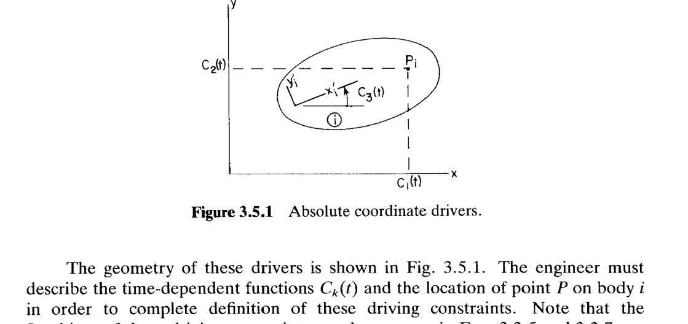
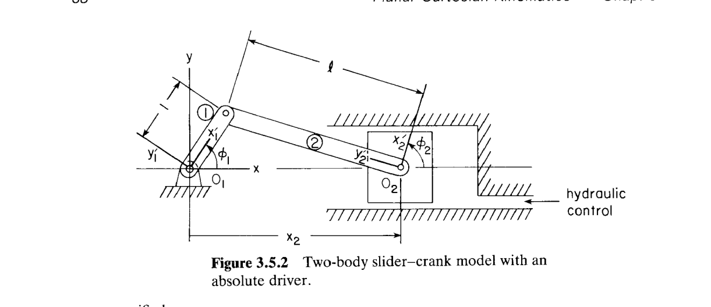
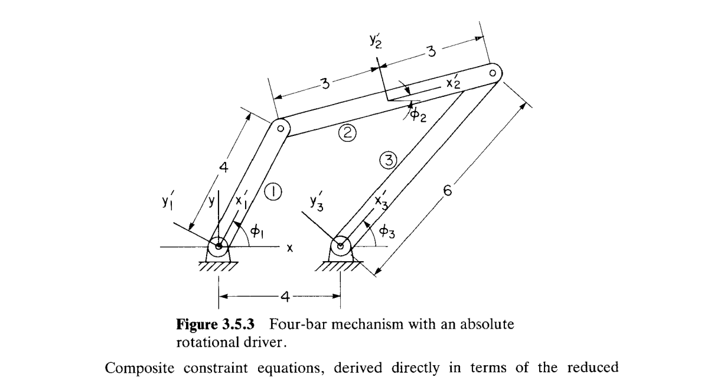
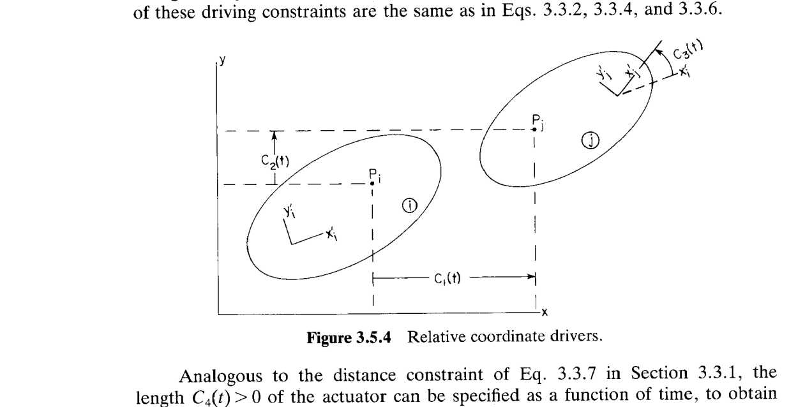
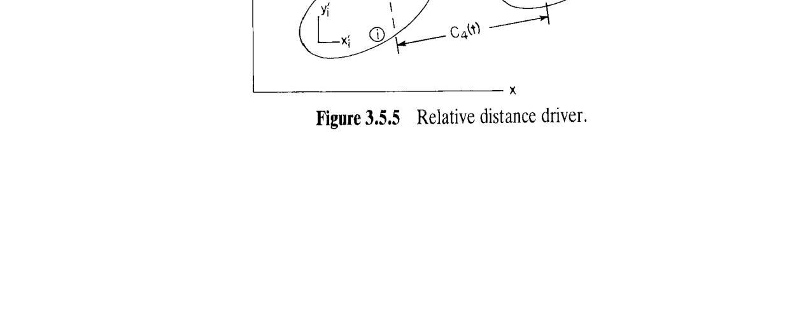
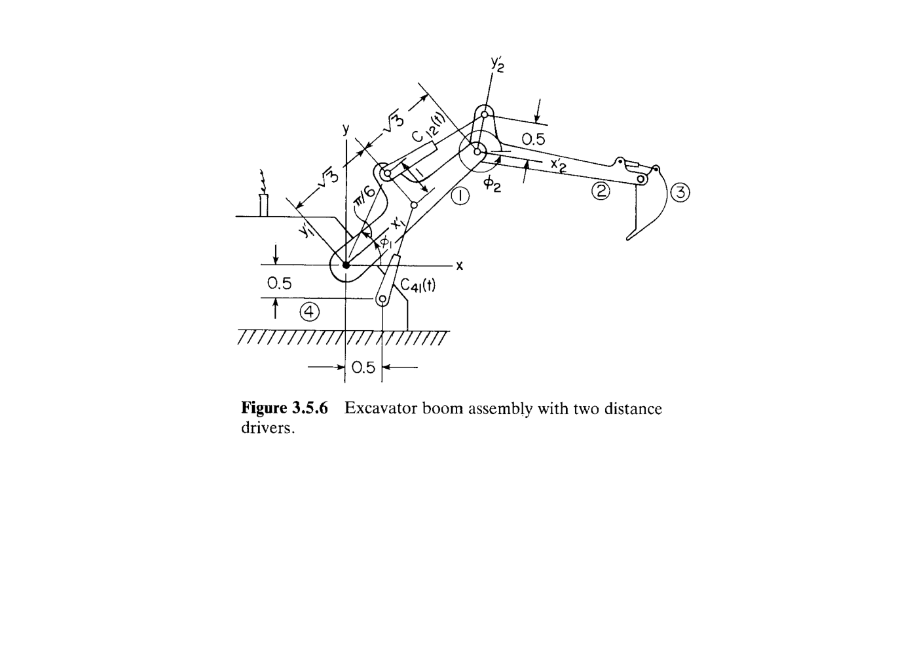
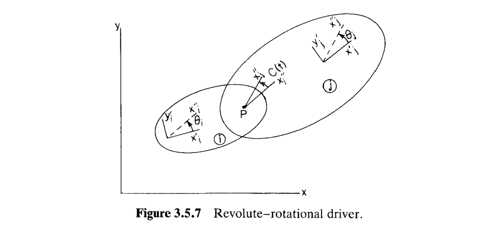
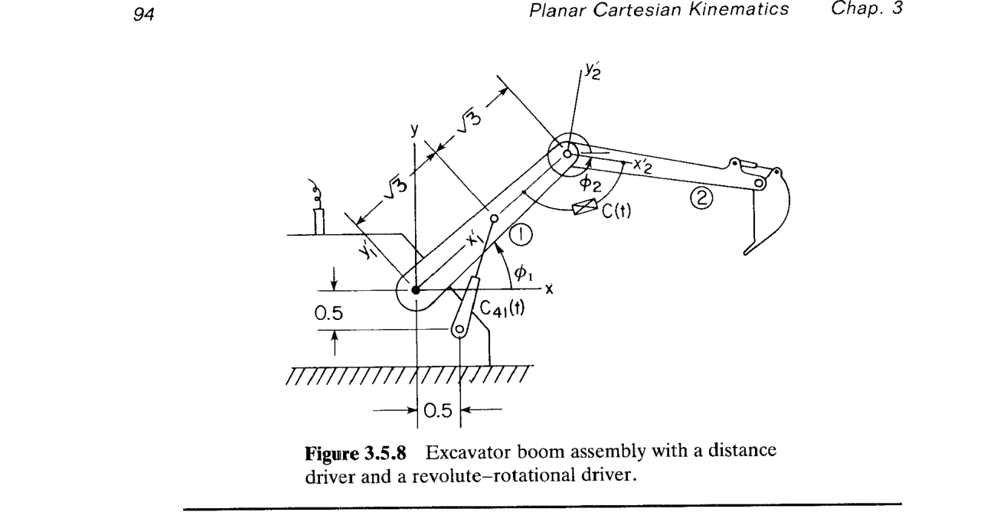
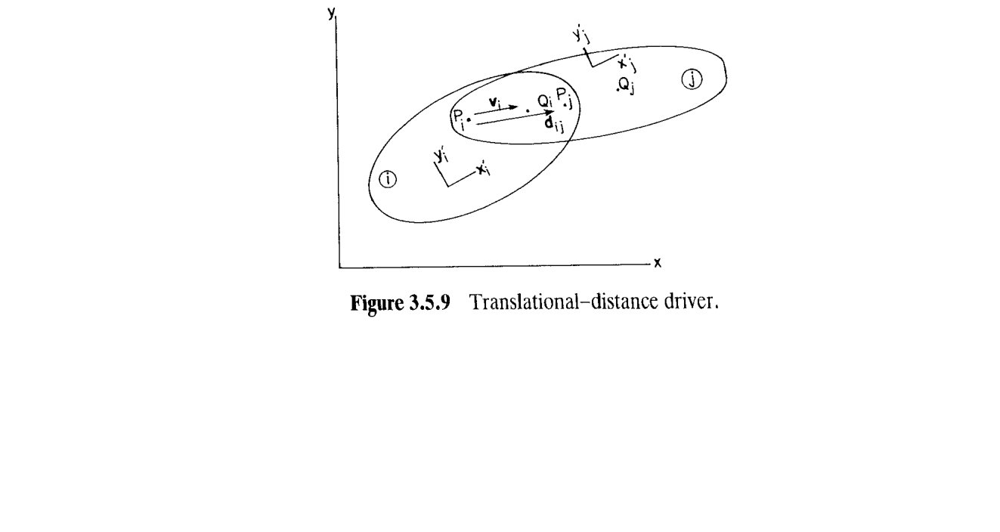
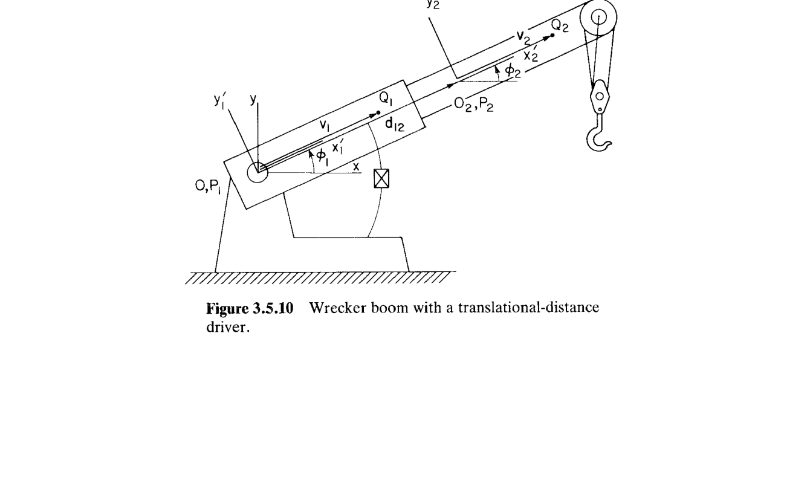

# 3.5 驱动约束 (Driving Constraints)

> 来源：*Computer Aided Kinematics and Dynamics of Mechanical Systems, Vol. 1*，第 3 章，3.5 节（书页 86–97）。
> 本文以"文字讲解 + 逐式详细推导"组织，公式推导不跳步骤；例题保留完整推导，包括每个速度方程的求解过程。

---

## 引言：本节要解决什么

3.2 ~ 3.4 节建立了**运动学约束 (kinematic constraint)** 库，这类约束描述刚体间的物理连接，仅是广义坐标 $\mathbf{q}$ 的函数，与时间无关；它们**不能唯一确定**机构的运动，还留有若干自由度。本节引入**驱动约束（driving constraint，简称 driver）**——一族显式含时间的约束，用来描述执行器 (actuator) 输入。若指定的驱动约束数量恰等于系统自由度 $\text{DOF}$，那么 $nh + \text{DOF} = nc$，方程数与未知数相同，机构的构型 $\mathbf{q}(t)$ 就随时间被唯一确定。

主线逻辑：

1. **绝对驱动 (3.5.1)**：把 3.2 节中的绝对坐标约束里的常数 $C_k$ 换成时间函数 $C_k(t)$，即得三种"绝对坐标驱动"（Eq. 3.5.1–3.5.3）。
2. **相对驱动 (3.5.2)**：把 3.3 节中的相对坐标/距离约束里的常数换成时间函数，得到相对坐标驱动（Eq. 3.5.5–3.5.8）；再新增两个物理常见的驱动——转动关节的**转角驱动**（Eq. 3.5.11）与移动关节的**平移-距离驱动**（Eq. 3.5.12）。
3. **右端项 (3.5.3)**：所有驱动都可写成 $\boldsymbol{\Phi}^d(\mathbf{q},t) = \boldsymbol{\Phi}(\mathbf{q}) - \mathbf{C}(t) = \mathbf{0}$ 的分离形式（除**平移-距离驱动**因几何原因略有不同），据此推出速度方程右端 $\boldsymbol{\nu}^d = \dot{\mathbf{C}}(t)$ 和加速度方程右端 $\boldsymbol{\gamma}^d = \boldsymbol{\gamma} + \ddot{\mathbf{C}}(t)$（Eq. 3.5.20、3.5.21），并汇总于 Table 3.5.1。

**关键观察**：驱动与运动学约束**共用同一个雅可比 (Jacobian) 矩阵** $\boldsymbol{\Phi}_\mathbf{q}$（因为只改变了时间项，未改 $\mathbf{q}$ 上的形式），且驱动约束的雅可比表达式与其"母约束"完全相同（Eqs. 3.2.5、3.2.7、3.3.2、3.3.4、3.3.6、3.3.8）。这大幅简化了实现——只需在原本的约束求值管道上，把常数项替换为随时间变化的函数并单独维护 $\dot C(t)$、$\ddot C(t)$ 即可。

---

## 3.5.1 绝对驱动 (Absolute Drivers)

### 思路

3.2 节中，绝对坐标约束

$$
\Phi^{ax(i)} = x_i^P - C_1 = 0,\quad \Phi^{ay(i)} = y_i^P - C_2 = 0,\quad \Phi^{a\phi(i)} = \phi_i - C_3 = 0
$$

物理上表示"体 $i$ 上的点 $P$ 或体 $i$ 的转角被钉在固定位置/角度"。若把常数 $C_k$ 换成时间函数 $C_k(t)$，则该点/角度按预定轨迹随时间移动，即为一个执行器输入。

### 三种绝对驱动

$$
\begin{aligned}
\Phi^{axd(i)} &= x_i^P - C_1(t) = 0 & \text{(3.5.1)}\\
\Phi^{ayd(i)} &= y_i^P - C_2(t) = 0 & \text{(3.5.2)}\\
\Phi^{a\phi d(i)} &= \phi_i - C_3(t) = 0 & \text{(3.5.3)}
\end{aligned}
$$

几何示意见图 3.5.1：$C_1(t)$ 是被驱动点 $P_i$ 沿 $x$ 方向的时间轨迹，$C_2(t)$ 沿 $y$，$C_3(t)$ 是体 $i$ 的转角。工程师须给出 $C_k(t)$ 及点 $P$ 在体 $i$ 上的位置 $\mathbf{s}_i'^P = [x_i'^P, y_i'^P]^T$。

**关键性质**：这三个驱动的**雅可比矩阵**与 Eqs. 3.2.5、3.2.7 中同款的绝对约束**完全一致**——因为 $C_k(t)$ 只是时间函数，对 $\mathbf{q}$ 求偏导时被视作常数。例如：

$$
\Phi^{axd(i)}_{\mathbf{q}_i} = [\,1,\ 0,\ -x_i'^P \sin\phi_i - y_i'^P \cos\phi_i\,]
$$

——与 3.2 节相应绝对约束的雅可比一模一样。

---

### 例 3.5.1：两体曲柄-滑块，液压驱动

> 图 3.5.2 中，滑块（body 2）的水平位置由液压伺服直接控制。曲柄（body 1）绕原点 $O_1$ 转，铰接到滑块的一个内槽端。

**驱动约束**（滑块 $x$ 坐标沿正弦规律移动）：

$$
x_2 = \sqrt{\ell^2 - 1} + \tfrac{1}{2}\sin\omega t = C(t) \tag{3.5.4}
$$

其中 $\ell > 1$，$\omega$ 为常数。取简化广义坐标

$$
\mathbf{q} = [x_2,\ \phi_1,\ \phi_2]^T
$$

（其余坐标——$y_1 = 0$、体 1 的 $x_1$ 由铰在 $O_1$ 固定为 0、滑块无 $y$ 位移——都作为几何常量吸收）。

**装配复合约束**：结合 Example 3.1.2（两体曲柄-滑块的两条几何约束）与式 (3.5.4)：

$$
\boldsymbol{\Phi}(\mathbf{q}) = 
\begin{bmatrix}
-x_2 + \cos\phi_1 + \ell\sin\phi_2\\
\sin\phi_1 - \ell\cos\phi_2\\
x_2 - \sqrt{\ell^2 - 1} - \tfrac{1}{2}\sin\omega t
\end{bmatrix} = \mathbf{0}
$$

其中前两行来自"曲柄末端 $(\cos\phi_1,\sin\phi_1)$ = 滑块上偏移 $\ell$ 后的一点 $(x_2 - \ell\sin\phi_2,\ \ell\cos\phi_2)$"，第三行即 (3.5.4)。

**速度方程**——对 $\boldsymbol{\Phi}$ 逐行求时间导数：

- 第 1 行：$\dfrac{d}{dt}(-x_2 + \cos\phi_1 + \ell\sin\phi_2) = -\dot x_2 - \sin\phi_1 \,\dot\phi_1 + \ell\cos\phi_2\,\dot\phi_2 = 0$。
- 第 2 行：$\dfrac{d}{dt}(\sin\phi_1 - \ell\cos\phi_2) = \cos\phi_1\,\dot\phi_1 + \ell\sin\phi_2\,\dot\phi_2 = 0$。
- 第 3 行：$\dfrac{d}{dt}(x_2 - \sqrt{\ell^2-1} - \tfrac{1}{2}\sin\omega t) = \dot x_2 - \tfrac{1}{2}\omega\cos\omega t = 0$。

写成矩阵：

$$
\underbrace{\begin{bmatrix}
-1 & -\sin\phi_1 & \ell\cos\phi_2\\
0 & \cos\phi_1 & \ell\sin\phi_2\\
1 & 0 & 0
\end{bmatrix}}_{\boldsymbol{\Phi}_\mathbf{q}}
\begin{bmatrix} \dot x_2\\ \dot\phi_1\\ \dot\phi_2 \end{bmatrix}
= 
\begin{bmatrix} 0\\ 0\\ \tfrac{1}{2}\omega\cos\omega t \end{bmatrix}
$$

**逐步解出 $\dot\phi_1$**。

第 3 行给出 $\dot x_2 = \tfrac{1}{2}\omega\cos\omega t$。代入第 1 行：

$$
-\tfrac{1}{2}\omega\cos\omega t - \sin\phi_1\,\dot\phi_1 + \ell\cos\phi_2\,\dot\phi_2 = 0
\quad\Rightarrow\quad
\ell\cos\phi_2\,\dot\phi_2 = \tfrac{1}{2}\omega\cos\omega t + \sin\phi_1\,\dot\phi_1 \tag{*}
$$

从第 2 行（设 $\sin\phi_2 \ne 0$）：

$$
\ell\sin\phi_2\,\dot\phi_2 = -\cos\phi_1\,\dot\phi_1
\quad\Rightarrow\quad
\ell\dot\phi_2 = -\frac{\cos\phi_1}{\sin\phi_2}\,\dot\phi_1
$$

再乘 $\cos\phi_2$：

$$
\ell\cos\phi_2\,\dot\phi_2 = -\frac{\cos\phi_2 \cos\phi_1}{\sin\phi_2}\,\dot\phi_1
$$

代入 (*)：

$$
-\frac{\cos\phi_2 \cos\phi_1}{\sin\phi_2}\,\dot\phi_1 = \tfrac{1}{2}\omega\cos\omega t + \sin\phi_1\,\dot\phi_1
$$

$$
-\dot\phi_1 \left[\frac{\cos\phi_2 \cos\phi_1 + \sin\phi_1\sin\phi_2}{\sin\phi_2}\right] = \tfrac{1}{2}\omega\cos\omega t
$$

用 $\cos(\phi_1 - \phi_2) = \cos\phi_1\cos\phi_2 + \sin\phi_1\sin\phi_2$：

$$
-\dot\phi_1 \cdot \frac{\cos(\phi_1 - \phi_2)}{\sin\phi_2} = \tfrac{1}{2}\omega\cos\omega t
$$

$$
\boxed{\ \dot\phi_1 = -\frac{\omega\sin\phi_2\cos\omega t}{2\cos(\phi_1 - \phi_2)}\ } \tag{3.5.1a}
$$

**奇异行为**：分母 $\cos(\phi_1 - \phi_2) \to 0$（即 $\phi_1 = \phi_2 + (\tfrac{1}{2} + k)\pi$）时，若分子不同时消失则 $\dot\phi_1 \to \infty$——这是**奇异构型（singular configuration）**，物理上曲柄与滑块的槽同轴且铰接点转到"死点"，无法继续被驱动。详见 3.7 节。

---

### 例 3.5.2：四杆机构，绝对转角驱动

> 图 3.5.3 中，输入曲柄 $\phi_1$ 由马达直接控制：$\phi_1 = \omega t$；这是**绝对转角驱动**（因为地面被视为惯性系）。

**广义坐标**：$\mathbf{q} = [\phi_1,\ x_2,\ y_2,\ \phi_2,\ \phi_3]^T$；曲柄长 4，耦合体 (coupler，body 2) 长 6（原点在中点），摇杆长 6，机架 4；两地面铰在 $(0,0)$ 与 $(4,0)$。

**复合约束的每一行**：

- 铰在曲柄末端 $=$ 耦合体后端 $(x_2 - 3\cos\phi_2,\ y_2 - 3\sin\phi_2)$：
  $x_2 - 4\cos\phi_1 - 3\cos\phi_2 = 0$ 与 $y_2 - 4\sin\phi_1 - 3\sin\phi_2 = 0$。
- 铰在摇杆末端 $(4 + 6\cos\phi_3,\ 6\sin\phi_3) =$ 耦合体前端 $(x_2 + 3\cos\phi_2,\ y_2 + 3\sin\phi_2)$。把 $x_2$、$y_2$ 用上两式换掉：

$$
4\cos\phi_1 + 3\cos\phi_2 + 3\cos\phi_2 - 4 - 6\cos\phi_3 = 0 \iff 4 - 4\cos\phi_1 - 6\cos\phi_2 + 6\cos\phi_3 = 0
$$

$$
4\sin\phi_1 + 3\sin\phi_2 + 3\sin\phi_2 - 6\sin\phi_3 = 0 \iff 4\sin\phi_1 + 6\sin\phi_2 - 6\sin\phi_3 = 0
$$

- 驱动：$\phi_1 - \omega t = 0$。

合起来：

$$
\boldsymbol{\Phi}(\mathbf{q}) = 
\begin{bmatrix}
x_2 - 4\cos\phi_1 - 3\cos\phi_2\\
y_2 - 4\sin\phi_1 - 3\sin\phi_2\\
4 - 4\cos\phi_1 - 6\cos\phi_2 + 6\cos\phi_3\\
4\sin\phi_1 + 6\sin\phi_2 - 6\sin\phi_3\\
\phi_1 - \omega t
\end{bmatrix} = \mathbf{0}
$$

**速度方程**（对 $\mathbf{q} = [\phi_1, x_2, y_2, \phi_2, \phi_3]^T$ 逐行微分）：

$$
\begin{bmatrix}
4\sin\phi_1 & 1 & 0 & 3\sin\phi_2 & 0\\
-4\cos\phi_1 & 0 & 1 & -3\cos\phi_2 & 0\\
4\sin\phi_1 & 0 & 0 & 6\sin\phi_2 & -6\sin\phi_3\\
4\cos\phi_1 & 0 & 0 & 6\cos\phi_2 & -6\cos\phi_3\\
1 & 0 & 0 & 0 & 0
\end{bmatrix}
\begin{bmatrix} \dot\phi_1\\ \dot x_2\\ \dot y_2\\ \dot\phi_2\\ \dot\phi_3\end{bmatrix}
=
\begin{bmatrix} 0\\ 0\\ 0\\ 0\\ \omega \end{bmatrix}
$$

**逐步求解**。

**第 5 行直接给出** $\dot\phi_1 = \omega$。

**第 3、4 行**用 $\dot\phi_1 = \omega$ 消去 $\phi_1$：

$$
\begin{aligned}
6\sin\phi_2\,\dot\phi_2 - 6\sin\phi_3\,\dot\phi_3 &= -4\omega\sin\phi_1\\
6\cos\phi_2\,\dot\phi_2 - 6\cos\phi_3\,\dot\phi_3 &= -4\omega\cos\phi_1
\end{aligned}
$$

用 Cramer 法则求 $\dot\phi_2$、$\dot\phi_3$。设

$$
D = \det\!\begin{bmatrix} 6\sin\phi_2 & -6\sin\phi_3\\ 6\cos\phi_2 & -6\cos\phi_3\end{bmatrix}
= -36\sin\phi_2\cos\phi_3 + 36\sin\phi_3\cos\phi_2 = -36\sin(\phi_2 - \phi_3)
$$

（用了 $\sin(a - b) = \sin a\cos b - \cos a\sin b$）。

$$
\dot\phi_2 = \frac{1}{D}\det\!\begin{bmatrix} -4\omega\sin\phi_1 & -6\sin\phi_3\\ -4\omega\cos\phi_1 & -6\cos\phi_3\end{bmatrix}
= \frac{24\omega(\sin\phi_1\cos\phi_3 - \sin\phi_3\cos\phi_1)}{D}
= \frac{24\omega\sin(\phi_1 - \phi_3)}{-36\sin(\phi_2 - \phi_3)}
$$

$$
\boxed{\ \dot\phi_2 = \frac{2\omega\sin(\phi_3 - \phi_1)}{3\sin(\phi_2 - \phi_3)}\ }
$$

（用 $\sin(\phi_1 - \phi_3) = -\sin(\phi_3 - \phi_1)$，与负号并合）。

$$
\dot\phi_3 = \frac{1}{D}\det\!\begin{bmatrix} 6\sin\phi_2 & -4\omega\sin\phi_1\\ 6\cos\phi_2 & -4\omega\cos\phi_1\end{bmatrix}
= \frac{-24\omega\sin\phi_2\cos\phi_1 + 24\omega\sin\phi_1\cos\phi_2}{D}
= \frac{24\omega\sin(\phi_1 - \phi_2)}{-36\sin(\phi_2 - \phi_3)}
$$

$$
\boxed{\ \dot\phi_3 = -\frac{2\omega\sin(\phi_1 - \phi_2)}{3\sin(\phi_2 - \phi_3)}\ }
$$

> **勘误提示**：书中把 $\dot\phi_3$ 写成 $-\dfrac{2\omega\sin(\phi_1 - \phi_2)}{\sin(\phi_2 - \phi_3)}$，**丢了分母上的 $3$**。可用数值验证：取 $\phi_1 = 0$，$\phi_2 = \pi/4$，$\phi_3 = \pi/2$，代入原速度方程第 3 行 $4\sin\phi_1\cdot\omega + 6\sin\phi_2\,\dot\phi_2 - 6\sin\phi_3\,\dot\phi_3 = 0$ 直接求出 $\dot\phi_3 = -\tfrac{2}{3}\omega$，与本节 $2/3$ 系数一致。

**最后回代**第 1、2 行解 $\dot x_2$、$\dot y_2$：

$$
\dot x_2 = -4\omega\sin\phi_1 - 3\sin\phi_2\,\dot\phi_2
= -4\omega\sin\phi_1 - 3\sin\phi_2\cdot\frac{2\omega\sin(\phi_3 - \phi_1)}{3\sin(\phi_2 - \phi_3)}
$$

$$
\boxed{\ \dot x_2 = -4\omega\sin\phi_1 - 2\omega\sin\phi_2\,\frac{\sin(\phi_3 - \phi_1)}{\sin(\phi_2 - \phi_3)}\ }
$$

$$
\dot y_2 = 4\omega\cos\phi_1 + 3\cos\phi_2\,\dot\phi_2
= 4\omega\cos\phi_1 + 2\omega\cos\phi_2\,\frac{\sin(\phi_3 - \phi_1)}{\sin(\phi_2 - \phi_3)}
$$

**物理注**：文中说，若地面**未**被建模为一个刚体（即 $\phi_1$ 不再是"相对地面"的转角，而是"相对参考系"的转角），那么这也是一种**绝对**转角驱动——因为参考系与地面等价。若地面被显式建模为一个 body（如 Example 3.3.2(1)），驱动就变成两体间的**相对**转角，属于下节 3.5.2 范畴。

---

## 3.5.2 相对驱动 (Relative Drivers)

### 思路

3.3 节的**相对约束**（Eq. 3.3.1、3.3.3、3.3.5、3.3.7）描述"两体上两点的坐标差为常数"或"两体转角差为常数"。把这些常数换成时间函数即得相对驱动，物理上对应两体间的**相对位置执行器**——机器人臂关节、液压伸缩杆、数控机床的进给轴都是这样的输入。

### 相对坐标驱动 (Eqs. 3.5.5–3.5.7)

$$
\begin{aligned}
\Phi^{rxd(i,j)} &= x_j^P - x_i^P - C_1(t) = 0 & \text{(3.5.5)}\\
\Phi^{ryd(i,j)} &= y_j^P - y_i^P - C_2(t) = 0 & \text{(3.5.6)}\\
\Phi^{r\phi d(i,j)} &= \phi_j - \phi_i - C_3(t) = 0 & \text{(3.5.7)}
\end{aligned}
$$

几何见图 3.5.4：$C_1(t)$ 是体 $j$ 上点 $P_j$ 相对体 $i$ 上点 $P_i$ 在 $x$ 方向的时间轨迹，其余类推。

**雅可比**与 Eqs. 3.3.2、3.3.4、3.3.6 中的相对约束一致（$C_k(t)$ 对 $\mathbf{q}$ 求偏导为 $0$）。

### 相对距离驱动 (Eq. 3.5.8)

$$
\Phi^{rdd(i,j)} = (x_j^P - x_i^P)^2 + (y_j^P - y_i^P)^2 - (C_4(t))^2 = 0 \tag{3.5.8}
$$

物理上：体 $i$ 上点 $P_i$ 到体 $j$ 上点 $P_j$ 的距离等于 $C_4(t) > 0$（例如液压伸缩杆的当前长度）。

**关键条件** $C_4(t) > 0$：若允许 $C_4 = 0$，则 (3.5.8) 退化为 $(x_j^P - x_i^P)^2 + (y_j^P - y_i^P)^2 = 0$，即 $P_i = P_j$，等价于两条标量方程（$x_j^P - x_i^P = 0$ 且 $y_j^P - y_i^P = 0$）——这刚好是**转动关节**约束！一个驱动突然变成两个约束，方程数错乱、雅可比在该处退化。因此必须要求 $C_4(t) > 0$（即使短暂经过 $0$ 也不允许）。

**雅可比**同 Eq. 3.3.8（差别仅在时间项被单独提出）。物理理解：距离驱动可用液压缸实现——通过控制缸内液体体积来指定杆件长度的时间轨迹。

---

### 例 3.5.3：双液压缸挖掘机臂

> 图 3.5.6：挖掘机的**臂总成**（不含铲斗执行器）有两个液压驱动：$C_{41}(t)$ 在地面 (4) 与臂 (1) 之间，$C_{12}(t)$ 在臂 (1) 与延伸段 (2) 之间。

**几何与常量**：
- 体 1 的原点在地面铰接点 $O = (0, 0)$；驱动输入函数
  $$C_{41}(t) = \tfrac{1}{5}t + 1.8,\quad C_{12}(t) = \tfrac{1}{10}t + 1.9$$
- 广义坐标 $\mathbf{q} = [\phi_1,\ x_2,\ y_2,\ \phi_2]^T$。
- 关键点在体 1 上：铰接体 2 用的点 $(2\sqrt3, 0)$（体 1 前端）；驱动 $C_{41}$ 的挂点 $(\sqrt3, 0)$；驱动 $C_{12}$ 的挂点 $(\sqrt3, 1) \equiv 2\,(\cos\tfrac{\pi}{6},\sin\tfrac{\pi}{6})$。地面上驱动 $C_{41}$ 的挂点在 $(0.5, -0.5)$。体 2 上驱动 $C_{12}$ 的挂点在体固定坐标 $(0, 0.5)$（即从体 2 原点沿 $y_2'$ 偏 $0.5$）。

**复合约束**共 4 条：

1. **体 1 前端与体 2 原点重合（转动关节）**：体 1 前端全局位置 $\mathbf{A}_1\,(2\sqrt3, 0)^T = (2\sqrt3\cos\phi_1,\ 2\sqrt3\sin\phi_1)$ 等于 $(x_2, y_2)$：

   $$x_2 - 2\sqrt3\cos\phi_1 = 0,\qquad y_2 - 2\sqrt3\sin\phi_1 = 0$$

2. **地面-体 1 距离驱动** $C_{41}$：距离平方等于 $C_{41}^2$。体 1 挂点全局位置 $(\sqrt3\cos\phi_1,\ \sqrt3\sin\phi_1)$，地面挂点 $(0.5, -0.5)$：

   $$(\sqrt3\cos\phi_1 - 0.5)^2 + (\sqrt3\sin\phi_1 + 0.5)^2 - (C_{41}(t))^2 = 0$$

3. **体 1-体 2 距离驱动** $C_{12}$：体 1 挂点全局 $(2\cos(\phi_1 + \tfrac{\pi}{6}),\ 2\sin(\phi_1 + \tfrac{\pi}{6}))$（由 $\mathbf{A}_1(\sqrt3, 1)^T = 2\mathbf{A}_1(\cos\tfrac{\pi}{6}, \sin\tfrac{\pi}{6})^T$）；体 2 挂点全局 $(x_2, y_2) + \mathbf{A}_2(0, 0.5)^T = (x_2 - 0.5\sin\phi_2,\ y_2 + 0.5\cos\phi_2)$。定义

   $$
   u = 2\cos(\phi_1 + \tfrac{\pi}{6}) - (x_2 - 0.5\sin\phi_2),\quad
   v = 2\sin(\phi_1 + \tfrac{\pi}{6}) - (y_2 + 0.5\cos\phi_2)
   $$

   驱动约束就是 $u^2 + v^2 - (C_{12}(t))^2 = 0$。

汇总：

$$
\boldsymbol{\Phi}(\mathbf{q}) = 
\begin{bmatrix}
x_2 - 2\sqrt3\cos\phi_1\\
y_2 - 2\sqrt3\sin\phi_1\\
(\sqrt3\cos\phi_1 - 0.5)^2 + (\sqrt3\sin\phi_1 + 0.5)^2 - (C_{41}(t))^2\\
u^2 + v^2 - (C_{12}(t))^2
\end{bmatrix} = \mathbf{0} \tag{3.5.9}
$$

**速度方程**——逐行求时间导数：

- 第 1 行 $\dot{}$：$\dot x_2 - 2\sqrt3\cdot(-\sin\phi_1)\dot\phi_1 = 2\sqrt3\sin\phi_1\,\dot\phi_1 + \dot x_2 = 0$。
- 第 2 行 $\dot{}$：$\dot y_2 - 2\sqrt3\cos\phi_1\,\dot\phi_1 = 0$，即 $-2\sqrt3\cos\phi_1\,\dot\phi_1 + \dot y_2 = 0$。
- 第 3 行 $\dot{}$：
  $$2(\sqrt3\cos\phi_1 - 0.5)(-\sqrt3\sin\phi_1)\dot\phi_1 + 2(\sqrt3\sin\phi_1 + 0.5)(\sqrt3\cos\phi_1)\dot\phi_1 = 2C_{41}\dot C_{41}$$

  即 $\phi_1$ 前系数 $= -2\sqrt3(\sqrt3\cos\phi_1 - 0.5)\sin\phi_1 + 2\sqrt3(\sqrt3\sin\phi_1 + 0.5)\cos\phi_1$，右端 $= 2C_{41}\dot C_{41}$。因 $C_{41} = (t + 9)/5$、$\dot C_{41} = 1/5$，右端 $= 2\cdot\dfrac{t+9}{5}\cdot\dfrac{1}{5} = \dfrac{2((1/5)t + 1.8)}{5}$。

- 第 4 行 $\dot{}$：先算 $\dot u$、$\dot v$：
  $$
  \dot u = -2\sin(\phi_1 + \tfrac{\pi}{6})\,\dot\phi_1 - \dot x_2 + 0.5\cos\phi_2\,\dot\phi_2
  $$
  $$
  \dot v = 2\cos(\phi_1 + \tfrac{\pi}{6})\,\dot\phi_1 - \dot y_2 + 0.5\sin\phi_2\,\dot\phi_2
  $$

  代入 $\dfrac{d}{dt}(u^2 + v^2 - C_{12}^2) = 2u\dot u + 2v\dot v - 2C_{12}\dot C_{12} = 0$：

  - $\dot\phi_1$ 前系数 $= 2u\,(-2\sin(\phi_1 + \tfrac{\pi}{6})) + 2v\,(2\cos(\phi_1 + \tfrac{\pi}{6})) = -4u\sin(\phi_1 + \tfrac{\pi}{6}) + 4v\cos(\phi_1 + \tfrac{\pi}{6})$。
  - $\dot x_2$ 前系数 $= 2u(-1) = -2u$。
  - $\dot y_2$ 前系数 $= 2v(-1) = -2v$。
  - $\dot\phi_2$ 前系数 $= 2u(0.5\cos\phi_2) + 2v(0.5\sin\phi_2) = u\cos\phi_2 + v\sin\phi_2$。
  - 右端 $= 2C_{12}\dot C_{12} = 2\cdot\dfrac{t+19}{10}\cdot\dfrac{1}{10} = \dfrac{(1/10)t + 1.9}{5}$。

合并即得**书中 Eq. 3.5.10**：

$$
\begin{bmatrix}
2\sqrt3\sin\phi_1 & 1 & 0 & 0\\[2pt]
-2\sqrt3\cos\phi_1 & 0 & 1 & 0\\[2pt]
\begin{aligned}
&-2\sqrt3(\sqrt3\cos\phi_1 - 0.5)\sin\phi_1\\
&+ 2\sqrt3(\sqrt3\sin\phi_1 + 0.5)\cos\phi_1
\end{aligned} & 0 & 0 & 0\\[8pt]
\begin{aligned}
&-4u\sin(\phi_1 + \tfrac{\pi}{6})\\
&+ 4v\cos(\phi_1 + \tfrac{\pi}{6})
\end{aligned} & -2u & -2v &
\begin{aligned}
u\cos\phi_2\\ + v\sin\phi_2
\end{aligned}
\end{bmatrix}
\begin{bmatrix} \dot\phi_1\\ \dot x_2\\ \dot y_2\\ \dot\phi_2 \end{bmatrix}
=
\begin{bmatrix}
0\\ 0\\[6pt] \dfrac{2((1/5)t + 1.8)}{5}\\[6pt] \dfrac{(1/10)t + 1.9}{5}
\end{bmatrix} \tag{3.5.10}
$$

**求解结构**：第 3 行**只**含 $\dot\phi_1$，可直接解：设 $K := 2\sqrt3\bigl[(\sqrt3\sin\phi_1 + 0.5)\cos\phi_1 - (\sqrt3\cos\phi_1 - 0.5)\sin\phi_1\bigr]$，则

$$
\dot\phi_1 = \frac{2(t+9)/25}{K}
= \frac{t + 9}{-25\sqrt3\bigl[(\sqrt3\cos\phi_1 - 0.5)\sin\phi_1 - (\sqrt3\sin\phi_1 + 0.5)\cos\phi_1\bigr]}
$$

（将 $2\sqrt3$ 提到分母外并把括号翻号），这正是书中 $\dot\phi_1$ 的表达式。有了 $\dot\phi_1$，第 1、2 行给出 $\dot x_2 = -2\sqrt3\sin\phi_1\,\dot\phi_1$、$\dot y_2 = 2\sqrt3\cos\phi_1\,\dot\phi_1$；再用第 4 行解 $\dot\phi_2$：整理

$$
(u\cos\phi_2 + v\sin\phi_2)\dot\phi_2 = C - A + 4\sqrt3\,u\sin\phi_1\,\dot\phi_1 - 4\sqrt3\,v\cos\phi_1\,\dot\phi_1
$$

其中

$$
\begin{aligned}
A &= -4\{2\cos(\phi_1 + \tfrac{\pi}{6}) - x_2 + 0.5\sin\phi_2\}\sin(\phi_1 + \tfrac{\pi}{6}) + 4\{2\sin(\phi_1 + \tfrac{\pi}{6}) - y_2 - 0.5\cos\phi_2\}\cos(\phi_1 + \tfrac{\pi}{6})\\
B &= \{2\cos(\phi_1 + \tfrac{\pi}{6}) - x_2 + 0.5\sin\phi_2\}\cos\phi_2 + \{2\sin(\phi_1 + \tfrac{\pi}{6}) - y_2 - 0.5\cos\phi_2\}\sin\phi_2\\
C &= \frac{t+19}{50}
\end{aligned}
$$

（$A$ = 第 4 行 $\dot\phi_1$ 前系数中把 $\dot x_2$、$\dot y_2$ 代掉后的合并；$B$ = 第 4 行 $\dot\phi_2$ 前系数即 $u\cos\phi_2 + v\sin\phi_2$；$C$ = 右端除以 $2$ 得到），最终

$$
\boxed{\ \dot\phi_2 = \frac{1}{B}\{C - A + 4\sqrt3\,u\sin\phi_1\,\dot\phi_1 - 4\sqrt3\,v\cos\phi_1\,\dot\phi_1\}\ }
$$

**物理意义**：$C_{41}$ 直接决定 $\phi_1$（因为体 4 与体 1 之间的距离只与 $\phi_1$ 有关，其他坐标都是被动跟随的）；$C_{12}$ 随后决定 $\phi_2$。这是一种"层级"驱动结构，任一个 $C$ 出错都会立即传播。

---

### 转动关节-转角驱动 (revolute-rotational driver, Eq. 3.5.11)

**动机**：机器人肘关节、旋转液压马达等，直接控制**两体在转动关节处的相对角度**——比"绝对转角"更具物理意义（因为往往难以拿到惯性系角度）。

$$
\Phi^{rrd(i,j)} = (\phi_j + \theta_j) - (\phi_i + \theta_i) - C(t) = 0 \tag{3.5.11}
$$

其中 $\theta_i$、$\theta_j$ 是执行器在体 $i$、$j$ 上的**安装角**（由物理安装决定的固定量），$C(t)$ 是"$x_j''$-轴相对 $x_i''$-轴"的时间函数（逆时针为正）。$x_i''$ 是从 $x_i'$ 转过 $\theta_i$ 得到的辅助轴——所以 $\phi_i + \theta_i$ 就是 $x_i''$ 相对全局 $x$ 的绝对角度。

**雅可比同 Eq. 3.3.6**（相对转角约束的雅可比）：$\Phi^{rrd}_{\phi_i} = -1$，$\Phi^{rrd}_{\phi_j} = +1$，其他为 $0$。

---

### 例 3.5.4：挖掘机改用转角驱动

> 图 3.5.8：把 Example 3.5.3 中的 $C_{12}(t)$ 距离驱动换成转角驱动 $C(t) = \tfrac{t}{10}$。

安装角 $\theta_1 = \theta_2 = 0$（简化），驱动 (3.5.11) 变成

$$
\phi_2 - \phi_1 - \tfrac{t}{10} = 0
$$

即 Eq. (3.5.9) 的**第 4 行**被替换。速度方程的第 4 行相应变为

$$
[-1,\ 0,\ 0,\ 1]\,[\dot\phi_1,\ \dot x_2,\ \dot y_2,\ \dot\phi_2]^T = \tfrac{1}{10}
$$

即 $\dot\phi_2 - \dot\phi_1 = 0.1$。前 3 行未变，$\dot\phi_1$ 仍由第 3 行独立解出，然后

$$
\dot\phi_2 = \dot\phi_1 + \tfrac{1}{10}
= \frac{t + 9}{-25\sqrt3\{(\sqrt3\cos\phi_1 - 0.5)\sin\phi_1 - (\sqrt3\sin\phi_1 + 0.5)\cos\phi_1\}} + \frac{1}{10}
$$

与书中结论一致。改换驱动种类后**结构大幅简化**——原本需要联立解出的 $\dot\phi_2$ 现在只需在 $\dot\phi_1$ 基础上加常数。

---

### 平移-距离驱动 (translational-distance driver, Eq. 3.5.12)

**动机**：机器人直角关节、数控机床进给轴——**沿移动关节 (translational joint) 的相对平移距离**由执行器直接控制。

**几何**：体 $i$ 与 $j$ 由移动关节连接。$\mathbf{v}_i$ 是体 $i$ 上沿滑动方向的向量（$\mathbf{v}_i = \mathbf{A}_i\mathbf{v}_i'$，$\mathbf{v}_i'$ 是体固定的），$v_i = \lVert\mathbf{v}_i'\rVert$ 为常数。$\mathbf{d}_{ij} = \mathbf{r}_j + \mathbf{A}_j\mathbf{s}_j'^P - \mathbf{r}_i - \mathbf{A}_i\mathbf{s}_i'^P$ 是从点 $P_i$ 到点 $P_j$ 的向量。$C(t)$（可为零）是这段"沿方向 $\mathbf{v}_i$ 的有向距离"的时间函数。

**约束形式**（图注中的紧凑写法）：

$$
\frac{\mathbf{v}_i^T\mathbf{d}_{ij}}{v_i} - C(t) = 0
$$

即"$\mathbf{d}_{ij}$ 在 $\mathbf{v}_i$ 上的投影（有符号长度）等于 $C(t)$"。两侧乘 $v_i$（正常数），得等价形式 $\mathbf{v}_i^T\mathbf{d}_{ij} - v_i C(t) = 0$。**展开** $\mathbf{v}_i^T$、$\mathbf{d}_{ij}$（用 $\mathbf{A}_i^T\mathbf{A}_i = \mathbf{I}$、$\mathbf{A}_{ij} := \mathbf{A}_i^T\mathbf{A}_j$）：

$$
\begin{aligned}
\mathbf{v}_i^T\mathbf{d}_{ij} - v_i C
&= (\mathbf{A}_i\mathbf{v}_i')^T\bigl(\mathbf{r}_j + \mathbf{A}_j\mathbf{s}_j'^P - \mathbf{r}_i - \mathbf{A}_i\mathbf{s}_i'^P\bigr) - v_i C\\
&= \mathbf{v}_i'^T\mathbf{A}_i^T(\mathbf{r}_j - \mathbf{r}_i) + \mathbf{v}_i'^T\underbrace{\mathbf{A}_i^T\mathbf{A}_j}_{=\mathbf{A}_{ij}}\mathbf{s}_j'^P - \mathbf{v}_i'^T\underbrace{\mathbf{A}_i^T\mathbf{A}_i}_{=\mathbf{I}}\mathbf{s}_i'^P - v_i C
\end{aligned}
$$

**结果**：

$$
\boxed{\ \Phi^{tdd(i,j)} = \mathbf{v}_i'^T\mathbf{A}_i^T(\mathbf{r}_j - \mathbf{r}_i) + \mathbf{v}_i'^T\mathbf{A}_{ij}\mathbf{s}_j'^P - \mathbf{v}_i'^T\mathbf{s}_i'^P - v_i C(t) = 0\ } \tag{3.5.12}
$$

**注意**：因为移动关节强制 $\mathbf{A}_{ij}$ 为**常量**（两体只沿轴滑动，不相对转动），所以 $\phi_j$ 与 $\phi_i$ 差常量、$\mathbf{A}_j = \mathbf{A}_i\mathbf{A}_{ij}$ 中 $\phi_i$ 一变、$\phi_j$ 同步变。在推 Jacobian 时把 $\mathbf{A}_{ij}$ 视为常数——这就是书中所说"the fact that $\mathbf{A}_{ij}$ is constant is used"。

**雅可比推导**（Eq. 3.5.13）：把 (3.5.12) 分别对 $\mathbf{q}_i = (\mathbf{r}_i, \phi_i)$、$\mathbf{q}_j = (\mathbf{r}_j, \phi_j)$ 求偏导。

关于 $\mathbf{r}_i$：只有 $-\mathbf{v}_i'^T\mathbf{A}_i^T\mathbf{r}_i$ 项参与，$\dfrac{\partial}{\partial\mathbf{r}_i} = -\mathbf{v}_i'^T\mathbf{A}_i^T$（行向量 $1\times 2$）。

关于 $\phi_i$：$\mathbf{v}_i'^T\mathbf{A}_i^T(\mathbf{r}_j - \mathbf{r}_i)$ 项贡献 $\mathbf{v}_i'^T\dfrac{d\mathbf{A}_i^T}{d\phi_i}(\mathbf{r}_j - \mathbf{r}_i) = \mathbf{v}_i'^T\mathbf{B}_i^T(\mathbf{r}_j - \mathbf{r}_i)$（用 $\mathbf{B}_i = d\mathbf{A}_i/d\phi_i$，故 $d\mathbf{A}_i^T/d\phi_i = \mathbf{B}_i^T$）。$\mathbf{v}_i'^T\mathbf{A}_{ij}\mathbf{s}_j'^P$ 项因 $\mathbf{A}_{ij}$ 常数而对 $\phi_i$ 求导为 $0$。$-\mathbf{v}_i'^T\mathbf{s}_i'^P$ 项也不含 $\phi_i$。

关于 $\mathbf{r}_j$：只有 $\mathbf{v}_i'^T\mathbf{A}_i^T\mathbf{r}_j$ 项，$\dfrac{\partial}{\partial\mathbf{r}_j} = \mathbf{v}_i'^T\mathbf{A}_i^T$。

关于 $\phi_j$：所有 $\phi_j$ 只以 $\mathbf{A}_j = \mathbf{A}_i\mathbf{A}_{ij}$ 的形式出现，而 $\mathbf{A}_{ij}$ 常数意味着 $\mathbf{A}_j$ 由 $\phi_i$ 唯一决定，$\phi_j$ 在约束中**不独立**——形式上 $\dfrac{\partial}{\partial\phi_j} = 0$。

汇总：

$$
\boxed{\ 
\Phi^{tdd(i,j)}_{\mathbf{q}_i} = \bigl[\,-\mathbf{v}_i'^T\mathbf{A}_i^T,\ \mathbf{v}_i'^T\mathbf{B}_i^T(\mathbf{r}_j - \mathbf{r}_i)\,\bigr],\qquad
\Phi^{tdd(i,j)}_{\mathbf{q}_j} = \bigl[\,\mathbf{v}_i'^T\mathbf{A}_i^T,\ 0\,\bigr]
\ } \tag{3.5.13}
$$

---

### 例 3.5.5：起重机吊臂

> 图 3.5.10：吊臂由两体组成——body 1 为主吊臂（绕地面点 $O = P_1$ 转），body 2 为可伸缩的杆（沿主吊臂长度方向滑动）。转角 $\phi_1$ 由旋转执行器直接控制，$\phi_1 = 0.025\,t$；伸缩长度由平移-距离驱动控制，$C(t) = 0.1\,t$。

**几何**：
- 体 1 铰在原点 $O$（$P_1 = O$），$\mathbf{r}_1 = \mathbf{0}$，体 1 上沿滑动方向的向量 $\mathbf{v}_1' = (v_1, 0)^T$，故 $\mathbf{v}_1 = v_1(\cos\phi_1, \sin\phi_1)^T$。
- 体 2 与体 1 之间是**移动关节**——两体角度差为常数，取 $\phi_2 - \phi_1 = 0$（即 $\phi_2 = \phi_1$，滑轨上$\mathbf{A}_{12} = \mathbf{I}$）。体 2 的原点 $O_2 = P_2$，即 $\mathbf{s}_2'^P = \mathbf{0}$。$\mathbf{d}_{12} = (x_2, y_2)^T$。
- 广义坐标 $\mathbf{q} = [\phi_1, x_2, y_2, \phi_2]^T$。

**驱动**：
- 转动驱动 $\phi_1 = 0.025\,t \Rightarrow \phi_1 - 0.025\,t = 0$。 $\tag{3.5.14}$
- 平移-距离驱动，从 (3.5.12) 特殊化：$\mathbf{s}_1'^P = \mathbf{s}_2'^P = \mathbf{0}$，$\mathbf{r}_1 = \mathbf{0}$，故

  $$\Phi^{tdd(1,2)} = \mathbf{v}_1'^T\mathbf{A}_1^T\mathbf{r}_2 - v_1(0.1t) = v_1(x_2\cos\phi_1 + y_2\sin\phi_1) - v_1(0.1t) = 0$$

  展开时用 $\mathbf{v}_1'^T\mathbf{A}_1^T = (v_1, 0)\begin{bmatrix}\cos\phi_1 & \sin\phi_1\\-\sin\phi_1 & \cos\phi_1\end{bmatrix} = (v_1\cos\phi_1,\ v_1\sin\phi_1)$。除 $v_1$：

  $$x_2\cos\phi_1 + y_2\sin\phi_1 - 0.1t = 0 \tag{3.5.16}$$

**移动关节约束**：从 3.3.13（书页早前给出）：两个方程

- $(\mathbf{v}_1^\perp)^T(\mathbf{r}_2 - \mathbf{r}_1) = 0$：$\mathbf{v}_1^\perp = \mathbf{R}\mathbf{v}_1 = \begin{bmatrix}0&-1\\1&0\end{bmatrix}\begin{bmatrix}v_1\cos\phi_1\\v_1\sin\phi_1\end{bmatrix} = \begin{bmatrix}-v_1\sin\phi_1\\v_1\cos\phi_1\end{bmatrix}$。代入：$-v_1 x_2\sin\phi_1 + v_1 y_2\cos\phi_1 = 0$。除 $v_1$：

  $$-x_2\sin\phi_1 + y_2\cos\phi_1 = 0$$

- $(\mathbf{v}_1^\perp)^T\mathbf{v}_2 = 0$：$(-v_1\sin\phi_1)(v_2\cos\phi_2) + (v_1\cos\phi_1)(v_2\sin\phi_2) = v_1 v_2\sin(\phi_2 - \phi_1) = 0$。除 $v_1 v_2$：$\sin(\phi_2 - \phi_1) = 0$，即（取无歧义分支）$\sin(\phi_1 - \phi_2) = 0$。

**复合约束**（书 Eq. 3.5.16 附近）：

$$
\boldsymbol{\Phi}(\mathbf{q}) = 
\begin{bmatrix}
-x_2\sin\phi_1 + y_2\cos\phi_1\\
\sin(\phi_1 - \phi_2)\\
\phi_1 - 0.025\,t\\
x_2\cos\phi_1 + y_2\sin\phi_1 - 0.1\,t
\end{bmatrix} = \mathbf{0}
$$

**速度方程**——逐行求 $d/dt$：

- 第 1 行：$-\dot x_2\sin\phi_1 - x_2\cos\phi_1\,\dot\phi_1 + \dot y_2\cos\phi_1 - y_2\sin\phi_1\,\dot\phi_1$
  $= (-x_2\cos\phi_1 - y_2\sin\phi_1)\dot\phi_1 - \sin\phi_1\,\dot x_2 + \cos\phi_1\,\dot y_2$。

- 第 2 行：$\cos(\phi_1 - \phi_2)(\dot\phi_1 - \dot\phi_2)$。

- 第 3 行：$\dot\phi_1 - 0.025$，右端 $\to$ $0.025$。

- 第 4 行：$\dot x_2\cos\phi_1 - x_2\sin\phi_1\,\dot\phi_1 + \dot y_2\sin\phi_1 + y_2\cos\phi_1\,\dot\phi_1 - 0.1$
  $= (-x_2\sin\phi_1 + y_2\cos\phi_1)\dot\phi_1 + \cos\phi_1\,\dot x_2 + \sin\phi_1\,\dot y_2$，右端 $\to$ $0.1$。

矩阵形式：

$$
\begin{bmatrix}
-x_2\cos\phi_1 - y_2\sin\phi_1 & -\sin\phi_1 & \cos\phi_1 & 0\\
\cos(\phi_1 - \phi_2) & 0 & 0 & -\cos(\phi_1 - \phi_2)\\
1 & 0 & 0 & 0\\
-x_2\sin\phi_1 + y_2\cos\phi_1 & \cos\phi_1 & \sin\phi_1 & 0
\end{bmatrix}
\begin{bmatrix} \dot\phi_1\\ \dot x_2\\ \dot y_2\\ \dot\phi_2 \end{bmatrix}
=
\begin{bmatrix} 0\\ 0\\ 0.025\\ 0.1 \end{bmatrix}
$$

**求解**（层级结构清晰）：

1. 第 3 行 $\Rightarrow \dot\phi_1 = 0.025$。
2. 第 2 行 $\Rightarrow \cos(\phi_1 - \phi_2)(\dot\phi_1 - \dot\phi_2) = 0$。除非在奇异构型 $\cos(\phi_1 - \phi_2) = 0$，否则 $\dot\phi_2 = \dot\phi_1 = 0.025$（合乎移动关节：两体转速相同）。
3. 第 1、4 行是 $\dot x_2$、$\dot y_2$ 的 $2\times 2$ 线性方程：

   $$
   \begin{bmatrix} -\sin\phi_1 & \cos\phi_1\\ \cos\phi_1 & \sin\phi_1\end{bmatrix}
   \begin{bmatrix} \dot x_2\\ \dot y_2\end{bmatrix}
   =
   \begin{bmatrix} (x_2\cos\phi_1 + y_2\sin\phi_1)\dot\phi_1\\ 0.1 + (x_2\sin\phi_1 - y_2\cos\phi_1)\dot\phi_1\end{bmatrix}
   $$

   系数矩阵行列式 $= -\sin^2\phi_1 - \cos^2\phi_1 = -1$；用 Cramer 或直接对合矩阵求逆——注意该矩阵**自逆**乘 $-1$（可验证 $\begin{bmatrix} -s&c\\c&s\end{bmatrix}\begin{bmatrix} -s&c\\c&s\end{bmatrix} = \begin{bmatrix}1&0\\0&1\end{bmatrix}$）。

   $$
   \begin{bmatrix} \dot x_2\\ \dot y_2\end{bmatrix}
   = 
   \begin{bmatrix} -\sin\phi_1 & \cos\phi_1\\ \cos\phi_1 & \sin\phi_1\end{bmatrix}
   \begin{bmatrix} (x_2\cos\phi_1 + y_2\sin\phi_1)(0.025)\\ 0.1 + (x_2\sin\phi_1 - y_2\cos\phi_1)(0.025)\end{bmatrix}
   $$

   算第一行：

   $$
   \dot x_2 = -\sin\phi_1(x_2\cos\phi_1 + y_2\sin\phi_1)(0.025) + \cos\phi_1\bigl[0.1 + (x_2\sin\phi_1 - y_2\cos\phi_1)(0.025)\bigr]
   $$

   把带 $0.025$ 的项展开合并：
   - $x_2$ 系数：$-\sin\phi_1\cos\phi_1 + \cos\phi_1\sin\phi_1 = 0$
   - $y_2$ 系数：$-\sin^2\phi_1 - \cos^2\phi_1 = -1$，乘 $0.025$ 得 $-0.025$
   - 常数项：$0.1\cos\phi_1$

   $$
   \boxed{\ \dot x_2 = -0.025\,y_2 + 0.1\cos\phi_1\ }
   $$

   第二行：

   $$
   \dot y_2 = \cos\phi_1(x_2\cos\phi_1 + y_2\sin\phi_1)(0.025) + \sin\phi_1\bigl[0.1 + (x_2\sin\phi_1 - y_2\cos\phi_1)(0.025)\bigr]
   $$

   - $x_2$ 系数：$\cos^2\phi_1 + \sin^2\phi_1 = 1$，乘 $0.025$ 得 $0.025$
   - $y_2$ 系数：$\cos\phi_1\sin\phi_1 - \sin\phi_1\cos\phi_1 = 0$
   - 常数项：$0.1\sin\phi_1$

   $$
   \boxed{\ \dot y_2 = 0.025\,x_2 + 0.1\sin\phi_1\ }
   $$

**物理解读**：把上式重排为 $\dot{\mathbf{r}}_2 = \dot\phi_1(-y_2, x_2)^T + 0.1(\cos\phi_1, \sin\phi_1)^T$。
第一项 $\dot\phi_1(-y_2, x_2)^T$ 是**跟随体 1 的旋转**——因为 $\mathbf{r}_2$ 若"钉在体 1 上"，它就会绕原点以角速度 $\dot\phi_1$ 旋转，切向速度即 $\dot\phi_1\,\mathbf{R}\mathbf{r}_2 = \dot\phi_1(-y_2, x_2)$（$\mathbf{R}$ 是 90° 反旋矩阵）。
第二项 $0.1(\cos\phi_1, \sin\phi_1)^T$ 是**沿体 1 轴方向的伸缩**——正好等于 $\dot C(t)\cdot\hat{\mathbf{v}}_1$，其中 $\dot C = 0.1$。两项相加自然分解为**"整体转动 + 沿轴滑动"**——完全符合我们对该机构的直觉。

---

## 3.5.3 速度、加速度方程的右端项

### 思路

前面所有驱动都可以放到一个统一模板里：给定一个**运动学约束**

$$
\boldsymbol{\Phi}(\mathbf{q}) = \mathbf{0} \tag{3.5.18}
$$

其对应的**驱动版本**是把常数换成时间函数后从**同一个 $\mathbf{q}$-部分**减去它：

$$
\boldsymbol{\Phi}^d(\mathbf{q}, t) = \boldsymbol{\Phi}(\mathbf{q}) - \mathbf{C}(t) = \mathbf{0} \tag{3.5.19}
$$

（**唯一例外**：平移-距离驱动 (3.5.12) 的时间项为 $-v_i C(t)$，$v_i$ 是常数，形式上等价于 (3.5.19) 但差一个已知常量因子——处理规则一致。）

**推速度方程右端**：对 (3.5.19) 求时间导数：

$$
\boldsymbol{\Phi}^d_\mathbf{q}\dot{\mathbf{q}} + \boldsymbol{\Phi}^d_t = \mathbf{0}
\quad\Rightarrow\quad
\boldsymbol{\Phi}_\mathbf{q}\dot{\mathbf{q}} = -\boldsymbol{\Phi}^d_t = \dot{\mathbf{C}}(t)
$$

（因为 $\boldsymbol{\Phi}^d_\mathbf{q} = \boldsymbol{\Phi}_\mathbf{q}$，$\boldsymbol{\Phi}^d_t = -\dot{\mathbf{C}}(t)$。）故

$$
\boxed{\ \boldsymbol{\nu}^d = \dot{\mathbf{C}}(t)\ } \tag{3.5.20}
$$

**推加速度方程右端**：再求一次导数并用 3.1.10 的通用公式 $\boldsymbol{\gamma} = -(\boldsymbol{\Phi}_\mathbf{q}\dot{\mathbf{q}})_\mathbf{q}\dot{\mathbf{q}} - 2\boldsymbol{\Phi}_{\mathbf{q}t}\dot{\mathbf{q}} - \boldsymbol{\Phi}_{tt}$：

$$
\boldsymbol{\Phi}^d_\mathbf{q}\ddot{\mathbf{q}} = -(\boldsymbol{\Phi}^d_\mathbf{q}\dot{\mathbf{q}})_\mathbf{q}\dot{\mathbf{q}} - 2\boldsymbol{\Phi}^d_{\mathbf{q}t}\dot{\mathbf{q}} - \boldsymbol{\Phi}^d_{tt}
= -(\boldsymbol{\Phi}_\mathbf{q}\dot{\mathbf{q}})_\mathbf{q}\dot{\mathbf{q}} - 0 - (-\ddot{\mathbf{C}}(t))
$$

（$\boldsymbol{\Phi}^d_{\mathbf{q}t} = 0$，因为 $\mathbf{q}$ 与 $t$ 项分离；$\boldsymbol{\Phi}^d_{tt} = -\ddot{\mathbf{C}}(t)$。）故

$$
\boxed{\ \boldsymbol{\gamma}^d = \boldsymbol{\gamma} + \ddot{\mathbf{C}}(t)\ } \tag{3.5.21}
$$

其中 $\boldsymbol{\gamma}$ 是对应**运动学约束** (3.5.18) 的加速度方程右端（3.2–3.3 节已给）。

### Table 3.5.1 汇总

下表把每种驱动的 $\nu = -\Phi_t$ 与 $\gamma = -(\Phi_\mathbf{q}\dot{\mathbf{q}})_\mathbf{q}\dot{\mathbf{q}} - \Phi_{tt}$（$\Phi_{\mathbf{q}t}$ 在这些驱动里均为零）逐项列出：

| $\Phi$ | Eq. | $\nu = -\Phi_t$ | $\gamma$ |
|---|---|---|---|
| $\Phi^{axd(i)}$ | 3.5.1 | $\dot C_1(t)$ | $\gamma^{ax(i)} + \ddot C_1(t)$ |
| $\Phi^{ayd(i)}$ | 3.5.2 | $\dot C_2(t)$ | $\gamma^{ay(i)} + \ddot C_2(t)$ |
| $\Phi^{a\phi d(i)}$ | 3.5.3 | $\dot C_3(t)$ | $\ddot C_3(t)$ |
| $\Phi^{rxd(i,j)}$ | 3.5.5 | $\dot C_1(t)$ | $\gamma^{rx(i,j)} + \ddot C_1(t)$ |
| $\Phi^{ryd(i,j)}$ | 3.5.6 | $\dot C_2(t)$ | $\gamma^{ry(i,j)} + \ddot C_2(t)$ |
| $\Phi^{r\phi d(i,j)}$ | 3.5.7 | $\dot C_3(t)$ | $\ddot C_3(t)$ |
| $\Phi^{rdd(i,j)}$ | 3.5.8 | $2 C_4(t)\dot C_4(t)$ | $\gamma^{rd(i,j)} + 2 C_4(t)\ddot C_4(t) + 2(\dot C_4(t))^2$ |
| $\Phi^{rrd(i,j)}$ | 3.5.11 | $\dot C(t)$ | $\ddot C(t)$ |
| $\Phi^{tdd(i,j)}$ | 3.5.12 | $v_i \dot C(t)$ | $\mathbf{v}_i'^T\bigl[\mathbf{A}_i^T(\mathbf{r}_j - \mathbf{r}_i)\dot\phi_i^2 - 2\mathbf{B}_i^T(\dot{\mathbf{r}}_j - \dot{\mathbf{r}}_i)\dot\phi_i\bigr] + v_i \ddot C(t)$ |

**几点细节**：

- **绝对/相对转角驱动** (3.5.3、3.5.7)：$\Phi^{a\phi d}$ 与 $\Phi^{r\phi d}$ 的 $\mathbf{q}$-部分线性 $\Rightarrow \gamma^{a\phi} = \gamma^{r\phi} = 0$，故 $\gamma = \ddot C(t)$ 干净。
- **相对距离驱动** (3.5.8)：时间项 $-(C_4(t))^2$，其二阶导 $-\dfrac{d^2}{dt^2}[C_4^2] = -2[(\dot C_4)^2 + C_4\ddot C_4]$，故 $-\Phi_{tt} = 2 C_4\ddot C_4 + 2(\dot C_4)^2$。加上运动学部分 $\gamma^{rd(i,j)}$ 得表中式子。
- **平移-距离驱动** (3.5.12) 的 $\gamma$：设 $\Phi^{tdd} = f(\mathbf{q}) - v_i C(t)$，其中 $f = \mathbf{v}_i'^T\mathbf{A}_i^T(\mathbf{r}_j - \mathbf{r}_i) + \text{const}$。对 $f$ 求二阶时间导得**动力学**质点 (kinematic) 部分；再单独加上 $-\Phi_{tt} = v_i\ddot C(t)$。展开：

  $$
  \dot f = \mathbf{v}_i'^T\dot{\mathbf{A}}_i^T(\mathbf{r}_j - \mathbf{r}_i) + \mathbf{v}_i'^T\mathbf{A}_i^T(\dot{\mathbf{r}}_j - \dot{\mathbf{r}}_i)
       = \mathbf{v}_i'^T\mathbf{B}_i^T\dot\phi_i(\mathbf{r}_j - \mathbf{r}_i) + \mathbf{v}_i'^T\mathbf{A}_i^T(\dot{\mathbf{r}}_j - \dot{\mathbf{r}}_i)
  $$

  $$
  \begin{aligned}
  \ddot f = \; & \mathbf{v}_i'^T\mathbf{B}_i^T\ddot\phi_i(\mathbf{r}_j - \mathbf{r}_i)
           + \mathbf{v}_i'^T\dot{\mathbf{B}}_i^T\dot\phi_i(\mathbf{r}_j - \mathbf{r}_i)
           + \mathbf{v}_i'^T\mathbf{B}_i^T\dot\phi_i(\dot{\mathbf{r}}_j - \dot{\mathbf{r}}_i)\\
        & + \mathbf{v}_i'^T\mathbf{A}_i^T(\ddot{\mathbf{r}}_j - \ddot{\mathbf{r}}_i)
           + \mathbf{v}_i'^T\mathbf{B}_i^T\dot\phi_i(\dot{\mathbf{r}}_j - \dot{\mathbf{r}}_i)
  \end{aligned}
  $$

  用 $d\mathbf{B}_i/d\phi_i = -\mathbf{A}_i \Rightarrow \dot{\mathbf{B}}_i^T = -\mathbf{A}_i^T\dot\phi_i$：

  $$
  \dot{\mathbf{B}}_i^T\dot\phi_i(\mathbf{r}_j - \mathbf{r}_i) = -\mathbf{A}_i^T\dot\phi_i^2(\mathbf{r}_j - \mathbf{r}_i)
  $$

  把 $\mathbf{q}$-**二阶导**（$\ddot\phi_i$、$\ddot{\mathbf{r}}$ 相关项）与"$\mathbf{q}$-**一阶导平方**"分开：

  - 二阶导项（即 $\boldsymbol{\Phi}_\mathbf{q}\ddot{\mathbf{q}}$ 部分）$= \mathbf{v}_i'^T\mathbf{B}_i^T(\mathbf{r}_j - \mathbf{r}_i)\ddot\phi_i + \mathbf{v}_i'^T\mathbf{A}_i^T(\ddot{\mathbf{r}}_j - \ddot{\mathbf{r}}_i)$。
  - 一阶导平方项 $= -\mathbf{v}_i'^T\mathbf{A}_i^T\dot\phi_i^2(\mathbf{r}_j - \mathbf{r}_i) + 2\mathbf{v}_i'^T\mathbf{B}_i^T\dot\phi_i(\dot{\mathbf{r}}_j - \dot{\mathbf{r}}_i)$（两个 $\mathbf{B}_i^T$ 项合并）。

  由 $\ddot f = 0$（对**运动学**部分而言，即固定 $\mathbf{v}_i^T\mathbf{d}_{ij} = $ 常量的假设），移项：

  $$
  \boldsymbol{\Phi}^{tdd,\text{kin}}_\mathbf{q}\ddot{\mathbf{q}} = \mathbf{v}_i'^T\mathbf{A}_i^T\dot\phi_i^2(\mathbf{r}_j - \mathbf{r}_i) - 2\mathbf{v}_i'^T\mathbf{B}_i^T\dot\phi_i(\dot{\mathbf{r}}_j - \dot{\mathbf{r}}_i) = \gamma^{\text{kin}}
  $$

  最后加上时间项 $v_i\ddot C(t)$ 得

  $$
  \gamma^{tdd} = \mathbf{v}_i'^T\bigl[\mathbf{A}_i^T(\mathbf{r}_j - \mathbf{r}_i)\dot\phi_i^2 - 2\mathbf{B}_i^T(\dot{\mathbf{r}}_j - \dot{\mathbf{r}}_i)\dot\phi_i\bigr] + v_i\ddot C(t)
  $$

  与 Table 3.5.1 一致（书表把 $\mathbf{B}_i^T$ 写成 $\mathbf{B}_i$，属排版遗漏——它必须是 $\mathbf{B}_i^T$ 才能与 $\mathbf{v}_i'$ 构成合法的 $1\times 2$ 行向量乘 $2\times 2$ 矩阵。）

---

## 小结

- **驱动约束 = 时变化的运动学约束**：形式上就是把常量换成 $C_k(t)$，从而给系统"喂"进执行器输入。数量必须恰好 = $\text{DOF}$。
- **雅可比不变**：所有驱动的 $\Phi^d_\mathbf{q}$ 与其**母约束** $\Phi_\mathbf{q}$ 相同（时间项独立于 $\mathbf{q}$）。这意味着：3.6 节将用**同一个** $nc\times nc$ 雅可比来求位置、速度、加速度。
- **右端项**：$\nu^d = \dot{\mathbf{C}}(t)$、$\gamma^d = \gamma + \ddot{\mathbf{C}}(t)$（分离形式），（平移-距离驱动因几何耦合略复杂但结构相同）。
- **物理直觉**：绝对驱动作用于"体 $i$ 相对地面"；相对驱动作用于"两体之间的关节自由度"（$x$/$y$/角度/距离）；转动关节转角驱动、平移关节距离驱动是最贴近工程实现的两个——机器人臂几乎完全由这两种驱动构成。
- **奇异构型**：驱动加入后，只要 $|\boldsymbol{\Phi}_\mathbf{q}| \to 0$ 就会出现无穷加速度（Example 3.5.1 中的 $\cos(\phi_1 - \phi_2) \to 0$、Example 3.5.5 中的 $\cos(\phi_1 - \phi_2) \to 0$），这是 3.7 节的主题。

进入 3.6 节后，我们将把 $\Phi^K$（运动学）与 $\Phi^D$（驱动）打包成一个方阵系统 $\boldsymbol{\Phi}(\mathbf{q}, t) = \mathbf{0}$，用 Newton–Raphson 做**位置分析**、用共享的 $\boldsymbol{\Phi}_\mathbf{q}$ 做**速度/加速度分析**——本节推得的所有右端项此刻可直接查用。
