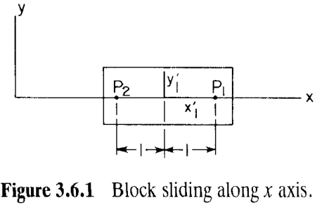
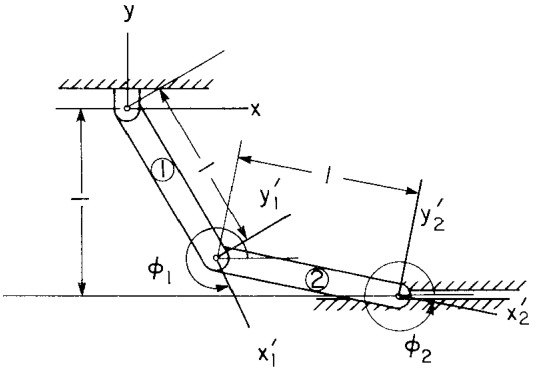

# 3.6 位置、速度、加速度分析

> 来源：*Computer Aided Kinematics and Dynamics of Mechanical Systems, Vol. 1*，第 3 章，3.6 节（书页 97–104，止于 3.6.4；3.7 奇异构型另见专节）。
> 本文以"文字讲解 + 逐式详细推导"组织，公式推导不跳步骤；例题保留完整推导。

---

## 引言：本节要解决什么

3.2~3.4 节建好了**运动学约束 (kinematic constraint)** 方程库，3.5 节给出**驱动约束 (driving constraint)**。本节把它们拼成一个完整的方阵系统，给出**位置分析 (position analysis)**、**速度分析 (velocity analysis)**、**加速度分析 (acceleration analysis)** 三段统一框架，并指出第 4 章要展开的计算方法。主线逻辑：

1. 把运动学约束 $\boldsymbol{\Phi}^K=\mathbf{0}$ 与驱动约束 $\boldsymbol{\Phi}^D=\mathbf{0}$ 拼成 $nc$ 个方程、$nc$ 个未知量的方阵系统 $\boldsymbol{\Phi}(\mathbf{q},t)=\mathbf{0}$（式 3.6.3）；
2. **位置**：高度非线性，用**牛顿-拉夫森 (Newton–Raphson)** 迭代解（式 3.6.7、3.6.8），解的存在唯一性由**隐函数定理 (implicit function theorem)** 保证；
3. **速度**：对 3.6.3 求一次时间导，得线性方程 $\boldsymbol{\Phi}_\mathbf{q}\dot{\mathbf{q}}=\boldsymbol{\nu}$（式 3.6.10）；
4. **加速度**：再求一次时间导，得 $\boldsymbol{\Phi}_\mathbf{q}\ddot{\mathbf{q}}=\boldsymbol{\gamma}$（式 3.6.11）；
5. 三段共用同一个**雅可比 (Jacobian)** $\boldsymbol{\Phi}_\mathbf{q}$——位置迭代时已分解，速度/加速度可直接复用，计算高效；
6. 实际仿真在**时间网格 (time grid)** 上逐点求解（式 3.6.12），用二阶泰勒展开作初值预测（式 3.6.13）。

贯穿全节的关键问题：**雅可比 $\boldsymbol{\Phi}_\mathbf{q}$ 是否非奇异**——它既是解存在性的判据，又是数值求解的引擎，还是奇异构型（3.7 节）的检测手段。

---

## 3.6.1 位置分析

### 系统约束方程的装配

3.2~3.4 节的运动学约束写成矩阵形式

$$\boldsymbol{\Phi}^K(\mathbf{q}) \equiv \left[\Phi_1^K(\mathbf{q}),\ \dots,\ \Phi_{nh}^K(\mathbf{q})\right]^T = \mathbf{0} \tag{3.6.1}$$

其中 $\mathbf{q}$ 是系统 $nc$ 个广义坐标，$nh$ 是完整约束方程个数。3.5 节的驱动约束写成

$$\boldsymbol{\Phi}^D(\mathbf{q},t) \equiv \left[\Phi_1^D(\mathbf{q},t),\ \dots,\ \Phi_{\text{DOF}}^D(\mathbf{q},t)\right]^T = \mathbf{0} \tag{3.6.2}$$

驱动约束**显含时间**，为系统提供运动驱动力。**假定驱动约束数恰等于系统自由度**，则式 3.6.1 与 3.6.2 合起来恰是 $nc$ 个方程、$nc$ 个广义坐标。装配成

$$\boldsymbol{\Phi}(\mathbf{q},t) = \begin{bmatrix} \boldsymbol{\Phi}^K(\mathbf{q}) \\[2pt] \boldsymbol{\Phi}^D(\mathbf{q},t) \end{bmatrix}_{nc \times 1} = \mathbf{0} \tag{3.6.3}$$

### 位置分析的目标与困难

**位置分析的目标**：解式 3.6.3，求广义坐标向量 $\mathbf{q}$ 作为时间的函数。两点根本困难：

- 方程**高度非线性**，一般**无解析解**；
- 很容易写出**物理上无法满足**的约束/驱动组合，此时**根本无解**。

所以位置分析必须认真对待两件事：**解的存在性**，以及解存在时的**数值求法**。

### Example 3.6.1：冗余约束（相容 vs 不相容）

> 物体 1 沿 $x$ 轴滑动且不转动（图 3.6.1）。本例虽简单，却揭示复杂机构里极易误犯的冗余约束陷阱。

$\mathbf{q}=[x_1,y_1,\phi_1]^T$，约束方程为

$$\boldsymbol{\Phi}^K = \begin{bmatrix} y_1 + \sin\phi_1 \\ y_1 - \sin\phi_1 \end{bmatrix} = \mathbf{0}$$

其雅可比（对 $\mathbf{q}=[x_1,y_1,\phi_1]$ 逐列求偏导）

$$\boldsymbol{\Phi}^K_\mathbf{q} = \begin{bmatrix} 0 & 1 & \cos\phi_1 \\ 0 & 1 & -\cos\phi_1 \end{bmatrix}$$

若**不慎引入** $\boldsymbol{\Phi}^D:\ \phi_1=0$，约束方程组变成

$$\boldsymbol{\Phi}^2 \equiv \begin{bmatrix} y_1 + \sin\phi_1 \\ y_1 - \sin\phi_1 \\ \phi_1 \end{bmatrix} = \mathbf{0}, \qquad \boldsymbol{\Phi}^2_\mathbf{q} = \begin{bmatrix} 0 & 1 & \cos\phi_1 \\ 0 & 1 & -\cos\phi_1 \\ 0 & 0 & 1 \end{bmatrix}$$

此时 $|\boldsymbol{\Phi}^2_\mathbf{q}| = 0$，雅可比**秩亏 (rank deficient)**，约束不独立。第三条约束是**冗余约束 (redundant constraint)**：只要前两条满足，它自动成立。这种"多余但不矛盾"的情况称为**相容冗余 (consistent redundancy)**。

最后，若加的是 $\phi_1=0.1$，

$$\boldsymbol{\Phi}^3 = \begin{bmatrix} y_1 + \sin\phi_1 \\ y_1 - \sin\phi_1 \\ \phi_1 - 0.1 \end{bmatrix} = \mathbf{0}$$

雅可比 $\boldsymbol{\Phi}^3_\mathbf{q} = \boldsymbol{\Phi}^2_\mathbf{q}$，同样秩亏、第三条看似冗余。但前两条要求 $\phi_1=0$，第三条要求 $\phi_1=0.1$，自相矛盾。此时 $\boldsymbol{\Phi}^3=\mathbf{0}$ **对任何 $\mathbf{q}$ 都无解**，称为**不相容冗余 (inconsistent redundancy)**。

**工程结论：** 复杂模型（尤其第二部分的空间系统）极易无意引入冗余约束。必须做计算检查以确保：(a) 约束**相容**（机构确能装配）；(b) 若相容，雅可比 $\boldsymbol{\Phi}_\mathbf{q}$ 的**行秩等于约束方程数**，否则存在冗余约束。

### 隐函数定理：解的存在唯一性

求解式 3.6.3 与判定奇异构型的**关键要素**是雅可比

$$\boldsymbol{\Phi}_\mathbf{q}(\mathbf{q},t) = \left[\frac{\partial \Phi_i(\mathbf{q},t)}{\partial q_j}\right]_{nc \times nc} \tag{3.6.4}$$

> **隐函数定理 (Implicit Function Theorem)：** 设 $\mathbf{q}^0$ 是式 3.6.3 在 $t=t_0$ 的解，且 $\boldsymbol{\Phi}(\mathbf{q},t)$ 对其变量二次连续可微。若式 3.6.4 的雅可比在 $(\mathbf{q}^0,t_0)$ 处**非奇异**，则存在唯一解

$$\mathbf{q} = \mathbf{f}(t) \tag{3.6.5}$$

满足 $\mathbf{f}(t_0)=\mathbf{q}^0$，并在 $t_0$ 附近某区间内成立：存在 $\delta>0$ 使

$$\boldsymbol{\Phi}(\mathbf{f}(t),\,t) = \mathbf{0}, \qquad |t-t_0| \le \delta \tag{3.6.6}$$

而且该解二次连续可微，即速度 $\dot{\mathbf{q}}=\dot{\mathbf{f}}(t)$ 与加速度 $\ddot{\mathbf{q}}=\ddot{\mathbf{f}}(t)$ 都连续。

**物理含义：** 在定理前提下（$t_0$ 处已有一个解 $\mathbf{q}^0$、约束二次可微），**只要雅可比在 $(\mathbf{q}^0,t_0)$ 非奇异，就能断定系统约束方程在 $t_0$ 邻域内有唯一的连续可微解 $\mathbf{q}=\mathbf{f}(t)$**。也即不会发生上面的相容/不相容问题。

### 牛顿-拉夫森数值解

隐函数定理只确定了解的存在性，没有提供解法。求解式 3.6.3 这类非线性方程最常用**牛顿-拉夫森方法**（第 4 章详述）：从满足 3.6.3 的某时刻 $t$ 的构型估计 $\mathbf{q}^{(0)}$ 出发，第 $k$ 次迭代解出修正量 $\Delta\mathbf{q}^{(k)}$：

$$\boldsymbol{\Phi}_\mathbf{q}(\mathbf{q}^{(k)},t)\,\Delta\mathbf{q}^{(k)} = -\boldsymbol{\Phi}(\mathbf{q}^{(k)},t) \tag{3.6.7}$$

再更新估计：

$$\mathbf{q}^{(k+1)} = \mathbf{q}^{(k)} + \Delta\mathbf{q}^{(k)}, \qquad k=0,1,\dots \tag{3.6.8}$$

迭代到满足 3.6.3 的误差容限为止。

> **式 3.6.7 的由来**（一阶泰勒线性化）：要求新点 $\mathbf{q}^{(k)}+\Delta\mathbf{q}^{(k)}$ 满足 $\boldsymbol{\Phi}=\mathbf{0}$，在 $\mathbf{q}^{(k)}$ 处展开
> $$\boldsymbol{\Phi}(\mathbf{q}^{(k)}+\Delta\mathbf{q}^{(k)},t) \approx \boldsymbol{\Phi}(\mathbf{q}^{(k)},t) + \boldsymbol{\Phi}_\mathbf{q}(\mathbf{q}^{(k)},t)\,\Delta\mathbf{q}^{(k)} = \mathbf{0}$$
> 移项即得 3.6.7。

**收敛性质：** 牛顿-拉夫森**二阶收敛 (quadratically convergent)**——某次迭代的解误差正比于前一次误差的**平方**。但若初值很差、或方程本身无解，迭代可能**发散**。

### 更好的初值

牛顿-拉夫森不收敛**可能**意味着机构无法物理装配，但也可能只是初值太差。为可靠区分这两者，需要更稳健的方法：求 $t_0$ 时刻的 $\mathbf{q}$，使其在**尽量满足约束**的同时**尽量靠近**初始估计 $\mathbf{q}(0)$。具体是逐次最小化

$$\Psi_0(\mathbf{q},t_0,r) \equiv (\mathbf{q}-\mathbf{q}^{(0)})^T(\mathbf{q}-\mathbf{q}^{(0)}) + r\,\boldsymbol{\Phi}^T(\mathbf{q},t_0)\boldsymbol{\Phi}(\mathbf{q},t_0) \tag{3.6.9}$$

并不断增大罚参数 $r>0$ 以更重地强制满足约束。

- 第一项 $(\mathbf{q}-\mathbf{q}^{(0)})^T(\mathbf{q}-\mathbf{q}^{(0)})$：到初值的距离平方，把解拉向工程师给的估计；
- 第二项 $r\,\boldsymbol{\Phi}^T\boldsymbol{\Phi}$：约束违背量的平方和，乘以罚因子 $r$。

**判据：** 若随 $r\to\infty$ 此最小化收敛到一个**仍不满足 3.6.3** 的 $\mathbf{q}$，则该机构**无法装配**，应当警惕设计有误。这给出"装配机构 / 发现设计不可装配"的有力工具（数值方法见第 4 章）。

---

## 3.6.2 速度分析

### 思路

位置解出后，对约束方程求一次时间导，把速度问题化成一个线性方程组。

### 速度方程

假定雅可比非奇异、位置已数值解出，则隐函数定理保证速度、加速度存在。对式 3.6.3 求一次时间全导数即得**速度方程 (velocity equation)**（推导见 3.1 节式 3.1.9，此处与之完全相同）：

$$\boxed{\boldsymbol{\Phi}_\mathbf{q}\,\dot{\mathbf{q}} = -\boldsymbol{\Phi}_t \equiv \boldsymbol{\nu}} \tag{3.6.10}$$

其中 $\boldsymbol{\Phi}_t \equiv \partial\boldsymbol{\Phi}/\partial t$ 是约束对时间的偏导（仅驱动约束非零，运动学约束不显含 $t$ 故为 0）。

右端 $\boldsymbol{\nu}$ 可用 3.2~3.5 节各运动学/驱动约束的速度方程右端逐条装配而成（计算机生成 $\boldsymbol{\nu}$ 与 $\boldsymbol{\Phi}_\mathbf{q}$ 的方法见第 4 章）。

---

## 3.6.3 加速度分析

### 思路

对速度方程再求一次时间导。系数矩阵仍是同一个 $\boldsymbol{\Phi}_\mathbf{q}$，只是右端 $\boldsymbol{\gamma}$ 复杂些。

### 加速度方程

对式 3.6.10 再求一次时间全导数即得**加速度方程 (acceleration equation)**（逐项展开推导见 3.1 节式 3.1.10，此处与之完全相同）：

$$\boxed{\boldsymbol{\Phi}_\mathbf{q}\,\ddot{\mathbf{q}} = -(\boldsymbol{\Phi}_\mathbf{q}\dot{\mathbf{q}})_\mathbf{q}\,\dot{\mathbf{q}} - 2\boldsymbol{\Phi}_{\mathbf{q}t}\,\dot{\mathbf{q}} - \boldsymbol{\Phi}_{tt} \equiv \boldsymbol{\gamma}} \tag{3.6.11}$$

---

## Example 3.6.2：一自由度双摆（完整数值算例）

> 一自由度双摆（图 3.6.2）。物体 1 由绝对转角驱动器驱动：
> $$\phi_1 = \frac{5\pi}{3} + \frac{\pi}{6}t, \qquad 0 \le t \le \tfrac{3}{2}$$

### 约束方程装配

取极大笛卡尔广义坐标集 $\mathbf{q}=[x_1,y_1,\phi_1,x_2,y_2,\phi_2]^T$（$nc=6$）。按式 3.6.3 写出运动学+驱动约束：

$$\boldsymbol{\Phi}(\mathbf{q},t) \equiv \begin{bmatrix}
x_1 - \cos\phi_1 \\
y_1 - \sin\phi_1 \\
x_2 - \cos\phi_1 - \cos\phi_2 \\
y_2 - \sin\phi_1 - \sin\phi_2 \\
y_2 + 1 \\
\phi_1 - \dfrac{\pi}{6}t - \dfrac{5\pi}{3}
\end{bmatrix} = \mathbf{0}$$

前 5 行是运动学约束（两个转动关节 + 物体 2 沿水平槽），第 6 行是驱动约束。

### 雅可比与奇异性

逐列对 $[x_1,y_1,\phi_1,x_2,y_2,\phi_2]$ 求偏导：

$$\boldsymbol{\Phi}_\mathbf{q}(\mathbf{q},t) = \begin{bmatrix}
1 & 0 & \sin\phi_1 & 0 & 0 & 0 \\
0 & 1 & -\cos\phi_1 & 0 & 0 & 0 \\
0 & 0 & \sin\phi_1 & 1 & 0 & \sin\phi_2 \\
0 & 0 & -\cos\phi_1 & 0 & 1 & -\cos\phi_2 \\
0 & 0 & 0 & 0 & 1 & 0 \\
0 & 0 & 1 & 0 & 0 & 0
\end{bmatrix}$$

其行列式为 $|\boldsymbol{\Phi}_\mathbf{q}| = -\cos\phi_2$。除非物体 2 竖直，即 $\phi_2=\pi/2+k\pi$（$k$ 整数），否则行列式永不为零。$\cos\phi_2=0$ 时系统进入**奇异构型**（详见 3.7 节）。

### 位置分析（牛顿-拉夫森）

$t=0$ 时 $\phi_1=5\pi/3$。取误差容限 $\varepsilon=1.0\times10^{-4}$，初始估计

$$\mathbf{q}^{(0)} = [0.5,\ -0.8660,\ 5\pi/3,\ 1.5,\ -1.0,\ 6.14]^T$$

代入式 3.6.7 $\boldsymbol{\Phi}_\mathbf{q}\Delta\mathbf{q}^{(0)}=-\boldsymbol{\Phi}$（此处 $\sin(5\pi/3)=-0.8660,\ \cos(5\pi/3)=0.5$）：

$$\begin{bmatrix}
1 & 0 & -0.8660 & 0 & 0 & 0 \\
0 & 1 & -0.5 & 0 & 0 & 0 \\
0 & 0 & -0.8660 & 1 & 0 & -0.1427 \\
0 & 0 & -0.5 & 0 & 1 & -0.9898 \\
0 & 0 & 0 & 0 & 1 & 0 \\
0 & 0 & 1 & 0 & 0 & 0
\end{bmatrix}
\begin{bmatrix} \Delta x_1 \\ \Delta y_1 \\ \Delta\phi_1 \\ \Delta x_2 \\ \Delta y_2 \\ \Delta\phi_2 \end{bmatrix}
=
\begin{bmatrix} 0 \\ 0 \\ -0.0102 \\ -0.0087 \\ 0 \\ 0 \end{bmatrix}$$

解得

$$\Delta\mathbf{q}^{(1)} = [0,\ 0,\ 0,\ -0.0089,\ 0,\ 0.0088]^T$$

由式 3.6.8 更新：

$$\mathbf{q}^{(2)} = [0.5,\ -0.8660,\ 5\pi/3,\ 1.4911,\ -1.0,\ 6.1488]^T$$

再代入 3.6.7 解第二次修正：

$$\Delta\mathbf{q}^{(2)} = [0,\ 0,\ 0,\ -0.0001,\ 0,\ 0]^T$$

故

$$\mathbf{q}^{(3)} = [0.5,\ -0.8660,\ 5\pi/3,\ 1.4910,\ -1.0,\ 6.1488]^T$$

后续修正已小于容限。**仅两次迭代**，约束违背即小于规定误差，体现牛顿-拉夫森的二阶收敛。最终 $\phi_2 = 6.1488$ rad。

### 速度分析

此系统运动学约束定常，仅驱动约束（第 6 行）含 $t$：$\Phi_6=\phi_1-\tfrac{\pi}{6}t-\tfrac{5\pi}{3}$，$\partial\Phi_6/\partial t=-\pi/6$。故

$$\boldsymbol{\Phi}_t = [0,0,0,0,0,-\tfrac{\pi}{6}]^T \ \Rightarrow\ \boldsymbol{\nu}=-\boldsymbol{\Phi}_t = [0,0,0,0,0,\tfrac{\pi}{6}]^T = [0,0,0,0,0,0.5236]^T$$

代入式 3.6.10 $\boldsymbol{\Phi}_\mathbf{q}\dot{\mathbf{q}}=\boldsymbol{\nu}$（用已收敛构型代入 $\sin\phi_1,\cos\phi_1,\sin\phi_2,\cos\phi_2$）：

$$\begin{bmatrix}
1 & 0 & -0.8660 & 0 & 0 & 0 \\
0 & 1 & -0.5 & 0 & 0 & 0 \\
0 & 0 & -0.8660 & 1 & 0 & -0.1340 \\
0 & 0 & -0.5 & 0 & 1 & -0.9910 \\
0 & 0 & 0 & 0 & 1 & 0 \\
0 & 0 & 1 & 0 & 0 & 0
\end{bmatrix}
\begin{bmatrix} \dot x_1 \\ \dot y_1 \\ \dot\phi_1 \\ \dot x_2 \\ \dot y_2 \\ \dot\phi_2 \end{bmatrix}
=
\begin{bmatrix} 0 \\ 0 \\ 0 \\ 0 \\ 0 \\ 0.5236 \end{bmatrix}$$

求得：

$$ {\dot{\mathbf{q}} = [0.4534,\ 0.2618,\ 0.5236,\ 0.4180,\ 0,\ -0.2642]^T}$$

### 加速度分析

由于 $\boldsymbol{\Phi}_{\mathbf{q}t}=\mathbf{0}$（驱动约束对 $t$ 线性，二阶混合偏导为零）且 $\boldsymbol{\Phi}_{tt}=\mathbf{0}$，式 3.6.11 简化为 $\boldsymbol{\Phi}_\mathbf{q}\ddot{\mathbf{q}}=\boldsymbol{\gamma}$，$\boldsymbol{\gamma}=-(\boldsymbol{\Phi}_\mathbf{q}\dot{\mathbf{q}})_\mathbf{q}\dot{\mathbf{q}}$。

**用直接二次微分法系统地算出 $\boldsymbol{\gamma}$** —— 对每条约束求二阶时间导（这正是 $-(\boldsymbol{\Phi}_\mathbf{q}\dot{\mathbf{q}})_\mathbf{q}\dot{\mathbf{q}}$ 的逐行展开，证明结果不是巧合）：

$$\Phi_1=x_1-\cos\phi_1:\quad \ddot x_1 + \sin\phi_1\ddot\phi_1 = -\cos\phi_1\,\dot\phi_1^2 \ \Rightarrow\ \gamma_1=-\cos\phi_1\,\dot\phi_1^2$$
$$\Phi_2=y_1-\sin\phi_1:\quad \ddot y_1 - \cos\phi_1\ddot\phi_1 = -\sin\phi_1\,\dot\phi_1^2 \ \Rightarrow\ \gamma_2=-\sin\phi_1\,\dot\phi_1^2$$
$$\Phi_3=x_2-\cos\phi_1-\cos\phi_2:\quad \gamma_3=-\cos\phi_1\,\dot\phi_1^2 - \cos\phi_2\,\dot\phi_2^2$$
$$\Phi_4=y_2-\sin\phi_1-\sin\phi_2:\quad \gamma_4=-\sin\phi_1\,\dot\phi_1^2 - \sin\phi_2\,\dot\phi_2^2$$
$$\Phi_5=y_2+1:\quad \gamma_5=0; \qquad \Phi_6=\phi_1-\tfrac{\pi}{6}t-\tfrac{5\pi}{3}:\quad \gamma_6=0$$

代入数值（$\dot\phi_1^2=0.2742,\ \dot\phi_2^2=0.0698,\ \cos\phi_1=0.5,\ \sin\phi_1=-0.8660,\ \cos\phi_2=0.9910,\ \sin\phi_2=-0.1340$）：

$$\gamma_1=-0.5\times0.2742=-0.1371$$
$$\gamma_2=-(-0.8660)\times0.2742=0.2374$$
$$\gamma_3=-0.5\times0.2742-0.9910\times0.0698=-0.1371-0.0692=-0.2063$$
$$\gamma_4=-(-0.8660)\times0.2742-(-0.1340)\times0.0698=0.2374+0.0094=+0.2468$$

> **勘误提示：** 书页 104 印刷的加速度方程右端第 4 行为 $-0.2468$，应为 $+0.2468$（符号笔误）。验证：取 $\gamma_4=+0.2468$ 才能由第 4 行 $\ddot y_2-\cos\phi_2\ddot\phi_2=\gamma_4$（$\ddot y_2=0$）解得 $\ddot\phi_2=-0.2490$，与书中最终解一致；若取 $-0.2468$ 则得 $\ddot\phi_2=+0.2490$，与解矛盾。

于是 $\boldsymbol{\gamma}=[-0.1371,\ 0.2374,\ -0.2063,\ +0.2468,\ 0,\ 0]^T$，加速度方程 $\boldsymbol{\Phi}_\mathbf{q}\ddot{\mathbf{q}}=\boldsymbol{\gamma}$：

$$\begin{bmatrix}
1 & 0 & -0.8660 & 0 & 0 & 0 \\
0 & 1 & -0.5 & 0 & 0 & 0 \\
0 & 0 & -0.8660 & 1 & 0 & -0.1340 \\
0 & 0 & -0.5 & 0 & 1 & -0.9910 \\
0 & 0 & 0 & 0 & 1 & 0 \\
0 & 0 & 1 & 0 & 0 & 0
\end{bmatrix}
\begin{bmatrix} \ddot x_1 \\ \ddot y_1 \\ \ddot\phi_1 \\ \ddot x_2 \\ \ddot y_2 \\ \ddot\phi_2 \end{bmatrix}
=
\begin{bmatrix} -0.1371 \\ 0.2374 \\ -0.2063 \\ +0.2468 \\ 0 \\ 0 \end{bmatrix}$$

逐行回代：第 6 行 $\ddot\phi_1=0$（驱动器线性，加速度为零）；第 5 行 $\ddot y_2=0$；第 1 行 $\ddot x_1=-0.1371$；第 2 行 $\ddot y_1=0.2374$；第 4 行 $-\cos\phi_2\ddot\phi_2=\gamma_4\Rightarrow\ddot\phi_2=-0.2490$；第 3 行 $\ddot x_2=\gamma_3-\sin\phi_2\ddot\phi_2=-0.2063-(-0.1340)(-0.2490)=-0.2397$。最终

$$\boxed{\ddot{\mathbf{q}} = [-0.1371,\ 0.2374,\ 0,\ -0.2397,\ 0,\ -0.2490]^T}$$

**物理读法：** $\ddot\phi_1=0$ 因驱动转角随时间线性；$\ddot y_2=0$ 因物体 2 锁在水平槽内。

---

## 3.6.4 时间网格上的运动学分析

### 思路

实际仿真不是在孤立时刻求解，而是在一串时间点上连续求解。用上一时刻的解外推出下一时刻的好初值，让牛顿-拉夫森快速收敛。

在时间网格 $t_i,\ i=1,\dots,m$ 上求

$$\left.\begin{aligned} \mathbf{q}_i &= \mathbf{q}(t_i) \\ \dot{\mathbf{q}}_i &= \dot{\mathbf{q}}(t_i) \\ \ddot{\mathbf{q}}_i &= \ddot{\mathbf{q}}(t_i) \end{aligned}\right\}, \qquad i=1,\dots,m \tag{3.6.12}$$

牛顿-拉夫森（式 3.6.7、3.6.8）的收敛靠**好初值**。已知 $t_i$ 处的位置、速度、加速度，用**二阶泰勒展开**预测 $t_{i+1}$ 处的 $\mathbf{q}$：

$$\mathbf{q}_{i+1} \approx \mathbf{q}_i + (t_{i+1}-t_i)\,\dot{\mathbf{q}}_i + \tfrac{1}{2}(t_{i+1}-t_i)^2\,\ddot{\mathbf{q}}_i \tag{3.6.13}$$

以此作牛顿-拉夫森迭代起点；只要时间步不大，即可期望**快速收敛**。这把"前一步算出的速度/加速度"变成"下一步位置求解的加速器"，三段分析在时间推进中环环相扣。
