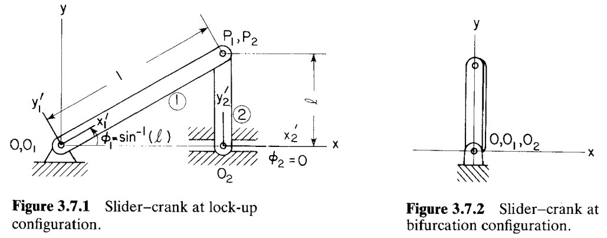
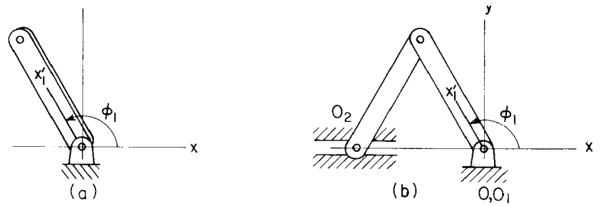
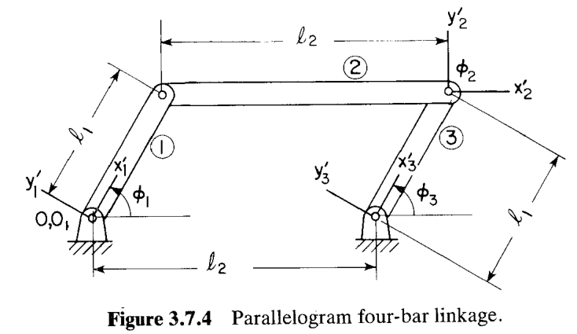
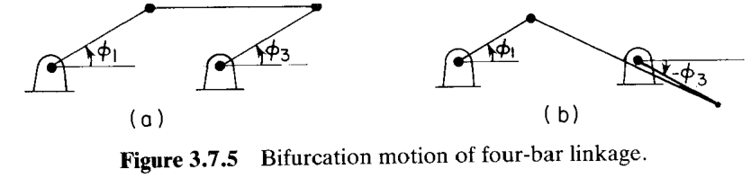
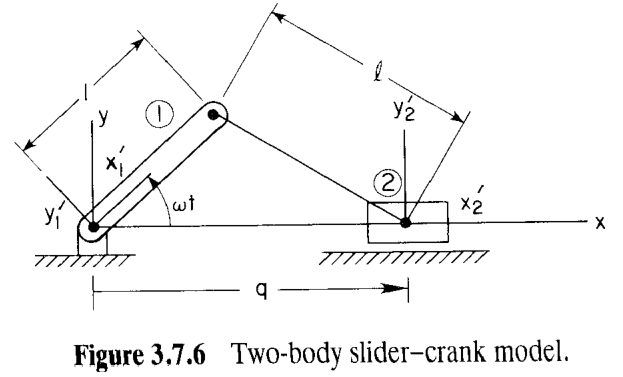
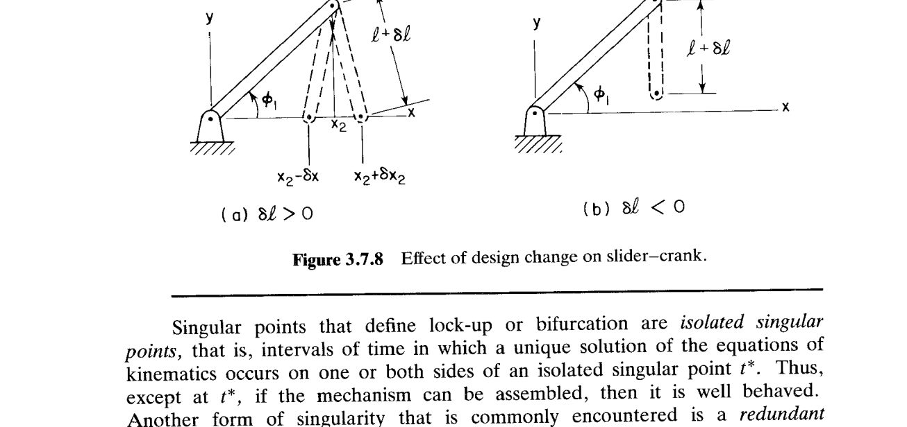
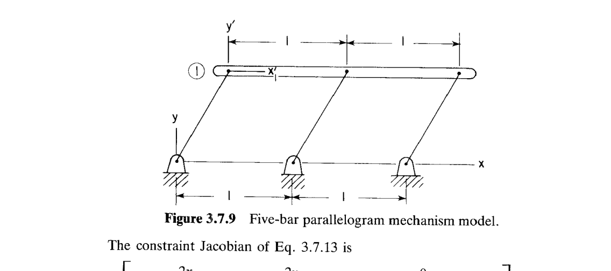

# 3.7 奇异构型（Singular Configurations）

> 来源：*Computer Aided Kinematics and Dynamics of Mechanical Systems, Vol. 1*，第 3 章，3.7 节（书页 104 底–111 顶，止于"奇异点的数值方法见 4.6 节"；本页其后的 PROBLEMS 不在本节范围内）。
> 本文以"文字讲解 + 逐式详细推导"组织，公式推导不跳步骤；例题保留完整推导。

---

## 引言：本节要解决什么

3.2~3.6 节都假定雅可比（Jacobian）$\boldsymbol{\Phi}_\mathbf{q}$ **非奇异**。此时，位置、速度、加速度三段分析才成立，隐函数定理（implicit function theorem）才保证唯一光滑解。本节专门研究**这个假定失效**的时刻：$\boldsymbol{\Phi}_\mathbf{q}$ 是**奇异构型（singular configuration）**。运动可能在此处**走不下去（锁死）**，或者**分岔成多条路径**。主线逻辑：

1. 先用初等的曲柄滑块（slider–crank）、平行四边形四连杆（parallelogram four-bar）直观展示两种病态：**锁死（lock-up）** 与 **分岔（bifurcation）**（例 3.7.1、3.7.2）；
2. 把曲柄滑块写成只含一个广义坐标 $q$ 的解析模型，**求闭式解**并看清 $\ell$ 取值如何决定锁死 / 分岔（例 3.7.3）；
3. 对约束求时间导，证明锁死时**速度趋于无穷**，并由此提炼第一个数值判据 $\boldsymbol{\Phi}_\mathbf{q}=\mathbf{0},\ \boldsymbol{\Phi}_t\neq\mathbf{0}$（例 3.7.4）；
4. 用三坐标曲柄滑块演示**雅可比行列式为零**作为奇异判据（例 3.7.5）；
5. 从**速度方程**与**虚位移（virtual displacement）** 出发，给出区分锁死与分岔的一般理论：择一定理（theorem of the alternative）、行列式变号、$\dot{\mathbf{q}}\to\infty$（核心理论段）；
6. 讨论**设计变更**对奇异点附近性能的影响（式 3.7.11、3.7.12，例 3.7.6）；
7. 最后引出另一类常见奇异——**冗余约束（redundant constraint）**，用五杆平行四边形给出秩亏的代数证明（例 3.7.7）。

贯穿全节的核心命题：**$\boldsymbol{\Phi}_\mathbf{q}$ 必在锁死与分岔构型处奇异**——它把"物理上走不动 / 分叉"翻译成"代数上行列式为零、秩亏"，从而可在大规模系统上**数值检测**。

---

## 两种问题构型

- **锁死构型（lock-up configuration）**：机构到达某构型后，**驱动方向上无法继续运动**（如曲柄被顶死）。数学上表现为：越过该点后约束方程**无解**，速度 $\dot{\mathbf{q}}$、加速度 $\ddot{\mathbf{q}}$ 趋于无穷。
- **分岔（bifurcation）**：到达某构型后，**存在不止一条**可继续的运动路径（机构可以"二选一"地往不同方向走）。

下面四个例子（3.7.1、3.7.2 直观，3.7.3~3.7.5 解析）逐步把这两种现象代数化。

---

## 例 3.7.1：曲柄滑块的锁死与分岔

> 取例 3.1.2 的初等曲柄滑块模型。曲柄长记为 $1$，连杆（coupler）长 $\ell$，物体 2（滑块）沿 $x$ 轴平动，$\phi_2=0$。

图 3.7.1 对应**锁死。** 曲柄在正 $\phi_1$ 方向被驱动。随运动推进，系统到达 $\sin\phi_1=\ell$ 的构型。此处连杆与曲柄"撑直/对齐"，**物理上曲柄无法再沿正 $\phi_1$ 方向转动**——这就是锁死。

图 3.7.2 对应**分岔。** 当 $\phi_1=\pi/2,\ \phi_2=0$，曲柄沿正向继续驱动时有**两种**后续运动：

- 物体 2 停在 $O$ 处，物体 1、2 锁在一起像一个绕 $O$ 的单摆（pendulum）摆动 [下图 (a)]；
- 物体 2 越过 $O$ 点，沿负 $x$ 轴运动 [下图 (b)]。

---

## 例 3.7.2：平行四边形四连杆的分岔

> 两对等长杆构成的平行四边形四连杆（图 3.7.4）。物体 1、3 长 $\ell_1$，上方耦合体 2 长 $\ell_2$。

从"平躺"构型 $\phi_1=\phi_3=0$ 出发沿正 $\phi_1$ 驱动物体 1，有**两种**可能运动（图 3.7.5）：

- (a) 平行四边形模式：$\phi_3$ 与 $\phi_1$ 同号，机构保持平行四边形；
- (b) 反平行（蝶形）模式：$\phi_3$ 与 $\phi_1$ 异号，机构折成交叉形。

这是又一个分岔实例。直观例子到此为止——下面转入解析方法。

---

## 例 3.7.3：两体曲柄滑块的解析解

### 思路

为了**算出闭式解**看清奇异行为，把曲柄滑块换一种建模（图 3.7.6）：用**绝对约束**把物体 1、2 与地面耦合，使 $x_1=y_1=y_2=\phi_2=0$，于是**只剩 $x_2\equiv q$ 一个广义坐标**。曲柄以恒定角速度 $\omega$ 驱动，$\phi_1=\omega t$。

### 约束方程

长度为 $\ell$ 的连杆给出的距离约束（连杆两端坐标差的模为 $\ell$）写成关于 $q$ 的方程

$$\Phi(q,t) = (q-\cos\omega t)^2 + \sin^2\omega t - \ell^2 = 0 \tag{3.7.1}$$

> 几何来源：曲柄端点在 $(\cos\omega t,\ \sin\omega t)$，滑块端点在 $(q,\ 0)$，两者距离平方
> $(q-\cos\omega t)^2+(0-\sin\omega t)^2=\ell^2$，移项即 3.7.1。

### 解二次方程

把 3.7.1 当作关于 $q$ 的二次方程展开：

$$\begin{aligned}
(q-\cos\omega t)^2 + \sin^2\omega t - \ell^2 &= 0 \\
q^2 - 2q\cos\omega t + \cos^2\omega t + \sin^2\omega t - \ell^2 &= 0 \\
q^2 - 2(\cos\omega t)\,q + (1-\ell^2) &= 0
\end{aligned}$$

（用了 $\cos^2\omega t+\sin^2\omega t=1$。）由求根公式

$$q = \frac{2\cos\omega t \pm \sqrt{4\cos^2\omega t - 4(1-\ell^2)}}{2} = \cos\omega t \pm \sqrt{\cos^2\omega t + (\ell^2-1)}$$

书中以 $\mp$ 排版（先 $-$）以使加号对应图 3.7.6 的装配构型、减号对应图 3.7.7 的另一装配：

$$\boxed{q = \cos\omega t \mp \sqrt{\cos^2\omega t + (\ell^2-1)}} \tag{3.7.2}$$

### 由解析解读出奇异行为

根号内判别式 $D=\cos^2\omega t+(\ell^2-1)$ 决定一切：

- **$\ell>1$**：$\ell^2-1>0$，故 $D\ge \ell^2-1>0$ 恒正，**对所有 $t$ 都有实解**，机构始终停在 $\pm$ 中**某一个**构型而不切换——无奇异。
- **$\ell<1$**：当 $\cos^2\omega t = 1-\ell^2$（等价 $\sin\omega t=\ell$）时 $D=0$，根号消失。越过此点 $D<0$ 无实解，**存在性丧失 = 锁死（lock-up）**。
- **$\ell=1$**：$D=\cos^2\omega t$。当 $\cos\omega t=0$（等价 $\sin\omega t=\ell=1$）时 $D=0$，此时 $q=\cos\omega t=0$，两支 $\pm$ **合并又分离**，给出**两条解支 = 分岔（bifurcation）**。

这与例 3.7.1 的物理判断**完全吻合**：解析模型把"撑直顶死""路径分叉"翻译成了判别式的零点。

---

## 例 3.7.4：锁死时速度趋于无穷

### 思路

对约束方程 3.7.1 求**一次时间导**，看锁死点附近 $\dot q$ 的行为，提炼出第一个**一般数值判据**。

### 推导

对 3.7.1 求全导（$\Phi_q\dot q + \Phi_t = 0$，故 $\Phi_q\dot q=-\Phi_t$）。先算 $\Phi_q$：

$$\Phi_q = \frac{\partial}{\partial q}\Big[(q-\cos\omega t)^2+\sin^2\omega t-\ell^2\Big] = 2(q-\cos\omega t)$$

故

$$\Phi_q\dot q = 2(q-\cos\omega t)\,\dot q \tag{3.7.3a}$$

另一方面算显含时间的偏导 $\Phi_t$：

$$\begin{aligned}
\Phi_t &= \frac{\partial}{\partial t}\Big[(q-\cos\omega t)^2+\sin^2\omega t-\ell^2\Big]\\
&= 2(q-\cos\omega t)\cdot(\omega\sin\omega t) + 2\sin\omega t\cos\omega t\cdot\omega\\
&= 2\omega q\sin\omega t - 2\omega\sin\omega t\cos\omega t + 2\omega\sin\omega t\cos\omega t\\
&= 2\omega q\sin\omega t
\end{aligned}$$

（中间两项恰好抵消。）于是 $-\Phi_t=-2\omega q\sin\omega t$，得

$$\Phi_q\dot q \equiv 2(q-\cos\omega t)\,\dot q = -2\omega q\sin\omega t \equiv -\Phi_t \tag{3.7.3}$$

解出速度

$$\dot q = \frac{-2\omega q\sin\omega t}{2(q-\cos\omega t)} = \frac{-\omega q\sin\omega t}{q-\cos\omega t}$$

### 判据

- **$\ell>1$**：由 3.7.2，$q>\cos\omega t$ 对所有 $t$ 成立，分母不为零，无困难；
- **$\ell<1$**：锁死点 $\sin\omega t=\ell$ 处 $q=\cos\omega t\neq 0$，分母 $q-\cos\omega t\to 0$，故 $\dot q\to\infty$。

注意此时 $\Phi_q=2(q-\cos\omega t)\to 0$ 而 $\Phi_t=2\omega q\sin\omega t\neq 0$。这正是**一般判据**：

$$\boxed{\text{锁死}\ \Longleftrightarrow\ \Phi_q=0\ \text{且}\ \Phi_t\neq 0\ \Rightarrow\ \dot q\to\infty}$$

$\dot q$（以及 $\ddot q$）随 $\sin\omega t\to\ell$ 而趋于无穷，可作为"正在逼近锁死"的**预警信号**。

> 结论意义：解析解的性质与例 3.7.1 的物理直觉一致。但闭式解极少能得到，故必须发展**可对大规模系统数值评估**的奇异判据——这正是下面用雅可比与隐函数定理做的事。

---

## 例 3.7.5：雅可比奇异性判据

### 思路

把曲柄滑块写成**保留三个坐标** $\mathbf{q}=[\phi_1,x_2,\phi_2]^T$ 的形式（压掉绝对约束），看雅可比行列式如何标记奇异点。

### 约束方程与雅可比

压掉绝对约束、保留例 3.1.2 式 3.1.11 的相对约束并加上驱动约束（式 3.1.12 $\phi_1=\omega t$），约束方程化为

$$\boldsymbol{\Phi}(\mathbf{q},t) = \begin{bmatrix}
-x_2 + \cos\phi_1 + \ell\sin\phi_2 \\
\sin\phi_1 - \ell\cos\phi_2 \\
\phi_1 - \omega t
\end{bmatrix} = \mathbf{0} \tag{3.7.4}$$

对 $\mathbf{q}=[\phi_1,x_2,\phi_2]$ 逐列求偏导得雅可比，并算其行列式：

$$|\boldsymbol{\Phi}_\mathbf{q}| = \begin{vmatrix}
-\sin\phi_1 & -1 & \ell\cos\phi_2 \\
\cos\phi_1 & 0 & \ell\sin\phi_2 \\
1 & 0 & 0
\end{vmatrix} = -\ell\sin\phi_2 \tag{3.7.5}$$

> **行列式逐步展开**（沿第三行 $[1,0,0]$ 展开，只有 $(3,1)$ 元非零）：
> $$|\boldsymbol{\Phi}_\mathbf{q}| = 1\cdot(-1)^{3+1}\begin{vmatrix} -1 & \ell\cos\phi_2 \\ 0 & \ell\sin\phi_2 \end{vmatrix} = 1\cdot\big[(-1)(\ell\sin\phi_2) - (\ell\cos\phi_2)(0)\big] = -\ell\sin\phi_2$$

它在 $\phi_2=0$ 时为零——即雅可比奇异。注意这里 $\phi_2$ 是连杆角，与例 3.7.1 几何对应（$\phi_2=0$ 即滑块连杆水平、曲柄撑直）。

### 两种奇异情形

对应例 3.1.2 与 3.7.1 的两种情形，奇异点 $\phi_2=0$ 给出：

1. **$\ell<1$**：奇异构型 $\phi_1=\sin^{-1}(\ell)$、$x_2=\sqrt{1-\ell^2}$ 满足约束方程 3.7.4，对应图 3.7.1 的**锁死**构型。
2. **$\ell=1$**：奇异构型 $\phi_1=\pi/2$、$x_2=0$ 满足 3.7.1，对应图 3.7.3 的**分岔**构型。

---

## 从速度方程出发，对奇异情况进行理论分析

例 3.7.4 的做法（用约束雅可比 + 隐函数定理）可推广到任意系统。设 $\mathbf{q}$ 是 $n$ 维广义坐标，运动学+驱动约束共 $n$ 个：$\boldsymbol{\Phi}(\mathbf{q},t)=\mathbf{0}$。设 $t^*$ 时刻已有装配构型 $\mathbf{q}^*$。

**核心命题：** 若雅可比 $\boldsymbol{\Phi}_\mathbf{q}(\mathbf{q}^*,t^*)$ **非奇异**，隐函数定理保证 $|t-t^*|<\delta$ 内有唯一光滑解 $\mathbf{q}(t)$。反过来，**锁死或分岔意味着在 $t^*$ 任意邻近处存在性或唯一性丧失**，故

$$\boxed{\boldsymbol{\Phi}_\mathbf{q}(\mathbf{q}^*,t^*)\ \text{必在锁死、分岔构型处奇异}}$$

下面进一步区分这两种病态。

### 1. 速度方程的可解性：择一定理

研究速度方程（式 3.6.10）

$$\boldsymbol{\Phi}_\mathbf{q}\dot{\mathbf{q}} = -\boldsymbol{\Phi}_t \tag{3.7.6}$$

当 $\boldsymbol{\Phi}_\mathbf{q}$ 在 $t^*$ 奇异时，3.7.6 这个线性方程组**未必有解**。由**择一定理（theorem of the alternative）**：3.7.6 有解**当且仅当**右端 $-\boldsymbol{\Phi}_t$ 与 $\boldsymbol{\Phi}_\mathbf{q}^T$ 的零空间正交，即

$$\boldsymbol{\beta}^T\boldsymbol{\Phi}_t = 0 \tag{3.7.7}$$

对**所有**满足

$$\boldsymbol{\Phi}_\mathbf{q}^T\boldsymbol{\beta} = \mathbf{0} \tag{3.7.8}$$

的 $\boldsymbol{\beta}$ 成立。

> 直观读法：$\boldsymbol{\beta}$ 是 $\boldsymbol{\Phi}_\mathbf{q}^T$ 的零向量（左零空间）。3.7.6 要有有限速度解，右端 $\boldsymbol{\Phi}_t$ 必须落在 $\boldsymbol{\Phi}_\mathbf{q}$ 的列空间里，即与所有 $\boldsymbol{\beta}$ 正交。这清楚表明：**速度有有限解，仅当 $\boldsymbol{\Phi}_\mathbf{q}$ 与 $\boldsymbol{\Phi}_t$ 配合恰当。** 否则 $\dot{\mathbf{q}}\to\infty$（对应例 3.7.4 的锁死）。

### 2. 虚位移与分岔

再考察一个让时间冻结、只满足"一阶约束"的小**虚位移（virtual displacement）** $\delta\mathbf{q}$（概念在第 6 章详述）。把约束方程展到一阶，$\delta\mathbf{q}$ 满足

$$\boldsymbol{\Phi}_\mathbf{q}\,\delta\mathbf{q} = \mathbf{0} \tag{3.7.9}$$

因 $\boldsymbol{\Phi}_\mathbf{q}$ 在 $t^*$ 奇异，**存在非零解 $\delta\mathbf{q}\neq\mathbf{0}$**，它可看作从 $\mathbf{q}(t^*)$ 出发的解轨迹的**切向**。若有限的 $\dot{\mathbf{q}}$ 满足 3.7.6、且 $\delta\mathbf{q}$ 满足 3.7.9，则

$$\boldsymbol{\Phi}_\mathbf{q}(\dot{\mathbf{q}} \pm \delta\mathbf{q}) = \boldsymbol{\Phi}_\mathbf{q}\dot{\mathbf{q}} \pm \boldsymbol{\Phi}_\mathbf{q}\delta\mathbf{q} = -\boldsymbol{\Phi}_t \tag{3.7.10}$$

也就是说 $\dot{\mathbf{q}}+\delta\mathbf{q}$ 与 $\dot{\mathbf{q}}-\delta\mathbf{q}$ **都是合法速度**——$t^*$ 后出现**两个不同速度**，这正刻画**分岔点**。

### 3. 分岔与锁死的数值判据

- **分岔判据：** $t^*$ 处 $|\boldsymbol{\Phi}_\mathbf{q}|=0$。除非 $\boldsymbol{\Phi}_\mathbf{q}$ 秩亏大于 1，行列式在越过分岔点时**必变号**。监测 $|\boldsymbol{\Phi}_\mathbf{q}|$ 的符号翻转即可作分岔的计算检测。
- **锁死判据：** 仅当 $t^*$ 之后 3.7.6 **不再有解**（即 $\dot{\mathbf{q}}\to\infty$ 当 $t\to t^*$），运动无法继续——这就是锁死。故 **$\dot{\mathbf{q}}$ 和/或 $\ddot{\mathbf{q}}$ 趋于无穷**可作锁死判据（与例 3.7.4 一致）。

---

## 设计变更对奇异点附近性能的影响

最后看**设计参数（design parameter）** 变化如何影响奇异点附近的机构。设 $\mathbf{b}=[b_1,\dots,b_k]^T$ 为设计参数向量（如各杆尺寸）。这些参数进入约束方程：

$$\boldsymbol{\Phi}(\mathbf{q},t;\mathbf{b}) = \mathbf{0} \tag{3.7.11}$$

可允许虚位移 $\delta\mathbf{q}$ 与小设计变动 $\delta\mathbf{b}$ 之间有关系。把 3.7.11 对 $(\mathbf{q},\mathbf{b})$ 一阶线性化（时间冻结）：

$$\boldsymbol{\Phi}_\mathbf{q}\,\delta\mathbf{q} = -\boldsymbol{\Phi}_\mathbf{b}\,\delta\mathbf{b} \tag{3.7.12}$$

在奇异点 $t^*$，$\boldsymbol{\Phi}_\mathbf{q}$ 奇异，于是 3.7.12 这个关于 $\delta\mathbf{q}$ 的线性方程组：

- 对**某些** $\delta\mathbf{b}$ 有**多个** $\delta\mathbf{q}$ 解 → 物理上"该设计变动允许多种构型变化"，类似分岔；
- 对**另一些** $\delta\mathbf{b}$ **无解** → 物理上"该设计变动使机构无法装配"。

这一观察对第 5 章评估建模的工程现实性很有价值。

### 例 3.7.6：曲柄滑块的设计变更

> 取例 3.7.1 的锁死构型（图 3.7.1），以连杆长 $\ell$ 为设计参数。

- **正向 $\delta\ell>0$**：导致 $\delta x_2$ 有**两个**值（图 3.7.8a，对应 $x_2-\delta x$ 与 $x_2+\delta x_2$ 两支）；
- **负向 $\delta\ell<0$**：导致一个**无法**在 $\phi_1=\sin^{-1}\ell$ 装配的设计（图 3.7.8b）。

这正是 3.7.12 在奇异点"多解 / 无解"二分性的具体体现。

---

## 冗余约束（另一类奇异）

定义锁死或分岔的奇异点是**孤立奇异点（isolated singular point）**——其两侧（或一侧）的某段时间区间内运动学方程有唯一解。故除 $t^*$ 外，能装配的机构通常表现良好。

但还有一类**常见**奇异：**冗余约束（redundant constraint）**。若用 3.2~3.4 节的标准关节建模，可能出现"只要其余约束满足，某条约束就自动满足"的情形——该自动满足的约束即冗余且相容（consistent）。这类奇异**不是孤立的**，而是**对所有 $\mathbf{q}$ 持续秩亏**。

### 例 3.7.7：五杆平行四边形的冗余约束

> 五杆平行四边形机构（图 3.7.9）建模为单根杆，配三条绝对距离约束（代表三根铰接在地面、单位长的杆）。

取 $\mathbf{q}=[x_1,y_1,\phi_1]^T\equiv[x,y,\phi]^T$，运动学约束方程为

$$\boldsymbol{\Phi}^K(\mathbf{q}) = \begin{bmatrix}
x^2 + y^2 - 1 \\
(x+\cos\phi-1)^2 + (y+\sin\phi)^2 - 1 \\
(x+2\cos\phi-2)^2 + (y+2\sin\phi)^2 - 1
\end{bmatrix} = \mathbf{0} \tag{3.7.13}$$

（三条均为"端点到对应地面铰距离 = 1"的距离约束。）逐列对 $[x,y,\phi]$ 求偏导得雅可比：

$$\boldsymbol{\Phi}^K_\mathbf{q} = \begin{bmatrix}
2x & 2y & 0 \\
2(x+\cos\phi-1) & 2(y+\sin\phi) & -2(x-1)\sin\phi+2y\cos\phi \\
2(x+2\cos\phi-2) & 2(y+2\sin\phi) & -4(x-2)\sin\phi+4y\cos\phi
\end{bmatrix} \tag{3.7.14}$$

> **第三列逐项求导核对**（以第 2 行为例，对 $\phi$ 求导）：
> $$\frac{\partial}{\partial\phi}\Big[(x+\cos\phi-1)^2+(y+\sin\phi)^2\Big] = 2(x+\cos\phi-1)(-\sin\phi) + 2(y+\sin\phi)(\cos\phi)$$
> 展开 $=-2x\sin\phi-2\cos\phi\sin\phi+2\sin\phi+2y\cos\phi+2\sin\phi\cos\phi = -2(x-1)\sin\phi+2y\cos\phi$，与 3.7.14 第 2 行第 3 列一致。

### 秩亏的代数证明

**"第一行 + ($-2\times$第二行) + 第三行"得零行。** 逐元验证：设第 $i$ 行为 $R_i$，计算 $R_1-2R_2+R_3$。

**第 1 列：**

$$2x - 2\cdot 2(x+\cos\phi-1) + 2(x+2\cos\phi-2) = 2x - 4x - 4\cos\phi + 4 + 2x + 4\cos\phi - 4 = 0$$

**第 2 列：**

$$2y - 2\cdot 2(y+\sin\phi) + 2(y+2\sin\phi) = 2y - 4y - 4\sin\phi + 2y + 4\sin\phi = 0$$

**第 3 列：**

$$0 - 2\big[-2(x-1)\sin\phi+2y\cos\phi\big] + \big[-4(x-2)\sin\phi+4y\cos\phi\big]$$
$$= 4(x-1)\sin\phi - 4y\cos\phi - 4(x-2)\sin\phi + 4y\cos\phi$$
$$= 4\sin\phi\big[(x-1)-(x-2)\big] = 4\sin\phi\cdot 1$$

第 3 列得 $4\sin\phi$，并非恒零。书中的具体行操作是"**第二行的两倍减第一行，再用第三行减去该结果**"，即 $R_3-(2R_2-R_1)=R_1-2R_2+R_3$，与上同。第 3 列残项 $4\sin\phi$ 表明该线性组合**并不直接消成全零**——但结合约束 3.7.13 本身（平行四边形几何约束使各行在解集上线性相关），书中结论是：经此组合后**第三行对所有 $\mathbf{q}$（在约束流形上）化为零行**。

> **几何读法（更稳妥的理解）：** 平行四边形一旦由前两条距离约束（前两根杆铰接）确定，第三根杆的距离约束就**自动满足**——因此第三条约束方程**线性相关、是冗余约束**，雅可比 $\boldsymbol{\Phi}^K_\mathbf{q}$ 的秩只有 2。这从图 3.7.9 直接可见：第三条距离约束由前两条所定义的平行四边形自动保证。

### 结论

雅可比**秩为 2**（而非 3），第三条约束**相容冗余**。这类冗余约束的**数值识别与消除**方法见 4.6 节。

