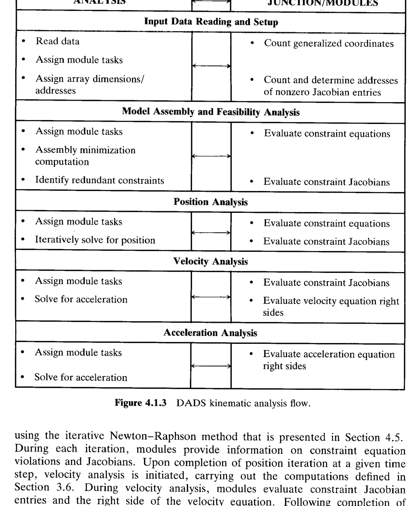

# 4.1 计算的组织（Organization of Computations）

> 来源：*Computer Aided Kinematics and Dynamics of Mechanical Systems*，第 4 章，前言与 4.1 节（书页 118–124）。

## 引言：本节要解决什么

第 3 章给出了平面笛卡尔运动学的**全部控制方程**（约束方程、速度方程、加速度方程）。但那些例子都是小规模机构——人可以手工编号刚体、排约束方程、算雅可比（Jacobian）与右端项。一旦系统规模变大，光是"记账"（bookkeeping）——谁是第几个约束、非零条目落在矩阵哪一行哪一列——就既费时又易错。

第 4 章的目标：把这套控制方程的**组装（assembly）与求解（solution）交给计算机自动完成**。主线逻辑：

1. **前言**先厘清运动学计算的**四种模式（four modes）**：装配、位置分析、速度分析、加速度分析——为什么它们数学难度不同、又如何串成一条时间推进的流水线。
2. **§4.1** 不进入具体数值算法，而是先鸟瞰一款真实大型代码 **DADS（Dynamic Analysis and Design System）** 的**计算组织架构**：三大部件（Fig. 4.1.1）→ 运动学分析程序的三层内部结构 ANALYSIS/JUNCTION/MODULES（Fig. 4.1.2）→ 五个计算阶段的详细数据流（Fig. 4.1.3）。
3. 本节确立一个贯穿全章的关键设计思想：**用"标志（flag）+ 分派（dispatch）+ 模块（module）"把不同计算阶段统一到同一套子程序调用框架里**，具体数值方法（Newton–Raphson、Gauss 消元、秩检测……）留待 §4.2–§4.6 展开。

---

## 第 4 章 前言：运动学的四种数值计算模式

### 为什么需要数值方法

第 3 章的控制方程有如下特点：

- **位置方程**是关于广义坐标（generalized coordinates）$\mathbf{q}$ 的**非线性**方程组。非线性来自约束里的 $\cos\phi,\sin\phi$、距离约束的平方等，一般**无法解析求解**，必须使用数值方法迭代求解。
  $$\boldsymbol{\Phi}(\mathbf{q},t)=\mathbf{0}.$$
  
- **速度方程**与**加速度方程**是关于 $\dot{\mathbf{q}},\ddot{\mathbf{q}}$ 的**线性**方程组。而**线性方程组求解**非常适合用矩阵分解（matrix factorization）在计算机上高效完成。：
  $$\boldsymbol{\Phi}_\mathbf{q}\dot{\mathbf{q}}=\boldsymbol{\nu},\qquad \boldsymbol{\Phi}_\mathbf{q}\ddot{\mathbf{q}}=\boldsymbol{\gamma}.$$

综上，再叠加大规模系统"变量多到写不出显式方程"的现实，就必然走向数值化：让计算机既**组装**又**求解**运动学方程。

### 四种运动学计算模式

1. **装配（assembly）**
   已知每个部件位置/朝向的**估计值**和控制约束方程，求一个满足全部约束的**协调初始构型**。
   它与位置分析在理论上相似（都要解运动学约束 + 驱动条件），差别在于位置分析是从一个**已装配构型**出发往前推进，初值正确；对于装配，用户给的估计值，可能是一个**物理上根本装不起来**、或约束不独立的系统。
   正因如此，装配需要一套更稳健的方法（§3.6 的**装配最小化**：把约束违背量做成目标函数去极小化，而非直接 Newton 迭代），单独作为一种模式对待。

2. **位置分析（position analysis）**
   一旦拿到了带**独立**运动学与驱动约束的装配构型，就可以在**时间网格（time grid）**的每个时刻，用**快速收敛且高效**的数值方法（Newton–Raphson，§4.5）求解位置方程。

3. **速度分析（velocity analysis）**
   位置已知后，把 $\mathbf{q}$ 代入并求解线性的速度方程 $\boldsymbol{\Phi}_\mathbf{q}\dot{\mathbf{q}}=\boldsymbol{\nu}$。

4. **加速度分析（acceleration analysis）**
   再结合位置与速度结果，评估并求解加速度方程 $\boldsymbol{\Phi}_\mathbf{q}\ddot{\mathbf{q}}=\boldsymbol{\gamma}$。

---

## 4.1 计算的组织（Organization of Computations）

### 思路

本节引入一款为实现本书理论而开发的大型运动学/动力学代码 **DADS（Dynamic Analysis and Design System）**，它同时支持**平面与空间**、**运动学与动力学**分析（平面例子见第 5、8 章，空间例子见第 10、12 章）。本节只讲 DADS **运动学部分**的**计算组织（谁在什么阶段、调用谁、算什么、把结果交给谁）**，不涉及底层数值算法。

### 4.1.1 DADS 的三大部件（Fig. 4.1.1）

就运动学分析而言，DADS 由三个基本部件组成：

1. **前处理器（preprocessor）**：收集问题定义信息、组织计算所需的数据。
2. **运动学分析程序（kinematic analysis program）**：构造并求解运动学方程。
3. **后处理器（postprocessor）**：整理输出信息、显示仿真结果。

**前处理器**里编入了逻辑，允许用户：
- 输入刚体名字/编号，定义连接成对刚体的**关节（joint）类型**——这就定义了运动学系统的**结构**；
- 逐个关节输入详细数据，供组装运动学方程用；
- 若想要图形/动画输出，还需输入各刚体的外形几何；
- 最后输入仿真时间区间、控制数值求解过程的数据、以及后处理所需的输出形式。

前处理计算的产物是一份**运动学分析数据集（kinematic analysis data set）**，由运动学分析程序读取并执行。

**运动学分析程序**读入该数据集后，方程被**自动组装并求解**：
- 先执行 §3.6 的**装配分析**，以前处理给的估计值为初值。若装配成功，运动学分析继续；若失败，提示用户初值太差或设计不可行。
- 装配成功后，用约束雅可比做**计算检查**：通过评估雅可比 $\boldsymbol{\Phi}_\mathbf{q}$ 的**行秩（row rank）**判断模型中是否定义了**冗余约束（redundant constraint）**。若雅可比**不满行秩**，提示存在冗余约束、需重构模型；冗余约束会被自动移除，若驱动数目正确，分析照常进行。
- 一旦得到可行模型，就在用户指定的时间区间上执行**位置、速度、加速度分析**，预测系统的运动学性能，并把结果输出数据集交给后处理器。

**后处理器**负责打印表格输出、绘制关注变量的曲线，或向高速图形设备发送指令，在终端屏幕/录像上显示系统运动的动画，供回放与评估。

> 作者提醒：实现 Fig. 4.1.1 这套逻辑与数值计算需要大型代码，其细节超出本书范围；但**使用者理解其基本思想与方法**很重要，才能正确解读结果、建出贴近现实的模型。因此在进入后续数值方法之前，先看它**如何控制计算流程**。

### 4.1.2 运动学分析程序的内部结构：ANALYSIS / JUNCTION / MODULES

进一步放大"运动学分析程序"这一块，它本身又由三个基本元素组成：
1. **ANALYSIS（分析程序）**：控制运动学分析的整个流程。
2. **JUNCTION（枢纽/分派程序）**：把任务指派给一组计算模块（子程序）。
3. **MODULES（模块库）**：与本公式支持的**刚体和关节类型**一一对应的子程序库。

三者的协作机制是本节的**核心设计思想**，可以概括成一条"标志—分派—模块—回填"的流水线：

- **ANALYSIS 用整型标志（flags/integers）标记当前处于哪个分析阶段**（装配 / 位置 / 速度 / 加速度……），并据此向 JUNCTION 下达"在这一步要组装哪些项"的指令。
- **JUNCTION 接到指令后，把"评估某某项"的任务分派给对应的计算模块**。例如"评估转动关节的约束方程"就派给转动关节模块。
- **MODULES 各自只干一件事**：评估自己负责的那一类刚体/关节的项——约束方程、约束雅可比条目、速度方程右端、加速度方程右端等——然后把结果回传给 JUNCTION。
- **JUNCTION 把回传的各模块结果装配成数组（arrays）**，再上交给 ANALYSIS。
- **ANALYSIS 用这些数组去求解本阶段被指派的方程**。随运动学分析推进，该过程不断重复。

这套结构的好处：**新增一种关节类型 = 新增一个模块**，而 ANALYSIS 和 JUNCTION 的控制逻辑不必改动；不同计算阶段共用同一套调用框架，只靠标志切换。它也正是 §4.2 "非零条目方案（nonzero entry scheme）"的组织基础——每个关节模块只吐出自己那几个雅可比非零条目及其行列指针。

### 4.1.3 五个计算阶段的详细数据流（Fig. 4.1.3）

Fig. 4.1.3 把 ANALYSIS 与 JUNCTION/MODULES 之间的分工，按**五个计算阶段**逐段展开，箭头表示两侧的数据往返：

**阶段 1 — 输入数据读取与设置（Input Data Reading and Setup）**
- ANALYSIS 侧：读数据、指派模块任务、确定数组维度/地址。
- JUNCTION/MODULES 侧：统计**广义坐标数目**；统计并确定雅可比**非零条目的地址（行、列号）**。
- 意义：这一步只做"记账/预分配"。当 ANALYSIS 建立起执行运动学分析所需的数组维度与地址后，问题**设置阶段（setup phase）**完成——把后续频繁调用中最耗时的"找位置"提前一次性算好。

**阶段 2 — 模型装配与可行性分析（Model Assembly and Feasibility Analysis）**
- ANALYSIS 侧：指派模块任务、执行**装配最小化计算**（§3.6）、**识别冗余约束**。
- JUNCTION/MODULES 侧：评估约束方程、评估约束雅可比。
- 意义：在 §3.6 的装配最小化每一步迭代中，模块生成极小化所需的约束方程与雅可比信息（该极小化计算见 §4.3）。装配成功后，一个分析子程序用 §4.4 的 **Gauss 消元法**对约束雅可比做**秩检查**，识别可能存在的冗余约束。可行则继续，否则提示需细化模型或估计数据。

**阶段 3 — 位置分析（Position Analysis）**
- ANALYSIS 侧：指派模块任务、**迭代求解位置**。
- JUNCTION/MODULES 侧：评估约束方程、评估约束雅可比。
- 意义：在每个时间步用 §4.5 的迭代 **Newton–Raphson** 法求位置；每次迭代模块提供约束违背量与雅可比信息。

**阶段 4 — 速度分析（Velocity Analysis）**
- ANALYSIS 侧：指派模块任务、求解速度。
- JUNCTION/MODULES 侧：评估约束雅可比、评估**速度方程右端**。
- 意义：某一时间步位置迭代收敛后，启动速度分析（计算见 §3.6），模块给出雅可比条目与速度方程右端。

**阶段 5 — 加速度分析（Acceleration Analysis）**
- ANALYSIS 侧：指派模块任务、求解加速度。
- JUNCTION/MODULES 侧：只需评估**加速度方程右端**。
- 意义：这里体现了一个重要的**复用优化**——加速度方程的系数矩阵就是约束雅可比 $\boldsymbol{\Phi}_\mathbf{q}$，与速度分析阶段构造的**完全相同**，所以模块**无需重算雅可比，只提供加速度方程右端 $\boldsymbol{\gamma}$**。这正是 §4.2 将强调的"三个阶段共用同一 $\boldsymbol{\Phi}_\mathbf{q}$、只换右端项"的思想，为 §4.4 "一次分解、多次回代"埋下伏笔。

**时间推进闭环**：加速度分析完成后，若已到达末时刻则分析终止；否则时间步进到下一步，控制权交回位置分析，如此循环直至整段运动学仿真结束。

---

## 小结

- 第 4 章前言把运动学计算拆成**四种模式**：装配（最难，可能无好初值/不可装配）、位置（非线性，Newton–Raphson）、速度、加速度（后二者是线性求解）。
- §4.1 用 DADS 代码示范**计算的组织**：三大部件（前处理 / 运动学分析 / 后处理，Fig. 4.1.1）→ 运动学分析程序的 **ANALYSIS/JUNCTION/MODULES** 三层结构（Fig. 4.1.2）→ **五阶段数据流**（Fig. 4.1.3）。
- 贯穿全节的设计思想：**标志切阶段、JUNCTION 分派、MODULES 只算自己那一份、结果回填成数组**；关节类型可插拔，各阶段共用调用框架；**加速度阶段复用速度阶段的雅可比**。
- 具体数值方法（非零条目方案 §4.2、装配 §4.3、矩阵分解 §4.4、Newton–Raphson §4.5、冗余约束检测/消除 §4.6）在后续各节展开。
