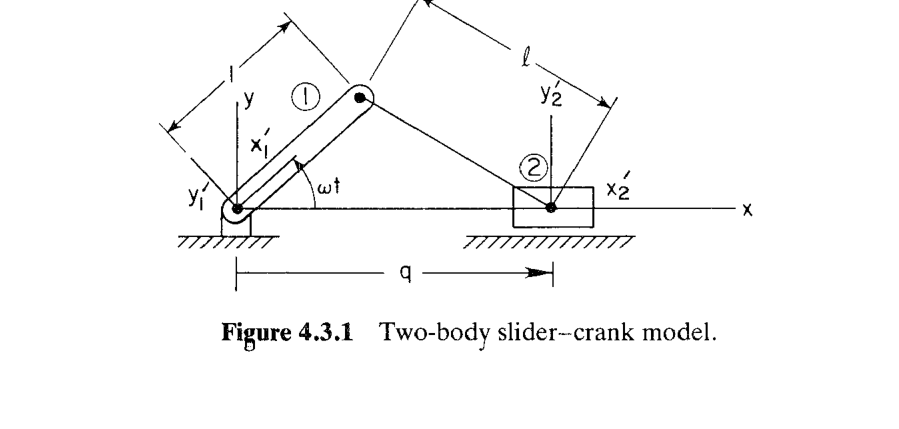

# 4.3 系统的装配（Assembly of a System）

> 来源：*Computer Aided Kinematics and Dynamics of Mechanical Systems*，第 4 章，4.3 节（书页 127–132 顶部）。

## 引言：本节要解决什么

运动学分析（kinematic analysis）在初始时刻 $t_0$ 必须先把机构"装配"起来——即解出满足全部约束方程的初始构型（configuration）$\mathbf{q}$。这是后续整段时间仿真的起点。本节回答：**装配怎么算，算不出来怎么办。** 主线逻辑：

1. 装配 = 在 $t_0$ 解非线性约束方程组 $\boldsymbol{\Phi}(\mathbf{q},t_0)=\mathbf{0}$（Eq. 4.3.1）。约束数通常取与坐标数相等，约束独立则雅可比（Jacobian）非奇异，Newton–Raphson 可解。
2. 但用户可能给少了驱动约束、给了非独立约束（雅可比秩亏），或 $t_0$ 恰落在奇异构型（singular configuration），此时 Newton–Raphson 会失败。例 4.3.1 用最简单的曲柄滑块（slider–crank）把三种典型情形——**正常收敛 / 奇异慢收敛 / 无解发散**——逐一展示。
3. 既然 Newton–Raphson 在秩亏或无解时不可靠，需要一个**稳健**的装配方法：把"满足约束"改写成"最小化误差"，得到离初始估计 $\mathbf{q}^0$ 最近的近似装配构型（Eq. 4.3.2–4.3.3）。
4. 大规模系统用**共轭梯度法**（conjugate gradient，Fletcher–Powell）最小化，其梯度只需约束函数与雅可比（Eq. 4.3.4）——即运动学其他模式已具备的计算机制，可直接复用。

---

## 4.3.1 装配问题：约束方程的合法性

### 思路

装配就是在初始时刻把所有约束同时满足。回顾 Eq. 3.6.3 的系统约束方程，在 $t_0$ 处写作：

$$
\boldsymbol{\Phi}(\mathbf{q},t_0) =
\begin{bmatrix} \boldsymbol{\Phi}^{K}(\mathbf{q}) \\ \boldsymbol{\Phi}^{D}(\mathbf{q},t_0) \end{bmatrix} = \mathbf{0}
\tag{4.3.1}
$$

其中 $\boldsymbol{\Phi}^{K}$ 是**运动学约束**（kinematic constraint），$\boldsymbol{\Phi}^{D}$ 是**驱动约束**（driving constraint）。

### 何时能解、何时失败

- **正常情形**：运动学约束与驱动约束的总数通常**取与广义坐标数相等**。若这些约束相互独立，雅可比 $\boldsymbol{\Phi}_\mathbf{q}$ 非奇异，Newton–Raphson 迭代收敛。
- **可能的失败**：
  1. 驱动约束给得不够（约束数 < 坐标数）；
  2. 指定的运动学/驱动约束与系统已有约束**非独立**——雅可比**秩亏**（rank deficient），Newton–Raphson 可能失败；
  3. 初值有问题：$t_0$ 恰为**奇异构型**，或机构在 $t_0$ **根本无法装配**——Newton–Raphson 必然失败。

下面用例 4.3.1 来展示这些失败情况。

---

## 例 4.3.1：两体曲柄滑块的装配（Fig. 4.3.1）

> **设置**：例 3.7.3 研究过的两体曲柄滑块模型，由条件 $\phi_1=\omega t$ 驱动。绝对约束（absolute constraint）要求 $x_1=y_1=y_2=\phi_2=0$，于是 $x_2=q$ 成为**唯一的广义坐标**。

### 约束方程

曲柄（crank）长度为 1，其末端点坐标为 $(\cos\omega t,\ \sin\omega t)$；滑块（slider）中心在 $(q,0)$。耦合体（coupler）长度 $\ell$ 把这两点连起来，给出距离约束（耦合体长度平方 = $\ell^2$）：

$$
(q-\cos\omega t)^2 + (0-\sin\omega t)^2 = \ell^2
$$

整理为标准约束形式（在这个例题中，不失一般性，为简化表达，我们令常量 $\omega=1$）：

$$
\boldsymbol{\Phi}(q,t) = (q-\cos t)^2 + \sin^2 t - \ell^2 = 0
\tag{例 4.3.1}
$$

对 $q$ 求偏导得到 Jacobian：

$$
\boldsymbol{\Phi}_q(q,t)=\frac{\partial}{\partial q}\Big[(q-\cos t)^2+\sin^2 t-\ell^2\Big]
=  2(q-\cos t)
$$

接下来按照 Newton-Raphson，需要先给定一个预估的初值（对于本例来说，就是某个确定时间 $t$ 下，给定一个 $q$ 的估计值），然后使用下面的式子不断修正，直到满足约束：$\boldsymbol{\Phi}_q^{(i)}\Delta q^{(i)}=-\boldsymbol{\Phi}^{(i)}$，再 $q^{(i+1)}=q^{(i)}+\Delta q^{(i)}$。

下面看三种初值情形。

### Case 1：$t_0=0,\ q^{(0)}=2$ —— 正常二阶收敛

此时 $\cos 0=1,\ \sin 0=0$，约束退化为 $(q-1)^2-\ell^2=0$，解 $q=1\pm\ell=1\pm\tfrac{\sqrt2}{2}$。从 $q^{(0)}=2$ 出发收敛到较近的根 $q=\dfrac{2+\sqrt2}{2}\approx1.7071$。

| $i$ | $q^{(i)}$ | $\boldsymbol{\Phi}(q^{(i)},0)$ | $\boldsymbol{\Phi}_q(q^{(i)},0)$ | $\Delta q^{(i)}$ | $\bigl\lvert q^{(i)}-\tfrac{2+\sqrt2}{2}\bigr\rvert$ |
|---|---|---|---|---|---|
| 0 | 2.000000 | 0.500000 | 2.000000 | −0.250000 | 0.292893 |
| 1 | 1.750000 | 0.062500 | 1.500000 | −0.041667 | 0.042893 |
| 2 | 1.708333 | 0.001736 | 1.416607 | −0.001225 | 0.001226 |
| 3 | 1.707108 | 0.000000 | 1.414216 | −0.000000 | 0.000001 |

> **TABLE 4.3.1**：误差列每步约平方缩小（$0.29\to0.043\to0.0012\to10^{-6}$），是雅可比非奇异时 Newton–Raphson 的典型**二阶收敛**。

### Case 2：$t_0=\pi/4,\ q^{(0)}=1$ —— 奇异解、线性收敛

此时 $\cos\tfrac\pi4=\sin\tfrac\pi4=\tfrac{\sqrt2}{2}$，约束化为

$$
\boldsymbol{\Phi}=\Big(q-\tfrac{\sqrt2}{2}\Big)^2+\tfrac12-\tfrac12 = \Big(q-\tfrac{\sqrt2}{2}\Big)^2=0
\ \Longrightarrow\ q=\frac{\sqrt2}{2}\ (\text{二重根})
$$

二重根处 $\boldsymbol{\Phi}_q=2\big(q-\tfrac{\sqrt2}{2}\big)=0$——雅可比在解处为零，**方程奇异**。Newton–Raphson 仍收敛到奇异解 $q=\sqrt2/2$，但**收敛速度远慢于 Case 1**：误差列每步只大致减半（线性）。

| $i$ | $q^{(i)}$ | $\boldsymbol{\Phi}(q^{(i)},\pi/4)$ | $\boldsymbol{\Phi}_q(q^{(i)},\pi/4)$ | $\Delta q^{(i)}$ | $\bigl\lvert q^{(i)}-\tfrac{\sqrt2}{2}\bigr\rvert$ |
|---|---|---|---|---|---|
| 0 | 1.000000 | 0.085786 | 0.585786 | −0.146447 | 0.292893 |
| 1 | 0.853553 | 0.021447 | 0.292893 | −0.073223 | 0.146447 |
| 2 | 0.780330 | 0.005362 | 0.146447 | −0.036612 | 0.073223 |
| 3 | 0.743718 | 0.001340 | 0.073223 | −0.018306 | 0.036612 |
| 4 | 0.725413 | 0.000335 | 0.036612 | −0.009153 | 0.018306 |
| 5 | 0.716260 | 0.000084 | 0.018306 | −0.004576 | 0.009153 |
| 6 | 0.711683 | 0.000021 | 0.009153 | −0.002288 | 0.004576 |
| 7 | 0.709395 | 0.000005 | 0.004576 | −0.001144 | 0.002288 |
| 8 | 0.708251 | 0.000001 | 0.002288 | −0.000572 | 0.001144 |
| 9 | 0.707679 | 0.000000 | 0.001144 | −0.000286 | 0.000572 |
| 10 | 0.707393 | 0.000000 | 0.000572 | −0.000143 | 0.000286 |
| 11 | 0.707250 | 0.000000 | 0.000286 | −0.000072 | 0.000143 |
| 12 | 0.707178 | 0.000000 | 0.000143 | −0.000036 | 0.000072 |
| 13 | 0.707143 | 0.000000 | 0.000072 | −0.000018 | 0.000036 |
| 14 | 0.707125 | 0.000000 | 0.000036 | −0.000009 | 0.000018 |
| 15 | 0.707116 | 0.000000 | 0.000018 | −0.000004 | 0.000009 |
| 16 | 0.707111 | 0.000000 | 0.000009 | −0.000002 | 0.000004 |
| 17 | 0.707109 | 0.000000 | 0.000004 | −0.000001 | 0.000002 |
| 18 | 0.707108 | 0.000000 | 0.000003 | −0.000001 | 0.000002 |
| 19 | 0.707108 | 0.000000 | 0.000002 | −0.000000 | 0.000001 |
| 20 | 0.707107 | 0.000000 | 0.000001 | −0.000000 | 0.000000 |

> **TABLE 4.3.2**：误差 $0.29\to0.146\to0.073\to\dots$ 每步约 $\times\tfrac12$，即**线性收敛**，迭代 20 步才到 $10^{-6}$。
> **结论**：奇异方程若有解，Newton–Raphson 只**线性收敛**；在多方程大系统中，数值误差可能压倒收敛，导致极慢甚至无法收敛。

### Case 3：$t_0=3\pi/8,\ q^{(0)}=1$ —— 无解、迭代乱走

$\omega t_0=3\pi/8>\pi/4$，已越过锁死时刻 $t^{*}$，$\sin(3\pi/8)\approx0.924>\ell=0.707$，**约束无解**。Newton–Raphson 不可能收敛，迭代值在数轴上**毫无规律地乱走**（meander），$q^{(i)}$ 时正时负、$\Delta q^{(i)}$ 时大时小：

| $i$ | $q^{(i)}$ | $\boldsymbol{\Phi}(q^{(i)},3\pi/8)$ | $\boldsymbol{\Phi}_q(q^{(i)},3\pi/8)$ | $\Delta q^{(i)}$ |
|---|---|---|---|---|
| 0 | 1.000000 | 0.734633 | 1.234633 | −0.595021 |
| 1 | 0.404979 | 0.354050 | 0.044590 | −7.940071 |
| 2 | −7.535093 | 63.044735 | −15.835553 | 3.981215 |
| 3 | −3.553878 | 15.850071 | −7.873125 | 2.013187 |
| 7 | 1.029996 | 0.772566 | 1.294024 | −0.596750 |
| 9 | −3.088236 | 12.400835 | −6.941839 | 1.780391 |
| 13 | 1.689582 | 2.061537 | 2.613797 | −0.788714 |
| 15 | 0.300630 | 0.360286 | −0.164107 | 2.195438 |

> **TABLE 4.3.3（节选）**：无解时迭代仅"漫游"；有时甚至发散到计算机溢出（overflow）。

---

## 最小化法：稳健的装配构型 / 初值

### 思路

Eq. 4.3.1 的非线性约束可能含冗余约束（redundant constraint），从而**不唯一确定**位置，甚至**无解**。所以需要一个**稳健**的计算方法：要么给出尽量满足 Eq. 4.3.1 的好估计，要么判定无解。基本思想——**把"解方程"换成"最小化误差"**：找一个尽量满足 Eq. 4.3.1、又尽量靠近用户初始估计 $\mathbf{q}^0$ 的构型。$\mathbf{q}^0$ 由用户提供（可用实验数据或图解估计各刚体位置朝向），应尽量准确。

### 目标函数

如 §3.6 所述，目标是最小化

$$
\psi(\mathbf{q},t_0,r) = (\mathbf{q}-\mathbf{q}^0)^{T}(\mathbf{q}-\mathbf{q}^0) + r\,\boldsymbol{\Phi}^{T}(\mathbf{q},t_0)\,\boldsymbol{\Phi}(\mathbf{q},t_0)
\tag{4.3.2}
$$

从而得到装配构型 $\mathbf{q}^{a}$。两项的含义：

- 第一项 $(\mathbf{q}-\mathbf{q}^0)^{T}(\mathbf{q}-\mathbf{q}^0)=\|\mathbf{q}-\mathbf{q}^0\|^2$：惩罚偏离初始估计；
- 第二项 $r\,\boldsymbol{\Phi}^{T}\boldsymbol{\Phi}=r\|\boldsymbol{\Phi}\|^2$：惩罚违反约束，$r>0$ 是**权重常数**，平衡"贴近 $\mathbf{q}^0$"与"满足约束"。

### 罚因子 $r$ 渐增与极限

既然希望约束被满足（若有解），让 $r$ 增长到**很大**以逼迫约束被精确满足。方法：对给定 $r$ 用优化算法求 $\mathbf{q}(r)$ 最小化 $\psi$；然后增大 $r$，以上一解 $\mathbf{q}(r)$ 为起点再解。**渐增很关键**：若一上来就取极大 $r$，收敛会很难（尤其无解时）。装配构型取极限：

$$
\mathbf{q}^{a} = \lim_{r\to\infty} \mathbf{q}(r)
\tag{4.3.3}
$$

实际计算中 $r$ 离散递增 $r_i>r_{i-1}$，用相邻 $\mathbf{q}(r_i)$ 与 $\mathbf{q}(r_{i-1})$ 之差检验极限是否收敛。

### 解的判读

- 若序列 $\mathbf{q}(r_i)$ 收敛，还要**检验 $\mathbf{q}^a$ 是否满足 Eq. 4.3.1**：满足则装配成功；不满足则或系统不可装配，或迭代优化从给定初值无法收敛——此时鼓励用户**换初始估计**重新最小化。这不是严格的数学过程，但工程直觉与图解估计能大大帮上忙。
- 若约束数 < $nc$（$\mathbf{q}$ 的维数），或有 $nc$ 个约束但部分非独立，则 Eq. 4.3.1 可能有**多解**；此时若 $\mathbf{q}^a$ 满足 Eq. 4.3.1，它就是使 Eq. 4.3.2 第一项最小的解——即**最小二乘意义下离 $\mathbf{q}^0$ 最近**的那个解。

---

## 共轭梯度法与 Fletcher–Powell 算法（Eq. 4.3.4）

### 思路

适合大规模系统最小化 Eq. 4.3.2 的方法是非线性规划中的**共轭梯度最小化算法**[28]。几乎所有迭代优化都需要目标函数的**梯度**。

### 目标函数的梯度

对 $\psi$（Eq. 4.3.2）求 $\mathbf{q}$ 的梯度，逐项微分：

$$
\psi_\mathbf{q} = \underbrace{2(\mathbf{q}-\mathbf{q}^0)^{T}}_{\text{第一项}\ \nabla\|\mathbf{q}-\mathbf{q}^0\|^2} + \underbrace{2r\,\boldsymbol{\Phi}^{T}(\mathbf{q},t_0)\,\boldsymbol{\Phi}_\mathbf{q}(\mathbf{q},t_0)}_{\text{第二项}\ \nabla(r\boldsymbol{\Phi}^T\boldsymbol{\Phi})}
\tag{4.3.4}
$$

> **关键**：梯度只需要**约束雅可比 $\boldsymbol{\Phi}_\mathbf{q}$ 与约束函数 $\boldsymbol{\Phi}$**。也就是说，实现运动学其余分析模式（位置/速度/加速度）所需的计算机制，**直接可用于装配模式的数值最小化**——无需新机器。

### Fletcher–Powell 迭代算法 [28,29]

由 Fletcher 与 Powell 发展，序列计算如下（$\mathbf{H}$ 是 $\psi$ 的二阶导矩阵估计，即拟牛顿的逆 Hessian 近似）：

**1.** 取初值 $\mathbf{q}^{(1)}=\mathbf{q}^0$，$\mathbf{H}^{(1)}=\mathbf{H}^0=\mathbf{I}$。

**2.** 第 $i$ 次迭代，计算搜索方向

$$
\mathbf{s}^{i} = -\mathbf{H}^{(i)}\,\psi_\mathbf{q}^{T}(\mathbf{q}^{(i)})
$$

**3.** 用一维线搜索 [28] 找 $\alpha=\alpha^{i}$，使 $\psi(\mathbf{q}^{(i)}+\alpha\mathbf{s}^{i})$ 最小。

**4.** 更新坐标与 $\mathbf{H}$：

$$
\mathbf{q}^{(i+1)} = \mathbf{q}^{(i)} + \alpha^{i}\mathbf{s}^{i}
$$

$$
\mathbf{H}^{(i+1)} = \mathbf{H}^{(i)} + \mathbf{A}^{i} + \mathbf{C}^{i}
$$

其中两个秩一修正项为

$$
\mathbf{A}^{i} = \left(\frac{\alpha^{i}}{\mathbf{s}^{iT}\mathbf{y}^{i}}\right)\mathbf{s}^{i}\mathbf{s}^{iT}
$$

$$
\mathbf{y}^{i} = \psi_\mathbf{q}^{T}(\mathbf{q}^{(i+1)}) - \psi_\mathbf{q}^{T}(\mathbf{q}^{(i)})
$$

$$
\mathbf{C}^{i} = -\left(\frac{1}{\mathbf{y}^{iT}\mathbf{H}^{(i)}\mathbf{y}^{i}}\right)\mathbf{H}^{(i)}\mathbf{y}^{i}\mathbf{y}^{iT}\mathbf{H}^{(i)}
$$

**5.** 若 $\psi_\mathbf{q}(\mathbf{q}^{(i+1)})=\mathbf{0}$，或 $\mathbf{q}^{(i+1)}-\mathbf{q}^{(i)}$ 足够小，则终止；否则 $i\to i+1$ 返回第 2 步。

> 该算法用于大规模系统装配的例子见第 5 章与第 10 章。
