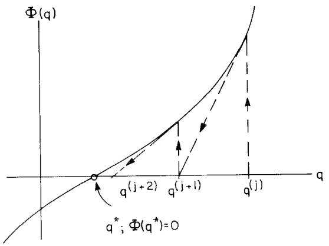
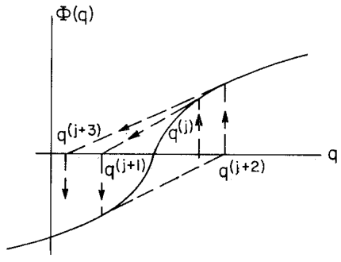
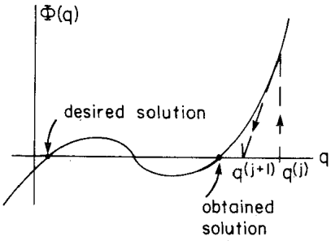
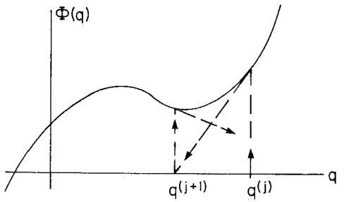

# 4.5 非线性方程的牛顿-拉夫森方法（Newton–Raphson Method for Nonlinear Equations）

> 来源：*Computer Aided Kinematics and Dynamics of Mechanical Systems*，第 4 章，4.5 节（书页 143 底部–146 顶部，4.6 之前）。
> 本文以"文字讲解 + 逐式详细推导"组织，公式推导不跳步骤。

## 引言：本节要解决什么

运动学里最常出现的问题之一，是求解形如

$$
\boldsymbol{\Phi}(\mathbf{q})=\mathbf{0}
\tag{4.5.1}
$$

的**非线性代数方程**——典型例子就是第 3 章的位置方程（约束方程在给定时刻的解）。4.4 节给出的高斯消元、L–U 分解只能解**线性**方程组 $\mathbf{Ax}=\mathbf{b}$；非线性方程没有一步到位的直接解法。本节给出的**牛顿-拉夫森（Newton–Raphson）方法**的核心思想是：

> 只要 $\boldsymbol{\Phi}(\mathbf{q})$ 及其雅可比（Jacobian）$\boldsymbol{\Phi}_\mathbf{q}$ 可计算，就在当前近似解处把 $\boldsymbol{\Phi}$ **线性化**（一阶泰勒展开），解这个线性方程得到改进的近似解，如此**迭代**逼近真解。

主线逻辑：

1. 先讲**单变量**情形（一个方程一个未知数），把迭代公式、算法流程、收敛性质讲透；
2. 用四张图（Fig. 4.5.1–4.5.4）展示方法**何时收敛、何时发散**——初值选取至关重要；
3. 再把同一思路推广到 **$n$ 元**方程组，迭代每一步化为解一个线性方程 $\boldsymbol{\Phi}_\mathbf{q}\,\Delta\mathbf{q}=-\boldsymbol{\Phi}$——这正是把 4.4 节的线性求解器嵌进来的地方。

---

## 4.5.1 单变量的牛顿-拉夫森（One Equation in One Unknown）

### 思路

考虑标量变量 $q$ 的单个非线性方程

$$
\Phi(q)=0
\tag{4.5.2}
$$

设 $q=q^{*}$ 是它的解，$q^{(i)}$ 是 $q^{*}$ 的一个近似。把 $\Phi(q)$ 在点 $q=q^{(i)}$ 处作**泰勒展开（Taylor expansion）**：

$$
\Phi(q)=\Phi(q^{(i)})+\Phi_q(q^{(i)})\,(q-q^{(i)})+\text{高阶项}
\tag{4.5.3}
$$

其中 $\Phi_q\equiv \dfrac{d\Phi}{dq}$ 是 $\Phi$ 对 $q$ 的导数（单变量时雅可比退化为一个数）。

### 推导迭代公式

令下一个改进近似 $q^{(i+1)}$ 由"让线性化后的 $\Phi$ 等于零"这一条件确定。把 Eq. 4.5.3 中的 $q$ 取为 $q^{(i+1)}$，并**丢弃高阶项**（当 $q^{(i+1)}-q^{(i)}$ 很小时它们可忽略）：

$$
\Phi(q^{(i+1)})\approx \Phi(q^{(i)})+\Phi_q(q^{(i)})\,\bigl(q^{(i+1)}-q^{(i)}\bigr)=0
\tag{4.5.4}
$$

若 $\Phi_q(q^{(i)})\neq 0$，从 Eq. 4.5.4 逐步解出 $q^{(i+1)}$：

$$
\begin{aligned}
\Phi_q(q^{(i)})\,\bigl(q^{(i+1)}-q^{(i)}\bigr)&=-\Phi(q^{(i)})\\[4pt]
q^{(i+1)}-q^{(i)}&=-\frac{\Phi(q^{(i)})}{\Phi_q(q^{(i)})}\\[4pt]
q^{(i+1)}&=q^{(i)}-\frac{\Phi(q^{(i)})}{\Phi_q(q^{(i)})}
\end{aligned}
$$

即

$$
\boxed{\ q^{(i+1)}=q^{(i)}-\frac{\Phi(q^{(i)})}{\Phi_q(q^{(i)})}\ }
\tag{4.5.5}
$$

（通分写成单一分式即 $q^{(i+1)}=\dfrac{q^{(i)}\Phi_q(q^{(i)})-\Phi(q^{(i)})}{\Phi_q(q^{(i)})}$，与上式等价。）

Eq. 4.5.5 即标量方程的**牛顿-拉夫森算法（Newton–Raphson algorithm）**，从一个初始估计出发，迭代地产生一串近似解。

### 算法流程

从 Eq. 4.5.2 解的初始估计开始：

1. 给出解的估计 $q^{(0)}$。
2. 在迭代 $i=0,1,\dots$ 中，计算 $\Phi(q^{(i)})$ 与 $\Phi_q(q^{(i)})$。若 $\lvert\Phi(q^{(i)})\rvert<\varepsilon_e$（$\varepsilon_e$ 为**方程误差容限**）且 $\lvert q^{(i)}-q^{(i-1)}\rvert<\varepsilon_s$（$\varepsilon_s$ 为**解误差容限**），则**终止**。若 $\Phi_q(q^{(i)})=0$ 而 $\Phi(q^{(i)})\neq 0$，则返回第 1 步换一个新估计。否则转第 3 步。
3. 由 Eq. 4.5.5 算出 $q^{(i+1)}$，令 $i\leftarrow i+1$，返回第 2 步。

> 两个判停条件缺一不可：$\lvert\Phi\rvert$ 小保证"方程确实接近被满足"，$\lvert q^{(i)}-q^{(i-1)}\rvert$ 小保证"迭代确实收敛、不再移动"。仅看其一可能被假象误导。

### 收敛性质：二阶收敛

牛顿-拉夫森产生的近似序列在很多问题中会趋于 $\Phi(q)=0$ 的解。但**若 $q^{(0)}$ 离 $q^{*}$ 不够近，序列可能发散**。若算法收敛且雅可比非奇异，则它是**二阶收敛（quadratically convergent）**的，即存在常数 $c$ 使

$$
\bigl\lvert q^{(k+1)}-q^{*}\bigr\rvert < c\,\bigl\lvert q^{(k)}-q^{*}\bigr\rvert^{2}
\tag{4.5.6}
$$

含义：每迭代一次，误差大约**按上一次误差的平方**缩小——一旦进入收敛域，精度提升极快（有效位数近似翻倍）。但 Eq. 4.5.6 也是把双刃剑：若 $\lvert q^{(0)}-q^{*}\rvert$ 较大（大于 1），误差同样可能**按平方放大**而发散。

---

## 几何解释（Fig. 4.5.1–4.5.4）

牛顿-拉夫森的每一步，几何上就是"在 $(q^{(i)},\Phi(q^{(i)}))$ 处作 $\Phi(q)$ 的切线，取切线与 $q$ 轴的交点作为 $q^{(i+1)}$"——因为切线斜率正是 $\Phi_q(q^{(i)})$，其与横轴交点恰为 Eq. 4.5.5。

### 收敛情形

**图 4.5.1**：曲线单调且凹性一致时，从 $q^{(j)}$ 出发，切线交点 $q^{(j+1)}$、$q^{(j+2)}$ 依次逼近真解 $q^{*}$（$\Phi(q^{*})=0$），快速收敛。

### 三种失败情形

**图 4.5.2（拐点 inflection point）**：当解恰是曲线的拐点时，切线交点在解两侧来回**振荡**（$q^{(j)}\to q^{(j+1)}\to q^{(j+2)}\to q^{(j+3)}$），方法**发散**。

**图 4.5.3（多解 multiple roots）**：当方程有多个解时，最终收敛到哪个解**取决于初始估计**——图中本想要左侧"desired solution"，但从该 $q^{(j)}$ 出发却收敛到右侧"obtained solution"。

**图 4.5.4（近局部极值）**：当初始估计落在局部极小/极大附近时，该处 $\Phi_q\approx 0$，切线近水平，交点被"甩"到很远，算法**无法收敛**。

> 结论：**必须用一个合理的解估计来启动迭代过程。** 这一点对运动学位置分析尤其关键——上一时刻的解通常就是下一时刻很好的初值。

---

## 4.5.2 $n$ 元的牛顿-拉夫森（n Equations in n Unknowns）

### 思路

把单变量做法推广到 $n$ 个未知数、$n$ 个非线性代数方程：

$$
\begin{aligned}
\Phi_1(\mathbf{q})&\equiv \Phi_1(q_1,q_2,\dots,q_n)=0\\
\Phi_2(\mathbf{q})&\equiv \Phi_2(q_1,q_2,\dots,q_n)=0\\
&\;\;\vdots\\
\Phi_n(\mathbf{q})&\equiv \Phi_n(q_1,q_2,\dots,q_n)=0
\end{aligned}
\tag{4.5.7}
$$

解向量记为 $\mathbf{q}^{*}\equiv[q_1^{*},q_2^{*},\dots,q_n^{*}]^{T}$。思路与单变量完全一致，只是"导数"换成**雅可比矩阵** $\boldsymbol{\Phi}_\mathbf{q}$（$n\times n$），"除以导数"换成"乘以雅可比的逆"（实际操作是解线性方程）。

### 推导迭代公式

在解的估计 $\mathbf{q}^{(i)}$ 处对 Eq. 4.5.7 作**一阶泰勒展开**，丢弃高阶项，令改进近似 $\mathbf{q}^{(i+1)}$ 满足一阶近似为零：

$$
\boldsymbol{\Phi}(\mathbf{q}^{(i)})+\boldsymbol{\Phi}_\mathbf{q}(\mathbf{q}^{(i)})\,\bigl[\mathbf{q}^{(i+1)}-\mathbf{q}^{(i)}\bigr]=\mathbf{0}
$$

这是 Eq. 4.5.4 的向量版本（雅可比 $\boldsymbol{\Phi}_\mathbf{q}$ 的第 $(k,l)$ 元为 $\partial\Phi_k/\partial q_l$）。引入增量 $\Delta\mathbf{q}^{(i)}\equiv \mathbf{q}^{(i+1)}-\mathbf{q}^{(i)}$，若雅可比 $\boldsymbol{\Phi}_\mathbf{q}(\mathbf{q}^{(i)})$ 非奇异，则上式可整理成对 $\Delta\mathbf{q}^{(i)}$ 的**线性方程**：

$$
\boxed{\ \boldsymbol{\Phi}_\mathbf{q}(\mathbf{q}^{(i)})\,\Delta\mathbf{q}^{(i)}=-\boldsymbol{\Phi}(\mathbf{q}^{(i)})\ }
\tag{4.5.8}
$$

解出 $\Delta\mathbf{q}^{(i)}$ 后，更新

$$
\mathbf{q}^{(i+1)}=\mathbf{q}^{(i)}+\Delta\mathbf{q}^{(i)}.
$$

> 这一步正是 4.4 节的用武之地：Eq. 4.5.8 是标准线性方程组 $\mathbf{A}\mathbf{x}=\mathbf{b}$（$\mathbf{A}=\boldsymbol{\Phi}_\mathbf{q}$，$\mathbf{x}=\Delta\mathbf{q}^{(i)}$，$\mathbf{b}=-\boldsymbol{\Phi}$），用高斯消元或 L–U 分解求解。注意这里**不显式求逆** $\boldsymbol{\Phi}_\mathbf{q}^{-1}$，而是直接解线性方程——更省、更稳。

### 算法流程

1. 给出 Eq. 4.5.7 解的初始估计 $\mathbf{q}^{(0)}$。
2. 在迭代 $i=0,1,2,\dots$ 中，计算 $\boldsymbol{\Phi}(\mathbf{q}^{(i)})$ 与 $\boldsymbol{\Phi}_\mathbf{q}(\mathbf{q}^{(i)})$。若所有误差与解的改变量满足

$$
\bigl\lvert\Phi_k(\mathbf{q}^{(i)})\bigr\rvert\le \varepsilon_e,\qquad
\bigl\lvert q_k^{(i)}-q_k^{(i-1)}\bigr\rvert\le \varepsilon_s,\qquad k=1,\dots,n
$$

则**终止**。若 $\boldsymbol{\Phi}_\mathbf{q}(\mathbf{q}^{(i)})$ 奇异而 $\boldsymbol{\Phi}(\mathbf{q}^{(i)})\neq\mathbf{0}$，返回第 1 步换新估计重启。否则转第 3 步。（$\varepsilon_e$ 为方程误差容限，$\varepsilon_s$ 为解误差容限。）
3. 解 $\boldsymbol{\Phi}_\mathbf{q}(\mathbf{q}^{(i)})\,\Delta\mathbf{q}^{(i)}=-\boldsymbol{\Phi}(\mathbf{q}^{(i)})$，令 $\mathbf{q}^{(i+1)}=\mathbf{q}^{(i)}+\Delta\mathbf{q}^{(i)}$，$i\leftarrow i+1$，返回第 2 步。

### 收敛与应用

方程组情形的收敛性质与标量情形**本质相同**（同样二阶收敛、同样对初值敏感）。牛顿-拉夫森用于运动学位置分析的数值实例，已在**例 3.6.2** 与**例 4.3.1** 中针对两种不同机构给出。

---

## 小结

| 项目 | 单变量（标量） | $n$ 元（向量） |
|------|---------------|---------------|
| 方程 | $\Phi(q)=0$ (4.5.2) | $\boldsymbol{\Phi}(\mathbf{q})=\mathbf{0}$ (4.5.7) |
| 线性化 | $\Phi(q^{(i)})+\Phi_q\,(q^{(i+1)}-q^{(i)})=0$ (4.5.4) | $\boldsymbol{\Phi}(\mathbf{q}^{(i)})+\boldsymbol{\Phi}_\mathbf{q}\,\Delta\mathbf{q}^{(i)}=\mathbf{0}$ |
| 迭代 | $q^{(i+1)}=q^{(i)}-\Phi/\Phi_q$ (4.5.5) | 解 $\boldsymbol{\Phi}_\mathbf{q}\,\Delta\mathbf{q}^{(i)}=-\boldsymbol{\Phi}$ (4.5.8)，再 $\mathbf{q}^{(i+1)}=\mathbf{q}^{(i)}+\Delta\mathbf{q}^{(i)}$ |
| 收敛 | 二阶收敛，对初值敏感 (4.5.6) | 同左 |

- 牛顿-拉夫森把"解非线性方程"化为"反复解线性方程"，从而把 §4.4 的线性求解器（高斯消元 / L–U 分解）直接接入运动学位置分析。
- 关键限制：雅可比须非奇异，且初值须足够接近真解，否则可能在拐点振荡、收敛到非期望解、或在极值点附近发散（Fig. 4.5.2–4.5.4）。
