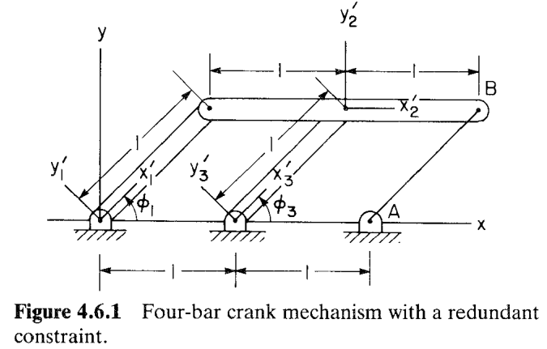

# 4.6 冗余约束的检测与消除（Detection and Elimination of Redundant Constraints）

> 来源：*Computer Aided Kinematics and Dynamics of Mechanical Systems*，第 4 章，4.6 节（书页 146 – 150）。

## 引言：本节要解决什么

本节介绍了如何利用高斯消元法的变量划分，来剔除约束方程组中的冗余方程。

---

## 一、清除冗余的运动学约束

### 背景

第 3 章把一个系统写成 $nh$ 个运动学约束方程：

$$
\boldsymbol{\Phi}^{K}(\mathbf{q})=\mathbf{0}
\tag{4.6.1}
$$

并断言系统自由度（degrees of freedom）为 $3nb-nh$（$nb$ 为物体数）。但这个公式**只在 $nh$ 个约束彼此独立时才成立**。一旦写进去的约束里混有**冗余约束（redundant constraint）**——即某些约束可由其余约束推出、并不真正限制额外自由度——真实自由度就**不是** $3nb-nh$。

现在要做的事情，就是清除这其中的冗余约束。

### 利用高斯消元法进行变量划分

考虑一个**虚位移** $\delta\mathbf{q}$，要求它满足运动学约束：

$$
\boldsymbol{\Phi}^{K}_{\mathbf{q}}\,\delta\mathbf{q}=\mathbf{0}
\tag{4.6.2}
$$

对左端的雅可比 $\boldsymbol{\Phi}^{K}_{\mathbf{q}}$ 施行高斯消元（含变量重排）。把 $\delta\mathbf{q}$ 相应地划分为非独立部分 $\delta\mathbf{u}$ 与独立部分 $\delta\mathbf{v}$（划分规则参考§4.4），消元后的方程取如下分块上三角形：

$$
\begin{bmatrix}
\boldsymbol{\Phi}^{KI}_{\mathbf{u}} & \boldsymbol{\Phi}^{KI}_{\mathbf{v}}\\[2pt]
\mathbf{0} & \boldsymbol{\Phi}^{KR}_{\mathbf{v}}
\end{bmatrix}
\begin{bmatrix}\delta\mathbf{u}\\ \delta\mathbf{v}\end{bmatrix}=\mathbf{0}
\tag{4.6.3}
$$

其中 $\boldsymbol{\Phi}^{KI}_{\mathbf{u}}$ 是 $nh'\times nh'$ 的三角阵、对角线全为 $1$，且 $nh'\le nh$；而 $\boldsymbol{\Phi}^{KR}_{\mathbf{v}}$ 是**零矩阵**。

> 虽然理论上 $\boldsymbol{\Phi}^{KR}_{\mathbf{v}}$ 是零矩阵。但实际上由于计算误差，$\boldsymbol{\Phi}^{KR}_{\mathbf{v}}$ 的元素不会恰好为零。

### 剔除冗余约束

把 $\boldsymbol{\Phi}^{KR}_{\mathbf{v}}=\mathbf{0}$ 代入 Eq. 4.6.3，方程组退化为：

$$
\boldsymbol{\Phi}^{KI}_{\mathbf{u}}\,\delta\mathbf{u}+\boldsymbol{\Phi}^{KI}_{\mathbf{v}}\,\delta\mathbf{v}=\mathbf{0}
\tag{4.6.4}
$$

由于 $\boldsymbol{\Phi}^{KI}_{\mathbf{u}}$ 三角且对角线全为 $1$，其行列式

$$
\lvert\boldsymbol{\Phi}^{KI}_{\mathbf{u}}\rvert=1\neq 0
$$

故 $\boldsymbol{\Phi}^{KI}_{\mathbf{u}}$ 可逆，从 Eq. 4.6.4 解出 $\delta\mathbf{u}$：

$$
\boldsymbol{\Phi}^{KI}_{\mathbf{u}}\,\delta\mathbf{u}=-\boldsymbol{\Phi}^{KI}_{\mathbf{v}}\,\delta\mathbf{v}
\;\Longrightarrow\;
\boxed{\ \delta\mathbf{u}=-\bigl(\boldsymbol{\Phi}^{KI}_{\mathbf{u}}\bigr)^{-1}\boldsymbol{\Phi}^{KI}_{\mathbf{v}}\,\delta\mathbf{v}\ }
$$

即非独立虚位移 $\delta\mathbf{u}$ 完全由独立虚位移 $\delta\mathbf{v}$ 决定，互相之间独立无关。容易确定，与 $\boldsymbol{\Phi}^{KI}_{\mathbf{u}}$ 对应的那 $nh'$ 个约束方程是**独立**的，记作

$$
\boldsymbol{\Phi}^{KI}(\mathbf{q})=\mathbf{0}
\tag{4.6.5}
$$

而剩下的约束 $\boldsymbol{\Phi}^{KR}$（对应被消成零行的部分）就是**冗余约束**，应予剔除。

### 孤立奇异点的甄别

有一个陷阱：若初始构型恰好是一个**孤立奇异点（isolated singular point）**——某个约束**仅在该点**表现得像冗余约束，离开该点就不再冗余。识别办法是**扰动**：

> 把少数几个广义坐标稍作扰动，固定这些扰动值后**重新装配**系统。若重装后雅可比的**行秩升高**，则说明该约束只是在那个孤立奇异点处"看似冗余"，并非真冗余。在重装构型上复查，就能定出系统**真正**的冗余约束个数。

剔除这些非独立约束后，得到 $nh'$ 个独立运动学约束。

---

## 二、驱动约束的冗余检测

### 思路

剔除冗余运动学约束后，系统有 $3nb-nh'$ 个自由度。要做运动学分析，需要补上同样数目的**驱动约束**

$$
\boldsymbol{\Phi}^{D}(\mathbf{q},t)=\mathbf{0},\qquad 3nb-nh'=d
\tag{4.6.6}
$$

这 $d$ 个驱动约束必须**彼此独立**，并且**与保留下来的运动学约束 Eq. 4.6.1 独立**。一个冗余的驱动约束，可能依赖于其他驱动约束，也可能依赖于运动学约束。由于 Eq. 4.6.5 的 $nh'$ 个运动学约束已经独立，这一步只需**检测并剔除冗余的驱动约束**。

### 受限全选主元的高斯消元

把运动学约束与驱动约束**叠成一个组合方程组**，并对其雅可比做高斯消元：

$$
\boldsymbol{\Phi}(\mathbf{q},t)=
\begin{bmatrix}\boldsymbol{\Phi}^{K}(\mathbf{q})\\[2pt]\boldsymbol{\Phi}^{D}(\mathbf{q},t)\end{bmatrix}=\mathbf{0}
\tag{4.6.7}
$$

若使用全选主元（或行选主元），则产生的变量行号交换，可能会导致把已经筛选过的运动学约束当成非独立的剔除掉。为避免这种错误，在消元时，只有走过运动学约束部分的对角元时，才允许完整的全选主元。

消元后的矩阵形如

$$
\begin{bmatrix}
\boldsymbol{\Phi}^{I}_{\mathbf{u}'} & \boldsymbol{\Phi}^{I}_{\mathbf{v}'}\\[2pt]
\mathbf{0} & \boldsymbol{\Phi}^{D}_{\mathbf{v}'}
\end{bmatrix}
\tag{4.6.8}
$$

上三角阵 $\boldsymbol{\Phi}^{I}_{\mathbf{u}'}$ 对角线全为 $1$；上三角阵 $\boldsymbol{\Phi}^{D}_{\mathbf{v}'}$ **可以出现零行**。**$\boldsymbol{\Phi}^{D}_{\mathbf{v}'}$ 中每一个零行所对应的驱动约束，即被判为冗余驱动约束**。

---

## 三、冗余约束消除算法（6 步）

把上面两部分自动化，得到**冗余约束消除算法（redundant constraint elimination algorithm）**：

1. **装配。** 从初值出发，按 4.3 节最小化运动学约束违反量来装配系统。若装配失败，提示用户：设计可能不可行，或需要更好的装配初值估计。
2. **评估雅可比。** 装配成功后，计算运动学约束方程的雅可比矩阵。
3. **定秩、剔冗余运动学约束。** 用全选主元高斯消元确定运动学约束雅可比的秩，过程中记录行、列交换。结果形如 Eq. 4.6.3；将冗余运动学约束 $\boldsymbol{\Phi}^{KR}_{\mathbf{v}}$ 从系统中剔除。
4. **报告独立坐标。** 由第 3 步，子阵 $\boldsymbol{\Phi}^{KI}_{\mathbf{v}}$（Eq. 4.6.3）的列号给出一组合适的**独立广义坐标**建议。把这组独立坐标和自由度数报告给用户，以辅助选择驱动约束。
5. **接入驱动约束、剔冗余驱动约束。** 把驱动约束接在独立运动学约束下方（如 Eq. 4.6.7），做高斯消元——在 $\boldsymbol{\Phi}^{K}_{\mathbf{q}}$ 的行范围内只许列交换，越过后才全选主元。识别 Eq. 4.6.8 中 $\boldsymbol{\Phi}^{D}_{\mathbf{v}'}$ 零行对应的冗余驱动约束并剔除。
6. **检查是否够用。** 若剩下的独立运动学+驱动约束总数 $(nh'+d')$ 小于广义坐标数 $nc$，则提示：还需 $nc-nh'-d'$ 个额外驱动约束才能进行运动学分析。

---

## 例 4.6.1：平行四边形四连杆的冗余约束

> **图 4.6.1**：带冗余约束的四连杆曲柄机构。两根等长曲柄 $\phi_1$、$\phi_3$ 铰接于地面，顶端由耦合体（杆 2）相连，构成平行四边形；再在点 $A$、$B$ 间额外加一个"单位距离约束"。

### 设置：约束方程组

取广义坐标 $\mathbf{q}=[\phi_1,\;x_2,\;y_2,\;\phi_2,\;\phi_3]^{T}$。运动学约束为

$$
\boldsymbol{\Phi}^{K}(\mathbf{q})=
\begin{bmatrix}
x_2-\cos\phi_1-\cos\phi_2\\[2pt]
y_2-\sin\phi_1-\sin\phi_2\\[2pt]
x_2-\cos\phi_3-1\\[2pt]
y_2-\sin\phi_3\\[2pt]
(x_2+\cos\phi_2-2)^2+(y_2+\sin\phi_2)^2-1
\end{bmatrix}=\mathbf{0}
\tag{4.6.9}
$$

前四式来自两根曲柄与耦合体的铰接（位置闭合），**第五式**是人为加上的 $A$、$B$ 间单位距离约束——它正是那个**冗余**约束。

### 推导约束雅可比

对 Eq. 4.6.9 逐式、逐列（列序 $\phi_1,x_2,y_2,\phi_2,\phi_3$）求偏导。

$$
\boldsymbol{\Phi}^{K}_{\mathbf{q}}(\mathbf{q})=
\begin{bmatrix}
\sin\phi_1 & 1 & 0 & \sin\phi_2 & 0\\[3pt]
-\cos\phi_1 & 0 & 1 & -\cos\phi_2 & 0\\[3pt]
0 & 1 & 0 & 0 & \sin\phi_3\\[3pt]
0 & 0 & 1 & 0 & -\cos\phi_3\\[3pt]
0 & 2(x_2+\cos\phi_2-2) & 2(y_2+\sin\phi_2) & -2\sin\phi_2(x_2+\cos\phi_2-2)+2\cos\phi_2(y_2+\sin\phi_2) & 0
\end{bmatrix}
\tag{4.6.10}
$$

### 检验一：$\phi_1^0=\phi_3^0=60^\circ$（非奇异构型）

取 $\phi_1^0=\phi_3^0=60^\circ$，$\phi_2^0=0$。由前面几何关系：

$$
\sin\phi_1=\sin\phi_3=0.866,\;\cos\phi_1=\cos\phi_3=0.5,\;
x_2=1+\cos\phi_1=1.5,\;y_2=\sin\phi_1=0.866
$$

代入 Eq. 4.6.10 得数值雅可比

$$
\boldsymbol{\Phi}^{K}_{\mathbf{q}}=
\begin{bmatrix}
0.866 & 1 & 0 & 0 & 0\\
-0.5 & 0 & 1 & -1 & 0\\
0 & 1 & 0 & 0 & 0.866\\
0 & 0 & 1 & 0 & -0.5\\
0 & 1 & 1.732 & 1.732 & 0
\end{bmatrix}
$$

对它做高斯消元，约化为

$$
\begin{bmatrix}
1 & 0 & 0 & 0.866 & 0\\
0 & 1 & -1 & -0.5 & 0\\
0 & 0 & 1 & 0.5 & -0.5\\
0 & 0 & 0 & 1 & -1\\
0 & 0 & 0 & 0 & 0
\end{bmatrix}
$$

**最后一行始终没有挪位**、最终被消成全零——这说明约化后的雅可比**秩亏（rank deficient）**，第五个约束被判为冗余约束。

进一步，对 $\phi_1^0$（从而 $\phi_3^0$）作微小改变，得到的结论**完全相同**——说明这个冗余**不是**出现在孤立奇异点上，而是真冗余。

### 检验二：$\phi_1^0=\phi_3^0=0$（叠加一个孤立奇异点）

再取 $\phi_1^0=\phi_3^0=0$，$\phi_2^0=0$。此时

$$
\sin\phi_1=\sin\phi_3=0,\;\cos\phi_1=\cos\phi_3=1,\;
x_2=1+\cos\phi_1=2,\;y_2=\sin\phi_1=0
$$

数值雅可比为

$$
\boldsymbol{\Phi}^{K}_{\mathbf{q}}=
\begin{bmatrix}
0 & 1 & 0 & 0 & 0\\
-1 & 0 & 1 & -1 & 0\\
0 & 1 & 0 & 0 & 0\\
0 & 0 & 1 & 0 & -1\\
0 & 2 & 0 & 0 & 0
\end{bmatrix}
$$

用全选主元高斯消元约化为

$$
\begin{bmatrix}
1 & 0 & -1 & 1 & 0\\
0 & 1 & 0 & 0 & 0\\
0 & 0 & 1 & 0 & -1\\
0 & 0 & 0 & 0 & 0\\
0 & 0 & 0 & 0 & 0
\end{bmatrix}
$$

出现**两行**全零，即**行秩亏 2**，似乎暗示有两个冗余约束。原因一眼可见：在 $\phi=0$ 处，第 1、3、5 行分别是 $[0,1,0,0,0]$、$[0,1,0,0,0]$、$[0,2,0,0,0]$，**三行共线**（$\mathbf{r}_3=\mathbf{r}_1$，$\mathbf{r}_5=2\mathbf{r}_1$），故三行只贡献 $1$ 的秩，比检验一多塌缩了一维。

但若对 $\phi_1^0$（从而 $\phi_3^0$）作**任意小扰动** $\varepsilon$：

$$
\mathbf{r}_1\approx[\varepsilon,1,0,0,0],\quad
\mathbf{r}_3=[0,1,0,0,\varepsilon],\quad
\mathbf{r}_5\approx[0,2,0,0,0]
$$

此时 $\mathbf{r}_1-\tfrac12\mathbf{r}_5\approx[\varepsilon,0,0,0,0]$、$\mathbf{r}_3-\tfrac12\mathbf{r}_5=[0,0,0,0,\varepsilon]$ 不再为零，三行恢复出 $2$ 的秩，**行秩亏降回 1**。

**结论**：真冗余只有 $1$ 个（那个单位距离约束）；在 $\phi_1^0=\phi_3^0=0$ 处**额外**多塌缩的一维，是机构的**孤立奇异点（分岔点）**所致——它随扰动消失。这正印证了第一节强调的甄别法：用扰动重装来区分"真冗余"与"奇异点处的假冗余"。

---
