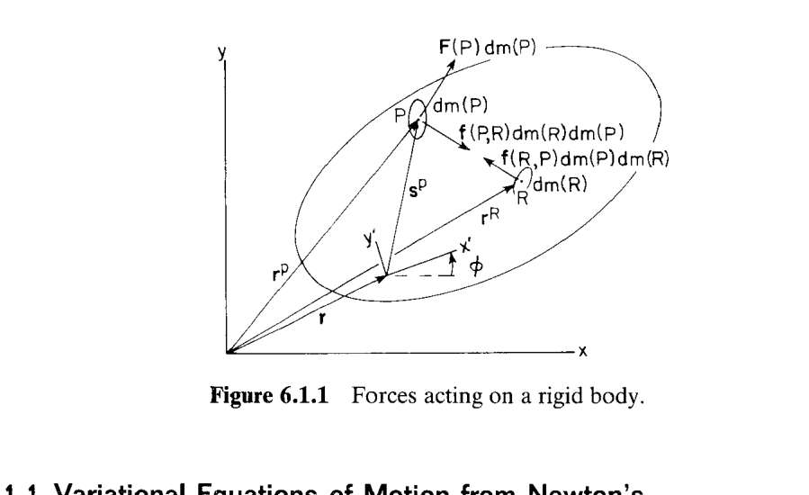
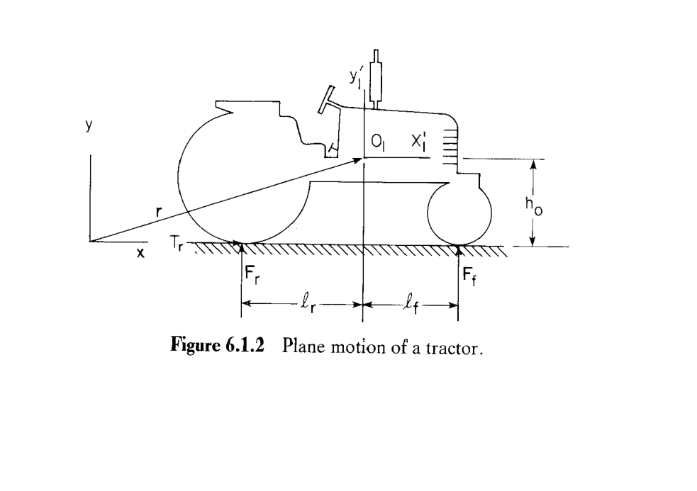
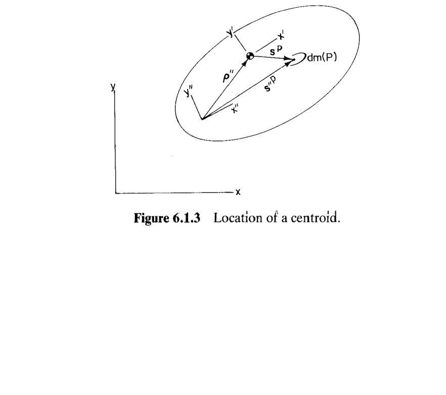
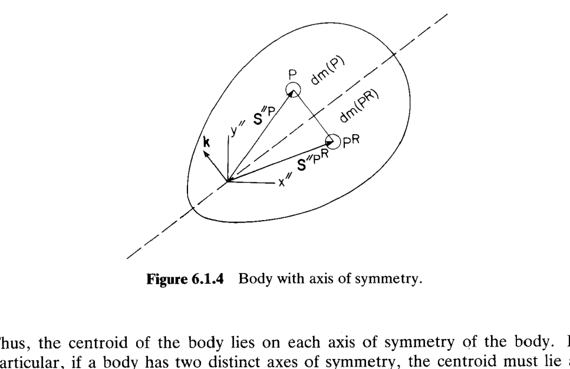
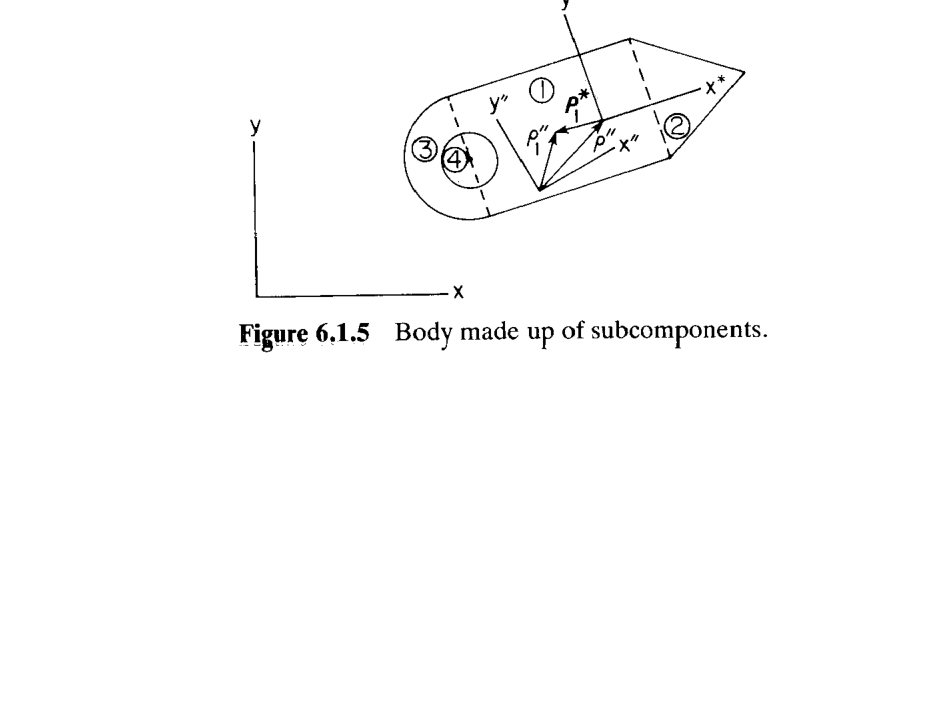
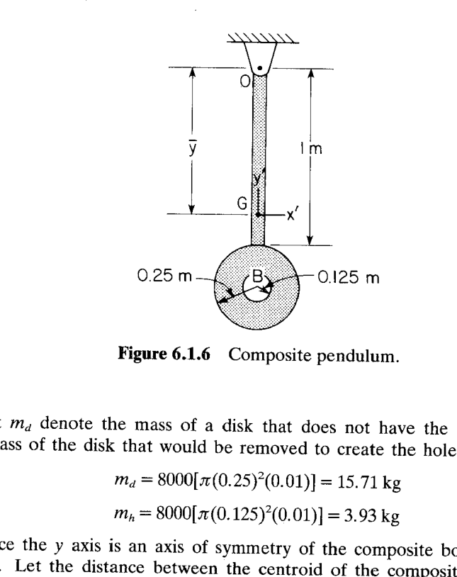

# 6.1 平面刚体运动方程（Equations of Motion of a Planar Rigid Body）

> 来源：*Computer Aided Kinematics and Dynamics of Mechanical Systems*，第 6 章，6.1 节（书页 199–213）。
> 本文以"文字讲解 + 逐式详细推导"组织，公式推导不跳步骤；为自包含起见，6.1.1、6.1.2 的推导在此完整重写。

## 引言：本节要解决什么

本节是全书从运动学跨入动力学的第一步，目标是为**一个**平面刚体建立运动方程，为 6.3 节组装约束多体系统打基础。主线逻辑：

1. **从最底层出发**：写出刚体内任一微元的牛顿第二定律（含未知内力），见 6.1.1。
2. **虚功消内力**：预乘虚位移（virtual displacement）并对全体质量积分，利用刚体距离约束的几何性质把内力虚功消为零，得**达朗贝尔原理**（D'Alembert's principle，即虚功原理）。
3. **代入刚体运动学**：用 3 个广义坐标 $(\mathbf{r},\phi)$ 表达虚位移与加速度，把积分方程化为含质量/惯量积分的变分运动方程。
4. **取质心坐标系**：令随体坐标原点落在质心（centroid），交叉项与离心项自动消失，得到简洁的变分运动方程 Eq. 6.1.18，再由虚位移任意性得微分方程 Eq. 6.1.19（6.1.2）。
5. **应用与配套量**：用 Eq. 6.1.19 写出一个具体机械系统的运动方程（例 6.1.1 拖拉机）；并给出方程所需的惯性量——质心位置、极转动惯量（polar moment of inertia）、平行轴定理（parallel axis theorem）、组合体（composite body）叠加（6.1.4、6.1.5，例 6.1.2）。

刚体模型（model of a rigid body）：在刚体每对微元（视为质点）之间放一根**两端带铰、无质量**的刚性杆，强制两点间距离恒定。于是两微元间的物理内力 $\mathbf{f}(P,R)\,dm(R)\,dm(P)$ 与 $\mathbf{f}(R,P)\,dm(P)\,dm(R)$ 沿连线方向，等大、反向、共线。

---

## 6.1.1 从牛顿方程导出变分运动方程（Variational Equations of Motion from Newton's Equations）

### 微元牛顿第二定律 (Eq. 6.1.1)

参见上图 Fig. 6.1.1：刚体构型由位置向量 $\mathbf{r}$ 与旋转 $\phi$ 给定。刚体上有一点 $P$ ，其在刚体局部坐标系下的位置为$\mathbf{s}'^P$，微元 $P$ 质量为 $dm(P)$。

刚体受到的外力可以用力场表示，其中微元 $P$ 受外力为 $\mathbf{F}(P)\,dm(P)$。其中 $\mathbf{F}(P)$ 是作用在 $P$ 的单位质量外力，量纲为 力/质量 $=\mathrm{N/kg}=\mathrm{m/s^2}$。

另外微元 $P$ 还受到刚体内部其余所有微元 $R$ 的内力 $\mathbf{f}(P,R)dm(P)dm(R)$。其中 $\mathbf{f}(P,R)$ 是微元 $R$ 对 $P$ 的单位质量内力密度（量纲为 力/质量$^2$ $= \mathrm{N/kg^2} = \mathrm{m\,kg^{-1}\,s^{-2}}$，乘 $dm(R)\,dm(P)$ 后才是真实内力）。

根据牛顿第二定律，微元 $P$ 受力为：
$$\ddot{\mathbf{r}}^P\,dm(P)=\mathbf{F}(P)\,dm(P)+\left[\int_m \mathbf{f}(P,R)\,dm(R)\right]dm(P) \tag{6.1.1}$$

- $\ddot{\mathbf{r}}^P$：点 $P$ 在惯性系中的加速度；

直接求解的困难：内力 $\mathbf{f}(P,R)$ 未知；方程数无穷；未利用刚体运动学（全体点的运动只由 3 个广义坐标决定）。解决办法是**变分（虚功）法**。

### 预乘虚位移并积分

设 $\delta\mathbf{r}^P$ 为点 $P$ 的**虚位移**。$\delta$ 算子即时间冻结的微分算子，**服从微积分全部法则**。对 Eq. 6.1.1 两边左乘 $\delta\mathbf{r}^{PT}$ 并对全体质量积分：

$$\int_m \delta\mathbf{r}^{PT}\ddot{\mathbf{r}}^P\,dm(P)=\int_m \delta\mathbf{r}^{PT}\mathbf{F}(P)\,dm(P)+\iint_{mm}\delta\mathbf{r}^{PT}\mathbf{f}(P,R)\,dm(R)\,dm(P) \tag{6.1.2}$$

此式须对任意满足约束的 $\delta\mathbf{r}^P$ 成立。

### 消去内力项——利用刚体约束

**刚体距离约束**：体内任意两点间距离平方为常数，

$$(\mathbf{r}^P-\mathbf{r}^R)^T(\mathbf{r}^P-\mathbf{r}^R)=c$$

对其取变分（$\delta c=0$，乘积法则）：

$$\delta(\mathbf{r}^P-\mathbf{r}^R)^T(\mathbf{r}^P-\mathbf{r}^R)+(\mathbf{r}^P-\mathbf{r}^R)^T\delta(\mathbf{r}^P-\mathbf{r}^R)=0$$

两项互为转置的标量，相等，故

$$2\,\delta(\mathbf{r}^P-\mathbf{r}^R)^T(\mathbf{r}^P-\mathbf{r}^R)=0 \;\Rightarrow\; \delta(\mathbf{r}^P-\mathbf{r}^R)^T(\mathbf{r}^P-\mathbf{r}^R)=0$$

**几何意义**：虚位移差 $\delta(\mathbf{r}^P-\mathbf{r}^R)$ 正交于连线 $(\mathbf{r}^P-\mathbf{r}^R)$。又内力沿连线方向 $\mathbf{f}(P,R)\parallel(\mathbf{r}^P-\mathbf{r}^R)$，于是

$$\delta(\mathbf{r}^P-\mathbf{r}^R)^T\mathbf{f}(P,R)=0$$

**对双重积分对称化**：$P,R$ 是哑变量可互换名称，且牛顿第三定律给出 $\mathbf{f}(P,R)\,dm(R)\,dm(P)=-\mathbf{f}(R,P)\,dm(P)\,dm(R)$。把积分写成自身与互换名称后的平均：

$$\iint_{mm}\delta\mathbf{r}^{PT}\mathbf{f}(P,R)\,dm(R)\,dm(P)=\frac{1}{2}\iint_{mm}\big[\delta\mathbf{r}^{PT}\mathbf{f}(P,R)-\delta\mathbf{r}^{RT}\mathbf{f}(P,R)\big]\,dm(R)\,dm(P)$$

$$=\frac{1}{2}\iint_{mm}\delta(\mathbf{r}^P-\mathbf{r}^R)^T\mathbf{f}(P,R)\,dm(R)\,dm(P)=0$$

最后一步用上面的正交性。于是

$$\boxed{\iint_{mm}\delta\mathbf{r}^{PT}\mathbf{f}(P,R)\,dm(R)\,dm(P)=0} \tag{6.1.3}$$

**结论：刚体内力的虚功为零。**

### 达朗贝尔原理 / 虚功原理

把 Eq. 6.1.3 代入 Eq. 6.1.2，内力项消失：

$$\boxed{\int_m \delta\mathbf{r}^{PT}\ddot{\mathbf{r}}^P\,dm(P)=\int_m \delta\mathbf{r}^{PT}\mathbf{F}(P)\,dm(P)} \tag{6.1.4}$$

**代价**：Eq. 6.1.2 对任意 $\delta\mathbf{r}^P$ 成立；而 Eq. 6.1.4 仅对**满足刚体约束**的 $\delta\mathbf{r}^P$ 成立。

### 用广义坐标表达虚位移与加速度

**点 P 位置** 由 Eq. 2.4.8 可以得到：

$$\mathbf{r}^P=\mathbf{r}+\mathbf{A}\mathbf{s}'^P,\qquad \mathbf{A}=\begin{bmatrix}\cos\phi & -\sin\phi\\ \sin\phi & \cos\phi\end{bmatrix} \tag{6.1.5,6.1.6}$$

广义坐标 $\mathbf{r}=[r_1,r_2]^T$ 与 $\phi$ 共 3 个，$\mathbf{s}'^P$ 为常量。

**虚位移 (Eq. 6.1.7、6.1.8)**：对 Eq. 6.1.5 取变分（$\delta\mathbf{s}'^P=0$），

$$\delta\mathbf{r}^P=\delta\mathbf{r}+\delta\phi\,\mathbf{B}\mathbf{s}'^P,\qquad \mathbf{B}=\frac{\partial\mathbf{A}}{\partial\phi}=\begin{bmatrix}-\sin\phi & -\cos\phi\\ \cos\phi & -\sin\phi\end{bmatrix} \tag{6.1.7,6.1.8}$$

对任意 $\delta\mathbf{r}$、$\delta\phi$，由 Eq. 6.1.7 给出的 $\delta\mathbf{r}^P$ 满足刚体约束，进而满足虚功原理。

**加速度 (Eq. 6.1.9、6.1.10)**：对 Eq. 6.1.5 求一阶、二阶时间导数。注意 $\dot{\mathbf{B}}=\dot\phi\,\dfrac{\partial\mathbf{B}}{\partial\phi}=-\dot\phi\,\mathbf{A}$：

$$\dot{\mathbf{r}}^P=\dot{\mathbf{r}}+\dot\phi\,\mathbf{B}\mathbf{s}'^P \tag{6.1.9}$$

$$\ddot{\mathbf{r}}^P=\ddot{\mathbf{r}}+\ddot\phi\,\mathbf{B}\mathbf{s}'^P+\dot\phi\,\dot{\mathbf{B}}\mathbf{s}'^P=\ddot{\mathbf{r}}+\ddot\phi\,\mathbf{B}\mathbf{s}'^P-\dot\phi^2\mathbf{A}\mathbf{s}'^P \tag{6.1.10}$$

三项依次为：参考点平动加速度、角加速度引起的切向加速度、角速度引起的向心加速度。

### 展开为变分运动方程 (Eq. 6.1.11)

把 Eq. 6.1.7、6.1.10 代入 Eq. 6.1.4。**左端**：

$$\int_m\big(\delta\mathbf{r}+\delta\phi\,\mathbf{B}\mathbf{s}'^P\big)^T\big(\ddot{\mathbf{r}}+\ddot\phi\,\mathbf{B}\mathbf{s}'^P-\dot\phi^2\mathbf{A}\mathbf{s}'^P\big)\,dm(P)$$

逐项展开、把不含 $P$ 的因子提到积分外：

$$=\delta\mathbf{r}^T\ddot{\mathbf{r}}\int_m dm(P)+\Big[\delta\mathbf{r}^T(\ddot\phi\mathbf{B}-\dot\phi^2\mathbf{A})+\delta\phi\,\ddot{\mathbf{r}}^T\mathbf{B}\Big]\int_m \mathbf{s}'^P\,dm(P)+\delta\phi\int_m \mathbf{s}'^{PT}\mathbf{B}^T(\ddot\phi\mathbf{B}-\dot\phi^2\mathbf{A})\mathbf{s}'^P\,dm(P)$$

**右端**：

$$\int_m\big(\delta\mathbf{r}+\delta\phi\,\mathbf{B}\mathbf{s}'^P\big)^T\mathbf{F}(P)\,dm(P)=\delta\mathbf{r}^T\int_m\mathbf{F}(P)\,dm(P)+\delta\phi\int_m\mathbf{s}'^{PT}\mathbf{B}^T\mathbf{F}(P)\,dm(P)$$

合并得 Eq. 6.1.11（对任意 $\delta\mathbf{r}$、$\delta\phi$ 成立）：

$$\delta\mathbf{r}^T\ddot{\mathbf{r}}\!\int_m\! dm+\Big[\delta\mathbf{r}^T(\ddot\phi\mathbf{B}-\dot\phi^2\mathbf{A})+\delta\phi\,\ddot{\mathbf{r}}^T\mathbf{B}\Big]\!\int_m\!\mathbf{s}'^P dm+\delta\phi\!\int_m\!\mathbf{s}'^{PT}\mathbf{B}^T(\ddot\phi\mathbf{B}-\dot\phi^2\mathbf{A})\mathbf{s}'^P dm=\delta\mathbf{r}^T\!\int_m\!\mathbf{F}\,dm+\delta\phi\!\int_m\!\mathbf{s}'^{PT}\mathbf{B}^T\mathbf{F}\,dm \tag{6.1.11}$$

---

## 6.1.2 质心坐标下的变分运动方程（Variational Equations of Motion with Centroidal Coordinates）

### 思路

把刚体局部坐标系原点取在**质心**，可简化方程。

### 总质量 (Eq. 6.1.12)

$$m=\int_m dm(P) \tag{6.1.12}$$

与体坐标系位置无关。

### 质心条件 (Eq. 6.1.13)

体坐标原点取在质心时，由质心定义

$$\int_m \mathbf{s}'^P\,dm(P)=\mathbf{0} \tag{6.1.13}$$

效果：Eq. 6.1.11 中含 $\int_m\mathbf{s}'^P\,dm$ 的整个第二项全为零，方程简化为

$$\delta\mathbf{r}^T m\ddot{\mathbf{r}}+\delta\phi\int_m \mathbf{s}'^{PT}\mathbf{B}^T(\ddot\phi\mathbf{B}-\dot\phi^2\mathbf{A})\mathbf{s}'^P\,dm=\delta\mathbf{r}^T\int_m\mathbf{F}\,dm+\delta\phi\int_m\mathbf{s}'^{PT}\mathbf{B}^T\mathbf{F}\,dm$$

### 简化转动惯性项 (Eq. 6.1.14)

直接矩阵乘法可验证（$\mathbf{B}$的定义在本节6.1.8）

$$\mathbf{B}^T\mathbf{B}=\mathbf{I} \tag{6.1.14a}$$

$$\mathbf{B}^T\mathbf{A}=\begin{bmatrix}0&1\\-1&0\end{bmatrix} \tag{6.1.14b}$$

例如 $\mathbf{B}^T\mathbf{B}=\begin{bmatrix}-\sin\phi&\cos\phi\\-\cos\phi&-\sin\phi\end{bmatrix}\begin{bmatrix}-\sin\phi&-\cos\phi\\\cos\phi&-\sin\phi\end{bmatrix}=\begin{bmatrix}\sin^2\phi+\cos^2\phi&0\\0&\cos^2\phi+\sin^2\phi\end{bmatrix}=\mathbf{I}$。

展开被积函数：

$$\mathbf{s}'^{PT}\mathbf{B}^T(\ddot\phi\mathbf{B}-\dot\phi^2\mathbf{A})\mathbf{s}'^P=\ddot\phi\,\mathbf{s}'^{PT}\mathbf{B}^T\mathbf{B}\,\mathbf{s}'^P-\dot\phi^2\,\mathbf{s}'^{PT}\mathbf{B}^T\mathbf{A}\,\mathbf{s}'^P$$

由 6.1.14a 第一项为 $\ddot\phi\,\mathbf{s}'^{PT}\mathbf{s}'^P$；由 6.1.14b，$\mathbf{B}^T\mathbf{A}$ 反对称，故

$$\mathbf{s}'^{PT}\mathbf{B}^T\mathbf{A}\,\mathbf{s}'^P=\mathbf{s}'^{PT}\begin{bmatrix}0&1\\-1&0\end{bmatrix}\mathbf{s}'^P=s_x'^P s_y'^P-s_y'^P s_x'^P=0$$

于是被积函数 $=\ddot\phi\,\mathbf{s}'^{PT}\mathbf{s}'^P$。

### 极转动惯量、合力、合力矩 (Eq. 6.1.15–6.1.17)

定义相对质心的**极转动惯量**：

$$J'\equiv\int_m \mathbf{s}'^{PT}\mathbf{s}'^P\,dm(P)=\int_m\big(s_x'^{P\,2}+s_y'^{P\,2}\big)\,dm(P) \tag{6.1.15}$$

转动项化为 $\delta\phi\,\ddot\phi\,J'$。**合力**与**合力矩**：

$$\mathbf{F}=\int_m\mathbf{F}(P)\,dm(P) \tag{6.1.16}$$

$$n=\int_m\mathbf{s}'^{PT}\mathbf{B}^T\mathbf{F}(P)\,dm(P) \tag{6.1.17a}$$

将 $\mathbf{F}(P)=\mathbf{A}\mathbf{F}'(P)$ 代入并用 6.1.14b：

$$n=\int_m\mathbf{s}'^{PT}\mathbf{B}^T\mathbf{A}\,\mathbf{F}'(P)\,dm=\int_m\mathbf{s}'^{PT}\begin{bmatrix}0&1\\-1&0\end{bmatrix}\mathbf{F}'(P)\,dm=\int_m\big[-s_y'^P F_{x'}(P)+s_x'^P F_{y'}(P)\big]\,dm \tag{6.1.17b}$$

即力对质心力矩的经典式（逆时针为正）。

### 变分运动方程 (Eq. 6.1.18) 与微分方程 (Eq. 6.1.19)

代入上述结果，移项得

$$\boxed{\delta\mathbf{r}^T\big[m\ddot{\mathbf{r}}-\mathbf{F}\big]+\delta\phi\big[J'\ddot\phi-n\big]=0} \tag{6.1.18}$$

对任意 $\delta\mathbf{r}$、$\delta\phi$ 成立。由其任意性，各系数分别为零：先取 $\delta\mathbf{r}=\mathbf{0}$、$\delta\phi=0.001\neq0$ 得 $J'\ddot\phi=n$；再取 $\delta\phi=0$ 并令 $\delta\mathbf{r}$ 分量依次单独非零，得 $m\ddot{\mathbf{r}}=\mathbf{F}$。故

$$\boxed{m\ddot{\mathbf{r}}=\mathbf{F},\qquad J'\ddot\phi=n} \tag{6.1.19}$$

即**牛顿-欧拉方程**：质心平动与绕质心转动完全解耦。

**重要限制**：Eq. 6.1.19 成立要求 $\mathbf{F}$、$n$ 包含作用在刚体上的**全部**力效应（含外加力与约束力），且体坐标原点须取在质心。

---

## 6.1.3 微分运动方程的应用

### 例 6.1.1：拖拉机的平面运动方程

> Fig. 6.1.2：拖拉机无悬挂，建模为单刚体，质量 $m$、质心极转动惯量 $J'$。后轮产生驱动力 $T_r$，前、后轮地面反力 $F_f$、$F_r$。体坐标系 $x_1'\text{-}y_1'$ 原点在质心 $0_1$。

#### 思路

Eq. 6.1.19 的直接应用：拖拉机无运动学约束（自由刚体），只要算出全部力的合力 $\mathbf{F}$ 与绕质心合力矩 $n$ 代入即可。难点仅在把"轮胎入土"反力写成位置/俯仰角的函数。

#### 轮胎力模型

轮胎陷土支撑力按线性弹簧、仅受压时有力：

$$F=f(d)=\begin{cases}kd,&d\ge0\\0,&d<0\end{cases}$$

$k$ 为弹簧常数，$d$ 为轮胎变形（入土深度）。

#### 小俯仰角变形与支撑力

设质心竖直位移 $y_1$、俯仰角 $\phi_1$，前后轮到质心水平距离 $\ell_f$、$\ell_r$，$h_0$ 为水平无变形时质心高度。小俯仰角下

$$d_f=h_0-(y_1+\ell_f\phi_1),\qquad d_r=h_0-(y_1-\ell_r\phi_1)$$

代入 $F=kd$（设始终受压）：

$$F_f=k\big(h_0-(y_1+\ell_f\phi_1)\big),\qquad F_r=k\big(h_0-(y_1-\ell_r\phi_1)\big)$$

#### 运动方程

无运动学约束、施加力已全部计入，用 Eq. 6.1.19。水平合力为 $T_r$，竖直合力为两轮支撑力之和减重力 $mg$，绕质心力矩由两轮力臂与驱动力高度 $h_0$ 提供：

$$m\begin{bmatrix}\ddot{x}_1\\\ddot{y}_1\end{bmatrix}=\begin{bmatrix}T_r\\ k(h_0-y_1-\ell_f\phi_1)+k(h_0-y_1+\ell_r\phi_1)-mg\end{bmatrix}$$

$$J'\ddot\phi_1=\ell_f\,k(h_0-y_1-\ell_f\phi_1)-\ell_r\,k(h_0-y_1+\ell_r\phi_1)+T_r h_0$$

**观察**：这是一组**线性**常微分方程，线性性来自"小俯仰角"近似。书中提醒：多数机械动力学方程其实是非线性的，此处线性只是近似的结果。

---

## 6.1.4 质心与极转动惯量的性质（Properties of the Centroid and Polar Moment of Inertia）

### 思路

Eq. 6.1.19 用到质心与质心极转动惯量 $J'$。建模时体坐标系常先随手取在某非质心点 $O''$（$x''\text{-}y''$ 系），再由已知质量分布算出质心位置 $\boldsymbol{\rho}''$ 与相对该点的 $J''$，最后换算到质心。核心工具是**平行轴定理**。

### 质心位置 (Eq. 6.1.20)

参见 Fig. 6.1.3：非质心系 $x''\text{-}y''$ 原点 $O''$，质心由 $\boldsymbol{\rho}''$ 定位；在质心处再建与 $x''\text{-}y''$ 平行的**质心系** $x'\text{-}y'$。点 $P$ 满足 $\mathbf{s}''^P=\boldsymbol{\rho}''+\mathbf{s}'^P$。由质心定义 Eq. 6.1.13，把 $\mathbf{s}'^P=\mathbf{s}''^P-\boldsymbol{\rho}''$ 代入逐步展开：

$$\mathbf{0}=\int_m\mathbf{s}'^P\,dm=\int_m(\mathbf{s}''^P-\boldsymbol{\rho}'')\,dm=\int_m\mathbf{s}''^P\,dm-\boldsymbol{\rho}''\int_m dm=\int_m\mathbf{s}''^P\,dm-m\boldsymbol{\rho}''$$

（$\boldsymbol{\rho}''$ 不依赖 $P$ 可提出。）解出

$$\boxed{\boldsymbol{\rho}''=\frac{1}{m}\int_m\mathbf{s}''^P\,dm(P)} \tag{6.1.20}$$

### 非质心极转动惯量 (Eq. 6.1.21) 与平行轴定理 (Eq. 6.1.22)

定义相对非质心点 $O''$ 的极转动惯量：

$$J''=\int_m\mathbf{s}''^{PT}\mathbf{s}''^P\,dm(P) \tag{6.1.21}$$

把 $\mathbf{s}''^P=\boldsymbol{\rho}''+\mathbf{s}'^P$ 代入并逐项展开：

$$J''=\int_m(\boldsymbol{\rho}''+\mathbf{s}'^P)^T(\boldsymbol{\rho}''+\mathbf{s}'^P)\,dm=\boldsymbol{\rho}''^T\boldsymbol{\rho}''\int_m dm+2\boldsymbol{\rho}''^T\int_m\mathbf{s}'^P\,dm+\int_m\mathbf{s}'^{PT}\mathbf{s}'^P\,dm$$

逐项辨认：第一项 $=m\lvert\boldsymbol{\rho}''\rvert^2$；第二项含 $\int_m\mathbf{s}'^P\,dm$，因 $x'\text{-}y'$ 原点在质心由 6.1.13 为 $\mathbf{0}$；第三项为 $J'$（Eq. 6.1.15）。于是得**平行轴定理**：

$$\boxed{J''=J'+m\lvert\boldsymbol{\rho}''\rvert^2} \tag{6.1.22}$$

物理意义：相对任意点的极转动惯量 = 相对质心的 $J'$ + "总质量集中于质心绕该点旋转"的 $m\lvert\boldsymbol{\rho}''\rvert^2$。因后者非负，质心是极转动惯量最小的点。

### 对称轴上必含质心 (Fig. 6.1.4)

若刚体有一条物理与质量分布都对称的轴，取 $O''$ 在轴上、$\mathbf{k}$ 为轴的单位法向。对任一点 $P$ 存在镜像 $P^R$，沿 $\mathbf{k}$ 投影等大反号：

$$\mathbf{k}^T\mathbf{s}''^P\,dm(P)=-\mathbf{k}^T\mathbf{s}''^{P^R}\,dm(P^R)$$

把 Eq. 6.1.20 左乘 $\mathbf{k}^T$，并把全体积分按对称轴两侧拆为 $m^+$（$\mathbf{k}$ 所指侧）与 $m^-$，$m^+=m^-=m/2$：

$$\mathbf{k}^T\boldsymbol{\rho}''=\frac{1}{m}\int_m\mathbf{k}^T\mathbf{s}''^P\,dm=\frac{1}{m}\left(\int_{m^+}\mathbf{k}^T\mathbf{s}''^P\,dm+\int_{m^-}\mathbf{k}^T\mathbf{s}''^{P^R}\,dm\right)$$

用镜像关系把 $m^-$ 积分换成 $m^+$ 上同一被积函数的相反数：

$$=\frac{1}{m}\left(\int_{m^+}\mathbf{k}^T\mathbf{s}''^P\,dm-\int_{m^+}\mathbf{k}^T\mathbf{s}''^P\,dm\right)=0$$

即 $\mathbf{k}^T\boldsymbol{\rho}''=0$：**质心必落在对称轴上**。推论：两条对称轴时质心在交点；Table 6.1.1 各标准形状质心都落在其对称轴上；但仅有几何对称不够，若质量分布不对称质心未必在几何对称轴上。

### Table 6.1.1 常见均质平面体的 $m$ 与 $J'$（$\gamma=$ 单位面积质量）

| 形状（Body） | 质量 $m$ | 质心极转动惯量 $J'$ | 备注 |
|------|---------|----------------------|------|
| 细杆 Thin Rod | $\gamma\ell h$ | $\dfrac{m}{12}\ell^2$ | $h$ 为厚度 |
| 矩形 Rectangle | $\gamma ab$ | $\dfrac{1}{12}m(a^2+b^2)$ | 边长 $a\times b$ |
| 等腰三角形 Isosceles Triangle | $\dfrac{1}{2}\gamma bh$ | $m\!\left(\dfrac{b^2}{24}+\dfrac{h^2}{18}\right)$ | 底 $b$、高 $h$；质心在高的 $h/3$ |
| 圆 Circle | $\gamma\pi R^2$ | $\dfrac{1}{2}mR^2$ | |
| 半圆 Semicircle | $\dfrac{1}{2}\gamma\pi R^2$ | $mR^2\!\left(\dfrac{1}{2}-\dfrac{16}{9\pi^2}\right)$ | 质心距直径边 $\dfrac{4R}{3\pi}$ |
| 细环 Thin Ring | $2\pi R\gamma d$ | $mR^2$ | $d$ 为环宽 |

---

## 6.1.5 组合体的惯性性质（Inertial Properties of Composite Bodies）

### 思路

机器零件常由细杆、圆、环、矩形、三角形等**标准形状**子部件（含空洞）拼成（Fig. 6.1.5）。用各子部件易算的惯性量（Table 6.1.1）叠加，得整个**组合体**的质心与极转动惯量。两条工具够用：质心定义 Eq. 6.1.20 与平行轴定理 Eq. 6.1.22；关键在"整体积分 = 各子部件积分之和"。

### 组合体质心 (Eq. 6.1.23)

在组合体上取方便的 $x''\text{-}y''$ 系，把 Eq. 6.1.20 的整体积分拆成对各子部件质量 $m_i$ 的积分之和：

$$\boldsymbol{\rho}''=\frac{1}{m}\sum_{i=1}^{k}\int_{m_i}\mathbf{s}''^P\,dm_i(P)=\frac{1}{m}\sum_{i=1}^{k}m_i\boldsymbol{\rho}''_i \tag{6.1.23}$$

其中 $m=\sum_i m_i$，$\boldsymbol{\rho}''_i$ 为第 $i$ 子部件质心在 $x''\text{-}y''$ 系中位置（来自 Table 6.1.1 或数值计算）；这一步用了对单个子部件的 $\int_{m_i}\mathbf{s}''^P\,dm_i=m_i\boldsymbol{\rho}''_i$。

### 组合体极转动惯量 (Eq. 6.1.24、6.1.25)

记 $x^*\text{-}y^*$ 为**组合体**质心系（用 $*$ 与各子部件自身质心系 $x_i'\text{-}y_i'$ 区分）。把 Eq. 6.1.15 的整体积分拆成子部件之和：

$$J^*=\int_m\mathbf{s}^{*PT}\mathbf{s}^{*P}\,dm=\sum_{i=1}^{k}\left[\int_{m_i}\mathbf{s}_i^{*PT}\mathbf{s}_i^{*P}\,dm_i\right]=\sum_{i=1}^{k}J_i^* \tag{6.1.24}$$

但 Table 6.1.1 给的是子部件相对**自身质心** $x_i'\text{-}y_i'$ 的 $J_i'$，而 $x^*\text{-}y^*$ 对子部件 $i$ 是非质心系，需用平行轴定理换算：

$$J_i^*=J_i'+m_i\lvert\boldsymbol{\rho}_i^*\rvert^2 \tag{6.1.25}$$

$\boldsymbol{\rho}_i^*$ 为子部件 $i$ 质心在组合体质心系 $x^*\text{-}y^*$ 中位置（Fig. 6.1.5）。

### 空洞处理

若有空洞，可在 Eq. 6.1.24 中把空洞当作一个子部件：先按"填满该处同密度材料"计算，再以**负值** $-J_i^*$（质量取负 $-m_i$）计入。

### 例 6.1.2：组合摆的质心与极转动惯量

> Fig. 6.1.6：摆由细杆 + 带孔圆盘组成。杆质量 $2.8\ \text{kg}$、长 $1\ \text{m}$；圆盘密度 $8000\ \text{kg/m}^3$、厚 $0.01\ \text{m}$、半径 $0.25\ \text{m}$；孔半径 $0.125\ \text{m}$。求质心与极转动惯量。

#### 子部件质量

设 $m_d$ 为无孔圆盘质量、$m_h$ 为被挖去形成孔那块的质量（密度 × 面积 × 厚度）：

$$m_d=8000\,[\pi(0.25)^2(0.01)]=15.71\ \text{kg}$$

$$m_h=8000\,[\pi(0.125)^2(0.01)]=3.93\ \text{kg}$$

杆质量 $m_r=2.8\ \text{kg}$。

#### 质心位置 $\bar{y}$

$y$ 轴是对称轴，质心落其上，只需求质心到悬挂点 $O$ 距离 $\bar y$。各质心到 $O$ 距离：杆 $y_r=0.5\ \text{m}$，盘与孔中心 $y_d=y_h=1.25\ \text{m}$；孔以负质量 $-m_h$ 计入。由 Eq. 6.1.23（标量形式）：

$$\bar{y}=\frac{\sum_i m_i y_i}{\sum_i m_i}=\frac{m_r y_r+(m_d-m_h)y_d}{m_r+(m_d-m_h)}=\frac{2.80(0.5)+15.71(1.25)-3.93(1.25)}{2.80+15.71-3.93}=1.11\ \text{m}$$

#### 各子部件相对组合体质心 $G$ 的极转动惯量

记 $\rho=\lvert\boldsymbol{\rho}\rvert$ 为子部件质心到 $G$ 的距离。

**杆**：Table 6.1.1 给 $J_r=\dfrac{m_r\ell^2}{12}=\dfrac{2.8(1)^2}{12}=0.233\ \text{kg·m}^2$，再用 Eq. 6.1.25 搬到 $G$：

$$J_r'=0.233+m_r\rho^2=0.233+2.8(1.11-0.5)^2=1.275\ \text{kg·m}^2$$

**圆盘**（无孔实心）：$J=\dfrac{1}{2}m_dR^2$，搬到 $G$：

$$J_d'=\tfrac{1}{2}m_dR^2+m_d\rho^2=0.5(15.71)(0.25)^2+(15.71)(1.25-1.11)^2=0.799\ \text{kg·m}^2$$

**孔**（按同密度实心块算，最后取负）：

$$J_h'=\tfrac{1}{2}m_hR^2+m_h\rho^2=0.5(3.93)(0.125)^2+(3.93)(1.25-1.11)^2=0.108\ \text{kg·m}^2$$

#### 组合摆极转动惯量

由 Eq. 6.1.24（孔取负）：

$$\boxed{J'=J_r'+J_d'-J_h'=1.275+0.799-0.108=1.966\ \text{kg·m}^2}$$

---

> **范围说明**：6.2 节"虚功与广义力"（Virtual Work and Generalized Force）从书页 213 下半页起，属下一节，见 `6.2-virtual-work-and-generalized-force.md`。
