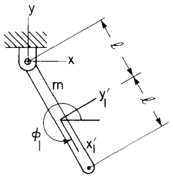
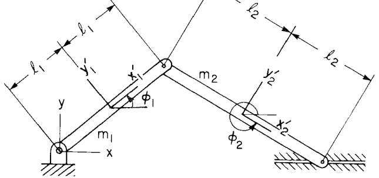

# 6.3 约束平面系统的运动方程

> 来源：*Computer Aided Kinematics and Dynamics of Mechanical Systems, Vol. 1*，第 6 章，6.3 节（书页 218–228）。
> 本文以"文字讲解 + 逐式详细推导"组织，公式推导不跳步骤；例题保留完整推导。

---

## 引言：本节要解决什么

第 6.1 节给出了单个刚体的微分/变分运动方程，6.2 节引入了虚功与广义力。本节把这套变分方法**推广到由多个刚体、且刚体间存在运动学约束**的系统。核心思路是：

1. 把每个物体的变分方程相加，得到系统变分方程；
2. 区分"外加力"与"约束力"，并证明约束力在约束相容虚位移下不做功，从而被消去；
3. 引入**拉格朗日乘子**，把"只对约束相容虚位移成立的变分方程"转化为"对任意虚位移成立的代数方程"；
4. 与速度、加速度约束方程拼装成**混合微分-代数方程组（DAE）**；
5. 讨论解的存在唯一性与初始条件。

拉格朗日乘子是这里的关键技术：经典力学中常用它把变分方程化为混合微分-代数系统。本书采用优化理论中一个更严格的乘子定理来引入它。

---

## 6.3.1 平面系统的变分运动方程

### 系统变分方程

Eq. 6.2.5 的变分方程对系统中的任意刚体 $i$ 成立。因此整个系统可以联立得到下式，且对任意 $\delta\mathbf{q}_i$（$i=1,\dots,nb$）成立，前提是所有作用力都包含在 $\mathbf{Q}$ 中：

$$\sum_{i=1}^{nb}\delta\mathbf{q}_i^T[\mathbf{M}_i\ddot{\mathbf{q}}_i - \mathbf{Q}_i] = 0 \tag{6.3.1}$$

为方便处理多刚体系统，定义系统的状态向量、质量矩阵、广义力向量：

$$\mathbf{q} = [\mathbf{q}_1^T, \mathbf{q}_2^T, \dots, \mathbf{q}_{nb}^T]^T$$
$$\mathbf{M} = \operatorname{diag}(\mathbf{M}_1, \mathbf{M}_2, \dots, \mathbf{M}_{nb}) \tag{6.3.2}$$
$$\mathbf{Q} = [\mathbf{Q}_1^T, \mathbf{Q}_2^T, \dots, \mathbf{Q}_{nb}^T]^T$$

于是 (6.3.1) 可写成紧凑形式：

$$\delta\mathbf{q}^T[\mathbf{M}\ddot{\mathbf{q}} - \mathbf{Q}] = 0$$

### 区分约束力和外加力

无论是单刚体方程 (6.2.5) 还是系统方程 (6.3.1)，广义力 $\mathbf{Q}$ 都必须同时含**约束力**和**外加力**。这里把"外加力"（applied force）定义为：除约束力之外，作用于系统上或刚体间的一切力——例如重力、弹簧-阻尼-作动器力都算外加力。外加力相对明确，而**约束力难以显式写出**。

为系统地区分二者，记上标 $A$ = applied，$C$ = constraint：

$$\mathbf{F}_i = \mathbf{F}_i^A + \mathbf{F}_i^C, \qquad n_i = n_i^A + n_i^C$$
$$\mathbf{Q}_i = \mathbf{Q}_i^A + \mathbf{Q}_i^C$$
$$\mathbf{Q} = \mathbf{Q}^A + \mathbf{Q}^C$$

代入 (6.3.1)：

$$\sum_{i=1}^{nb}\delta\mathbf{q}_i^T[\mathbf{M}_i\ddot{\mathbf{q}}_i - \mathbf{Q}_i^A] \;-\; \sum_{i=1}^{nb}\delta\mathbf{q}_i^T\mathbf{Q}_i^C = 0$$

紧凑形式：

$$\delta\mathbf{q}^T[\mathbf{M}\ddot{\mathbf{q}} - \mathbf{Q}^A] \;-\; \delta\mathbf{q}^T\mathbf{Q}^C = 0$$

这两式分别对任意 $\delta\mathbf{q}_i$、$\delta\mathbf{q}$ 成立。

### 关键：约束力的总虚功为零

虽然作用在**单个**物体上的约束力虚功 $\delta\mathbf{q}_i^T\mathbf{Q}_i^C$ 一般不为零。只要虚位移满足约束（称为相容），则由牛顿第三定律，约束力作用在被约束的两个物体上，垂直于接触面、成对等大反向。可以想见，所有约束力的总虚功为零。
若约束力总虚功为零，则称这样的约束为理想约束。事实上，**假定系统满足理想约束，是分析力学的基本假设之一**。

因此，全系统约束力的**总**虚功为：

$$\sum_{i=1}^{nb}\delta\mathbf{q}_i^T\mathbf{Q}_i^C = \delta\mathbf{q}^T\mathbf{Q}^C = 0$$

### 带约束的变分运动方程

由此，系统变分运动方程 (6.3.1) 可写成以下两种等价的**约束变分运动方程**：

$$\sum_{i=1}^{nb}\delta\mathbf{q}_i^T[\mathbf{M}_i\ddot{\mathbf{q}}_i - \mathbf{Q}_i^A] = 0$$
$$\delta\mathbf{q}^T[\mathbf{M}\ddot{\mathbf{q}} - \mathbf{Q}^A] = 0 \tag{6.3.3}$$

注意：它们只对**与约束相容**的虚位移 $\delta\mathbf{q}$ 成立。

### 与约束相容的虚位移（Kinematically admissible virtual displacement）

系统的约束（包括运动学约束与驱动约束）为：

$$\boldsymbol{\Phi}(\mathbf{q}, t) = \mathbf{0} \tag{6.3.4}$$

对其取变分，就可以得到**与约束相容的（consistent with the constraints，定义见 6.1）** 虚位移 $\delta\mathbf{q}$。注意到虚位移是固定时间，$\delta t = 0$：

$$\boldsymbol{\Phi}_{\mathbf{q}}\,\delta\mathbf{q} + \boldsymbol{\Phi}_t\,\delta t = \mathbf{0}
\;\xrightarrow{\;\delta t = 0\;}\;
\boldsymbol{\Phi}_{\mathbf{q}}\,\delta\mathbf{q} = \mathbf{0} \tag{6.3.5}$$

其中雅可比 $\boldsymbol{\Phi}_{\mathbf{q}}$ 在满足 (6.3.4) 的状态 $\mathbf{q}$ 处取值。该方程求解得到的虚位移 $\delta\mathbf{q}$ 被称为是 **Kinematically Admissible virtual displacement**。（注意，虽然包含 Kinematically 字样，但实际上同时要满足 kinematical constraints 和 driving constraints。不过在下面的例子中，主要关注 kinematical constraints）。

---

## 例 6.3.1：单摆

> 图 6.3.1 为一根绕固定铰链摆动的均质杆（简单摆）。下面给出完整推导。

广义坐标 $\mathbf{q} = [x_1, y_1, \phi_1]^T$。重力为外加力，其虚功（由 (6.2.1)）：

$$\delta W = [\delta x_1, \delta y_1, \delta\phi_1]^T\begin{bmatrix} 0 \\ -mg \\ 0 \end{bmatrix} = -mg\,\delta y_1$$

故广义外加力 $\mathbf{Q}^A = [0,\, -mg,\, 0]^T$，其中 $m$ 为摆的质量。

单摆绕质心的极转动惯量为 $m\ell^2/3$，质量矩阵 $\mathbf{M} = \operatorname{diag}(m, m, m\ell^2/3)$。由 (6.3.3)：

$$\delta\mathbf{q}^T[\mathbf{M}\ddot{\mathbf{q}} - \mathbf{Q}^A]
= [\delta x_1, \delta y_1, \delta\phi_1]\begin{bmatrix} m\ddot{x}_1 \\ m\ddot{y}_1 + mg \\ (m\ell^2/3)\ddot\phi_1 \end{bmatrix} = 0 \tag{6.3.6}$$

Kinematical 约束方程：

$$\boldsymbol{\Phi}^K(\mathbf{q}) = \begin{bmatrix} x_1 - \ell\cos\phi_1 \\ y_1 - \ell\sin\phi_1 \end{bmatrix} = \mathbf{0} \tag{6.3.7}$$

雅可比逐项求偏导：
- $\partial(x_1 - \ell\cos\phi_1)/\partial x_1 = 1$，$/\partial y_1 = 0$，$/\partial\phi_1 = \ell\sin\phi_1$；
- $\partial(y_1 - \ell\sin\phi_1)/\partial x_1 = 0$，$/\partial y_1 = 1$，$/\partial\phi_1 = -\ell\cos\phi_1$。

故约束相容虚位移条件 (6.3.5)：

$$\begin{bmatrix} 1 & 0 & \ell\sin\phi_1 \\ 0 & 1 & -\ell\cos\phi_1 \end{bmatrix}
\begin{bmatrix} \delta x_1 \\ \delta y_1 \\ \delta\phi_1 \end{bmatrix} = \mathbf{0} \tag{6.3.8}$$

单摆的变分运动方程 (6.3.6) 须对所有满足 (6.3.8) 的 $\delta\mathbf{q}$ 成立。

---

## 例 6.3.2：两刚体曲柄滑块

> 图 6.3.2 为两杆组成的曲柄滑块机构：杆 1 绕原点转动铰，杆 2 末端为水平滑块。

两刚体重力虚功：

$$\delta W = \delta\mathbf{r}_1^T\mathbf{F}_1 + \delta\mathbf{r}_2^T\mathbf{F}_2
= [\delta x_1, \delta y_1, \delta\phi_1, \delta x_2, \delta y_2, \delta\phi_2]
\begin{bmatrix} 0 \\ -m_1 g \\ 0 \\ 0 \\ -m_2 g \\ 0 \end{bmatrix}$$

$$\Rightarrow \mathbf{Q}^A = [0,\, -m_1 g,\, 0,\, 0,\, -m_2 g,\, 0]^T$$

每杆极转动惯量为 $m_1\ell_1^2/3$、$m_2\ell_2^2/3$。由 (6.3.3)：

$$\delta\mathbf{q}^T[\mathbf{M}\ddot{\mathbf{q}} - \mathbf{Q}^A]
= \begin{bmatrix}\delta x_1\\ \delta y_1\\ \delta\phi_1\\ \delta x_2\\ \delta y_2\\ \delta\phi_2\end{bmatrix}^T
\begin{bmatrix} m_1\ddot{x}_1 \\ m_1\ddot{y}_1 + m_1 g \\ (m_1\ell_1^2/3)\ddot\phi_1 \\ m_2\ddot{x}_2 \\ m_2\ddot{y}_2 + m_2 g \\ (m_2\ell_2^2/3)\ddot\phi_2 \end{bmatrix} = 0 \tag{6.3.9}$$

Kinematical 约束方程：

$$\boldsymbol{\Phi}^K(\mathbf{q}) = \begin{bmatrix}
x_1 - \ell_1\cos\phi_1 \\
y_1 - \ell_1\sin\phi_1 \\
x_2 - 2\ell_1\cos\phi_1 - \ell_2\cos\phi_2 \\
y_2 - 2\ell_1\sin\phi_1 - \ell_2\sin\phi_2 \\
2\ell_1\sin\phi_1 + 2\ell_2\sin\phi_2
\end{bmatrix} = \mathbf{0} \tag{6.3.10}$$

前两行为杆 1 在原点的转动铰；第 3、4 行将杆 2 质心与杆 1 末端 $(2\ell_1\cos\phi_1, 2\ell_1\sin\phi_1)$ 关联；第 5 行为滑块沿水平地面的约束（末端竖直坐标恒为零）。

对 (6.3.10) 求雅可比，得相容虚位移条件 (6.3.5)：

$$\begin{bmatrix}
1 & 0 & \ell_1\sin\phi_1 & 0 & 0 & 0 \\
0 & 1 & -\ell_1\cos\phi_1 & 0 & 0 & 0 \\
0 & 0 & 2\ell_1\sin\phi_1 & 1 & 0 & \ell_2\sin\phi_2 \\
0 & 0 & -2\ell_1\cos\phi_1 & 0 & 1 & -\ell_2\cos\phi_2 \\
0 & 0 & 2\ell_1\cos\phi_1 & 0 & 0 & 2\ell_2\cos\phi_2
\end{bmatrix}
\begin{bmatrix}\delta x_1\\ \delta y_1\\ \delta\phi_1\\ \delta x_2\\ \delta y_2\\ \delta\phi_2\end{bmatrix} = \mathbf{0} \tag{6.3.11}$$

(6.3.9) 须对所有满足 (6.3.11) 的 $\delta\mathbf{q}$ 成立。

---

## 6.3.2 拉格朗日乘子

### 思路

(6.3.3) 只对约束相容的 $\delta\mathbf{q}$ 成立，难以直接得到运动方程（因为 $\delta\mathbf{q}$ 不自由）。经典做法是引入拉格朗日乘子，把它转化为对**任意** $\delta\mathbf{q}$ 都成立的代数方程。本书用优化理论中一条精确的定理来引入乘子。

### 拉格朗日乘子定理

> 设 $\mathbf{b}$ 为 $n$ 维常向量，$\mathbf{x}$ 为 $n$ 维变量向量，$\mathbf{A}$ 为 $m\times n$ 常矩阵。若
> $$\mathbf{b}^T\mathbf{x} = 0 \tag{6.3.12}$$
> 对所有满足
> $$\mathbf{A}\mathbf{x} = \mathbf{0} \tag{6.3.13}$$
> 的 $\mathbf{x}$ 成立，则存在 $m$ 维**拉格朗日乘子**向量 $\boldsymbol{\lambda}$，使
> $$\mathbf{b}^T\mathbf{x} + \boldsymbol{\lambda}^T\mathbf{A}\mathbf{x} = 0 \tag{6.3.14}$$
> 对**任意** $\mathbf{x}$ 成立。

### 例 6.3.3

取 $\mathbf{b} = [1,3,2]^T$，$\mathbf{x} = [x_1,x_2,x_3]^T$，$\mathbf{A} = \begin{bmatrix} -1 & 0 & 1 \\ 2 & 3 & 1 \end{bmatrix}$。

注意 $\mathbf{b}^T\mathbf{x}$ 可按 $\mathbf{A}$ 两行拆分书写：

$$\mathbf{b}^T\mathbf{x} = [-1,0,1][x_1,x_2,x_3]^T + [2,3,1][x_1,x_2,x_3]^T$$

即 $\mathbf{b}$ 恰能写成 $\mathbf{A}$ 两行的线性组合（系数均为 1），故对所有满足 $\mathbf{A}\mathbf{x}=\mathbf{0}$ 的 $\mathbf{x}$，有 $\mathbf{b}^T\mathbf{x}=0$，满足定理前提。

由定理存在 $\boldsymbol{\lambda}=[\lambda_1,\lambda_2]^T$ 使 (6.3.14) 对任意 $\mathbf{x}$ 成立。展开：

$$[1,3,2]\begin{bmatrix}x_1\\x_2\\x_3\end{bmatrix}
+ [\lambda_1,\lambda_2]\begin{bmatrix} -1 & 0 & 1 \\ 2 & 3 & 1 \end{bmatrix}\begin{bmatrix}x_1\\x_2\\x_3\end{bmatrix}$$

逐项合并 $x_1,x_2,x_3$ 的系数：

$$= x_1 + 3x_2 + 2x_3 + \lambda_1(-x_1 + x_3) + \lambda_2(2x_1 + 3x_2 + x_3)$$
$$= (1 - \lambda_1 + 2\lambda_2)x_1 + (3 + 3\lambda_2)x_2 + (2 + \lambda_1 + \lambda_2)x_3 = 0$$

因对所有 $\mathbf{x}$ 成立，三个系数各自为零：

$$1 - \lambda_1 + 2\lambda_2 = 0 \tag{i}$$
$$3 + 3\lambda_2 = 0 \tag{ii}$$
$$2 + \lambda_1 + \lambda_2 = 0 \tag{iii}$$

由 (ii)：$\lambda_2 = -1$。代入 (iii)：$2 + \lambda_1 - 1 = 0 \Rightarrow \lambda_1 = -1$。
验证 (i)：$1 - (-1) + 2(-1) = 1 + 1 - 2 = 0$ ✓。

$$\boxed{\boldsymbol{\lambda} = [-1,\, -1]^T}$$

### 应用到动力学：导出乘子形式运动方程

把定理对应到约束变分方程 (6.3.3)：
- $\mathbf{b} \leftrightarrow \mathbf{M}\ddot{\mathbf{q}}-\mathbf{Q}^A$（即 $\mathbf{b}^T=[\mathbf{M}\ddot{\mathbf{q}}-\mathbf{Q}^A]^T$）；
- $\mathbf{x} \leftrightarrow \delta\mathbf{q}$；
- $\mathbf{A} \leftrightarrow \boldsymbol{\Phi}_{\mathbf{q}}$（约束 (6.3.5)：$\boldsymbol{\Phi}_{\mathbf{q}}\delta\mathbf{q}=0$ 对应 $\mathbf{A}\mathbf{x}=0$）。

(6.3.3) 对应 (6.3.12)，(6.3.5) 对应 (6.3.13)。因此 $[\mathbf{M}\ddot{\mathbf{q}}-\mathbf{Q}^A]^T\delta\mathbf{q}=0$ 对所有满足 (6.3.5) 的 $\delta\mathbf{q}$ 成立，满足定理前提。故存在乘子向量 $\boldsymbol{\lambda}$ 使下式对**任意** $\delta\mathbf{q}$ 成立：

$$[\mathbf{M}\ddot{\mathbf{q}}-\mathbf{Q}^A]^T\delta\mathbf{q} + \boldsymbol{\lambda}^T\boldsymbol{\Phi}_{\mathbf{q}}\delta\mathbf{q}
= [\mathbf{M}\ddot{\mathbf{q}} + \boldsymbol{\Phi}_{\mathbf{q}}^T\boldsymbol{\lambda} - \mathbf{Q}^A]^T\delta\mathbf{q} = 0 \tag{6.3.15}$$

> 合并细节：$\boldsymbol{\lambda}^T\boldsymbol{\Phi}_{\mathbf{q}}\delta\mathbf{q}=(\boldsymbol{\Phi}_{\mathbf{q}}^T\boldsymbol{\lambda})^T\delta\mathbf{q}$，故能与第一项合并写成 $[\,\cdot\,]^T\delta\mathbf{q}$。

由于 (6.3.15) 对任意 $\delta\mathbf{q}$ 成立，$\delta\mathbf{q}$ 前的系数必须为零向量，得到**运动方程的拉格朗日乘子形式**：

$$\boxed{\;\mathbf{M}\ddot{\mathbf{q}} + \boldsymbol{\Phi}_{\mathbf{q}}^T\boldsymbol{\lambda} = \mathbf{Q}^A\;} \tag{6.3.16}$$

物理上，$\boldsymbol{\Phi}_{\mathbf{q}}^T\boldsymbol{\lambda}$ 这一项正是被前面"消去"的约束力以乘子形式重新显式出现——乘子 $\boldsymbol{\lambda}$ 携带了约束反力的信息（详见 6.6 节）。

### 配套的速度、加速度方程

回顾第 3 章 (3.6.10)、(3.6.11)：

$$\boldsymbol{\Phi}_{\mathbf{q}}\dot{\mathbf{q}} = -\boldsymbol{\Phi}_t \equiv \boldsymbol{\nu} \tag{6.3.17a}$$
$$\boldsymbol{\Phi}_{\mathbf{q}}\ddot{\mathbf{q}} = -(\boldsymbol{\Phi}_{\mathbf{q}}\dot{\mathbf{q}})_{\mathbf{q}}\dot{\mathbf{q}} - 2\boldsymbol{\Phi}_{\mathbf{q}t}\dot{\mathbf{q}} - \boldsymbol{\Phi}_{tt} \equiv \boldsymbol{\gamma} \tag{6.3.17b}$$

(6.3.16) 与 (6.3.17) 一起，构成系统**完整的约束运动方程**。

> 本书在这里有一点含混。理论上，$\boldsymbol{\Phi}$ 包含两类约束；但实际上，下方例题中，均只考虑了 Kinematical Constraints。好在拉格朗日乘子法以及下面的 DAE 并不强求 $\boldsymbol{\Phi}$ 和 $\boldsymbol{\Phi}_{\mathbf{q}}$ 是方阵，这些结论对于 $\boldsymbol{\Phi}=\boldsymbol{\Phi}^K$ 也是**成立的**。
另外，从实用的角度来说，这里使用 $\boldsymbol{\Phi}^K$ 会更好，因为 Kinematical Constraints 可以显式得到，而 Driving Constraints 需要手动寻找。
总之，本章节后续的内容中，$\boldsymbol{\Phi}=\boldsymbol{\Phi}^K$。

---

## 6.3.3 混合微分-代数方程（DAE）

### 矩阵形式

把乘子形式运动方程 (6.3.16) 与加速度约束方程 (6.3.17b) 拼成一个分块线性系统：

$$\begin{bmatrix} \mathbf{M} & \boldsymbol{\Phi}_{\mathbf{q}}^T \\ \boldsymbol{\Phi}_{\mathbf{q}} & \mathbf{0} \end{bmatrix}
\begin{bmatrix} \ddot{\mathbf{q}} \\ \boldsymbol{\lambda} \end{bmatrix}
= \begin{bmatrix} \mathbf{Q}^A \\ \boldsymbol{\gamma} \end{bmatrix} \tag{6.3.18}$$

这是一个**混合微分-代数方程组（DAE）**：之所以是 DAE，是因为方程中不出现乘子 $\boldsymbol{\lambda}$ 的任何导数（$\boldsymbol{\lambda}$ 以代数变量身份出现）。除 (6.3.18) 外，位置约束 (6.3.4) 和速度约束 (6.3.17a) 也必须始终满足。

实际计算时，给定当前 $\mathbf{q},\dot{\mathbf{q}}$ 即可组装 (6.3.18) 并解出 $\ddot{\mathbf{q}}$ 与 $\boldsymbol{\lambda}$，再积分推进。

---

## 例 6.3.4：单摆的 DAE

> 沿用例 6.3.1 的单摆。下面完整推导加速度方程并组装 DAE。

对 (6.3.7) 关于时间逐次求导。

**速度方程**（对 $\Phi_1=x_1-\ell\cos\phi_1$、$\Phi_2=y_1-\ell\sin\phi_1$ 求导）：

$$\boldsymbol{\Phi}_{\mathbf{q}}\dot{\mathbf{q}} = \begin{bmatrix} 1 & 0 & \ell\sin\phi_1 \\ 0 & 1 & -\ell\cos\phi_1 \end{bmatrix}
\begin{bmatrix}\dot{x}_1\\ \dot{y}_1\\ \dot\phi_1\end{bmatrix} = \mathbf{0} \equiv \boldsymbol{\nu} \tag{6.3.19a}$$

（此处 $\boldsymbol{\Phi}_t=\mathbf{0}$，因 (6.3.7) 不显含时间。）

**加速度方程**：(6.3.19b) 即 $\boldsymbol{\Phi}_{\mathbf{q}}\ddot{\mathbf{q}}=\boldsymbol{\gamma}$。它有两条等价路径得到——方法一是对约束逐项手算二阶导，方法二是套用通用加速度方程。下面都列出。

#### 方法一：直接对约束方程求二阶时间导

注意 $\phi_1$ 是时间的函数，求导要用链式法则、乘积法则。

**一阶导**（对 $\Phi_1=x_1-\ell\cos\phi_1$，其中 $\dfrac{d}{dt}(\ell\cos\phi_1)=-\ell\sin\phi_1\,\dot\phi_1$）：

$$\dot\Phi_1 = \dot{x}_1 + \ell\sin\phi_1\,\dot\phi_1$$

**二阶导**（对 $\dot\Phi_1$ 再求导；$\ell\sin\phi_1\,\dot\phi_1$ 是乘积，第一因子求导 $\dfrac{d}{dt}(\ell\sin\phi_1)=\ell\cos\phi_1\,\dot\phi_1$）：

$$\ddot\Phi_1 = \ddot{x}_1 + \underbrace{\ell\cos\phi_1\,\dot\phi_1}_{\frac{d}{dt}(\ell\sin\phi_1)}\cdot\dot\phi_1 + \ell\sin\phi_1\cdot\ddot\phi_1
= \ddot{x}_1 + \ell\cos\phi_1\,\dot\phi_1^2 + \ell\sin\phi_1\,\ddot\phi_1 = 0$$

把含加速度 $\ddot{\mathbf{q}}$ 的项（$\ddot{x}_1,\ddot\phi_1$）留在左边，纯速度项（$\dot\phi_1^2$）移到右边：

$$\underbrace{\ddot{x}_1 + \ell\sin\phi_1\,\ddot\phi_1}_{(\boldsymbol{\Phi}_{\mathbf{q}}\ddot{\mathbf{q}})_1} = -\ell\cos\phi_1\,\dot\phi_1^2$$

同理对 $\Phi_2=y_1-\ell\sin\phi_1$：

$$\dot\Phi_2 = \dot{y}_1 - \ell\cos\phi_1\,\dot\phi_1$$
$$\ddot\Phi_2 = \ddot{y}_1 + \ell\sin\phi_1\,\dot\phi_1^2 - \ell\cos\phi_1\,\ddot\phi_1 = 0$$
$$\Rightarrow \underbrace{\ddot{y}_1 - \ell\cos\phi_1\,\ddot\phi_1}_{(\boldsymbol{\Phi}_{\mathbf{q}}\ddot{\mathbf{q}})_2} = -\ell\sin\phi_1\,\dot\phi_1^2$$

合起来即：

$$\boldsymbol{\Phi}_{\mathbf{q}}\ddot{\mathbf{q}} = -\begin{bmatrix} \ell\cos\phi_1\,\dot\phi_1^2 \\ \ell\sin\phi_1\,\dot\phi_1^2 \end{bmatrix} \equiv \boldsymbol{\gamma} \tag{6.3.19b}$$

> 这里"凑出 $\boldsymbol{\Phi}_{\mathbf{q}}\ddot{\mathbf{q}}$ 在左、$\boldsymbol{\gamma}$ 在右"看似有点 trick——其实左边项之所以恰好等于 $\boldsymbol{\Phi}_{\mathbf{q}}\ddot{\mathbf{q}}$，是因为对约束求二阶导时，含 $\ddot{\mathbf{q}}$ 的部分必然以"雅可比 × 加速度"的形式出现（雅可比就是 $\partial\Phi/\partial\mathbf{q}$）；剩下只含速度平方的部分就是 $\boldsymbol{\gamma}$。方法二把这一点讲清楚。

#### 方法二：套用通用加速度方程 (6.3.17b)

通用式为 $\boldsymbol{\Phi}_{\mathbf{q}}\ddot{\mathbf{q}} = -(\boldsymbol{\Phi}_{\mathbf{q}}\dot{\mathbf{q}})_{\mathbf{q}}\dot{\mathbf{q}} - 2\boldsymbol{\Phi}_{\mathbf{q}t}\dot{\mathbf{q}} - \boldsymbol{\Phi}_{tt}\equiv\boldsymbol{\gamma}$。本例约束不显含 $t$，故 $\boldsymbol{\Phi}_{\mathbf{q}t}=\mathbf{0}$、$\boldsymbol{\Phi}_{tt}=\mathbf{0}$，简化为：

$$\boldsymbol{\Phi}_{\mathbf{q}}\ddot{\mathbf{q}} = -(\boldsymbol{\Phi}_{\mathbf{q}}\dot{\mathbf{q}})_{\mathbf{q}}\dot{\mathbf{q}} \equiv \boldsymbol{\gamma}$$

这个公式的来源就是"把速度方程 $\boldsymbol{\Phi}_{\mathbf{q}}\dot{\mathbf{q}}$ 整体再对时间求一次导"。利用乘积法则：

$$\frac{d}{dt}\big(\boldsymbol{\Phi}_{\mathbf{q}}\dot{\mathbf{q}}\big)
= \boldsymbol{\Phi}_{\mathbf{q}}\,\ddot{\mathbf{q}} + \underbrace{\Big(\frac{d}{dt}\boldsymbol{\Phi}_{\mathbf{q}}\Big)}_{=(\boldsymbol{\Phi}_{\mathbf{q}}\dot{\mathbf{q}})_{\mathbf{q}}\text{ 对应项}}\dot{\mathbf{q}}$$

因速度方程恒为零（$\boldsymbol{\Phi}_{\mathbf{q}}\dot{\mathbf{q}}=\boldsymbol{\nu}$，对本例 $=\mathbf{0}$，其全导数也为零），移项即得 $\boldsymbol{\Phi}_{\mathbf{q}}\ddot{\mathbf{q}}=-(\boldsymbol{\Phi}_{\mathbf{q}}\dot{\mathbf{q}})_{\mathbf{q}}\dot{\mathbf{q}}$。这清楚说明：**左边一定是"雅可比 × 加速度"，右边 $\boldsymbol{\gamma}$ 就是对雅可比求时间导后落在速度平方上的项**——方法一里那个"trick"本质就是它。

**对单摆显式验证**：速度方程 (6.3.19a) 整理为

$$\boldsymbol{\Phi}_{\mathbf{q}}\dot{\mathbf{q}} = \begin{bmatrix}\dot{x}_1 + \ell\sin\phi_1\,\dot\phi_1\\ \dot{y}_1 - \ell\cos\phi_1\,\dot\phi_1\end{bmatrix}$$

对它整体再求一次全时间导：

$$\frac{d}{dt}\begin{bmatrix}\dot{x}_1 + \ell\sin\phi_1\,\dot\phi_1\\ \dot{y}_1 - \ell\cos\phi_1\,\dot\phi_1\end{bmatrix}
= \underbrace{\begin{bmatrix}\ddot{x}_1 + \ell\sin\phi_1\,\ddot\phi_1\\ \ddot{y}_1 - \ell\cos\phi_1\,\ddot\phi_1\end{bmatrix}}_{\boldsymbol{\Phi}_{\mathbf{q}}\ddot{\mathbf{q}}}
+ \underbrace{\begin{bmatrix}\ell\cos\phi_1\,\dot\phi_1^2\\ \ell\sin\phi_1\,\dot\phi_1^2\end{bmatrix}}_{(\boldsymbol{\Phi}_{\mathbf{q}}\dot{\mathbf{q}})_{\mathbf{q}}\dot{\mathbf{q}}\,=\,-\boldsymbol{\gamma}} = \mathbf{0}$$

移项得到与方法一完全相同的 (6.3.19b)。

> **小结**：$\boldsymbol{\Phi}_{\mathbf{q}}\ddot{\mathbf{q}}$（左边）结构与速度方程雅可比一致；$\boldsymbol{\gamma}$（右边）是求导时落在 $\dot\phi_1^2$ 上的"离心/科氏"型项。两法本质相同：方法一逐分量手算，方法二是公式化的"速度方程再求导"，更不易出错也更易理解。

由 (6.3.6)、(6.3.8)、(6.3.19) 组装运动方程（$5\times5$ 系统，$\boldsymbol{\lambda}=[\lambda_1,\lambda_2]^T$）：

$$\begin{bmatrix}
m & 0 & 0 & 1 & 0 \\
0 & m & 0 & 0 & 1 \\
0 & 0 & m\ell^2/3 & \ell\sin\phi_1 & -\ell\cos\phi_1 \\
1 & 0 & \ell\sin\phi_1 & 0 & 0 \\
0 & 1 & -\ell\cos\phi_1 & 0 & 0
\end{bmatrix}
\begin{bmatrix}\ddot{x}_1\\ \ddot{y}_1\\ \ddot\phi_1\\ \lambda_1\\ \lambda_2\end{bmatrix}
=\begin{bmatrix} 0 \\ -mg \\ 0 \\ -\ell\cos\phi_1\,\dot\phi_1^2 \\ -\ell\sin\phi_1\,\dot\phi_1^2 \end{bmatrix} \tag{6.3.20}$$

> 结构对应 (6.3.18)：左上 $3\times3$ 为 $\mathbf{M}$，右上为 $\boldsymbol{\Phi}_{\mathbf{q}}^T$，左下为 $\boldsymbol{\Phi}_{\mathbf{q}}$，右下为 $\mathbf{0}$。

---

## 例 6.3.5：曲柄滑块的 DAE

> 沿用例 6.3.2。对 (6.3.10) 求二阶导得 $\boldsymbol{\gamma}$，再组装成完整 DAE。

加速度方程：

$$\boldsymbol{\Phi}_{\mathbf{q}}\ddot{\mathbf{q}} = -\begin{bmatrix}
\ell_1\cos\phi_1\,\dot\phi_1^2 \\
\ell_1\sin\phi_1\,\dot\phi_1^2 \\
2\ell_1\cos\phi_1\,\dot\phi_1^2 + \ell_2\cos\phi_2\,\dot\phi_2^2 \\
2\ell_1\sin\phi_1\,\dot\phi_1^2 + \ell_2\sin\phi_2\,\dot\phi_2^2 \\
-2\ell_1\sin\phi_1\,\dot\phi_1^2 - 2\ell_2\sin\phi_2\,\dot\phi_2^2
\end{bmatrix} \equiv \boldsymbol{\gamma}$$

应用乘子定理后，完整运动方程为 $11\times11$ 系统（6 个加速度 + 5 个乘子），结构同 (6.3.18)：

$$\begin{bmatrix} \mathbf{M} & \boldsymbol{\Phi}_{\mathbf{q}}^T \\ \boldsymbol{\Phi}_{\mathbf{q}} & \mathbf{0} \end{bmatrix}
\begin{bmatrix} \ddot{\mathbf{q}} \\ \boldsymbol{\lambda} \end{bmatrix}
= \begin{bmatrix} \mathbf{Q}^A \\ \boldsymbol{\gamma} \end{bmatrix}$$

各分块（书页 226 展开式）：

$$\mathbf{M} = \operatorname{diag}\!\left(m_1, m_1, \tfrac{m_1\ell_1^2}{3}, m_2, m_2, \tfrac{m_2\ell_2^2}{3}\right)$$

$$\boldsymbol{\Phi}_{\mathbf{q}}^T = \begin{bmatrix}
1 & 0 & 0 & 0 & 0 \\
0 & 1 & 0 & 0 & 0 \\
\ell_1\sin\phi_1 & -\ell_1\cos\phi_1 & 2\ell_1\sin\phi_1 & -2\ell_1\cos\phi_1 & 2\ell_1\cos\phi_1 \\
0 & 0 & 1 & 0 & 0 \\
0 & 0 & 0 & 1 & 0 \\
0 & 0 & \ell_2\sin\phi_2 & -\ell_2\cos\phi_2 & 2\ell_2\cos\phi_2
\end{bmatrix}$$

$$\mathbf{Q}^A = [0,\, -m_1 g,\, 0,\, 0,\, -m_2 g,\, 0]^T$$

求解可得 6 个加速度 $\ddot{\mathbf{q}}$ 与 5 个乘子 $\boldsymbol{\lambda}=[\lambda_1,\dots,\lambda_5]^T$。

---

## 解的存在唯一性：约束动力学存在定理

### 思路

(6.3.18) 何时对加速度和乘子有唯一解？需要其系数矩阵非奇异。下面给出一个实用充分条件。

### 定理陈述

> **约束动力学存在定理**：设 $\boldsymbol{\Phi}_{\mathbf{q}}$ 行满秩，且系统动能对任意非零、约束相容的虚速度为正，即
> $$\delta\dot{\mathbf{q}}^T\mathbf{M}\,\delta\dot{\mathbf{q}} > 0 \tag{6.3.21}$$
> 对所有满足
> $$\boldsymbol{\Phi}_{\mathbf{q}}\,\delta\dot{\mathbf{q}} = \mathbf{0} \tag{6.3.22}$$
> 的 $\delta\dot{\mathbf{q}}\neq\mathbf{0}$ 成立，则 (6.3.18) 的系数矩阵非奇异，$\ddot{\mathbf{q}}$ 与 $\boldsymbol{\lambda}$ 被唯一确定。

若质量矩阵正定（通常如此）且约束独立，则上述条件满足，(6.3.18) 有唯一解。

### 证明（逐步）

系数矩阵非奇异 $\iff$ 对应齐次方程

$$\begin{bmatrix} \mathbf{M} & \boldsymbol{\Phi}_{\mathbf{q}}^T \\ \boldsymbol{\Phi}_{\mathbf{q}} & \mathbf{0} \end{bmatrix}
\begin{bmatrix} \mathbf{y} \\ \mathbf{z} \end{bmatrix} = \mathbf{0}$$

只有零解 $\mathbf{y}=\mathbf{0},\mathbf{z}=\mathbf{0}$。把它拆成两式：

$$\mathbf{M}\mathbf{y} + \boldsymbol{\Phi}_{\mathbf{q}}^T\mathbf{z} = \mathbf{0} \tag{6.3.23}$$
$$\boldsymbol{\Phi}_{\mathbf{q}}\mathbf{y} = \mathbf{0} \tag{6.3.24}$$

**第一步**：用 $\mathbf{y}^T$ 左乘 (6.3.23)：

$$\mathbf{y}^T\mathbf{M}\mathbf{y} + \mathbf{y}^T\boldsymbol{\Phi}_{\mathbf{q}}^T\mathbf{z} = 0$$

其中 $\mathbf{y}^T\boldsymbol{\Phi}_{\mathbf{q}}^T\mathbf{z} = (\boldsymbol{\Phi}_{\mathbf{q}}\mathbf{y})^T\mathbf{z}$，由 (6.3.24) 此项 $=0$。故

$$\mathbf{y}^T\mathbf{M}\mathbf{y} = 0$$

**第二步**：由 (6.3.24)，$\mathbf{y}$ 满足约束相容条件 (6.3.22)。若 $\mathbf{y}\neq\mathbf{0}$，由 (6.3.21) 应有 $\mathbf{y}^T\mathbf{M}\mathbf{y}>0$，与上式矛盾。故

$$\mathbf{y} = \mathbf{0}$$

**第三步**：把 $\mathbf{y}=\mathbf{0}$ 代回 (6.3.23) 得 $\boldsymbol{\Phi}_{\mathbf{q}}^T\mathbf{z}=\mathbf{0}$。该式左端是 $\boldsymbol{\Phi}_{\mathbf{q}}^T$ 各列以 $\mathbf{z}$ 分量为系数的线性组合。因 $\boldsymbol{\Phi}_{\mathbf{q}}$ 行满秩，其转置的列线性无关，故

$$\mathbf{z} = \mathbf{0}$$

齐次方程只有零解，系数矩阵非奇异。证毕。$\blacksquare$

---

## 6.3.4 初始条件

### 思路

要启动系统运动，除运动学约束外，还须给出一组确定初始位置与初始速度的附加条件。

### 约束分类

回顾第 3 章，系统约束含运动学约束与驱动约束：

$$\boldsymbol{\Phi}(\mathbf{q}, t) = \begin{bmatrix} \boldsymbol{\Phi}^K(\mathbf{q}) \\ \boldsymbol{\Phi}^D(\mathbf{q}, t) \end{bmatrix} = \mathbf{0} \tag{6.3.25}$$

须对所有时间成立。

### 初始位置条件

附加初始位置条件形式为：

$$\boldsymbol{\Phi}^I(\mathbf{q}(t_0), t_0) = \mathbf{0} \tag{6.3.26}$$

要求其**方程数等于系统自由度数**；且 (6.3.25) 在 $t_0$ 与 (6.3.26) 必须相互独立，才能唯一确定初始位置 $\mathbf{q}(t_0)$。

### 初始速度条件

$$\mathbf{B}^I\dot{\mathbf{q}}(t_0) = \mathbf{v}^I \tag{6.3.27}$$

方程数同样等于自由度数；要求速度约束 (6.3.17a)（在 $t_0$）与 (6.3.27) 共同唯一确定初始速度 $\dot{\mathbf{q}}(t_0)$。这样就得到一组与约束相容的完整初始条件。

### 例 6.3.6：单摆初始条件

取初始姿态 $\phi_1=3\pi/2$，$t_0=0$。初始位置条件 (6.3.26)：

$$\boldsymbol{\Phi}^I(\mathbf{q}(0), 0) = \phi_1(0) - \frac{3\pi}{2} = 0 \tag{6.3.28}$$

(6.3.7) 在 $t=0$ 与 (6.3.28) 独立，故唯一确定 $\mathbf{q}(0)$。取初始角速度，初始速度条件 (6.3.27)：

$$\mathbf{B}^I\dot{\mathbf{q}}(0) = \dot\phi_1(0) - 2\pi = 0 \tag{6.3.29}$$

对 (6.3.7) 求时间导得速度方程：

$$\boldsymbol{\Phi}_{\mathbf{q}}\dot{\mathbf{q}}(0) = \begin{bmatrix} 1 & 0 & \ell\sin\phi_1(0) \\ 0 & 1 & -\ell\cos\phi_1(0) \end{bmatrix}
\begin{bmatrix}\dot{x}_1(0)\\ \dot{y}_1(0)\\ \dot\phi_1(0)\end{bmatrix} = \mathbf{0} \tag{6.3.30}$$

(6.3.29) 与 (6.3.30) 唯一确定 $\dot{\mathbf{q}}(0)$。

### 一般性条件

初始位置与速度条件不必给在同一组变量上（如例 6.3.6 那样给在同一变量上是应用中最自然的情形）。本质要求有二：(1) 位置和速度的初始条件数都等于约束 (6.3.25) 之后系统的自由度数；(2) (6.3.25) 与 (6.3.26) 唯一确定 $\mathbf{q}(t_0)$，(6.3.25) 与 (6.3.27) 关联的速度方程唯一确定 $\dot{\mathbf{q}}(t_0)$。等价地，要求下列两矩阵在 $t_0$ 非奇异：

$$\begin{bmatrix} \boldsymbol{\Phi}_{\mathbf{q}} \\ \boldsymbol{\Phi}_{\mathbf{q}}^I \end{bmatrix}, \qquad
\begin{bmatrix} \boldsymbol{\Phi}_{\mathbf{q}} \\ \mathbf{B}^I \end{bmatrix}$$

这些考量与运动学分析中选取完整驱动集合（见 3.5 节）完全一致。
