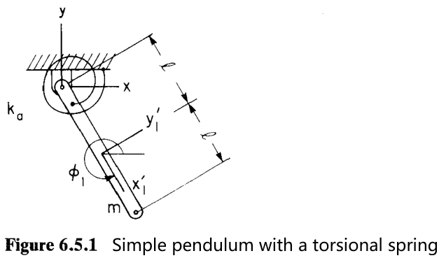
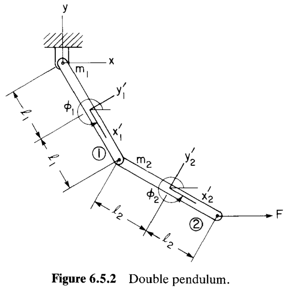

# 6.5 平衡条件（Equilibrium Conditions）

> 来源：*Computer Aided Kinematics and Dynamics of Mechanical Systems, Vol. 1*，第 6 章，6.5 节（书页 230–233）。

---

## 引言：本节要解决什么

本节给出了平衡的定义，并以此从运动方程推导得到**平衡方程（equilibrium equations）**（6.5.2）。
进一步，针对平衡方程的两个困难（需好初值、无法区分稳定/不稳定平衡），引入**总势能最小原理（principle of minimum total potential energy）**，把平衡态刻画为总势能取严格局部极小。
最后，用两个例子（扭簧单摆、受力双摆）演示如何写出总势能并求平衡位置。

---

## 6.5.1 平衡的定义与平衡方程

### 定义

平衡（equilibrium）的直观含义是：系统在外力作用下**保持静止**。静止意味着构型不随时间变化，因此速度与加速度都为零。

$$\ddot{\mathbf{q}} = \dot{\mathbf{q}} = \mathbf{0} \tag{6.5.1}$$

### 从运动方程导出平衡方程

思路上，是把平衡定义直接代入运动方程。取第 6.4 节的动力学方程（6.4.2）：

$$\mathbf{M}\ddot{\mathbf{q}} + \boldsymbol{\Phi}_{\mathbf{q}}^T\boldsymbol{\lambda} = \mathbf{Q}^A$$

令 $\ddot{\mathbf{q}}=\mathbf{0}$，惯性项 $\mathbf{M}\ddot{\mathbf{q}}=\mathbf{0}$ 消失，立即得到

$$\boxed{\boldsymbol{\Phi}_{\mathbf{q}}^T\boldsymbol{\lambda} = \mathbf{Q}^A} \tag{6.5.2}$$

这组方程称为系统的**平衡方程（equilibrium equations）**。和约束方程 $\boldsymbol{\Phi}(\mathbf{q},t)=\mathbf{0}$ 联立，就可以求得平衡态的拉格朗日乘子 $\boldsymbol{\lambda}$ 以及构型 $\mathbf{q}$ 。

### 两个困难

直接解 (6.5.2) 虽然计算上可行，却有两点不足：

1. **需要好初值**：(6.5.2) 与约束方程合起来是非线性代数方程组，迭代求解（如牛顿-拉夫森（Newton–Raphson））需要一个靠近平衡位置的良好初始估计。
2. **无法区分稳定与不稳定**：平衡方程 (6.5.2) 对**稳定**与**不稳定**平衡态**同样成立**。因此单靠解平衡方程的算法，会收敛到离初值最近的那个平衡态——可能是稳定的，也可能是不稳定的，无法预先控制。

> 直观例子：竖直向下悬垂的摆是稳定平衡（扰动后回落），竖直向上倒立的摆是不稳定平衡（扰动后倒下）。两者都满足 $\boldsymbol{\Phi}_{\mathbf{q}}^T\boldsymbol{\lambda}=\mathbf{Q}^A$，平衡方程本身分不出好坏。

---

## 6.5.2 总势能最小原理

### 思路

为绕开"不稳定平衡"的麻烦，对**保守机械系统（conservative mechanical systems）**改用**总势能最小原理（principle of minimum total potential energy）**：系统处于**稳定平衡**当且仅当其总势能（total potential energy, TPE）在该位置取到严格的局部极小。这样，只要去**极小化**总势能，自动就落到稳定平衡上，天然排除了不稳定态。

### 总势能的定义

$$TPE = SE - W(F) \tag{6.5.3}$$

其中：

- $SE$ 是柔性部件的**应变能（strain energy）**；
- $-W(F)$ 是作用于系统的所有力的**势能**（$W(F)$ 为这些力所做的功，取负号即为势能）。

**线性弹簧的应变能**：对线性平移弹簧与线性扭转弹簧，应变能如下，其中 $\ell_0,\theta_0$ 为弹簧的自然长度/角度：

$$SE = \tfrac{1}{2}k(\ell - \ell_0)^2 \qquad\text{和}\qquad \tfrac{1}{2}k_\theta(\theta - \theta_0)^2 \tag{6.5.4}$$

**恒力与恒力矩的势能**：设恒力 $\mathbf{F}^P$ 作用在物体上的点 $P$，恒力矩 $n$ 作用在物体上，则其势能为

$$-W(F) = -\bigl(x^P F^P_x + y^P F^P_y + n\phi\bigr) \tag{6.5.5}$$

其中 $(x^P,y^P)$ 是作用点 $P$ 的坐标，$\phi$ 是物体转角。功等于"力点乘位移 + 力矩乘转角"，势能取其负值。

### 稳定平衡 = 总势能极小

对保守系统，定义稳定平衡态 $\mathbf{q}_0$ 的条件是总势能被极小化，即

$$TPE(\mathbf{q}_0) \le TPE(\mathbf{q}) \tag{6.5.6}$$

对 $\mathbf{q}_0$ 的任意邻域状态 $\mathbf{q}$ 成立；"邻域"用一个小正数 $\varepsilon$ 刻画，即对所有满足以下条件的 $\mathbf{q}$，不等式 (6.5.6) 都成立。

$$(\mathbf{q}-\mathbf{q}_0)^T(\mathbf{q}-\mathbf{q}_0) \le \varepsilon \tag{6.5.7}$$

### 关键事实：广义力是总势能梯度的负值

数值极小化算法（第 7 章）需要目标函数的梯度。这里有一个可直接利用的事实：对保守系统，**广义力（generalized force）$\mathbf{Q}^A$ 正是总势能梯度的负值**：

$$\boxed{\dfrac{\partial TPE}{\partial \mathbf{q}} = -\mathbf{Q}^{A^T}} \tag{6.5.8}$$

（转置是因为 $\partial TPE/\partial\mathbf{q}$ 按约定是行向量，而 $\mathbf{Q}^A$ 是列向量。）

**为什么成立**：广义力由虚功定义，$\delta W = \mathbf{Q}^{A^T}\delta\mathbf{q}$。对保守力，其做的功等于势能的减少，$\delta W = -\delta(TPE) = -\dfrac{\partial TPE}{\partial\mathbf{q}}\,\delta\mathbf{q}$。两式对任意虚位移（virtual displacement）$\delta\mathbf{q}$ 相等，故 $\mathbf{Q}^{A^T} = -\dfrac{\partial TPE}{\partial\mathbf{q}}$，即 (6.5.8)。

**意义**：若已知系统受的是保守力，则**广义力就直接提供了总势能的梯度**——正是数值极小化算法所需。这个思想的数值实现见第 7 章。

---

## 例 6.5.1：带扭簧的单摆

> 一根质量 $m$、长 $2\ell$ 的单摆，悬点处装一扭转弹簧（torsional spring），弹簧常数 $k_\theta$，未变形角为 $\phi_0$。求平衡位置。

### 总势能

系统的总势能由两部分组成：扭簧的应变能 $\tfrac12 k_\theta(\phi_1-\phi_0)^2$ 与重力势能 $mgy_1$：

$$TPE = \tfrac{1}{2}k_\theta(\phi_1 - \phi_0)^2 + mgy_1 \tag{6.5.9}$$

### 约束方程

质心坐标 $(x_1,y_1)$ 与摆角 $\phi_1$ 之间受运动学约束（质心在距悬点 $\ell$ 处）：

$$\boldsymbol{\Phi} = \begin{bmatrix} x_1 - \ell\cos\phi_1 \\ y_1 - \ell\sin\phi_1 \end{bmatrix} = \mathbf{0} \tag{6.5.10}$$

### 用约束消元，把 TPE 化为单变量函数

取 (6.5.10) 的第二式 $y_1 = \ell\sin\phi_1$，代入 (6.5.9) 消去 $y_1$：

$$TPE = \tfrac{1}{2}k_\theta(\phi_1 - \phi_0)^2 + mg\ell\sin\phi_1$$

现在 TPE 只是单变量 $\phi_1$ 的函数，可直接对其求极小。

### 平衡条件：对 $\phi_1$ 求导置零

由总势能最小原理，平衡时 $\partial TPE/\partial\phi_1 = 0$。因此有：

$$\frac{\partial TPE}{\partial\phi_1} = k_\theta(\phi_1 - \phi_0) + mg\ell\cos\phi_1 = 0 \tag{6.5.11}$$

这是关于 $\phi_1$ 的**非线性方程**，需要用数值方法求解（这里不求，求解法见第 7 章）。把 (6.5.11) 改写成

$$-k_\theta(\phi_1 - \phi_0) = mg\ell\cos\phi_1$$

其物理意义一目了然：**平衡时，弹簧回复力矩 $-k_\theta(\phi_1-\phi_0)$ 恰好等于重力对悬点的力矩 $mg\ell\cos\phi_1$**——两力矩平衡。

---

## 例 6.5.2：受水平力的双摆（double pendulum）

> 两根杆铰接成双摆：第一杆质量 $m_1$、长 $2\ell_1$，第二杆质量 $m_2$、长 $2\ell_2$。在第二杆的**末端**沿水平方向施加恒力 $F$。求平衡角 $\phi_1,\phi_2$。

### 写出总势能（以 $\phi_1,\phi_2$ 为独立变量）

利用约束把各质心坐标用两个转角 $\phi_1,\phi_2$ 表示（它们可视为独立变量），总势能 (6.5.3) 写成重力势能加恒力势能的形式：

$$TPE = m_1 g\,\ell_1\sin\phi_1 + m_2 g\,(2\ell_1\sin\phi_1 + \ell_2\sin\phi_2) - F\,(2\ell_1\cos\phi_1 + 2\ell_2\cos\phi_2)$$

逐项来源：

- $m_1 g\,\ell_1\sin\phi_1$：第一杆质心（在 $\ell_1$ 处）的重力势能；
- $m_2 g\,(2\ell_1\sin\phi_1 + \ell_2\sin\phi_2)$：第二杆质心的高度是"第一杆全长 $2\ell_1$ 的竖直投影 $2\ell_1\sin\phi_1$ 加上第二杆半长 $\ell_2$ 的竖直投影 $\ell_2\sin\phi_2$"，乘以 $m_2 g$；
- $-F\,(2\ell_1\cos\phi_1 + 2\ell_2\cos\phi_2)$：恒力 $F$ 作用在第二杆末端，其水平位置为 $2\ell_1\cos\phi_1 + 2\ell_2\cos\phi_2$；由 (6.5.5)，水平恒力的势能是 $-F\cdot x_{\text{tip}}$。

### 平衡条件：两个偏导同时为零

由总势能最小原理，平衡时

$$\frac{\partial TPE}{\partial\phi_1} = \frac{\partial TPE}{\partial\phi_2} = 0$$

**对 $\phi_1$ 求偏导**（只有含 $\phi_1$ 的项有贡献）：$\dfrac{\partial}{\partial\phi_1}[m_1 g\ell_1\sin\phi_1]=m_1 g\ell_1\cos\phi_1$，$\dfrac{\partial}{\partial\phi_1}[2m_2 g\ell_1\sin\phi_1]=2m_2 g\ell_1\cos\phi_1$，$\dfrac{\partial}{\partial\phi_1}[-2F\ell_1\cos\phi_1]=+2F\ell_1\sin\phi_1$，合并：

$$\frac{\partial TPE}{\partial\phi_1} = m_1 g\ell_1\cos\phi_1 + 2m_2 g\ell_1\cos\phi_1 + 2F\ell_1\sin\phi_1 = 0$$

**对 $\phi_2$ 求偏导**（只有含 $\phi_2$ 的项有贡献）：$\dfrac{\partial}{\partial\phi_2}[m_2 g\ell_2\sin\phi_2]=m_2 g\ell_2\cos\phi_2$，$\dfrac{\partial}{\partial\phi_2}[-2F\ell_2\cos\phi_2]=+2F\ell_2\sin\phi_2$，合并：

$$\frac{\partial TPE}{\partial\phi_2} = m_2 g\ell_2\cos\phi_2 + 2F\ell_2\sin\phi_2 = 0$$

### 解出平衡角

**解 $\phi_1$**：从第一式，先提出公因子 $\ell_1$ 并整理，

$$(m_1 + 2m_2)g\cos\phi_1 + 2F\sin\phi_1 = 0
\;\Longrightarrow\;
\tan\phi_1 = -\frac{(m_1 + 2m_2)g}{2F}$$

即

$$\phi_1 = \operatorname{Arctan}\!\left[-\frac{(m_1 + 2m_2)g}{2F}\right]$$

**解 $\phi_2$**：从第二式，除以 $\ell_2$，

$$m_2 g\cos\phi_2 + 2F\sin\phi_2 = 0
\;\Longrightarrow\;
\tan\phi_2 = -\frac{m_2 g}{2F}$$

即

$$\phi_2 = \operatorname{Arctan}\!\left[-\frac{m_2 g}{2F}\right]$$

**物理解读**：两个平衡角都由"竖直重力项"与"水平驱动力 $2F$"之比的反正切给出。$F$ 越大，$\tan\phi$ 越小，摆越被水平力拉平（趋于水平）；$F\to0$ 时 $\tan\phi\to-\infty$，即 $\phi\to-\pi/2$，两杆竖直下垂——回到纯重力下的自然悬垂平衡。第一杆的等效重力项含 $(m_1+2m_2)$，因为它同时要托起自身与整根第二杆。
