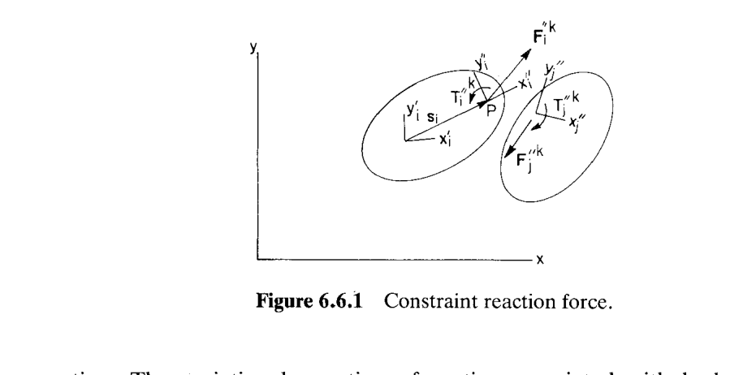
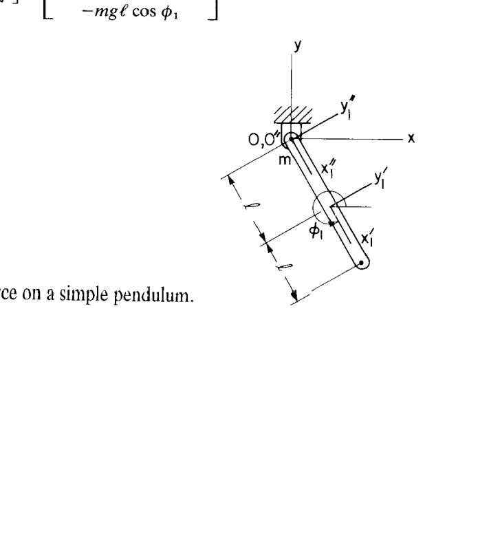

# 6.6 约束反力（Constraint Reaction Forces）

> 来源：*Computer Aided Kinematics and Dynamics of Mechanical Systems, Vol. 1*，第 6 章，6.6 节（书页 233–237）。
> 本文以"文字讲解 + 逐式详细推导"组织，公式推导不跳步骤。

---

## 引言：本节要解决什么

前几节把整个机械系统的运动方程写成"惯性项 + 约束项 = 外力项"的形式，约束的作用被压缩进一个统一的项 $\boldsymbol{\Phi}_{\mathbf{q}}^T\boldsymbol{\lambda}$ 里，拉格朗日乘子（Lagrange multiplier）$\boldsymbol{\lambda}$ 一次性代表了**所有**约束的合力效应。但工程上我们常常想知道**某一个具体关节（joint）到底承受多大的力和力矩**——这是选轴承、定螺栓、做强度校核的直接依据。

本节要解决的就是：**如何从已经求得的拉格朗日乘子 $\boldsymbol{\lambda}$，反算出单个约束 $k$ 施加在物体上的反力 $\mathbf{F}_i''^k$ 与反力矩 $T_i''^k$**。主线逻辑是：

1. 从物体 $i$ 的**变分运动方程（variational equation of motion）**（6.6.1）出发，把约束 $k$ 单独拎出来；
2. 用"打断约束、代之以反力"的思想，得到反力必须满足的虚功恒等式（6.6.2）；
3. 通过一串坐标变换（6.6.3–6.6.6）把虚位移换到关节的**随体系 $x''\text{-}y''$**；
4. 代回并利用虚位移任意性，得到反力与反力矩的封闭公式（6.6.8）、（6.6.9）；
5. 用一个驱动单摆的例子演示，并把公式展开到第 3 章的几种标准关节（绝对约束、转动关节、移动关节）。

---

## 6.6.1 从变分运动方程到反力的虚功恒等式

### 思路

考虑多体系统中物体 $i$ 与 $j$ 之间一个运动学约束或驱动约束，编号为约束 $k$，其约束方程记作 $\boldsymbol{\Phi}^k=\mathbf{0}$。物体 $i$ 身上还可能连着别的约束（编号 $\ell\neq k$）。我们要把约束 $k$ 的贡献从物体 $i$ 的运动方程里单独分离出来。

### 单体的变分运动方程

由 6.3 节的（6.3.15），对 $j\neq i$ 令 $\delta\mathbf{q}_j=\mathbf{0}$（即只给物体 $i$ 一个虚位移），得到只关乎物体 $i$ 的变分运动方程：

$$\delta\mathbf{q}_i^T\mathbf{M}_i\ddot{\mathbf{q}}_i + \sum_{\ell\neq k}\delta\mathbf{q}_i^T\boldsymbol{\Phi}_{\mathbf{q}_i}^{\ell T}\boldsymbol{\lambda}^\ell + \delta\mathbf{q}_i^T\boldsymbol{\Phi}_{\mathbf{q}_i}^{kT}\boldsymbol{\lambda}^k = \delta\mathbf{q}_i^T\mathbf{Q}_i^A \tag{6.6.1}$$

其中 $\boldsymbol{\lambda}^\ell$ 是总乘子向量 $\boldsymbol{\lambda}$ 中对应约束 $\ell$ 的子向量，而作用在 $i$、$j$ 之间的约束 $k$ 被**单独挑出来**（式中最后一个左端项）以便特殊处理。由（6.3.15）可知，（6.6.1）对**任意** $\delta\mathbf{q}_i$ 成立。

### 打断约束、代之以反力

关键的物理构造：设想把约束 $k$ **物理地"剪断"**，在关节处代之以动力学过程中真实出现的**约束反力（constraint reaction force）**（示意见图 6.6.1）。若这样替换后重新写运动方程并删去约束 $k$，则（6.6.1）左端最后那一项 $\delta\mathbf{q}_i^T\boldsymbol{\Phi}_{\mathbf{q}_i}^{kT}\boldsymbol{\lambda}^k$ 就会消失，取而代之的是**约束反力与反力矩所做的虚功**。两种描述给出相同的运动，故对应项必相等：

$$-\bigl(\delta\mathbf{r}_i^T\boldsymbol{\Phi}_{\mathbf{r}_i}^{kT}\boldsymbol{\lambda}^k + \delta\phi_i\,\boldsymbol{\Phi}_{\phi_i}^{kT}\boldsymbol{\lambda}^k\bigr) = \delta\mathbf{r}_i''^{PT}\mathbf{F}_i''^k + \delta\phi_i\,T_i''^k \tag{6.6.2}$$

这里把（6.6.1）左端约束 $k$ 项按**物理广义坐标** $\mathbf{q}_i=[\mathbf{r}_i^T,\phi_i]^T$ 展开：$\boldsymbol{\Phi}_{\mathbf{q}_i}^{kT}$ 拆成对平动坐标的部分 $\boldsymbol{\Phi}_{\mathbf{r}_i}^{kT}$ 与对转角的部分 $\boldsymbol{\Phi}_{\phi_i}^{kT}$。左端带负号，因为它原本是"约束项"，移到反力一侧代表约束反力对系统所做的虚功。等式右端：$\mathbf{F}_i''^k$ 是作用在关节点 $P$ 上的反力、$T_i''^k$ 是反力矩，它们分别与作用点的虚位移 $\delta\mathbf{r}_i''^P$、物体虚转角 $\delta\phi_i$ 配对做功。（6.6.2）对任意 $\delta\mathbf{r}_i$ 和 $\delta\phi_i$ 都要成立。关于乘子在"关节换成反力"后保持不变的更细致证明，见原书文献 35。

> 记号约定：上标 $''$（双撇）表示量在**关节随体系 $x''\text{-}y''$** 中，其原点取在关节作用点 $P$；单撇 $'$ 表示在物体质心随体系 $x'\text{-}y'$ 中；无撇表示全局 $x\text{-}y$ 系。$\mathbf{F}_i''^k$ 即"约束 $k$ 作用于物体 $i$、在 $i$ 的关节系中表达的反力"。

---

## 6.6.2 把虚位移换到关节随体系

### 思路

（6.6.2）右端出现的是**关节点 $P$ 在关节系中的虚位移** $\delta\mathbf{r}_i''^P$，而左端出现的是**质心虚位移** $\delta\mathbf{r}_i$ 与**虚转角** $\delta\phi_i$。要匹配系数、解出 $\mathbf{F}_i''^k$ 和 $T_i''^k$，必须先把 $\delta\mathbf{r}_i$ 用 $\delta\mathbf{r}_i''^P$ 和 $\delta\phi_i$ 表达出来。这就要用到"点 $P$ 的位置 = 质心位置 + 质心到 $P$ 的矢量"这一运动学关系，并做一次坐标系变换。

### 关节点位置及其虚位移

关节作用点 $P$ 的全局位置：

$$\mathbf{r}_i^P = \mathbf{r}_i + \mathbf{A}_i\mathbf{s}_i'^P \tag{6.6.3}$$

其中 $\mathbf{s}_i'^P$ 是 $P$ 在质心系 $x'\text{-}y'$ 中的（常）坐标，$\mathbf{A}_i=\mathbf{A}(\phi_i)$ 是转动变换矩阵。对（6.6.3）取变分（虚位移就是微分），利用 $\delta\mathbf{A}_i=\mathbf{B}_i\,\delta\phi_i$（$\mathbf{B}_i=\mathbf{R}\mathbf{A}_i$ 为 $\mathbf{A}_i$ 对 $\phi_i$ 的导数），且 $\mathbf{s}_i'^P$ 为常量：

$$\delta\mathbf{r}_i^P = \delta\mathbf{r}_i + \mathbf{B}_i\mathbf{s}_i'^P\,\delta\phi_i \tag{6.6.4}$$

### 换到关节系 $x''\text{-}y''$

虚位移是**矢量**，换系只需乘以相应的旋转变换。常值变换矩阵 $\mathbf{C}_i$ 把 $x_i''\text{-}y_i''$ 系中的矢量变到 $x_i'\text{-}y_i'$ 系（即关节系相对质心系的固定安装朝向），再由 $\mathbf{A}_i$ 变到全局系。因此点 $P$ 的虚位移用其在关节系中的分量 $\delta\mathbf{r}_i''^P$ 表示为：

$$\delta\mathbf{r}_i^P = \mathbf{A}_i\mathbf{C}_i\,\delta\mathbf{r}_i''^P \tag{6.6.5}$$

把（6.6.5）代入（6.6.4），解出质心虚位移 $\delta\mathbf{r}_i$：

$$\delta\mathbf{r}_i = \mathbf{A}_i\mathbf{C}_i\,\delta\mathbf{r}_i''^P - \mathbf{B}_i\mathbf{s}_i'^P\,\delta\phi_i \tag{6.6.6}$$

这样，质心虚位移就被彻底表达成了两个独立虚量 $\delta\mathbf{r}_i''^P$ 与 $\delta\phi_i$ 的组合。

---

## 6.6.3 反力与反力矩公式

### 代入并整理

把（6.6.6）代入（6.6.2）的左端。先转置：

$$\delta\mathbf{r}_i^T = \delta\mathbf{r}_i''^{PT}\mathbf{C}_i^T\mathbf{A}_i^T - \delta\phi_i\,\mathbf{s}_i'^{PT}\mathbf{B}_i^T$$

于是左端第一项

$$\delta\mathbf{r}_i^T\boldsymbol{\Phi}_{\mathbf{r}_i}^{kT}\boldsymbol{\lambda}^k = \delta\mathbf{r}_i''^{PT}\mathbf{C}_i^T\mathbf{A}_i^T\boldsymbol{\Phi}_{\mathbf{r}_i}^{kT}\boldsymbol{\lambda}^k - \delta\phi_i\,\mathbf{s}_i'^{PT}\mathbf{B}_i^T\boldsymbol{\Phi}_{\mathbf{r}_i}^{kT}\boldsymbol{\lambda}^k$$

代入（6.6.2）左端全部并整理（注意整体负号，且把两处 $\delta\phi_i$ 项合并）：

$$-\delta\mathbf{r}_i''^{PT}\mathbf{C}_i^T\mathbf{A}_i^T\boldsymbol{\Phi}_{\mathbf{r}_i}^{kT}\boldsymbol{\lambda}^k - \delta\phi_i\bigl(\boldsymbol{\Phi}_{\phi_i}^{kT} - \mathbf{s}_i'^{PT}\mathbf{B}_i^T\boldsymbol{\Phi}_{\mathbf{r}_i}^{kT}\bigr)\boldsymbol{\lambda}^k = \delta\mathbf{r}_i''^{PT}\mathbf{F}_i''^k + \delta\phi_i\,T_i''^k \tag{6.6.7}$$

### 匹配系数

由于虚位移 $\delta\mathbf{r}_i''^P$ 与虚转角 $\delta\phi_i$ 相互独立、取值任意，（6.6.7）两端对应系数必须分别相等，立即读出所求结果：

$$\boxed{\mathbf{F}_i''^k = -\mathbf{C}_i^T\mathbf{A}_i^T\boldsymbol{\Phi}_{\mathbf{r}_i}^{kT}\boldsymbol{\lambda}^k} \tag{6.6.8}$$

$$\boxed{T_i''^k = \bigl(\mathbf{s}_i'^{PT}\mathbf{B}_i^T\boldsymbol{\Phi}_{\mathbf{r}_i}^{kT} - \boldsymbol{\Phi}_{\phi_i}^{kT}\bigr)\boldsymbol{\lambda}^k} \tag{6.6.9}$$

### 物理解读

- （6.6.8）中 $-\mathbf{A}_i^T\boldsymbol{\Phi}_{\mathbf{r}_i}^{kT}\boldsymbol{\lambda}^k$ 恰是关节反力的负值（$\mathbf{A}_i^T$ 把全局分量转回随体系），再乘 $\mathbf{C}_i^T$ 转到关节系 $x''\text{-}y''$。
- （6.6.9）右端 $\mathbf{s}_i'^{PT}\mathbf{B}_i^T\boldsymbol{\Phi}_{\mathbf{r}_i}^{kT}\boldsymbol{\lambda}^k$ 是**反力对质心系原点取矩**的项：它对应把反力从质心系 $x'\text{-}y'$ 的原点搬到关节点 $P$（即图 6.6.1 中 $x''\text{-}y''$ 系原点）时所需的力矩转移，$-\boldsymbol{\Phi}_{\phi_i}^{kT}\boldsymbol{\lambda}^k$ 则是约束本身对转角的直接贡献。
- （6.6.8）、（6.6.9）形式简单、只依赖已知的雅可比块与乘子，**可直接编程**，在关节随体系 $x''\text{-}y''$ 中输出该关节的反力与反力矩。

---

## 例 6.6.1：运动学驱动单摆的关节反力

> 取例 6.4.1 的运动学驱动单摆（转动关节把摆铰在地面点 $O$，并以驱动约束 $\phi_1=3\pi/2+2\pi t$ 强制其转动），几何见图 6.6.2。摆质量 $m$、质心距 $O$ 为 $\ell$。

### 已知乘子

由例 6.4.1 求得的拉格朗日乘子向量为（前两个分量 $\boldsymbol{\lambda}^r$ 属转动关节，末分量 $\lambda^d$ 属驱动约束）：

$$\boldsymbol{\lambda} = \begin{bmatrix}\boldsymbol{\lambda}^r\\ \lambda^d\end{bmatrix} = \begin{bmatrix} m\ell\cos\phi_1\,\dot\phi_1^2 \\ -mg + m\ell\sin\phi_1\,\dot\phi_1^2 \\ -mg\ell\cos\phi_1 \end{bmatrix}$$

### 计算关节反力（6.6.10）

关节点即 $O$，其质心系 $x_1'\text{-}y_1'$ 与关节系 $x_1''\text{-}y_1''$ **平行**，故 $\mathbf{C}=\mathbf{I}$。转动关节对 $\mathbf{r}_i$ 的雅可比为单位阵，驱动约束不含 $\mathbf{r}_i$，故 $\boldsymbol{\Phi}_{\mathbf{r}_i}^{kT}$ 是把 $\boldsymbol{\lambda}$ 的前两个分量选出来的 $\begin{bmatrix}1&0&0\\0&1&0\end{bmatrix}$。由（6.6.8）：

$$\mathbf{F}'' = -\begin{bmatrix}\cos\phi_1 & \sin\phi_1\\ -\sin\phi_1 & \cos\phi_1\end{bmatrix}\begin{bmatrix}1&0&0\\0&1&0\end{bmatrix}\begin{bmatrix} m\ell\cos\phi_1\,\dot\phi_1^2 \\ -mg + m\ell\sin\phi_1\,\dot\phi_1^2 \\ -mg\ell\cos\phi_1 \end{bmatrix}$$

先做选取：$\begin{bmatrix}1&0&0\\0&1&0\end{bmatrix}\boldsymbol{\lambda}=\begin{bmatrix} m\ell\cos\phi_1\,\dot\phi_1^2 \\ -mg + m\ell\sin\phi_1\,\dot\phi_1^2\end{bmatrix}$。再左乘 $\mathbf{A}^T$（这里 $\mathbf{A}^T=\begin{bmatrix}\cos\phi_1&\sin\phi_1\\-\sin\phi_1&\cos\phi_1\end{bmatrix}$）：

第一分量：

$$-\bigl[\cos\phi_1\cdot m\ell\cos\phi_1\,\dot\phi_1^2 + \sin\phi_1(-mg + m\ell\sin\phi_1\,\dot\phi_1^2)\bigr]$$
$$= -\bigl[m\ell\dot\phi_1^2(\cos^2\phi_1+\sin^2\phi_1) - mg\sin\phi_1\bigr] = -m\ell\dot\phi_1^2 + mg\sin\phi_1$$

第二分量：

$$-\bigl[-\sin\phi_1\cdot m\ell\cos\phi_1\,\dot\phi_1^2 + \cos\phi_1(-mg + m\ell\sin\phi_1\,\dot\phi_1^2)\bigr]$$
$$= -\bigl[-mg\cos\phi_1 + m\ell\dot\phi_1^2(-\sin\phi_1\cos\phi_1+\cos\phi_1\sin\phi_1)\bigr] = mg\cos\phi_1$$

故

$$\mathbf{F}'' = \begin{bmatrix} -m\ell\dot\phi_1^2 + mg\sin\phi_1 \\ mg\cos\phi_1 \end{bmatrix} \tag{6.6.10}$$

### 计算关节反力矩（6.6.11）

质心在 $x_1'$ 轴上距 $O$ 为 $\ell$，故 $\mathbf{s}_1'^P=[-\ell,\,0]^T$（由 $O$ 指向质心为 $+x_1'$，则 $P=O$ 相对质心为 $-\ell$）。$\mathbf{s}_1'^{PT}\mathbf{B}_1^T=[-\ell,0]\begin{bmatrix}-\sin\phi_1&\cos\phi_1\\-\cos\phi_1&-\sin\phi_1\end{bmatrix}$，$\boldsymbol{\Phi}_{\phi_i}^{kT}$ 给出 $[\ell\sin\phi_1,\,-\ell\cos\phi_1,\,1]$。由（6.6.9）：

$$T = \left\{[-\ell,\,0]\begin{bmatrix}-\sin\phi_1&\cos\phi_1\\-\cos\phi_1&-\sin\phi_1\end{bmatrix}\begin{bmatrix}1&0&0\\0&1&0\end{bmatrix} - [\ell\sin\phi_1,\,-\ell\cos\phi_1,\,1]\right\}\boldsymbol{\lambda}$$

括号内化简：$[-\ell,0]\begin{bmatrix}-\sin\phi_1&\cos\phi_1\\-\cos\phi_1&-\sin\phi_1\end{bmatrix}=[\ell\sin\phi_1,\,-\ell\cos\phi_1]$，补上选取矩阵的第三列零，得 $[\ell\sin\phi_1,\,-\ell\cos\phi_1,\,0]$；再减去 $[\ell\sin\phi_1,\,-\ell\cos\phi_1,\,1]$ 得 $[0,\,0,\,-1]$。于是

$$T = [0,\,0,\,-1]\begin{bmatrix} m\cos\phi_1\,\dot\phi_1^2 \\ -mg + m\sin\phi_1\,\dot\phi_1^2 \\ -mg\ell\cos\phi_1 \end{bmatrix} = mg\ell\cos\phi_1 \tag{6.6.11}$$

### 独立验证

（6.6.10）是转动关节在 $O$ 处、于 $x_1''\text{-}y_1''$ 系中的反力；（6.6.11）是为产生驱动约束 $\phi_1=3\pi/2+2\pi t$ 所需的**驱动力矩**。因驱动使 $\ddot\phi_1=0$，绕 $O$ 的合力矩必为零：

$$T - mg\ell\cos\phi_1 = 0$$

直接用刚体运动方程即得同一结果，验证（6.6.11）正确。同理，质心加速度为 $\ell\dot\phi_1^2$ 沿 $-x_1'$ 方向，把"质量 × 该加速度"与重力、反力之和平衡，即验证（6.6.10）。

---

## 6.6.4 标准关节的反力公式

把（6.6.8）、（6.6.9）对第 3 章几种标准关节展开，可得一批可直接调用的公式。

### 绝对 x 约束（Eq. 3.2.3）

用其雅可比（Eq. 3.2.5）代入：

$$\mathbf{F}_i''^{ax(i)} = -\mathbf{C}_i^T\mathbf{A}_i^T\begin{bmatrix}1\\0\end{bmatrix}\lambda^{ax(i)}$$

$$T_i''^{ax(i)} = \bigl[-x_i'^P\sin\phi_i - y_i'^P\cos\phi_i - (-x_i'^P\sin\phi_i - y_i'^P\cos\phi_i)\bigr]\lambda^{ax(i)} = 0$$

如预期，该约束在点 $P$ 处**不承受反力矩**（两项恰好抵消）。把 $\mathbf{F}_i''^{ax(i)}$ 依次左乘 $\mathbf{C}_i$、$\mathbf{A}_i$ 变到全局系：

$$\mathbf{F}_i^{ax(i)} = -\begin{bmatrix}1\\0\end{bmatrix}\lambda^{ax(i)}$$

即全局 $y$ 方向无反力，全局 $x$ 分量恰为拉格朗日乘子 $\lambda^{ax(i)}$（的负值）。

### 转动关节（Eq. 3.3.10，雅可比 Eq. 3.3.12）

$$\mathbf{F}_i''^{r(i,j)} = -\mathbf{C}_i^T\mathbf{A}_i^T(\mathbf{I})\boldsymbol{\lambda}^{r(i,j)} = -\mathbf{C}_i^T\mathbf{A}_i^T\boldsymbol{\lambda}^{r(i,j)}$$

$$T_i''^{rk(i,j)} = \bigl[\mathbf{s}_i'^{PT}\mathbf{B}_i^T(\mathbf{I}) - (\mathbf{s}_i'^{PT}\mathbf{B}_i^T)\bigr]\boldsymbol{\lambda}^{r(i,j)} = 0$$

如预期，**转动关节不承受反力矩**（这正是转动关节"自由转动"的体现）。把反力左乘 $\mathbf{C}_i$ 再 $\mathbf{A}_i$ 变到全局系：

$$\mathbf{F}_i^{r(i,j)} = -\boldsymbol{\lambda}^{r(i,j)}$$

即**转动关节反力就是拉格朗日乘子的负值**（在全局 $x\text{-}y$ 系中）。

### 移动关节（Eq. 3.3.13，雅可比 Eq. 3.3.14）

$$\mathbf{F}_i''^{t(i,j)} = -\mathbf{C}_i^T\mathbf{A}_i^T[-\mathbf{B}_i\mathbf{v}_i',\,\mathbf{0}]\boldsymbol{\lambda}^{t(i,j)} = \mathbf{C}_i^T\mathbf{A}_i^T\mathbf{R}\mathbf{A}_i\mathbf{v}_i'\lambda_1^{t(i,j)} = \lambda_1^{t(i,j)}\mathbf{C}_i^T\mathbf{A}_i^T\mathbf{R}\mathbf{v}_i$$

（用了 $\mathbf{B}_i=\mathbf{R}\mathbf{A}_i$，且移动关节雅可比的第二列为零故只留下 $\lambda_1^{t(i,j)}$。）反力矩：

$$T_i''^{t(i,j)} = \Bigl\{\mathbf{s}_i'^{PT}\mathbf{B}_i^T[-\mathbf{B}_i\mathbf{v}_i',\,\mathbf{0}] + \bigl[(\mathbf{r}_j-\mathbf{r}_i)^T\mathbf{A}_i\mathbf{v}_i' + \mathbf{s}_j'^{PT}\mathbf{A}_{ij}^T\mathbf{v}_i',\;\mathbf{v}_j'^T\mathbf{A}_{ij}^T\mathbf{v}_i'\bigr]\Bigr\}\boldsymbol{\lambda}^{t(i,j)}$$
$$= \bigl[(\mathbf{r}_j-\mathbf{r}_i)^T\mathbf{A}_i + \mathbf{s}_j'^{PT}\mathbf{A}_{ij}^T - \mathbf{s}_i'^{PT},\;\mathbf{v}_j'^T\mathbf{A}_{ij}^T\bigr]\mathbf{v}_i'\boldsymbol{\lambda}^{t(i,j)}$$

注意此时反力 $\mathbf{F}_i''^{t(i,j)}$ **垂直于滑轨方向 $\mathbf{v}_i$**（如预期——移动关节沿轨无约束力，横向才有），而反力矩 $T_i''^{t(i,j)}$ **一般不为零**（这与转动关节相反）。

---

## 小结

| 量 | 通式 | 说明 |
|----|------|------|
| 关节反力 | $\mathbf{F}_i''^k = -\mathbf{C}_i^T\mathbf{A}_i^T\boldsymbol{\Phi}_{\mathbf{r}_i}^{kT}\boldsymbol{\lambda}^k$（6.6.8） | 在关节系 $x''\text{-}y''$ 中 |
| 关节反力矩 | $T_i''^k = (\mathbf{s}_i'^{PT}\mathbf{B}_i^T\boldsymbol{\Phi}_{\mathbf{r}_i}^{kT} - \boldsymbol{\Phi}_{\phi_i}^{kT})\boldsymbol{\lambda}^k$（6.6.9） | 含力矩转移项 |
| 转动关节 | $\mathbf{F}_i^{r(i,j)} = -\boldsymbol{\lambda}^{r(i,j)}$（全局），$T=0$ | 反力 $=$ 乘子负值 |
| 移动关节 | $\mathbf{F}_i''^{t}\perp\mathbf{v}_i$，$T_i''^{t}\neq 0$ | 反力横于滑轨 |
| 绝对 x | $\mathbf{F}_i^{ax(i)}=-[1,0]^T\lambda^{ax(i)}$，$T=0$ | 只在全局 $x$ 有力 |

核心结论：**只要动力学解出了拉格朗日乘子 $\boldsymbol{\lambda}$，任一关节的反力与反力矩都可由（6.6.8）、（6.6.9）以纯代数方式算出**，无需另解方程。这为轴承选型、结构强度校核提供了直接的数值输出。
