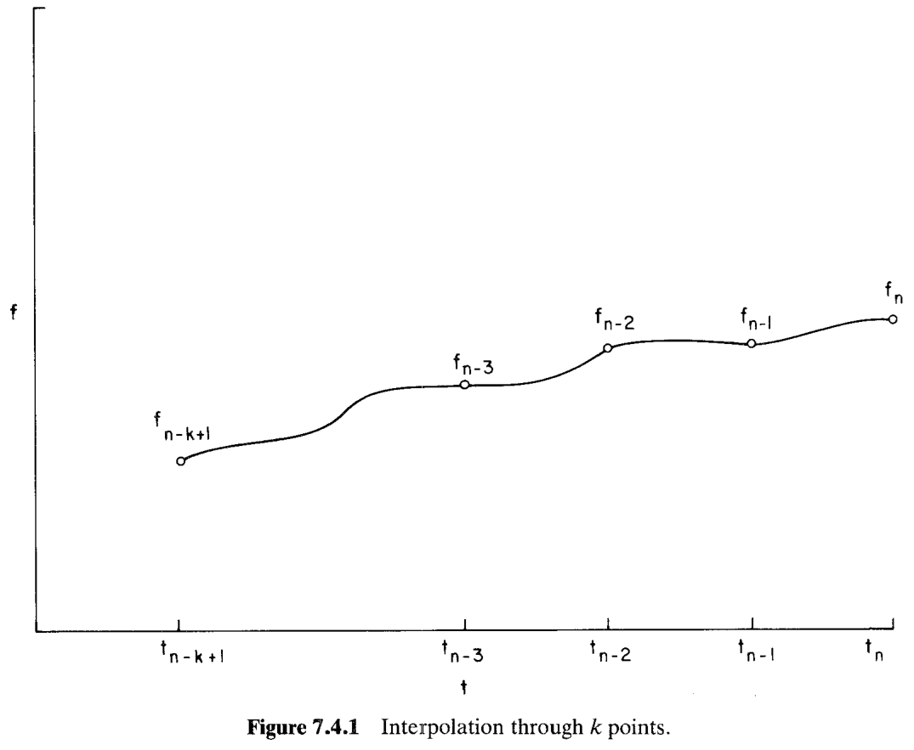
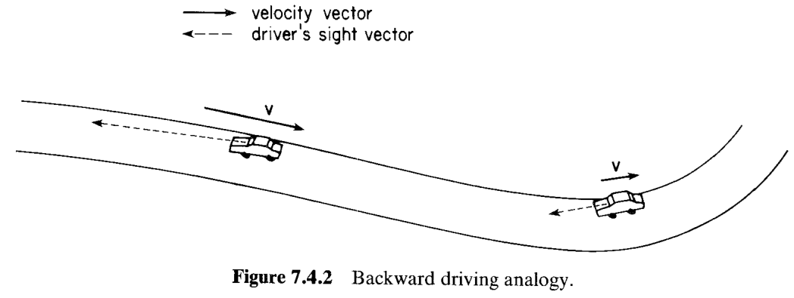

# 7.4 一阶初值问题的数值积分

> 来源：*Computer Aided Kinematics and Dynamics of Mechanical Systems, Vol. 1*，第 7 章，7.4 节（书页 259–276）。

---

## 引言：本节要解决什么

7.3 节介绍的四种算法（分块法、直接积分、Baumgarte 稳定化、混合法）殊途同归，都把约束多体系统的混合 DAE **约化成一个标准的一阶初值问题**：

$$
\dot{\mathbf x}=\mathbf f(\mathbf x,t),\qquad \mathbf x(t_0)=\mathbf x^0
\tag{7.4.1}
$$

其中 $\mathbf x=[x_1,x_2,\dots,x_m]^T$ 是待积分的变量（对多体系统即 $[\mathbf q,\dot{\mathbf q}]$），右端 $\mathbf f(\mathbf x,t)$ 由 7.3 的某个算法的"计算序列"隐式给出——每求一次 $\mathbf f$，都要解一次运动方程 Eq. 7.2.1 得到 $\ddot{\mathbf q}$。

> 6.3.3 节的约束动力学存在性定理 + 隐函数定理保证：只要约束 Jacobian $\boldsymbol\Phi_q$ 满行秩、其元素与广义力连续可微，则 7.4.1 满足 7.3 节初值问题存在性定理的假设，故 7.4.1 局部有唯一解。$\mathbf x^0$ 给定初始条件。

**本节的任务**：不管 7.3 选了哪种算法，都要能把 7.4.1 从 $t_0$ 一步步推进到终止时刻。本节的主线逻辑是：

1. **7.4.1 多项式插值**——一切数值积分的地基。用 Taylor 多项式和 Newton 后向差分多项式逼近函数，并给出插值误差估计（这是后面误差控制的理论来源）；
2. **7.4.2 Adams–Bashforth 预测器**——把 $\mathbf f$ 用过去点的插值多项式代替再积分，得到**显式**多步公式；
3. **7.4.3 Adams–Moulton 校正器**——把预测值也纳入插值，得到**隐式**、更高阶更精确的公式；
4. **7.4.4 PECE 实现**——预测-校正配对、自启动、以及用截断误差估计自动调节步长 $h$ 与阶次 $k$。

> 关键提示：从头到尾都在解**同一个** $e^t$ 的初值问题 $\dot x=x,\ x(0)=1$，用它作"标尺"逐个演示 Taylor、Newton 差分、Euler、Adams–Bashforth、Adams–Moulton 的精度差异。

---

## 7.4.1 多项式插值（Polynomial Interpolation）

### 思路

数值积分的思想是：**用一个多项式 $P(t)$ 去逼近函数 $f(t)$**，使 $P$ 在若干点 $t_i$ 上与 $f$（也许还有 $f$ 的若干阶导数）相等，然后拿容易积分的 $P$ 代替难积分的 $f$。

逼近多项式的构造方法有很多，各有利弊，本节用到两种：Taylor 多项式与 Newton 后向差分多项式。

### Taylor 多项式

Taylor 方法在点 $t_0$ 附近用 **Taylor 多项式**逼近 $f(t)$：

$$
T_k(t)=f(t_0)+f^{(1)}(t_0)(t-t_0)+\frac{f^{(2)}(t_0)(t-t_0)^2}{2!}+\cdots+\frac{f^{(k-1)}(t_0)(t-t_0)^{k-1}}{(k-1)!}
\tag{7.4.2}
$$

其中 $f^{(i)}(t_0)$ 表示 $f$ 在 $t_0$ 处的第 $i$ 阶导数。这个 $k-1$ 次多项式在 $t_0$ 处与 $f$ 及其前 $k-1$ 阶导数完全吻合：

$$
T_k^{(j)}(t_0)=f^{(j)}(t_0),\qquad j=0,1,\dots,k-1
\tag{7.4.3}
$$

#### 例 7.4.1：用 Taylor 多项式逼近 $e^t$

> 用 Eq. 7.4.2 在 $t_0=0$ 展开 $f(t)=e^t$。

因为 $f^{(j)}(t)=e^t$ 对一切 $j$ 成立，故 $f^{(j)}(0)=e^0=1$。代入 7.4.2：

$$
\begin{aligned}
T_k(t)&=e^0+e^0(t-0)+\frac{e^0(t-0)^2}{2!}+\cdots+\frac{e^0(t-0)^{k-1}}{(k-1)!}\\
&=1+t+\frac{t^2}{2!}+\frac{t^3}{3!}+\cdots+\frac{t^{k-1}}{(k-1)!}
\end{aligned}
$$

Table 7.4.1 列出 $T_k(t)$ 与误差 $E_k(t)=T_k(t)-e^t$ 在 $t=0.5$ 与 $t=1$ 处、$k$ 从 1 到 14 的值。

| $k$ | $T_k(0.5)$ | $E_k(0.5)$ | $T_k(1)$ | $E_k(1)$ |
|---|---|---|---|---|
| 1 | 1.000000000 | $-0.6487212707$ | 1.000000000 | $-1.7182818285$ |
| 2 | 1.500000000 | $-0.1487212707$ | 2.000000000 | $-0.7182818285$ |
| 3 | 1.625000000 | $-0.0237212707$ | 2.500000000 | $-0.2182818285$ |
| 4 | 1.645833333 | $-0.0028879374$ | 2.666666667 | $-0.0516151618$ |
| 5 | 1.648437500 | $-0.0002837707$ | 2.708333333 | $-0.0099484951$ |
| 6 | 1.648697917 | $-0.0000233540$ | 2.716666667 | $-0.0016151618$ |
| 7 | 1.648719618 | $-0.0000016526$ | 2.718055556 | $-0.0002262729$ |
| 8 | 1.648721168 | $-0.0000001025$ | 2.718253968 | $-0.0000278602$ |
| $\vdots$ | $\vdots$ | $\vdots$ | $\vdots$ | $\vdots$ |
| 14 | 1.648721271 | $0.0000000000$ | 2.718281828 | $0.0000000000$ |

**结论**：Taylor 多项式可把邻近点的函数值逼近到任意精度；且当 $\lvert t-t_0\rvert$ 越小、收敛越快。

### 插值多项式（Newton 后向差分形式）

**思路**：实际中，一个函数的高阶导数往往很难得到。相反，一个函数在多个 $t$ 处的取值相对容易获得。因此，就构造一个 $k-1$ 次多项式 $P_k(t)$，让它在 $k$ 个不同点 $t_{n-k+1},\dots,t_{n-1},t_n$ 上与 $f$ 相等：

$$
P_k(t_i)=f(t_i),\qquad i=n-k+1,\dots,n-1,n
$$

如 Fig. 7.4.1 所示。满足这 $k$ 个插值条件的 $k-1$ 次多项式**存在且唯一**。

对**等距节点** $t_i-t_{i-1}=h$，这个多项式可写成 **Newton 后向差分多项式**：

$$
P_k(t)=f_n+\sum_{i=1}^{k-1}\frac{\nabla^i f_n}{i!\,h^i}\prod_{j=0}^{i-1}(t-t_{n-j})
\tag{7.4.4}
$$

其中**连乘记号**定义为

$$
\prod_{j=0}^{\ell}g_j\equiv g_0\times g_1\times\cdots\times g_{\ell-1}\times g_\ell
$$

**后向差分** $\nabla^i f_n$ 定义为：

$$
\begin{aligned}
f_i&=f(t_i),\qquad i=n-k+1,\dots,n\\
\nabla^1 f_n&=f_n-f_{n-1}\\
\nabla^2 f_n&=\nabla^1 f_n-\nabla^1 f_{n-1}\\
&\ \vdots\\
\nabla^{k-1}f_n&=\nabla^{k-2}f_n-\nabla^{k-2}f_{n-1}
\end{aligned}
$$

#### 例 7.4.2：用 Newton 后向差分多项式逼近 $e^t$

> 用 Eq. 7.4.4 在 $t=1$ 附近逼近 $e^t$，取 $t_n=1$、$h=0.1$。

这里以 $k=1\sim4$ 为例，展示其多项式 $P_k(t)$。

取 $t_n=1$、$t_{n-1}=0.9$、$t_{n-2}=0.8$、$t_{n-3}=0.7$，$h=0.1$，$f_i=e^{t_i}$：

$$
f_n=2.718281828,\quad f_{n-1}=2.459603111,\quad f_{n-2}=2.225540928,\quad f_{n-3}=2.013752707
$$

**后向差分表**（在 $t_n=1$ 处，逐阶递推）：

$$
\begin{aligned}
\nabla^0 f_n&=f_n=2.718281828\\
\nabla^1 f_n&=f_n-f_{n-1}=0.258678717\\
\nabla^2 f_n&=\nabla^1 f_n-\nabla^1 f_{n-1}=0.258678717-0.234062183=0.024616534\\
\nabla^3 f_n&=\nabla^2 f_n-\nabla^2 f_{n-1}=0.024616534-0.022273962=0.002342572
\end{aligned}
$$

另外
$$
\begin{aligned}
\nabla^1 f_{n-1}&=f_{n-1}-f_{n-2}=0.234062183\\
\nabla^1 f_{n-2}&=f_{n-2}-f_{n-3}=0.211788221\\
\nabla^2 f_{n-1}&=\nabla^1 f_{n-1}-\nabla^1 f_{n-2}=0.022273962
\end{aligned}
$$

代入 Newton 后向差分多项式 $P_k(t)=f_n+\sum_{i=1}^{k-1}\dfrac{\nabla^i f_n}{i!\,h^i}\prod_{j=0}^{i-1}(t-t_{n-j})$，逐个算出系数：

**$k=1$（0 次，常数）**：

$$
P_1(t)=f_n=2.718281828
$$

**$k=2$（1 次）**，新增系数 $\dfrac{\nabla^1 f_n}{1!\,h}=\dfrac{0.258678717}{0.1}=2.58678717$：

$$
P_2(t)=2.718281828+2.58678717\,(t-1)
$$

**$k=3$（2 次）**，新增系数 $\dfrac{\nabla^2 f_n}{2!\,h^2}=\dfrac{0.024616534}{0.02}=1.2308267$：

$$
P_3(t)=P_2(t)+1.2308267\,(t-1)(t-0.9)
$$

**$k=4$（3 次）**，新增系数 $\dfrac{\nabla^3 f_n}{3!\,h^3}=\dfrac{0.002342572}{0.006}=0.39042867$：

$$
P_4(t)=P_3(t)+0.39042867\,(t-1)(t-0.9)(t-0.8)
$$

在 $t=1.1$ 处代入：

$$
\begin{aligned}
P_1(1.1)&=2.718281828\\
P_2(1.1)&=2.718281828+2.58678717(0.1)=2.976960545\\
P_3(1.1)&=2.976960545+1.2308267(0.1)(0.2)=3.001577079\\
P_4(1.1)&=3.001577079+0.39042867(0.1)(0.2)(0.3)=3.003919651
\end{aligned}
$$

类似的，对 $k=1,2,\dots,10$，计算 $P_k(1.1)$ 与 $P_k(1.2)$，误差 $E_k(t)=P_k(t)-e^t$ 见 Table 7.4.2（节选）：

| $k$ | $P_k(1.1)$ | $E_k(1.1)$ | $P_k(1.2)$ | $E_k(1.2)$ |
|---|---|---|---|---|
| 1 | 2.718281828 | $-0.285884195$ | 2.718281828 | $-0.601835094$ |
| 2 | 2.976960546 | $-0.027205478$ | 3.235639263 | $-0.084477660$ |
| 3 | 3.001577080 | $-0.002588944$ | 3.309488867 | $-0.010628056$ |
| 4 | 3.003919653 | $-0.000246371$ | 3.318859159 | $-0.001257764$ |
| $\vdots$ | $\vdots$ | $\vdots$ | $\vdots$ | $\vdots$ |
| 11 | 3.004166024 | $0.000000000$ | 3.320116923 | $0.000000000$ |

正如预期：多项式阶数越高、$\lvert t-1\rvert$ 越小，收敛越快。

### 插值误差（Interpolation Error）

这一段比较 Trival，我们直接列出结论。对于 Newton 后向差分插值，其相对原函数的误差为：

$$
f(t)-P_k(t)\approx R_{k+1}(t)=\frac{f^{(k)}(\xi)}{k!}\prod_{j=0}^{k-1}(t-t_{n-j})
\tag{7.4.8}
$$

其中，$\xi$ 是一个存在于 $[t_{n-k},t_n]$ 的值，其实际取值取决于 $f^{(k)}$ 在区间 $[t_{n-k},t_n]$ 上的变化幅度。

### 多项式插值在数值积分中的应用

**思路**：把插值多项式用到 Eq. 7.4.1 的求解上。在区间 $[a,b]$ 上取网格 $\{t_0,t_1,\dots\}$，$t_0=a$，并设等距：

$$
t_n=t_0+nh,\qquad n=0,1,\dots
$$

$h$ 为时间步长。记号 $\mathbf x_n$ 表示 Eq. 7.4.1 的解 $\mathbf x(t)$ 在网格点 $t_n$ 的近似，即 $\mathbf x_n\approx\mathbf x(t_n)$。由于 $\mathbf x(t)$ 满足微分方程，对 $\mathbf x(t_n)$ 的近似就导出对导数 $\mathbf x^{(1)}(t_n)$ 的近似：

$$
\mathbf f_n=\mathbf f(\mathbf x_n,t_n)\approx\mathbf x^{(1)}(t_n)=\mathbf f(\mathbf x(t_n),t_n)
$$

**数值积分的基本任务**是：在已算出 $\mathbf x_0,\mathbf x_1,\dots,\mathbf x_n$ 后，把数值解从 $t_n$ 推进到 $t_{n+1}$。对微分方程两边从 $t_n$ 积到 $t_{n+1}$ 得到**精确解**：

$$
\begin{aligned}
\mathbf x(t_{n+1})&=\mathbf x(t_n)+\int_{t_n}^{t_{n+1}}\mathbf x^{(1)}(t)\,dt\\
&=\mathbf x(t_n)+\int_{t_n}^{t_{n+1}}\mathbf f(\mathbf x(t),t)\,dt
\end{aligned}
\tag{7.4.9}
$$

**Adams 族数值积分方法**的核心，就是把被积函数 $\mathbf f(\mathbf x(t),t)$ 在 $[t_n,t_{n+1}]$ 上用一个**插值过去计算值 $\mathbf f_i$ 的多项式**代替，然后积分这个多项式。

---

## 7.4.2 Adams–Bashforth 预测器（Predictor）

### 思路

Adams–Bashforth 方法把 Eq. 7.4.9 右端的 $\mathbf f(\mathbf x(t),t)$ 用 Eq. 7.4.4 的 Newton 后向差分多项式代替。这假定 $\mathbf f_{n-k+1},\dots,\mathbf f_n$ 都已知（即 $\mathbf f(\mathbf x(t),t)$ 在 $t_{n-k+1},\dots,t_n$ 处的近似，$t_i-t_{i-1}=h$）。把 $k-1$ 次插值多项式代入 7.4.9 并积分，得到 $t$ 的 $k$ 次多项式，在 $t=t_{n+1}$ 处取值，就是 **$k$ 阶 Adams–Bashforth 公式**。

### 推导

记插值过去 $k$ 个 $\mathbf f_i$ 的 $k-1$ 次多项式为 $\mathbf P_{k,n}(t)$：

$$
\mathbf P_{k,n}(t_{n+1-j})=\mathbf f_{n+1-j},\qquad j=1,2,\dots,k
$$

$t_{n+1}$ 处解的**预测值**由 Eq. 7.4.9 定义：

$$
\mathbf x_{n+1}^p=\mathbf x_n+\int_{t_n}^{t_{n+1}}\mathbf P_{k,n}(t)\,dt
\tag{7.4.10}
$$

Newton 后向差分多项式（来自 7.4.4）为

$$
\mathbf P_{k,n}(t)=\mathbf f_n+\sum_{i=1}^{k-1}\frac{\nabla^i\mathbf f_n}{i!\,h^i}\prod_{j=0}^{i-1}(t-t_{n-j})
$$

**逐项积分 7.4.10**。常数项 $\mathbf f_n$：

$$
\int_{t_n}^{t_{n+1}}\mathbf f_n\,dt=\mathbf f_n\,(t_{n+1}-t_n)=h\,\mathbf f_n=h\,\gamma_0\nabla^0\mathbf f_n,\qquad \gamma_0=1,\ \nabla^0\mathbf f_n=\mathbf f_n
$$

第 $i$ 阶差分项（$i\ge1$）：

$$
\frac{\nabla^i\mathbf f_n}{i!\,h^i}\int_{t_n}^{t_{n+1}}\prod_{j=0}^{i-1}(t-t_{n-j})\,dt\equiv h\,\gamma_i\,\nabla^i\mathbf f_n
$$

把两部分合并，就得到 **$k$ 阶 Adams–Bashforth 预测器**：

$$
\boxed{\ \mathbf x_{n+1}^p=\mathbf x_n+h\sum_{i=1}^{k}\gamma_{i-1}\nabla^{i-1}\mathbf f_n\ }
\tag{7.4.11}
$$

其中系数由上式对照定义（$\nabla^0\mathbf f_n=\mathbf f_n$）：

$$
\gamma_0=1,\qquad
\gamma_i=\frac{1}{i!\,h}\int_{t_n}^{t_{n+1}}\prod_{j=0}^{i-1}\frac{t-t_{n-j}}{h}\,dt,\qquad i=1,2,\dots
\tag{7.4.12}
$$

称为 **Adams–Bashforth 系数**。

> 说明：7.4.12 由上面"第 $i$ 阶差分项 $\equiv h\gamma_i\nabla^i\mathbf f_n$"整理而来——把积分中的 $\prod(t-t_{n-j})$ 提出 $i$ 个因子 $h$ 写成 $h^i\prod\frac{t-t_{n-j}}{h}$，再与前面的 $\frac{1}{i!h^i}$ 及外层的 $\frac1h$（来自 $h\gamma_i$）约分，即得 7.4.12。

#### 证明 $\gamma_i$ 与 $h$ 无关

**思路**：7.4.12 表面上含 $h$，但作换元 $s=(t-t_n)/h$（Prob. 7.4.3）就能消掉。$dt=h\,ds$；$t=t_n\Rightarrow s=0$，$t=t_{n+1}\Rightarrow s=1$。而

$$
\frac{t-t_{n-j}}{h}=\frac{(t-t_n)+(t_n-t_{n-j})}{h}=s+\frac{t_n-t_{n-j}}{h}=s+j
$$

（因为等距网格 $t_n-t_{n-j}=jh$）。代入 7.4.12：

$$
\gamma_i=\frac{1}{i!\,h}\int_0^1\prod_{j=0}^{i-1}(s+j)\cdot h\,ds=\frac{1}{i!}\int_0^1\prod_{j=0}^{i-1}(s+j)\,ds
\tag{7.4.12'}
$$

右端**不含 $h$**，得证。前六个系数（Table 7.4.4）：

$$
\gamma_0=1,\quad \gamma_1=\frac12,\quad \gamma_2=\frac{5}{12},\quad \gamma_3=\frac38,\quad \gamma_4=\frac{251}{720},\quad \gamma_5=\frac{95}{288}
$$

> 逐个验证前两个：$\gamma_1=\dfrac{1}{1!}\displaystyle\int_0^1 s\,ds=\dfrac12$；$\gamma_2=\dfrac{1}{2!}\displaystyle\int_0^1 s(s+1)\,ds=\dfrac12\!\left(\dfrac13+\dfrac12\right)=\dfrac12\cdot\dfrac56=\dfrac{5}{12}$。

### 显式方法与自启动

Eq. 7.4.11 称为**显式方法**：$\mathbf x_{n+1}$ 只出现在等号左边，完全由先前数据显式确定。

**起步问题**：在 $t_0$ 处没有任何过去点可插值，故阶数只能取 $k=1$。此时 7.4.11 退化为 **Euler 法**：

$$
\mathbf x_1=\mathbf x_0+h\,\mathbf f_0
$$

到 $t_1$ 时已有一个过去点，可取 $k=2$：

$$
\mathbf x_2=\mathbf x_1+h(\mathbf f_1+\mathbf f_1-\mathbf f_0)=\mathbf x_1+h(2\mathbf f_1-\mathbf f_0)
$$

（这里用了 $\gamma_0\nabla^0\mathbf f_1+\gamma_1\nabla^1\mathbf f_1=\mathbf f_1+\tfrac12(\mathbf f_1-\mathbf f_0)$……注意书中此处直接写成 $\mathbf f_1+(\mathbf f_1-\mathbf f_0)$ 的整数形式演示升阶思想。）随着更多过去点 $t_i$（$\mathbf f_i$ 已知）可用，阶数 $k$ 可从 1 逐步升到目标值——这个"从 1 升阶"的过程称为**启动 Adams–Bashforth 算法（starting）**。

#### 例 7.4.3：Euler 法（$k=1$）逼近 $e^t$

> 多项式插值用于数值积分的最简单情形：在 $[t_n,t_{n+1}]$ 用 $k=1$ 的 Eq. 7.4.4 插值 $\mathbf f$。

$k=1$ 时 $\mathbf f(\mathbf x(t),t)\approx\mathbf f_n\equiv\mathbf f(\mathbf x_n,t_n)$（常数）。代入 Eq. 7.4.9：

$$
\begin{aligned}
\mathbf x_{n+1}\approx\mathbf x(t_{n+1})&\approx\mathbf x(t_n)+\int_{t_n}^{t_{n+1}}\mathbf f_n\,dt\\
&=\mathbf x(t_n)+\mathbf f_n(t_{n+1}-t_n)\\
&\approx\mathbf x_n+h\mathbf f_n
\end{aligned}
$$

（$t_{n+1}-t_n\equiv h$）。应用到初值问题

$$
\dot x=x,\qquad x(0)=1
$$

其唯一解为 $x(t)=e^t$。分别取 $h_1=0.1$、$h_2=0.01$ 求数值解，结果在 $t_i=0.1i$ 处见 Table 7.4.3（节选）：

| $i$ | $t_i$ | $e^{t_i}$ | $x_i\ (h=0.1)$，(%误差) | $x_{10i}\ (h=0.01)$，(%误差) |
|---|---|---|---|---|
| 1 | 0.1 | 1.1051709181 | 1.1000000000 (0.468) | 1.1046221254 (0.050) |
| 5 | 0.5 | 1.6487212707 | 1.6105100000 (2.318) | 1.6446318218 (0.248) |
| 10 | 1.0 | 2.7182818285 | 2.5937424601 (4.582) | 2.7048138294 (0.495) |

**结论**：步长越小精度越高，但达到 $t=1.0$ 时 $h=0.01$ 需 100 步、$h=0.1$ 只需 10 步——**精度是用计算量换来的**（"you pay for the accuracy that you get"）。

#### 例 7.4.4：自启动 Adams–Bashforth 逼近 $e^t$

> 仍取 $\dot x=x,\ x(0)=1$，解为 $e^t$，用 Eq. 7.4.11、$h=0.1$。后向差分见 Table 7.4.5。

**$t=0$：只有 $x(0)=1$，$k$ 必须为 1**。由 7.4.11：

$$
x_1=x_0+h(\gamma_0\nabla^0 f_0)=1+(0.1)(1)(1)=1.1
$$

（这里 $f_0=x_0=1$。）

**$t=0.1$：$x_1,x_0$ 可用，可算 $\nabla^1 f_1=f_1-f_0=1.1-1.0=0.1$，取 $k=2$**：

$$
\begin{aligned}
x_2&=x_1+h(\gamma_0\nabla^0 f_1+\gamma_1\nabla^1 f_1)\\
&=1.1+(0.1)\{(1)(1.1)+(\tfrac12)(0.1)\}\\
&=1.1+(0.1)(1.15)=1.215
\end{aligned}
$$

**$t=0.2$：取 $k=3$**（$\nabla^2 f_2=0.015$）：

$$
\begin{aligned}
x_3&=x_2+h(\gamma_0\nabla^0 f_2+\gamma_1\nabla^1 f_2+\gamma_2\nabla^2 f_2)\\
&=1.215+(0.1)\{(1)(1.215)+(\tfrac12)(0.115)+(\tfrac{5}{12})(0.015)\}\\
&=1.342875
\end{aligned}
$$

**$t=0.3$：取 $k=4$**（$\nabla^3 f_3=-0.002125$）：

$$
\begin{aligned}
x_4&=x_3+h(\gamma_0\nabla^0 f_3+\gamma_1\nabla^1 f_3+\gamma_2\nabla^2 f_3+\gamma_3\nabla^3 f_3)\\
&=1.342875+(0.1)\{(1)(1.342875)+(\tfrac12)(0.127875)\\
&\qquad+(\tfrac{5}{12})(0.012875)+(\tfrac38)(-0.002125)\}\\
&=1.484013
\end{aligned}
$$

后向差分表（Table 7.4.5，$k=5$ 行）：

| $\nabla^i f$ | $t_0$ | $t_1$ | $t_2$ | $t_3$ | $t_4$ |
|---|---|---|---|---|---|
| $\nabla^0 f$ | 1.0 | 1.1 | 1.215 | 1.342875 | 1.484013 |
| $\nabla^1 f$ |  | 0.1 | 0.115 | 0.127875 | 0.141138 |
| $\nabla^2 f$ |  |  | 0.015 | 0.012875 | 0.132630 |
| $\nabla^3 f$ |  |  |  | $-0.002125$ | 0.000385 |
| $\nabla^4 f$ |  |  |  |  | 0.002510 |

这个"$k$ 从 1 逐步升到目标阶、然后固定阶数推进到终止时刻"的过程称为 **$k$ 阶自启动 Adams–Bashforth 算法（self-starting）**。

**Table 7.4.6/7.4.7 的观察**（$h=0.1$ 与 $0.01$）：由于自启动，$t_1$ 处所有 $k$ 结果相同；$t_2$ 处 $k=2\sim5$ 相同；$t_3$ 处 $k=3\sim5$ 相同……误差随 $k$ 增大、$h$ 减小而显著下降，与误差估计 7.4.13 一致。

**Table 7.4.8/7.4.9 的观察**（$t=10$，$e^{10}\approx22026$）：$h=0.1$ 时 $k=1$ 误差高达 37%，$k=3$ 降到 0.8%；$h=0.01$ 时 $k=1$ 为 5%、$k=3$ 仅 0.005%。$h=0.01$ 需 1000 步（是 $h=0.1$ 的 10 倍计算量），但精度提高约 100 倍——**若确需精度，这笔投资是划算的**。

### 局部截断误差

Eq. 7.4.11 的近似 $\mathbf x_{n+1}^p$ 有两个误差来源：其一是用插值多项式逼近 $\mathbf x^{(1)}(t)$ 所致，称**局部截断误差**；其二是先前计算值 $\mathbf x_n,\mathbf x_{n-1},\dots$ 本身的误差。文献 31、36、37 严格证明后者与前者相比可忽略。局部截断误差为（文献 31）：

$$
\boldsymbol\tau_{n+1}^p=\gamma_k h^{k+1}\mathbf x^{(k+1)}(\xi)\approx h\gamma_k\nabla^k\mathbf f_n
\tag{7.4.13}
$$

对某个 $\xi\in[t_{n+1-k},t_{n+1}]$、固定步长 $h$ 成立。注意：**若保留足够多的差分且 $h<1$，就可通过调整阶次和/或减小步长把局部截断误差压到任意容差以下**——右端的 $h\gamma_k\nabla^k\mathbf f_n$ 全是计算中现成的量，可实时监控。

### 起步步长的一个陷阱

由 Table 7.4.8/7.4.9 观察到一个"反常"：$h=0.01$ 时把阶次从 $k=4$ 升到 $k=5$，精度并无显著改善。这看似与误差估计 7.4.13 矛盾。原因是：**起步阶段（$k=1,2$）的误差无法被后续高阶步骤消除或补偿**。因此建议**起步时用很小的步长**，直到积攒足够多带高精度解值的网格点，再切换到目标大步长与高阶算法。例如：用 $h_{\text{start}}=0.01$ 走 40 步到 $t=0.4$（阶次升到 5），此后用 $t=0.0,0.1,0.2,0.3,0.4$ 的数据以 $k=5$、$h=0.1$ 完成其余积分。

---

## 7.4.3 Adams–Moulton 校正器（Corrector）

### 思路

Adams–Bashforth 预测值 $\mathbf x_{n+1}^p$ 未必是 $\mathbf x(t_{n+1})$ 的最佳逼近，因为 $\mathbf f(\mathbf x(t_{n+1}),t_{n+1})$ **没有参与** $\mathbf x_{n+1}$ 的确定（预测器只用了 $t_n$ 及之前的 $\mathbf f$）。倘若 $\mathbf f$ 在 $t_n\to t_{n+1}$ 间意外突变，$\mathbf x_{n+1}$ 与 $\mathbf x(t_{n+1})$ 之差会远大于 $\boldsymbol\tau_{n+1}^p$——因为 7.4.13 中原本光滑的 $\mathbf x^{(k+1)}(\xi)$ 在该区间突然变大。

**改进思路**：把预测值 $\mathbf x_{n+1}^p$（进而得到的 $\mathbf f_{n+1}^p$）**纳入插值多项式**，构造一个包含 $t_{n+1}$ 处信息的、高一次的更优插值多项式再积分。

### 推导

**$k+1$ 阶 Adams–Moulton 校正公式**用一个插值多项式 $\mathbf P_{k+1,n}^*(t)$，它插值过去 $k$ 个 $\mathbf f_i$：

$$
\mathbf P_{k+1,n}^*(t_{n+1-j})=\mathbf f_{n+1-j},\qquad j=1,\dots,k
$$

外加从预测器得到的 $t_{n+1}$ 处的 $\mathbf f$：

$$
\mathbf P_{k+1,n}^*(t_{n+1})=\mathbf f(\mathbf x_{n+1}^p,t_{n+1})\equiv\mathbf f_{n+1}^p
$$

一共插值 $k+1$ 个点，故 $\mathbf P_{k+1,n}^*(t)$ 是 $k$ 次多项式——**比对应的 Adams–Bashforth 预测器高一次**。校正解由 Eq. 7.4.9 得：

$$
\mathbf x_{n+1}^c=\mathbf x_n+\int_{t_n}^{t_{n+1}}\mathbf P_{k+1,n}^*(t)\,dt
\tag{7.4.14}
$$

用与 7.4.11 完全相同的方式化成后向差分形式，得 **$k+1$ 阶 Adams–Moulton 校正器**（文献 31）：

$$
\boxed{\ \mathbf x_{n+1}^c=\mathbf x_n+h\sum_{i=1}^{k+1}\gamma_{i-1}^*\nabla^{i-1}\mathbf f_{n+1}^p\ }
\tag{7.4.15}
$$

其中系数（用 $s=(t-t_n)/h$ 换元后）为

$$
\gamma_0^*=1,\qquad
\gamma_i^*=\frac{1}{i!}\int_0^1(s-1)(s)\cdots(s+i-2)\,ds,\qquad i\ge1
$$

后向差分从 $\mathbf f_{n+1}^p$ 起算：

$$
\begin{aligned}
\nabla^0\mathbf f_{n+1}^p&=\mathbf f_{n+1}^p\\
\nabla^1\mathbf f_{n+1}^p&=\nabla\mathbf f_{n+1}^p=\mathbf f_{n+1}^p-\mathbf f_n\\
&\ \vdots\\
\nabla^i\mathbf f_{n+1}^p&=\nabla^{i-1}\mathbf f_{n+1}^p-\nabla^{i-1}\mathbf f_n
\end{aligned}
$$

前六个 Adams–Moulton 系数（Table 7.4.10）：

$$
\gamma_0^*=1,\quad \gamma_1^*=-\frac12,\quad \gamma_2^*=-\frac{1}{12},\quad \gamma_3^*=-\frac{1}{24},\quad \gamma_4^*=-\frac{19}{720},\quad \gamma_5^*=-\frac{3}{160}
$$

> 逐个验证前两个：$\gamma_1^*=\dfrac{1}{1!}\displaystyle\int_0^1(s-1)\,ds=\Big[\tfrac{s^2}{2}-s\Big]_0^1=\tfrac12-1=-\tfrac12$；$\gamma_2^*=\dfrac{1}{2!}\displaystyle\int_0^1(s-1)s\,ds=\dfrac12\!\left(\dfrac13-\dfrac12\right)=\dfrac12\cdot\!\left(-\dfrac16\right)=-\dfrac{1}{12}$。

> **注意**：Adams–Moulton 是**隐式方法**——若把它单独作为求解公式，$\mathbf x_{n+1}$ 会同时出现在两端（因为 $\mathbf f_{n+1}$ 依赖 $\mathbf x_{n+1}$）。这里作**校正器**用时，右端的 $\mathbf f_{n+1}^p$ 已由预测器算出，故 7.4.15 变成显式求值，无须迭代解方程。

#### 例 7.4.5：Adams–Bashforth / Adams–Moulton 预测-校正

> 仍用例 7.4.4 的初值问题 $\dot x=x,\ x(0)=1$，$h=0.1$。

**$x_1$：1 阶预测 + 2 阶校正**。预测（Eq. 7.4.11，$k=1$）：

$$
x_1^p=x_0+h(\gamma_0\nabla^0 f_0)=1+(0.1)(1)(1)=1.1
$$

用 2 阶 Adams–Moulton 校正（Eq. 7.4.15，注意 $\nabla^1 f_1=f_1^p-f_0=1.1-1.0=0.1$）：

$$
\begin{aligned}
x_1^c&=x_0+h(\gamma_0^*\nabla^0 f_1+\gamma_1^*\nabla^1 f_1)\\
&=1+(0.1)\{(1)(1.1)+(-\tfrac12)(0.1)\}=1.105
\end{aligned}
$$

**$x_2$：2 阶预测 + 3 阶校正**。预测：

$$
\begin{aligned}
x_2^p&=x_1+h(\gamma_0\nabla^0 f_1+\gamma_1\nabla^1 f_1)\\
&=1.105+(0.1)\{(1)(1.105)+(\tfrac12)(0.105)\}=1.22075
\end{aligned}
$$

3 阶校正（$\nabla^1 f_2=0.11575$，$\nabla^2 f_2=0.01075$）：

$$
\begin{aligned}
x_2^c&=x_1+h(\gamma_0^*\nabla^0 f_2+\gamma_1^*\nabla^1 f_2+\gamma_2^*\nabla^2 f_2)\\
&=1.105+(0.1)\{(1)(1.22075)+(-\tfrac12)(0.11575)+(-\tfrac{1}{12})(0.01075)\}\\
&=1.2211979
\end{aligned}
$$

**$x_3$：3 阶预测 + 4 阶校正**。预测：

$$
\begin{aligned}
x_3^p&=x_2+h(\gamma_0\nabla^0 f_3+\gamma_1\nabla^1 f_3+\gamma_2\nabla^2 f_3)\\
&=1.2211979+(0.1)\{(1)(1.2211979)+(\tfrac12)(0.1161979)+(\tfrac{5}{12})(0.0111979)\}\\
&=1.3495942
\end{aligned}
$$

4 阶校正：

$$
\begin{aligned}
x_3^c&=x_2+h(\gamma_0^*\nabla^0 f_3+\gamma_1^*\nabla^1 f_3+\gamma_2^*\nabla^2 f_3+\gamma_3^*\nabla^3 f_3)\\
&=1.2211979+(0.1)\{(1)(1.3495942)+(-\tfrac12)(0.1283963)\\
&\qquad+(-\tfrac{1}{12})(0.0121984)+(-\tfrac{1}{24})(0.0010005)\}\\
&=1.3496317
\end{aligned}
$$

这一序列启动了**自启动的 Adams–Bashforth / Adams–Moulton 预测-校正算法**。Table 7.4.11/7.4.12（$t=10$）显示：其精度**远高于**例 7.4.4 只用预测器的结果（如 $h=0.1$、$k=3$ 时校正后误差约 0.2%，而纯预测器约 0.5%）。

### 校正器的局部截断误差

与预测器同理，校正值 $\mathbf x_{n+1}^c$ 的定义含真值关系

$$
\mathbf x^c(t_{n+1})=\mathbf x(t_n)+\sum_{i=1}^{k+1}\gamma_{i-1}^*\nabla^{i-1}\mathbf f_{n+1}^p+\boldsymbol\tau_{n+1}^c
$$

文献 31 证明固定步长下校正器的局部截断误差为

$$
\boldsymbol\tau_{n+1}^c=\gamma_{k+1}^* h^{k+2}\mathbf x^{(k+2)}(\xi)\approx h\gamma_{k+1}^*\nabla^{k+1}\mathbf f_{n+1}^p
\tag{7.4.16}
$$

对某个 $\xi\in[t_{n-1},t_{n+1}]$。注意其阶次 $h^{k+2}$ **比预测器 7.4.13 的 $h^{k+1}$ 高一阶**——这正是校正器更精确的根源，且右端同样可用后向差分实时估计。

---

## 7.4.4 预测-校正算法的计算机实现（PECE）

### 思路：为什么值得多算一次

计算机上数值积分的工作量以 **$\mathbf f(\mathbf x,t)$ 求值次数**衡量——对多体动力学，每次求 $\mathbf f$ 都要解一次运动方程 Eq. 7.2.1，耗时远超其余运算，故这是与机器无关的合理度量。预测-校正每步需**两次** $\mathbf f$ 求值，自然要问："为何不用每步只需一次求值的纯 Adams–Bashforth？"答案：预测-校正**更精确、误差传播特性好得多**，因而能用大出一倍以上的步长；且误差估计更可靠，步长选择更有效。综合算下来更省。

### PECE 方法

本节的预测-校正过程称为 **PECE 方法**，得名于计算方式：

$$
\underbrace{\text{Predict }\mathbf x_{n+1}^p}_{\text{P}}\ \to\ \underbrace{\text{Evaluate }\mathbf f_{n+1}^p}_{\text{E}}\ \to\ \underbrace{\text{Correct }\mathbf x_{n+1}^c}_{\text{C}}\ \to\ \underbrace{\text{Evaluate }\mathbf f_{n+1}}_{\text{E}}
$$

即：预测 $\mathbf x_{n+1}^p$ → 求值 $\mathbf f_{n+1}^p$ → 校正得 $\mathbf x_{n+1}^c$ → 求值 $\mathbf f_{n+1}$ 完成本步（每步两次求值）。

**最佳配对**：可以用不同阶的校正器，但在 PECE 模式下，用比预测器高出**一阶以上**的校正器毫无益处。文献 36 证明 **$k$ 阶预测器 + $(k+1)$ 阶校正器**是最佳选择。这也很方便：$k$ 阶预测器用 $\mathbf x_n$ 与 $\mathbf f_{n+1-j}\ (j=1,\dots,k)$，$(k+1)$ 阶校正器用**同一批**值外加 $\mathbf x_{n+1}^p$，两者需保留的历史量相同。故"$k$ 阶 PECE"即指 $k$ 阶 Adams–Bashforth 预测器 + $(k+1)$ 阶 Adams–Moulton 校正器。

**自启动**：已开发出只需微分方程与初值的自启动代码。由于 PECE 每步都是两次求值（与阶次无关），而高阶公式更高效，故高阶公式的起步值按例 7.4.4、7.4.5 逐步生成：第一步用 1 阶预测 + 2 阶校正得到 $\mathbf x_1,\mathbf f_1,\mathbf f_0$——恰好是 2 阶预测 + 3 阶校正走第二步所需；有了 $\mathbf x_2,\mathbf f_2,\mathbf f_1,\mathbf f_0$ 又可用 3 阶预测 + 4 阶校正……如此按需升阶。低阶公式精度较差，须用更小步长补偿。

**推荐代码**：Shampine 与 Gordon 的 **DE 数值积分子程序**（文献 36）是其中最好的实现之一。

### 用截断误差自适应调节步长与阶次

**思路**：7.4.2、7.4.3 的误差估计（7.4.13、7.4.16）可用来调整 $k$ 与 $h$ 以满足误差容差 $\varepsilon>0$。用过去几步所采用的 $k,h$ 评估 Eq. 7.4.16 的 $\boldsymbol\tau_{n+1}^c$：

- **误差超差**（$\boldsymbol\tau_{n+1}^c$ 的分量 $>\varepsilon$）：**减小步长**（通常 $h$ 减半、重算预测），并/或调整阶次 $k$。若减半后 7.4.16 仍 $>\varepsilon$，进一步对阶次 $k-1$ 与 $k+1$ 评估误差，看改变阶次能否显著降误差；若能，则改阶、继续积分（也许再减步长）。
- **过于保守**（$\boldsymbol\tau_{n+1}^c\ll\varepsilon$）：算法太保守，可**增大 $h$ 和/或升阶** $k$ 以提高效率。同样对增/减阶评估，只有确有显著收益才改步长/阶次。

### 倒车类比（Fig. 7.4.2）

调节步长与阶次可类比"倒车、只看已驶过的路"——因为向前积分实际只用到过去的信息。

**图 7.4.2（倒车类比）**：
- **直路段**（图左）：驾驶员可用大速度 $v$ 行驶、单位时间走过很长一段——类比**大步长 $h$**；同时他较放松、注视已驶过的很长一段路（长虚线视线向量）——类比**高阶次 $k$**（用很多历史数据点）。
- **道路突然转向**（图右）：谨慎的驾驶员会（1）**减速**——类比**减小步长**；（2）把注意力集中到车辆附近的道路曲率（短虚线视线向量），以感知方向变化——类比**降低阶次 $k$**（只用最近驶过、含方向变化信息的数据）。

---

## 小结：本节在全书计算链中的位置

7.4 补齐了全书核心计算路径

$$
\text{建模}\to\text{约束方程}\to\text{DAE}\to\text{（7.3）约化为一阶 IVP}\to\boxed{\text{（7.4）Adams PECE 积分}}\to \mathbf q(t),\dot{\mathbf q}(t),\boldsymbol\lambda(t)
$$

的最后一环。要点：

1. **一切建立在多项式插值上**：Taylor（单点/多阶导）打理论底、Newton 后向差分（多点/函数值）做实用积分，插值误差 7.4.8 是自适应控制的理论依据；
2. **Adams–Bashforth（显式预测）**：$\mathbf x_{n+1}^p=\mathbf x_n+h\sum_{i=1}^{k}\gamma_{i-1}\nabla^{i-1}\mathbf f_n$，$k=1$ 即 Euler，自启动升阶，截断误差 $\sim h^{k+1}$；
3. **Adams–Moulton（隐式校正）**：$\mathbf x_{n+1}^c=\mathbf x_n+h\sum_{i=1}^{k+1}\gamma_{i-1}^*\nabla^{i-1}\mathbf f_{n+1}^p$，纳入 $\mathbf f_{n+1}^p$ 后精度高一阶（$\sim h^{k+2}$）；
4. **PECE**：$k$ 阶预测 + $(k+1)$ 阶校正为最佳配对，每步两次求值，用 7.4.16 的可监控截断误差自动调 $h$ 与 $k$（倒车类比），推荐 DE 子程序。
