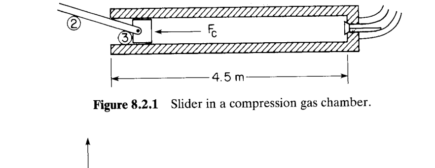
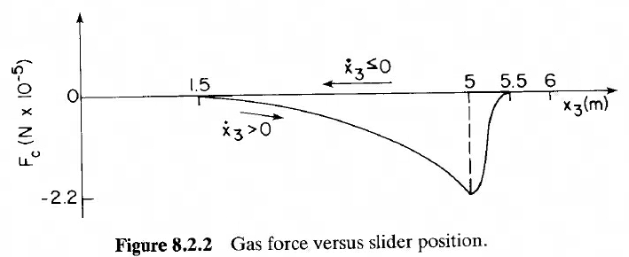
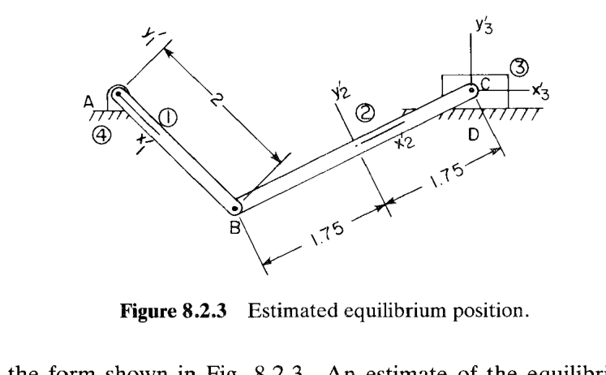
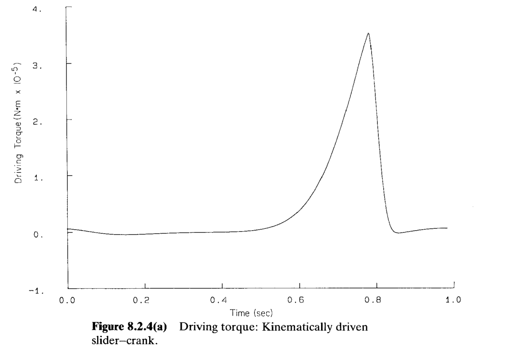
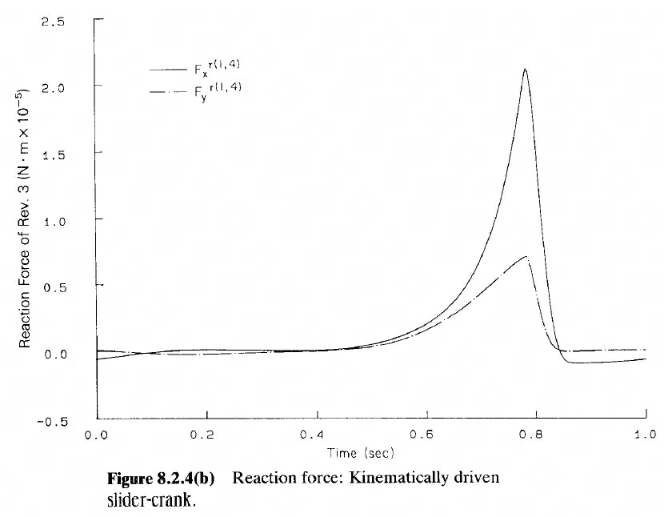
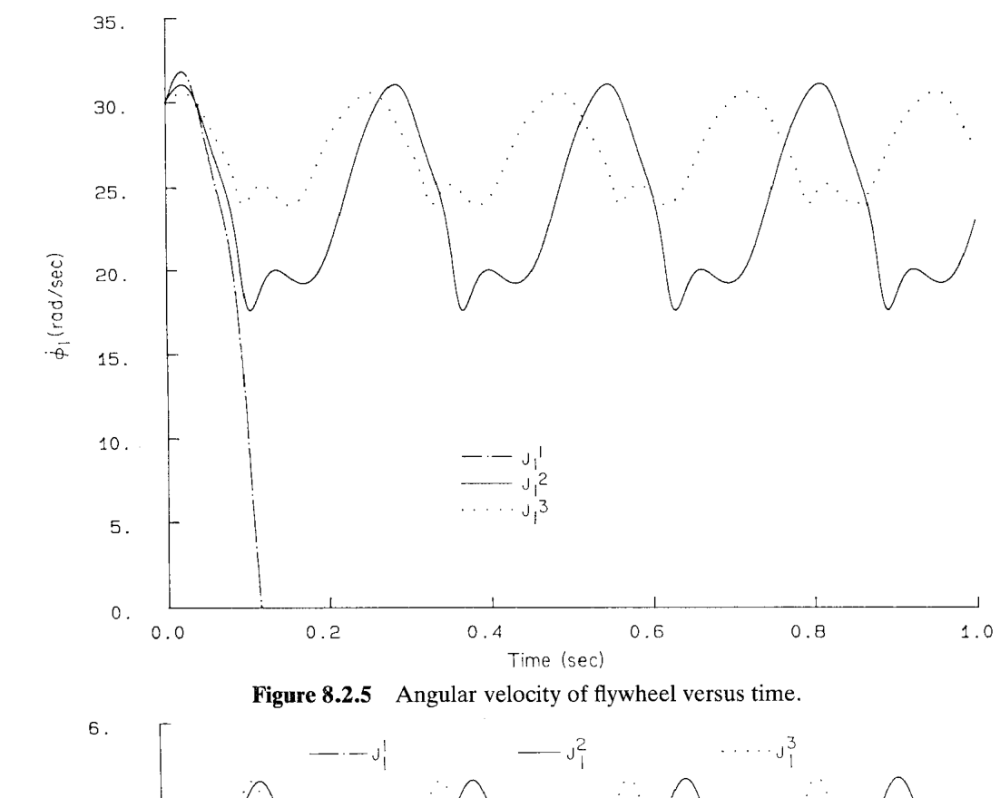
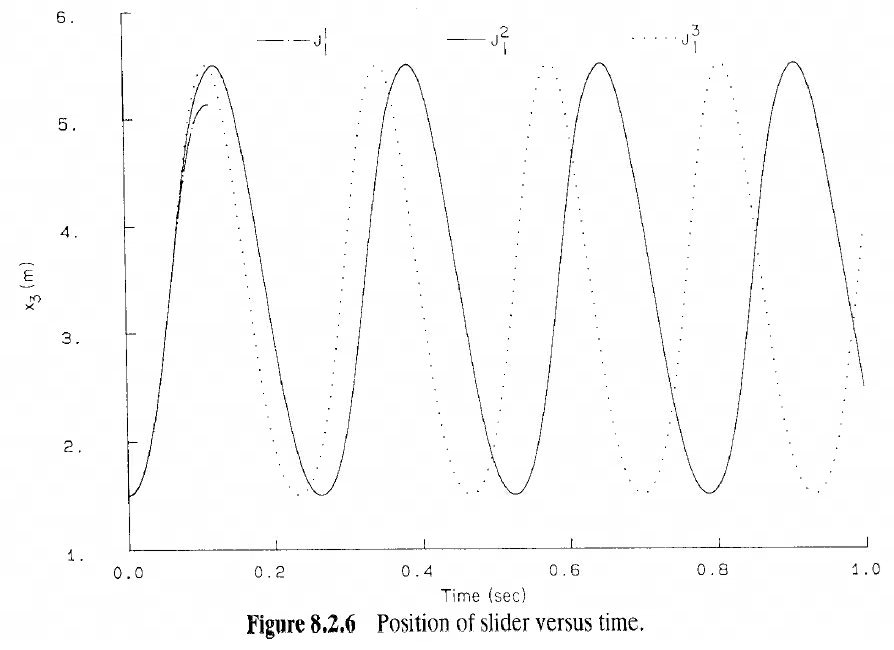
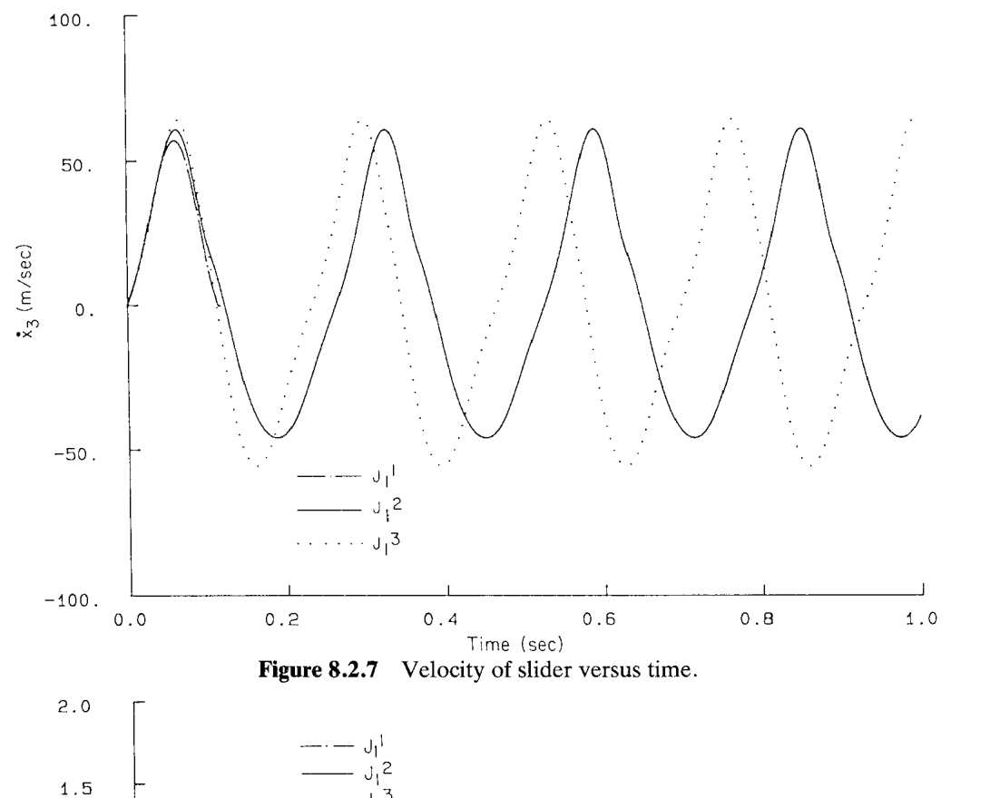
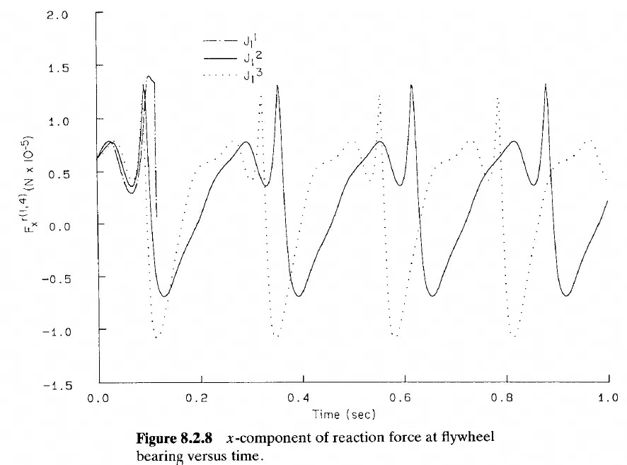

# 8.2 曲柄滑块机构的动力学分析（Dynamic Analysis of a Slider-Crank Mechanism）

> 来源：*Computer Aided Kinematics and Dynamics of Mechanical Systems, Vol. 1*，第 8 章，8.2 节（书页 283–290）。
> 本节把 §8.1 提出的**三种分析模式**（平衡、逆动力学、正向动力学）第一次落到一个具体机构上——用作**压缩机（compressor）**的曲柄滑块（slider–crank）。本文以"文字讲解 + 数据/结果解读"组织；本节几乎没有推导，重点在**建模数据的组织、结果曲线的物理解释、以及一次能量守恒的定量估算**。

## 引言：本节要解决什么

第 5 章 §5.2.1 已经对这台曲柄滑块做过完整的运动学分析（构型、约束、雅可比、位置/速度/加速度）。本节**复用同一个运动学模型**，只补上动力学所需的两样东西——**惯性数据**和**作用力**——然后依次演示 §8.1 的三种分析：

1. **§8.2.1 建模**：接入 §5.2.1 的运动学模型 1，补惯性数据（Table 8.2.1），定义压缩气体力 $F_c$（Fig 8.2.2）。
2. **§8.2.2 平衡分析**：用 §6.5 总势能最小法，求"仅重力"和"重力+气体力"两种载荷下的平衡构型。
3. **§8.2.3 逆动力学分析**：给定曲柄匀速转动，反求驱动力矩与曲柄轴承反力（拉格朗日乘子，§6.6）。
4. **§8.2.4 正向动力学分析**：给定恒定驱动力矩，对 DAE 积分，研究**飞轮惯量（flywheel inertia）**对稳态运行的影响——这是全节的重头戏，含一个失速的能量分析。

## 8.2.1 动力学建模（Dynamic Modeling）

### 运动学基础与惯性数据

本节的曲柄滑块直接采用 §5.2.1 的**模型 1**：关节数据与 §5.2.1 相同，Tables 5.2.1、5.2.2 的尺寸以米（m）为单位。四个物体的质心（centroid）都取在 Fig 5.2.1 的随体参考系原点——这正是 §8.1 强调的**质心原点约定**，保证第 6 章的运动方程成立。地面体（body 4）的质量与惯量取单位值（1.0），因为它刚接在惯性参考系上，具体取值无关紧要。

四个物体的质量与极转动惯量（polar moment of inertia）见 **TABLE 8.2.1**：

| Body no. | 1（曲柄/飞轮） | 2（连杆） | 3（滑块） | 4（地面） |
|----------|--------------|----------|----------|----------|
| 质量 (kg) | 200.0 | 35.0 | 25.0 | 1.0 |
| 极转动惯量 (kg·m²) | 450.0 | 35.0 | 0.02 | 1.0 |

### 压缩机气体力

当曲柄滑块用作**压缩机**时，滑块（body 3）在压缩腔内往复。滑块向右移动时，压缩气体对它施加一个**阻力（resisting force）** $F_c$，该力随压缩加剧而增大，直到排气阀（exhaust valve）打开。

$F_c$ 是滑块位置与速度的函数。**仅在压缩冲程（compression stroke）期间作用**，即 $\dot{x}_3>0$：

$$
F_c=\begin{cases}
-\dfrac{282{,}857}{6-x_3}+62{,}857, & 1.5\le x_3\le 5 \\[8pt]
-110{,}000\,[\,1-\sin 2\pi(x_3-5.25)\,], & 5< x_3\le 5.5
\end{cases}
\tag{8.2.1}
$$

**曲线的物理读法**（Fig 8.2.2，纵轴单位 $\text{N}\times10^{-5}$，即以 $10^5$ N 为刻度）：
- $x_3$ 从 1.5 增大到 5 m 时，第一支 $-\dfrac{282{,}857}{6-x_3}+62{,}857$ 随 $x_3\to 6$ 而分母变小、负值急剧增大——阻力越压越大。
- $x_3=5$ m 时排气阀打开，进入第二支（$5<x_3\le5.5$），用一段正弦描述阀门开启后力的骤降与回落，最低达约 $-2.2\times10^5$ N。
- 当 $x_3=5$ m 阀开、且进入**进气冲程（intake stroke）** 时（$\dot{x}_3\le 0$），滑块上**无力**作用（$F_c=0$）。

即 $F_c$ 是一个**单向、依速度门控**的力：只在"向右压气"时存在，"向左吸气"时消失。这种非光滑力正是压缩机动力学的特征。

## 8.2.2 平衡分析（Equilibrium Analysis）

### 思路

平衡分析问：撤去驱动、只留指定外力，机构会静止在哪个构型？本小节做两组：**(a) 仅重力**、**(b) 重力 + 气体力**，都用 §6.5 的**总势能最小原理（principle of minimum total potential energy）** 求解。求解是数值迭代，需要一个**初始估计构型**作为输入。

### 初始估计构型

重力沿 $-y$ 方向。仅受重力时，平衡构型预期呈 Fig 8.2.3 的形状（曲柄下垂、连杆质心尽量低）。作为迭代输入的估计值见 **TABLE 8.2.2**。

**TABLE 8.2.2　估计的曲柄滑块平衡构型**

| Body no. | 1 | 2 | 3 | 4 |
|----------|-----|------|------|-----|
| $x$ | 0.0 | 1.20 | 2.67 | 0.0 |
| $y$ | −0.0 | −1.0 | 0.0 | 0.0 |
| $\phi$ | 4.6 | 0.6 | 0.0 | 0.0 |

### (a) 仅重力下的平衡

用 §6.5 总势能最小法求解，结果见 **TABLE 8.2.3**。关键观察：**连杆（body 2）的质心尽可能低**（$y_2=-1.0$），这正是"最小化重力势能"的直接体现——保守系统的稳定平衡对应总势能的严格局部极小。

**TABLE 8.2.3　重力作用下的曲柄滑块平衡构型**

| Body no. | 1 | 2 | 3 | 4 |
|----------|------|--------|-------|-----|
| $x$ | 0.0 | 1.4635 | 2.900 | 0.0 |
| $y$ | 0.0 | −1.0 | 0.0 | 0.0 |
| $\phi$ | 4.726 | 0.6082 | 0.0 | 0.0 |

### (b) 重力 + 气体力下的平衡

若气体力 $F_c$ 沿 $-x$ 方向作用在 body 3 上，再次用总势能最小法求解，结果见 **TABLE 8.2.4**。

**TABLE 8.2.4　重力与气体力作用下的曲柄滑块平衡构型**

| Body no. | 1 | 2 | 3 | 4 |
|----------|--------|---------|--------|-----|
| $x$ | 0.0 | 1.2170 | 2.6575 | 0.0 |
| $y$ | 0.0 | −0.9937 | 0.0 | 0.0 |
| $\phi$ | 4.6004 | 0.6039 | 0.0 | 0.0 |

**对比解读**：与仅重力的 Table 8.2.3 相比，body 3 的位置从 $x_3=2.900$ **左移到** $x_3=2.6575$——因为沿 $-x$ 的气体阻力把滑块向左推；body 1、2 的位置和转角也相应改变。这印证了外力方向对平衡构型的直接影响。

| 载荷条件 | body 3 位置 $x_3$ (m) | 物理解释 |
|---------|----------------------|--------|
| 仅重力 | 2.900 | 连杆质心尽量低（重力势能最小） |
| 重力 + 气体力 | 2.6575 | 沿 $-x$ 的气体力把滑块左推 |

## 8.2.3 逆动力学分析（Inverse Dynamic Analysis）

### 思路

逆动力学问：若强行让机构按某条**运动学驱动的（kinematically driven）**轨迹运动，需要多大的驱动力矩、各关节要承受多大反力？运动被驱动约束**完全定死**，因此加速度已知，运动方程反过来解出拉格朗日乘子，再由 §6.6 折算成力/力矩。

### 设置与结果

采用 §5.2.3 规定的运动学驱动条件（曲柄匀速转动），初始构型取 Table 5.2.6 的装配位置。**本分析忽略重力**。要计算两样东西：

1. 维持匀角速度所需的**驱动力矩（driving torque）**；
2. 曲柄轴承处（Fig 8.2.3 的 A 点，即 body 1 与 body 4 之间的转动关节）的**反力（reaction force）**。

二者都用 §6.6 的拉格朗日乘子（Lagrange multiplier）方法算出，结果画在 Fig 8.2.4。

**图 8.2.4(a)（驱动力矩）**：力矩在大部分时间接近平缓，但在 $t\approx0.8$ s 附近出现一个尖峰（约 $3.5\times10^5$ N·m）——对应滑块进入压缩腔末段、气体阻力 $F_c$ 急剧增大的时刻。驱动系统必须在此瞬间提供大力矩才能维持匀速。

**图 8.2.4(b)（曲柄轴承反力）**：$F_x^{r(1,4)}$（实线）与 $F_y^{r(1,4)}$（点划线）同样在 $t\approx0.8$ s 出现峰值，$x$ 分量峰值（约 $2.1\times10^5$ N）明显大于 $y$ 分量（约 $0.7\times10^5$ N），因为气体力沿 $x$ 方向。这说明轴承选型必须按压缩末段的峰值反力来校核。上标 $r(1,4)$ 表示"body 1 相对 body 4 的转动关节反力"。

## 8.2.4 正向动力学分析（Dynamic Analysis）

### 思路与工况设置

正向动力学问：给定力，机构接下来怎么动？把混合 DAE 当初值问题积分即可。本小节以此研究一个真实工程问题——**飞轮惯量如何影响压缩机的稳态运行**。

工况设置：
- 重力沿 **$+x$ 方向**作用（这是本例的特定设定）；
- 运动从 $t=0$ 开始，初值 $\phi_1(0)=\pi$，$\dot{\phi}_1(0)=30$ rad/s；
- 对曲柄施加**恒定驱动力矩** $41{,}450$ N·m，同时 Fig 8.2.2 的气体力作用在滑块上。

**驱动力矩为何取 41,450？** 选它使得**一整圈驱动力矩做的功 = 一个循环压缩气体所耗的功**（即 Fig 8.2.2 曲线下的面积）。这样输入功与耗散功在一个周期内平衡，压缩机才能进入**稳态（steady-state）** 运行。

### 飞轮惯量参数研究

对曲柄（在本应用中充当**飞轮**）的极转动惯量取三个值，做三次仿真：

$$J_1^1=225\ \text{kg·m}^2,\qquad J_1^2=450\ \text{kg·m}^2,\qquad J_1^3=900\ \text{kg·m}^2$$

预期：**飞轮惯量越大，角速度波动越小**。Fig 8.2.5 证实了这一点。

**图 8.2.5（飞轮角速度）**：$J_1^2$（实线）与 $J_1^3$（点线）都进入周期性稳态，$J_1^3$ 的波动最小；而**最小惯量 $J_1^1$（点划线）在 $t\approx0.12$ s 处角速度直接跌到零**——压缩机**连一个循环都无法完成**，发生失速。

### 失速的能量分析（本节唯一的定量推导）

为什么最小飞轮会失速？作者给出一个漂亮的能量守恒论证。飞轮转过前**半圈**期间：

**所需的功**（压缩气体消耗）：

$$W_{\text{compress}} = 260{,}438\ \text{N·m}$$

**可提供的能量** = 飞轮初始动能 + 半圈内驱动力矩做的功。飞轮初始动能 $\tfrac12 J_1^1\dot{\phi}_1(0)^2$，半圈驱动力矩做功 $T\cdot\Delta\phi = 41{,}450\times\pi$：

$$
E_{\text{avail}}
=\frac12 J_1^1\,\dot{\phi}_1(0)^2 + T\cdot\pi
=\frac{225\times 30^2}{2} + \pi\times 41{,}450
$$

逐步算：

$$
\frac{225\times 900}{2}=\frac{202{,}500}{2}=101{,}250\ \text{N·m}
$$
$$
\pi\times 41{,}450 = 130{,}219\ \text{N·m}
$$
$$
E_{\text{avail}} = 101{,}250 + 130{,}219 = 231{,}469\ \text{N·m}
$$

比较：

$$
\boxed{E_{\text{avail}} = 231{,}469\ \text{N·m} \;<\; W_{\text{compress}} = 260{,}438\ \text{N·m}}
$$

能量不够——飞轮的动能储备加上半圈的输入功，仍不足以顶过压缩阻力，于是角速度被拖到零、机构卡死。**这正是飞轮的作用：用足够大的转动惯量储存动能，帮机构渡过高阻力的半个循环。** 两个较大的惯量 $J_1^2,J_1^3$ 储能充足，都能带压缩机走完整循环并持续周期运行。

### 稳态循环频率

从 Fig 8.2.5 读出两个成功工况的压缩循环频率：

| 飞轮惯量 | 每秒循环数 |
|---------|-----------|
| $J_1^2=450$ kg·m² | ≈ 3.7 cycles/s |
| $J_1^3=900$ kg·m² | ≈ 4.2 cycles/s |

且**最大惯量对应最小的角速度波动**——与预期一致。

### 滑块位置与速度

**图 8.2.6 / 8.2.7（滑块位置与速度）**：三种飞轮惯量下，滑块的**行程（stroke）完全相同**——因为行程由运动学约束决定，与惯量无关。但由于飞轮角速度不同，曲线之间存在**相位差（phase shift）**；Fig 8.2.7 还显示峰值滑块速度有轻微差异。

### 轴承反力

**图 8.2.8（飞轮轴承反力 x 分量）**：即 body 1 与 body 4 之间转动关节的反力 $F_x^{r(1,4)}$。**最大惯量的飞轮动作更剧烈，反力变化也略大**——如预期。这提示：加大飞轮虽稳住了角速度，却以略高的轴承载荷为代价，是一个工程权衡。

## 小结

§8.2 用一台压缩机把 §8.1 的三种分析模式走了一遍：

- **平衡分析**告诉我们外力方向如何移动静止构型（气体力把滑块左推 0.24 m）；
- **逆动力学分析**给出维持匀速所需的驱动力矩与轴承反力，二者都在压缩末段出现尖峰；
- **正向动力学分析**揭示飞轮惯量的核心作用——储存动能以渡过高阻力半循环。一个简洁的能量守恒估算（$231{,}469<260{,}438$ N·m）精确解释了最小飞轮为何失速。

贯穿全节的方法是 §8.1 反复强调的**参数研究（parameter study）**：系统改变一个设计量（这里是飞轮惯量），观察对稳态频率、角速度波动、相位、轴承载荷的影响，从而建立对机械动力学的定性直觉。这些反直觉的对比（如飞轮惯量↑→循环频率↑）将在 §8.3 的牛头刨床上得到进一步呼应与反转。
