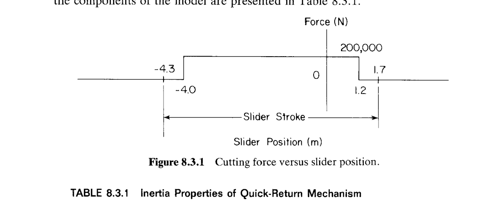
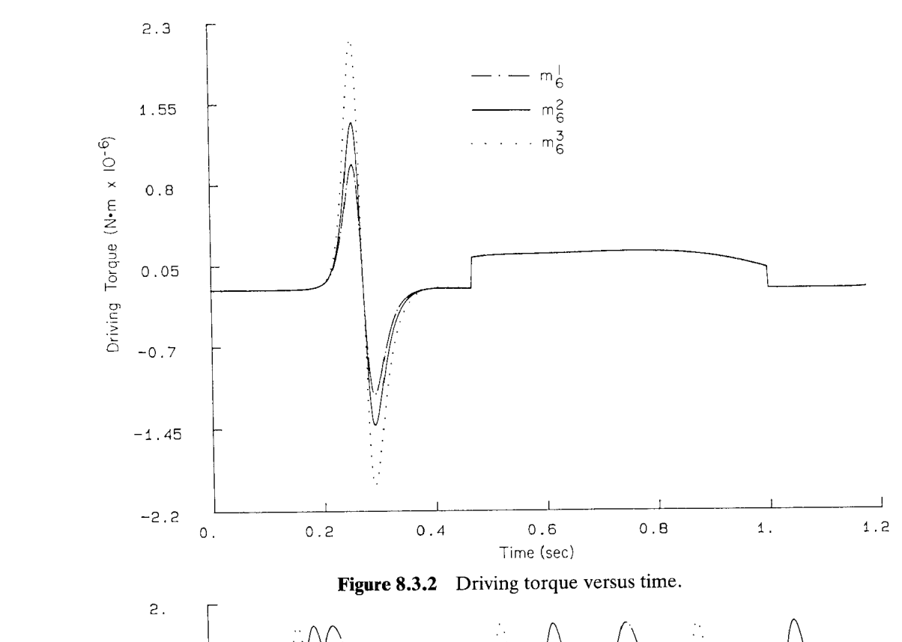
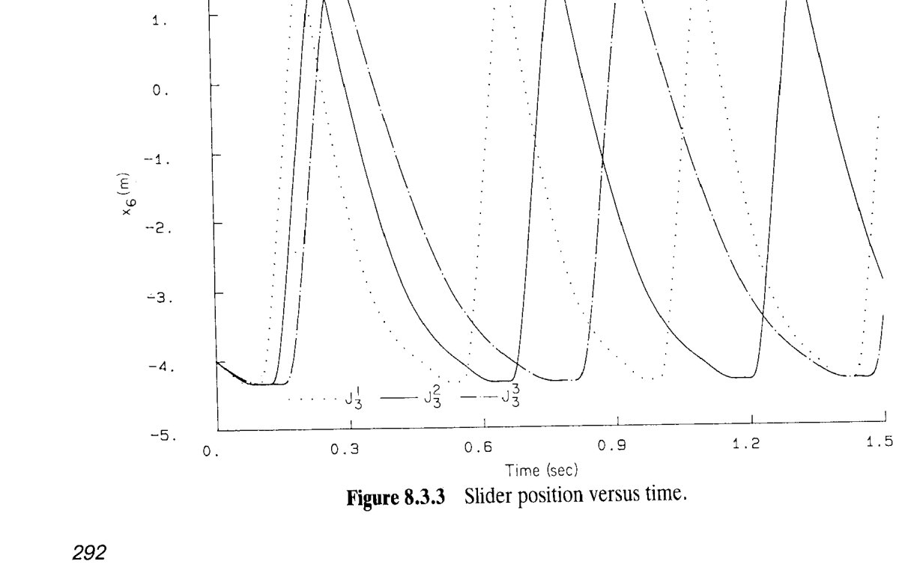
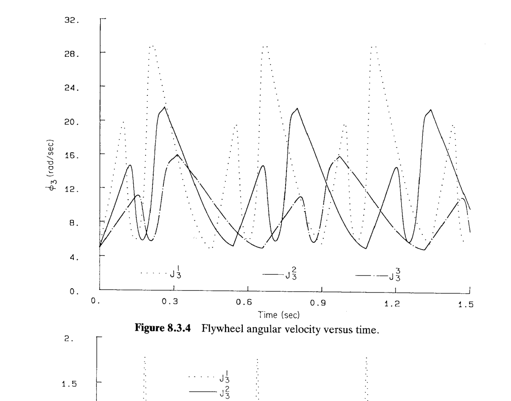
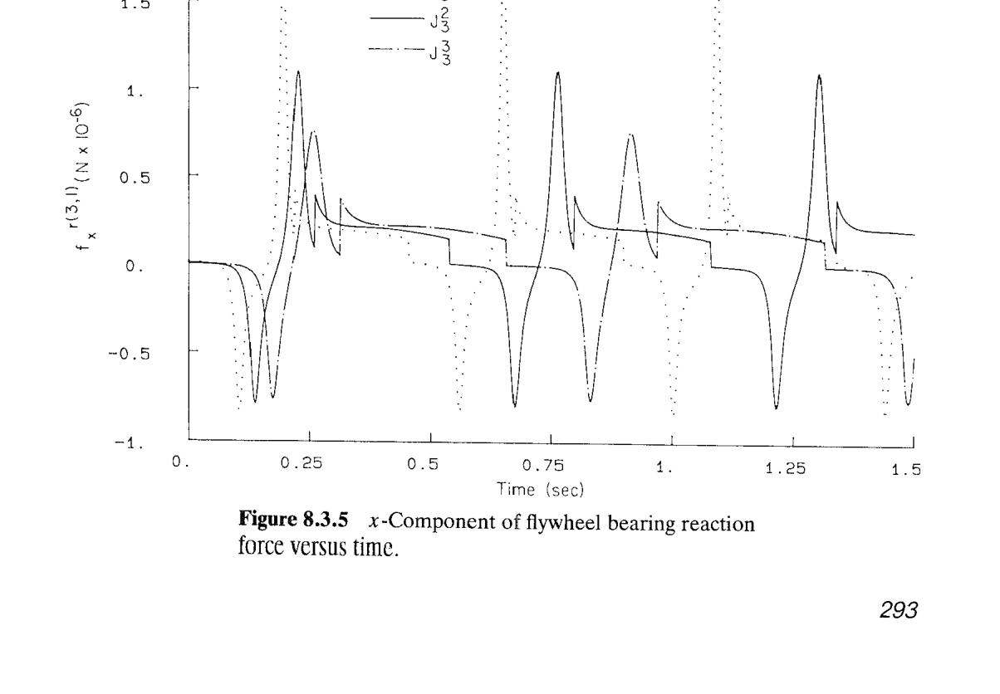

# 8.3 快回机构的动力学分析（Dynamic Analysis of a Quick-Return Mechanism）

> 来源：*Computer Aided Kinematics and Dynamics of Mechanical Systems, Vol. 1*，第 8 章，8.3 节（书页 290–294）。
> 继 §8.2 的曲柄滑块压缩机之后，本节把 §8.1 的**三种分析模式**（平衡、逆动力学、正向动力学）落到第二个具体机构——用作**牛头刨床（shaper）**的**快回机构（quick-return mechanism）**上。本节几乎无推导，重点在**建模数据的组织、切削力的定义、结果曲线的物理解读，以及一次由能量守恒定出驱动力矩的定量估算**。全节最有意思的结论是：飞轮惯量对循环速率的影响方向与 §8.2 的压缩机**恰好相反**。

## 引言：本节要解决什么

第 5 章 §5.4.1 已对这台快回机构做过完整运动学分析（构型、约束、雅可比、位置/速度/加速度）。本节**复用同一个运动学模型（模型 1）**，补上动力学所需的两样东西——**惯性数据**与**作用力（切削力）**——再依次演示 §8.1 的三种分析：

1. **§8.3.1 建模**：接入 §5.4.1 的运动学模型 1（Fig 5.4.1），在驱动杆（body 3）上加一个逆时针（counterclockwise）力矩；定义刀具-工件间的切削力（cutting force，Fig 8.3.1）；给出惯性数据（Table 8.3.1）。
2. **§8.3.2 平衡分析**：只留重力，用 §5.4.5 的估计构型迭代，求平衡构型（Table 8.3.2）。
3. **§8.3.3 逆动力学分析**：给定飞轮匀速转动 $\dot\phi_3=2\pi\ \text{rad/s}$，反求维持该转动所需的驱动力矩，考察三种滑块质量 $m_6$ 的影响（Fig 8.3.2）。
4. **§8.3.4 正向动力学分析**：给定恒定驱动力矩 $T_3$（由能量守恒定出），对 DAE 积分，研究**飞轮极转动惯量（flywheel polar moment of inertia）**对稳态运行的影响（Figs 8.3.3–8.3.5）——本节重头戏。

牛头刨床是快回机构的典型金属切削应用：工作行程（切削）慢而有力，回程（无切削）快，故名"快回"（见 Fig 1.1.8）。

## 8.3.1 动力学建模（Dynamic Modeling）

### 思路

建模只需在既有运动学模型上补两件事：**外力如何加、惯性如何取**。驱动来自 body 3 上的逆时针力矩；负载来自刀具与工件之间的切削力，它是**单向、依速度门控**的——只在切削行程（cutting stroke）中出现。

### 运动学基础与外力约定

采用 §5.4.1 的**模型 1**，机构见 Fig 5.4.1。在**驱动杆 body 3** 上施加一个**逆时针力矩**作为动力输入（body 3 即曲柄/飞轮所在的驱动连杆）。

刀具与工件之间为去除材料所需的力，作为**滑块位置 $x_6$ 的函数**给出（Fig 8.3.1）。关键是它的**方向门控**：

- **切削行程**：$\dot x_6<0$（滑块向 $-x$ 方向运动）时，切削力作用；
- **回程**：$\dot x_6>0$ 时，切削力为零。

**曲线的物理读法**：切削力近似为一个**矩形阶跃**，幅值 $200{,}000\ \text{N}$。它在滑块从 $x_6=1.2\ \text{m}$（右端）向 $x_6=-4.0\ \text{m}$（左端）的切削行程中保持恒定（图中标出的 $-4.3$、$1.7$ 为阶跃边缘位置，$-4.0$、$1.2$ 为标注的行程端点）。滑块行程（slider stroke）长度约

$$
\Delta x_6 = 1.2-(-4.0)=5.2\ \text{m}.
$$

这一恒力-恒行程的读数，正是 §8.3.4 里能量估算的输入（见下）。

### 惯性数据

六个物体的质量与转动惯量见 **TABLE 8.3.1**：

| Body no. | 1 | 2 | 3（驱动杆/飞轮） | 4 | 5 | 6（滑块） |
|----------|-----|-------|--------|------|------|------|
| 质量 (kg) | 1.0 | 100.0 | 1000.0 | 5.0 | 30.0 | 50.0 |
| 转动惯量 (kg·m²) | 1.0 | 100.0 | 2000.0 | 0.05 | 10.0 | 1.5 |

其中 body 3 是驱动杆兼**飞轮**，质量与转动惯量最大（$1000\ \text{kg}$、$2000\ \text{kg·m}^2$）；body 6 是滑块（刀架）。

## 8.3.2 平衡分析（Equilibrium Analysis）

### 思路

平衡分析问：撤去驱动、只留重力，机构静止在哪个构型？重力沿 $-y$ 方向。凭直觉，body 2 会从 Fig 5.4.1 所示位置**顺时针**转一些（趋向水平），body 3 的朝向落在第四象限。数值迭代需要一个**初始估计构型**，此处取 §5.4.5 的 Table 5.4.5。

### 结果

只在重力载荷下求得的平衡构型见 **TABLE 8.3.2**：

| Body no. | 1 | 2 | 3 | 4 | 5 | 6 |
|----------|-----|--------|---------|---------|---------|--------|
| $x$ | 0.0 | 1.4998 | 0.0 | 0.97196 | 2.3329 | 1.6663 |
| $y$ | 0.0 | 1.3232 | 2.0 | 0.85750 | 3.3232 | 4.0 |
| $\phi$ | 0.0 | 0.72292 | $-0.86588$ | 0.72292 | $-0.79302$ | 0.0 |

结果与直觉一致：body 3 的转角 $\phi_3=-0.86588\ \text{rad}$ 落在**第四象限**，body 2 顺时针转向水平。

## 8.3.3 逆动力学分析（Inverse Dynamic Analysis）

### 思路

逆动力学把运动**完全定死**（由运动学驱动约束给定飞轮匀速转动），反过来求**维持这一运动所需的驱动力矩**——即 §6.4／§6.6 里的拉格朗日乘子（Lagrange multiplier）解。

### 设置与结果

给定曲柄（飞轮）**匀速转动**

$$
\dot\phi_3 = 2\pi\ \text{rad/s}.
$$

仿真**紧接切削行程之后**起算，即从滑块位置 $x_6=-4.0\ \text{m}$（切削行程左端）开始。分别取三种滑块质量做三次仿真：

$$
m_6^1=25\ \text{kg},\qquad m_6^2=50\ \text{kg},\qquad m_6^3=100\ \text{kg}.
$$

维持指定飞轮角速度所需的驱动力矩见 **Fig 8.3.2**。

**曲线读法**（纵轴单位 $\text{N·m}\times10^{-6}$，即以 $10^6\ \text{N·m}$ 为刻度）：驱动力矩**唯一显著的波动**出现在**切削行程之前那一小段**——此时滑块速度要从负翻转为正（即滑块行程的**左端极点**处），机构要在极短时间内改变滑块运动方向，需要一个先正后负的大力矩尖峰。滑块质量越大（$m_6^3=100\ \text{kg}$，点线），尖峰越高，符合"改变更大动量需要更大力矩"的直觉。其余时段力矩平缓。

## 8.3.4 正向动力学分析（Dynamic Analysis）

### 思路

正向动力学**反过来**：给定恒定驱动力矩，对混合 DAE 积分，看机构如何随时间运动。核心考察量是**飞轮极转动惯量**对**稳态循环速率**和**角速度波动**的影响。恒定力矩的取值不是随便定的，而是由**一个运转周期内的能量守恒**定出。

### 关键推导：由能量守恒定出驱动力矩

设定：滑块质量 $m_6=50\ \text{kg}$，飞轮上施加**恒定驱动力矩** $T_3$，飞轮极转动惯量取三档

$$
J_3^1=1000\ \text{kg·m}^2,\qquad J_3^2=2000\ \text{kg·m}^2,\qquad J_3^3=4000\ \text{kg·m}^2.
$$

$T_3$ 的选法：使飞轮转一整圈（$\phi_3$ 增加 $2\pi$）时驱动力矩做的功，恰好等于切削工件所消耗的功。

**（1）一周期驱动功。** 恒定力矩 $T_3$ 在飞轮转过 $2\pi$ 时做功

$$
W_{\text{drive}}=\int_0^{2\pi}T_3\,\mathrm d\phi_3=T_3\int_0^{2\pi}\mathrm d\phi_3=2\pi\,T_3.
$$

**（2）一周期切削功。** 等于 Fig 8.3.1 曲线下的面积。切削力为恒值 $F_c=200{,}000\ \text{N}$，作用于长度 $\Delta x_6=5.2\ \text{m}$ 的切削行程，故

$$
W_{\text{cut}}=F_c\,\Delta x_6=200{,}000\times 5.2=1{,}040{,}000\ \text{N·m}=10.4\times10^{5}\ \text{N·m}.
$$

**（3）能量守恒定 $T_3$。** 令 $W_{\text{drive}}=W_{\text{cut}}$：

$$
2\pi\,T_3 = 10.4\times10^{5}\ \text{N·m}
\;\Longrightarrow\;
T_3=\frac{10.4\times10^{5}}{2\pi}
=\frac{1{,}040{,}000}{6.28319}
\approx 165{,}521\ \text{N·m}.
$$

$$
\boxed{\,T_3\approx 165{,}521\ \text{N·m},\qquad 2\pi T_3 = W_{\text{cut}}=10.4\times10^5\ \text{N·m}\,}
$$

物理意义：这样选力矩，**一个循环内输入功恰好抵消切削耗散功**，机构才能进入**稳态周期运行**（steady-state motion）而不会持续加速或减速——这与 §8.2 压缩机里"选驱动力矩使输入功=耗散功"是同一手法。

### 结果解读

对三档飞轮惯量各积分一次，得滑块位置 **Fig 8.3.3** 与飞轮角速度 **Fig 8.3.4**。

**读法**：

- **角速度波动**（Fig 8.3.4）：惯量最大者 $J_3^3=4000$ 波动最小——飞轮越重，储能越多，越能平抑半周期高阻力带来的转速起伏。这与飞轮的本职相符。
- **滑块行程**（Fig 8.3.3）：三档的滑块行程（stroke）相等，但因**平均角速度不同**而出现**相位差（phase change）**。
- **循环速率（cyclic rate）**：牛头刨床用 $J_3^1,J_3^2,J_3^3$ 时分别约为 $2.2,\ 1.8,\ 1.5\ \text{cycles/s}$。

> **与 §8.2 压缩机的关键对比**：这里**惯量最大者循环速率最低**（$J_3^3\to1.5$ cycles/s），与 §8.2 压缩机中"惯量最大者循环速率反而最高"的行为**恰好相反**。原因在于两台机器的阻力-驱动配合方式不同：本例大惯量在渡过切削半周期时被"拖慢"更多，平均转速被压低。这提醒我们：飞轮惯量对循环速率的影响方向**依机构与载荷而定**，不能想当然。

### 轴承反力

最后，飞轮与地面之间（body 3 与 body 1 的转动关节，即飞轮轴承）的反力 $x$ 分量随时间的曲线见 **Fig 8.3.5**（记号 $f_x^{r(3,1)}$，纵轴单位 $\text{N}\times10^{-6}$）。

**读法**：本例中**反力波动最大者出现在惯量最小的飞轮**（$J_3^1$，点线尖峰最高）——又与 §8.2 压缩机"惯量最大者反力波动最大"相反。这再次说明结论随机构而变；轴承反力由 §6.6 的约束反力公式（打断关节 $k$、以拉格朗日乘子表达）给出。

---

## 小结

| 分析模式 | 输入 | 输出 | 关键图/表 |
|----------|------|------|-----------|
| 建模 (§8.3.1) | §5.4.1 模型 1 + 切削力 + 惯性 | 完整动力学模型 | Fig 8.3.1, Table 8.3.1 |
| 平衡 (§8.3.2) | 仅重力 | 静止平衡构型 | Table 8.3.2 |
| 逆动力学 (§8.3.3) | 匀速 $\dot\phi_3=2\pi$ | 驱动力矩（三档 $m_6$） | Fig 8.3.2 |
| 正向动力学 (§8.3.4) | 恒力矩 $T_3\approx165{,}521$ N·m | 运动、转速、轴承反力（三档 $J_3$） | Figs 8.3.3–8.3.5 |

**一句话记忆**：快回机构里，**飞轮越重 → 转速波动越小、但循环速率越低、轴承反力波动越小**，方向与压缩机（§8.2）全部相反——飞轮的效果必须结合具体机构判断。
