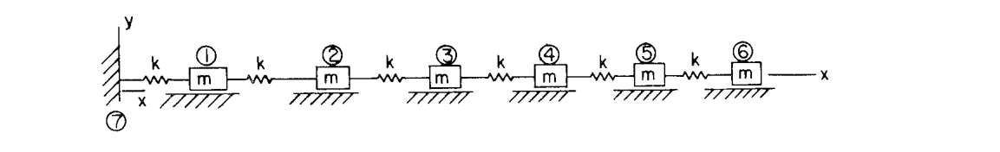
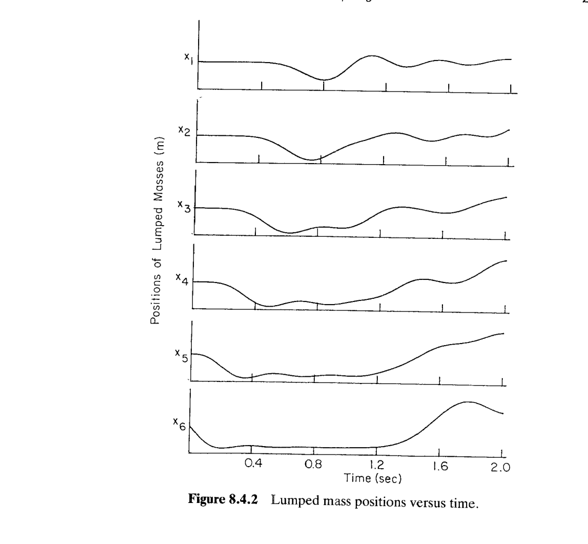
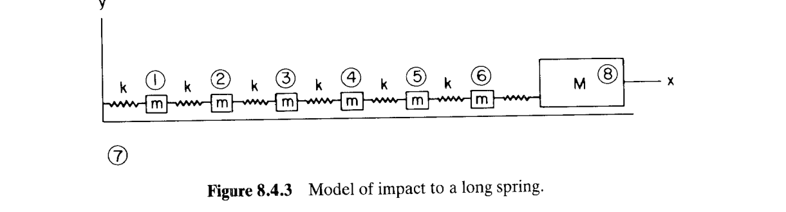
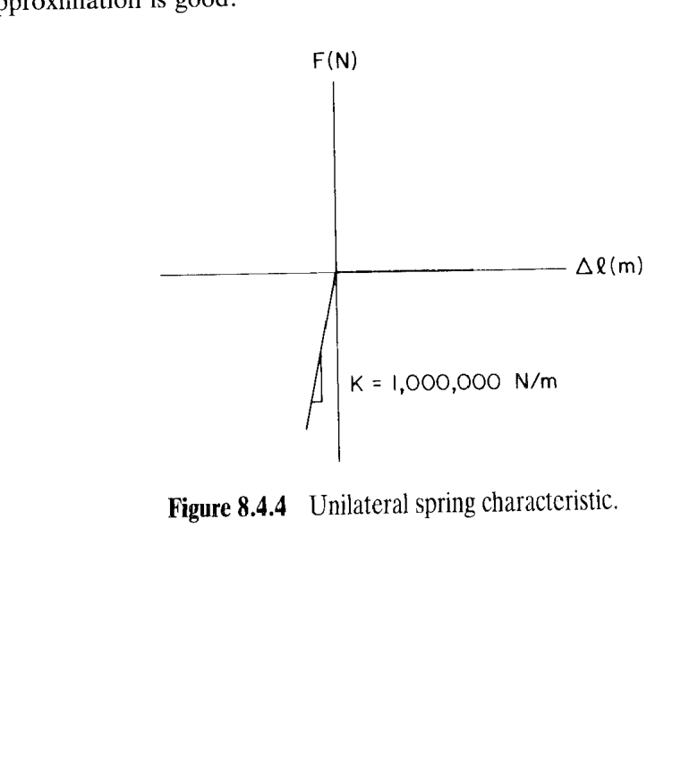
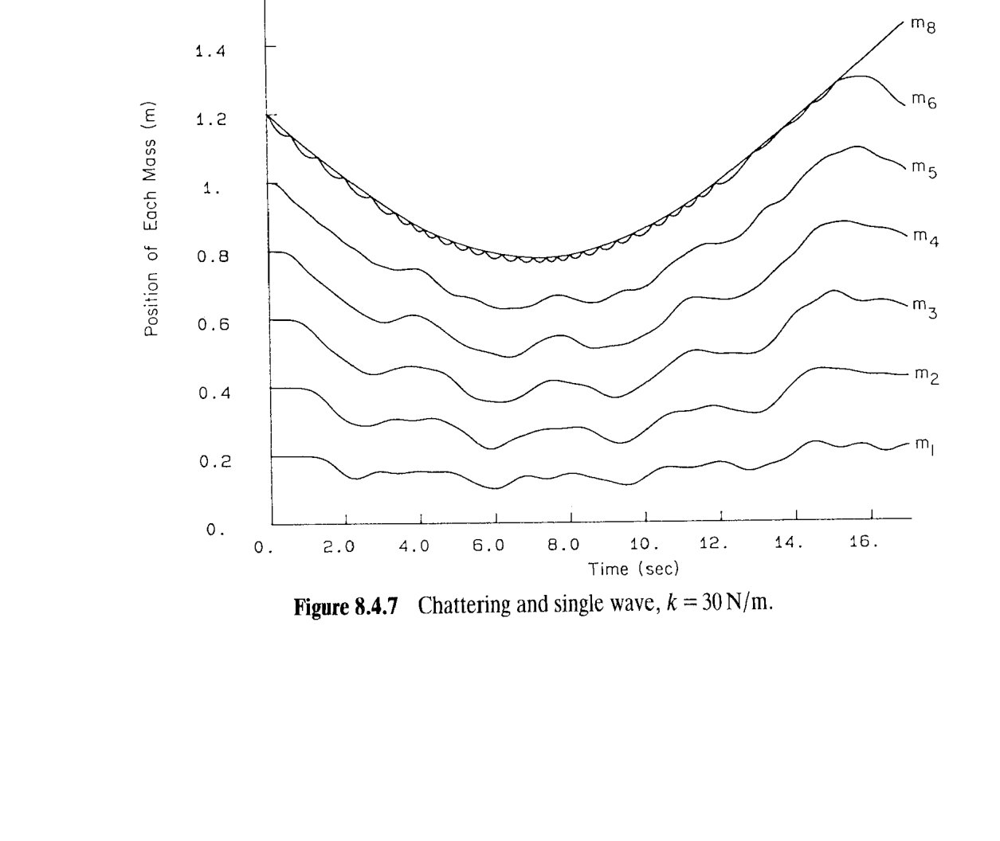
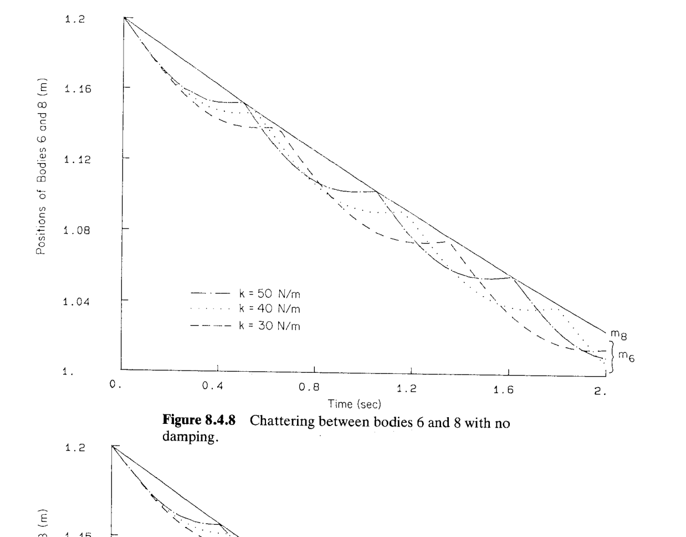
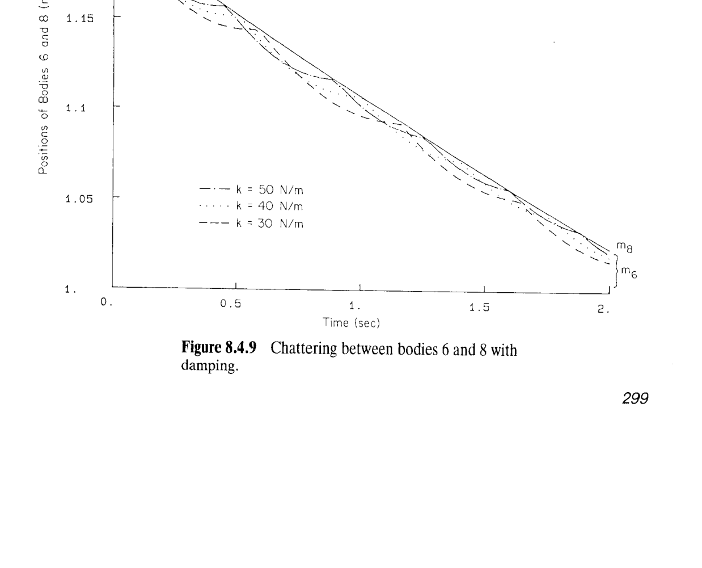

# 8.4 螺旋弹簧的动力学分析（Dynamic Analysis of a Coil Spring）

> 来源：*Computer Aided Kinematics and Dynamics of Mechanical Systems, Vol. 1*，第 8 章，8.4 节（书页 294–300）。
> 继 §8.2 压缩机、§8.3 快回机构之后，本节把动力学分析用到一个**分布质量的连续体**——一根较长的**螺旋弹簧（coil spring）**上。核心手法是**集中质量建模（lumped mass model）**：把连续弹簧离散成"质点 + 小弹簧"链，从而用平面动力学的常规工具捕捉**行波（surge wave）**、**冲击（impact）**与**颤振（chattering）**等波动现象。本节几乎无长推导，唯一的解析计算是 §8.4.2 用**能量守恒**估算重物最大位移；其余是建模约定与结果曲线的物理解读。

## 引言：本节要解决什么

螺旋弹簧常用来**吸收（arrest）运动物体的动能并把它推回原位**（如缓冲器、气门弹簧的回位弹簧）。真实弹簧的质量沿长度**连续分布**，严格分析要用连续介质（波动方程）。本节退而求其次，用一个**足够好的离散模型**：把弹簧沿长度均分成若干段，每段的质量效应用一个**集中质量 $m$** 代替，相邻质量之间用刚度 $k$ 的小弹簧连接（Fig 8.4.1）。这样连续弹簧就变成了第 3–7 章能直接处理的**多体平面系统**。

本节分两个算例：

1. **§8.4.1 行波（Surge Waves）**：给链条末端一个初速度，观察扰动如何沿弹簧**传播并在固定端反射**——即弹簧内的"喘振/行波"现象。
2. **§8.4.2 冲击与颤振（Impact and Chattering）**：一个重物撞上弹簧右端，用**单侧弹簧（unilateral spring）**模拟"只推不拉"的接触，研究冲击后重物与弹簧的**高频反复接触（chattering）**、**分离时刻/位置**，以及加**单侧阻尼（unilateral damper）**的效果。

贯穿全节的物理主线是：**即使是很粗糙的集中质量模型，也能定性重现弹簧的波动本质**（传播、反射、颤振）；质量分得越细，越逼近真实波动。

## 8.4.1 行波（Surge Waves）

### 思路

要"看见"弹簧里的波，就得**制造一个局部扰动再放它跑**。做法是：让最右端的质量（body 6）获得一个沿 $-x$ 方向的初速度（相当于被别的物体撞了一下），其余质量初始静止，然后看这个扰动如何一节一节往左传、传到固定端（body 7，即地面）再反射回来。

### 集中质量模型的构造

把弹簧均分成 6 段，得到 6 个集中质量 body 1–6，每个质量 $m$，相邻质量间及左端到地面之间都是刚度 $k$ 的小弹簧；最左端固定在地面 body 7 上（Fig 8.4.1）。

**运动学约定**：给每个质量与地面（body 7）之间加一个**移动关节（translational joint）**，使各质量只能沿 $x$ 方向平动；每根小弹簧连接在它两端物体的**质心**上。于是系统是一维的质量-弹簧链。

**参数与平衡位置**：取

$$
m = 2.5\ \text{kg},\qquad k = 200\ \text{N/m},\qquad \ell_0 = 0.2\ \text{m}\ (\text{自由长}),
$$

其中 $\ell_0$ 是每根小弹簧的自由长度。链条**无载静止**时每根小弹簧都处于自由长，故第 $i$ 个质量的平衡位置为把 $i$ 段自由长依次叠加：

$$
\boxed{\,x_i = i\times\ell_0 = 0.2\,i\ \text{m}\,},\qquad i=1,\dots,6.
$$

即 $x_1=0.2,\ x_2=0.4,\dots,x_6=1.2\ \text{m}$。（这个 $x_6=1.2\ \text{m}$ 的平衡位置在 §8.4.2 里还会作为"应当分离处"的参照。）

**为何重力不进方程**：重力沿 $-y$ 方向，而移动关节把运动限制在 $x$ 方向，重力与运动方向正交、在运动上不做功，故对本问题的运动**无影响**——这正是把弹簧摆平了放、让位移沿水平方向的建模好处。

### 初始条件与结果

初始时 body 1–5 速度为零，仅给 body 6 一个负向初速：

$$
\dot x_6(0) = -0.1\ \text{m/s},\qquad \dot x_1(0)=\dots=\dot x_5(0)=0.
$$

这模拟外来物体撞击弹簧自由端。各质量位置随时间的数值结果见 Fig 8.4.2。

**曲线读法**：从上到下依次是 $x_1$（最靠固定端）到 $x_6$（自由端）。扰动先出现在 $x_6$（body 6 立即被推向 $-x$，曲线先下凹），随后 $x_5,x_4,\dots$ 依次滞后地被拉动——**扰动像一列波一样自右向左传播**；到达固定端后**反射**回来，使各质量出现二次起伏。可见：

- **波的传播**：各条曲线的"谷"在时间上依次错开，正是有限传播速度的表现；
- **端部反射**：固定端（body 7 一侧）把波弹回，$x_1$–$x_2$ 的后续起伏即反射波所致。

书中强调：**即便这样一个粗糙模型**，也已经把弹簧中波动传播、含左端反射特性都定性抓住了；若用更多质量离散，会更接近真实弹簧的行波行为。

## 8.4.2 冲击与颤振（Impact and Chattering）

### 思路

第二个算例把"被撞"这件事显式建模：一个**重物 $M$（body 8）**从右向左运动，撞上弹簧的自由端（body 6）（Fig 8.4.3）。难点在于**接触只能"推"不能"拉"**——两体接触时弹簧压缩产生极大斥力，一旦分开就无相互作用。这用一个**单侧弹簧（unilateral spring）**表达（Fig 8.4.4）：其力-变形关系是**双线性（bilinear）**的。

### 冲击模型与单侧弹簧

body 8 是质量 $M$ 的重块，紧贴在 body 6 右侧；两者之间放一个**接触弹簧**，其特性由 Fig 8.4.4 给出：

**图的物理读法**：横轴是接触弹簧的变形 $\Delta\ell$，纵轴是它产生的力 $F$。

- $\Delta\ell>0$（弹簧被"拉伸"，即两体分离、未接触）：$F=0$，不产生任何力；
- $\Delta\ell<0$（弹簧被"压缩"，即两体接触）：产生**极大的压缩斥力**，斜率（刚度）$K=1{,}000{,}000\ \text{N/m}$。

这个刚度比弹簧本身的 $k$（几十 N/m）大 4~5 个数量级，故接触极"硬"，几乎是刚性碰撞——正是"双线性、很刚"的含义。

**模型参数**：

$$
M = 100\ \text{kg},\quad m = 2.5\ \text{kg},\quad k = 50\ \text{N/m},\quad \dot x_8(0) = -0.1\ \text{m/s},
$$

其余物体 $t=0$ 时速度均为零。冲击**在仿真一开始即发生**（body 8 携初速撞上 body 6）。重物与各集中质量位置随时间的完整响应见 **Fig 8.4.5**（书页 297，见下方说明）。

> **关于 Fig 8.4.5 / Fig 8.4.6**：本套 PDF 扫描件缺失书页 297（该页装订错乱、被跳过，同时 301 页重复），故这两张图（$k=50$ 与 $k=40\ \text{N/m}$ 的全体质量位置曲线）无法裁剪嵌入。其定性形态与 $k=30$ 的 **Fig 8.4.7** 相同（见 §"颤振周期与刚度"），仅分离时刻不同。

### 关键推导：由能量守恒估算重物最大位移

**思路**：重物撞上弹簧后会把弹簧压到最深处再被弹回，最深处即重物位移最大 $\Delta x_8$。在这一"压到底"的瞬间，重物（近似）速度为零，**它的初始动能全部转化为弹簧储存的应变能**。把整根弹簧（6 段串联）等效成**一根弹簧**来估算，就得到 $\Delta x_8$。

**（1）串联等效刚度。** 6 根刚度均为 $k$ 的弹簧**串联（in series）**，等效刚度 $k_e$ 满足串联法则（各段受同一力、变形相加）：

$$
\frac{1}{k_e} = \sum_{i=1}^{6}\frac{1}{k} = \frac{6}{k}
\;\Longrightarrow\;
\boxed{\,k_e=\frac{k}{6}\,}.
$$

**（2）能量守恒方程。** 令重物初始动能等于等效弹簧被压缩 $\Delta x_8$ 时的应变能：

$$
\tfrac12 M(\dot x_8)^2 \;\approx\; \tfrac12 k_e(\Delta x_8)^2 .
\tag{8.4.？}
$$

（$\approx$ 而非 $=$：因为压到最深处时，弹簧内部的集中质量 body 1–5 其实仍在运动、仍带动能，见下文误差讨论。）

**（3）代入数值。** 用 $k_e=k/6=50/6$：

$$
\tfrac12(100)(-0.1)^2 \;\approx\; \tfrac12\!\left(\frac{50}{6}\right)(\Delta x_8)^2 .
$$

**（4）逐步解出 $\Delta x_8$。** 左端

$$
\tfrac12(100)(0.01) = 0.5\ \text{J};
$$

右端

$$
\tfrac12\cdot\frac{50}{6}\,(\Delta x_8)^2 = \frac{25}{6}(\Delta x_8)^2 .
$$

令两端相等：

$$
\frac{25}{6}(\Delta x_8)^2 = 0.5
\;\Longrightarrow\;
(\Delta x_8)^2 = \frac{0.5\times 6}{25} = \frac{3}{25}=0.12 .
$$

书中把常数并成 $6/50$ 写：由 $\tfrac12 M(\dot x_8)^2=\tfrac12(k/6)(\Delta x_8)^2$ 直接解

$$
(\Delta x_8)^2 = \frac{M(\dot x_8)^2}{k/6} = \frac{6M(\dot x_8)^2}{k}
= \frac{6\times100\times(0.1)^2}{50}=\frac{6}{50}=0.12,
$$

故

$$
\boxed{\,\Delta x_8 = \sqrt{6/50} = \sqrt{0.12} \approx 0.346\ \text{m}\,}.
$$

**（5）与仿真对比、误差来源。** 动力学仿真（Fig 8.4.5）给出的最大变形是 $\Delta x_8 = 0.327\ \text{m}$，比估算值略小。差别来自能量守恒里被忽略的一项：当 body 6 与 body 8 到达速度为零的最深处时，**弹簧内部的 body 1–5 仍在运动、仍持有动能**，因此并非全部初始动能都变成"等效单弹簧"的应变能。不过由于重物 $M=100\ \text{kg}$ 远重于集中质量 $m=2.5\ \text{kg}$（弹簧总质量 $6m=15\ \text{kg}$），这部分残余动能占比不大，故**估算与仿真吻合良好**。

### 分离时刻与"弹簧质量"的作用

**思路**：碰撞后重物被弹回、和弹簧一起向右运动，直到某一刻两者不再互推——即**分离（separation）**。若弹簧**无质量**，两者应恰好在静平衡位置 $x_6=1.2\ \text{m}$ 处分离（此处接触弹簧变形回到零）。但真实弹簧**有质量**，情况不同。

数值结果（$k=50\ \text{N/m}$）：body 6 与 body 8 最终在

$$
t \approx 11.8\ \text{s},\qquad x_6 = x_8 \approx 1.27\ \text{m}
$$

处分离。分离位置 $1.27\ \text{m}$ **超过**了静平衡位置 $1.2\ \text{m}$。原因：弹簧总质量 $6\times2.5 = 15\ \text{kg}$，当 $x_6$ 回到 $1.2\ \text{m}$ 时弹簧内部**仍有动能**，这份动能继续把 body 6 往外推，越过 $1.2\ \text{m}$ 才停止互推、发生分离。**这正是"弹簧有质量"区别于理想无质量弹簧的直接体现。**

### 颤振周期与刚度

**思路**：接触弹簧极刚且双线性，碰撞不是"一次干净的弹开"，而是两体在接触面附近**反复多次高频接触-分离**——即**颤振（chattering）**。改变弹簧刚度 $k$，考察颤振行为。

对 $k=40$ 与 $k=30\ \text{N/m}$ 各再仿真一次（Figs 8.4.6 和 8.4.7）：分离时刻分别**推迟到 $13.4$ 和 $15.3\ \text{s}$**，而分离位置基本不变（仍约 $1.27\ \text{m}$）。$k$ 越小、弹簧越软，系统越"慢"，故分离越晚。

**图 8.4.7 读法**：纵轴是各质量位置 $m_1,\dots,m_6$ 与重物 $m_8$。整体呈一个**大的单波（single wave）**——所有质量先被压向左（曲线下凹到约 $t=7\text{–}8\ \text{s}$ 谷底），再一起被弹回右侧。叠加在 $m_6/m_8$ 顶部那一串**密集小锯齿**就是颤振（重物与弹簧端反复接触），在 $\sim15.3\ \text{s}$ 处分离后 $m_8$ 直线上扬离开。

把颤振段放大到 $0\text{–}2\ \text{s}$ 的时间尺度，画出 body 6、body 8 的位置（$k=30,40,50$），见 Fig 8.4.8：

**图 8.4.8 读法**：三条线分别是 $k=50$（点划线）、$40$（点线）、$30$（虚线）。两体位置在一条缓降主线附近来回错开、反复接触分离，形成锯齿状颤振。**规律**：$k$ 越大，颤振**周期越短**（锯齿更密）。物理原因是——弹簧越硬，**波在弹簧中的传播速度越快**，来回一趟耗时更短，故颤振频率升高。

### 加单侧阻尼的效果

**思路**：颤振是不希望的高频冲击，工程上想抑制它。做法是在 body 6 与 body 8 之间再并上一个**单侧阻尼器（unilateral damper）**，逻辑与单侧弹簧（Fig 8.4.4）一致：**分离时（变形为正）不产生阻尼力；接触时（变形为负）产生阻尼力**

$$
F_d = 200\ \text{N·s/m}\times \dot\ell,
$$

即阻尼系数 $200\ \text{N·s/m}$ 乘以接触弹簧的变形速率 $\dot\ell$。加阻尼后 body 6、body 8 的位置见 Fig 8.4.9：

**图 8.4.9 读法**：与无阻尼的 Fig 8.4.8 相比，**颤振的相对位移与周期都减小**（锯齿被明显压平），说明单侧阻尼有效吸收了接触冲击能量。书中同时指出：**分离位置与分离时刻**与无阻尼情形**基本相同**（虽未另附图）——阻尼主要削弱高频颤振，而不改变大尺度的进-出节奏。

---

## 小结

| 算例 | 建模要点 | 关键现象 | 关键图 |
|------|----------|----------|--------|
| 行波 (§8.4.1) | 6 质量-弹簧链，末端给初速 $\dot x_6(0)=-0.1$ | 扰动沿链传播 + 固定端反射 | Fig 8.4.1, 8.4.2 |
| 冲击/颤振 (§8.4.2) | 重物 $M$ + 单侧弹簧（$K=10^6$，双线性） | 冲击、颤振、分离超过平衡位 | Fig 8.4.3–8.4.9 |

**核心量化结论**

- **等效刚度**：6 弹簧串联 $\Rightarrow k_e=k/6$。
- **重物最大位移**（能量守恒估算）：$\Delta x_8=\sqrt{6M(\dot x_8)^2/k}=\sqrt{6/50}\approx0.346\ \text{m}$，仿真 $0.327\ \text{m}$，差异来自弹簧内部质量的残余动能。
- **分离**：$k=50/40/30\ \text{N/m}$ 时分离时刻约 $11.8/13.4/15.3\ \text{s}$，位置均约 $1.27\ \text{m}$（>平衡位 $1.2\ \text{m}$，因弹簧有质量）。
- **颤振**：$k$ ↑ → 波速 ↑ → 颤振周期 ↓；加单侧阻尼可显著减小颤振位移与周期，且不改变分离时刻/位置。

**一句话记忆**：把连续弹簧"离散成质量-弹簧链"，粗糙模型也能重现行波、反射、冲击颤振；能量守恒 $\tfrac12 M\dot x^2\approx\tfrac12(k/6)\Delta x^2$ 一步给出重物最大压缩量。
