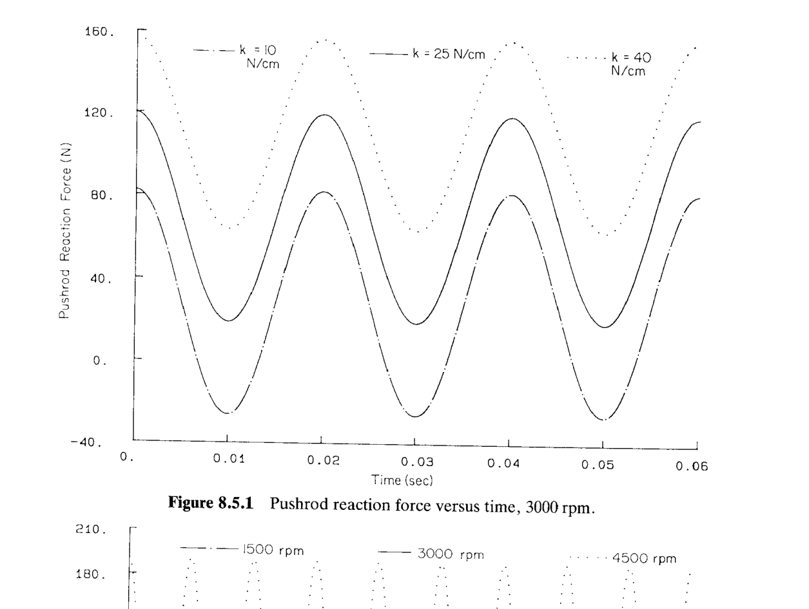
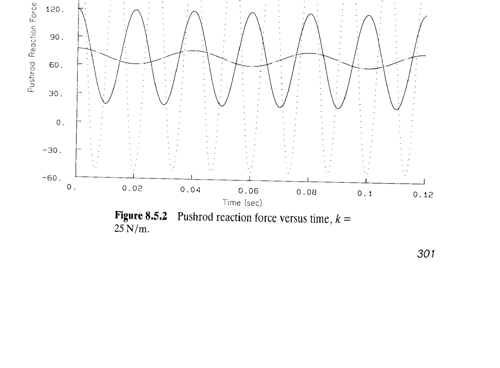

# 8.5 气门挺杆机构的动力学分析（Dynamic Analysis of a Valve-Lifter Mechanism）

> 来源：*Computer Aided Kinematics and Dynamics of Mechanical Systems, Vol. 1*，第 8 章，8.5 节（书页 300–301）。
> 这是第 8 章（也是 Part One 平面系统）的**收官算例**。它把 §5.6 的**凸轮驱动气门机构（cam-driven valve mechanism）**从纯运动学模型升级为动力学模型——补上一根**气门弹簧（valve spring）**，然后做**逆动力学分析（inverse dynamic analysis）**，目的很实际：**辅助气门弹簧的选型设计**。本节没有公式推导，核心是一个贯穿内燃机设计的判据——**凸轮与推杆之间的接触反力必须始终为正**，否则二者会分离、气门失控。围绕这个判据做了两组参数研究：变弹簧刚度、变转速。

## 引言：本节要解决什么

内燃机的气门由凸轮（cam）驱动：凸轮转动，通过推杆（pushrod）/挺杆（follower）顶开气门，靠**气门弹簧**把气门压回并保持推杆与凸轮**始终贴合**（Fig 1.1.1 的发动机）。

**为什么要装弹簧、又为什么要算它**：凸轮-平面挺杆这类关节只能"推"不能"拉"（凸轮表面只能顶挺杆，不能拽它）。在高速下，运动部件的**惯性力**可能大到把挺杆"甩"离凸轮表面——即**分离（separation）**，此后气门运动失控、发生撞击（气门漂浮/valve float）。气门弹簧的作用就是提供足够的回复力，把挺杆始终按在凸轮上。弹簧太软压不住会分离；太硬又增加摩擦磨损。因此需要**逆动力学分析**来定量选刚度。

本节的分析逻辑：

1. **建模**：沿用 §5.6 的运动学模型（Fig 5.6.1），补上气门弹簧与各体的惯性数据（Table 8.5.1）。
2. **判据**：用逆动力学求**推杆-凸轮接触反力**随时间的曲线；只要它在任一时刻**变负**，就说明真实机构此刻已分离——设计不可接受。
3. **两组参数研究**：固定转速改刚度（Fig 8.5.1）、固定刚度改转速（Fig 8.5.2），找出可接受的设计范围。

## 建模与惯性数据

采用 §5.6 的凸轮驱动气门机构（Fig 5.6.1），augment（补入）一根气门弹簧。做**逆动力学分析**：运动由凸轮转动这一运动学驱动约束完全定死，反求维持该运动所需的力——其中就包括我们关心的**推杆-凸轮接触反力**（由 §6.6 的 Lagrange 乘子给出）。

各构件的质量与转动惯量见 **TABLE 8.5.1**（注意单位是**克 g** 与 **g·cm²**，因气门部件很轻）：

| Body no. | 1 | 2 | 3 | 4 | 5 |
|----------|-----|------|--------|--------|-------|
| 质量 Mass (g) | 1.0 | 30.0 | 120.0 | 150.0 | 60.0 |
| 转动惯量 Moment of inertia (g·cm²) | 1.0 | 15.0 | 2250.0 | 1800.0 | 800.0 |

**标称凸轮转速**：$3000\ \text{rpm}$（revolutions per minute，转/分）。换算成角速度：

$$
\omega = 3000\ \frac{\text{rev}}{\text{min}}\times\frac{2\pi\ \text{rad}}{1\ \text{rev}}\times\frac{1\ \text{min}}{60\ \text{s}}
= \frac{3000\times 2\pi}{60}\ \text{rad/s}
= 100\pi\ \text{rad/s}.
$$

## 设计判据：为什么"负反力"= 分离失效

**思路**：这是本节唯一需要点明的"物理推导"。凸轮-平面挺杆关节（cam–flat-faced follower joint）在物理上是**单侧接触**——凸轮只能把挺杆往外顶（压），不能把它往回拉。因此真实反力 $N$ 恒有 $N\ge 0$。

但**模型里的关节约束是双侧的**（约束方程强制挺杆贴着凸轮面运动，既不许穿透也不许分离）。于是当高速惯性力要把挺杆甩离凸轮时，模型为了"强行维持接触"就会解出一个**朝里拉的反力**，即 $N<0$。这个负值在物理上不存在——它恰恰是"此刻真实机构已经分离"的**信号**。故判据为：

$$
\boxed{\ N(t)\ge 0\ \text{对所有 }t\quad\Longleftrightarrow\quad\text{设计可接受（凸轮-挺杆不分离）}\ }
$$

只要仿真出的推杆反力曲线在某时刻探到负值，该设计（该刚度/该转速组合）就不可接受。**弹簧越硬，回复力越大，越能把挺杆压在凸轮上，反力越不易变负**——这就是靠增大 $k$ 修正分离的道理。

## 参数研究一：变弹簧刚度（3000 rpm）

固定凸轮转速 $3000\ \text{rpm}$，取三种气门弹簧刚度

$$
k = 10,\ 25,\ 40\ \text{N/cm},
$$

每种情形弹簧自由长度均为 $9\ \text{cm}$。推杆-凸轮接触反力随时间的曲线见 Fig 8.5.1。

**曲线读法与结论**（纵轴为推杆反力 N，横轴时间 $0$–$0.06\ \text{s}$）：

- **$k=10\ \text{N/cm}$（点划线，最低一条）**：在约 $t=0.01\ \text{s}$（挺杆到达**最高点**、加速度反向、惯性力最大处）反力**探到负值**（谷底跌破 $0$ 到约 $-30\ \text{N}$）。这是运动部件惯性所致。真实的凸轮-平面挺杆此刻会**分离**；由于模型关节不允许分离，反力就以"负"的形式出现——**该设计不可接受**。
- **$k=25\ \text{N/cm}$（实线）与 $k=40\ \text{N/cm}$（点线，最高一条）**：反力全程为正，无负值。故这两个刚度在 $3000\ \text{rpm}$ 下**均可接受**。

可见增大刚度把整条反力曲线"抬高"，消除了负值区——正是设计判据的直接应用。

## 参数研究二：变转速（k = 25 N/cm）

固定标称刚度 $k=25\ \text{N/cm}$，取三种凸轮转速

$$
1500,\ 3000,\ 4500\ \text{rpm},
$$

推杆反力曲线见 Fig 8.5.2。

> **单位勘误**：Fig 8.5.2 的图注原文印作 "$k = 25\ \text{N/m}$"，与正文的 $k=25\ \text{N/cm}$ 不符，应以正文 **N/cm** 为准。

**曲线读法与结论**（横轴时间 $0$–$0.12\ \text{s}$）：

- **$1500\ \text{rpm}$（点划线，平缓一条）**：转速低、惯性力小，反力波动很小且全程为正 —— 可接受。
- **$3000\ \text{rpm}$（实线）**：反力波动加大，但仍全程为正 —— 可接受。
- **$4500\ \text{rpm}$（点线，振幅最大）**：反力波动剧烈，谷底**跌破零变负** —— 不可接受。

因此对 $k=25\ \text{N/cm}$ 的气门弹簧，$4500\ \text{rpm}$ 不是可接受的工作转速。**转速越高，惯性力（$\propto\omega^2$）越大，反力越易变负**——要在更高转速运行，就得配更硬的弹簧。

## 小结

| 参数研究 | 固定量 | 变化量 | 结果 | 关键图 |
|----------|--------|--------|------|--------|
| 变刚度 | 转速 $3000\ \text{rpm}$ | $k=10/25/40\ \text{N/cm}$ | $k=10$ 出现负反力（分离，不可接受）；$25,40$ 可接受 | Fig 8.5.1 |
| 变转速 | $k=25\ \text{N/cm}$ | $1500/3000/4500\ \text{rpm}$ | $4500$ 出现负反力（不可接受）；$1500,3000$ 可接受 | Fig 8.5.2 |

**核心判据**：凸轮-平面挺杆只能推不能拉，故物理反力 $N\ge0$；逆动力学解出的**负反力即"分离"信号**，是气门弹簧选型的失效判据。

**设计权衡（刚度-转速交叉约束）**：

$$
k\uparrow \;\Rightarrow\; \text{回复力}\uparrow \;\Rightarrow\; N \text{ 更不易变负（抗分离），但摩擦/磨损}\uparrow;
$$
$$
\omega\uparrow \;\Rightarrow\; \text{惯性力}\ (\propto\omega^2)\uparrow \;\Rightarrow\; N \text{ 更易变负（易分离）}.
$$

要在给定最高转速下不分离，须选足够硬的弹簧——这正是本节逆动力学分析为设计提供的定量依据。

**一句话记忆**：气门弹簧设计 = 让逆动力学算出的推杆-凸轮反力在最高转速下**始终不变负**；$k$ 太软或 $\omega$ 太高都会把反力压到负区、导致凸轮-挺杆分离。
