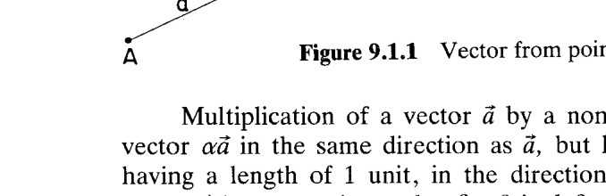
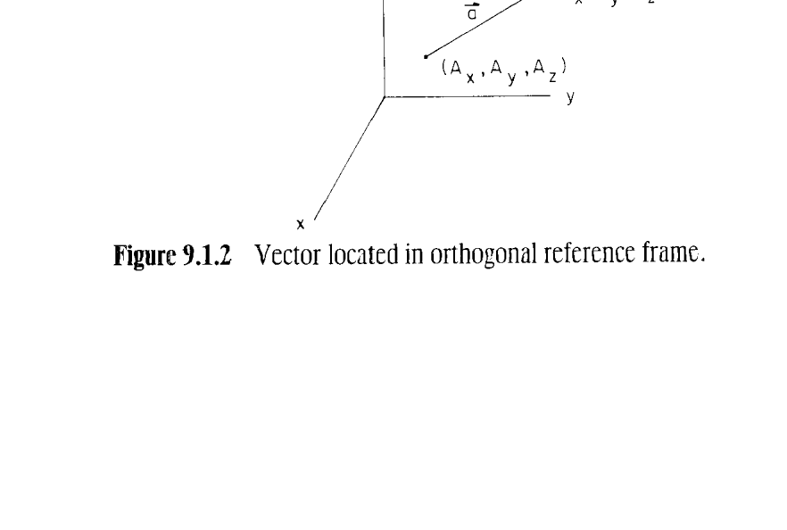
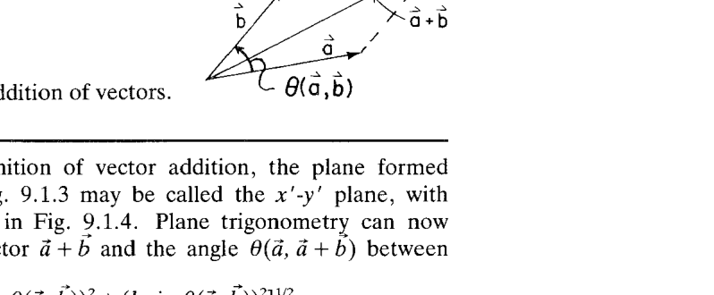
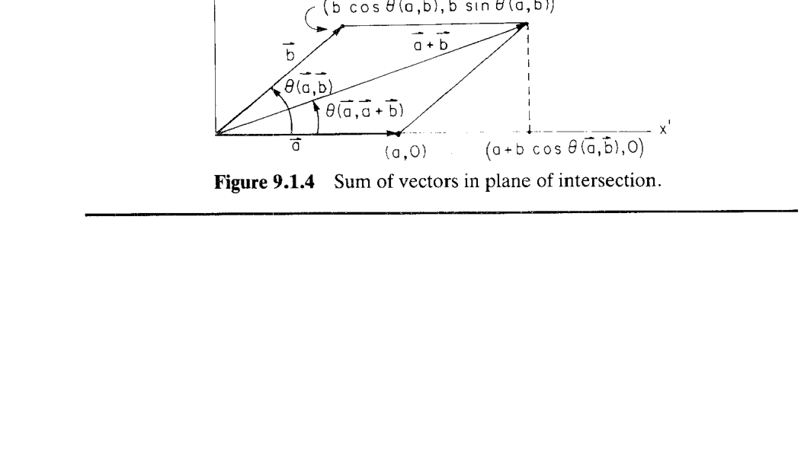
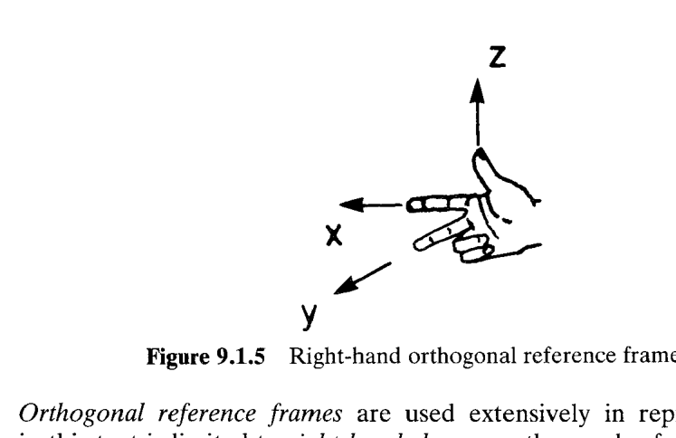
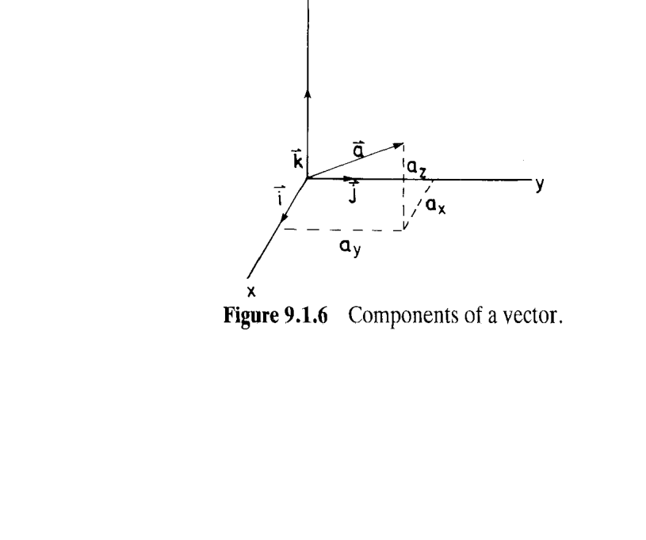
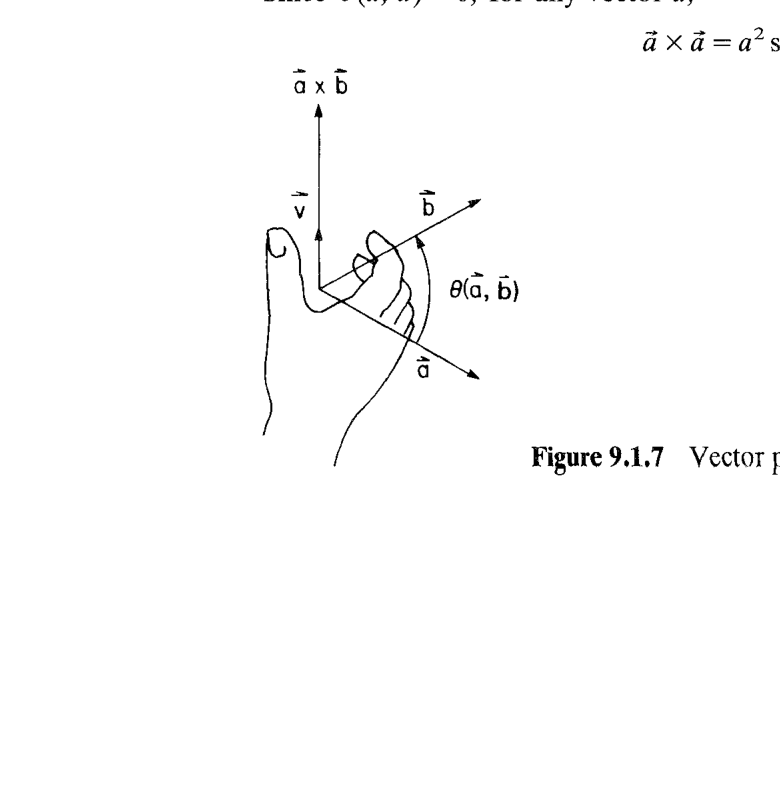
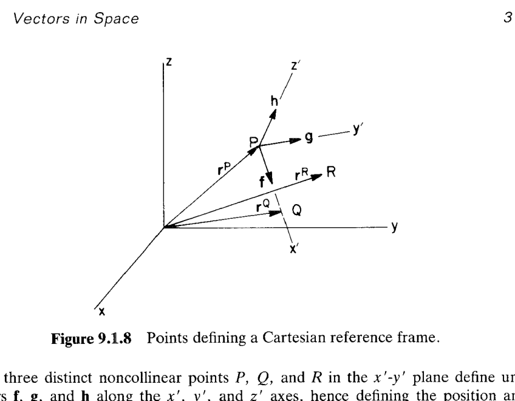
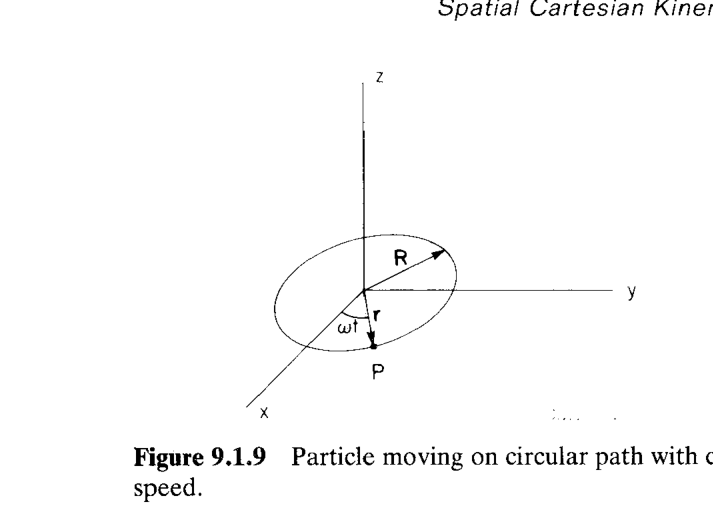

# 9.1 空间向量（Vectors in Space）

> 来源：*Computer Aided Kinematics and Dynamics of Mechanical Systems, Vol. 1*，第 9 章，9.1 节（书页 306–317）。
> 本文以"文字讲解 + 逐式详细推导"组织，公式推导不跳步骤。

---

## 引言：本节要解决什么

第 9 章把第 3 章的**平面**笛卡尔运动学系统地推广到**三维空间**。平面里描述姿态只需一个标量转角 $\phi$，方法都建立在第 2 章的平面向量代数上；进入空间后，姿态有 3 个自由度、且大转动**不可交换**，需要更强的向量工具。

本节（9.1）就是这套工具的**代数地基**，主线逻辑是：

1. 先在**纯几何**层面回顾/扩展向量概念（模、单位向量、加法、标量积），这些与平面情形基本一致；
2. 引入空间独有的新运算——**向量积（叉积）** $\tilde{a}\times\tilde{b}$；
3. 选定**右手笛卡尔参考系**后，把几何向量表示成**代数向量**（列矩阵），使所有运算都能写成矩阵乘法；
4. 定义**波浪号算子（tilde operator）** $\tilde{\mathbf{a}}$，把叉积 $\mathbf{a}\times\mathbf{b}$ 变成矩阵-向量乘 $\tilde{\mathbf{a}}\mathbf{b}$——这是后续所有空间运动学/动力学能"交给计算机做线性代数"的关键；
5. 最后给出向量的**时间微分**规则（速度、加速度）。

> 全节的价值在最后一句点破：**"矩阵化的向量运算使计算可以系统化组织，对计算机应用尤其宝贵。"** 波浪号算子就是把"几何叉积"这一非线性直觉，压进标准线性代数的桥梁。

---

## 一、几何向量（Geometric Vectors）

### 思路
从**不需要参考系**的纯几何视角定义向量，把平面里的概念原样搬到空间。

**几何向量（geometric vector）** $\tilde{a}$ 定义为空间中从一点 $A$ 到另一点 $B$ 的**有向线段**（Fig. 9.1.1），头顶箭号 $\tilde{\;}$ 表示其几何含义。

- **模（magnitude）** $a$ 或 $|\tilde{a}|$：向量的长度（$A,B$ 间距离）。$A\ne B$ 时为正，$A=B$ 时为 0。
- **零向量（zero vector）** $\tilde{0}$：长度为 0 的向量。
- **标量乘法**：$\alpha\ge0$ 时，$\alpha\tilde{a}$ 与 $\tilde{a}$ 同向、模为 $\alpha a$；$\beta<0$ 时，$\beta\tilde{a}$ 模为 $|\beta|a$、方向相反。乘 $-1$ 得**负向量（negative of a vector）**（同模反向）。
- **单位向量（unit vector）**：长度为 1；$\tilde{a}\ne\tilde{0}$ 方向上的单位向量为 $(1/a)\tilde{a}$。

这些定义与平面情形**完全一致**。

### 例 9.1.1：用坐标算模长
> 点 $A,B$ 置于正交 $x\text{-}y\text{-}z$ 系中（Fig. 9.1.2），坐标分别为 $(A_x,A_y,A_z)$、$(B_x,B_y,B_z)$。

$\tilde{a}$ 的模就是 $A,B$ 两点距离，由三维勾股定理：

$$|\tilde{a}| = \left[(B_x-A_x)^2+(B_y-A_y)^2+(B_z-A_z)^2\right]^{1/2}$$

### 向量加法（Parallelogram Rule）
两向量按**平行四边形法则（parallelogram rule）**相加（Fig. 9.1.3），构造在包含 $\tilde{a},\tilde{b}$ 的平面内完成，**向量和（vector sum）**为

$$\tilde{c} = \tilde{a}+\tilde{b} \tag{9.1.1}$$

加法与标量乘满足交换律、分配律：

$$\tilde{a}+\tilde{b} = \tilde{b}+\tilde{a}, \qquad (\alpha+\beta)\tilde{a} = \alpha\tilde{a}+\beta\tilde{a} \tag{9.1.2}$$

### 例 9.1.2：在相交平面内用平面三角求和
> 把包含 $\tilde{a},\tilde{b}$ 的平面记为 $x'\text{-}y'$ 平面，令 $x'$ 轴沿 $\tilde{a}$（Fig. 9.1.4）。

在该平面内取 $\tilde{a}$ 沿 $x'$，则两端点坐标为

$$\tilde{a} \to (a,\,0), \qquad \tilde{b} \to (b\cos\theta(\tilde{a},\tilde{b}),\; b\sin\theta(\tilde{a},\tilde{b}))$$

于是 $\tilde{a}+\tilde{b}$ 的端点坐标为 $(a+b\cos\theta,\; b\sin\theta)$。用平面三角（勾股 + 正切）直接读出模长与夹角：

$$|\tilde{a}+\tilde{b}| = \left[(a+b\cos\theta(\tilde{a},\tilde{b}))^2 + (b\sin\theta(\tilde{a},\tilde{b}))^2\right]^{1/2}$$

$$\theta(\tilde{a},\,\tilde{a}+\tilde{b}) = \operatorname{Arctan}\!\left[\frac{b\sin\theta(\tilde{a},\tilde{b})}{a+b\cos\theta(\tilde{a},\tilde{b})}\right]$$

书中随即评论：这样算"能描述 $\tilde{a}+\tilde{b}$，但**并不方便**"——这正是引入笛卡尔分量的动机。

---

## 二、笛卡尔参考系、分量与方向余弦

### 思路
纯几何算法不便，故引入**右手正交坐标系**，把向量拆成沿三轴的分量，运算就转化为对分量的算术。

**右手笛卡尔参考系（Cartesian reference frame）**：三轴 $x,y,z$ 相互正交，按右手手指顺序排列（Fig. 9.1.5）。本书只用右手系。

向量 $\tilde{a}$ 沿三轴分解为**笛卡尔分量（Cartesian components）** $a_x,a_y,a_z$（Fig. 9.1.6）。$\tilde{i},\tilde{j},\tilde{k}$ 为沿 $x,y,z$ 轴的**单位坐标向量**，则

$$\tilde{a} = a_x\tilde{i}+a_y\tilde{j}+a_z\tilde{k} \tag{9.1.3}$$

分量可由向量与各正轴夹角写出：

$$a_x = a\cos\theta(\tilde{i},\tilde{a}), \quad a_y = a\cos\theta(\tilde{j},\tilde{a}), \quad a_z = a\cos\theta(\tilde{k},\tilde{a}) \tag{9.1.4}$$

其中 $\cos\theta(\tilde{i},\tilde{a}),\cos\theta(\tilde{j},\tilde{a}),\cos\theta(\tilde{k},\tilde{a})$ 称为 $\tilde{a}$ 的**方向余弦（direction cosines）**。

> **视角无关性**：若观察者站到平面背面，逆时针夹角变成 $2\pi-\theta(\tilde{a},\tilde{b})$，但 $\cos(2\pi-\theta)=\cos\theta$，故方向余弦不受视角影响。

### 分量形式的加法
把 $\tilde{a},\tilde{b}$ 的分量代入 (9.1.2)：

$$\tilde{c}=\tilde{a}+\tilde{b} = (a_x+b_x)\tilde{i}+(a_y+b_y)\tilde{j}+(a_z+b_z)\tilde{k} \equiv c_x\tilde{i}+c_y\tilde{j}+c_z\tilde{k} \tag{9.1.5}$$

即**加法逐分量进行**。据此可证加法结合律（Prob. 9.1.1）：

$$(\tilde{a}+\tilde{b})+\tilde{c} = \tilde{a}+(\tilde{b}+\tilde{c}) \tag{9.1.6}$$

---

## 三、标量积（Scalar / Dot Product）

### 思路
标量积是**纯几何**定义（与参考系无关），既能判正交、又能算投影，是后续所有约束方程的构件。

**标量积（scalar product，又称点积 dot product）**定义为两模之积乘以夹角余弦：

$$\tilde{a}\cdot\tilde{b} = ab\cos\theta(\tilde{a},\tilde{b}) \tag{9.1.7}$$

由于是几何定义，**与所选参考系无关**。

- **正交判据**：两非零向量（$a\ne0,b\ne0$）标量积为零 $\iff \cos\theta(\tilde{a},\tilde{b})=0$，此时称两向量**正交（orthogonal）**。
- **对称性**：因 $\theta(\tilde{b},\tilde{a})=2\pi-\theta(\tilde{a},\tilde{b})$ 且 $\cos(2\pi-\theta)=\cos\theta$，故

$$\tilde{a}\cdot\tilde{b} = \tilde{b}\cdot\tilde{a} \tag{9.1.8}$$

- **投影意义**：$\tilde{a}\cdot\tilde{b}$ 等于其一模长乘以另一向量在其上的投影。参见 Fig. 9.1.4——$\tilde{b}$ 在 $\tilde{a}$ 上的投影长为 $b\cos\theta(\tilde{a},\tilde{b})$。

### 单位坐标向量的标量积恒等式
$\tilde{i},\tilde{j},\tilde{k}$ 两两正交、各自单位长，故

$$\tilde{i}\cdot\tilde{j}=\tilde{j}\cdot\tilde{k}=\tilde{k}\cdot\tilde{i}=0, \qquad \tilde{i}\cdot\tilde{i}=\tilde{j}\cdot\tilde{j}=\tilde{k}\cdot\tilde{k}=1 \tag{9.1.9}$$

对任意向量 $\tilde{a}$，取 $\tilde{b}=\tilde{a}$（夹角 0）：

$$\tilde{a}\cdot\tilde{a} = aa\cos0 = a^2$$

### 分配律与分量表达式
标量积满足分配律（几何上不显然，见文献 [21]）：

$$(\tilde{a}+\tilde{b})\cdot\tilde{c} = \tilde{a}\cdot\tilde{c}+\tilde{b}\cdot\tilde{c} \tag{9.1.10}$$

**推导分量公式 (9.1.11)。** 把 $\tilde{a}=a_x\tilde{i}+a_y\tilde{j}+a_z\tilde{k}$、$\tilde{b}=b_x\tilde{i}+b_y\tilde{j}+b_z\tilde{k}$ 代入，反复用分配律 (9.1.10) 展开成 9 项，再用 (9.1.9) 把交叉项（$\tilde{i}\cdot\tilde{j}$ 等）消为 0、同名项（$\tilde{i}\cdot\tilde{i}$ 等）设为 1：

$$
\tilde{a}\cdot\tilde{b}
= a_xb_x(\tilde{i}\cdot\tilde{i})+a_yb_y(\tilde{j}\cdot\tilde{j})+a_zb_z(\tilde{k}\cdot\tilde{k})
+ a_xb_y(\tilde{i}\cdot\tilde{j})+a_xb_z(\tilde{i}\cdot\tilde{k})+\cdots
$$

由 (9.1.9)，同名项 $\tilde{i}\cdot\tilde{i}=\tilde{j}\cdot\tilde{j}=\tilde{k}\cdot\tilde{k}=1$，6 个交叉项 $\tilde{i}\cdot\tilde{j}=\cdots=0$，只剩：

$$\boxed{\;\tilde{a}\cdot\tilde{b} = a_xb_x+a_yb_y+a_zb_z\;} \tag{9.1.11}$$

---

## 四、向量积（Vector / Cross Product）

### 思路
这是**空间独有**的新运算（平面里没有）。它输出一个向量，方向垂直于两向量所在平面，是构造"某向量垂直于某平面/某轴"这类姿态约束的核心。

**向量积（vector product，又称叉积 cross product）**：

$$\tilde{a}\times\tilde{b} = ab\sin\theta(\tilde{a},\tilde{b})\,\tilde{u} \tag{9.1.12}$$

$\tilde{u}$ 是垂直于 $\tilde{a},\tilde{b}$ 相交平面、按右手方向取的单位向量（Fig. 9.1.7）。

**视角无关性**：若从平面背后看，法向变 $-\tilde{u}$、夹角变 $2\pi-\theta$，则

$$\tilde{a}\times\tilde{b} = ab\sin(2\pi-\theta(\tilde{a},\tilde{b}))(-\tilde{u}) = ab\,\sin\theta(\tilde{a},\tilde{b})\,\tilde{u}$$

（用了 $\sin(2\pi-\theta)=-\sin\theta$），与 (9.1.12) 一致，故结果**与参考系无关**。

**反交换性**：交换次序令 $\tilde{u}$ 反向：

$$\tilde{b}\times\tilde{a} = -\tilde{a}\times\tilde{b} \tag{9.1.13}$$

**分配律**（类比 (9.1.10)，见 [21]）：

$$(\tilde{a}+\tilde{b})\times\tilde{c} = \tilde{a}\times\tilde{c}+\tilde{b}\times\tilde{c} \tag{9.1.14}$$

**自身叉积**：$\theta(\tilde{a},\tilde{a})=0$，故

$$\tilde{a}\times\tilde{a} = a^2\sin0\,\tilde{u} = \tilde{0}$$

### 单位坐标向量的叉积恒等式
右手系下（$\tilde{i}\times\tilde{j}=\tilde{k}$ 等，循环）：

$$
\begin{aligned}
&\tilde{i}\times\tilde{i}=\tilde{j}\times\tilde{j}=\tilde{k}\times\tilde{k}=\tilde{0}\\
&\tilde{i}\times\tilde{j}=-\tilde{j}\times\tilde{i}=\tilde{k}\\
&\tilde{j}\times\tilde{k}=-\tilde{k}\times\tilde{j}=\tilde{i}\\
&\tilde{k}\times\tilde{i}=-\tilde{i}\times\tilde{k}=\tilde{j}
\end{aligned}
\tag{9.1.15}
$$

**推导分量公式 (9.1.16)。** 用分配律 (9.1.14) 把 $\tilde{a}\times\tilde{b}$ 展开成 9 项，同名项（$\tilde{i}\times\tilde{i}$ 等）为 $\tilde{0}$，其余 6 项按 (9.1.15) 代入：

$$
\begin{aligned}
\tilde{c}=\tilde{a}\times\tilde{b}
&= a_xb_y(\tilde{i}\times\tilde{j})+a_xb_z(\tilde{i}\times\tilde{k})
 + a_yb_x(\tilde{j}\times\tilde{i})+a_yb_z(\tilde{j}\times\tilde{k})\\
&\quad + a_zb_x(\tilde{k}\times\tilde{i})+a_zb_y(\tilde{k}\times\tilde{j})\\[2pt]
&= a_xb_y\,\tilde{k}-a_xb_z\,\tilde{j}-a_yb_x\,\tilde{k}+a_yb_z\,\tilde{i}+a_zb_x\,\tilde{j}-a_zb_y\,\tilde{i}\\[2pt]
&= (a_yb_z-a_zb_y)\tilde{i}+(a_zb_x-a_xb_z)\tilde{j}+(a_xb_y-a_yb_x)\tilde{k}
\end{aligned}
\tag{9.1.16}
$$

即 $\tilde{c}\equiv c_x\tilde{i}+c_y\tilde{j}+c_z\tilde{k}$，分量为 $c_x=a_yb_z-a_zb_y$ 等。

---

## 五、代数向量与波浪号算子

### 思路
几何向量与"选定坐标系下的三元列矩阵"一一对应，于是可以彻底切换到**矩阵语言**；再定义波浪号算子把叉积也变成矩阵乘法——所有向量运算就都能交给线性代数库了。

**代数向量（algebraic vector）**：几何向量 $\tilde{a}=a_x\tilde{i}+a_y\tilde{j}+a_z\tilde{k}$ 由其分量唯一确定，写成列矩阵

$$\mathbf{a} = \begin{bmatrix}a_x\\a_y\\a_z\end{bmatrix} = [a_x,a_y,a_z]^T \tag{9.1.17}$$

称为几何向量的**代数表示**。它**依赖所选笛卡尔系** $\tilde{i},\tilde{j},\tilde{k}$——几何向量丢失了一些纯几何性质，但坐标系的性质开始发挥作用（这在空间运动学中反而是宝贵工具）。分量多于 3 个时记 $\mathbf{a}=[a_1,\dots,a_n]^T\in R^n$，称 $n$ 向量。

由于几何向量与 $3\times1$ 代数向量一一对应，此后**不再区分二者**（仅记号有别）。

**加法**（(9.1.5) 的代数形式，Prob. 9.1.4）：

$$\mathbf{c} = \mathbf{a}+\mathbf{b} \tag{9.1.19}$$

### 例 9.1.3 / 9.1.4：代数表示与标量积
> 设 $\tilde{a}=\tilde{i}+2\tilde{j}+3\tilde{k}$，$\tilde{b}=-\tilde{i}+\tilde{j}-\tilde{k}$。

代数表示与和：

$$\mathbf{a}=[1,2,3]^T,\quad \mathbf{b}=[-1,1,-1]^T,\quad \mathbf{c}=\mathbf{a}+\mathbf{b}=[0,3,2]^T$$

标量积 (9.1.11) 写成矩阵形式 $\tilde{a}\cdot\tilde{b}=a_xb_x+a_yb_y+a_zb_z=\mathbf{a}^T\mathbf{b}$（Eq. 9.1.20）：

$$\tilde{a}\cdot\tilde{b}=\mathbf{a}^T\mathbf{b}=[1,2,3]\begin{bmatrix}-1\\1\\-1\end{bmatrix}=-1+2-3=-2$$

由 $\mathbf{a}^T\mathbf{b}=ab\cos\theta(\mathbf{a},\mathbf{b})$，且 $a=(\mathbf{a}^T\mathbf{a})^{1/2}=\sqrt{14}$、$b=(\mathbf{b}^T\mathbf{b})^{1/2}=\sqrt{3}$：

$$\cos\theta(\mathbf{a},\mathbf{b})=\frac{-2}{\sqrt{14}\sqrt{3}}=\frac{-2}{\sqrt{42}} \;\Rightarrow\; \theta(\mathbf{a},\mathbf{b})=1.88\ \text{rad}\ (\text{或 } 4.40\ \text{rad})$$

### 波浪号算子（Tilde Operator）
与代数向量 $\mathbf{a}=[a_x,a_y,a_z]^T$ 关联的**反对称矩阵（skew-symmetric matrix）** $\tilde{\mathbf{a}}$ 定义为

$$\tilde{\mathbf{a}} \equiv \begin{bmatrix}0 & -a_z & a_y\\ a_z & 0 & -a_x\\ -a_y & a_x & 0\end{bmatrix} \tag{9.1.21}$$

头顶 $\tilde{\;}$（波浪号 tilde）表示"用分量生成 $3\times3$ 反对称矩阵"。反之，任何形如

$$\mathbf{B}=\begin{bmatrix}0 & b_{12} & b_{13}\\ -b_{12} & 0 & b_{23}\\ -b_{13} & -b_{23} & 0\end{bmatrix}$$

的反对称矩阵都可写成 $\mathbf{B}=\tilde{\mathbf{b}}$，其中 $\mathbf{b}=[-b_{23},\,b_{13},\,-b_{12}]^T$。

**核心结果——叉积矩阵化。** 对照 (9.1.16) 的分量 $c_x=a_yb_z-a_zb_y$ 等，正好是 $\tilde{\mathbf{a}}\mathbf{b}$ 的矩阵乘结果：

$$\mathbf{c}=\tilde{\mathbf{a}}\mathbf{b}=\begin{bmatrix}0 & -a_z & a_y\\ a_z & 0 & -a_x\\ -a_y & a_x & 0\end{bmatrix}\begin{bmatrix}b_x\\b_y\\b_z\end{bmatrix}=\begin{bmatrix}a_yb_z-a_zb_y\\ a_zb_x-a_xb_z\\ a_xb_y-a_yb_x\end{bmatrix} \tag{9.1.22}$$

**这正是引入 $\tilde{\;}$ 算子的理由**：叉积从此变成矩阵-向量乘，可编程、可与其它矩阵运算连写。

### 例 9.1.5：矩阵化算叉积
> 例 9.1.3 中 $\tilde{a}\times\tilde{b}$。

$$\mathbf{c}=\tilde{\mathbf{a}}\mathbf{b}=\begin{bmatrix}0 & -3 & 2\\ 3 & 0 & -1\\ -2 & 1 & 0\end{bmatrix}\begin{bmatrix}-1\\1\\-1\end{bmatrix}=\begin{bmatrix}0-3-2\\ -3+0+1\\ 2+1+0\end{bmatrix}=\begin{bmatrix}-5\\-2\\3\end{bmatrix}$$

### 波浪号算子的标准性质（逐条推导）

**(9.1.23) 反对称性。** 对 (9.1.21) 转置，即行列互换，符号反：

$$\tilde{\mathbf{a}}^T=\begin{bmatrix}0 & a_z & -a_y\\ -a_z & 0 & a_x\\ a_y & -a_x & 0\end{bmatrix}=-\tilde{\mathbf{a}} \tag{9.1.23}$$

**(9.1.24) 标量提取。** 每个元素乘 $\alpha$，等于把 $\tilde{\;}$ 作用在 $\alpha\mathbf{a}$ 上：

$$\alpha\tilde{\mathbf{a}}=\begin{bmatrix}0 & -\alpha a_z & \alpha a_y\\ \alpha a_z & 0 & -\alpha a_x\\ -\alpha a_y & \alpha a_x & 0\end{bmatrix}=\widetilde{(\alpha\mathbf{a})} \tag{9.1.24}$$

**(9.1.25) 与反交换律一致。** 由 $\tilde{\mathbf{a}}\mathbf{b}=\mathbf{a}\times\mathbf{b}=-\mathbf{b}\times\mathbf{a}=-\tilde{\mathbf{b}}\mathbf{a}$（直接计算 Prob. 9.1.5）：

$$\tilde{\mathbf{a}}\mathbf{b}=-\tilde{\mathbf{b}}\mathbf{a} \tag{9.1.25}$$

对应叉积关系 $\tilde{a}\times\tilde{b}=-\tilde{b}\times\tilde{a}$（Eq. 9.1.13）。

**(9.1.26) 自身叉积为零。** $\tilde{\mathbf{a}}\mathbf{a}=\mathbf{a}\times\mathbf{a}=\mathbf{0}$，直接展开也可验：

$$\tilde{\mathbf{a}}\mathbf{a}=\begin{bmatrix}-a_za_y+a_ya_z\\ a_za_x-a_xa_z\\ -a_ya_x+a_xa_y\end{bmatrix}=\mathbf{0} \tag{9.1.26}$$

**(9.1.27)。** 对 (9.1.26) 转置，并用 (9.1.23) $\tilde{\mathbf{a}}^T=-\tilde{\mathbf{a}}$：

$$(\tilde{\mathbf{a}}\mathbf{a})^T=\mathbf{a}^T\tilde{\mathbf{a}}^T=-\mathbf{a}^T\tilde{\mathbf{a}}=\mathbf{0}
\;\Rightarrow\; \mathbf{a}^T\tilde{\mathbf{a}}=\mathbf{0} \tag{9.1.27}$$

**(9.1.28) 双 tilde 展开（关键恒等式）。** 断言

$$\tilde{\mathbf{a}}\tilde{\mathbf{b}}=\mathbf{b}\mathbf{a}^T-(\mathbf{a}^T\mathbf{b})\mathbf{I} \tag{9.1.28}$$

其中 $\mathbf{I}$ 为 $3\times3$ 单位阵。此式对应经典二重叉积恒等式 $\mathbf{a}\times(\mathbf{b}\times\mathbf{x})=\mathbf{b}(\mathbf{a}^T\mathbf{x})-(\mathbf{a}^T\mathbf{b})\mathbf{x}$：对任意 $\mathbf{x}$，

$$
\tilde{\mathbf{a}}\tilde{\mathbf{b}}\mathbf{x}=\mathbf{a}\times(\mathbf{b}\times\mathbf{x})=\mathbf{b}(\mathbf{a}^T\mathbf{x})-(\mathbf{a}^T\mathbf{b})\mathbf{x}=\bigl[\mathbf{b}\mathbf{a}^T-(\mathbf{a}^T\mathbf{b})\mathbf{I}\bigr]\mathbf{x}
$$

因对任意 $\mathbf{x}$ 成立，两边矩阵相等，得 (9.1.28)。也可对 (9.1.21) 两个矩阵直接相乘逐元验证（Prob. 9.1.6）。

**(9.1.29)–(9.1.30) 叉积向量的 tilde。** $\tilde{\mathbf{a}}\mathbf{b}$ 是一个向量 $\mathbf{c}=\mathbf{a}\times\mathbf{b}$，其反对称矩阵 $\widetilde{(\tilde{\mathbf{a}}\mathbf{b})}$ 有两种等价写法（Prob. 9.1.7）：

$$\widetilde{(\tilde{\mathbf{a}}\mathbf{b})}=\mathbf{b}\mathbf{a}^T-\mathbf{a}\mathbf{b}^T \tag{9.1.29}$$

$$\widetilde{(\tilde{\mathbf{a}}\mathbf{b})}=\tilde{\mathbf{a}}\tilde{\mathbf{b}}-\tilde{\mathbf{b}}\tilde{\mathbf{a}} \tag{9.1.30}$$

**验证 (9.1.30) 与 (9.1.29) 一致**：把 (9.1.28) 分别用于 $\tilde{\mathbf{a}}\tilde{\mathbf{b}}$ 和 $\tilde{\mathbf{b}}\tilde{\mathbf{a}}$，相减：

$$
\tilde{\mathbf{a}}\tilde{\mathbf{b}}-\tilde{\mathbf{b}}\tilde{\mathbf{a}}
=\bigl[\mathbf{b}\mathbf{a}^T-(\mathbf{a}^T\mathbf{b})\mathbf{I}\bigr]-\bigl[\mathbf{a}\mathbf{b}^T-(\mathbf{b}^T\mathbf{a})\mathbf{I}\bigr]
=\mathbf{b}\mathbf{a}^T-\mathbf{a}\mathbf{b}^T
$$

（标量 $\mathbf{a}^T\mathbf{b}=\mathbf{b}^T\mathbf{a}$，两 $\mathbf{I}$ 项抵消），恰为 (9.1.29)。

**(9.1.31)。** 由 (9.1.29)=(9.1.30) 得 $\tilde{\mathbf{a}}\tilde{\mathbf{b}}-\tilde{\mathbf{b}}\tilde{\mathbf{a}}=\mathbf{b}\mathbf{a}^T-\mathbf{a}\mathbf{b}^T$，移项：

$$\tilde{\mathbf{a}}\tilde{\mathbf{b}}+\mathbf{a}\mathbf{b}^T=\tilde{\mathbf{b}}\tilde{\mathbf{a}}+\mathbf{b}\mathbf{a}^T \tag{9.1.31}$$

**(9.1.32) tilde 对加法线性。** 逐元素验证（$\tilde{\;}$ 是分量的线性组合）：

$$\widetilde{(\mathbf{a}+\mathbf{b})}=\tilde{\mathbf{a}}+\tilde{\mathbf{b}} \tag{9.1.32}$$

> **小结**：(9.1.23)–(9.1.32) 把"叉积/反对称"的全部代数规律都收进矩阵乘法。此后写空间约束、雅可比、角速度时，凡遇叉积一律换成 $\tilde{\;}$，即可用标准线性求解器（LU、Newton–Raphson）处理——这是 DADS 等通用程序得以实现的地基。

### 例 9.1.6：三点定义一个笛卡尔参考系
> 已知点 $P$（原点，向量 $\mathbf{r}^P$）、$x'$ 轴上一点 $Q$（$\mathbf{r}^Q$）、$x'\text{-}y'$ 平面内不共线的第三点 $R$（$\mathbf{r}^R$），构造 $x'\text{-}y'\text{-}z'$ 系三轴单位向量（Fig. 9.1.8）。

**$x'$ 轴单位向量** $\mathbf{f}$：沿 $P\to Q$，归一化，

$$\mathbf{f}=\frac{1}{|\mathbf{r}^Q-\mathbf{r}^P|}(\mathbf{r}^Q-\mathbf{r}^P)$$

**$z'$ 轴单位向量** $\mathbf{h}$：$\mathbf{f}$ 与 $(\mathbf{r}^R-\mathbf{r}^P)$ 都在 $x'\text{-}y'$ 平面内，其叉积垂直于该平面即 $z'$ 向，归一化（叉积写成 $\tilde{\mathbf{f}}$ 乘）：

$$\mathbf{h}=\frac{1}{|\tilde{\mathbf{f}}(\mathbf{r}^R-\mathbf{r}^P)|}\,\tilde{\mathbf{f}}(\mathbf{r}^R-\mathbf{r}^P)$$

**$y'$ 轴单位向量** $\mathbf{g}$：由右手系 $\mathbf{g}=\mathbf{h}\times\mathbf{f}$，写成 tilde：

$$\mathbf{g}=\tilde{\mathbf{h}}\mathbf{f}$$

于是**三个不共线的点 $P,Q,R$** 便唯一确定了 $x'\text{-}y'\text{-}z'$ 系的位置与朝向。这是后续用几何数据建立随体系的标准做法。

---

## 六、向量的微分（Differentiation of Vectors）

### 思路
速度、加速度是位置向量的时间导数。关键前提：在**不随时间变化的静止笛卡尔系**里，$\tilde{i},\tilde{j},\tilde{k}$ 为常量，求导只作用在分量上。

设 $\tilde{a}(t)$ 分量为 $\mathbf{a}=[a_x(t),a_y(t),a_z(t)]^T$，参考系 $\tilde{i},\tilde{j},\tilde{k}$ **不依赖时间**。则

$$
\dot{\tilde{a}}\equiv\frac{d}{dt}\tilde{a}(t)=\frac{d}{dt}\!\left[a_x(t)\tilde{i}+a_y(t)\tilde{j}+a_z(t)\tilde{k}\right]
=\left[\tfrac{d}{dt}a_x\right]\tilde{i}+\left[\tfrac{d}{dt}a_y\right]\tilde{j}+\left[\tfrac{d}{dt}a_z\right]\tilde{k}
$$

（$\tilde{i},\tilde{j},\tilde{k}$ 为常量，其导数为 0，故只剩分量导数）。代数形式：

$$\dot{\mathbf{a}}\equiv\frac{d}{dt}\mathbf{a}(t)=\left[\tfrac{d}{dt}a_x(t),\;\tfrac{d}{dt}a_y(t),\;\tfrac{d}{dt}a_z(t)\right]^T \tag{9.1.33}$$

> **强调**：此式**仅在静止（时间无关）参考系**成立。若参考系本身随体转动，$\tilde{i},\tilde{j},\tilde{k}$ 有时间导数，就会多出角速度项——这正是 9.2 节要处理的问题。

### 例 9.1.7：匀速圆周运动的速度
> 质点 $P$ 以恒定角速率在 $x\text{-}y$ 平面内沿半径 $R$ 圆周运动（Fig. 9.1.9）。

位置向量（$R,\omega$ 为常量）：

$$\mathbf{r}=\begin{bmatrix}R\cos\omega t\\ R\sin\omega t\\ 0\end{bmatrix}
\;\Rightarrow\;
\dot{\mathbf{r}}=\begin{bmatrix}-R\omega\sin\omega t\\ R\omega\cos\omega t\\ 0\end{bmatrix}$$

（逐分量求导，$\frac{d}{dt}\cos\omega t=-\omega\sin\omega t$、$\frac{d}{dt}\sin\omega t=\omega\cos\omega t$。）

### 微分法则
**和的导数**（Prob. 9.1.9，类比"和的导数等于导数之和"）：

$$\frac{d}{dt}(\mathbf{a}(t)+\mathbf{b}(t))=\dot{\mathbf{a}}+\dot{\mathbf{b}} \tag{9.1.34}$$

**乘积法则**（Prob. 9.1.10），$\alpha(t)$ 为标量函数：

$$\frac{d}{dt}(\alpha\mathbf{a})=\dot\alpha\mathbf{a}+\alpha\dot{\mathbf{a}} \tag{9.1.35}$$

$$\frac{d}{dt}(\mathbf{a}^T\mathbf{b})=\dot{\mathbf{a}}^T\mathbf{b}+\mathbf{a}^T\dot{\mathbf{b}} \tag{9.1.36}$$

$$\frac{d}{dt}(\tilde{\mathbf{a}}\mathbf{b})=\dot{\tilde{\mathbf{a}}}\mathbf{b}+\tilde{\mathbf{a}}\dot{\mathbf{b}} \tag{9.1.37}$$

**tilde 与求导可交换**（因 $\tilde{\;}$ 是分量的线性组合，(9.1.32) 的时间版）：

$$\dot{\tilde{\mathbf{a}}}=\widetilde{\dot{\mathbf{a}}} \tag{9.1.38}$$

### 例 9.1.8：定长向量的速度与位置正交
> 若 $\mathbf{a}(t)$ 长度固定，$\mathbf{a}(t)^T\mathbf{a}(t)=c$（常数）。

对 $\mathbf{a}^T\mathbf{a}=c$ 两边求导，用乘积法则 (9.1.36)（取 $\mathbf{b}=\mathbf{a}$）：

$$\frac{d}{dt}(\mathbf{a}^T\mathbf{a})=\dot{\mathbf{a}}^T\mathbf{a}+\mathbf{a}^T\dot{\mathbf{a}}=2\,\mathbf{a}^T\dot{\mathbf{a}}=0
\;\Rightarrow\; \dot{\mathbf{a}}^T\mathbf{a}=0 \tag{9.1.39}$$

若 $\mathbf{a}$ 是定位某点的位置向量，$\dot{\mathbf{a}}$ 就是该点速度。故 (9.1.39) 表明：**到原点距离恒定的点，其速度与位置向量正交**。这与例 9.1.7 一致——那里 $\mathbf{a}^T\mathbf{a}=R^2$ 恒定，故 $\dot{\mathbf{r}}\perp\mathbf{r}$。

### 加速度与例 9.1.9
$\mathbf{a}(t)$ 的二阶时间导数是所定位点的**加速度**：

$$\ddot{\mathbf{a}}\equiv\frac{d}{dt}(\dot{\mathbf{a}}(t))=\left[\tfrac{d^2}{dt^2}a_x(t),\;\tfrac{d^2}{dt^2}a_y(t),\;\tfrac{d^2}{dt^2}a_z(t)\right]^T \tag{9.1.40}$$

**例 9.1.9**：对例 9.1.7 的 $\dot{\mathbf{r}}$ 再求一次导：

$$\ddot{\mathbf{r}}=\begin{bmatrix}-R\omega^2\cos\omega t\\ -R\omega^2\sin\omega t\\ 0\end{bmatrix}=-\omega^2\mathbf{r}$$

由于 $\ddot{\mathbf{r}}$ 与 $\mathbf{r}$ 方向相反，这正是圆周运动质点经典的**向心加速度（centripetal acceleration）**。

---

## 本节要点回顾

| 主题 | 关键式 | 备注 |
|------|--------|------|
| 标量积（分量） | $\tilde{a}\cdot\tilde{b}=a_xb_x+a_yb_y+a_zb_z=\mathbf{a}^T\mathbf{b}$ | (9.1.11)/(9.1.20)；判正交、算投影 |
| 向量积（分量） | $\mathbf{c}=\tilde{\mathbf{a}}\mathbf{b}$ | (9.1.16)/(9.1.22)；空间独有 |
| 波浪号算子 | $\tilde{\mathbf{a}}=\begin{bmatrix}0&-a_z&a_y\\a_z&0&-a_x\\-a_y&a_x&0\end{bmatrix}$ | (9.1.21)；把叉积变矩阵乘 |
| 双 tilde | $\tilde{\mathbf{a}}\tilde{\mathbf{b}}=\mathbf{b}\mathbf{a}^T-(\mathbf{a}^T\mathbf{b})\mathbf{I}$ | (9.1.28)；二重叉积恒等式 |
| 叉积向量的 tilde | $\widetilde{(\tilde{\mathbf{a}}\mathbf{b})}=\mathbf{b}\mathbf{a}^T-\mathbf{a}\mathbf{b}^T=\tilde{\mathbf{a}}\tilde{\mathbf{b}}-\tilde{\mathbf{b}}\tilde{\mathbf{a}}$ | (9.1.29)/(9.1.30) |
| 静止系微分 | $\dot{\mathbf{a}}=[\dot a_x,\dot a_y,\dot a_z]^T$ | (9.1.33)；仅 $\tilde{i},\tilde{j},\tilde{k}$ 恒定时成立 |
| 定长向量 | $\mathbf{a}^T\mathbf{a}=c\Rightarrow\dot{\mathbf{a}}^T\mathbf{a}=0$ | (9.1.39)；速度⊥位置 |

> **承上启下**：本节的向量积、tilde 算子、微分法则是纯代数工具，尚未涉及"刚体如何转"。9.2 节将用这些工具定义**随体系**、**方向余弦矩阵 $\mathbf{A}$**、**角速度 $\boldsymbol{\omega}$** 与**虚旋转 $\delta\boldsymbol{\pi}$**——届时 (9.1.33) 的"静止系"前提被打破，多出的项正由角速度承担。
