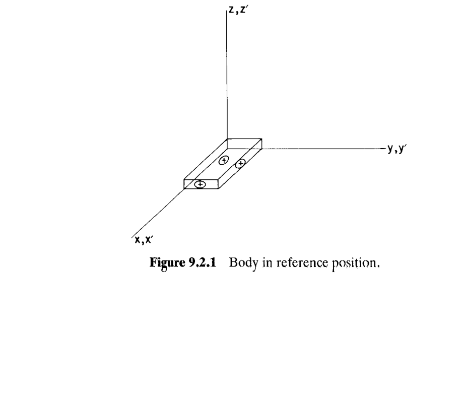
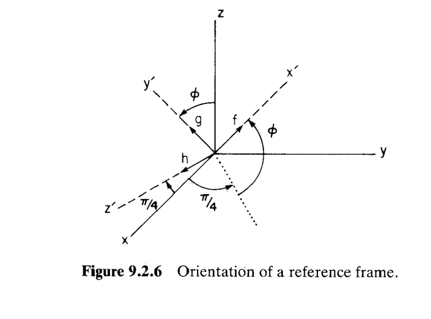
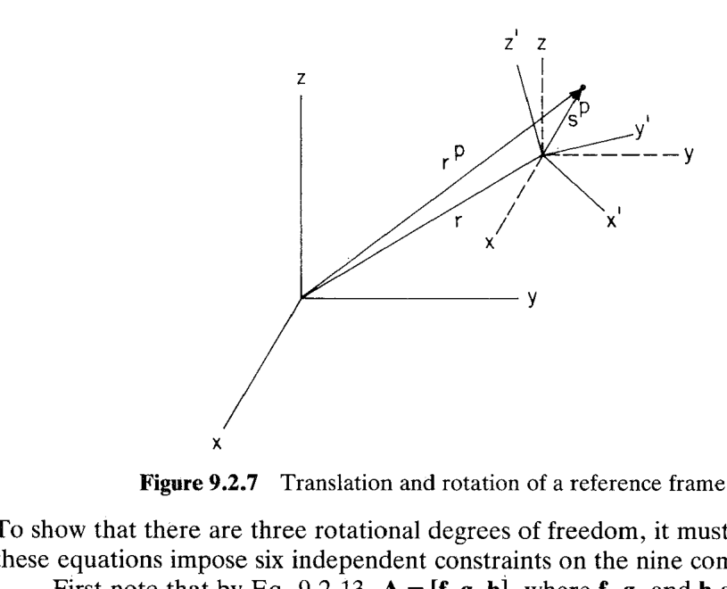
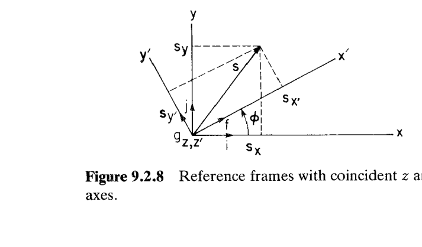
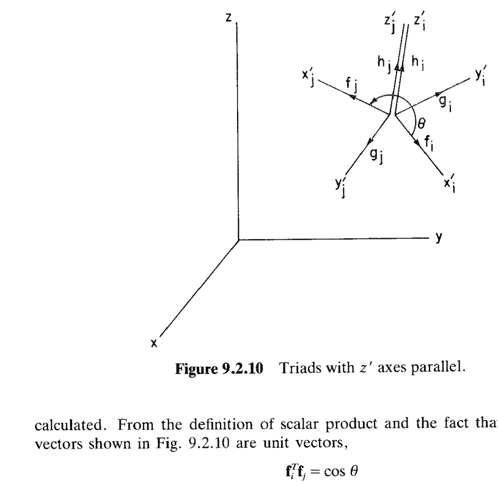
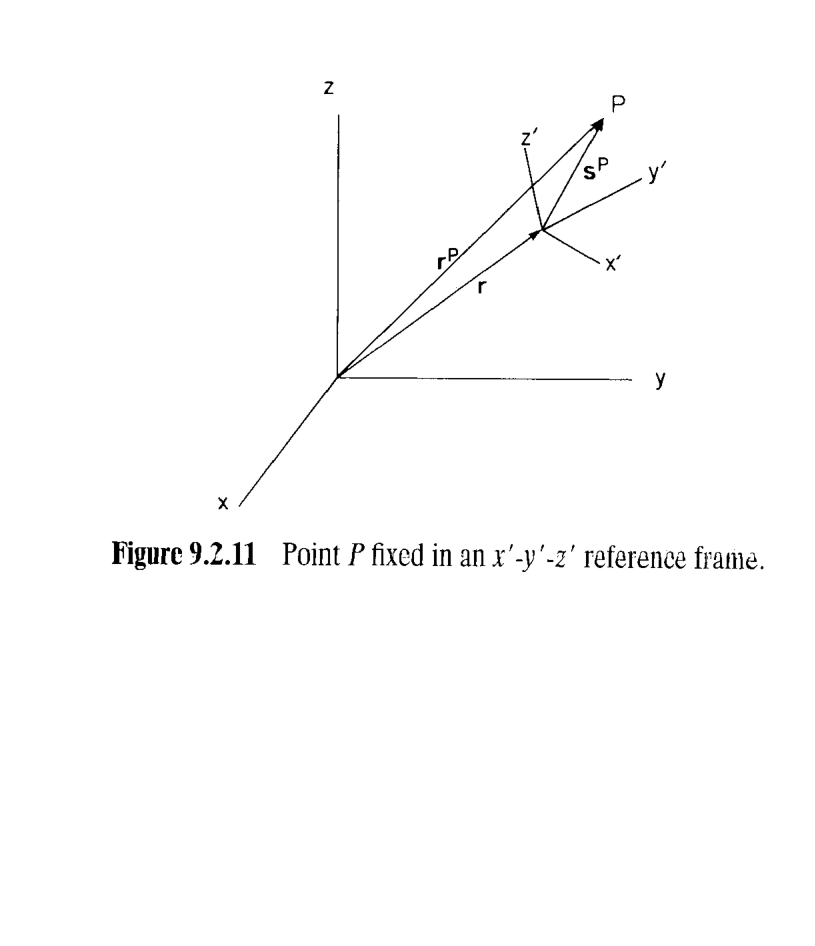
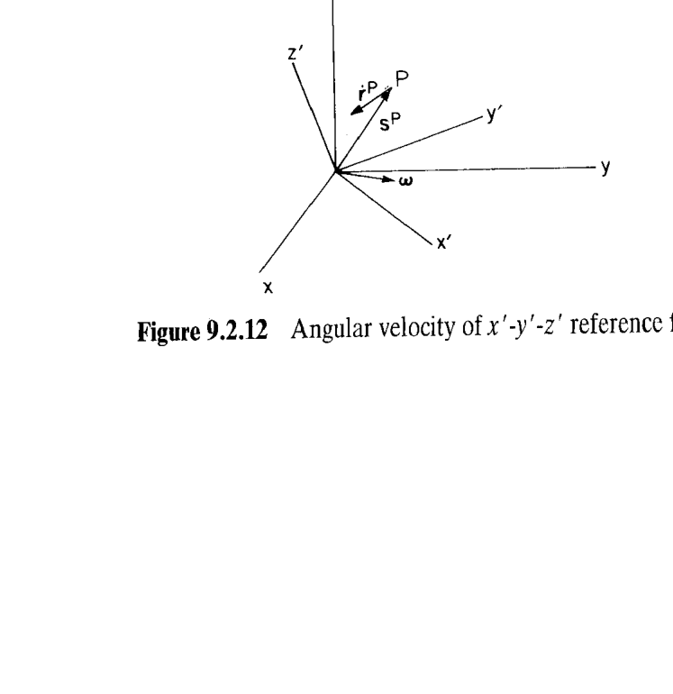

# 9.2 空间刚体运动学（Kinematics of a Rigid Body in Space）

> 来源：*Computer Aided Kinematics and Dynamics of Mechanical Systems, Vol. 1*，第 9 章，9.2 节（书页 317–335）。
> 本文以"文字讲解 + 逐式详细推导"组织，公式推导不跳步骤。

---

## 引言：本节要解决什么

**刚体（rigid body）**定义为一团**彼此不能相对移动**的质点连续体。真实物体从不完美刚硬，但当研究由多个物体组成的机器整体运动时，变形效应通常可忽略，故机器动力学研究几乎都把单个物体建模为刚体。

平面里刚体的**朝向（orientation）**只需一个标量转角 $\phi$；进入空间后，朝向问题变得远为微妙——这正是本节的核心。本节要建立空间刚体**运动学与动力学分析**所需的全部代数关系，主线为：

1. 用**随体参考系（body-fixed reference frame）** $x'\text{-}y'\text{-}z'$ 描述刚体的位置与朝向，并先用一个反例说明**大转动不可交换、不是向量**；
2. 定义**方向余弦矩阵（direction cosine matrix）** $\mathbf{A}$，把两参考系间的坐标变换写成 $\mathbf{s}=\mathbf{As}'$，并证明 $\mathbf{A}$ 是**正交矩阵**；
3. 证明 $\mathbf{A}$ 的九个方向余弦受六个约束，故空间刚体恰有**三个转动自由度**；
4. 建立叉积算子 $\tilde{(\cdot)}$ 与 $\mathbf{A}$ 之间的一组恒等式，以及多参考系间的**合成变换** $\mathbf{A}_{ij}=\mathbf{A}_i^T\mathbf{A}_j$；
5. 对随体系随时间转动求导，得到**角速度（angular velocity）** $\boldsymbol{\omega}$、速度方程、加速度方程；
6. 引入**虚位移 $\delta\mathbf{r}$** 与**虚旋转（virtual rotation）** $\delta\boldsymbol{\pi}$，并证明——**大转动虽非向量，虚旋转与角速度却是向量**，这是后续列写受约束动力学方程的地基。

> 全节的价值：把"空间刚体如何转"这一几何直觉，压进 $\mathbf{A}$、$\tilde{\boldsymbol{\omega}}$、$\delta\tilde{\boldsymbol{\pi}}$ 等标准线性代数对象，使一切可编程、可交给通用程序（DADS）处理。

---

## 一、刚体位置与朝向的参考系

### 思路
先说清楚"用什么描述刚体"，再用一个 $\pi/2$ 转动的反例，揭示空间朝向的第一个陷阱：**转动顺序不可交换**。

**随体参考系。** 刚体几何通常由体上若干**关键点（key points）**定义，这些点的数据给在一个**固连于刚体**的 $x'\text{-}y'\text{-}z'$ 系里，称为随体参考系（Fig. 9.2.1，图中 $x'\text{-}y'\text{-}z'$ 与全局系 $x\text{-}y\text{-}z$ 重合，为"参考位置"）。工程上它相当于**制图板参考系（drafting board reference frame）**：工程师用前视、侧视、俯视定义三维零件，几何数据就落在这个 $x'\text{-}y'\text{-}z'$ 系中。

**位置 + 朝向。** 刚体的一般位形（Fig. 9.2.2）由两部分给出：
- **平移**——由从 $x\text{-}y\text{-}z$ 原点指向 $x'\text{-}y'\text{-}z'$ 原点的向量 $\mathbf{r}$ 描述，简单；
- **朝向**——远为复杂，是本节主攻对象。一旦 $x'\text{-}y'\text{-}z'$ 相对 $x\text{-}y\text{-}z$ 定向确定，体上所有点都能在 $x\text{-}y\text{-}z$ 中定出。

### 大转动不可交换（转动不是向量）
考虑从参考位置出发，绕**随体轴**各做 $\pi/2$ 转动，比较两种顺序：

**顺序一（Fig. 9.2.3）**：先绕随体 $x'$ 轴（初与参考 $x$ 轴重合）转 $\pi/2$，再绕随体 $y'$ 轴（此时它与参考 $z$ 轴重合）转 $\pi/2$，结果朝向见 Fig. 9.2.3b。

**顺序二（Fig. 9.2.4）**：先绕随体 $y'$ 轴（初与参考 $y$ 轴重合）转 $\pi/2$，再绕随体 $x'$ 轴（此时它与参考 $-z$ 轴重合）转 $\pi/2$，结果见 Fig. 9.2.4b。

Fig. 9.2.3b 与 9.2.4b 的最终朝向**明显不同**。这说明**转动的顺序至关重要**——与矩阵乘法中因子顺序不可换如出一辙。由此得到关键结论：

> **大幅值转动不是向量**，因为转动的合成不满足交换律，顺序不能颠倒。

这一反例正是后面要用矩阵 $\mathbf{A}$（其乘法本就不可交换）来刻画朝向、而不是用一个"转动向量"的根本原因。

---

## 二、坐标变换与方向余弦矩阵

### 思路
9.1 节已证：几何向量由它在某笛卡尔系里的分量唯一表示。但分量**依赖所选参考系**。现在有两个同原点的笛卡尔系 $x\text{-}y\text{-}z$ 与 $x'\text{-}y'\text{-}z'$（Fig. 9.2.5），同一几何向量 $\vec{s}$ 在两系里的分量必然存在确定关系——这个关系就是方向余弦矩阵 $\mathbf{A}$。

记 $x',y',z'$ 轴单位向量为 $\vec{f},\vec{g},\vec{h}$，$x,y,z$ 轴单位向量为 $\vec{i},\vec{j},\vec{k}$。同一向量 $\vec{s}$ 有两种表示：

$$\vec{s}=s_x\vec{i}+s_y\vec{j}+s_z\vec{k} \tag{9.2.1}$$

$$\vec{s}=s_{x'}\vec{f}+s_{y'}\vec{g}+s_{z'}\vec{h} \tag{9.2.2}$$

分量由标量积（投影）给出：

$$s_x=\vec{s}\cdot\vec{i},\quad s_y=\vec{s}\cdot\vec{j},\quad s_z=\vec{s}\cdot\vec{k} \tag{9.2.3}$$

$$s_{x'}=\vec{s}\cdot\vec{f},\quad s_{y'}=\vec{s}\cdot\vec{g},\quad s_{z'}=\vec{s}\cdot\vec{h} \tag{9.2.4}$$

两系里的代数向量分别为

$$\mathbf{s}=[s_x,s_y,s_z]^T \tag{9.2.5}$$

$$\mathbf{s}'=[s_{x'},s_{y'},s_{z'}]^T \tag{9.2.6}$$

### 推导变换关系 s = As′
要把 $\mathbf{s}'$ 换成 $\mathbf{s}$，先把 $\vec{f},\vec{g},\vec{h}$ 用 $\vec{i},\vec{j},\vec{k}$ 展开：

$$
\begin{aligned}
\vec{f}&=a_{11}\vec{i}+a_{21}\vec{j}+a_{31}\vec{k}\\
\vec{g}&=a_{12}\vec{i}+a_{22}\vec{j}+a_{32}\vec{k}\\
\vec{h}&=a_{13}\vec{i}+a_{23}\vec{j}+a_{33}\vec{k}
\end{aligned}
\tag{9.2.7}
$$

其中系数 $a_{ij}$ 是**方向余弦**——每个都是某对单位向量夹角的余弦（由 (9.2.3) 型投影得到）：

$$
\begin{aligned}
&a_{11}=\vec{i}\cdot\vec{f}=\cos\theta(\vec{i},\vec{f}),\quad
a_{12}=\vec{i}\cdot\vec{g}=\cos\theta(\vec{i},\vec{g}),\quad
a_{13}=\vec{i}\cdot\vec{h}=\cos\theta(\vec{i},\vec{h})\\
&a_{21}=\vec{j}\cdot\vec{f},\quad a_{22}=\vec{j}\cdot\vec{g},\quad a_{23}=\vec{j}\cdot\vec{h}\\
&a_{31}=\vec{k}\cdot\vec{f},\quad a_{32}=\vec{k}\cdot\vec{g},\quad a_{33}=\vec{k}\cdot\vec{h}
\end{aligned}
\tag{9.2.8}
$$

把 (9.2.7) 代入 (9.2.2)，按 $\vec{i},\vec{j},\vec{k}$ 归并同类项：

$$
\vec{s}=(a_{11}s_{x'}+a_{12}s_{y'}+a_{13}s_{z'})\vec{i}
+(a_{21}s_{x'}+a_{22}s_{y'}+a_{23}s_{z'})\vec{j}
+(a_{31}s_{x'}+a_{32}s_{y'}+a_{33}s_{z'})\vec{k}
$$

把它与 (9.2.1) 的 $\vec{s}=s_x\vec{i}+s_y\vec{j}+s_z\vec{k}$ **逐个基向量对齐**（同一向量在同一基下分量唯一），得：

$$
\begin{aligned}
s_x&=a_{11}s_{x'}+a_{12}s_{y'}+a_{13}s_{z'}\\
s_y&=a_{21}s_{x'}+a_{22}s_{y'}+a_{23}s_{z'}\\
s_z&=a_{31}s_{x'}+a_{32}s_{y'}+a_{33}s_{z'}
\end{aligned}
\tag{9.2.9}
$$

写成矩阵：

$$\boxed{\;\mathbf{s}=\mathbf{As}'\;} \tag{9.2.10}$$

其中 $\mathbf{A}$ 称为**方向余弦矩阵（direction cosine matrix）**或**旋转变换矩阵（rotation transformation matrix）**：

$$
\mathbf{A}=\begin{bmatrix}a_{11}&a_{12}&a_{13}\\ a_{21}&a_{22}&a_{23}\\ a_{31}&a_{32}&a_{33}\end{bmatrix}
\tag{9.2.11}
$$

### A 的列就是随体轴单位向量
把 $\vec{i},\vec{j},\vec{k}$ 在 $x\text{-}y\text{-}z$ 系里写成分量（各自是坐标轴）：

$$\mathbf{i}=[1,0,0]^T,\quad \mathbf{j}=[0,1,0]^T,\quad \mathbf{k}=[0,0,1]^T \tag{9.2.12}$$

对照 (9.2.8)，$\vec{f},\vec{g},\vec{h}$ 在 $x\text{-}y\text{-}z$ 系里的分量恰好是 $\mathbf{A}$ 的三列：

$$
\mathbf{f}=[a_{11},a_{21},a_{31}]^T,\quad
\mathbf{g}=[a_{12},a_{22},a_{32}]^T,\quad
\mathbf{h}=[a_{13},a_{23},a_{33}]^T
$$

因此 $\mathbf{A}$ 可写成**以随体轴单位向量为列**的形式：

$$\boxed{\;\mathbf{A}=[\mathbf{f},\mathbf{g},\mathbf{h}]\;} \tag{9.2.13}$$

### 正交性 AᵀA = I（Prob. 9.2.3）
因 $\mathbf{f},\mathbf{g},\mathbf{h}$ 是**单位正交**向量组：$\mathbf{f}^T\mathbf{f}=\mathbf{g}^T\mathbf{g}=\mathbf{h}^T\mathbf{h}=1$，且互相点积为 0。展开矩阵乘积 $\mathbf{A}^T\mathbf{A}$（其 $(i,j)$ 元是第 $i$ 列与第 $j$ 列的点积）：

$$
\mathbf{A}^T\mathbf{A}=
\begin{bmatrix}\mathbf{f}^T\\ \mathbf{g}^T\\ \mathbf{h}^T\end{bmatrix}[\mathbf{f},\mathbf{g},\mathbf{h}]
=\begin{bmatrix}\mathbf{f}^T\mathbf{f}&\mathbf{f}^T\mathbf{g}&\mathbf{f}^T\mathbf{h}\\ \mathbf{g}^T\mathbf{f}&\mathbf{g}^T\mathbf{g}&\mathbf{g}^T\mathbf{h}\\ \mathbf{h}^T\mathbf{f}&\mathbf{h}^T\mathbf{g}&\mathbf{h}^T\mathbf{h}\end{bmatrix}
=\begin{bmatrix}1&0&0\\0&1&0\\0&0&1\end{bmatrix}
$$

即

$$\boxed{\;\mathbf{A}^T\mathbf{A}=\mathbf{I}\;} \tag{9.2.14}$$

故 $\mathbf{A}^T=\mathbf{A}^{-1}$，$\mathbf{A}$ 是**正交矩阵（orthogonal matrix）**。于是 (9.2.10) 的逆变换只需转置：

$$\boxed{\;\mathbf{s}'=\mathbf{A}^T\mathbf{s}\;} \tag{9.2.15}$$

两系间的向量变换从此是**平凡操作**——正/逆变换都只是矩阵乘 $\mathbf{A}$ 或 $\mathbf{A}^T$。

### 平移 + 转动（原点不重合）
当两系原点不重合（Fig. 9.2.7），设 $\mathbf{s}'^P$ 是点 $P$ 在 $x'\text{-}y'\text{-}z'$ 系里的坐标。它在**平移后的** $x\text{-}y\text{-}z$ 系里是 $\mathbf{As}'^P$，再加上原点平移向量 $\mathbf{r}$：

$$\boxed{\;\mathbf{r}^P=\mathbf{r}+\mathbf{As}'^P\;} \tag{9.2.16}$$

这是**空间刚体上任一点位置**的基本公式（$\mathbf{r}$ 管平移、$\mathbf{A}$ 管转动），后续速度/加速度/虚位移全部由它求导/变分而来。

### 例 9.2.1：由几何构造 A
> $x'\text{-}y'\text{-}z'$ 系的 $z'$ 轴固定在 $x\text{-}y$ 平面内，$x'$ 轴在 $x\text{-}y$ 平面上方转过角 $\phi$（Fig. 9.2.6）。

由图中几何（$x',y'$ 相对 $x,y$ 各绕竖直方向偏 $\pi/4$，再抬升 $\phi$），三根随体轴单位向量在 $x\text{-}y\text{-}z$ 系里的分量为

$$
\mathbf{f}=\Bigl[\tfrac{\sqrt2}{2}\cos\phi,\;\tfrac{\sqrt2}{2}\cos\phi,\;\sin\phi\Bigr]^T
$$

$$
\mathbf{g}=\Bigl[-\tfrac{\sqrt2}{2}\sin\phi,\;-\tfrac{\sqrt2}{2}\sin\phi,\;\cos\phi\Bigr]^T
$$

$$
\mathbf{h}=\Bigl[\tfrac{\sqrt2}{2},\;-\tfrac{\sqrt2}{2},\;0\Bigr]^T
$$

由 (9.2.13) $\mathbf{A}=[\mathbf{f},\mathbf{g},\mathbf{h}]$ 即得从 $x'\text{-}y'\text{-}z'$ 到 $x\text{-}y\text{-}z$ 的变换矩阵。（可验 $\mathbf{f}^T\mathbf{g}=\mathbf{f}^T\mathbf{h}=\mathbf{g}^T\mathbf{h}=0$、三者模均为 1，正交性成立。）

---

## 三、空间刚体有三个转动自由度

### 思路
$\mathbf{A}$ 有九个方向余弦，但它们**并不独立**。(9.2.14) 提供的约束个数决定了独立朝向参数个数。要严格说明"约束恰好 6 个、故转动自由度为 3"，需分析约束函数的雅可比秩。

### 约束只有六个独立分量
(9.2.14) 写成分量形式（$\mathbf{A}^T\mathbf{A}$ 的 $(i,j)$ 元）：

$$
\sum_{k=1}^{3}a_{ki}a_{kj}=\begin{cases}1,&i=j\\0,&i\ne j\end{cases},\qquad i,j=1,2,3
\tag{9.2.13'}
$$

这形式上是 9 个方程，但 $\mathbf{A}^T\mathbf{A}=\mathbf{I}$ **对称**——交换 $i\leftrightarrow j$ 得到同一方程。对称 $3\times3$ 矩阵只有 6 个独立元素（3 个对角 + 3 个上三角），故只有 **6 个独立约束**。9 个方向余弦减 6 个约束 $=3$，暗示 3 个转动自由度。下面严格证明这 6 个约束确实独立。

### 严格证明：Jacobian 满秩 ⇒ 三自由度
把 9 个方向余弦排成列向量（用 (9.2.13) 的 $\mathbf{f},\mathbf{g},\mathbf{h}$）：

$$\mathbf{q}=\begin{bmatrix}\mathbf{f}\\ \mathbf{g}\\ \mathbf{h}\end{bmatrix}$$

(9.2.14) 的对角与上三角部分给出 6 个约束函数：

$$
\boldsymbol{\Phi}(\mathbf{q})\equiv
\begin{bmatrix}
\tfrac12\mathbf{f}^T\mathbf{f}-\tfrac12\\[2pt]
\tfrac12\mathbf{g}^T\mathbf{g}-\tfrac12\\[2pt]
\tfrac12\mathbf{h}^T\mathbf{h}-\tfrac12\\[2pt]
\mathbf{f}^T\mathbf{g}\\[2pt]
\mathbf{f}^T\mathbf{h}\\[2pt]
\mathbf{g}^T\mathbf{h}
\end{bmatrix}=\mathbf{0}
$$

（前三行取 $\tfrac12(\cdot)-\tfrac12$ 是为了求导后雅可比行恰为 $\mathbf{f}^T$ 等，形式整齐。）设 $\mathbf{q}_0$ 满足 $\boldsymbol{\Phi}(\mathbf{q}_0)=\mathbf{0}$。对 $\mathbf{q}=[\mathbf{f}^T,\mathbf{g}^T,\mathbf{h}^T]^T$ 求雅可比（例如 $\partial(\tfrac12\mathbf{f}^T\mathbf{f})/\partial\mathbf{f}=\mathbf{f}^T$、$\partial(\mathbf{f}^T\mathbf{g})/\partial\mathbf{f}=\mathbf{g}^T$ 等）：

$$
\boldsymbol{\Phi}_\mathbf{q}=
\begin{bmatrix}
\mathbf{f}^T&\mathbf{0}&\mathbf{0}\\
\mathbf{0}&\mathbf{g}^T&\mathbf{0}\\
\mathbf{0}&\mathbf{0}&\mathbf{h}^T\\
\mathbf{g}^T&\mathbf{f}^T&\mathbf{0}\\
\mathbf{h}^T&\mathbf{0}&\mathbf{f}^T\\
\mathbf{0}&\mathbf{h}^T&\mathbf{g}^T
\end{bmatrix}
$$

$\boldsymbol{\Phi}_\mathbf{q}$（$6\times9$）行线性无关 $\iff$ $\boldsymbol{\Phi}_\mathbf{q}^T$（$9\times6$）列线性无关 $\iff$ $\boldsymbol{\Phi}_\mathbf{q}^T\mathbf{u}=\mathbf{0}$ 仅有零解 $\mathbf{u}=\mathbf{0}$。把 $\mathbf{u}=[u_1,\dots,u_6]^T$ 展开：

$$
\boldsymbol{\Phi}_\mathbf{q}^T\mathbf{u}=
\begin{bmatrix}
\mathbf{f}&\mathbf{0}&\mathbf{0}&\mathbf{g}&\mathbf{h}&\mathbf{0}\\
\mathbf{0}&\mathbf{g}&\mathbf{0}&\mathbf{f}&\mathbf{0}&\mathbf{h}\\
\mathbf{0}&\mathbf{0}&\mathbf{h}&\mathbf{0}&\mathbf{f}&\mathbf{g}
\end{bmatrix}
\begin{bmatrix}u_1\\u_2\\u_3\\u_4\\u_5\\u_6\end{bmatrix}=\mathbf{0}
$$

（这是三个 $3\times1$ 的块方程。）把每块按 $\mathbf{f},\mathbf{g},\mathbf{h}$ 归并、并**重排变量**，可写成三个以 $\mathbf{A}=[\mathbf{f},\mathbf{g},\mathbf{h}]$ 为系数矩阵的方程：

$$
[\mathbf{f},\mathbf{g},\mathbf{h}]\begin{bmatrix}u_1\\u_4\\u_5\end{bmatrix}=\mathbf{A}\begin{bmatrix}u_1\\u_4\\u_5\end{bmatrix}=\mathbf{0}
$$

$$
[\mathbf{f},\mathbf{g},\mathbf{h}]\begin{bmatrix}u_4\\u_2\\u_6\end{bmatrix}=\mathbf{A}\begin{bmatrix}u_4\\u_2\\u_6\end{bmatrix}=\mathbf{0}
$$

$$
[\mathbf{f},\mathbf{g},\mathbf{h}]\begin{bmatrix}u_5\\u_6\\u_3\end{bmatrix}=\mathbf{A}\begin{bmatrix}u_5\\u_6\\u_3\end{bmatrix}=\mathbf{0}
$$

由 (9.2.14)，$|\mathbf{A}^T\mathbf{A}|=|\mathbf{I}|=1$，而 $|\mathbf{A}^T\mathbf{A}|=|\mathbf{A}^T||\mathbf{A}|=|\mathbf{A}|\,|\mathbf{A}|=|\mathbf{A}|^2$，故 $|\mathbf{A}|^2=1\Rightarrow|\mathbf{A}|=\pm1\ne0$，$\mathbf{A}$ **非奇异**（右手系取 $|\mathbf{A}|=1$）。于是三个方程各自只有零解，逐个解得

$$u_1=u_4=u_5=0,\quad u_4=u_2=u_6=0,\quad u_5=u_6=u_3=0$$

即 $\mathbf{u}=\mathbf{0}$。故 $\boldsymbol{\Phi}_\mathbf{q}$ **行满秩**（秩 6），存在 $6\times6$ 非奇异子阵。由**隐函数定理（implicit function theorem）**，可把与该非奇异子阵对应的 6 个变量当作**非独立坐标**，在 $\mathbf{q}_0$ 的某邻域内唯一表示成剩下 **3 个独立坐标**的函数。

$$\boxed{\text{空间刚体有三个转动自由度。}}$$

尽管九个方向余弦（受 (9.2.14) 约束）**可以**当广义坐标，但既不实用也不方便，故需另寻朝向广义坐标（9.3 节的欧拉参数）。

### 例 9.2.2：平面转动是空间的特例
> $z$ 与 $z'$ 轴重合，$x'$ 轴相对 $x$ 轴逆时针转过 $\phi$（Fig. 9.2.8）。

由 (9.2.8) 逐个算方向余弦：$a_{11}=\cos\theta(\tilde i,\tilde f)=\cos\phi$，$a_{22}=\cos\phi$；$a_{21}=\cos\theta(\tilde j,\tilde f)=\cos(\tfrac\pi2-\phi)=\sin\phi$；$a_{12}=\cos\theta(\tilde i,\tilde g)=\cos(\tfrac\pi2+\phi)=-\sin\phi$；$a_{33}=1$；$a_{31}=a_{32}=a_{13}=a_{23}=0$。故

$$
\mathbf{s}=\begin{bmatrix}s_x\\s_y\\s_z\end{bmatrix}
=\begin{bmatrix}\cos\phi&-\sin\phi&0\\ \sin\phi&\cos\phi&0\\ 0&0&1\end{bmatrix}
\begin{bmatrix}s_{x'}\\s_{y'}\\s_{z'}\end{bmatrix}=\mathbf{As}'
\tag{9.2.17}
$$

其左上 $2\times2$ 块正是第 2 章的**平面转动矩阵**：

$$
\begin{bmatrix}s_x\\s_y\end{bmatrix}=\begin{bmatrix}\cos\phi&-\sin\phi\\ \sin\phi&\cos\phi\end{bmatrix}\begin{bmatrix}s_{x'}\\s_{y'}\end{bmatrix}
\tag{9.2.18}
$$

$$
\begin{bmatrix}s_{x'}\\s_{y'}\end{bmatrix}=\begin{bmatrix}\cos\phi&\sin\phi\\ -\sin\phi&\cos\phi\end{bmatrix}\begin{bmatrix}s_x\\s_y\end{bmatrix}
\tag{9.2.19}
$$

（(9.2.19) 是 (9.2.18) 的转置逆——正交性的直接体现。）**平面运动学是空间运动学的特例。**

---

## 四、波浪号–变换恒等式与参考系合成

### 思路
叉积算子 $\tilde{(\cdot)}$（9.1 节）与坐标变换 $\mathbf{A}$ 是空间运动学最常连用的两件工具。本小节建立它们之间的搬移法则，以及多个随体系之间的合成变换公式。

### 推导 (9.2.20)–(9.2.22)：tilde 穿过 A
关键观察：对 $x'\text{-}y'\text{-}z'$ 系里的任意两向量 $\mathbf{s}',\mathbf{v}'$，"在 $x\text{-}y\text{-}z$ 系里作叉积"等于"在 $x'\text{-}y'\text{-}z'$ 系里作叉积再变换过来"（因叉积是几何量，与坐标系无关）：

$$\tilde{\mathbf{s}}\mathbf{v}=\mathbf{A}(\tilde{\mathbf{s}}'\mathbf{v}')$$

其中 $\mathbf{s},\mathbf{v}$ 是 $\mathbf{s}',\mathbf{v}'$ 在 $x\text{-}y\text{-}z$ 系里的表示。用 $\mathbf{v}=\mathbf{Av}'$（即 $\mathbf{v}'=\mathbf{A}^T\mathbf{v}$，把左边 $\mathbf{v}$ 换成 $\mathbf{Av}'$）：

$$(\tilde{\mathbf{s}}\mathbf{A})\mathbf{v}'=(\mathbf{A}\tilde{\mathbf{s}}')\mathbf{v}'$$

因对任意 $\mathbf{v}'$ 成立（Prob. 9.2.4），两侧矩阵相等：

$$\tilde{\mathbf{s}}\mathbf{A}=\mathbf{A}\tilde{\mathbf{s}}' \tag{9.2.20}$$

右乘 $\mathbf{A}^T$ 并用 (9.2.14)（$\mathbf{A}\mathbf{A}^T=\mathbf{I}$）：

$$\widetilde{(\mathbf{As}')}=\tilde{\mathbf{s}}=\mathbf{A}\tilde{\mathbf{s}}'\mathbf{A}^T \tag{9.2.21}$$

（第一个等号：$\mathbf{As}'=\mathbf{s}$ 是同一向量在 $x\text{-}y\text{-}z$ 系的表示，其 tilde 就是 $\tilde{\mathbf{s}}$。）同理可得逆向式

$$\widetilde{(\mathbf{A}^T\mathbf{s})}=\tilde{\mathbf{s}}'=\mathbf{A}^T\tilde{\mathbf{s}}\mathbf{A} \tag{9.2.22}$$

> **口诀**：反对称矩阵 $\tilde{\mathbf{s}}$ 在两系间的变换是**相似变换** $\mathbf{A}(\cdot)\mathbf{A}^T$，而不是简单的 $\mathbf{A}(\cdot)$。

### 多参考系合成 (9.2.23)–(9.2.25)
考虑两个随体系 $x_i'\text{-}y_i'\text{-}z_i'$ 与 $x_j'\text{-}y_j'\text{-}z_j'$（Fig. 9.2.9）。同一向量 $\mathbf{s}$ 在两系里分别为 $\mathbf{s}_i'$、$\mathbf{s}_j'$，$\mathbf{A}_i,\mathbf{A}_j$ 是各自到 $x\text{-}y\text{-}z$ 的变换：

$$\mathbf{s}=\mathbf{A}_i\mathbf{s}_i'=\mathbf{A}_j\mathbf{s}_j' \tag{9.2.23}$$

由 $\mathbf{A}_i$ 正交，左乘 $\mathbf{A}_i^T$：

$$\mathbf{s}_i'=\mathbf{A}_i^T\mathbf{A}_j\mathbf{s}_j'\equiv\mathbf{A}_{ij}\mathbf{s}_j' \tag{9.2.24}$$

因 $\mathbf{s}_j'$ 任意，得从 $j$ 系到 $i$ 系的**合成变换矩阵**：

$$\boxed{\;\mathbf{A}_{ij}=\mathbf{A}_i^T\mathbf{A}_j\;} \tag{9.2.25}$$

直接计算可验 $\mathbf{A}_{ij}$ 也是正交矩阵（Prob. 9.2.5）。

### 例 9.2.3：求两随体系间的转角 θ
> 许多运动约束要求某两轴保持平行，例如 Fig. 9.2.10 中 $\mathbf{h}_i,\mathbf{h}_j$（即 $z_i',z_j'$ 轴）平行；从 $\mathbf{f}_i$ 到 $\mathbf{f}_j$ 逆时针量得的转角 $\theta$ 是关键量。

**cos θ（由标量积）。** $\mathbf{f}_i,\mathbf{f}_j$ 是单位向量，夹角为 $\theta$：

$$\mathbf{f}_i^T\mathbf{f}_j=\cos\theta \tag{9.2.26}$$

**sin θ（由向量积）。** 由叉积定义，$\tilde{\mathbf{f}}_i\mathbf{f}_j=\mathbf{h}_i\sin\theta$（方向沿公共轴 $\mathbf{h}_i$，模为 $\sin\theta$）。两边点乘 $\mathbf{h}_i$，用 $\mathbf{h}_i^T\mathbf{h}_i=1$ 与恒等式 $\tilde{\mathbf{f}}_i\mathbf{h}_i=-\mathbf{g}_i$（右手系 $\mathbf{f}\times\mathbf{h}=-\mathbf{g}$，故 $\mathbf{h}_i^T\tilde{\mathbf{f}}_i=(\,-\tilde{\mathbf{f}}_i\mathbf{h}_i)^T=\mathbf{g}_i^T$）：

$$\sin\theta=\mathbf{h}_i^T\tilde{\mathbf{f}}_i\mathbf{f}_j=\mathbf{g}_i^T\mathbf{f}_j \tag{9.2.27}$$

**用各自随体分量表达。** 把 $\mathbf{f}_i=\mathbf{A}_i\mathbf{f}_i'$、$\mathbf{f}_j=\mathbf{A}_j\mathbf{f}_j'$、$\mathbf{g}_i=\mathbf{A}_i\mathbf{g}_i'$ 代入 (9.2.26)、(9.2.27)：

$$\cos\theta=\mathbf{f}_i'^T\mathbf{A}_i^T\mathbf{A}_j\mathbf{f}_j' \tag{9.2.28}$$

$$\sin\theta=\mathbf{g}_i'^T\mathbf{A}_i^T\mathbf{A}_j\mathbf{f}_j' \tag{9.2.29}$$

**唯一确定 θ。** 记 $s=\sin\theta$（(9.2.29)）、$c=\cos\theta$（(9.2.28)）。$\operatorname{Arcsin}$ 主值域为

$$-\tfrac{\pi}{2}\le\operatorname{Arcsin}s\le\tfrac{\pi}{2} \tag{9.2.30}$$

结合 $c$ 的符号可把 $\theta$ 唯一定在 $0\le\theta<2\pi$（Prob. 9.2.6）：

$$
\theta=\begin{cases}
\operatorname{Arcsin}s,&s\ge0,\;c\ge0\\
\pi-\operatorname{Arcsin}s,&s\ge0,\;c<0\\
\pi-\operatorname{Arcsin}s,&s<0,\;c<0\\
2\pi+\operatorname{Arcsin}s,&s<0,\;c\ge0
\end{cases}
\tag{9.2.31}
$$

若关心已转过的整圈数 $n$，需另加逻辑，把 $2n\pi$ 累加到 (9.2.31) 的结果上。

> **要点**：仅凭 $\sin\theta$（或仅凭 $\cos\theta$）无法定出 $0\sim2\pi$ 内的唯一角；必须**同时**知道正弦、余弦的符号——这与平面里用 $\operatorname{Arctan}$ 判象限同理。

---

## 五、速度、加速度与角速度

### 思路
随体系随刚体运动，$\mathbf{r}$ 和 $\mathbf{A}$ 都是时间函数。对位置公式 (9.2.16) 求导即得速度、加速度。关键是把 $\dot{\mathbf{A}}$ 中蕴含的转动信息提炼成**角速度向量** $\boldsymbol{\omega}$。

固连于刚体的点 $P$，坐标 $\mathbf{s}'^P$ 在随体系里**恒定**（Fig. 9.2.11），其全局位置为

$$\mathbf{r}^P=\mathbf{r}+\mathbf{As}'^P \tag{9.2.32}$$

### 速度方程
对 (9.2.32) 求时间导数（$\mathbf{s}'^P$ 常量，只 $\mathbf{r},\mathbf{A}$ 含时间）：

$$\dot{\mathbf{r}}^P=\dot{\mathbf{r}}+\dot{\mathbf{A}}\mathbf{s}'^P \tag{9.2.33}$$

用 (9.2.15) $\mathbf{s}'^P=\mathbf{A}^T\mathbf{s}^P$（其中 $\mathbf{s}^P=\mathbf{As}'^P$ 是 $P$ 相对随体系原点的位置在全局系的表示），把 $\mathbf{s}'^P$ 换掉：

$$\dot{\mathbf{r}}^P=\dot{\mathbf{r}}+\dot{\mathbf{A}}\mathbf{A}^T\mathbf{s}^P \tag{9.2.34}$$

**推导角速度的定义。** 对正交条件 $\mathbf{A}\mathbf{A}^T=\mathbf{I}$ 求时间导数（乘积法则）：

$$\dot{\mathbf{A}}\mathbf{A}^T+\mathbf{A}\dot{\mathbf{A}}^T=\mathbf{0}$$

注意 $\mathbf{A}\dot{\mathbf{A}}^T=(\dot{\mathbf{A}}\mathbf{A}^T)^T$，故

$$(\dot{\mathbf{A}}\mathbf{A}^T)^T=\mathbf{A}\dot{\mathbf{A}}^T=-\dot{\mathbf{A}}\mathbf{A}^T \tag{9.2.35}$$

即 $\dot{\mathbf{A}}\mathbf{A}^T$ 是**反对称矩阵**。任何 $3\times3$ 反对称矩阵都对应一个向量（9.1 节 tilde 算子的逆），记之为 $\boldsymbol{\omega}$，称为 $x'\text{-}y'\text{-}z'$ 系的**角速度（angular velocity）**：

$$\boxed{\;\tilde{\boldsymbol{\omega}}=\dot{\mathbf{A}}\mathbf{A}^T\;} \tag{9.2.36}$$

代回 (9.2.34) 得**速度方程**：

$$\boxed{\;\dot{\mathbf{r}}^P=\dot{\mathbf{r}}+\tilde{\boldsymbol{\omega}}\mathbf{s}^P\;} \tag{9.2.37}$$

若 $\mathbf{r}=\dot{\mathbf{r}}=\mathbf{0}$（原点不动，Fig. 9.2.12），几何形式即经典关系

$$\dot{\vec{r}}^P=\dot{\vec{r}}+\vec{\omega}\times\vec{s}^P$$

（$\vec\omega$ 是随体系相对参考系的角速度）。把叉积放到随体系里再变换到全局系（Prob. 9.2.7），用 (9.2.21) $\tilde{\boldsymbol{\omega}}=\mathbf{A}\tilde{\boldsymbol{\omega}}'\mathbf{A}^T$ 与 $\mathbf{s}^P=\mathbf{As}'^P$：

$$\dot{\mathbf{r}}^P=\dot{\mathbf{r}}+\mathbf{A}\tilde{\boldsymbol{\omega}}'\mathbf{s}'^P \tag{9.2.38}$$

### A 与角速度的常用关系
(9.2.36) 右乘 $\mathbf{A}$，用 $\mathbf{A}^T\mathbf{A}=\mathbf{I}$：

$$\boxed{\;\dot{\mathbf{A}}=\tilde{\boldsymbol{\omega}}\mathbf{A}\;} \tag{9.2.39}$$

再用 (9.2.21)（令 $\mathbf{s}=\boldsymbol{\omega}$，则 $\tilde{\boldsymbol{\omega}}=\mathbf{A}\tilde{\boldsymbol{\omega}}'\mathbf{A}^T$）代入 (9.2.39)：

$$\dot{\mathbf{A}}=\mathbf{A}\tilde{\boldsymbol{\omega}}'\mathbf{A}^T\mathbf{A}=\mathbf{A}\tilde{\boldsymbol{\omega}}'$$

于是并列两式（$\boldsymbol{\omega}$ 在全局系、$\boldsymbol{\omega}'$ 在随体系）：

$$\boxed{\;\dot{\mathbf{A}}=\mathbf{A}\tilde{\boldsymbol{\omega}}',\qquad \tilde{\boldsymbol{\omega}}'=\mathbf{A}^T\dot{\mathbf{A}}\;} \tag{9.2.40}$$

(9.2.39)、(9.2.40) 是 $\dot{\mathbf{A}}$ 与角速度间最常用的桥梁。

### 加速度方程
对 (9.2.33) 再求一次导（$\mathbf{s}'^P$ 常量）：

$$\ddot{\mathbf{r}}^P=\ddot{\mathbf{r}}+\ddot{\mathbf{A}}\mathbf{s}'^P \tag{9.2.41}$$

对 (9.2.39) $\dot{\mathbf{A}}=\tilde{\boldsymbol{\omega}}\mathbf{A}$ 求导（乘积法则），再用 (9.2.39) 消去 $\dot{\mathbf{A}}$（Prob. 9.2.8）：

$$
\ddot{\mathbf{A}}=\dot{\tilde{\boldsymbol{\omega}}}\mathbf{A}+\tilde{\boldsymbol{\omega}}\dot{\mathbf{A}}
=\dot{\tilde{\boldsymbol{\omega}}}\mathbf{A}+\tilde{\boldsymbol{\omega}}\tilde{\boldsymbol{\omega}}\mathbf{A}
\tag{9.2.42}
$$

对 (9.2.40) 同理，用 (9.2.21) 把 $\boldsymbol{\omega}=\mathbf{A}\boldsymbol{\omega}'$、$\dot{\boldsymbol{\omega}}=\mathbf{A}\dot{\boldsymbol{\omega}}'$ 代入，可改写成随体系角速度形式：

$$\ddot{\mathbf{A}}=\mathbf{A}\dot{\tilde{\boldsymbol{\omega}}}'+\mathbf{A}\tilde{\boldsymbol{\omega}}'\tilde{\boldsymbol{\omega}}' \tag{9.2.43}$$

### 例 9.2.4：平面转动的角速度
> 例 9.2.2 的 $\mathbf{A}(\phi)$（Eq. 9.2.17）。

先算 $\dot{\mathbf{A}}$（对 $\phi$ 求导再乘 $\dot\phi$）：$\dot{\mathbf{A}}=\begin{bmatrix}-\sin\phi&-\cos\phi&0\\ \cos\phi&-\sin\phi&0\\0&0&0\end{bmatrix}\dot\phi$。代入 (9.2.36) $\tilde{\boldsymbol{\omega}}=\dot{\mathbf{A}}\mathbf{A}^T$：

$$
\tilde{\boldsymbol{\omega}}=\dot{\mathbf{A}}\mathbf{A}^T
=\begin{bmatrix}0&-1&0\\1&0&0\\0&0&0\end{bmatrix}\dot\phi
$$

对照 tilde 定义 (9.1.21)，反对称矩阵 $\begin{bmatrix}0&-\omega_z&\omega_y\\ \omega_z&0&-\omega_x\\ -\omega_y&\omega_x&0\end{bmatrix}$，读出 $\omega_z=\dot\phi$、$\omega_x=\omega_y=0$：

$$\boldsymbol{\omega}=[0,0,\dot\phi]^T$$

与"绕固定 $z$ 轴的角速度"物理直觉一致。又因 $z,z'$ 轴重合，$\boldsymbol{\omega}'=\mathbf{A}^T\boldsymbol{\omega}=\boldsymbol{\omega}$（角速度沿公共轴，两系表示相同）。

### 例 9.2.5：平面转动点的速度与加速度
> 点 $P$ 在随体系里 $\mathbf{s}'^P=[1,1,1]^T$，用例 9.2.4 的结果与 (9.2.38)。

**速度**（$\mathbf{r}=\dot{\mathbf{r}}=0$，用 $\dot{\mathbf{r}}^P=\mathbf{A}\tilde{\boldsymbol{\omega}}'\mathbf{s}'^P$，$\tilde{\boldsymbol{\omega}}'=\begin{bmatrix}0&-\dot\phi&0\\ \dot\phi&0&0\\0&0&0\end{bmatrix}$）：

$$
\dot{\mathbf{r}}^P=\mathbf{A}\tilde{\boldsymbol{\omega}}'\mathbf{s}'^P
=[-\cos\phi-\sin\phi,\;\cos\phi-\sin\phi,\;0]^T\,\dot\phi
$$

**加速度**（$\ddot{\mathbf{r}}=0$，用 (9.2.41)+(9.2.42)，含 $\ddot\phi$ 与 $\dot\phi^2$ 两部分）：

$$
\ddot{\mathbf{r}}^P=\ddot{\mathbf{A}}\mathbf{s}'^P
=\begin{bmatrix}-\cos\phi-\sin\phi\\ \cos\phi-\sin\phi\\ 0\end{bmatrix}\ddot\phi
+\begin{bmatrix}\sin\phi-\cos\phi\\ -\cos\phi-\sin\phi\\ 0\end{bmatrix}\dot\phi^2
$$

（第一项来自 $\dot{\tilde{\boldsymbol{\omega}}}$ 即角加速度 $\ddot\phi$，第二项来自 $\tilde{\boldsymbol{\omega}}\tilde{\boldsymbol{\omega}}$ 即向心项 $\dot\phi^2$。）

> 这些导数关系是**本章空间运动学分析**与**第 11 章空间动力学分析**的基础（Probs. 9.2.9、9.2.10）。

---

## 六、虚位移与虚旋转

### 思路
虚位移是"时间冻结、无穷小"的位移变分（6.1 节）。刚体上点 $P$ 的虚位移 = 随体系原点的虚位移 $\delta\mathbf{r}$ + 方向余弦的变分 $\delta\mathbf{A}$。本小节的核心结论：**虚旋转 $\delta\boldsymbol{\pi}$ 是向量**——尽管大转动不是（第一节反例）。这是列写受约束系统虚功、动力学方程的关键。

### 推导虚旋转 δπ 的存在（(9.2.44)–(9.2.47)）
点 $P$ 位置 $\mathbf{r}^P=\mathbf{r}+\mathbf{As}'^P$（(9.2.32)）依赖 $\mathbf{r}$ 和 $\mathbf{A}$。微扰后 $\mathbf{r}\to\mathbf{r}+\delta\mathbf{r}$、$\mathbf{A}\to\mathbf{A}+\delta\mathbf{A}+0(\delta\mathbf{A}^2)$。$\mathbf{A}$ 扰动后仍须正交：

$$
(\mathbf{A}+\delta\mathbf{A}+0(\delta\mathbf{A}^2))(\mathbf{A}+\delta\mathbf{A}+0(\delta\mathbf{A}^2))^T
=\mathbf{A}\mathbf{A}^T+\mathbf{A}\,\delta\mathbf{A}^T+\delta\mathbf{A}\,\mathbf{A}^T+\delta\mathbf{A}\,\delta\mathbf{A}^T+0(\delta\mathbf{A}^2)=\mathbf{I}
$$

由 $\mathbf{A}\mathbf{A}^T=\mathbf{I}$ 消去，并把二阶小量归入 $0(\delta\mathbf{A}^2)$：

$$\mathbf{A}\,\delta\mathbf{A}^T+\delta\mathbf{A}\,\mathbf{A}^T=0(\delta\mathbf{A}^2)$$

只保留 $\delta\mathbf{A}$ 的**一阶（线性）项**（丢弃 $0(\delta\mathbf{A}^2)$）：

$$\mathbf{A}\,\delta\mathbf{A}^T+\delta\mathbf{A}\,\mathbf{A}^T=\mathbf{0} \tag{9.2.44}$$

（也可直接对 $\mathbf{A}^T\mathbf{A}=\mathbf{I}$ 取全微分得到，Prob. 9.2.11。）由 (9.2.44)，注意 $\mathbf{A}\,\delta\mathbf{A}^T=(\delta\mathbf{A}\,\mathbf{A}^T)^T$：

$$(\delta\mathbf{A}\,\mathbf{A}^T)^T=\mathbf{A}\,\delta\mathbf{A}^T=-\delta\mathbf{A}\,\mathbf{A}^T \tag{9.2.45}$$

即 $\delta\mathbf{A}\,\mathbf{A}^T$ **反对称**，故可表示为某向量 $\delta\boldsymbol{\pi}$ 的 tilde：

$$\delta\mathbf{A}\,\mathbf{A}^T=\delta\tilde{\boldsymbol{\pi}} \tag{9.2.46}$$

其中 $\delta\boldsymbol{\pi}$ 依赖 $\mathbf{A}$ 与 $\delta\mathbf{A}$（Prob. 9.2.12）。右乘 $\mathbf{A}$：

$$\boxed{\;\delta\mathbf{A}=\delta\tilde{\boldsymbol{\pi}}\,\mathbf{A}\;} \tag{9.2.47}$$

> 结构与角速度 (9.2.36)、(9.2.39) **完全平行**：$\dot{\mathbf{A}}=\tilde{\boldsymbol{\omega}}\mathbf{A}$ 对时间求导，$\delta\mathbf{A}=\delta\tilde{\boldsymbol{\pi}}\mathbf{A}$ 对位形变分。$\delta\boldsymbol{\pi}$ 即"角速度的虚版本"。

### 虚位移公式与虚旋转是向量（(9.2.48)–(9.2.51)）
对 (9.2.32) 取变分（Prob. 9.2.13）：

$$\delta\mathbf{r}^P=\delta\mathbf{r}+\delta\mathbf{A}\,\mathbf{s}'^P \tag{9.2.48}$$

代入 (9.2.47)，并用 $\mathbf{s}^P=\mathbf{As}'^P$：

$$
\delta\mathbf{r}^P=\delta\mathbf{r}+\delta\tilde{\boldsymbol{\pi}}\,\mathbf{As}'^P
=\delta\mathbf{r}+\delta\tilde{\boldsymbol{\pi}}\,\mathbf{s}^P
\tag{9.2.49}
$$

故 $\delta\boldsymbol{\pi}$ 起**转动**的作用，称为 $x'\text{-}y'\text{-}z'$ 系相对 $x\text{-}y\text{-}z$ 系的**虚旋转（virtual rotation）**（分量在后一系里）。再用 $\delta\boldsymbol{\pi}=\mathbf{A}\,\delta\boldsymbol{\pi}'$ 与 (9.2.21) 得随体系形式：

$$
\delta\mathbf{A}=\mathbf{A}\,\delta\tilde{\boldsymbol{\pi}}',\qquad \delta\tilde{\boldsymbol{\pi}}'=\mathbf{A}^T\delta\mathbf{A}
\tag{9.2.50}
$$

代回 (9.2.48)：

$$\delta\mathbf{r}^P=\delta\mathbf{r}+\mathbf{A}\,\delta\tilde{\boldsymbol{\pi}}'\mathbf{s}'^P \tag{9.2.51}$$

这**证实虚旋转是向量量**。此结论极其重要：

> **大转动不是向量（第一节），但虚旋转与角速度是向量。** 无穷小转动可交换、可相加，故 $\delta\boldsymbol{\pi}$、$\boldsymbol{\omega}$ 具备向量性——这正是能对空间刚体列写"广义力·虚位移"型虚功方程的前提。

### 固连向量的变分 (9.2.52)–(9.2.53)
对固连于随体系的向量 $\mathbf{s}'$（$\mathbf{s}'$ 常量、$\delta\mathbf{s}'=\mathbf{0}$），其全局表示 $\mathbf{s}=\mathbf{As}'$ 的变分：

$$\delta\mathbf{s}=\delta\mathbf{A}\,\mathbf{s}'=\mathbf{A}\,\delta\tilde{\boldsymbol{\pi}}'\mathbf{s}' \tag{9.2.52}$$

用反交换律 (9.1.25) $\tilde{\mathbf{a}}\mathbf{b}=-\tilde{\mathbf{b}}\mathbf{a}$（把 $\delta\tilde{\boldsymbol{\pi}}'\mathbf{s}'=-\tilde{\mathbf{s}}'\delta\boldsymbol{\pi}'$）：

$$\delta\mathbf{s}=-\mathbf{A}\tilde{\mathbf{s}}'\,\delta\boldsymbol{\pi}' \tag{9.2.53}$$

### δ 作为微分算子——运算法则 (9.2.54)–(9.2.57)
虚位移/虚旋转的 $\delta$ 记号可解释为微积分里的**偏微分算子**（时间冻结）。若向量 $\mathbf{h}(\mathbf{q})$ 光滑依赖变量 $\mathbf{q}$，则 $\delta\mathbf{h}=\mathbf{h}_\mathbf{q}\,\delta\mathbf{q}$。即便 $\mathbf{q}$ 尚未定义，$\delta\mathbf{h}$ 也已良定义，因为线性微分算子遵守与偏导同样的法则：

**和**：

$$\delta(\mathbf{g}+\mathbf{h})=\delta\mathbf{g}+\delta\mathbf{h} \tag{9.2.54}$$

**点积（乘积法则，类比 Eq. 2.5.13）**：

$$\delta(\mathbf{g}^T\mathbf{h})=\mathbf{h}^T\delta\mathbf{g}+\mathbf{g}^T\delta\mathbf{h} \tag{9.2.55}$$

**叉积**（因 tilde 线性 (9.1.32)，$\delta$ 与 $\tilde{(\cdot)}$ 可交换次序）：

$$
\delta(\tilde{\mathbf{g}}\mathbf{h})=\delta\tilde{\mathbf{g}}\,\mathbf{h}+\tilde{\mathbf{g}}\,\delta\mathbf{h}
=-\tilde{\mathbf{h}}\,\delta\mathbf{g}+\tilde{\mathbf{g}}\,\delta\mathbf{h}
\tag{9.2.56}
$$

（第二步用 (9.1.25)：$\delta\tilde{\mathbf{g}}\,\mathbf{h}=\widetilde{\delta\mathbf{g}}\,\mathbf{h}=-\tilde{\mathbf{h}}\,\delta\mathbf{g}$。）

**三重积**（$\mathbf{g}^T\mathbf{Bh}$，逐项用乘积法则）：

$$
\delta(\mathbf{g}^T\mathbf{Bh})=\delta\mathbf{g}^T\mathbf{Bh}+\mathbf{g}^T\delta\mathbf{B}\,\mathbf{h}+\mathbf{g}^T\mathbf{B}\,\delta\mathbf{h}
=\mathbf{h}^T\mathbf{B}^T\delta\mathbf{g}+\mathbf{g}^T\delta\mathbf{B}\,\mathbf{h}+\mathbf{g}^T\mathbf{B}\,\delta\mathbf{h}
\tag{9.2.57}
$$

（$\delta\mathbf{g}^T\mathbf{Bh}=\mathbf{h}^T\mathbf{B}^T\delta\mathbf{g}$，因标量的转置是其自身。）

> **方法论**：把微积分（$\delta$）与向量分析（$\tilde{(\cdot)}$、点/叉积）耦合起来，能得到几何清晰、又可直接编程的约束线性化结果。这是本书分析空间动力学的核心手法。

### 例 9.2.6：两固连向量正交约束的线性化
> 两向量 $\mathbf{s}_i',\mathbf{s}_j'$ 分别固连于 $i,j$ 随体系，约束它们正交：

$$\Phi=\mathbf{s}_i^T\mathbf{s}_j=0 \tag{9.2.58}$$

取变分，用点积法则 (9.2.55)：

$$\delta\Phi=\mathbf{s}_j^T\delta\mathbf{s}_i+\mathbf{s}_i^T\delta\mathbf{s}_j=0 \tag{9.2.59}$$

代入固连向量变分 (9.2.53)（$\delta\mathbf{s}_i=-\mathbf{A}_i\tilde{\mathbf{s}}_i'\delta\boldsymbol{\pi}_i'$ 等）：

$$\delta\Phi=-(\mathbf{s}_j'^T\mathbf{A}_j^T\mathbf{A}_i\tilde{\mathbf{s}}_i'\,\delta\boldsymbol{\pi}_i'+\mathbf{s}_i'^T\mathbf{A}_i^T\mathbf{A}_j\tilde{\mathbf{s}}_j'\,\delta\boldsymbol{\pi}_j')=0 \tag{9.2.60}$$

这类**线性化约束**在列写受约束动力系统运动方程时价值极大——它把非线性正交条件的变分，写成虚旋转 $\delta\boldsymbol{\pi}_i',\delta\boldsymbol{\pi}_j'$ 的线性组合。

### 例 9.2.7：仅容许绕公共轴相对转动
> Fig. 9.2.10 两系仅可绕公共 $\mathbf{h}_i,\mathbf{h}_j$ 轴相对转动。因虚旋转是向量，无穷小相对转动为

$$\delta\theta\,\mathbf{h}_i=\delta\boldsymbol{\pi}_j-\delta\boldsymbol{\pi}_i$$

两边点乘 $\mathbf{h}_i$（用 $\mathbf{h}_i^T\mathbf{h}_i=1$），并把各向量用各自随体分量与变换矩阵表示：

$$
\delta\theta=\mathbf{h}_i^T(\delta\boldsymbol{\pi}_j-\delta\boldsymbol{\pi}_i)
=\mathbf{h}_i'^T(\mathbf{A}_i^T\mathbf{A}_j\,\delta\boldsymbol{\pi}_j'-\delta\boldsymbol{\pi}_i')
\tag{9.2.61}
$$

同理，**相对角速度**为

$$\dot\theta=\mathbf{h}_i'^T(\mathbf{A}_i^T\mathbf{A}_j\,\boldsymbol{\omega}_j'-\boldsymbol{\omega}_i') \tag{9.2.62}$$

### 例 9.2.8：变分与广义坐标——通向雅可比
> 设朝向由广义坐标 $\mathbf{q}$ 刻画（见 9.3 节欧拉参数），虚旋转与 $\delta\mathbf{q}$ 的关系可写成

$$\delta\boldsymbol{\pi}_i'=\mathbf{B}_i\,\delta\mathbf{q},\qquad \delta\boldsymbol{\pi}_j'=\mathbf{B}_j\,\delta\mathbf{q} \tag{9.2.63}$$

其中 $\mathbf{B}_i,\mathbf{B}_j$ 是依赖 $\mathbf{q}$ 的矩阵。把 (9.2.63) 代入 (9.2.60)：

$$\delta\Phi=-(\mathbf{s}_j'^T\mathbf{A}_j^T\mathbf{A}_i\tilde{\mathbf{s}}_i'\mathbf{B}_i+\mathbf{s}_i'^T\mathbf{A}_i^T\mathbf{A}_j\tilde{\mathbf{s}}_j'\mathbf{B}_j)\,\delta\mathbf{q} \tag{9.2.64}$$

因总微分中 $\delta\mathbf{q}$ 的系数正是 $\partial\Phi/\partial\mathbf{q}$，读出**约束雅可比**：

$$\boxed{\;\frac{\partial\Phi}{\partial\mathbf{q}}=-(\mathbf{s}_j'^T\mathbf{A}_j^T\mathbf{A}_i\tilde{\mathbf{s}}_i'\mathbf{B}_i+\mathbf{s}_i'^T\mathbf{A}_i^T\mathbf{A}_j\tilde{\mathbf{s}}_j'\mathbf{B}_j)\;} \tag{9.2.65}$$

> **一气贯通**：从几何约束 (9.2.58) → 变分 (9.2.60) → 用广义坐标关系 (9.2.63) → 雅可比 (9.2.65)。这正是把空间约束"交给计算机"的完整链条，也是通往 9.3 节欧拉参数广义坐标的自然入口。

---

## 本节要点回顾

| 主题 | 关键式 | 备注 |
|------|--------|------|
| 位置公式 | $\mathbf{r}^P=\mathbf{r}+\mathbf{As}'^P$ | (9.2.16)/(9.2.32)；平移 $\mathbf{r}$ + 转动 $\mathbf{A}$ |
| 方向余弦矩阵 | $\mathbf{A}=[\mathbf{f},\mathbf{g},\mathbf{h}]$，$\mathbf{s}=\mathbf{As}'$ | (9.2.10)/(9.2.13)；列为随体轴单位向量 |
| 正交性 | $\mathbf{A}^T\mathbf{A}=\mathbf{I}$，$\mathbf{s}'=\mathbf{A}^T\mathbf{s}$ | (9.2.14)/(9.2.15)；逆变换即转置 |
| 转动自由度 | 9 方向余弦 − 6 独立约束 = 3 | Jacobian 行满秩 + 隐函数定理 |
| 大转动 | 不可交换，**不是向量** | Fig. 9.2.3b ≠ 9.2.4b |
| tilde 穿 A | $\tilde{\mathbf{s}}=\mathbf{A}\tilde{\mathbf{s}}'\mathbf{A}^T$ | (9.2.21)；相似变换 |
| 参考系合成 | $\mathbf{A}_{ij}=\mathbf{A}_i^T\mathbf{A}_j$ | (9.2.25) |
| 角速度 | $\tilde{\boldsymbol{\omega}}=\dot{\mathbf{A}}\mathbf{A}^T$，$\dot{\mathbf{A}}=\tilde{\boldsymbol{\omega}}\mathbf{A}=\mathbf{A}\tilde{\boldsymbol{\omega}}'$ | (9.2.36)/(9.2.39)/(9.2.40) |
| 速度方程 | $\dot{\mathbf{r}}^P=\dot{\mathbf{r}}+\tilde{\boldsymbol{\omega}}\mathbf{s}^P$ | (9.2.37)；$=\dot{\mathbf{r}}+\mathbf{A}\tilde{\boldsymbol{\omega}}'\mathbf{s}'^P$ (9.2.38) |
| 虚旋转 | $\delta\mathbf{A}=\delta\tilde{\boldsymbol{\pi}}\mathbf{A}$，$\delta\mathbf{r}^P=\delta\mathbf{r}+\delta\tilde{\boldsymbol{\pi}}\mathbf{s}^P$ | (9.2.47)/(9.2.49)；**是向量** |
| 固连向量变分 | $\delta\mathbf{s}=-\mathbf{A}\tilde{\mathbf{s}}'\delta\boldsymbol{\pi}'$ | (9.2.53)；约束线性化基石 |

> **承上启下**：本节确立了 $\mathbf{A}$（正交、3 自由度）、$\boldsymbol{\omega}$、$\delta\boldsymbol{\pi}$ 三大对象及其求导/变分法则，但**尚未选定描述朝向的广义坐标**——用 9 个方向余弦既不实用也不方便。9.3 节将由**欧拉定理（Euler's theorem）**引出 **欧拉参数（Euler parameters）** 作为空间朝向的广义坐标，把本节的 $\mathbf{A},\tilde{\boldsymbol{\omega}}',\delta\boldsymbol{\pi}'$ 都表示成欧拉参数及其变分的显式函数（即例 9.2.8 中 $\mathbf{B}_i$ 的来源）。
