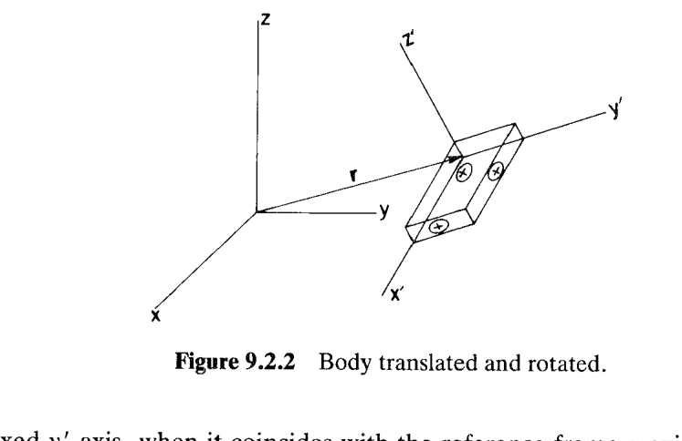
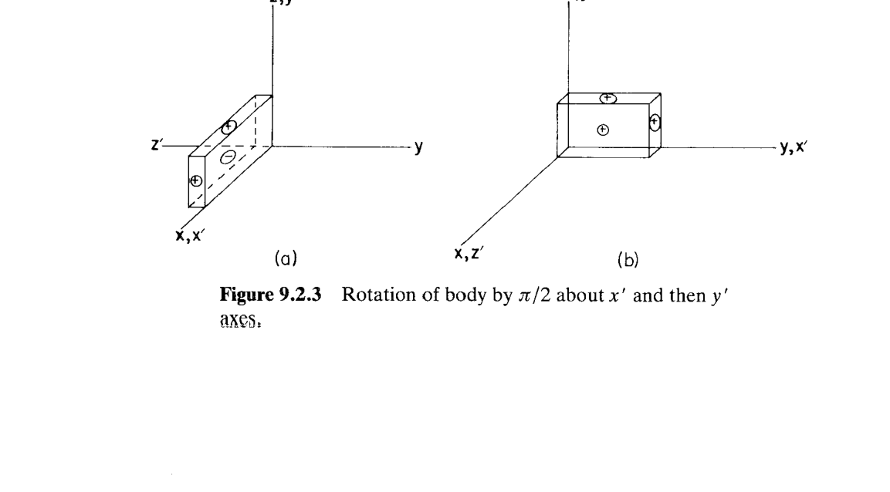
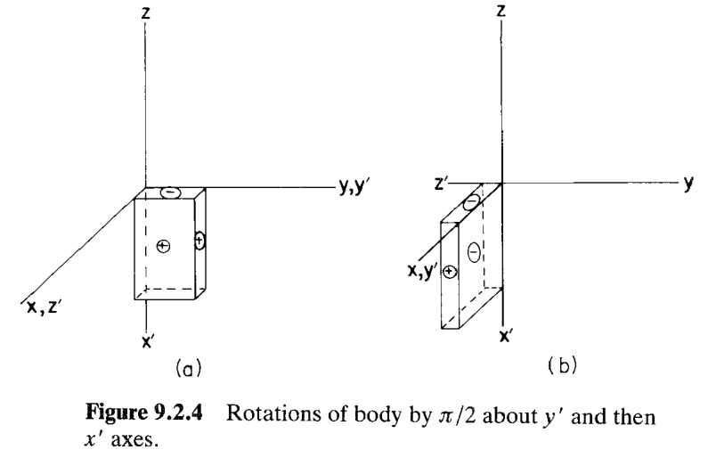
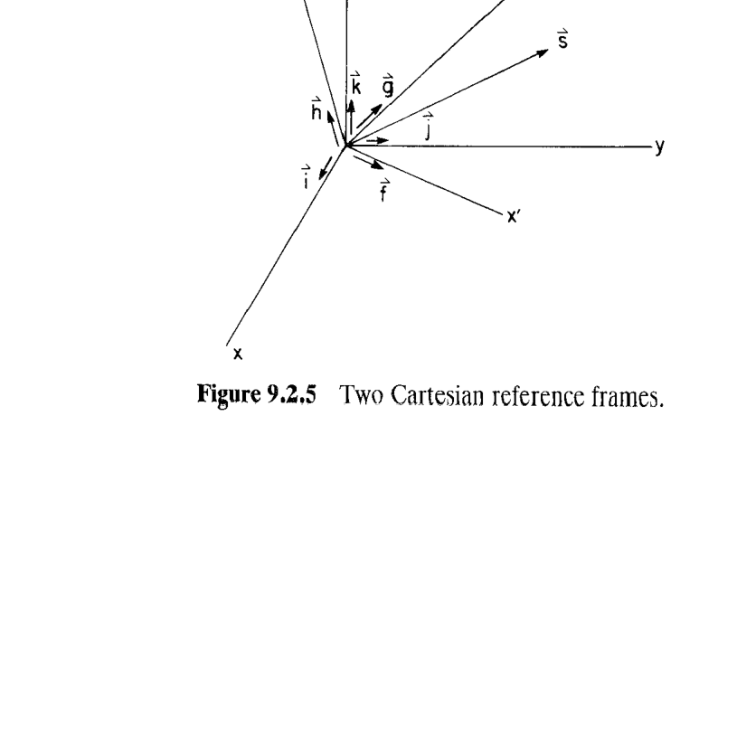
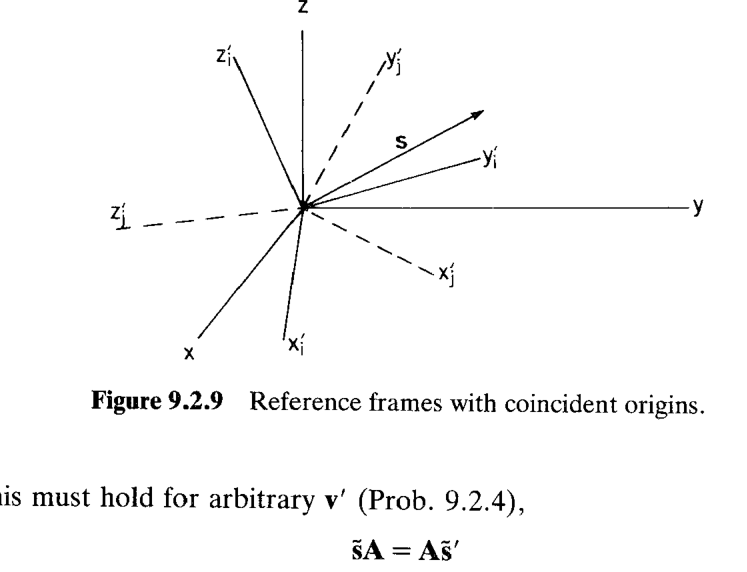

# 9.2 空间刚体运动学（Kinematics of a Rigid Body in Space）

> 来源：*Computer Aided Kinematics and Dynamics of Mechanical Systems, Vol. 1*，第 9 章，9.2 节（书页 317–335）。
> 本文以"文字讲解 + 逐式详细推导"组织，公式推导不跳步骤。

---

## 引言：本节要解决什么

**刚体（rigid body）**定义为一团**彼此不能相对移动**的质点连续体。真实物体从不完美刚硬，但当研究由多个物体组成的机器整体运动时，变形效应通常可忽略，故机器动力学研究几乎都把单个物体建模为刚体。

平面里刚体的**朝向（orientation）**只需一个标量转角 $\phi$；进入空间后，朝向问题变得远为微妙——这正是本节的核心。本节要建立空间刚体**运动学与动力学分析**所需的全部代数关系，主线为：

1. 用**随体参考系（body-fixed reference frame）** $x'\text{-}y'\text{-}z'$ 描述刚体的位置与朝向，并先用一个反例说明**大转动不可交换、不是向量**；
2. 定义**方向余弦矩阵（direction cosine matrix）** $\mathbf{A}$，把两参考系间的坐标变换写成 $\mathbf{s}=\mathbf{As}'$，并证明 $\mathbf{A}$ 是**正交矩阵**；
3. 证明 $\mathbf{A}$ 的九个方向余弦受六个约束，故空间刚体恰有**三个转动自由度**；
4. 建立叉积算子 $\tilde{(\cdot)}$ 与 $\mathbf{A}$ 之间的一组恒等式，以及多参考系间的**合成变换** $\mathbf{A}_{ij}=\mathbf{A}_i^T\mathbf{A}_j$；
5. 对随体系随时间转动求导，得到**角速度（angular velocity）** $\boldsymbol{\omega}$、速度方程、加速度方程；
6. 引入**虚位移 $\delta\mathbf{r}$** 与**虚旋转（virtual rotation）** $\delta\boldsymbol{\pi}$，并证明——**大转动虽非向量，虚旋转与角速度却是向量**，这是后续列写受约束动力学方程的地基。

> 全节的价值：把"空间刚体如何转"这一几何直觉，压进 $\mathbf{A}$、$\tilde{\boldsymbol{\omega}}$、$\delta\tilde{\boldsymbol{\pi}}$ 等标准线性代数对象，使一切可编程、可交给通用程序（DADS）处理。

---

## 一、刚体位置与朝向的参考系

### 思路
先说清楚"用什么描述刚体"，再用一个 $\pi/2$ 转动的反例，揭示空间朝向的第一个陷阱：**转动顺序不可交换**。

三维下的**刚体参考系（body-fixed reference frame）。** 刚体几何通常由体上若干**关键点（key points）**定义，这些点的数据给在一个**固连于刚体**的 $x'\text{-}y'\text{-}z'$ 系里，称为刚体坐标系。

刚体的一般位形（Fig. 9.2.2）由两部分给出：
- **位置（Position / Translation）**——由从 $x\text{-}y\text{-}z$ 原点指向 $x'\text{-}y'\text{-}z'$ 原点的向量 $\mathbf{r}$ 描述，简单；
- **朝向（Rotation）**——远为复杂，是本节主攻对象。一旦 $x'\text{-}y'\text{-}z'$ 相对 $x\text{-}y\text{-}z$ 定向确定，体上所有点都能在 $x\text{-}y\text{-}z$ 中定出。

### 转动顺序不可交换
考虑从参考位置出发，绕**随体轴**各做 $\pi/2$ 转动，比较两种顺序：

**顺序一（Fig. 9.2.3）**：先绕随体 $x'$ 轴（初与参考 $x$ 轴重合）转 $\pi/2$，再绕随体 $y'$ 轴（此时它与参考 $z$ 轴重合）转 $\pi/2$，结果朝向见 Fig. 9.2.3b。

**顺序二（Fig. 9.2.4）**：先绕随体 $y'$ 轴（初与参考 $y$ 轴重合）转 $\pi/2$，再绕随体 $x'$ 轴（此时它与参考 $-z$ 轴重合）转 $\pi/2$，结果见 Fig. 9.2.4b。

Fig. 9.2.3b 与 9.2.4b 的最终朝向**明显不同**。这说明**转动的顺序至关重要**——与矩阵乘法中因子顺序不可换如出一辙。由此得到关键结论：

> 大幅值转动不是向量，转动的合成不能通过简单的向量叠加。转动的合成不满足交换律，顺序不能颠倒。（This shows that large-amplitude rotaton is not a vector quantity, since the order of rotations is not commutative; that is orders of rotation cannot be inverted）

---

## 二、坐标变换与方向余弦矩阵

如上图，记 $x',y',z'$ 轴单位向量为 $\vec{f},\vec{g},\vec{h}$，$x,y,z$ 轴单位向量为 $\vec{i},\vec{j},\vec{k}$。同一向量 $\vec{s}$ 有两种表示：

$$\vec{s}=s_x\vec{i}+s_y\vec{j}+s_z\vec{k} \tag{9.2.1}$$

$$\vec{s}=s_{x'}\vec{f}+s_{y'}\vec{g}+s_{z'}\vec{h} \tag{9.2.2}$$

两个参考坐标系里，向量 $\vec{s}$ 的代数向量分别为

$$\mathbf{s}=[s_x,s_y,s_z]^T \tag{9.2.5}$$

$$\mathbf{s}'=[s_{x'},s_{y'},s_{z'}]^T \tag{9.2.6}$$

### 推导变换关系 s = As′
要把 $\mathbf{s}'$ 换成 $\mathbf{s}$，先把 $\vec{f},\vec{g},\vec{h}$ 用 $\vec{i},\vec{j},\vec{k}$ 展开：

$$
\begin{aligned}
\vec{f}&=a_{11}\vec{i}+a_{21}\vec{j}+a_{31}\vec{k}\\
\vec{g}&=a_{12}\vec{i}+a_{22}\vec{j}+a_{32}\vec{k}\\
\vec{h}&=a_{13}\vec{i}+a_{23}\vec{j}+a_{33}\vec{k}
\end{aligned}
\tag{9.2.7}
$$

其中系数 $a_{ij}$ 如下：

$$
\begin{aligned}
&a_{11}=\vec{i}\cdot\vec{f}=\cos\theta(\vec{i},\vec{f}),\quad
a_{12}=\vec{i}\cdot\vec{g}=\cos\theta(\vec{i},\vec{g}),\quad
a_{13}=\vec{i}\cdot\vec{h}=\cos\theta(\vec{i},\vec{h})\\
&a_{21}=\vec{j}\cdot\vec{f},\quad a_{22}=\vec{j}\cdot\vec{g},\quad a_{23}=\vec{j}\cdot\vec{h}\\
&a_{31}=\vec{k}\cdot\vec{f},\quad a_{32}=\vec{k}\cdot\vec{g},\quad a_{33}=\vec{k}\cdot\vec{h}
\end{aligned}
\tag{9.2.8}
$$

对比得到两个坐标系下的代数向量的关系：

$$\boxed{\;\mathbf{s}=\mathbf{As}'\;} \tag{9.2.10}$$

其中 $\mathbf{A}$ 称为**方向余弦矩阵（direction cosine matrix）**或**旋转变换矩阵（rotation transformation matrix）**：

$$
\mathbf{A}=\begin{bmatrix}a_{11}&a_{12}&a_{13}\\ a_{21}&a_{22}&a_{23}\\ a_{31}&a_{32}&a_{33}\end{bmatrix}
\tag{9.2.11}
$$

### A 的列就是刚体坐标系的坐标轴向量
对比 (9.2.7) 和 (9.2.11)，$\vec{f},\vec{g},\vec{h}$ 在 $x\text{-}y\text{-}z$ 系里的分量恰好是 $\mathbf{A}$ 的三列：

$$
\mathbf{f}=[a_{11},a_{21},a_{31}]^T,\quad
\mathbf{g}=[a_{12},a_{22},a_{32}]^T,\quad
\mathbf{h}=[a_{13},a_{23},a_{33}]^T
$$

因此 $\mathbf{A}$ 可写成如下形式：

$$\boxed{\;\mathbf{A}=[\mathbf{f},\mathbf{g},\mathbf{h}]\;} \tag{9.2.13}$$

### 正交性 AᵀA = I
因 $\mathbf{f},\mathbf{g},\mathbf{h}$ 是**单位正交**向量组，容易得到：

$$\boxed{\;\mathbf{A}^T\mathbf{A}=\mathbf{I}\;} \tag{9.2.14}$$

故 $\mathbf{A}^T=\mathbf{A}^{-1}$，$\mathbf{A}$ 是**正交矩阵（orthogonal matrix）**。于是 (9.2.10) 的逆变换只需转置：

$$\boxed{\;\mathbf{s}'=\mathbf{A}^T\mathbf{s}\;} \tag{9.2.15}$$

### 平移 + 转动
当刚体坐标系和世界坐标系的原点不重合时（如 Fig. 9.2.7），设 $\mathbf{s}'^P$ 是点 $P$ 在 $x'\text{-}y'\text{-}z'$ 系里的坐标，则有：

$$\boxed{\;\mathbf{r}^P=\mathbf{r}+\mathbf{As}'^P\;} \tag{9.2.16}$$

这是**空间刚体上任一点位置**的基本公式。

---

## 三、空间刚体有三个转动自由度

旋转变换矩阵 $\mathbf{A}$ 有九个变量，但它们**并不独立**。本节利用约束函数的雅可比秩，证明了其包含了 6 个约束，因此自由度为 3。

本总结跳过了证明过程。

尽管九个变量**可以**当广义坐标，但既不实用也不方便，故需另寻朝向广义坐标（9.3 节的欧拉参数）。

---

## 四、波浪号–变换恒等式与参考系合成

### 叉乘矩阵的坐标系变换
注意到叉乘具有几何属性，与坐标系无关，因此 $x'\text{-}y'\text{-}z'$ 系里的任意两向量 $\mathbf{s}',\mathbf{v}'$，在 $x\text{-}y\text{-}z$ 系里作叉积**等于**在 $x'\text{-}y'\text{-}z'$ 系里作叉积再变换过来：

$$\tilde{\mathbf{s}}\mathbf{v}=\mathbf{A}(\tilde{\mathbf{s}}'\mathbf{v}')$$

将 $\mathbf{v}=\mathbf{Av}'$ 代入：

$$(\tilde{\mathbf{s}}\mathbf{A})\mathbf{v}'=(\mathbf{A}\tilde{\mathbf{s}}')\mathbf{v}'$$

因对任意 $\mathbf{v}'$ 成立，两侧矩阵相等：

$$\tilde{\mathbf{s}}\mathbf{A}=\mathbf{A}\tilde{\mathbf{s}}'$$

右乘 $\mathbf{A}^T$ 并注意到 $\mathbf{A}\mathbf{A}^T=\mathbf{I}$，得到：

$$\widetilde{(\mathbf{As}')}=\tilde{\mathbf{s}}=\mathbf{A}\tilde{\mathbf{s}}'\mathbf{A}^T \tag{9.2.21}$$

$$\widetilde{(\mathbf{A}^T\mathbf{s})}=\tilde{\mathbf{s}}'=\mathbf{A}^T\tilde{\mathbf{s}}\mathbf{A} \tag{9.2.22}$$

即：反对称矩阵 $\tilde{\mathbf{s}}$ 在两系间的变换是**相似变换** $\mathbf{A}(\cdot)\mathbf{A}^T$，而不是简单的 $\mathbf{A}(\cdot)$。

### 刚体坐标系之间的变换矩阵
考虑两个刚体坐标系 $x_i'\text{-}y_i'\text{-}z_i'$ 与 $x_j'\text{-}y_j'\text{-}z_j'$（如图 Fig. 9.2.9），其原点都和世界坐标系原点重合。同一向量 $\mathbf{s}$ 在两系里分别为 $\mathbf{s}_i'$、$\mathbf{s}_j'$，$\mathbf{A}_i,\mathbf{A}_j$ 是各自到 $x\text{-}y\text{-}z$ 的变换：

$$\mathbf{s}=\mathbf{A}_i\mathbf{s}_i'=\mathbf{A}_j\mathbf{s}_j' \tag{9.2.23}$$

由 $\mathbf{A}_i$ 正交，左乘 $\mathbf{A}_i^T$：

$$\mathbf{s}_i'=\mathbf{A}_i^T\mathbf{A}_j\mathbf{s}_j'\equiv\mathbf{A}_{ij}\mathbf{s}_j'$$

因 $\mathbf{s}_j'$ 任意，得从刚体坐标系 $j$ 到刚体坐标系 $i$ 的**变换矩阵**：

$$\boxed{\;\mathbf{A}_{ij}=\mathbf{A}_i^T\mathbf{A}_j\;} \tag{9.2.25}$$

直接计算可验 $\mathbf{A}_{ij}$ 也是正交矩阵。

---

## 五、速度、加速度与角速度

### 速度方程

#### - 速度表达式

刚体上一点 $P$，其坐标 $\mathbf{s}'^P$ 在刚体坐标系里**恒定**（Fig. 9.2.11），其在全局坐标系中的坐标为

$$\mathbf{r}^P=\mathbf{r}+\mathbf{As}'^P$$

求时间导数（$\mathbf{s}'^P$ 常量，只 $\mathbf{r},\mathbf{A}$ 含时间）：

$$\dot{\mathbf{r}}^P=\dot{\mathbf{r}}+\dot{\mathbf{A}}\mathbf{s}'^P \tag{9.2.33}$$$

代入 (9.2.15) $\mathbf{s}'^P=\mathbf{A}^T\mathbf{s}^P$：

$$\dot{\mathbf{r}}^P=\dot{\mathbf{r}}+\dot{\mathbf{A}}\mathbf{A}^T\mathbf{s}^P \tag{9.2.34}$$

#### - 证明 $\dot{\mathbf{A}}\mathbf{A}^T$ 是**反对称矩阵**

注意到 9.2.14 公式 $\mathbf{A}\mathbf{A}^T=\mathbf{I}$，对其求导：

$$\dot{\mathbf{A}}\mathbf{A}^T+\mathbf{A}\dot{\mathbf{A}}^T=\mathbf{0}$$

注意 $\mathbf{A}\dot{\mathbf{A}}^T=(\dot{\mathbf{A}}\mathbf{A}^T)^T$，故

$$(\dot{\mathbf{A}}\mathbf{A}^T)^T=\mathbf{A}\dot{\mathbf{A}}^T=-\dot{\mathbf{A}}\mathbf{A}^T$$

即 $\dot{\mathbf{A}}\mathbf{A}^T$ 是**反对称矩阵**。

#### - 定义角速度
注意到，任何 $3\times3$ 反对称矩阵都对应一个向量的 tilde 算子。我们将 $\dot{\mathbf{A}}\mathbf{A}^T$ 对应的向量记之为 $\boldsymbol{\omega}$，称为 $x'\text{-}y'\text{-}z'$ 系的**角速度（angular velocity）**：

$$\boxed{\;\tilde{\boldsymbol{\omega}}=\dot{\mathbf{A}}\mathbf{A}^T\;} \tag{9.2.36}$$

#### - 速度方程
代回 (9.2.34) 得**速度方程**：

$$\boxed{\;\dot{\mathbf{r}}^P=\dot{\mathbf{r}}+\tilde{\boldsymbol{\omega}}\mathbf{s}^P\;} \tag{9.2.37}$$

写为几何形式即为：

$$\dot{\vec{r}}^P=\dot{\vec{r}}+\vec{\omega}\times\vec{s}^P$$

其中 $\vec\omega$ 是刚体坐标系相对全局参考系的角速度。
把坐标和角速度换成刚体坐标系下的代数向量，套用 $\tilde{\boldsymbol{\omega}}=\mathbf{A}\tilde{\boldsymbol{\omega}}'\mathbf{A}^T$ 与 $\mathbf{s}^P=\mathbf{As}'^P$：

$$\dot{\mathbf{r}}^P=\dot{\mathbf{r}}+\mathbf{A}\tilde{\boldsymbol{\omega}}'\mathbf{s}'^P \tag{9.2.38}$$

### 旋转变换矩阵 A 与角速度的关系
(9.2.36) 右乘 $\mathbf{A}$，用 $\mathbf{A}^T\mathbf{A}=\mathbf{I}$：

$$\boxed{\;\dot{\mathbf{A}}=\tilde{\boldsymbol{\omega}}\mathbf{A}\;} \tag{9.2.39}$$

注意到 $\tilde{\boldsymbol{\omega}}=\mathbf{A}\tilde{\boldsymbol{\omega}}'\mathbf{A}^T$，得到：

$$\dot{\mathbf{A}}=\mathbf{A}\tilde{\boldsymbol{\omega}}'\mathbf{A}^T\mathbf{A}=\mathbf{A}\tilde{\boldsymbol{\omega}}'$$

于是并列两式：

$$\boxed{\;\dot{\mathbf{A}}=\mathbf{A}\tilde{\boldsymbol{\omega}}',\qquad \tilde{\boldsymbol{\omega}}'=\mathbf{A}^T\dot{\mathbf{A}}\;} \tag{9.2.40}$$

(9.2.39)、(9.2.40) 是 $\dot{\mathbf{A}}$ 与角速度间最常用的桥梁。

### 加速度方程
对 (9.2.33) 再求一次导：

$$\ddot{\mathbf{r}}^P=\ddot{\mathbf{r}}+\ddot{\mathbf{A}}\mathbf{s}'^P \tag{9.2.41}$$

显然 $\ddot{\mathbf{A}}$ 就是角加速度。为了求 $\ddot{\mathbf{A}}$，对 $\dot{\mathbf{A}}=\tilde{\boldsymbol{\omega}}\mathbf{A}$ 求导：

$$
\ddot{\mathbf{A}}=\dot{\tilde{\boldsymbol{\omega}}}\mathbf{A}+\tilde{\boldsymbol{\omega}}\dot{\mathbf{A}}
=\dot{\tilde{\boldsymbol{\omega}}}\mathbf{A}+\tilde{\boldsymbol{\omega}}\tilde{\boldsymbol{\omega}}\mathbf{A}
\tag{9.2.42}
$$

类似于 (9.2.40) ，可以得到：

$$\ddot{\mathbf{A}}=\mathbf{A}\dot{\tilde{\boldsymbol{\omega}}}'+\mathbf{A}\tilde{\boldsymbol{\omega}}'\tilde{\boldsymbol{\omega}}' \tag{9.2.43}$$

### 例 9.2.4：平面转动的角速度
> 考虑一刚体绕全局 $z$ 轴以转角 $\phi(t)$ 做**平面转动**，即随体系 $x'\text{-}y'\text{-}z'$ 与全局系 $x\text{-}y\text{-}z$ 共用 $z=z'$ 轴，$x',y'$ 相对 $x,y$ 转过角 $\phi$。由 (9.2.13)（$\mathbf{A}$ 的三列即随体轴单位向量在全局系里的分量）可直接写出方向余弦矩阵：
>
> $$
> \mathbf{A}(\phi)=\begin{bmatrix}\cos\phi&-\sin\phi&0\\ \sin\phi&\cos\phi&0\\ 0&0&1\end{bmatrix}
> \tag{9.2.17}
> $$
>
> 求此刚体的角速度 $\boldsymbol{\omega}$ 及其在随体系里的表示 $\boldsymbol{\omega}'$。

先算 $\dot{\mathbf{A}}$（对 $\phi$ 求导再乘 $\dot\phi$，矩阵求导可以参考 §2.5）：

$$\dot{\mathbf{A}}=\frac{\partial{\mathbf{A}}}{\partial\phi}\dot\phi=\begin{bmatrix}-\sin\phi&-\cos\phi&0\\ \cos\phi&-\sin\phi&0\\0&0&0\end{bmatrix}\dot\phi$$

将上式代入 (9.2.36) $\tilde{\boldsymbol{\omega}}=\dot{\mathbf{A}}\mathbf{A}^T$，计算得到：

$$
\tilde{\boldsymbol{\omega}}=\dot{\mathbf{A}}\mathbf{A}^T
=\begin{bmatrix}0&-\dot\phi&0\\\dot\phi&0&0\\0&0&0\end{bmatrix}
$$

对照 tilde 定义，反对称矩阵 $\begin{bmatrix}0&-\omega_z&\omega_y\\ \omega_z&0&-\omega_x\\ -\omega_y&\omega_x&0\end{bmatrix}$，得到：

$$\boldsymbol{\omega}=[0,0,\dot\phi]^T$$
$$\boldsymbol{\omega}'=\mathbf{A}^T\boldsymbol{\omega}=[0,0,\dot\phi]^T$$

### 例 9.2.5：平面转动点的速度与加速度
> 接例子 9.2.4，现在刚体坐标系中有一点 $P$，坐标为 $\mathbf{s}'^P=[1,1,1]^T$，求该点在世界坐标系下的速度与加速度。

**速度**：由于刚体坐标系原点在世界空间中不运动，因此 $\mathbf{r}=\dot{\mathbf{r}}=0$，代入速度方程 9.2.38，得到：

$$
\dot{\mathbf{r}}^P=\mathbf{A}\tilde{\boldsymbol{\omega}}'\mathbf{s}'^P
=[-\cos\phi-\sin\phi,\;\cos\phi-\sin\phi,\;0]^T\,\dot\phi
$$

**加速度**：同理，$\ddot{\mathbf{r}}=0$，代入加速度方程  (9.2.41)+(9.2.42) 得到：

$$
\ddot{\mathbf{r}}^P=\ddot{\mathbf{A}}\mathbf{s}'^P
=(\dot{\tilde{\boldsymbol{\omega}}}\mathbf{A}+\tilde{\boldsymbol{\omega}}\tilde{\boldsymbol{\omega}}\mathbf{A})\mathbf{s}'^P=\begin{bmatrix}-\cos\phi-\sin\phi\\ \cos\phi-\sin\phi\\ 0\end{bmatrix}\ddot\phi
+\begin{bmatrix}\sin\phi-\cos\phi\\ -\cos\phi-\sin\phi\\ 0\end{bmatrix}\dot\phi^2
$$

---

## 六、虚位移与虚旋转

### 思路
虚位移是"时间冻结、无穷小"的位移变分（6.1 节）。刚体上点 $P$ 的虚位移 = 随体系原点的虚位移 $\delta\mathbf{r}$ + 方向余弦的变分 $\delta\mathbf{A}$。本小节的核心结论：**虚旋转 $\delta\boldsymbol{\pi}$ 是向量**——尽管大转动不是（第一节反例）。这是列写受约束系统虚功、动力学方程的关键。

### 虚旋转 $\delta\boldsymbol{\pi}$ 的引入
假定刚体发生了虚位移，则其旋转变换矩阵也会受到扰动，记录为 $\mathbf{A}\to\mathbf{A}+\delta\mathbf{A}+O(\delta\mathbf{A}^2)$。

注意到，$\mathbf{A}$ 扰动后仍须满足正交性质：

$$
(\mathbf{A}+\delta\mathbf{A}+0(\delta\mathbf{A}^2))(\mathbf{A}+\delta\mathbf{A}+0(\delta\mathbf{A}^2))^T
=\mathbf{A}\mathbf{A}^T+\mathbf{A}\,\delta\mathbf{A}^T+\delta\mathbf{A}\,\mathbf{A}^T+\delta\mathbf{A}\,\delta\mathbf{A}^T+0(\delta\mathbf{A}^2)=\mathbf{I}
$$

由 $\mathbf{A}\mathbf{A}^T=\mathbf{I}$ ，并把二阶以上的小量舍去，得到：
$$\mathbf{A}\,\delta\mathbf{A}^T+\delta\mathbf{A}\,\mathbf{A}^T=\mathbf{0} $$

注意到 $\mathbf{A}\,\delta\mathbf{A}^T=(\delta\mathbf{A}\,\mathbf{A}^T)^T$，由上式容易看出 $\delta\mathbf{A}\,\mathbf{A}^T$ 是**反对称矩阵**，故可表示为某向量 $\delta\boldsymbol{\pi}$ 的 tilde：

$$\delta\mathbf{A}\,\mathbf{A}^T=\delta\tilde{\boldsymbol{\pi}} \tag{9.2.46}$$

我们将 $\delta\boldsymbol{\pi}$ 称之为**虚旋转**。右乘 $\mathbf{A}$ 得到：

$$\boxed{\;\delta\mathbf{A}=\delta\tilde{\boldsymbol{\pi}}\,\mathbf{A}\;} \tag{9.2.47}$$

### 虚位移公式与虚旋转是向量（(9.2.48)–(9.2.51)）
对 (9.2.32) 取变分（Prob. 9.2.13）：

$$\delta\mathbf{r}^P=\delta\mathbf{r}+\delta\mathbf{A}\,\mathbf{s}'^P \tag{9.2.48}$$

代入 (9.2.47)，并用 $\mathbf{s}^P=\mathbf{As}'^P$：

$$
\delta\mathbf{r}^P=\delta\mathbf{r}+\delta\tilde{\boldsymbol{\pi}}\,\mathbf{As}'^P
=\delta\mathbf{r}+\delta\tilde{\boldsymbol{\pi}}\,\mathbf{s}^P
\tag{9.2.49}
$$

故 $\delta\boldsymbol{\pi}$ 起**转动**的作用，称为 $x'\text{-}y'\text{-}z'$ 系相对 $x\text{-}y\text{-}z$ 系的**虚旋转（virtual rotation）**（分量在后一系里）。再用 $\delta\boldsymbol{\pi}=\mathbf{A}\,\delta\boldsymbol{\pi}'$ 与 (9.2.21) 得随体系形式：

$$
\delta\mathbf{A}=\mathbf{A}\,\delta\tilde{\boldsymbol{\pi}}',\qquad \delta\tilde{\boldsymbol{\pi}}'=\mathbf{A}^T\delta\mathbf{A}
\tag{9.2.50}
$$

代回 (9.2.48)：

$$\delta\mathbf{r}^P=\delta\mathbf{r}+\mathbf{A}\,\delta\tilde{\boldsymbol{\pi}}'\mathbf{s}'^P \tag{9.2.51}$$

这**证实虚旋转是向量量**。此结论极其重要：

> **大转动不是向量（第一节），但虚旋转与角速度是向量。** 无穷小转动可交换、可相加，故 $\delta\boldsymbol{\pi}$、$\boldsymbol{\omega}$ 具备向量性——这正是能对空间刚体列写"广义力·虚位移"型虚功方程的前提。

### 固连向量的变分 (9.2.52)–(9.2.53)
对固连于随体系的向量 $\mathbf{s}'$（$\mathbf{s}'$ 常量、$\delta\mathbf{s}'=\mathbf{0}$），其全局表示 $\mathbf{s}=\mathbf{As}'$ 的变分：

$$\delta\mathbf{s}=\delta\mathbf{A}\,\mathbf{s}'=\mathbf{A}\,\delta\tilde{\boldsymbol{\pi}}'\mathbf{s}' \tag{9.2.52}$$

用反交换律 (9.1.25) $\tilde{\mathbf{a}}\mathbf{b}=-\tilde{\mathbf{b}}\mathbf{a}$（把 $\delta\tilde{\boldsymbol{\pi}}'\mathbf{s}'=-\tilde{\mathbf{s}}'\delta\boldsymbol{\pi}'$）：

$$\delta\mathbf{s}=-\mathbf{A}\tilde{\mathbf{s}}'\,\delta\boldsymbol{\pi}' \tag{9.2.53}$$

### δ 作为微分算子——运算法则 (9.2.54)–(9.2.57)
虚位移/虚旋转的 $\delta$ 记号可解释为微积分里的**偏微分算子**（时间冻结）。若向量 $\mathbf{h}(\mathbf{q})$ 光滑依赖变量 $\mathbf{q}$，则 $\delta\mathbf{h}=\mathbf{h}_\mathbf{q}\,\delta\mathbf{q}$。即便 $\mathbf{q}$ 尚未定义，$\delta\mathbf{h}$ 也已良定义，因为线性微分算子遵守与偏导同样的法则：

**和**：

$$\delta(\mathbf{g}+\mathbf{h})=\delta\mathbf{g}+\delta\mathbf{h} \tag{9.2.54}$$

**点积（乘积法则，类比 Eq. 2.5.13）**：

$$\delta(\mathbf{g}^T\mathbf{h})=\mathbf{h}^T\delta\mathbf{g}+\mathbf{g}^T\delta\mathbf{h} \tag{9.2.55}$$

**叉积**（因 tilde 线性 (9.1.32)，$\delta$ 与 $\tilde{(\cdot)}$ 可交换次序）：

$$
\delta(\tilde{\mathbf{g}}\mathbf{h})=\delta\tilde{\mathbf{g}}\,\mathbf{h}+\tilde{\mathbf{g}}\,\delta\mathbf{h}
=-\tilde{\mathbf{h}}\,\delta\mathbf{g}+\tilde{\mathbf{g}}\,\delta\mathbf{h}
\tag{9.2.56}
$$

（第二步用 (9.1.25)：$\delta\tilde{\mathbf{g}}\,\mathbf{h}=\widetilde{\delta\mathbf{g}}\,\mathbf{h}=-\tilde{\mathbf{h}}\,\delta\mathbf{g}$。）

**三重积**（$\mathbf{g}^T\mathbf{Bh}$，逐项用乘积法则）：

$$
\delta(\mathbf{g}^T\mathbf{Bh})=\delta\mathbf{g}^T\mathbf{Bh}+\mathbf{g}^T\delta\mathbf{B}\,\mathbf{h}+\mathbf{g}^T\mathbf{B}\,\delta\mathbf{h}
=\mathbf{h}^T\mathbf{B}^T\delta\mathbf{g}+\mathbf{g}^T\delta\mathbf{B}\,\mathbf{h}+\mathbf{g}^T\mathbf{B}\,\delta\mathbf{h}
\tag{9.2.57}
$$

（$\delta\mathbf{g}^T\mathbf{Bh}=\mathbf{h}^T\mathbf{B}^T\delta\mathbf{g}$，因标量的转置是其自身。）

> **方法论**：把微积分（$\delta$）与向量分析（$\tilde{(\cdot)}$、点/叉积）耦合起来，能得到几何清晰、又可直接编程的约束线性化结果。这是本书分析空间动力学的核心手法。

### 例 9.2.6：两固连向量正交约束的线性化
> 两向量 $\mathbf{s}_i',\mathbf{s}_j'$ 分别固连于 $i,j$ 随体系，约束它们正交：

$$\Phi=\mathbf{s}_i^T\mathbf{s}_j=0 \tag{9.2.58}$$

取变分，用点积法则 (9.2.55)：

$$\delta\Phi=\mathbf{s}_j^T\delta\mathbf{s}_i+\mathbf{s}_i^T\delta\mathbf{s}_j=0 \tag{9.2.59}$$

代入固连向量变分 (9.2.53)（$\delta\mathbf{s}_i=-\mathbf{A}_i\tilde{\mathbf{s}}_i'\delta\boldsymbol{\pi}_i'$ 等）：

$$\delta\Phi=-(\mathbf{s}_j'^T\mathbf{A}_j^T\mathbf{A}_i\tilde{\mathbf{s}}_i'\,\delta\boldsymbol{\pi}_i'+\mathbf{s}_i'^T\mathbf{A}_i^T\mathbf{A}_j\tilde{\mathbf{s}}_j'\,\delta\boldsymbol{\pi}_j')=0 \tag{9.2.60}$$

这类**线性化约束**在列写受约束动力系统运动方程时价值极大——它把非线性正交条件的变分，写成虚旋转 $\delta\boldsymbol{\pi}_i',\delta\boldsymbol{\pi}_j'$ 的线性组合。

### 例 9.2.7：仅容许绕公共轴相对转动
> Fig. 9.2.10 两系仅可绕公共 $\mathbf{h}_i,\mathbf{h}_j$ 轴相对转动。因虚旋转是向量，无穷小相对转动为

$$\delta\theta\,\mathbf{h}_i=\delta\boldsymbol{\pi}_j-\delta\boldsymbol{\pi}_i$$

两边点乘 $\mathbf{h}_i$（用 $\mathbf{h}_i^T\mathbf{h}_i=1$），并把各向量用各自随体分量与变换矩阵表示：

$$
\delta\theta=\mathbf{h}_i^T(\delta\boldsymbol{\pi}_j-\delta\boldsymbol{\pi}_i)
=\mathbf{h}_i'^T(\mathbf{A}_i^T\mathbf{A}_j\,\delta\boldsymbol{\pi}_j'-\delta\boldsymbol{\pi}_i')
\tag{9.2.61}
$$

同理，**相对角速度**为

$$\dot\theta=\mathbf{h}_i'^T(\mathbf{A}_i^T\mathbf{A}_j\,\boldsymbol{\omega}_j'-\boldsymbol{\omega}_i') \tag{9.2.62}$$

### 例 9.2.8：变分与广义坐标——通向雅可比
> 设朝向由广义坐标 $\mathbf{q}$ 刻画（见 9.3 节欧拉参数），虚旋转与 $\delta\mathbf{q}$ 的关系可写成

$$\delta\boldsymbol{\pi}_i'=\mathbf{B}_i\,\delta\mathbf{q},\qquad \delta\boldsymbol{\pi}_j'=\mathbf{B}_j\,\delta\mathbf{q} \tag{9.2.63}$$

其中 $\mathbf{B}_i,\mathbf{B}_j$ 是依赖 $\mathbf{q}$ 的矩阵。把 (9.2.63) 代入 (9.2.60)：

$$\delta\Phi=-(\mathbf{s}_j'^T\mathbf{A}_j^T\mathbf{A}_i\tilde{\mathbf{s}}_i'\mathbf{B}_i+\mathbf{s}_i'^T\mathbf{A}_i^T\mathbf{A}_j\tilde{\mathbf{s}}_j'\mathbf{B}_j)\,\delta\mathbf{q} \tag{9.2.64}$$

因总微分中 $\delta\mathbf{q}$ 的系数正是 $\partial\Phi/\partial\mathbf{q}$，读出**约束雅可比**：

$$\boxed{\;\frac{\partial\Phi}{\partial\mathbf{q}}=-(\mathbf{s}_j'^T\mathbf{A}_j^T\mathbf{A}_i\tilde{\mathbf{s}}_i'\mathbf{B}_i+\mathbf{s}_i'^T\mathbf{A}_i^T\mathbf{A}_j\tilde{\mathbf{s}}_j'\mathbf{B}_j)\;} \tag{9.2.65}$$

> **一气贯通**：从几何约束 (9.2.58) → 变分 (9.2.60) → 用广义坐标关系 (9.2.63) → 雅可比 (9.2.65)。这正是把空间约束"交给计算机"的完整链条，也是通往 9.3 节欧拉参数广义坐标的自然入口。
