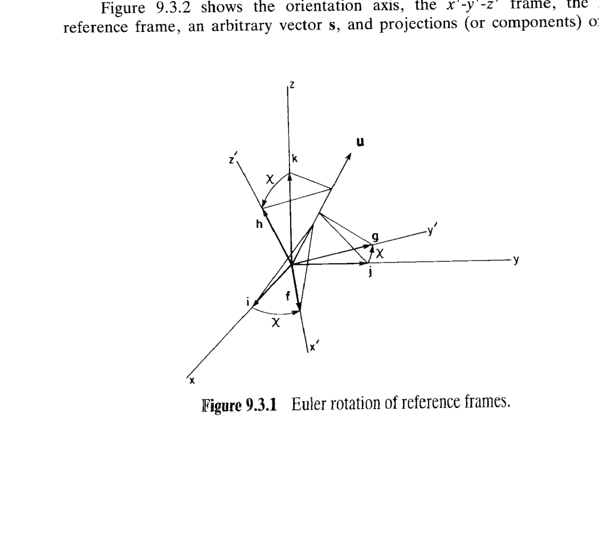
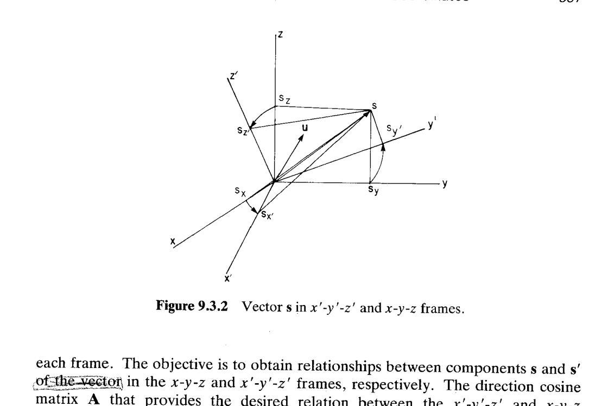
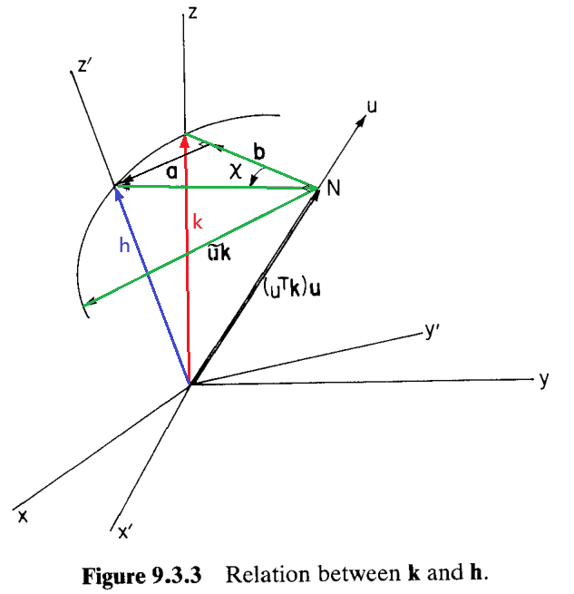
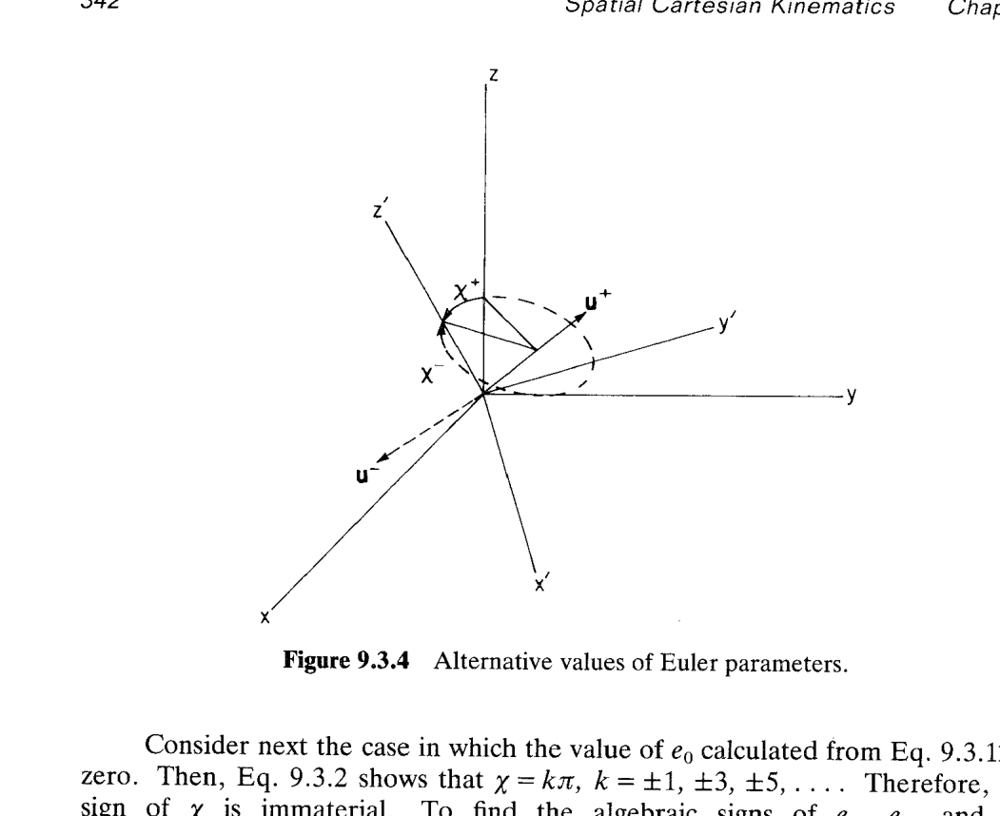

# 9.3 Euler 参数——空间朝向的广义坐标

> 来源：*Computer Aided Kinematics and Dynamics of Mechanical Systems, Vol. 1*，第 9 章，9.3 节（书页 335–347）。
> 本文以"文字讲解 + 逐式详细推导"组织，公式推导不跳步骤。

---

## 引言：本节要解决什么

9.2 节已经证明：空间刚体的朝向可以由 $3\times 3$ 正交方向余弦矩阵 $\mathbf{A}$ 完全描述，只有 **3 个转动自由度**。但直接用 $\mathbf{A}$ 的 9 个元素作广义坐标显然不划算——多出 6 个正交约束、待求变量爆炸。

自然的想法：找一组**参数数目尽量少、约束尽量简单**的**朝向广义坐标（orientation generalized coordinates）**。历史上最著名的两族选择是：

| 选择 | 参数数 | 约束 | 致命缺陷 |
|------|--------|------|----------|
| Euler 角（3-1-3、3-2-1 等） | 3 | 无 | **万向锁（gimbal lock）**——某些朝向下，坐标与朝向的映射奇异；含 $\sec/\cot$ 的微分方程发散 |
| **Euler 参数（Euler parameters）** | 4 | 1 个（$\mathbf{p}^T\mathbf{p}=1$） | **无奇异**；仅有全局符号不定性（$\pm\mathbf{p}$ 描述同一朝向），可用连续性消除 |

本节要建立 Euler 参数——**四元数（quaternion）在多体动力学中的化身**——的完整代数框架：

1. 用 **Euler 定理（Euler's theorem）**：任何朝向都可由**单次绕某轴的转动**给出；这条几何断言把朝向压缩成"轴 $\mathbf{u}$ + 转角 $\chi$"共 4 个自由参数（$\mathbf{u}$ 是单位向量，只有 2 独立分量）。
2. 定义 $e_0\equiv\cos(\chi/2)$、$\mathbf{e}\equiv\mathbf{u}\sin(\chi/2)$，得到 4 元 Euler 参数 $\mathbf{p}=[e_0;\mathbf{e}]$ 与**归一化约束（normalization constraint）** $\mathbf{p}^T\mathbf{p}=1$；导出方向余弦矩阵 $\mathbf{A}(\mathbf{p})$ 的**紧凑二次表达**（Eq. 9.3.6/9.3.7）。
3. 反过来给出**从 $\mathbf{A}$ 提取 $\mathbf{p}$ 的算法**（Eqs. 9.3.12–9.3.16）；澄清 $\pm\mathbf{p}$ 双值性——它是**局部一一对应、全局二值**的映射。
4. 引入两个奇妙的 $3\times 4$ 矩阵 $\mathbf{E},\mathbf{G}$，把 $\mathbf{A}$ 分解为 $\mathbf{A}=\mathbf{E}\mathbf{G}^T$——**二次的 $\mathbf{A}$ 变成两个线性因子之积**，动力学建方程时反复调用。
5. 由此立即导出**角速度—Euler 参数导数**关系 $\boldsymbol{\omega}'=2\mathbf{G}\dot{\mathbf{p}}$、$\dot{\mathbf{p}}=\tfrac12\mathbf{G}^T\boldsymbol{\omega}'$ 等一整套公式（Eqs. 9.3.33–9.3.37）；再把时间导数替换为变分，得到**变分—虚旋转**关系（Eqs. 9.3.38–9.3.44）。
6. 用**微分形式的精确性判据（exactness test）**证明：虚旋转 $\delta\boldsymbol{\pi}'$ 与角速度 $\boldsymbol{\omega}'$ **都不是任何函数的（全）微分**——所以角速度在动力学文献里被称为**准坐标（quasi-coordinate）**。

> 全节的实用价值：把"空间朝向"这个几何对象，压进 4 个平滑变量 $\mathbf{p}$ 与一条二次约束，从此**位置、速度、加速度、虚位移的方程都可以对 $\mathbf{p}$ 求偏导**，交给 DADS/N-R 求解器统一处理。

---

## 一、Euler 定理与旋转关系

### 思路

要用"最少参数"描述朝向，先问：任意朝向的达成，最少需要几次转动？Euler 定理给出惊人答案——**只需绕一根合适的轴转一次**。这就把"3 个转动自由度"具象为"轴向 $\mathbf{u}$（2 参数）+ 转角 $\chi$（1 参数）"共 3 个几何量。定理的证明依赖 $\mathbf{A}$ 是正交矩阵这一性质：$\mathbf{A}$ 的特征多项式恒有一个特征值为 1，对应的特征向量正是转轴 $\mathbf{u}$。

### Euler 定理

> **Euler 定理**：若两个右手笛卡尔参考系原点重合，则可以通过**绕某轴的单次旋转**使二者重合。

- 转轴称为**朝向轴（orientation axis）**，用单位向量 $\mathbf{u}$ 标记
- 渲染的角度记为 $\chi$，正负判断使用右手规则（之前有提过，本书均采用右手坐标系）。
- 若把 $\mathbf{u}$ 取反（$\mathbf{u}\to-\mathbf{u}$），则原来的 $\chi$ 变为 $2\pi-\chi$——即，**同一朝向可由 $(\mathbf{u},\chi)$ 与 $(-\mathbf{u},2\pi-\chi)$ 两种方式实现**。

图 9.3.1 展示了对 $\mathbf{u}$ 的正交投影：$\mathbf{i}\text{-}\mathbf{f}$、$\mathbf{j}\text{-}\mathbf{g}$、$\mathbf{k}\text{-}\mathbf{h}$ 三对方向余弦向量在 $\mathbf{u}$ 上的投影长度都相等——正是"绕 $\mathbf{u}$ 转过同一角 $\chi$"的几何证据。

### 从几何图导出 $\mathbf{h}$ 的向量表达

**目标**：把 $\mathbf{h}=\mathbf{A}\mathbf{k}$ 用 $\mathbf{u},\chi,\mathbf{k}$ 表达。$\mathbf{f}\text{-}\mathbf{i}$、$\mathbf{g}\text{-}\mathbf{j}$ 与之完全同构。

图 9.3.2 只是**同一向量 $\tilde s$ 分别在两个笛卡尔系里的分量分解**——为后面导出 $\mathbf{A}=[\mathbf{f},\mathbf{g},\mathbf{h}]$ 关系铺垫。

如图 9.3.3 所示，$\mathbf{h}=\mathbf{A}\mathbf{k}$，根据欧拉定理，可以找到旋转轴 $\mathbf{u}$，使得 $\mathbf{k}$ 绕 $\mathbf{u}$ 转 $\chi$ 得到 $\mathbf{h}$。
下面将找到 $\mathbf{A}$ 和 $\mathbf{u},\chi,\mathbf{k}$ 之间的关系。
- **沿 $\mathbf{u}$ 的分量**：$\mathbf{k}$ 在 $\mathbf{u}$ 方向的投影 $(\mathbf{u}^T\mathbf{k})\mathbf{u}$；旋转不改变它，故 $\mathbf{h}$ 中的 $\mathbf{u}$ 分量也是 $(\mathbf{u}^T\mathbf{k})\mathbf{u}$。
- **垂直 $\mathbf{u}$ 的分量**：$\mathbf{k}-(\mathbf{u}^T\mathbf{k})\mathbf{u}$ 是从 $N$ 到 $\mathbf{k}$ 尖端的向量。这部分会发生旋转。
- **向量 $\mathbf{a}$**：
  - **方向**：与 $\mathbf{u}$ 及 $\mathbf{k}$ 都垂直，因此是 $\tilde{\mathbf{u}}\mathbf{k}$ 方向
  - **长度**：三条绿色线段的长度都是旋转半径 $|\mathbf{k}-(\mathbf{u}^T\mathbf{k})\mathbf{u}|=|\tilde{\mathbf{u}}\mathbf{k}|$（相等证明见下方附录），因此长度是 $|\tilde{\mathbf{u}}\mathbf{k}|\sin\chi$
  - 由此可以得到 $\mathbf{a}=\tilde{\mathbf{u}}\mathbf{k}\sin\chi$
- **向量 $\mathbf{b}$**：
  - **方向**：沿 $\mathbf{k}-(\mathbf{u}^T\mathbf{k})\mathbf{u}$ 方向
  - **长度**：类似于 $\mathbf{a}$，长度是 $|\tilde{\mathbf{u}}\mathbf{k}|\cos\chi=|\mathbf{k}-(\mathbf{u}^T\mathbf{k})\mathbf{u}|\cos\chi$
  - 由此可以得到：$\mathbf{b}=[\mathbf{k}-(\mathbf{u}^T\mathbf{k})\mathbf{u}]\cos\chi$

于是得到：
$$
\mathbf{h}=(\mathbf{u}^T\mathbf{k})\mathbf{u}+\mathbf{b}+\mathbf{a}=(\mathbf{u}^T\mathbf{k})\mathbf{u}+[\mathbf{k}-(\mathbf{u}^T\mathbf{k})\mathbf{u}]\cos\chi+\tilde{\mathbf{u}}\mathbf{k}\sin\chi
$$

重整项得**Rodrigues 公式（旋转公式的向量形式）**：

$$
\boxed{\;\mathbf{h}=\mathbf{k}\cos\chi+(\mathbf{u}^T\mathbf{k})\mathbf{u}(1-\cos\chi)+(\tilde{\mathbf{u}}\mathbf{k})\sin\chi\;}\tag{9.3.1}
$$

> Ronin附录：若记 $\theta$ 是 $\mathbf{u}$ 与 $\mathbf{k}$ 的夹角，注意到 $\mathbf{u}$ 是单位向量，则有 $|\mathbf{u}\times\mathbf{k}|=|\mathbf{k}|\sin\theta$。
> 另一方面，$\mathbf{k}-(\mathbf{u}^T\mathbf{k})\mathbf{u}$ 是 $\mathbf{k}$ 在垂直于 $\mathbf{u}$ 的平面上的投影，有 $|\mathbf{k}-(\mathbf{u}^T\mathbf{k})\mathbf{u}|=|\mathbf{k}|\sin\theta$ 。
> 因此 $|\mathbf{k}-(\mathbf{u}^T\mathbf{k})\mathbf{u}|=|\mathbf{u}\times\mathbf{k}|$。

### 用半角化简，引出 Euler 参数

关键三个三角恒等式：

$$
1-\cos\chi=2\sin^2\tfrac{\chi}{2},\quad \sin\chi=2\sin\tfrac{\chi}{2}\cos\tfrac{\chi}{2},\quad \cos\chi=2\cos^2\tfrac{\chi}{2}-1
$$

代入 (9.3.1)：

$$
\mathbf{h}=\mathbf{k}\!\left(2\cos^2\tfrac{\chi}{2}-1\right)+2\mathbf{u}(\mathbf{u}^T\mathbf{k})\sin^2\tfrac{\chi}{2}+2\tilde{\mathbf{u}}\mathbf{k}\sin\tfrac{\chi}{2}\cos\tfrac{\chi}{2}\tag{9.3.3}
$$

现在**定义 4 个 Euler 参数**：

$$
\boxed{\;e_0\equiv\cos\tfrac{\chi}{2},\qquad \mathbf{e}\equiv\begin{bmatrix}e_1\\e_2\\e_3\end{bmatrix}\equiv\mathbf{u}\sin\tfrac{\chi}{2}\;}\tag{9.3.2}
$$

把 (9.3.2) 代入 (9.3.3) 逐项化简：
- 第一项系数 $2\cos^2(\chi/2)-1=2e_0^2-1$，故第一项 $=(2e_0^2-1)\mathbf{k}$；
- 第二项 $2\mathbf{u}(\mathbf{u}^T\mathbf{k})\sin^2(\chi/2)=2\bigl(\mathbf{u}\sin\tfrac{\chi}{2}\bigr)\bigl(\mathbf{u}\sin\tfrac{\chi}{2}\bigr)^T\mathbf{k}=2\mathbf{e}\mathbf{e}^T\mathbf{k}$；
- 第三项 $2\tilde{\mathbf{u}}\mathbf{k}\sin(\chi/2)\cos(\chi/2)=2\bigl(\mathbf{u}\sin\tfrac{\chi}{2}\bigr)^\sim\!\mathbf{k}\,\cos\tfrac{\chi}{2}=2e_0\tilde{\mathbf{e}}\mathbf{k}$（$\sim$ 是 $\mathbf{u}\sin(\chi/2)=\mathbf{e}$ 对应的反对称算子，标量 $\cos(\chi/2)=e_0$ 提到前面）。

三项相加把公共右因子 $\mathbf{k}$ 提出：

$$
\boxed{\;\mathbf{h}=\bigl[(2e_0^2-1)\mathbf{I}+2(\mathbf{e}\mathbf{e}^T+e_0\tilde{\mathbf{e}})\bigr]\mathbf{k}\;}\tag{9.3.4}
$$

**几何相同性传染**：$\mathbf{f}\text{-}\mathbf{i}$、$\mathbf{g}\text{-}\mathbf{j}$ 与 $\mathbf{h}\text{-}\mathbf{k}$ 是完全同构的几何关系（都是"某轴单位向量绕 $\mathbf{u}$ 转 $\chi$"），把 $\mathbf{k}$ 换为 $\mathbf{i},\mathbf{j}$ 得到

$$
\mathbf{f}=[(2e_0^2-1)\mathbf{I}+2(\mathbf{e}\mathbf{e}^T+e_0\tilde{\mathbf{e}})]\mathbf{i},\quad \mathbf{g}=[(2e_0^2-1)\mathbf{I}+2(\mathbf{e}\mathbf{e}^T+e_0\tilde{\mathbf{e}})]\mathbf{j}\tag{9.3.5}
$$

### 组装方向余弦矩阵 $\mathbf{A}$

由 9.2 节 Eq. 9.2.13：$\mathbf{A}=[\mathbf{f},\mathbf{g},\mathbf{h}]$。把 (9.3.4)(9.3.5) 三列并排，公共左因子提出，右因子 $[\mathbf{i},\mathbf{j},\mathbf{k}]=\mathbf{I}$：

$$
\mathbf{A}=[\mathbf{f},\mathbf{g},\mathbf{h}]=[(2e_0^2-1)\mathbf{I}+2(\mathbf{e}\mathbf{e}^T+e_0\tilde{\mathbf{e}})]\,[\mathbf{i},\mathbf{j},\mathbf{k}]
$$

$$
\boxed{\;\mathbf{A}=(2e_0^2-1)\mathbf{I}+2(\mathbf{e}\mathbf{e}^T+e_0\tilde{\mathbf{e}})\;}\tag{9.3.6}
$$

**逐元展开**。以 $\mathbf{e}\mathbf{e}^T$ 的 $(i,j)$ 元 $=e_ie_j$，$\tilde{\mathbf{e}}=\begin{bmatrix}0&-e_3&e_2\\e_3&0&-e_1\\-e_2&e_1&0\end{bmatrix}$：
- $A_{11}=(2e_0^2-1)+2e_1^2=2(e_0^2+e_1^2)-1=2(e_0^2+e_1^2-\tfrac12)$
- $A_{12}=0+2(e_1e_2)+2e_0\cdot(-e_3)=2(e_1e_2-e_0e_3)$
- $A_{13}=0+2(e_1e_3)+2e_0\cdot(e_2)=2(e_1e_3+e_0e_2)$

其余按同规律排布：

$$
\boxed{\;\mathbf{A}=2\begin{bmatrix}
e_0^2+e_1^2-\tfrac12 & e_1e_2-e_0e_3 & e_1e_3+e_0e_2\\
e_1e_2+e_0e_3 & e_0^2+e_2^2-\tfrac12 & e_2e_3-e_0e_1\\
e_1e_3-e_0e_2 & e_2e_3+e_0e_1 & e_0^2+e_3^2-\tfrac12
\end{bmatrix}\;}\tag{9.3.7}
$$

这就是**用 Euler 参数写出的方向余弦矩阵**——每个元素都是四参数的二次多项式，全域光滑，无奇异分母。

### 例 9.3.1：绕 $\mathbf{u}=\tfrac{1}{\sqrt 3}[1,1,1]^T$ 转角 $\phi$

> 设 $x'\text{-}y'\text{-}z'$ 与 $x\text{-}y\text{-}z$ 共原点，绕 $\mathbf{u}=(1/\sqrt 3)[1,1,1]^T$ 转角 $\phi$。

Euler 参数直接由 (9.3.2)：

$$
e_0=\cos\tfrac{\phi}{2}\equiv c,\qquad \mathbf{e}=\mathbf{u}\sin\tfrac{\phi}{2}=\tfrac{s}{\sqrt 3}[1,1,1]^T,\quad s\equiv\sin\tfrac{\phi}{2}
$$

即 $e_1=e_2=e_3=s/\sqrt 3$。代入 (9.3.7)：
- $A_{11}=2(c^2+s^2/3-\tfrac12)=c^2+s^2/3-\tfrac12$（因子 2 已提到 $\mathbf{A}=2[\dots]$ 外），书上写为 $A_{11}=c^2+s^2/3-\tfrac12$；
- $A_{12}=2(s^2/3-c\cdot s/\sqrt 3)/2=s^2/3-sc/\sqrt 3$；余同理。

$$
\mathbf{A}=2\begin{bmatrix}
c^2+\tfrac{s^2}{3}-\tfrac12 & \tfrac{s^2}{3}-\tfrac{sc}{\sqrt 3} & \tfrac{s^2}{3}+\tfrac{sc}{\sqrt 3}\\[2pt]
\tfrac{s^2}{3}+\tfrac{sc}{\sqrt 3} & c^2+\tfrac{s^2}{3}-\tfrac12 & \tfrac{s^2}{3}-\tfrac{sc}{\sqrt 3}\\[2pt]
\tfrac{s^2}{3}-\tfrac{sc}{\sqrt 3} & \tfrac{s^2}{3}+\tfrac{sc}{\sqrt 3} & c^2+\tfrac{s^2}{3}-\tfrac12
\end{bmatrix}
$$

物理解读：任何**起源于 $x'$ 系原点、体固定**的向量 $\mathbf{s}'$，在 $x$-$y$-$z$ 系中随 $\phi$ 增大扫出一个**圆锥面**，锥轴恰是 $\mathbf{u}=(1,1,1)/\sqrt 3$（Prob. 9.3.2）。

---

## 二、归一化约束与从 $\mathbf{A}$ 反解 Euler 参数

### 归一化约束（Eqs. 9.3.8–9.3.9）

$$
\mathbf{p}=[e_0,\mathbf{e}^T]^T=[e_0,e_1,e_2,e_3]^T\tag{9.3.8}
$$

由 $\mathbf{u}^T\mathbf{u}=1$ 立即得

$$
e_0^2+\mathbf{e}^T\mathbf{e}=\cos^2\tfrac{\chi}{2}+\mathbf{u}^T\mathbf{u}\sin^2\tfrac{\chi}{2}=1
$$

即**归一化约束**

$$
\boxed{\;\mathbf{p}^T\mathbf{p}=e_0^2+e_1^2+e_2^2+e_3^2=1\;}\tag{9.3.9}
$$

四个 Euler 参数只有 3 个独立——**恰好对应 3 个转动自由度**。

### 从 $\mathbf{A}$ 反算 Euler 参数

若给定 9 个方向余弦 $a_{ij}$，如何反求 $e_0,e_1,e_2,e_3$？先算**迹（trace）**：

$$
\operatorname{tr}\mathbf{A}\equiv a_{11}+a_{22}+a_{33}\tag{9.3.10}
$$

对 (9.3.6)/(9.3.7) 求迹（$\tilde{\mathbf{e}}$ 对角为 0，$\operatorname{tr}(\mathbf{e}\mathbf{e}^T)=e_1^2+e_2^2+e_3^2$）：

$$
\operatorname{tr}\mathbf{A}=3(2e_0^2-1)+2(e_1^2+e_2^2+e_3^2)=2(3e_0^2+e_1^2+e_2^2+e_3^2)-3
$$

再用 $\mathbf{p}^T\mathbf{p}=1\Rightarrow e_1^2+e_2^2+e_3^2=1-e_0^2$，代入：

$$
\operatorname{tr}\mathbf{A}=6e_0^2+2(1-e_0^2)-3=4e_0^2-1\tag{9.3.11}
$$

故

$$
\boxed{\;e_0^2=\tfrac{\operatorname{tr}\mathbf{A}+1}{4}\;}\tag{9.3.12}
$$

**求 $e_1^2$**：由 $a_{11}=2(e_0^2+e_1^2)-1$ 得 $e_0^2+e_1^2=\tfrac{a_{11}+1}{2}$，减去 (9.3.12)：

$$
e_1^2=\tfrac{a_{11}+1}{2}-\tfrac{\operatorname{tr}\mathbf{A}+1}{4}=\tfrac{2(a_{11}+1)-(\operatorname{tr}\mathbf{A}+1)}{4}=\tfrac{1+2a_{11}-\operatorname{tr}\mathbf{A}}{4}\tag{9.3.13}
$$

同理

$$
e_2^2=\tfrac{1+2a_{22}-\operatorname{tr}\mathbf{A}}{4},\qquad e_3^2=\tfrac{1+2a_{33}-\operatorname{tr}\mathbf{A}}{4}\tag{9.3.14,\,9.3.15}
$$

**只用对角元** 就能算出 4 个 Euler 参数的**模**——这是 (9.3.13)–(9.3.15) 的计算学价值。

### 符号选择：非对角元的作用

模有了，符号靠**反对称组合**决定。在 (9.3.7) 中对称减：

$$
a_{32}-a_{23}=4e_0e_1,\quad a_{13}-a_{31}=4e_0e_2,\quad a_{21}-a_{12}=4e_0e_3
$$

若 $e_0\neq 0$，选定 $e_0$ 的符号后

$$
\boxed{\;e_1=\tfrac{a_{32}-a_{23}}{4e_0},\quad e_2=\tfrac{a_{13}-a_{31}}{4e_0},\quad e_3=\tfrac{a_{21}-a_{12}}{4e_0}\;}\tag{9.3.16}
$$

若 $e_0=0$（即 $\chi=k\pi,\,k=\pm1,\pm3,\dots$），则 $\chi$ 的符号无关紧要；此时改用**对称加**：

$$
a_{21}+a_{12}=4e_1e_2,\quad a_{31}+a_{13}=4e_1e_3,\quad a_{32}+a_{23}=4e_2e_3\tag{9.3.17}
$$

从 (9.3.13)–(9.3.15) 中至少有一个 $e_i\neq 0$，任选其号，其他两个的符号由 (9.3.17) 定。

### 双值性：$\mathbf{p}$ 与 $-\mathbf{p}$ 描述同一朝向

如果把 $e_0$ 的符号取反，(9.3.16) 表明 $e_1,e_2,e_3$ 也全部取反。但 (9.3.7) 中每个元素**都是 Euler 参数的二次多项式**，故 $\mathbf{A}(-\mathbf{p})=\mathbf{A}(\mathbf{p})$——**两组参数**

$$
\mathbf{p}^+ \quad\text{与}\quad \mathbf{p}^-=-\mathbf{p}^+
$$

**描述完全相同的朝向**。物理解读：记 $a>0$ 为 $|e_0|$，则 $\cos(\chi^+/2)=e_0^+=a$ 落在 $(0,\pi/2]$，$\cos(\chi^-/2)=e_0^-=-a$ 落在 $[\pi/2,\pi)$。因 $\cos$ 关于 $\pi/2$ 反对称：$\cos(\pi/2+\theta)=-\cos(\pi/2-\theta)$，存在 $\theta$ 使 $\chi^+/2=\pi/2-\theta$、$\chi^-/2=\pi/2+\theta$，消去 $\theta$ 得

$$
\tfrac{\chi^+}{2}+\tfrac{\chi^-}{2}=\pi\iff \chi^-=2\pi-\chi^+
$$

此外 $\sin(\chi^-/2)=\sin(\chi^+/2)$ 同号，由 (9.3.16)，$\mathbf{e}^-=-\mathbf{e}^+$ 说明**转轴反向**：$\mathbf{u}^-=-\mathbf{u}^+$。二者恰对应"绕 $\mathbf{u}^+$ 逆时针转 $\chi^+$"与"绕 $-\mathbf{u}^+$ 逆时针转 $2\pi-\chi^+$"——**几何上完全等价**。

### 局部一一 + 连续性 = 全局唯一（一旦选定初值）

虽然全局有 $\pm\mathbf{p}$ 二值，但相邻两组 Euler 参数**总能选到彼此靠近**的那支：

$$
(\mathbf{p}^+-\mathbf{p}^-)^T(\mathbf{p}^+-\mathbf{p}^-)=4\,\mathbf{p}^{+T}\mathbf{p}^+=4
$$

即两支之间的欧氏距离恒为 2，**永远不会互相靠近**。所以只要在 $t=0$ 选定 $\mathbf{p}(0)$ 的符号，$\mathbf{p}(t)$ 就由**连续性**唯一决定，运行过程中不会跳到镜像支。

这条**局部 one-to-one、全局 two-to-one** 的映射性质，是 Euler 参数取代 Euler 角的关键：Euler 角在万向锁附近发散，Euler 参数处处光滑；仅有的二值性由初值确定后即消失。

---

## 三、$\mathbf{E},\mathbf{G}$ 矩阵——把二次 $\mathbf{A}$ 分解成线性因子之积

### 定义

$$
\boxed{\;\mathbf{E}\equiv[-\mathbf{e},\,\tilde{\mathbf{e}}+e_0\mathbf{I}]=\begin{bmatrix}-e_1&e_0&-e_3&e_2\\-e_2&e_3&e_0&-e_1\\-e_3&-e_2&e_1&e_0\end{bmatrix}\;}\tag{9.3.18}
$$

$$
\boxed{\;\mathbf{G}\equiv[-\mathbf{e},\,-\tilde{\mathbf{e}}+e_0\mathbf{I}]=\begin{bmatrix}-e_1&e_0&e_3&-e_2\\-e_2&-e_3&e_0&e_1\\-e_3&e_2&-e_1&e_0\end{bmatrix}\;}\tag{9.3.19}
$$

**两个 $3\times 4$ 矩阵，元素都是 Euler 参数的一次线性组合。**

### 恒等式（Eqs. 9.3.20–9.3.24）

**$\mathbf{E}$ 的每行都与 $\mathbf{p}$ 正交**：

$$
\mathbf{E}\mathbf{p}=[-\mathbf{e},\tilde{\mathbf{e}}+e_0\mathbf{I}]\begin{bmatrix}e_0\\ \mathbf{e}\end{bmatrix}=-e_0\mathbf{e}+\tilde{\mathbf{e}}\mathbf{e}+e_0\mathbf{e}=\tilde{\mathbf{e}}\mathbf{e}=\mathbf{0}
$$

用了 (9.1.26) $\tilde{\mathbf{e}}\mathbf{e}=\mathbf{e}\times\mathbf{e}=\mathbf{0}$。故

$$
\boxed{\;\mathbf{E}\mathbf{p}=\mathbf{0},\qquad \mathbf{G}\mathbf{p}=\mathbf{0}\;}\tag{9.3.20,\,9.3.21}
$$

**$\mathbf{E}$ 与 $\mathbf{G}$ 的行是正交单位向量组**（Prob. 9.3.5, 9.3.6）：

$$
\boxed{\;\mathbf{E}\mathbf{E}^T=\mathbf{G}\mathbf{G}^T=\mathbf{I}_3\;}\tag{9.3.22}
$$

（$\mathbf{E},\mathbf{G}$ 不是方阵，$\mathbf{E}^T\mathbf{E}\ne\mathbf{I}_4$。）

**$\mathbf{E}^T\mathbf{E}$ 的显式形式**：分块乘法

$$
\mathbf{E}^T\mathbf{E}=\begin{bmatrix}-\mathbf{e}^T\\ (\tilde{\mathbf{e}}+e_0\mathbf{I})^T\end{bmatrix}[-\mathbf{e},\tilde{\mathbf{e}}+e_0\mathbf{I}]=\begin{bmatrix}\mathbf{e}^T\mathbf{e} & -\mathbf{e}^T(\tilde{\mathbf{e}}+e_0\mathbf{I})\\ -(\tilde{\mathbf{e}}+e_0\mathbf{I})^T\mathbf{e} & (\tilde{\mathbf{e}}+e_0\mathbf{I})^T(\tilde{\mathbf{e}}+e_0\mathbf{I})\end{bmatrix}
$$

化简：$\mathbf{e}^T\mathbf{e}=1-e_0^2$；$\mathbf{e}^T\tilde{\mathbf{e}}=\mathbf{0}^T$（因 $\tilde{\mathbf{e}}^T\mathbf{e}=-\tilde{\mathbf{e}}\mathbf{e}=\mathbf{0}$），故 $-\mathbf{e}^T(\tilde{\mathbf{e}}+e_0\mathbf{I})=-e_0\mathbf{e}^T$；右下 $3\times 3$：

$$
(\tilde{\mathbf{e}}+e_0\mathbf{I})^T(\tilde{\mathbf{e}}+e_0\mathbf{I})=-\tilde{\mathbf{e}}\tilde{\mathbf{e}}+e_0^2\mathbf{I}+e_0(\tilde{\mathbf{e}}^T+\tilde{\mathbf{e}})=-\tilde{\mathbf{e}}^2+e_0^2\mathbf{I}
$$

用 (9.1.28) $\tilde{\mathbf{e}}\tilde{\mathbf{e}}=\mathbf{e}\mathbf{e}^T-(\mathbf{e}^T\mathbf{e})\mathbf{I}=\mathbf{e}\mathbf{e}^T-(1-e_0^2)\mathbf{I}$：

$$
-\tilde{\mathbf{e}}^2+e_0^2\mathbf{I}=-\mathbf{e}\mathbf{e}^T+(1-e_0^2)\mathbf{I}+e_0^2\mathbf{I}=-\mathbf{e}\mathbf{e}^T+\mathbf{I}_3
$$

合并四块：

$$
\mathbf{E}^T\mathbf{E}=\begin{bmatrix}1-e_0^2 & -e_0\mathbf{e}^T\\ -e_0\mathbf{e} & -\mathbf{e}\mathbf{e}^T+\mathbf{I}_3\end{bmatrix}=\mathbf{I}_4-\begin{bmatrix}e_0^2 & e_0\mathbf{e}^T\\ e_0\mathbf{e} & \mathbf{e}\mathbf{e}^T\end{bmatrix}=\mathbf{I}_4-\mathbf{p}\mathbf{p}^T
$$

即

$$
\boxed{\;\mathbf{E}^T\mathbf{E}=\mathbf{I}_4-\mathbf{p}\mathbf{p}^T\;}\tag{9.3.23}
$$

同理

$$
\boxed{\;\mathbf{G}^T\mathbf{G}=\mathbf{I}_4-\mathbf{p}\mathbf{p}^T\;}\tag{9.3.24}
$$

**几何解读**：$\mathbf{E}^T\mathbf{E}$ 是 $\mathbb R^4$ 中投影到 $\mathbf{p}$ 正交补上的 $4\times 4$ 投影算子。

### 关键恒等式 $\mathbf{A}=\mathbf{E}\mathbf{G}^T$

直接计算：

$$
\mathbf{E}\mathbf{G}^T=[-\mathbf{e},\tilde{\mathbf{e}}+e_0\mathbf{I}]\begin{bmatrix}-\mathbf{e}^T\\ -\tilde{\mathbf{e}}+e_0\mathbf{I}\end{bmatrix}=(-\mathbf{e})(-\mathbf{e}^T)+(\tilde{\mathbf{e}}+e_0\mathbf{I})(-\tilde{\mathbf{e}}+e_0\mathbf{I})
$$

（注意：$\mathbf{G}=[-\mathbf{e},-\tilde{\mathbf{e}}+e_0\mathbf{I}]$，转置后 $\mathbf{G}^T=\begin{bmatrix}-\mathbf{e}^T\\(-\tilde{\mathbf{e}}+e_0\mathbf{I})^T\end{bmatrix}=\begin{bmatrix}-\mathbf{e}^T\\ \tilde{\mathbf{e}}+e_0\mathbf{I}\end{bmatrix}$。核对 book Eq. 9.3.25 中写的 $\mathbf{G}^T=\begin{bmatrix}-\mathbf{e}^T\\ \tilde{\mathbf{e}}+e_0\mathbf{I}\end{bmatrix}$ 一致——注意此处**转置吸走了负号**。）

继续用 (9.1.28)：

$$
\begin{aligned}
\mathbf{E}\mathbf{G}^T &= \mathbf{e}\mathbf{e}^T+(\tilde{\mathbf{e}}+e_0\mathbf{I})(\tilde{\mathbf{e}}+e_0\mathbf{I})\\
&= \mathbf{e}\mathbf{e}^T+\tilde{\mathbf{e}}^2+2e_0\tilde{\mathbf{e}}+e_0^2\mathbf{I}\\
&= \mathbf{e}\mathbf{e}^T+[\mathbf{e}\mathbf{e}^T-(1-e_0^2)\mathbf{I}]+2e_0\tilde{\mathbf{e}}+e_0^2\mathbf{I}\\
&= 2\mathbf{e}\mathbf{e}^T+2e_0\tilde{\mathbf{e}}+(2e_0^2-1)\mathbf{I}\\
&= (2e_0^2-1)\mathbf{I}+2(\mathbf{e}\mathbf{e}^T+e_0\tilde{\mathbf{e}})
\end{aligned}\tag{9.3.25}
$$

对照 (9.3.6)，**恰是 $\mathbf{A}$**：

$$
\boxed{\;\mathbf{A}=\mathbf{E}\mathbf{G}^T\;}\tag{9.3.26}
$$

> **物理/代数意义**：$\mathbf{A}$ 在 Euler 参数下**是二次**的；分解后 $\mathbf{E},\mathbf{G}$ 都**是一次**的。这就把动力学建方程时对 $\mathbf{p}$ 求偏导的工作全部化简为**线性因子**求导——这是 (9.3.26) 在整本书里被反复调用的原因。

---

## 四、时间导数与角速度关系

### $\dot{\mathbf{p}}$ 的第一约束

对 (9.3.9) 取时间导数：

$$
\tfrac{d}{dt}(\mathbf{p}^T\mathbf{p})=2\mathbf{p}^T\dot{\mathbf{p}}=0\;\Longrightarrow\;\boxed{\;\mathbf{p}^T\dot{\mathbf{p}}=\dot{\mathbf{p}}^T\mathbf{p}=0\;}\tag{9.3.27}
$$

**$\dot{\mathbf{p}}$ 与 $\mathbf{p}$ 恒正交**——这是所有下游推导反复利用的关键微分约束。

### $\dot{\mathbf{E}},\dot{\mathbf{G}}$ 的关系

对 (9.3.20) 求导：

$$
\dot{\mathbf{E}}\mathbf{p}+\mathbf{E}\dot{\mathbf{p}}=\mathbf{0}\;\Longrightarrow\;\mathbf{E}\dot{\mathbf{p}}=-\dot{\mathbf{E}}\mathbf{p}\tag{9.3.28}
$$

同理

$$
\mathbf{G}\dot{\mathbf{p}}=-\dot{\mathbf{G}}\mathbf{p}\tag{9.3.29}
$$

### $\mathbf{E}\dot{\mathbf{G}}^T=\dot{\mathbf{E}}\mathbf{G}^T$

用 (9.3.18)/(9.3.19) 及其导数 $\dot{\mathbf{E}}=[-\dot{\mathbf{e}},\dot{\tilde{\mathbf{e}}}+\dot e_0\mathbf{I}]$，直接展开：

$$
\begin{aligned}
\mathbf{E}\dot{\mathbf{G}}^T &= \mathbf{e}\dot{\mathbf{e}}^T+(\tilde{\mathbf{e}}+e_0\mathbf{I})(\dot{\tilde{\mathbf{e}}}+\dot e_0\mathbf{I})\\
\dot{\mathbf{E}}\mathbf{G}^T &= \dot{\mathbf{e}}\mathbf{e}^T+(\dot{\tilde{\mathbf{e}}}+\dot e_0\mathbf{I})(\tilde{\mathbf{e}}+e_0\mathbf{I})
\end{aligned}
$$

两式之差：

$$
\mathbf{E}\dot{\mathbf{G}}^T-\dot{\mathbf{E}}\mathbf{G}^T=(\mathbf{e}\dot{\mathbf{e}}^T-\dot{\mathbf{e}}\mathbf{e}^T)+(\tilde{\mathbf{e}}\dot{\tilde{\mathbf{e}}}-\dot{\tilde{\mathbf{e}}}\tilde{\mathbf{e}})
$$

（$e_0,\dot e_0,\mathbf{I},\tilde{\mathbf{e}},\dot{\tilde{\mathbf{e}}}$ 各自交叉的对称项相互抵消。）用 (9.1.28)：$\tilde{\mathbf{e}}\dot{\tilde{\mathbf{e}}}=\dot{\mathbf{e}}\mathbf{e}^T-(\mathbf{e}^T\dot{\mathbf{e}})\mathbf{I}$，$\dot{\tilde{\mathbf{e}}}\tilde{\mathbf{e}}=\mathbf{e}\dot{\mathbf{e}}^T-(\dot{\mathbf{e}}^T\mathbf{e})\mathbf{I}$，两标量项抵消：

$$
\tilde{\mathbf{e}}\dot{\tilde{\mathbf{e}}}-\dot{\tilde{\mathbf{e}}}\tilde{\mathbf{e}}=\dot{\mathbf{e}}\mathbf{e}^T-\mathbf{e}\dot{\mathbf{e}}^T
$$

代回差式：

$$
\mathbf{E}\dot{\mathbf{G}}^T-\dot{\mathbf{E}}\mathbf{G}^T=(\mathbf{e}\dot{\mathbf{e}}^T-\dot{\mathbf{e}}\mathbf{e}^T)+(\dot{\mathbf{e}}\mathbf{e}^T-\mathbf{e}\dot{\mathbf{e}}^T)=\mathbf{0}
$$

即

$$
\boxed{\;\mathbf{E}\dot{\mathbf{G}}^T=\dot{\mathbf{E}}\mathbf{G}^T\;}\tag{9.3.30}
$$

带回 $\dot{\mathbf{A}}=\dot{\mathbf{E}}\mathbf{G}^T+\mathbf{E}\dot{\mathbf{G}}^T$（对 (9.3.26) 直接求导），两项相等即

$$
\boxed{\;\dot{\mathbf{A}}=2\mathbf{E}\dot{\mathbf{G}}^T\;}\tag{9.3.31}
$$

### $(\mathbf{G}\dot{\mathbf{p}})^\sim=\mathbf{G}\dot{\mathbf{G}}^T$

按定义 $\mathbf{G}=[-\mathbf{e},-\tilde{\mathbf{e}}+e_0\mathbf{I}]$ 展开：

$$
\mathbf{G}\dot{\mathbf{p}}=[-\mathbf{e},-\tilde{\mathbf{e}}+e_0\mathbf{I}]\begin{bmatrix}\dot e_0\\ \dot{\mathbf{e}}\end{bmatrix}=-\dot e_0\mathbf{e}-\tilde{\mathbf{e}}\dot{\mathbf{e}}+e_0\dot{\mathbf{e}}
$$

两边取反对称化算子 $\sim$（即把每个向量替换为其 $3\times 3$ 反对称矩阵；此算子是线性映射）：

$$
(\mathbf{G}\dot{\mathbf{p}})^\sim=-\dot e_0\tilde{\mathbf{e}}-(\tilde{\mathbf{e}}\dot{\mathbf{e}})^\sim+e_0\dot{\tilde{\mathbf{e}}}
$$

关键一步：**用 (9.1.28) 变形 $(\tilde{\mathbf{e}}\dot{\mathbf{e}})^\sim$**——若把 $\mathbf{a}=\tilde{\mathbf{e}}\dot{\mathbf{e}}=\mathbf{e}\times\dot{\mathbf{e}}$ 看作向量，其对应反对称矩阵为

$$
(\mathbf{e}\times\dot{\mathbf{e}})^\sim=\dot{\mathbf{e}}\mathbf{e}^T-\mathbf{e}\dot{\mathbf{e}}^T
$$

（此即"双反对称"恒等式的另一形式，可由 (9.1.28) 加以 $\tilde{\mathbf{e}}\dot{\tilde{\mathbf{e}}}-\dot{\tilde{\mathbf{e}}}\tilde{\mathbf{e}}$ 得到，或直接按分量验证。）另外注意 $\dot{\mathbf{e}}^T\mathbf{e}\cdot\mathbf{I}$ 项会在两处相消。书上给的展开式为

$$
\begin{aligned}
(\mathbf{G}\dot{\mathbf{p}})^\sim &=-\dot e_0\tilde{\mathbf{e}}-\tilde{\mathbf{e}}\dot{\tilde{\mathbf{e}}}+e_0\dot{\tilde{\mathbf{e}}}\\
&=-\dot e_0\tilde{\mathbf{e}}-\tilde{\mathbf{e}}\dot{\tilde{\mathbf{e}}}+\mathbf{e}\dot{\mathbf{e}}^T-\dot{\mathbf{e}}^T\mathbf{e}\,\mathbf{I}+e_0\dot{\tilde{\mathbf{e}}}\\
&=-\dot e_0\tilde{\mathbf{e}}-\tilde{\mathbf{e}}\dot{\tilde{\mathbf{e}}}+\mathbf{e}\dot{\mathbf{e}}^T+e_0\dot e_0\mathbf{I}+e_0\dot{\tilde{\mathbf{e}}}
\end{aligned}
$$

（其中把 $-\dot{\mathbf{e}}^T\mathbf{e}\,\mathbf{I}$ 用 $\mathbf{p}^T\dot{\mathbf{p}}=e_0\dot e_0+\mathbf{e}^T\dot{\mathbf{e}}=0$ 换为 $+e_0\dot e_0\mathbf{I}$。）把括号拆分回 $[-\mathbf{e},-\tilde{\mathbf{e}}+e_0\mathbf{I}]\begin{bmatrix}-\dot{\mathbf{e}}^T\\ \dot{\tilde{\mathbf{e}}}+\dot e_0\mathbf{I}\end{bmatrix}=\mathbf{G}\dot{\mathbf{G}}^T$，即

$$
\boxed{\;(\mathbf{G}\dot{\mathbf{p}})^\sim=\mathbf{G}\dot{\mathbf{G}}^T\;}\tag{9.3.32}
$$

### 从 $\boldsymbol{\omega}',\boldsymbol{\omega}$ 到 $\dot{\mathbf{p}}$

**目标**：以 (9.2.40) $\tilde{\boldsymbol{\omega}}'=\mathbf{A}^T\dot{\mathbf{A}}$ 为出发点，用 $\mathbf{E},\mathbf{G}$ 表达。

第一步：代入 $\mathbf{A}=\mathbf{E}\mathbf{G}^T$（9.3.26） 与 $\dot{\mathbf{A}}=2\mathbf{E}\dot{\mathbf{G}}^T$（9.3.31）：

$$
\tilde{\boldsymbol{\omega}}'=(\mathbf{E}\mathbf{G}^T)^T\cdot 2\mathbf{E}\dot{\mathbf{G}}^T=2\mathbf{G}\mathbf{E}^T\mathbf{E}\dot{\mathbf{G}}^T
$$

第二步：用 (9.3.23) $\mathbf{E}^T\mathbf{E}=\mathbf{I}_4-\mathbf{p}\mathbf{p}^T$：

$$
\tilde{\boldsymbol{\omega}}'=2\mathbf{G}(\mathbf{I}_4-\mathbf{p}\mathbf{p}^T)\dot{\mathbf{G}}^T=2\mathbf{G}\dot{\mathbf{G}}^T-2\mathbf{G}\mathbf{p}\mathbf{p}^T\dot{\mathbf{G}}^T
$$

第三步：由 (9.3.21) $\mathbf{G}\mathbf{p}=\mathbf{0}$，第二项为零，故

$$
\boxed{\;\tilde{\boldsymbol{\omega}}'=2\mathbf{G}\dot{\mathbf{G}}^T\;}\tag{9.3.33}
$$

第四步：由 (9.3.32) $\mathbf{G}\dot{\mathbf{G}}^T=(\mathbf{G}\dot{\mathbf{p}})^\sim$，代入：

$$
\tilde{\boldsymbol{\omega}}'=2(\mathbf{G}\dot{\mathbf{p}})^\sim
$$

$\sim$ 算子在向量→反对称矩阵上是**双射线性映射**，两边脱掉即得：

$$
\boxed{\;\boldsymbol{\omega}'=2\mathbf{G}\dot{\mathbf{p}}\;}\tag{9.3.34}
$$

### 反向关系 $\dot{\mathbf{p}}=\tfrac12\mathbf{G}^T\boldsymbol{\omega}'$

左乘 $\mathbf{G}^T$：

$$
\mathbf{G}^T\boldsymbol{\omega}'=2\mathbf{G}^T\mathbf{G}\dot{\mathbf{p}}=2(\mathbf{I}_4-\mathbf{p}\mathbf{p}^T)\dot{\mathbf{p}}=2\dot{\mathbf{p}}-2\mathbf{p}(\mathbf{p}^T\dot{\mathbf{p}})
$$

用 (9.3.27) $\mathbf{p}^T\dot{\mathbf{p}}=0$：

$$
\boxed{\;\dot{\mathbf{p}}=\tfrac12\mathbf{G}^T\boldsymbol{\omega}'\;}\tag{9.3.35}
$$

### 全局系角速度

用 $\boldsymbol{\omega}=\mathbf{A}\boldsymbol{\omega}'$（9.2 节，代数向量在两参考系间的变换）：

$$
\boldsymbol{\omega}=\mathbf{A}\boldsymbol{\omega}'=(\mathbf{E}\mathbf{G}^T)\cdot 2\mathbf{G}\dot{\mathbf{p}}=2\mathbf{E}\mathbf{G}^T\mathbf{G}\dot{\mathbf{p}}=2\mathbf{E}(\mathbf{I}_4-\mathbf{p}\mathbf{p}^T)\dot{\mathbf{p}}
$$

由 $\mathbf{E}\mathbf{p}=\mathbf{0}$ 得

$$
\boxed{\;\boldsymbol{\omega}=2\mathbf{E}\dot{\mathbf{p}}\;}\tag{9.3.36}
$$

同样反向：

$$
\mathbf{E}^T\boldsymbol{\omega}=2\mathbf{E}^T\mathbf{E}\dot{\mathbf{p}}=2(\mathbf{I}_4-\mathbf{p}\mathbf{p}^T)\dot{\mathbf{p}}=2\dot{\mathbf{p}}\;\Longrightarrow\;\boxed{\;\dot{\mathbf{p}}=\tfrac12\mathbf{E}^T\boldsymbol{\omega}\;}\tag{9.3.37}
$$

**四条角速度—Euler 参数导数关系一网打尽**：

| 变量 | 全局系 | 随体系 |
|------|--------|--------|
| $\boldsymbol{\omega}\Leftarrow\dot{\mathbf{p}}$ | $\boldsymbol{\omega}=2\mathbf{E}\dot{\mathbf{p}}$ | $\boldsymbol{\omega}'=2\mathbf{G}\dot{\mathbf{p}}$ |
| $\dot{\mathbf{p}}\Leftarrow\boldsymbol{\omega}$ | $\dot{\mathbf{p}}=\tfrac12\mathbf{E}^T\boldsymbol{\omega}$ | $\dot{\mathbf{p}}=\tfrac12\mathbf{G}^T\boldsymbol{\omega}'$ |

结构上非常对称——$\mathbf{E}$ 管全局，$\mathbf{G}$ 管随体。

---

## 五、变分与虚旋转关系

### 思路：差分算子与时间导数算子形式全同

Euler 参数的关系式 (9.3.9), (9.3.20), (9.3.21), (9.3.26) 都**不显含时间**，因此对**变分算子 $\delta$**（时间冻结下的一阶微分）成立与对 $d/dt$ 完全相同的算法规则。把上面所有含 $\dot{\mathbf{p}},\dot{\mathbf{E}},\dot{\mathbf{G}},\boldsymbol{\omega},\boldsymbol{\omega}'$ 的公式**逐字符替换**为 $\delta\mathbf{p},\delta\mathbf{E},\delta\mathbf{G},\delta\boldsymbol{\pi},\delta\boldsymbol{\pi}'$，就得到虚旋转版本。

### 由 (9.3.9) 与 (9.3.26) 求变分

$$
\boxed{\;\mathbf{p}^T\delta\mathbf{p}=0\;}\tag{9.3.38}
$$

$$
\delta\mathbf{A}=\delta\mathbf{E}\cdot\mathbf{G}^T+\mathbf{E}\cdot\delta\mathbf{G}^T\overset{\text{同 9.3.30}}{=}2\mathbf{E}\,\delta\mathbf{G}^T\tag{9.3.39}
$$

### 虚旋转由 (9.2.50) 桥接

9.2 节已证：$\delta\tilde{\boldsymbol{\pi}}'=\mathbf{A}^T\delta\mathbf{A}$。代入 (9.3.39)：

$$
\delta\tilde{\boldsymbol{\pi}}'=\mathbf{A}^T\cdot 2\mathbf{E}\,\delta\mathbf{G}^T=2\mathbf{G}\mathbf{E}^T\mathbf{E}\,\delta\mathbf{G}^T=2\mathbf{G}(\mathbf{I}_4-\mathbf{p}\mathbf{p}^T)\,\delta\mathbf{G}^T=2\mathbf{G}\,\delta\mathbf{G}^T
$$

（$\mathbf{G}\mathbf{p}=\mathbf{0}$ 抹掉第二项。）再套用与 (9.3.32) 平行的恒等式 $(\mathbf{G}\,\delta\mathbf{p})^\sim=\mathbf{G}\,\delta\mathbf{G}^T$，脱掉 $\sim$：

$$
\boxed{\;\delta\boldsymbol{\pi}'=2\mathbf{G}\,\delta\mathbf{p}\;}\tag{9.3.41}
$$

$$
\boxed{\;\delta\boldsymbol{\pi}=2\mathbf{E}\,\delta\mathbf{p}\;}\tag{9.3.42}
$$

### 反向：$\delta\mathbf{p}$ 由虚旋转决定

用 $\mathbf{G}^T\mathbf{G}=\mathbf{I}_4-\mathbf{p}\mathbf{p}^T$、$\mathbf{p}^T\delta\mathbf{p}=0$，与 (9.3.35)/(9.3.37) 推导完全同构：

$$
\boxed{\;\delta\mathbf{p}=\tfrac12\mathbf{G}^T\delta\boldsymbol{\pi}',\qquad \delta\mathbf{p}=\tfrac12\mathbf{E}^T\delta\boldsymbol{\pi}\;}\tag{9.3.43,\,9.3.44}
$$

### 与 9.2.63 的接口

9.2 节的 (9.2.63) 声明存在一般矩阵 $\mathbf{B}_i$ 使 $\delta\boldsymbol{\pi}'_i=\mathbf{B}_i\,\delta\mathbf{q}$。对本节的 Euler 参数选择，若 $\mathbf{q}$ 中仅含 $\mathbf{p}_i$ 部分，则

$$
\mathbf{B}_i=2\mathbf{G}_i
$$

于是 9.2 节写成"符号"的偏导数 (9.2.64)/(9.2.65) 现在可以**在 Euler 参数下写成完全显式**——为运动学约束方程的 Jacobian 构造（$\Phi_{\mathbf{q}}$）铺平道路。

---

## 六、角速度的不可积性——准坐标

### 思路

$\boldsymbol{\omega},\boldsymbol{\omega}'$ 有一个动力学意义上极其重要的性质：**它们不是任何"角度向量"$\boldsymbol{\Theta}(\mathbf{p})$ 的时间导数**。换言之，$\int_0^t\boldsymbol{\omega}\,d\tau$ 与"角度位移"没有几何意义，路径依赖。这正是 §9.3 末尾要严格证明的事情。

判断依据：若一阶微分形式 $\sum f_i(\mathbf{x})\,dx_i$ 可以写成某函数的全微分，则它是"精确的（exact）"，等价条件

$$
\frac{\partial f_i}{\partial x_j}=\frac{\partial f_j}{\partial x_i}\quad\forall\,i,j\tag{9.3.47}
$$

对**任意光滑函数对**都必须成立。反之，只要**存在一对**指标违反，形式就不精确。

### 展开 $\delta\pi'_x$

取 (9.3.41) 第 1 行。$\mathbf{G}$ 第 1 行为 $[-e_1,\,e_0,\,e_3,\,-e_2]$（对照 (9.3.19)），故

$$
\delta\pi'_x=2\bigl(-e_1\,\delta e_0+e_0\,\delta e_1+e_3\,\delta e_2-e_2\,\delta e_3\bigr)=-2e_1\delta e_0+2e_0\delta e_1+2e_3\delta e_2-2e_2\delta e_3\tag{9.3.45}
$$

### 应用精确性判据

把 $\delta\pi'_x$ 看作 $\mathbb R^4$ 上关于 $\mathbf{p}=(e_0,e_1,e_2,e_3)$ 的一阶形式。取 $x_1=e_0,x_2=e_1$；对应系数

$$
f_1=-2e_1=-2x_2,\qquad f_2=2e_0=2x_1
$$

计算：

$$
\frac{\partial f_1}{\partial x_2}=\frac{\partial(-2e_1)}{\partial e_1}=-2,\qquad \frac{\partial f_2}{\partial x_1}=\frac{\partial(2e_0)}{\partial e_0}=+2
$$

$$
-2\ne+2\;\Longrightarrow\;\text{形式不精确}
$$

因此 $\delta\boldsymbol{\pi}'$ **不是任何 Euler 参数函数的（全）微分**——**虚旋转不是可积的（integrable）**。

### 从 $\delta\boldsymbol{\pi}'$ 到 $\boldsymbol{\omega}'$

由 (9.3.34) 与 (9.3.41) 结构完全相同：

$$
\boldsymbol{\omega}'=2\mathbf{G}\dot{\mathbf{p}}\quad\text{对应}\quad \delta\boldsymbol{\pi}'=2\mathbf{G}\,\delta\mathbf{p}
$$

系数矩阵 $2\mathbf{G}$ 相同——精确性判据的结论**逐字迁移**：$\boldsymbol{\omega}'$ 也不精确，即**不存在** $\boldsymbol{\Theta}'(\mathbf{p})$ 使 $\dot{\boldsymbol{\Theta}}'=\boldsymbol{\omega}'$。

### 准坐标

由于 $\boldsymbol{\omega}$（$\boldsymbol{\omega}'$）不是任何向量的时间导数，在动力学文献中它被冠以专名：**准坐标（quasi-coordinate）**。这个词只是提示读者：不要把 $\int\boldsymbol{\omega}\,dt$ 当作"角度位移向量"——它没有几何意义。

**后续影响**（详见第 11 章）：
- 不能以 $\boldsymbol{\Theta}'$ 作广义坐标；必须用 $\mathbf{p}$ 作广义坐标，用 $\dot{\mathbf{p}}=\tfrac12\mathbf{G}^T\boldsymbol{\omega}'$ 桥接。
- 动量 $\mathbf{J}'\boldsymbol{\omega}'$ 不是完整量；牛顿-欧拉方程含 $\tilde{\boldsymbol{\omega}}'\mathbf{J}'\boldsymbol{\omega}'$ 项，正源于此。
- 对 $\boldsymbol{\omega}'$ 数值积分得不到姿态；必须转成 $\dot{\mathbf{p}}$ 后再积分 $\mathbf{p}(t)$，然后用 (9.3.26) 回算 $\mathbf{A}(t)$。

---

## 小结：§9.3 全景

**输入**：空间刚体朝向 $\mathbf{A}(t)$，需要一组低维、平滑、无奇异的**朝向广义坐标**。

**Euler 参数四元组** $\mathbf{p}=[e_0,\mathbf{e}]^T$（Eq. 9.3.2, 9.3.8）：
- 从 Euler 定理的"轴 $\mathbf{u}$ + 半角 $\chi/2$"翻译而来；
- 4 个变量 + 1 条二次约束 $\mathbf{p}^T\mathbf{p}=1$（Eq. 9.3.9）；
- $\mathbf{A}(\mathbf{p})$ 是 $\mathbf{p}$ 的二次多项式（Eqs. 9.3.6, 9.3.7）；
- 反解算法：对角元→$|e_i|$（Eqs. 9.3.12–9.3.15），非对角元→符号（Eqs. 9.3.16, 9.3.17）；
- 双值性 $\pm\mathbf{p}$ 表同一朝向，但两支距离恒为 2，连续演化下不会跨越。

**$\mathbf{E},\mathbf{G}$ 神器**（Eqs. 9.3.18, 9.3.19）：
- 一次线性、行正交（Eqs. 9.3.22）、每行正交 $\mathbf{p}$（Eqs. 9.3.20, 9.3.21）；
- $\mathbf{E}^T\mathbf{E}=\mathbf{G}^T\mathbf{G}=\mathbf{I}_4-\mathbf{p}\mathbf{p}^T$（Eqs. 9.3.23, 9.3.24）；
- $\mathbf{A}=\mathbf{E}\mathbf{G}^T$（Eq. 9.3.26）——**把二次问题降到线性**。

**角速度与虚旋转关系**（Eqs. 9.3.34–9.3.37, 9.3.41–9.3.44）：

$$
\begin{array}{ll}
\boldsymbol{\omega}'=2\mathbf{G}\dot{\mathbf{p}} & \dot{\mathbf{p}}=\tfrac12\mathbf{G}^T\boldsymbol{\omega}'\\
\boldsymbol{\omega}=2\mathbf{E}\dot{\mathbf{p}} & \dot{\mathbf{p}}=\tfrac12\mathbf{E}^T\boldsymbol{\omega}\\
\delta\boldsymbol{\pi}'=2\mathbf{G}\,\delta\mathbf{p} & \delta\mathbf{p}=\tfrac12\mathbf{G}^T\delta\boldsymbol{\pi}'\\
\delta\boldsymbol{\pi}=2\mathbf{E}\,\delta\mathbf{p} & \delta\mathbf{p}=\tfrac12\mathbf{E}^T\delta\boldsymbol{\pi}
\end{array}
$$

**不可积性**：$\delta\boldsymbol{\pi}',\boldsymbol{\omega}'$ 的微分形式不满足精确性判据（Eq. 9.3.47），故角速度是**准坐标**（Eq. 9.3.45 反例）。这条性质决定 Chapter 11 动力学方程必须以 $\mathbf{p}$ 为广义坐标、用 (9.3.35) 转换。

---

## 与 §9.2/9.4 的接口

- **来自 §9.2**：$\mathbf{A}=[\mathbf{f},\mathbf{g},\mathbf{h}]$（9.2.13）、$\mathbf{A}^T\mathbf{A}=\mathbf{I}$（9.2.14）、$\tilde{\boldsymbol{\omega}}=\dot{\mathbf{A}}\mathbf{A}^T$、$\tilde{\boldsymbol{\omega}}'=\mathbf{A}^T\dot{\mathbf{A}}$（9.2.36, 9.2.40）、$\delta\tilde{\boldsymbol{\pi}}'=\mathbf{A}^T\delta\mathbf{A}$（9.2.50）、tilde 恒等式 (9.1.26)/(9.1.28)——全部作为工具直接调用。
- **接 §9.4**：从此每个刚体的广义坐标 $\mathbf{q}_i=[\mathbf{r}_i;\mathbf{p}_i]$ 是 7 元列向量，位置 3 + 朝向 4；运动学约束方程的 Jacobian $\Phi_{\mathbf{q}}$ 中，凡对朝向求偏导的地方都可以用 $\mathbf{E},\mathbf{G}$ 与 $\delta\boldsymbol{\pi}=2\mathbf{E}\,\delta\mathbf{p}$ 显式展开（正如 (9.3.41) 之后书上强调的：$\mathbf{B}_i=2\mathbf{G}_i$）。
