# 9.4 空间运动学约束（Kinematic Constraints）

> 来源：*Computer Aided Kinematics and Dynamics of Mechanical Systems, Vol. 1*，第 9 章第 4 节（书页 347–380）。
> 本文以"文字讲解 + 逐式详细推导"组织，公式推导不跳步骤。

---

## 引言：本节要解决什么

第 3 章已经在平面情形下把"约束库"这套思想立起来：先造 dot-1/dot-2 等基本几何约束，再层层拼装成绝对约束、关节约束、复合约束、驱动约束。§9.4 就是把同一整套架构**推广到空间**——只是这一次的旋转不再是一个标量 $\phi$，而是由 Euler 参数 $\mathbf{p}=[e_0,\mathbf{e}]^T$（§9.3 已备好）承载的 $3\times 3$ 方向余弦矩阵 $\mathbf{A}(\mathbf{p})$。

本节的建构逻辑是一条清晰的"积木塔"：

```
第 0 层（几何原子）
  Φ^{d1}  两随体向量正交         a_i·a_j = 0
  Φ^{d2}  随体向量与连线正交     a_i·d_ij = 0
  Φ^s    两点重合                r_i + A_i s'_i^P − r_j − A_j s'_j^P = 0
  Φ^{ss}  两点距离²为常数         d_ij·d_ij − C² = 0

第 1 层（并联复合）
  Φ^{p1}  两向量平行 = 两个 dot-1
  Φ^{p2}  向量与连线平行 = 两个 dot-2

第 2 层（关节库）
  绝对约束（对地）：位置/姿态坐标 = 常数
  球副、万向节、转动副、柱铰、平移副、螺旋副

第 3 层（复合关节）——省去 coupler
  球-球、转-球、平行轴 转-转、正交相交 转-转、转-柱、转-平移、支柱

第 4 层（驱动约束）——把常数换成 C(t)  ⇐ §9.5
```

**关键设计**：所有关节约束最终都归约为 $\Phi(\mathbf{r}_i,\mathbf{A}_i,\mathbf{r}_j,\mathbf{A}_j)=\mathbf{0}$ 这类"点 + 变换矩阵"的表达式，因而对广义坐标 $(\mathbf{r}_i,\mathbf{p}_i;\mathbf{r}_j,\mathbf{p}_j)$ 求偏导时可以走**统一的"求 $\Phi_{\mathbf{r}},\Phi_{\pi'},\Phi_{\mathbf{p}}=2\Phi_{\pi'}\mathbf{G}$"三步**（见 Table 9.4.1 与 Eq. 9.4.11–9.4.14）。这就是笛卡尔坐标法把"空间机构装配"变成"矩阵拼装"的核心工程价值。

**本节 vs §3.3 的差别**：核心构造完全平行，但空间比平面多出两件事——
1. 姿态的**表示**：用 Euler 参数 $\mathbf{p}$ 替换标量 $\phi$，从而虚旋转 $\delta\boldsymbol{\pi}'=2\mathbf{G}\,\delta\mathbf{p}$（Eq. 9.3.41）横空插入所有推导。
2. **关节定义系**（joint definition frame）：平面上 2D 关节只需一个点 + 一个角度，空间关节需要指定**三根随体单位向量** $\mathbf{f}_i,\mathbf{g}_i,\mathbf{h}_i$ 来锁定关节几何。

---

## 9.4.1 关节定义系（Joint Definition Frames）

### 思路

在空间里，"一个关节"不只有一个作用点：还要说清楚 **在哪根轴上转**（转动关节的转轴）、**沿哪根方向平移**（移动关节的滑轨方向）、**哪两根轴要保持正交**（万向节的两叉）。因此每个刚体 $i$ 上除了 $x_i'\text{-}y_i'\text{-}z_i'$ 随体系外，还再套一个 $x_i''\text{-}y_i''\text{-}z_i''$ **关节定义系**（joint definition frame），把关节几何"物化"成三个随体单位向量。

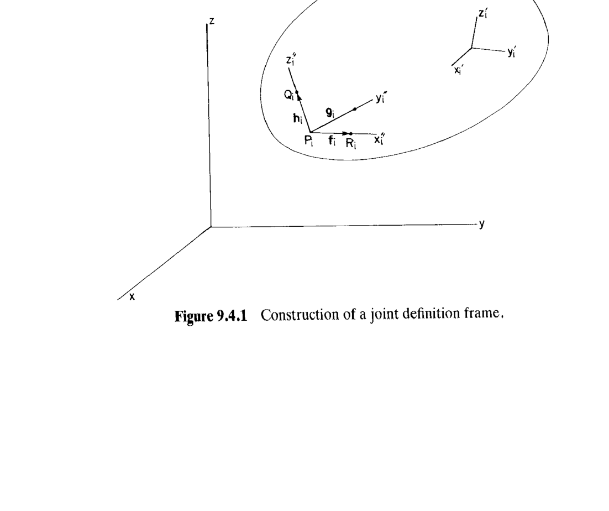

**图 9.4.1（joint definition frame）**：在刚体 $i$ 上取一点 $P_i$ 作为关节定义系原点；沿 $z_i''$ 距 $P_i$ 一个单位取点 $Q_i$，据此定 $\mathbf{h}_i$；沿 $x_i''$ 距 $P_i$ 一个单位取点 $R_i$，据此定 $\mathbf{f}_i$；最后 $\mathbf{g}_i=\tilde{\mathbf{h}}_i\mathbf{f}_i$（叉乘补出 $y_i''$）。

### 关节定义系到随体系的变换

三根单位向量 $\mathbf{f}_i,\mathbf{g}_i,\mathbf{h}_i$ 在**随体系** $x_i'\text{-}y_i'\text{-}z_i'$ 下的分量分别为 $\mathbf{f}_i',\mathbf{g}_i',\mathbf{h}_i'$（它们是随体常量）。类比 Eq. 9.2.13（把三根轴单位向量作为列拼出方向余弦矩阵），关节定义系到随体系的变换矩阵是

$$
\boxed{\;\mathbf{C}_i^P=[\mathbf{f}_i',\;\mathbf{g}_i',\;\mathbf{h}_i']\;}\tag{9.4.1}
$$

任何在关节定义系下的坐标 $\mathbf{s}''$ 都可由 $\mathbf{s}'=\mathbf{C}_i^P\mathbf{s}''$ 变回随体系，再由 $\mathbf{s}=\mathbf{A}_i\mathbf{s}'$ 变到全局系。

### 例 9.4.1：斜置转动轴（$\pi/4$ 倾角）

> 图 9.4.2 中，转轴 $x_2''$ 位于 $x_2'\text{-}y_2'$ 平面内，与 $x_2'$ 轴夹 $\pi/4$。求关节定义系到随体系的变换 $\mathbf{C}_2^P$。

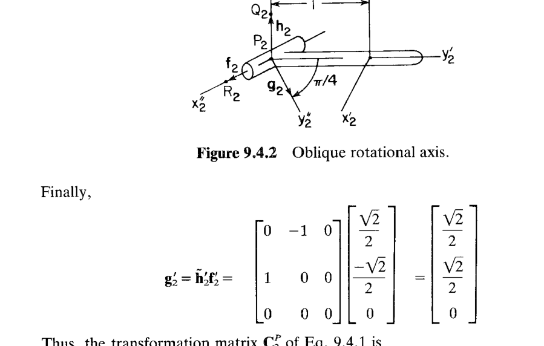

**第一步（$\mathbf{h}'_2$）**：$z_2''$ 与 $z_2'$ 平行，所以

$$\mathbf{h}_2'=[0,0,1]^T$$

**第二步（$\mathbf{f}'_2$）**：$x_2''$ 在 $x_2'\text{-}y_2'$ 平面内，从 $x_2'$ 逆时针转 $-\pi/4$（图中箭头方向），因此

$$\mathbf{f}_2'=\left[\frac{\sqrt2}{2},\;-\frac{\sqrt2}{2},\;0\right]^T$$

**第三步（$\mathbf{g}'_2=\tilde{\mathbf{h}}'_2\mathbf{f}'_2$）**：由 tilde 算子（Eq. 9.1.21），$\tilde{\mathbf{h}}'_2=\begin{bmatrix}0&-1&0\\1&0&0\\0&0&0\end{bmatrix}$，则

$$
\mathbf{g}_2'=\begin{bmatrix}0&-1&0\\1&0&0\\0&0&0\end{bmatrix}\begin{bmatrix}\sqrt2/2\\-\sqrt2/2\\0\end{bmatrix}=\begin{bmatrix}\sqrt2/2\\\sqrt2/2\\0\end{bmatrix}
$$

**装配 $\mathbf{C}_2^P$**：按 Eq. 9.4.1，把三列拼起来

$$
\mathbf{C}_2^P=[\mathbf{f}_2',\mathbf{g}_2',\mathbf{h}_2']=\begin{bmatrix}
\dfrac{\sqrt2}{2}&\dfrac{\sqrt2}{2}&0\\[6pt]
-\dfrac{\sqrt2}{2}&\dfrac{\sqrt2}{2}&0\\[6pt]
0&0&1
\end{bmatrix}
$$

正交性 $\mathbf{C}_2^{PT}\mathbf{C}_2^P=\mathbf{I}$ 一望可见。

---

## 9.4.2 向量与点上的约束（Constraints on Vectors and Points）

### 思路

本小节造**四个基本约束原子**——两个"点积型"（dot-1、dot-2）、一个球副（点重合）、一个球-球（距离固定）。所有更复杂的关节约束都是它们的线性组合。

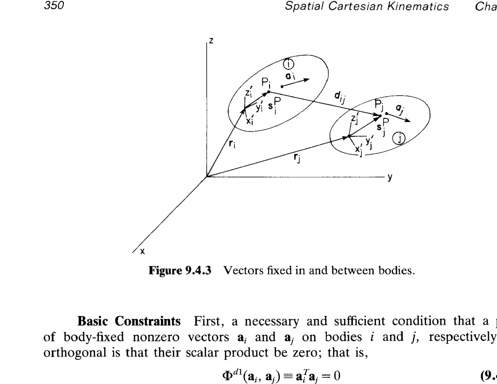

**图 9.4.3（vectors fixed in / between bodies）**：$\mathbf{a}_i,\mathbf{a}_j$ 分别是体 $i,j$ 上的随体非零向量；$P_i,P_j$ 是两个参考点；$\mathbf{d}_{ij}=\mathbf{r}_j+\mathbf{A}_j\mathbf{s}_j'^P-\mathbf{r}_i-\mathbf{A}_i\mathbf{s}_i'^P$ 是从 $P_i$ 指向 $P_j$ 的连线。

### dot-1 约束（两随体向量正交）

两非零向量 $\mathbf{a}_i,\mathbf{a}_j$ 正交的充要条件是它们的点积为 0。全局系下写：

$$
\Phi^{d1}(\mathbf{a}_i,\mathbf{a}_j)\equiv\mathbf{a}_i^T\mathbf{a}_j=0\tag{9.4.2}
$$

用随体常量 $\mathbf{a}_i',\mathbf{a}_j'$（$\mathbf{a}_i=\mathbf{A}_i\mathbf{a}_i'$）改写：

$$
\boxed{\;\Phi^{d1}(\mathbf{a}_i,\mathbf{a}_j)=\mathbf{a}_i'^T\mathbf{A}_i^T\mathbf{A}_j\mathbf{a}_j'=0\;}\tag{9.4.3}
$$

**结构性质**：$\Phi^{d1}$ 只包含**姿态**（$\mathbf{A}_i,\mathbf{A}_j$），不含平移 $\mathbf{r}_i,\mathbf{r}_j$；因此它**只约束两体的相对朝向**，不动位置。

### 例 9.4.2：斜置摆的 dot-1 约束

> 例 9.4.1 中的杆 2 通过铰链绑到地面（体 1），铰链在体 1 上就是 $y_1$ 轴（图 9.4.4）。要让斜置摆能绕 $y_1$ 轴转，铰的转轴 $\mathbf{f}_2$ 必须始终垂直于体 1 的 $\mathbf{h}_1$ 与 $\mathbf{f}_1$。

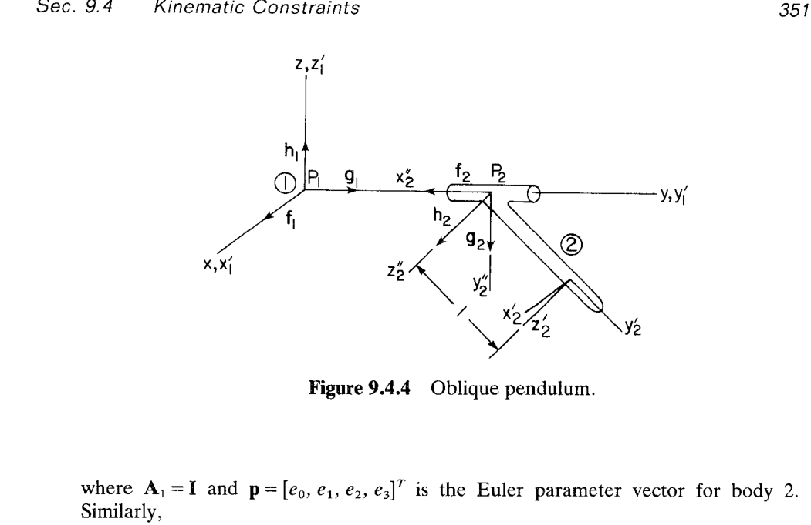

**基本量**：因为地面 1 与全局系重合，$\mathbf{A}_1=\mathbf{I}$；$\mathbf{f}_1'=[1,0,0]^T$，$\mathbf{h}_1'=[0,0,1]^T$；体 2 的姿态由 Euler 参数 $\mathbf{p}=[e_0,e_1,e_2,e_3]^T$ 描述，$\mathbf{f}_2'=\left[\tfrac{\sqrt2}{2},-\tfrac{\sqrt2}{2},0\right]^T$。

**约束 1（$\mathbf{f}_2\perp\mathbf{f}_1$）**：$\mathbf{A}_1=\mathbf{I}$ 消掉后，Eq. 9.4.3 化为

$$
\Phi^{d1}(\mathbf{f}_2,\mathbf{f}_1)=\mathbf{f}_2'^T\mathbf{A}_2^T\mathbf{f}_1'=\mathbf{f}_2'^T\mathbf{A}_2^T[1,0,0]^T=\Big[\tfrac{\sqrt2}{2},-\tfrac{\sqrt2}{2},0\Big]\mathbf{A}_2^T[1,0,0]^T
$$

对 $\mathbf{A}_2^T[1,0,0]^T$：由 Eq. 9.3.7 展开的 $\mathbf{A}$ 的第 1 列即 $\mathbf{A}[1,0,0]^T=2\left[e_0^2+e_1^2-\tfrac12,\;e_1e_2+e_0e_3,\;e_1e_3-e_0e_2\right]^T$；转置后取第 1 列相当于取 $\mathbf{A}^T$ 的第 1 行（即 $\mathbf{A}$ 的第 1 列）——书中直接给出

$$
\Phi^{d1}(\mathbf{f}_2,\mathbf{f}_1)=\sqrt2\,(e_0^2+e_1^2-\tfrac12-e_1e_2+e_0e_3)=0
$$

**约束 2（$\mathbf{f}_2\perp\mathbf{h}_1$）**：类似，取 $\mathbf{A}_2^T[0,0,1]^T$（$\mathbf{A}_2$ 的第 3 列），

$$
\Phi^{d1}(\mathbf{f}_2,\mathbf{h}_1)=\sqrt2\,(e_1e_3+e_0e_2-e_2e_3-e_0e_1)=0
$$

**几何解释**：$\mathbf{f}_1,\mathbf{h}_1,\mathbf{f}_2$ 都是单位向量；令 $\mathbf{f}_2$ 同时垂直于 $\mathbf{f}_1,\mathbf{h}_1$，等价于 $\mathbf{f}_2\parallel\mathbf{g}_1$，即斜置轴与地面的 $y$ 轴平行——正是"斜置摆绕 $y_1$ 轴转"的物理要求。

### dot-2 约束（随体向量与体间连线正交）

给定随体向量 $\mathbf{a}_i$ 与体间连线 $\mathbf{d}_{ij}=\mathbf{r}_j+\mathbf{A}_j\mathbf{s}_j'^P-\mathbf{r}_i-\mathbf{A}_i\mathbf{s}_i'^P$（要求 $\mathbf{d}_{ij}\ne\mathbf{0}$），dot-2 约束为

$$
\Phi^{d2}(\mathbf{a}_i,\mathbf{d}_{ij})\equiv\mathbf{a}_i^T\mathbf{d}_{ij}=0\tag{9.4.4}
$$

用随体常量展开（$\mathbf{a}_i=\mathbf{A}_i\mathbf{a}_i'$，$\mathbf{d}_{ij}$ 展开如 Eq. 9.4.5）：

$$
\mathbf{d}_{ij}=\mathbf{r}_j+\mathbf{A}_j\mathbf{s}_j'^P-\mathbf{r}_i-\mathbf{A}_i\mathbf{s}_i'^P\tag{9.4.5}
$$

代入 Eq. 9.4.4 得

$$
\boxed{\;\Phi^{d2}(\mathbf{a}_i,\mathbf{d}_{ij})=\mathbf{a}_i'^T\mathbf{A}_i^T(\mathbf{r}_j+\mathbf{A}_j\mathbf{s}_j'^P-\mathbf{r}_i)-\mathbf{a}_i'^T\mathbf{s}_i'^P=0\;}\tag{9.4.6}
$$

**中间一步的细节**：$\mathbf{a}_i^T\mathbf{A}_i\mathbf{s}_i'^P=\mathbf{a}_i'^T\mathbf{A}_i^T\mathbf{A}_i\mathbf{s}_i'^P=\mathbf{a}_i'^T\mathbf{s}_i'^P$（用了 $\mathbf{A}_i^T\mathbf{A}_i=\mathbf{I}$，Eq. 9.2.14）——去掉了 $\mathbf{A}_i$，使这一项只留随体常量。

**注意**：
1. **dot-2 不对 $i,j$ 对称**：交换 $i\leftrightarrow j$（要求 $\mathbf{a}_j\perp\mathbf{d}_{ij}$）不是同一条方程。
2. **$\mathbf{d}_{ij}=\mathbf{0}$ 时约束失效**：正交性关于零向量恒成立，此时 Jacobian 秩亏。

### 例 9.4.3：用两个 dot-2 让 $P_2$ 位于 $y_1'$ 轴

> 沿续例 9.4.2 的斜置摆。要求 $P_2$（体 2 上的关节定义点）始终位于地面 $y_1'$ 轴（也即 $y$ 轴）上。等价条件：$\mathbf{d}_{12}$ 沿 $y_1'$ 方向，即 $\mathbf{d}_{12}\perp\mathbf{f}_1$ 且 $\mathbf{d}_{12}\perp\mathbf{h}_1$（$\mathbf{f}_1$ 为 $x$ 轴、$\mathbf{h}_1$ 为 $z$ 轴）。

**dot-2 with $\mathbf{f}_1$**：$\mathbf{f}_1'=[1,0,0]^T$，$\mathbf{s}_1'^P=[0,0,0]^T$（$P_1$ 就在体 1 原点，$\mathbf{r}_1=\mathbf{0}$），$\mathbf{s}_2'^P=[0,-1,0]^T$（$P_2$ 在体 2 上的位置，图 9.4.4）：

$$
\Phi^{d2}(\mathbf{f}_1,\mathbf{d}_{12})=[1,0,0]\bigl(\underbrace{[x_2,y_2,z_2]^T}_{\mathbf{r}_2}+\mathbf{A}_2[0,-1,0]^T-\mathbf{0}\bigr)-[1,0,0][0,0,0]^T
$$

$\mathbf{A}_2[0,-1,0]^T$ 是 $\mathbf{A}_2$ 的第 2 列的相反数；由 Eq. 9.3.7，$\mathbf{A}$ 第 2 列为 $2[e_1e_2-e_0e_3,\;e_0^2+e_2^2-\tfrac12,\;e_2e_3+e_0e_1]^T$，因此

$$
\mathbf{A}_2[0,-1,0]^T=[-2e_1e_2+2e_0e_3,\;-2e_0^2-2e_2^2+1,\;-2e_2e_3-2e_0e_1]^T
$$

取第一分量：

$$
\Phi^{d2}(\mathbf{f}_1,\mathbf{d}_{12})=x_2-2e_1e_2+2e_0e_3=0
$$

**dot-2 with $\mathbf{h}_1$**：$\mathbf{h}_1'=[0,0,1]^T$，取第 3 分量：

$$
\Phi^{d2}(\mathbf{h}_1,\mathbf{d}_{12})=z_2-2e_2e_3-2e_0e_1=0
$$

**几何后果**：这两方程加上例 9.4.2 的两个 dot-1 方程共 4 个方程，等价于关节完整几何——$P_2$ 在 $y_1'$ 轴上、$\mathbf{f}_2$ 与 $\mathbf{g}_1$ 平行。

**书中警告（本例后半段的教学重点）**：如果**改用另外**两个 dot-2 —— $\Phi^{d2}(\mathbf{g}_2,\mathbf{d}_{12})=0$、$\Phi^{d2}(\mathbf{h}_2,\mathbf{d}_{12})=0$ —— 表面上也能推出 $\mathbf{d}_{12}\parallel\mathbf{f}_2$。但**当 $\mathbf{d}_{12}=\mathbf{0}$**（$P_1,P_2$ 重合）时，四条方程对 $\mathbf{f}_2$ 的任何取向都自动满足，Jacobian **不再行满秩**。更阴险的是：即使 $\mathbf{d}_{12}$ 接近 0 但没到零，Jacobian 已经**严重病态**，数值上直接崩溃。这段警告贯穿全节：**约束方程组几何等价 ≠ 数值可用**，冗余 Jacobian 秩亏必须在设计约束时手工规避。

### 球副约束 $\Phi^s$（两点重合）

$P_i,P_j$ 重合的充要条件是 $\mathbf{d}_{ij}=\mathbf{0}$：

$$
\boxed{\;\Phi^s(P_i,P_j)\equiv\mathbf{r}_j+\mathbf{A}_j\mathbf{s}_j'^P-\mathbf{r}_i-\mathbf{A}_i\mathbf{s}_i'^P=\mathbf{0}\;}\tag{9.4.7}
$$

**3 个标量方程**，用于**球副（spherical joint / ball-and-socket joint）**。关于 $i,j$ 对称。

### 距离约束 $\Phi^{ss}$（球-球连杆）

两点间距离等于 $C\ne 0$：

$$
\boxed{\;\Phi^{ss}(P_i,P_j,C)\equiv\mathbf{d}_{ij}^T\mathbf{d}_{ij}-C^2=0\;}\tag{9.4.8}
$$

**1 个标量方程**——把两端各一个球副 + 中间刚性杆合并为一条距离方程。

**为何要求 $C\ne 0$？** 若 $C=0$，则该方程蕴涵 $\mathbf{d}_{ij}=\mathbf{0}$；此时其 Jacobian 为

$$
\Phi_{\mathbf{q}}^{ss}=2\mathbf{d}_{ij}^T(\mathbf{d}_{ij})_{\mathbf{q}}=\mathbf{0}^T
$$

（$\mathbf{d}_{ij}=\mathbf{0}$ 使外层零，无论 $(\mathbf{d}_{ij})_{\mathbf{q}}$ 是什么）。行秩为零，运动学求解直接失败。因此**距离约束只用于 $C>0$；两点重合请用 3 方程的球副 $\Phi^s$**。

### 例 9.4.4：复合摆的距离约束

> 图 9.4.5(a)：体 2 上的点 $P_2$ 与地面上定点 $P_1$ 之间由长度为 $C$ 的刚性绳连接（球-球连杆）。

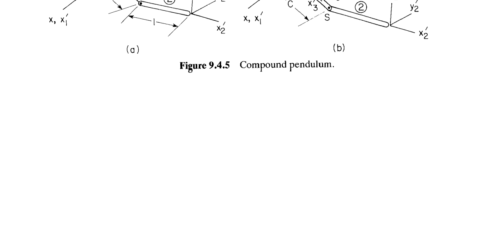

**$\mathbf{d}_{12}$ 展开**（$\mathbf{r}_1=\mathbf{0}$、$\mathbf{s}_1'^P=\mathbf{0}$、$\mathbf{s}_2'^P=[-1,0,0]^T$）：

$$
\mathbf{d}_{12}=\mathbf{r}_2+\mathbf{A}_2[-1,0,0]^T=[x_2,y_2,z_2]^T+\mathbf{A}_2[-1,0,0]^T
$$

$\mathbf{A}_2[-1,0,0]^T=-\mathbf{A}_2$ 第一列 $=-2[e_0^2+e_1^2-\tfrac12,\;e_1e_2+e_0e_3,\;e_1e_3-e_0e_2]^T$，加上 $\mathbf{r}_2$：

$$
\mathbf{d}_{12}=[x_2-2e_0^2-2e_1^2+1,\;y_2-2e_1e_2-2e_0e_3,\;z_2-2e_1e_3+2e_0e_2]^T
$$

**代回 Eq. 9.4.8**：

$$
\Phi^{ss}(P_1,P_2,C)=(x_2-2e_0^2-2e_1^2+1)^2+(y_2-2e_1e_2-2e_0e_3)^2+(z_2-2e_1e_3+2e_0e_2)^2-C^2=0
$$

**（b）模型的对比讨论——概念要点**：把中间"绳"换成显式的第 3 个刚体（两端各一个球副），看似等价，其实**不等价**：
- （a）模型：1 个距离约束方程；系统自由度 $5$。
- （b）模型：2 个球副 $= 6$ 方程；系统多引入 7 个 Euler 广义坐标；净增自由度 $7-2\cdot3=1$（$3$ 是球副去掉的 DOF 数目差异，此处需按公式 $\text{DOF}=nc-nh$ 算），**多出的自由度是体 3 绕 $x_3'$ 轴的自转**——这个自转在（a）里被"隐掉"了。因此工程建模上（a）更简洁但不允许模拟连杆自身的转动惯量。

### 平行-1 约束 $\Phi^{p1}$（两向量平行）

回到基本约束。"$\mathbf{h}_i\parallel\mathbf{h}_j$"等价于"$\mathbf{h}_j$ 与 $\mathbf{f}_i,\mathbf{g}_i$（$\mathbf{h}_i$ 平面内的两根正交向量）都正交"。用两个 dot-1 表达：

$$
\boxed{\;\Phi^{p1}(\mathbf{h}_i,\mathbf{h}_j)=\begin{bmatrix}\Phi^{d1}(\mathbf{f}_i,\mathbf{h}_j)\\\Phi^{d1}(\mathbf{g}_i,\mathbf{h}_j)\end{bmatrix}=\mathbf{0}\;}\tag{9.4.9}
$$

**2 个标量方程**，纯姿态约束。

### 平行-2 约束 $\Phi^{p2}$（向量与连线平行）

"$\mathbf{h}_i\parallel\mathbf{d}_{ij}$"等价于"$\mathbf{d}_{ij}\perp\mathbf{f}_i$ 且 $\mathbf{d}_{ij}\perp\mathbf{g}_i$"。用两个 dot-2 表达：

$$
\boxed{\;\Phi^{p2}(\mathbf{h}_i,\mathbf{d}_{ij})=\begin{bmatrix}\Phi^{d2}(\mathbf{f}_i,\mathbf{d}_{ij})\\\Phi^{d2}(\mathbf{g}_i,\mathbf{d}_{ij})\end{bmatrix}=\mathbf{0}\;}\tag{9.4.10}
$$

**2 个标量方程**，涉及位置与姿态；$\mathbf{d}_{ij}=\mathbf{0}$ 时失效。

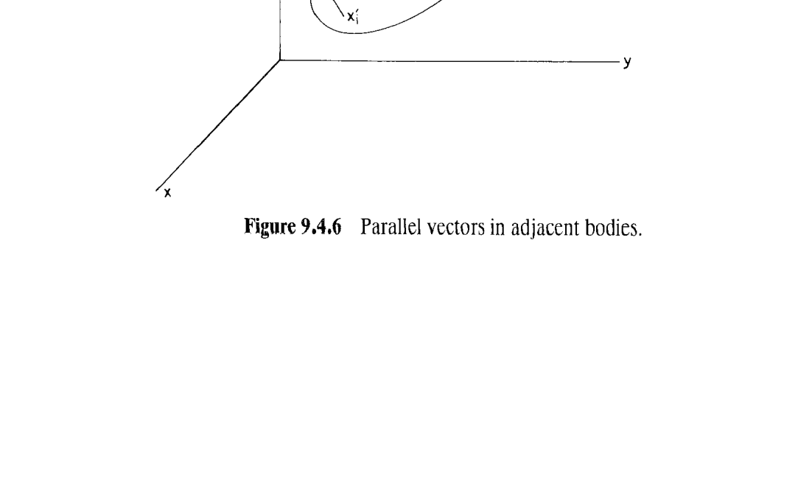
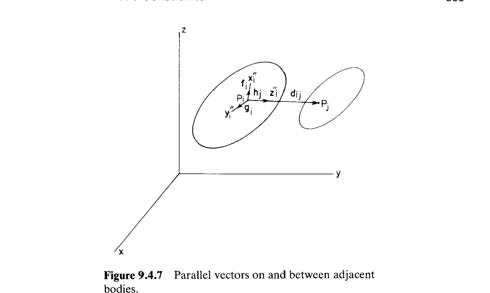

### 例 9.4.5：斜置摆的完整约束方程组

> 对例 9.4.2 的斜置摆再补齐一个平行-1 约束：让摆的转轴 $\mathbf{f}_2$ 与地面 $\mathbf{g}_1$（$y_1$ 轴）平行。加上"$P_2$ 位于 $y_1$ 轴"的位置约束，构成完整关节。

**平行-1（$\Phi^{p1}(\mathbf{f}_2,\mathbf{g}_1)$）**：由 Eq. 9.4.9，

$$
\Phi^{p1}(\mathbf{f}_2,\mathbf{g}_1)=\begin{bmatrix}\Phi^{d1}(\mathbf{h}_2,\mathbf{g}_1)\\\Phi^{d1}(\mathbf{g}_2,\mathbf{g}_1)\end{bmatrix}=\begin{bmatrix}(\mathbf{A}_2\mathbf{h}_2')^T\mathbf{g}_1\\(\mathbf{A}_2\mathbf{g}_2')^T\mathbf{g}_1\end{bmatrix}=\mathbf{0}
$$

其中 $\mathbf{g}_1=[0,1,0]^T$，$\mathbf{h}_2'=[0,0,1]^T$，$\mathbf{g}_2'=[\tfrac{\sqrt2}{2},\tfrac{\sqrt2}{2},0]^T$。计算 $(\mathbf{A}_2\mathbf{h}_2')^T\mathbf{g}_1=[0,0,1]\mathbf{A}_2^T[0,1,0]^T$——即 $\mathbf{A}_2$ 的（3,2）元素乘 1。查 Eq. 9.3.7 得 $2(e_2e_3-e_0e_1)$，即

$$
(\mathbf{A}_2\mathbf{h}_2')^T\mathbf{g}_1=2(e_2e_3-e_0e_1)
$$

同理 $(\mathbf{A}_2\mathbf{g}_2')^T\mathbf{g}_1=[\tfrac{\sqrt2}{2},\tfrac{\sqrt2}{2},0]\mathbf{A}_2^T[0,1,0]^T$；$\mathbf{A}_2^T[0,1,0]^T$ 是 $\mathbf{A}_2$ 的第 2 行的转置 $=[2(e_1e_2-e_0e_3),\;2(e_0^2+e_2^2-\tfrac12),\;2(e_2e_3+e_0e_1)]^T$。前两项加权 $\tfrac{\sqrt2}{2}$：

$$
(\mathbf{A}_2\mathbf{g}_2')^T\mathbf{g}_1=\sqrt2\,(e_1e_2+e_0e_3+e_0^2+e_2^2-\tfrac12)-\dots
$$

（书中直接给出）

$$
\Phi^{p1}(\mathbf{f}_2,\mathbf{g}_1)=\begin{bmatrix}2(e_2e_3-e_0e_1)\\ \sqrt2\,(e_1e_2+e_0e_3+e_0^2+e_2^2-\tfrac12)\end{bmatrix}=\mathbf{0}
$$

**位置部分 $\mathbf{r}_2^P$**：$\mathbf{r}_2^P=\mathbf{r}_2+\mathbf{A}_2\mathbf{s}_2'^P$，代 $\mathbf{s}_2'^P=[0,-1,0]^T$（即 $-\mathbf{A}_2$ 的第 2 列）：

$$
\mathbf{r}_2^P=\begin{bmatrix}x_2\\y_2\\z_2\end{bmatrix}+\begin{bmatrix}-2e_1e_2+2e_0e_3\\-2e_0^2-2e_2^2+1\\-2e_2e_3-2e_0e_1\end{bmatrix}=\begin{bmatrix}x_2-2e_1e_2+2e_0e_3\\y_2-2e_0^2-2e_2^2+1\\z_2-2e_2e_3-2e_0e_1\end{bmatrix}
$$

**剩余两个绝对位置约束**（$x_2^P=0$、$z_2^P=0$）：

$$
x_2^P=x_2-2e_1e_2+2e_0e_3=0,\qquad z_2^P=z_2-2e_2e_3-2e_0e_1=0
$$

合起来共 $2\;(\text{平行-1})+2\;(\text{位置})+1\;(\text{Euler 归一化}) = 5$ 方程，锁死 5 个 DOF（斜置摆共 7 广义坐标，$\text{DOF}=7-5-?$ 需在系统层与地面本身的 6 个约束一并计入才得 1 DOF 摆动）。

### 基本约束的微分与偏导（Table 9.4.1）

**动机**：动力学需要约束方程对 $(\mathbf{r}_i,\mathbf{p}_i;\mathbf{r}_j,\mathbf{p}_j)$ 的一阶偏导（构成 Jacobian $\Phi_\mathbf{q}$）。§9.2 已铺垫：$\delta\mathbf{A}=\delta\tilde{\boldsymbol{\pi}}\mathbf{A}$（Eq. 9.2.47），$\delta(\mathbf{A}\mathbf{s}')=-\mathbf{A}\tilde{\mathbf{s}}'\delta\boldsymbol{\pi}'$（Eq. 9.2.51）。这里逐条求出四个原子约束的**全微分**，再从中读出偏导。

**dot-1 微分**（沿用 Ex. 9.2.6 的结果 Eq. 9.2.60）：

$$
\boxed{\;\delta\Phi^{d1}(\mathbf{a}_i,\mathbf{a}_j)=-\bigl(\mathbf{a}_j'^T\mathbf{A}_j^T\mathbf{A}_i\tilde{\mathbf{a}}_i'\,\delta\boldsymbol{\pi}_i'+\mathbf{a}_i'^T\mathbf{A}_i^T\mathbf{A}_j\tilde{\mathbf{a}}_j'\,\delta\boldsymbol{\pi}_j'\bigr)\;}\tag{9.4.11}
$$

**dot-2 微分**（沿用 Ex. 9.2.6 的类似展开）：

$$
\delta\Phi^{d2}(\mathbf{a}_i,\mathbf{d}_{ij})=\mathbf{a}_i^T\delta\mathbf{d}_{ij}+\mathbf{d}_{ij}^T\delta\mathbf{a}_i
$$

代入 $\delta\mathbf{d}_{ij}=\delta\mathbf{r}_j-\mathbf{A}_j\tilde{\mathbf{s}}_j'^P\delta\boldsymbol{\pi}_j'-\delta\mathbf{r}_i+\mathbf{A}_i\tilde{\mathbf{s}}_i'^P\delta\boldsymbol{\pi}_i'$（Eq. 9.2.53）与 $\delta\mathbf{a}_i=-\mathbf{A}_i\tilde{\mathbf{a}}_i'\delta\boldsymbol{\pi}_i'$：

$$
\begin{aligned}
\delta\Phi^{d2}
&=\mathbf{a}_i'^T\mathbf{A}_i^T\delta\mathbf{r}_j-\mathbf{a}_i'^T\mathbf{A}_i^T\delta\mathbf{r}_i-\mathbf{a}_i'^T\mathbf{A}_i^T\mathbf{A}_j\tilde{\mathbf{s}}_j'^P\delta\boldsymbol{\pi}_j'\\
&\quad+(\mathbf{a}_i'^T\tilde{\mathbf{s}}_i'^P-\mathbf{d}_{ij}^T\mathbf{A}_i\tilde{\mathbf{a}}_i')\delta\boldsymbol{\pi}_i'
\end{aligned}\tag{9.4.12}
$$

**球副微分**（用 Eq. 9.2.53 直接）：

$$
\delta\Phi^{s}(P_i,P_j)=\delta\mathbf{r}_j-\mathbf{A}_j\tilde{\mathbf{s}}_j'^P\delta\boldsymbol{\pi}_j'-\delta\mathbf{r}_i+\mathbf{A}_i\tilde{\mathbf{s}}_i'^P\delta\boldsymbol{\pi}_i'\tag{9.4.13}
$$

**距离微分**：

$$
\delta\Phi^{ss}(P_i,P_j,C)=2\mathbf{d}_{ij}^T\delta\mathbf{d}_{ij}=2\mathbf{d}_{ij}^T(\delta\mathbf{r}_j-\mathbf{A}_j\tilde{\mathbf{s}}_j'^P\delta\boldsymbol{\pi}_j'-\delta\mathbf{r}_i+\mathbf{A}_i\tilde{\mathbf{s}}_i'^P\delta\boldsymbol{\pi}_i')\tag{9.4.14}
$$

**统一格式**：所有基本约束（含 $\Phi^{p1},\Phi^{p2}$ 都可由 9.4.11/9.4.12 组合而得）都可以写成

$$
\delta\Phi=\Phi_{\mathbf{r}_i}\delta\mathbf{r}_i+\Phi_{\pi_i'}\delta\boldsymbol{\pi}_i'+\Phi_{\mathbf{r}_j}\delta\mathbf{r}_j+\Phi_{\pi_j'}\delta\boldsymbol{\pi}_j'=\mathbf{0}
$$

对照系数得 Table 9.4.1：

| 约束 | $\Phi_{\mathbf{r}_i}$ | $\Phi_{\mathbf{r}_j}$ | $\Phi_{\pi_i'}$ | $\Phi_{\pi_j'}$ |
|------|---------------------|---------------------|-----------------|-----------------|
| $\Phi^{d1}(\mathbf{a}_i,\mathbf{a}_j)$ | $\mathbf{0}$ | $\mathbf{0}$ | $-\mathbf{a}_j'^T\mathbf{A}_j^T\mathbf{A}_i\tilde{\mathbf{a}}_i'$ | $-\mathbf{a}_i'^T\mathbf{A}_i^T\mathbf{A}_j\tilde{\mathbf{a}}_j'$ |
| $\Phi^{d2}(\mathbf{a}_i,\mathbf{d}_{ij})$ | $-\mathbf{a}_i'^T\mathbf{A}_i^T$ | $\mathbf{a}_i'^T\mathbf{A}_i^T$ | $\mathbf{a}_i'^T\tilde{\mathbf{s}}_i'^P-\mathbf{d}_{ij}^T\mathbf{A}_i\tilde{\mathbf{a}}_i'$ | $-\mathbf{a}_i'^T\mathbf{A}_i^T\mathbf{A}_j\tilde{\mathbf{s}}_j'^P$ |
| $\Phi^{s}(P_i,P_j)$ | $-\mathbf{I}$ | $\mathbf{I}$ | $\mathbf{A}_i\tilde{\mathbf{s}}_i'^P$ | $-\mathbf{A}_j\tilde{\mathbf{s}}_j'^P$ |
| $\Phi^{ss}(P_i,P_j,C)$ | $-2\mathbf{d}_{ij}^T$ | $2\mathbf{d}_{ij}^T$ | $2\mathbf{d}_{ij}^T\mathbf{A}_i\tilde{\mathbf{s}}_i'^P$ | $-2\mathbf{d}_{ij}^T\mathbf{A}_j\tilde{\mathbf{s}}_j'^P$ |

**Table 9.4.1 表脚警告**：$\Phi_{\pi'}$ 不是真正的偏导——因为 $\pi'$（虚旋转）不是任何函数的自变量（准坐标性，见 §9.3 尾）；它只是 $\delta\boldsymbol{\pi}'$ 的系数矩阵。要得到对 Euler 参数 $\mathbf{p}$ 的偏导，用 $\delta\boldsymbol{\pi}'=2\mathbf{G}\,\delta\mathbf{p}$（Eq. 9.3.41）：

$$
\boxed{\;\Phi_{\mathbf{p}_i}=2\Phi_{\pi_i'}\mathbf{G}_i\;}
$$

由此完整线性化式为

$$
\delta\Phi=\Phi_{\mathbf{r}_i}\delta\mathbf{r}_i+2\Phi_{\pi_i'}\mathbf{G}_i\,\delta\mathbf{p}_i+\Phi_{\mathbf{r}_j}\delta\mathbf{r}_j+2\Phi_{\pi_j'}\mathbf{G}_j\,\delta\mathbf{p}_j=\mathbf{0}
$$

这正是**构建 Jacobian $\Phi_\mathbf{q}$（$\mathbf{q}=[\mathbf{r}_i;\mathbf{p}_i;\mathbf{r}_j;\mathbf{p}_j;\dots]$）的模块化配方**——每个约束只需查 Table 9.4.1 就能吐出自己那几个非零块。

---

## 9.4.3 单体的绝对约束（Absolute Constraints on a Body）

### 思路

"绝对"指与**地面**的约束。把体 $i$ 上某点 $P_i$ 的位置坐标或 Euler 参数直接**钉在常数**上，可获得 6 类基本约束（Eq. 9.4.15）：

$$
\begin{aligned}
\Phi^1&=x_i^P-x_i^0=0\\
\Phi^2&=y_i^P-y_i^0=0\\
\Phi^3&=z_i^P-z_i^0=0\\
\Phi^4&=e_{1i}-e_{1i}^0=0\\
\Phi^5&=e_{2i}-e_{2i}^0=0\\
\Phi^6&=e_{3i}-e_{3i}^0=0
\end{aligned}\tag{9.4.15}
$$

**用法**：
- 前 3 个可**独立使用**（钉住点 $P_i$ 的某个笛卡尔分量），每个消 1 DOF。
- 后 3 个应**成组使用**——3 个 Euler 分量再加 Eq. 9.3.9 归一化，完全锁定姿态；若单独钉住某一个 $e_{ki}$，物理意义模糊。
- **全部 6 条**联用即体 $i$ 对地面刚性固定（**ground constraint**）。

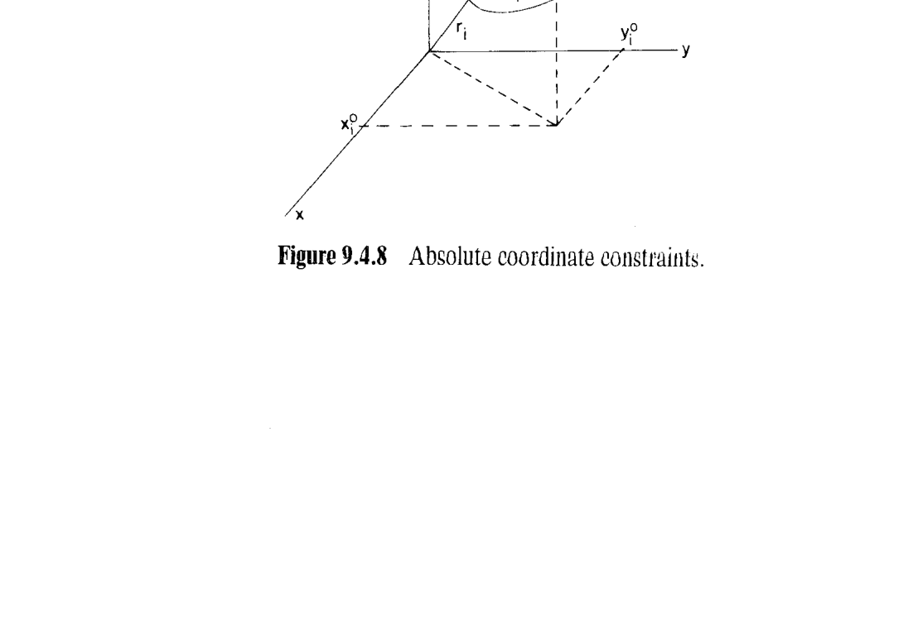

### 例 9.4.6：用绝对约束造柱铰

> 图 9.4.9：体 2 上取两点 $P_1,P_2$（图中标注，均在体 $x_2'$ 轴上、距原点各 $\pm 1$），若分别把它们的 $x$、$z$ 坐标钉在 0，则体 2 只能绕地面 $y$ 轴自转、沿 $y$ 轴滑动——正是一个**柱铰**。

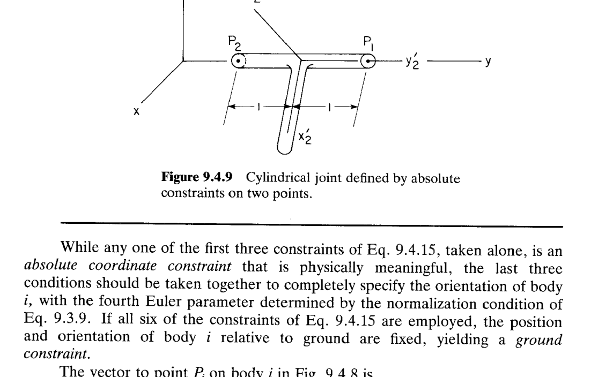

**位置向量**：$\mathbf{s}_2^{P_1}=[1,0,0]^T$、$\mathbf{s}_2^{P_2}=[-1,0,0]^T$。写全局系下的两点坐标：

$$
\mathbf{r}_2^{P_1}=\mathbf{r}_2+\mathbf{A}_2\mathbf{s}_2'^{P_1}=\begin{bmatrix}x_2+2e_1e_2-2e_0e_3\\y_2+2e_0^2+2e_2^2-1\\z_2+2e_2e_3+2e_0e_1\end{bmatrix}
$$

$$
\mathbf{r}_2^{P_2}=\mathbf{r}_2+\mathbf{A}_2\mathbf{s}_2'^{P_2}=\begin{bmatrix}x_2-2e_1e_2+2e_0e_3\\y_2-2e_0^2-2e_2^2+1\\z_2-2e_2e_3-2e_0e_1\end{bmatrix}
$$

**约束**：把两点的 $x,z$ 都钉在 0，得 4 条方程：

$$
\begin{bmatrix}x_2+2e_1e_2-2e_0e_3\\z_2+2e_2e_3+2e_0e_1\\x_2-2e_1e_2+2e_0e_3\\z_2-2e_2e_3-2e_0e_1\end{bmatrix}=\mathbf{0}
$$

**DOF 检验**：体 2 有 7 广义坐标（3 位置 + 4 Euler）；上面 4 条 + Euler 归一化 1 条 = 5 条独立约束（前提 Jacobian 满秩），故 DOF $=7-5=2$：绕 $y$ 转 + 沿 $y$ 滑——正是柱铰。

### 绝对点约束 $\Phi^P$（点固定在给定位置）

给定全局位置 $\mathbf{r}_i^0=[x_i^0,y_i^0,z_i^0]^T$，要求体 $i$ 上的点 $P_i$ 达到该位置（图 9.4.10）：

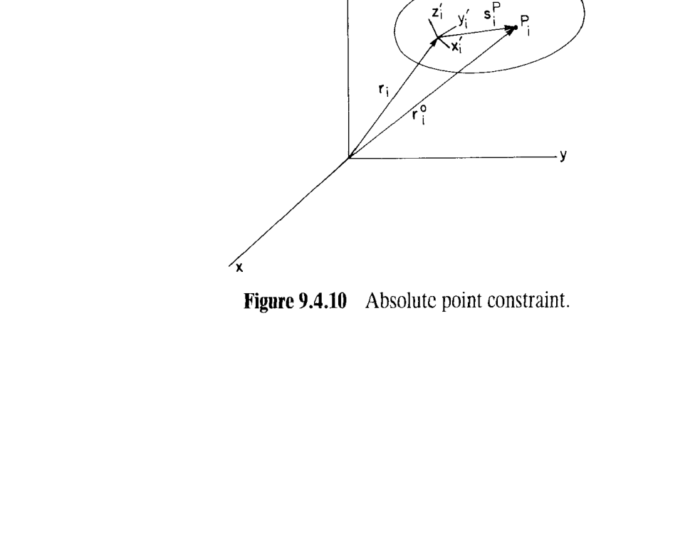

$$
\boxed{\;\Phi^P(P_i)=\mathbf{r}_i+\mathbf{A}_i\mathbf{s}_i'^P-\mathbf{r}_i^0=\mathbf{0}\;}\tag{9.4.16}
$$

**3 个标量方程**；只约束 $P_i$ 的位置，保留 3 个转动 DOF。

**偏导**：由 $\delta\mathbf{r}_i^P=\delta\mathbf{r}_i-\mathbf{A}_i\tilde{\mathbf{s}}_i'^P\delta\boldsymbol{\pi}_i'$（Eq. 9.2.51），

$$
\Phi_{\mathbf{r}_i}^P=\mathbf{I},\qquad \Phi_{\pi_i'}^P=-\mathbf{A}_i\tilde{\mathbf{s}}_i'^P
$$

（对比 Eq. 9.4.15 前三条：$\Phi^1_{\mathbf{r}_i}\Phi^2_{\mathbf{r}_i}\Phi^3_{\mathbf{r}_i}$ 拼起来正是 $\mathbf{I}$；$\Phi^{1,2,3}_{\pi_i'}=-\mathbf{A}_i\tilde{\mathbf{s}}_i'^P$。）

对姿态坐标 $\Phi^{4,5,6}$：由 $\delta e_i=[0,\mathbf{I}]\delta\mathbf{p}_i=\tfrac12(\tilde{\mathbf{e}}_i+e_{0i}\mathbf{I})\delta\boldsymbol{\pi}_i'$（用 Eq. 9.3.19、9.3.43 的组合），偏导为

$$
\Phi_{\mathbf{r}_i}^{4,5,6}=\mathbf{0},\qquad \Phi_{\pi_i'}^{4,5,6}=\tfrac12(\tilde{\mathbf{e}}_i+e_{0i}\mathbf{I})
$$

---

## 9.4.4 两体间的运动关节（Constraints between Pairs of Bodies）

### 思路

现在把基本约束**装配成完整的关节库**。基本原则：**每个关节 = 若干几何原子约束的直接组合，从而对应"6 - 相对 DOF"个方程**（因为空间两体间总共 6 个相对 DOF）。

### 距离连接 $\Phi^{ss}$（1 方程，5 DOF）

Eq. 9.4.17：$\Phi^{ss}(P_i,P_j,C)=0$。已在 9.4.2 讨论。

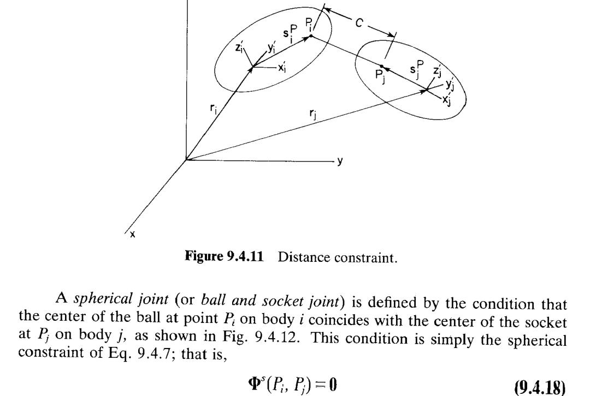

### 球副 / 球窝副 $\Phi^s$（3 方程，3 DOF）

Eq. 9.4.18：$\Phi^s(P_i,P_j)=\mathbf{0}$。只约束点重合、不限相对朝向。

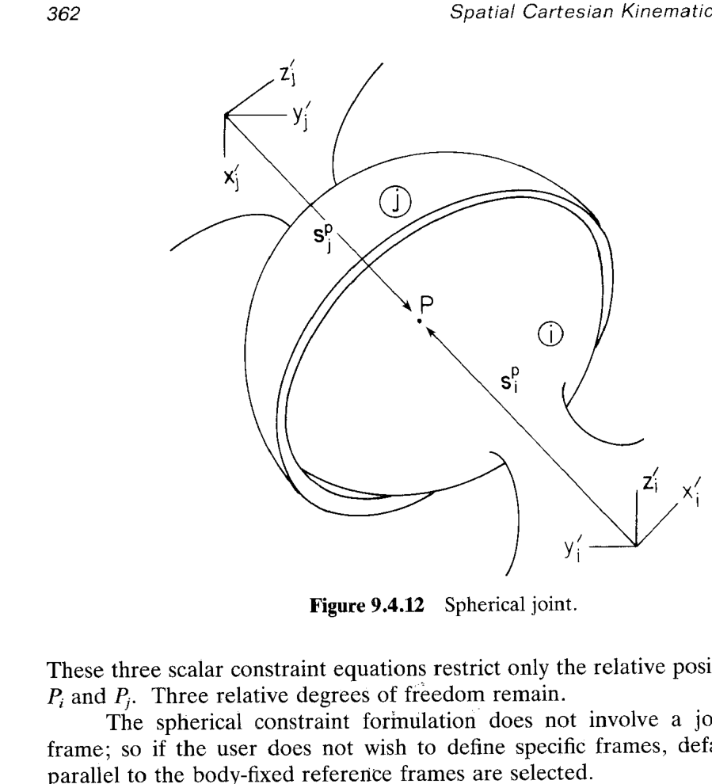

### 万向节（Universal Joint）（4 方程，2 DOF）

由中间的十字架（cross）与两个正交转动副复合而成（图 9.4.13）。定义两端体 $i,j$ 上的关节参考点 $P_i,P_j$ 重合，且两根叉轴 $\mathbf{h}_i,\mathbf{h}_j$ 保持正交：

$$
\boxed{\;\Phi^s(P_i,P_j)=\mathbf{0},\qquad \Phi^{d1}(\mathbf{h}_i,\mathbf{h}_j)=0\;}\tag{9.4.19}
$$

$3+1=4$ 方程，允许 2 个相对 DOF。

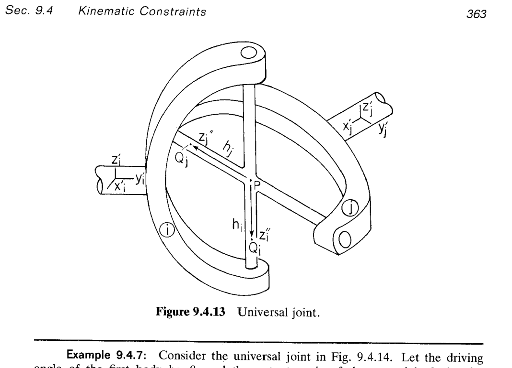

### 例 9.4.7：万向节的奇异构型

> 图 9.4.14：驱动轴（体 1）绕 $y_1'$ 轴以角 $\theta_1$ 转动，输出轴（体 2）绕 $y_2'$ 轴以角 $\theta_2$ 转动；两轴夹角 $\phi$。求 $\theta_1,\theta_2$ 关系。

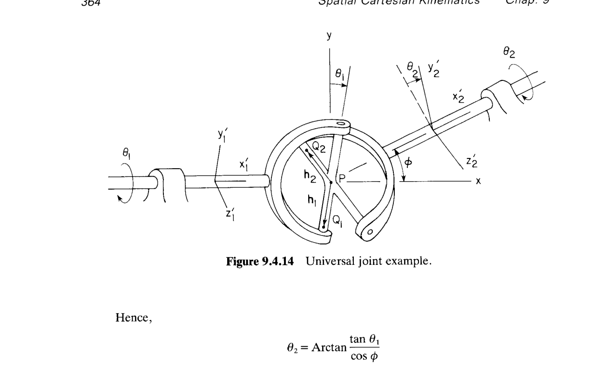

**基本量**：$\mathbf{h}_1'=[0,-1,0]^T$（体 1 十字架的叉沿 $-y_1'$），$\mathbf{h}_2'=[0,0,-1]^T$（体 2 十字架的叉沿 $-z_2'$）；

$$
\mathbf{A}_1=\begin{bmatrix}1&0&0\\0&\cos\theta_1&-\sin\theta_1\\0&\sin\theta_1&\cos\theta_1\end{bmatrix},\quad
\mathbf{A}_2=\begin{bmatrix}\cos\phi&-\cos\theta_2\sin\phi&\sin\theta_2\sin\phi\\\sin\phi&\cos\theta_2\cos\phi&-\sin\theta_2\cos\phi\\0&\sin\theta_2&\cos\theta_2\end{bmatrix}
$$

**dot-1 展开**：由 Eq. 9.4.3，

$$
\Phi^{d1}(\mathbf{h}_1,\mathbf{h}_2)=\mathbf{h}_1'^T\mathbf{A}_1^T\mathbf{A}_2\mathbf{h}_2'
$$

代 $\mathbf{h}_1'=[0,-1,0]^T$、$\mathbf{h}_2'=[0,0,-1]^T$，取 $\mathbf{A}_2\mathbf{h}_2'=-\mathbf{A}_2$ 第 3 列 $=-[\sin\theta_2\sin\phi,-\sin\theta_2\cos\phi,\cos\theta_2]^T$；然后 $\mathbf{A}_1^T$ 乘之：

$$
\mathbf{A}_1^T\mathbf{A}_2\mathbf{h}_2'=\begin{bmatrix}-\sin\theta_2\sin\phi\\ -(-\sin\theta_2\cos\phi)\cos\theta_1-\cos\theta_2(-\sin\theta_1)\\ -(-\sin\theta_2\cos\phi)(-\sin\theta_1)-\cos\theta_2(-\cos\theta_1)\end{bmatrix}=\dots
$$

**最终结果**（书中直接给出）：

$$
\Phi^{d1}(\mathbf{h}_1,\mathbf{h}_2)=-\cos\theta_1\sin\theta_2\cos\phi+\sin\theta_1\cos\theta_2=0
$$

两边除以 $\cos\theta_1\cos\theta_2$：

$$
\boxed{\;\tan\theta_1=\tan\theta_2\cos\phi\;}\tag{9.4.20}
$$

反解：$\theta_2=\arctan\left(\tan\theta_1/\cos\phi\right)$——这就是万向节著名的**非等速传动关系**：输入 $\theta_1$ 等角速率，输出 $\theta_2$ 会有波动，波动幅度取决于 $\phi$。

**变分方程**（从 Eq. 9.4.11 计算 $\delta\Phi^{d1}$，代 $\delta\boldsymbol{\pi}_1'=[\delta\theta_1,0,0]^T$、$\delta\boldsymbol{\pi}_2'=[\delta\theta_2,0,0]^T$）：书中一整块矩阵展开后得

$$
\begin{aligned}
&-(\sin\theta_2\cos\phi\sin\theta_1+\cos\theta_2\cos\theta_1)\,\delta\theta_1\\
&\qquad+(\cos\theta_1\cos\theta_2\cos\phi+\sin\theta_1\sin\theta_2)\,\delta\theta_2=0
\end{aligned}\tag{9.4.21}
$$

**奇异分析**：取 $\phi=\pi/2$（两叉正交极端）。由 Eq. 9.4.20，$\tan\theta_1=\tan\theta_2\cdot 0=0\Rightarrow\theta_1=0$，无论 $\theta_2$ 是什么，$\theta_1$ 被锁死为 0；即**驱动轴 lock-up**！用 Eq. 9.4.21 的一阶版本代 $\cos\phi=0$、$\tan\theta_1=0$（$\sin\theta_1=0$、$\cos\theta_1=1$）：

$$
-\cos\theta_2\,\delta\theta_1+\sin\theta_1\sin\theta_2\,\delta\theta_2=0
$$

$\sin\theta_1=0$，右侧 $=0$；左侧 $-\cos\theta_2\,\delta\theta_1=0$；只要 $\cos\theta_2\ne 0$ 就得 $\delta\theta_1=0$——**输入轴的任何虚转动都不被约束系统允许**。这就是万向节的**物理奇异构型**（Fig 9.4.15）——工程应用中必须避开 $\phi=\pi/2$。

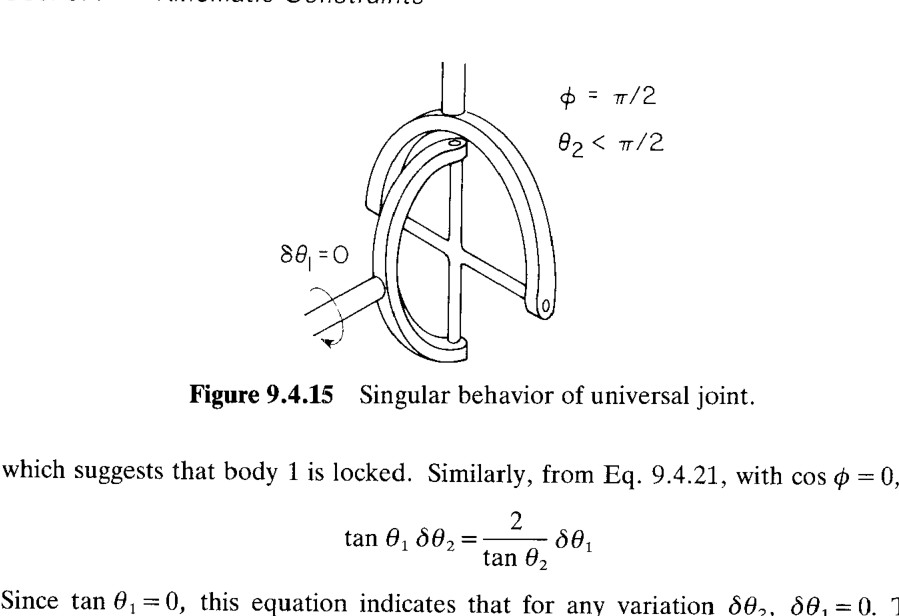

### 转动副 / 转动关节（Revolute Joint）（5 方程，1 DOF）

两体绕共同轴相对转动、不允许沿此轴平移（图 9.4.16）。分解为"两点重合 + 两轴平行"：

$$
\boxed{\;\Phi^s(P_i,P_j)=\mathbf{0},\qquad \Phi^{p1}(\mathbf{h}_i,\mathbf{h}_j)=\mathbf{0}\;}\tag{9.4.22}
$$

$3+2=5$ 方程，1 个相对 DOF（绕轴的转角 $\theta$）。

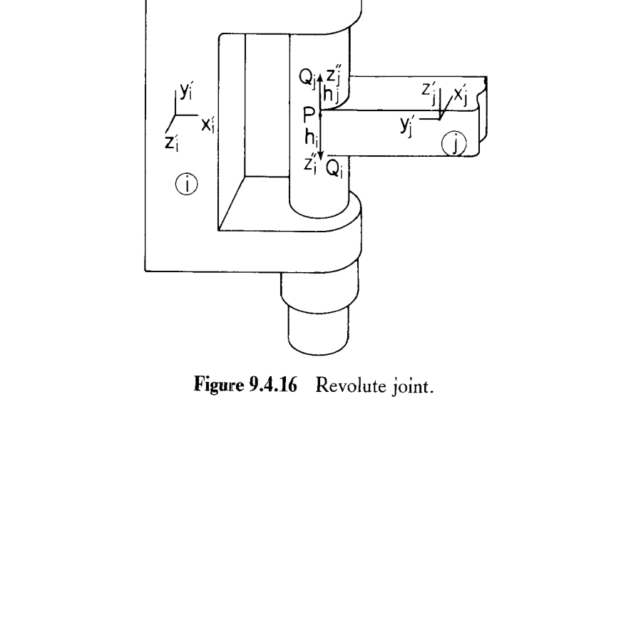

### 例 9.4.8：地面转动副的验证

> 图 9.4.17：体 1 = 地面（$\mathbf{A}_1=\mathbf{I}$），体 2 绕 $z$ 轴相对地面转动 $\theta$（顺时针，故 $\chi=-\theta$）。

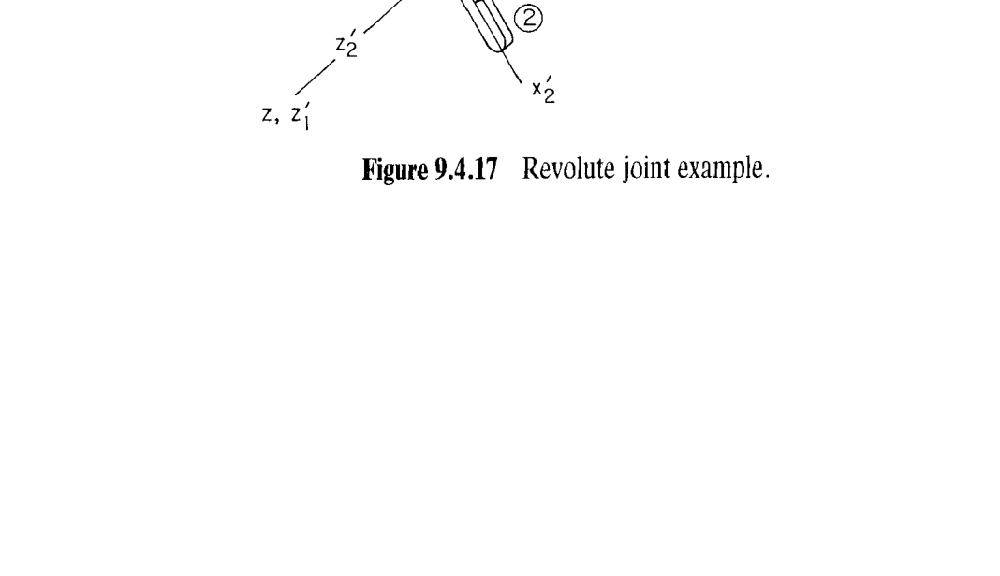

**Euler 参数**：轴 $\mathbf{u}_2=[0,0,1]^T$（沿 $z$），旋转角 $\chi=-\theta$，所以

$$
e_0=\cos\tfrac{\chi}{2}=\cos\tfrac{\theta}{2},\qquad \mathbf{e}=\mathbf{u}\sin\tfrac{\chi}{2}=[0,0,-\sin\tfrac{\theta}{2}]^T
$$

**代 $\mathbf{A}_2$**（Eq. 9.3.6 简形）：

$$
\mathbf{A}_2=2\begin{bmatrix}e_0^2-\tfrac12&-e_0e_3&0\\ e_0e_3&e_0^2-\tfrac12&0\\ 0&0&e_0^2+e_3^2-\tfrac12\end{bmatrix}=\begin{bmatrix}\cos\theta&\sin\theta&0\\-\sin\theta&\cos\theta&0\\0&0&1\end{bmatrix}
$$

（利用 $2e_0^2-1=\cos\theta$、$2e_0e_3=-\sin\theta$；$e_0^2+e_3^2=1$。）

**球副验证**：$P_1,P_2$ 都在原点，$\mathbf{s}_1'^P=\mathbf{s}_2'^P=\mathbf{0}$，$\mathbf{r}_1=\mathbf{r}_2=\mathbf{0}$，因此 $\Phi^s=\mathbf{0}$（trivially）。

**平行-1 验证**：$\mathbf{h}_1'=[0,0,1]^T$（沿 $z_1$），$\mathbf{h}_2'=[0,0,1]^T$（沿 $z_2'$）。计算

$$
\Phi^{p1}(\mathbf{h}_1,\mathbf{h}_2)=\begin{bmatrix}\mathbf{f}_1'^T\mathbf{A}_1^T\mathbf{A}_2\mathbf{h}_2'\\ \mathbf{g}_1'^T\mathbf{A}_1^T\mathbf{A}_2\mathbf{h}_2'\end{bmatrix}
$$

$\mathbf{A}_1=\mathbf{I}$、$\mathbf{f}_1'=[1,0,0]^T$、$\mathbf{g}_1'=[0,1,0]^T$，$\mathbf{A}_2\mathbf{h}_2'=[0,0,1]^T$（$\mathbf{A}_2$ 第 3 列），

$$
\Phi^{p1}=\begin{bmatrix}[\cos\theta,\sin\theta,0][0,0,1]^T\\ [-\sin\theta,\cos\theta,0][0,0,1]^T\end{bmatrix}=\begin{bmatrix}0\\0\end{bmatrix}=\mathbf{0}
$$

对所有 $\theta$ 恒成立——转动副约束满足。

### 柱铰 / 圆柱副（Cylindrical Joint）（4 方程，2 DOF）

允许绕共同轴相对转动 **且** 沿此轴相对平移（图 9.4.18）。共轴的条件："$\mathbf{h}_i\parallel\mathbf{h}_j$ 且 $\mathbf{h}_i\parallel\mathbf{d}_{ij}$"：

$$
\boxed{\;\Phi^{p1}(\mathbf{h}_i,\mathbf{h}_j)=\mathbf{0},\qquad \Phi^{p2}(\mathbf{h}_i,\mathbf{d}_{ij})=\mathbf{0}\;}\tag{9.4.23}
$$

$2+2=4$ 方程，2 个相对 DOF（转 $\theta$ + 滑 $s$）。

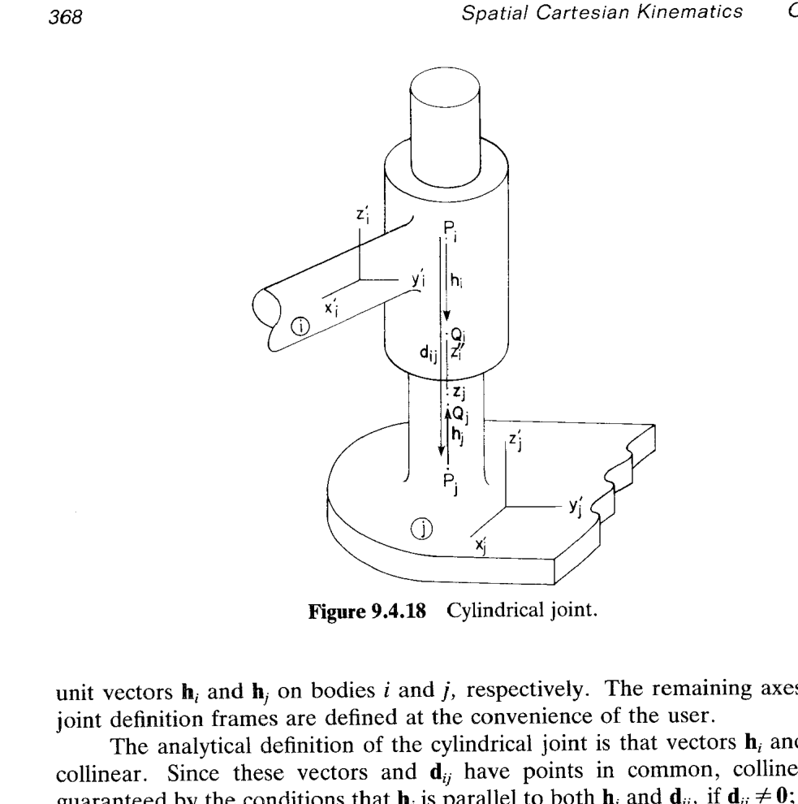

**几何鲁棒性说明**：书中特意指出——即使 $\mathbf{d}_{ij}=\mathbf{0}$（$P_i,P_j$ 重合），第一条 $\Phi^{p1}$ 也已经保证 $\mathbf{h}_i\parallel\mathbf{h}_j$，故 $\mathbf{h}_i$ 通过 $P_j=P_i$——柱铰几何仍然被强制。避开了 $\Phi^{p2}$ 单独的 $\mathbf{d}_{ij}=\mathbf{0}$ 失效问题。

### 例 9.4.9：柱铰的验证（在例 9.4.8 上加平移）

$\mathbf{r}_2=[0,0,s]^T=\mathbf{d}_{12}$（多了一个滑动量 $s$；姿态部分同例 9.4.8）。$\Phi^{p1}$ 与 $s$ 无关，已验证。剩下算 $\Phi^{p2}$：

$$
\Phi^{p2}(\mathbf{h}_1,\mathbf{d}_{12})=\begin{bmatrix}\mathbf{f}_1'^T\mathbf{A}_1^T\mathbf{d}_{12}\\ \mathbf{g}_1'^T\mathbf{A}_1^T\mathbf{d}_{12}\end{bmatrix}=\begin{bmatrix}[1,0,0][0,0,s]^T\\ [0,1,0][0,0,s]^T\end{bmatrix}=\begin{bmatrix}0\\0\end{bmatrix}=\mathbf{0}
$$

对所有 $\theta,s$ 恒成立——柱铰约束满足。

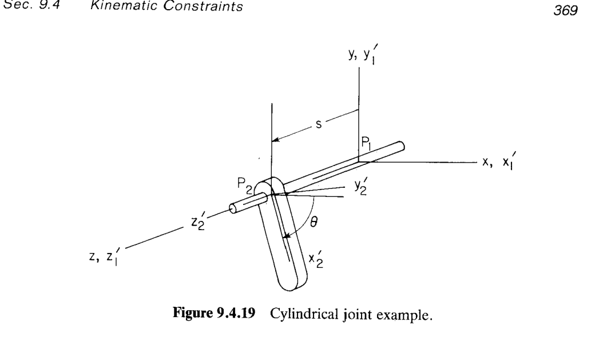

### 移动副 / 平移副（Translational Joint）（5 方程，1 DOF）

允许沿共同轴平移，**不允许**绕此轴相对转动（图 9.4.20）。在柱铰基础上再加"两体 $x''$ 轴保持正交"：

$$
\boxed{\;\Phi^{p1}(\mathbf{h}_i,\mathbf{h}_j)=\mathbf{0},\;\;\Phi^{p2}(\mathbf{h}_i,\mathbf{d}_{ij})=\mathbf{0},\;\;\Phi^{d1}(\mathbf{f}_i,\mathbf{f}_j)=0\;}\tag{9.4.24}
$$

$2+2+1=5$ 方程，1 个相对 DOF（沿轴滑 $s$）。

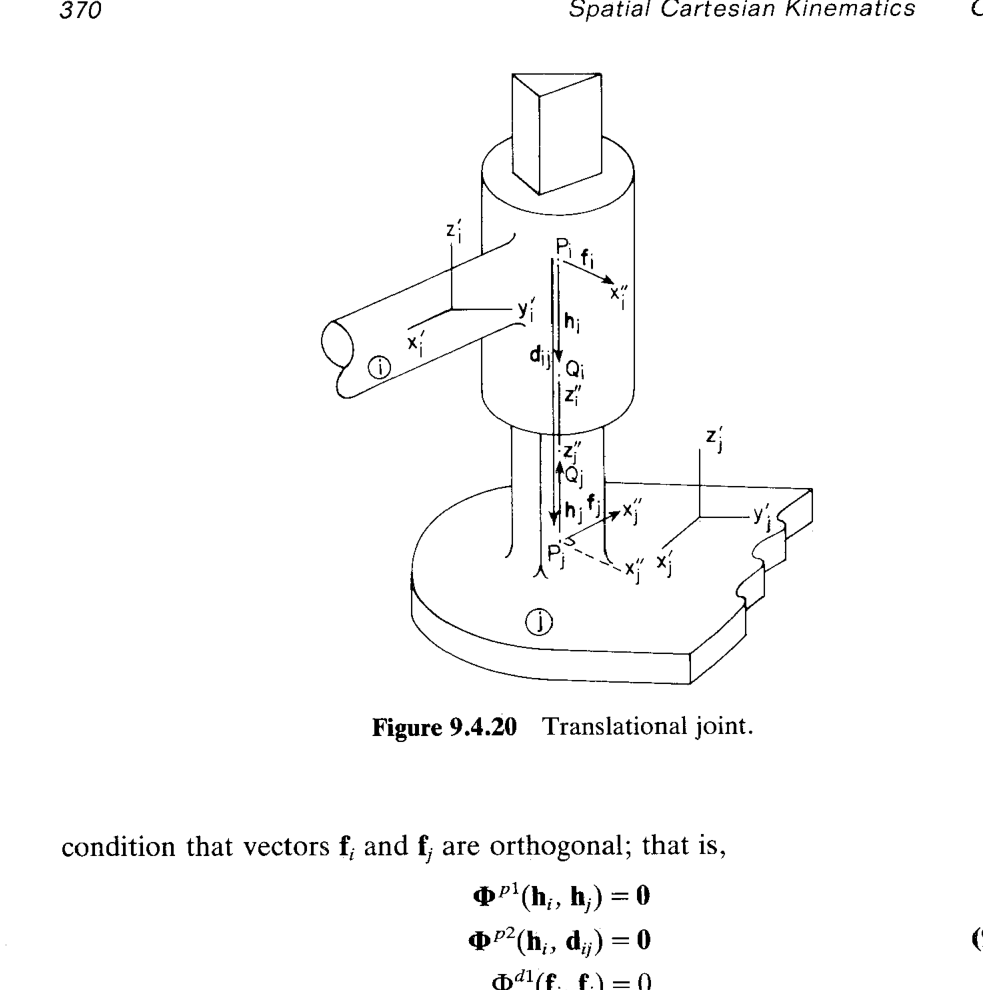

### 例 9.4.10：平移副的验证

> $\mathbf{A}_1=\mathbf{I}$、$\mathbf{A}_2=\begin{bmatrix}0&-1&0\\1&0&0\\0&0&1\end{bmatrix}$（绕 $z$ 转 $\pi/2$），$\mathbf{r}_2=[0,0,s]^T$。

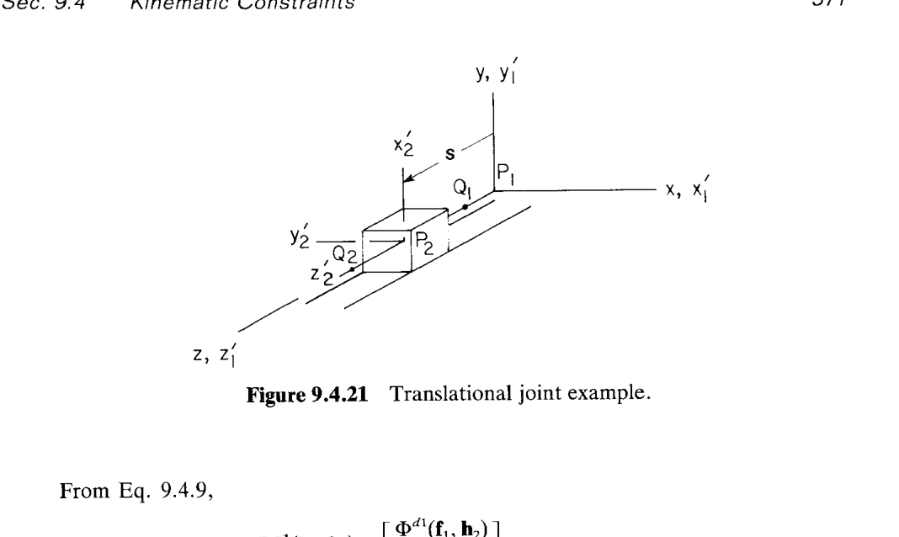

**$\Phi^{p1}(\mathbf{h}_1,\mathbf{h}_2)$**：$\mathbf{h}_1'=\mathbf{h}_2'=[0,0,1]^T$、$\mathbf{f}_1'=[1,0,0]^T$、$\mathbf{g}_1'=[0,1,0]^T$。$\mathbf{A}_2\mathbf{h}_2'=[0,0,1]^T$。

$$
\Phi^{p1}=\begin{bmatrix}[0,-1,0][0,0,1]^T\\ [1,0,0][0,0,1]^T\end{bmatrix}=\mathbf{0}\quad(\text{注:}\mathbf{f}_1'^T\mathbf{A}_2\mathbf{h}_2'=\mathbf{f}_1'^T[0,0,1]^T\text{...})
$$

**$\Phi^{p2}(\mathbf{h}_1,\mathbf{d}_{12})$**：$\mathbf{d}_{12}=[0,0,s]^T$，同柱铰例验证过 $=\mathbf{0}$。

**$\Phi^{d1}(\mathbf{f}_1,\mathbf{f}_2)$**：$\mathbf{f}_2'=[1,0,0]^T$，$\mathbf{A}_2\mathbf{f}_2'=\mathbf{A}_2[1,0,0]^T=[0,1,0]^T$（$\mathbf{A}_2$ 第 1 列）。

$$
\Phi^{d1}(\mathbf{f}_1,\mathbf{f}_2)=[1,0,0][0,1,0]^T=0
$$

对所有 $s$ 恒成立——平移副满足。

### 螺旋副（Screw Joint）（5 方程，1 DOF）

柱铰 + 螺距耦合。当共轴两体相对转 $\theta$ 时，同时沿轴滑 $\alpha\theta$（$\alpha$ = 螺距，pitch）。**关键定义**：转角 $\theta$ 是 $x_i''$ 与 $x_j''$ 之间的夹角，**累计**转数用 $n$ 记录；$\theta_0$ 是当 $P_i=P_j$ 时两 $x''$ 轴的初始夹角。**进给条件**（Eq. 9.4.25）：

$$
\mathbf{h}_i^T\mathbf{d}_{ij}=\alpha(\theta+2n\pi-\theta_0)
$$

其中 $0\le (1/\alpha)\mathbf{h}_i^T\mathbf{d}_{ij}-2n\pi+\theta_0\le 2\pi$（把累计角度归位在一圈内）。

**完整螺旋副约束**：柱铰约束（Eq. 9.4.23）**加**上式移到齐次形：

$$
\boxed{\;\Phi^{scr}(\mathbf{h}_i,\mathbf{d}_{ij},\alpha,\theta_0)\equiv\Phi^{d2}(\mathbf{h}_i,\mathbf{d}_{ij})-\alpha(\theta+2n\pi-\theta_0)=0\;}\tag{9.4.26}
$$

（注：书中把 $\mathbf{h}_i^T\mathbf{d}_{ij}$ 记为 $\Phi^{d2}(\mathbf{h}_i,\mathbf{d}_{ij})$，形式一致。）加上柱铰 4 条 = **5 方程，1 DOF**。

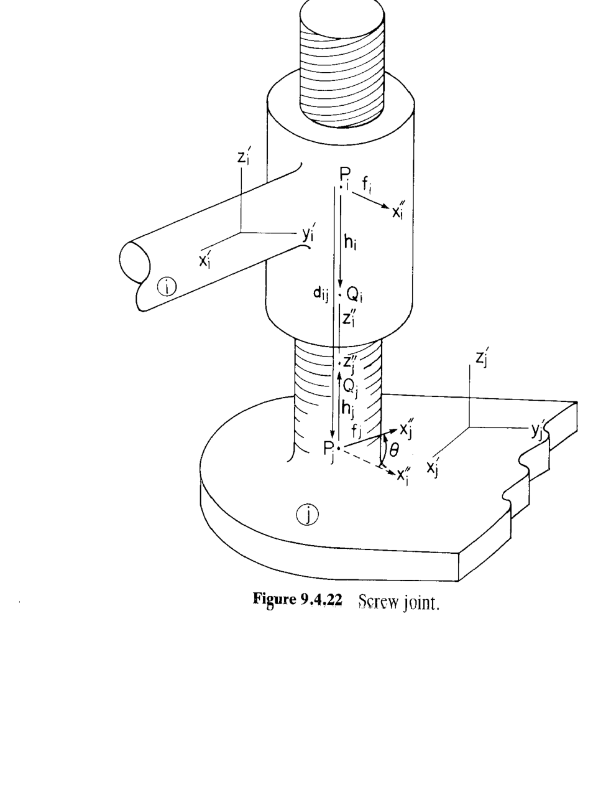

**$\theta$ 对广义坐标的偏导**（用于 Jacobian 装配）——从 $\theta$ 的定义 Eq. 9.2.61 出发，结合 $\delta\boldsymbol{\pi}'=2\mathbf{G}\,\delta\mathbf{p}$，得

$$
\begin{aligned}
&\theta_{\mathbf{r}_i}=\mathbf{0},\quad \theta_{\mathbf{r}_j}=\mathbf{0},\\
&\theta_{\pi_i'}=-\mathbf{h}_i'^T,\quad\frac{\partial\theta}{\partial\mathbf{p}_i}=-2\mathbf{h}_i'^T\mathbf{G}_i,\\
&\theta_{\pi_j'}=\mathbf{h}_i'^T\mathbf{A}_i^T\mathbf{A}_j,\quad\frac{\partial\theta}{\partial\mathbf{p}_j}=2\mathbf{h}_i'^T\mathbf{A}_i^T\mathbf{A}_j\mathbf{G}_j
\end{aligned}\tag{9.4.27}
$$

### 例 9.4.11：螺旋副的验证

> 在例 9.4.9 的柱铰上加螺距耦合，$\mathbf{A}_1=\mathbf{I}$，故 $\mathbf{h}_1^T\mathbf{d}_{12}=\mathbf{h}_1'^T\mathbf{A}_1^T\mathbf{d}_{12}=[0,0,1][0,0,s]^T=s$。

由 Eq. 9.4.25，螺旋副满足当

$$
s=\alpha(\theta+2n\pi-\theta_0)
$$

即滑距与转角线性挂钩——正是螺旋副的物理意义。

---

## 9.4.5 复合关节（Composite Constraints between Pairs of Bodies）

### 思路

许多机构中，两体不是直接铰接，而是通过一段中间**连杆（coupler）**串联的（如图 9.4.23–9.4.28）。**朴素做法**：把 coupler 当第 3 体加入系统，多引入 7 个 Euler 广义坐标（3 位置 + 4 姿态）。**复合关节做法**：把 coupler 消去，只保留两端体之间的**等价约束**——省一堆坐标、也不改变机构 DOF。

**代价**：忽略了 coupler 自身的质量与惯性张量；对轻质连杆或运动学分析而言完全可以接受。

### 球-球复合关节（Spherical–Spherical，1 方程，5 DOF）

Coupler 两端各一个球副 + 长度 $C$。等价约束就是两端点距离固定：

$$
\boxed{\;\Phi^{ss}(P_i,P_j,C)=0\;}\tag{9.4.28}
$$

$1$ 方程，$5$ 个相对 DOF。**几何鲁棒性**：要求 $C>0$（否则 Jacobian 退化，见 9.4.2）。

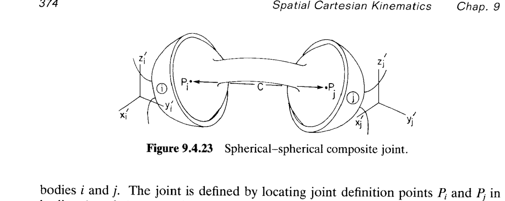

### 转-球复合关节（Revolute–Spherical，2 方程，4 DOF）

Coupler 一端与体 $i$ 通过**转动副**连接（转轴沿 $\mathbf{h}_i$，中心在 $P_i$），另一端与体 $j$ 通过**球副**连接（中心在 $P_j$）。coupler 只能在过 $P_i$ 的垂直平面内摆动、加上绕自身长轴自转——但沿长轴自转在几何上不影响两端相对姿态。等价条件是：$P_i,P_j$ 距离固定 $C$，且 **$\mathbf{d}_{ij}\perp\mathbf{h}_i$**（若不然，coupler 就"倒进"$\mathbf{h}_i$ 轴，与转动副冲突）：

$$
\boxed{\;\Phi^{ss}(P_i,P_j,C)=0,\qquad \Phi^{d2}(\mathbf{h}_i,\mathbf{d}_{ij})=0\;}\tag{9.4.29}
$$

$1+1=2$ 方程，$4$ 相对 DOF。

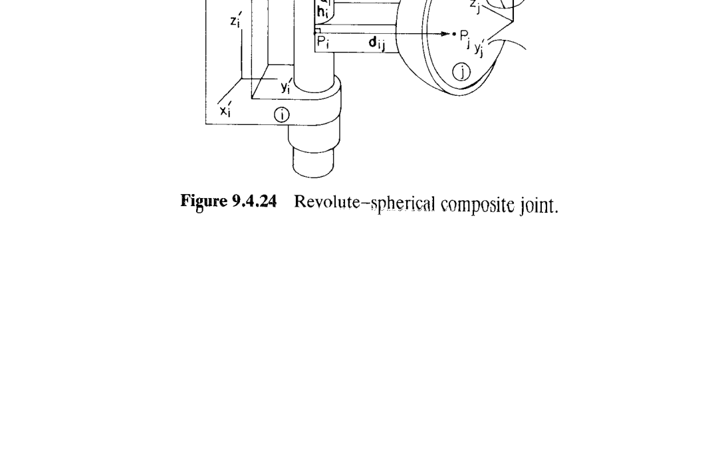

### 平行轴转-转复合关节（Revolute–Revolute Parallel，4 方程，2 DOF）

Coupler 两端各一个转动副，且两转轴**平行**、距离 $C$（图 9.4.25）。等价条件：
- $\mathbf{h}_i\parallel\mathbf{h}_j$（两转轴平行）：$\Phi^{p1}$
- $\mathbf{d}_{ij}\perp\mathbf{h}_i$（两转轴之间不"合流"）：$\Phi^{d2}$
- $|\mathbf{d}_{ij}|=C$：$\Phi^{ss}$

$$
\boxed{\;\Phi^{p1}(\mathbf{h}_i,\mathbf{h}_j)=\mathbf{0},\;\;\Phi^{d2}(\mathbf{h}_i,\mathbf{d}_{ij})=0,\;\;\Phi^{ss}(P_i,P_j,C)=0\;}\tag{9.4.30}
$$

$2+1+1=4$ 方程，$2$ 相对 DOF。

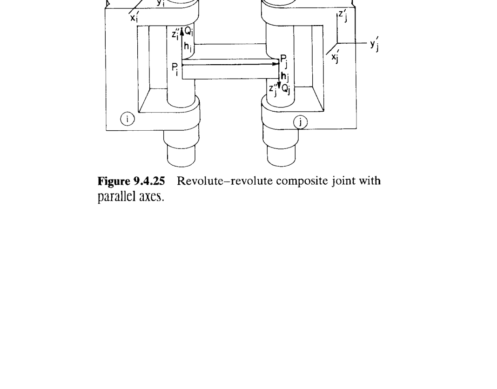

### 正交相交转-转复合关节（Revolute–Revolute Orthogonal Intersecting，4 方程，2 DOF）

Coupler 两端各一个转动副，两转轴**正交相交**（图 9.4.26）。等价条件（不同于平行版）：
- $\mathbf{h}_i\perp\mathbf{d}_{ij}$：$\Phi^{d2}(\mathbf{h}_i,\mathbf{d}_{ij})=0$
- $\mathbf{h}_j\parallel\mathbf{d}_{ij}$：$\Phi^{p2}(\mathbf{h}_j,\mathbf{d}_{ji})=\mathbf{0}$（注：$\mathbf{d}_{ji}=-\mathbf{d}_{ij}$，等价形式）
- $|\mathbf{d}_{ij}|=C$

$$
\boxed{\;\Phi^{d2}(\mathbf{h}_i,\mathbf{d}_{ij})=0,\;\;\Phi^{p2}(\mathbf{h}_j,\mathbf{d}_{ji})=\mathbf{0},\;\;\Phi^{ss}(P_i,P_j,C)=0\;}\tag{9.4.31}
$$

$1+2+1=4$ 方程，$2$ 相对 DOF。

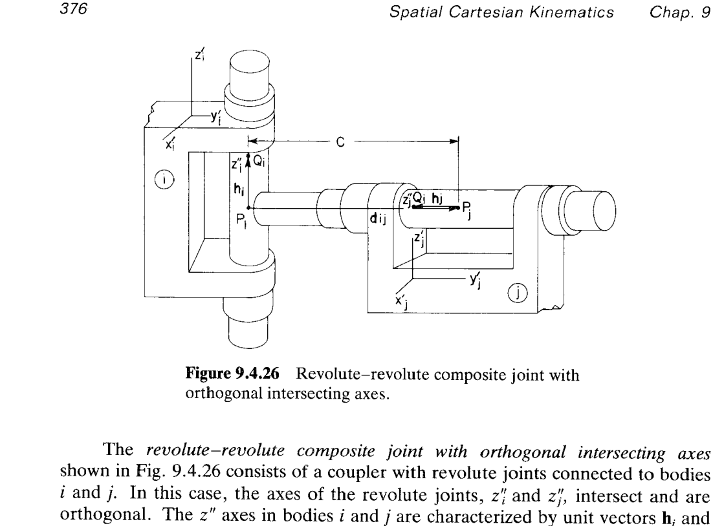

### 转-柱复合关节（Revolute–Cylindrical，2 方程，3 DOF）

Coupler 与体 $i$ 通过转动副（$\mathbf{h}_i$ 轴、点 $P_i$），与体 $j$ 通过柱铰（$\mathbf{h}_j$ 轴）连接（图 9.4.27）。几何条件：$\mathbf{h}_j\perp\mathbf{h}_i$、$\mathbf{h}_j$ 过 $P_i$：

$$
\boxed{\;\Phi^{d1}(\mathbf{h}_i,\mathbf{h}_j)=0,\qquad \Phi^{p2}(\mathbf{h}_j,\mathbf{d}_{ji})=\mathbf{0}\;}\tag{9.4.32}
$$

$1+2=3$ 方程——**但书中说 3 相对 DOF**（$6-3=3$），略去了显式的距离约束（因为柱铰允许沿 $\mathbf{h}_j$ 滑）。**几何鲁棒性**：$\mathbf{d}_{ij}=\mathbf{0}$ 时 $P_i=P_j$，$\Phi^{p2}$ 的 $\mathbf{d}_{ij}$ 消失，但物理上此时 $\mathbf{h}_j$ 自然穿过 $P_i$，几何仍满足。

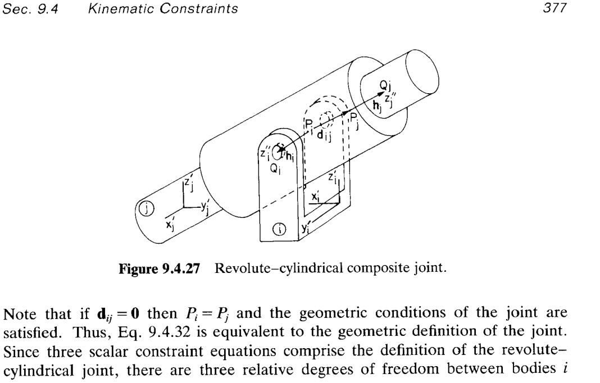

### 转-平移复合关节（Revolute–Translational，4 方程，2 DOF）

在转-柱基础上，coupler 与体 $j$ 的连接改为**平移副**（不许绕 $\mathbf{h}_j$ 转），额外要求 $\mathbf{f}_j\parallel\mathbf{h}_i$：

$$
\boxed{\;\Phi^{p1}(\mathbf{h}_i,\mathbf{f}_j)=\mathbf{0},\qquad \Phi^{p2}(\mathbf{h}_j,\mathbf{d}_{ij})=\mathbf{0}\;}\tag{9.4.33}
$$

$2+2=4$ 方程，$2$ 相对 DOF。

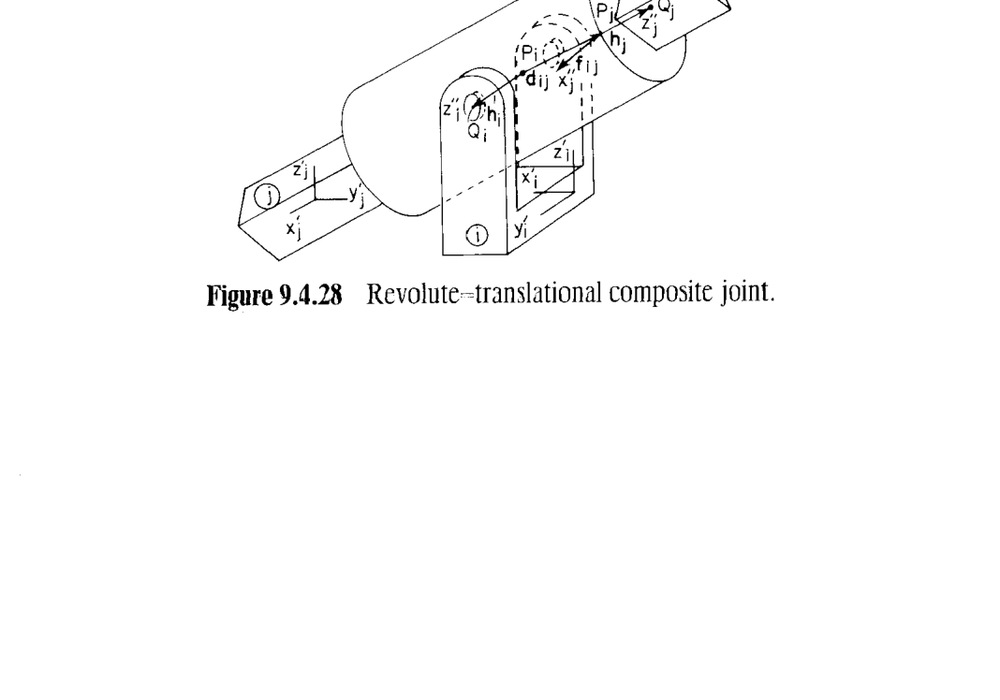

### 例 9.4.12：三种等价的空间曲柄滑块模型（Slider-Crank）

> 图 9.4.29：曲柄（体 1）绕 $z_1$ 转，通过一段 coupler 推动滑块（体 2）沿全局 $x$ 轴平移。**保留两体**（含 coupler 建模但抑制其广义坐标），系统 $nc=14$（$2\times 7$）。

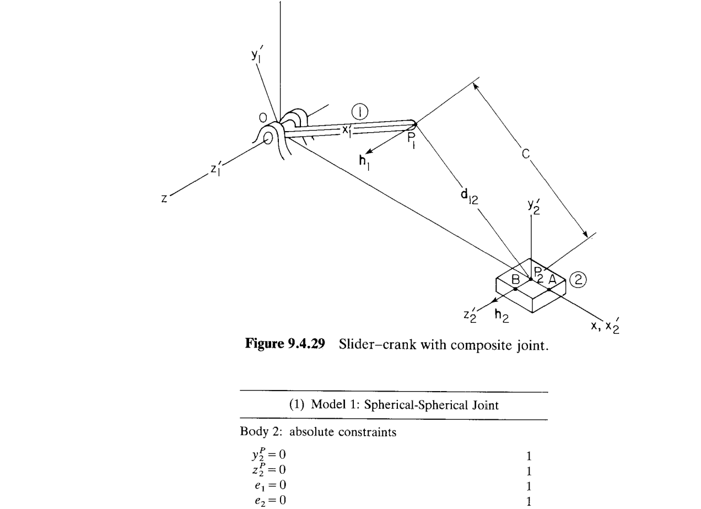

三种建模方案对同一机构的 DOF 都应为 1（曲柄独立转角），下表验证。

**模型 1：球-球连杆**

| 约束项 | 方程数 |
|--------|--------|
| 体 2 绝对：$y_2^P=0$、$z_2^P=0$ | 2 |
| 体 2 绝对：$e_1=e_2=e_3=0$（锁定姿态，只留 $e_0$，由归一化定） | 3 |
| Spherical-Spherical（coupler）$\Phi^{ss}$ | 1 |
| $O$ 处转动副 | 5 |
| Euler 归一化（两体各 1 条） | 2 |
| **合计** | **13** |

$\text{DOF}=nc-nh=14-13=1$✓

**模型 2：转-球连杆**

| 约束项 | 方程数 |
|--------|--------|
| 体 2 绝对：$y_2^P=0$ | 1 |
| 体 2 绝对：$e_1=e_2=e_3=0$ | 3 |
| Revolute-Spherical（coupler） | 2 |
| $O$ 处转动副 | 5 |
| Euler 归一化 | 2 |
| **合计** | **13** |

$\text{DOF}=14-13=1$✓（比模型 1 少 1 个绝对位置、多 1 个 coupler 约束）

**模型 3：平行轴转-转连杆**

| 约束项 | 方程数 |
|--------|--------|
| 体 2 绝对：$y_2^P=0$（点 $P$）、$y_2^A=0$（点 $A$） | 2 |
| Revolute-Revolute Parallel（coupler） | 4 |
| $O$ 处转动副 | 5 |
| Euler 归一化 | 2 |
| **合计** | **13** |

$\text{DOF}=14-13=1$✓

**关键教学点**：三种模型**方程组不同、几何等价**——用户可根据被消去 coupler 的物理特征（是刚性杆？带滑套？）选用；DOF 统计始终一致。

### 支柱复合关节（Strut，2 方程，4 DOF）

Coupler 与体 $i$ 通过**柱铰**（沿 $\mathbf{h}_i$）连接，与体 $j$ 通过球副连接（点 $P_j$）。几何本质：$\mathbf{h}_i$ 必须穿过 $P_j$——用 $\Phi^{p2}$ 表达：

$$
\boxed{\;\Phi^{p2}(\mathbf{h}_i,\mathbf{d}_{ij})=\mathbf{0}\;}\tag{9.4.34}
$$

$2$ 方程，$4$ 相对 DOF（沿 $\mathbf{h}_i$ 滑、绕 $\mathbf{h}_i$ 转、绕 $P_j$ 的球副 2 转）。**几何鲁棒性**：$\mathbf{d}_{ij}=\mathbf{0}$ 时 $P_j=P_i$，$\mathbf{h}_i$ 自然穿过 $P_j$——几何仍成立。

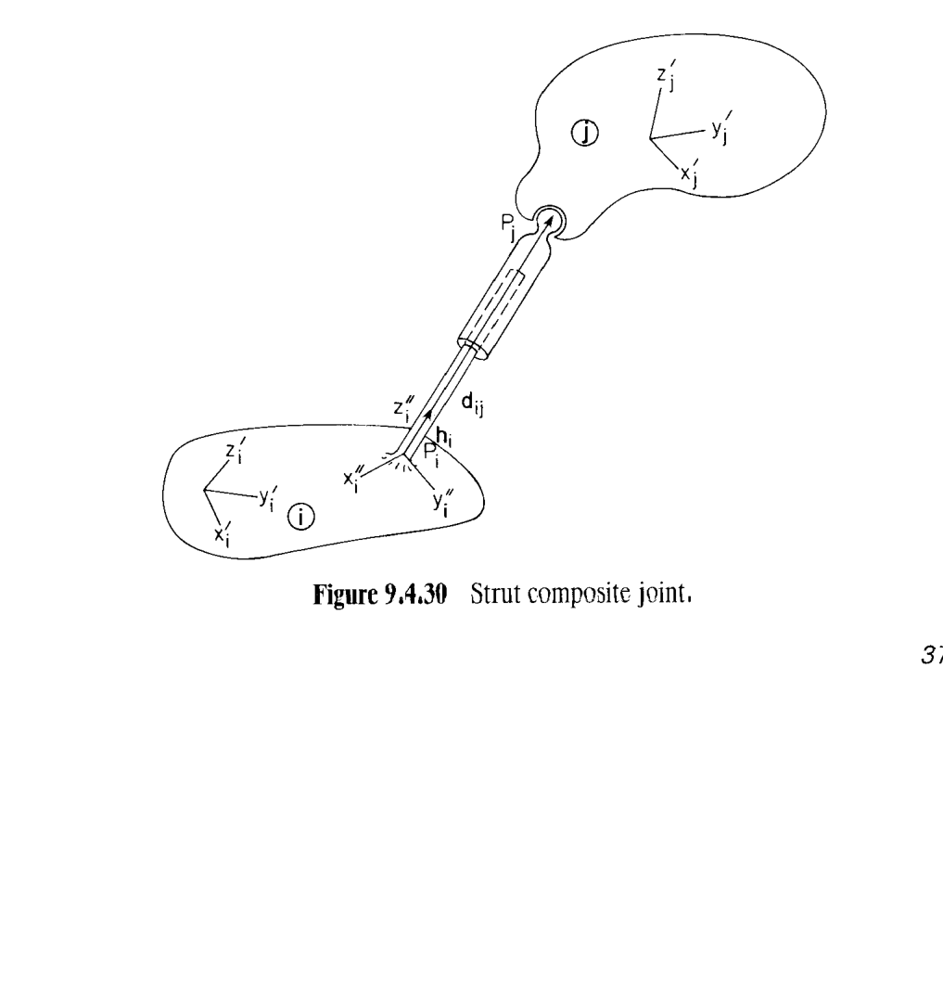

---

## 小结：本节的搭积木塔

| 层次 | 名称 | 方程数 | 相对 DOF | 主定义式 |
|------|------|--------|----------|----------|
| **原子** | Φ^d1 | 1 | — | 9.4.3 |
| | Φ^d2 | 1 | — | 9.4.6 |
| | Φ^s（球副） | 3 | 3 | 9.4.7 |
| | Φ^ss（球-球距离） | 1 | 5 | 9.4.8 |
| **1 阶复合** | Φ^p1（平行-1） | 2 | — | 9.4.9 |
| | Φ^p2（平行-2） | 2 | — | 9.4.10 |
| **绝对约束** | Φ^1..Φ^6 | 1 each | — | 9.4.15 |
| | Φ^P（绝对点） | 3 | 3（转动仍留） | 9.4.16 |
| **两体关节** | 距离（球-球） | 1 | 5 | 9.4.17 |
| | 球副 | 3 | 3 | 9.4.18 |
| | 万向节 | 4 | 2（$\phi=\pi/2$ 奇异） | 9.4.19 |
| | 转动副 | 5 | 1 | 9.4.22 |
| | 柱铰 | 4 | 2 | 9.4.23 |
| | 平移副 | 5 | 1 | 9.4.24 |
| | 螺旋副 | 5 | 1 | 9.4.26 |
| **复合关节** | 球-球（coupler） | 1 | 5 | 9.4.28 |
| | 转-球 | 2 | 4 | 9.4.29 |
| | 平行轴 转-转 | 4 | 2 | 9.4.30 |
| | 正交相交 转-转 | 4 | 2 | 9.4.31 |
| | 转-柱 | 2 | 3 | 9.4.32 |
| | 转-平移 | 4 | 2 | 9.4.33 |
| | 支柱 | 2 | 4 | 9.4.34 |

**每个关节的方程数 + 相对 DOF = 6**（空间两体总 DOF）——除去复合关节因隐去 coupler 而"少" DOF 的少数例外（支柱、转-柱、转-球，DOF 数目含 coupler 内部自由度已并入相对 DOF）。

**下一节 §9.5** 把常数换成 $C(t)$ 就得到时变的**驱动约束**——把执行器（液压缸、伺服电机）的运动强加进方程组，让 $\text{DOF}\to 0$ 就变成一个运动学确定的系统，即可送入 Newton-Raphson 求解位置、再线性求速度加速度（沿 §9.6）。

**Jacobian 的模块化装配**：Table 9.4.1 + $\Phi_\mathbf{p}=2\Phi_{\pi'}\mathbf{G}$ 是关键"接口"——DADS 等通用程序中，每个关节模块只吐出自己的 $\Phi$ 值和几个非零偏导块，由上层枢纽（JUNCTION，见 Fig. 4.1.2）拼装成整机 $\Phi_\mathbf{q}$。空间机构建模就此变成"拖拽关节积木"的工程实践。
