# 9.4 空间运动学约束（Kinematic Constraints）

> 来源：*Computer Aided Kinematics and Dynamics of Mechanical Systems, Vol. 1*，第 9 章第 4 节（书页 347–380）。

---

## 引言：本节要解决什么

本节主要介绍各种具体情况下的约束表达式。这里比较重要的是 “基本约束的微分与偏导” 这一小段，看懂他，就能理解 Jacobi 的构造。

---

## 9.4.1 关节坐标系（Joint Definition Frames）

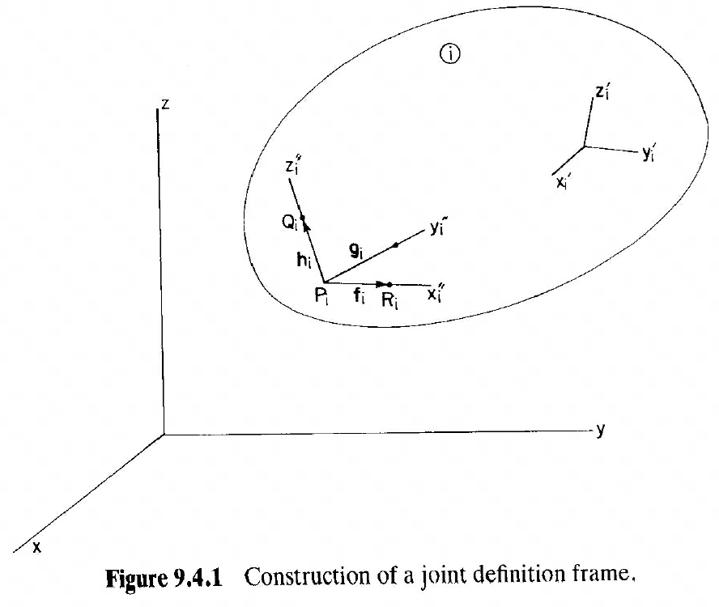

在本书中，关节坐标系使用 '' 来标识。如图 9.4.1，在刚体 $i$ 上取一点 $P_i$ 作为关节坐标系原点；沿 $z_i''$ 距 $P_i$ 一个单位取点 $Q_i$，据此定 $\mathbf{h}_i$；沿 $x_i''$ 距 $P_i$ 一个单位取点 $R_i$，据此定 $\mathbf{f}_i$；最后叉乘得到 $\mathbf{g}_i=\tilde{\mathbf{h}}_i\mathbf{f}_i$，由此得到关节坐标系 $x_i''\text{-}y_i''\text{-}z_i''$。

关节坐标系三个单位向量 $\mathbf{f}_i,\mathbf{g}_i,\mathbf{h}_i$ 在**刚体坐标系** $x_i'\text{-}y_i'\text{-}z_i'$ 下为 $\mathbf{f}_i',\mathbf{g}_i',\mathbf{h}_i'$。则关节坐标系到刚体坐标系的变换矩阵是

$$
\boxed{\;\mathbf{C}_i^P=[\mathbf{f}_i',\;\mathbf{g}_i',\;\mathbf{h}_i']\;}\tag{9.4.1}
$$

任何在关节坐标系下的坐标 $\mathbf{s}''$ 都可由 $\mathbf{s}'=\mathbf{C}_i^P\mathbf{s}''$ 变到刚体坐标系，再由 $\mathbf{s}=\mathbf{A}_i\mathbf{s}'$ 变到全局坐标系。

### 例 9.4.1：斜置转动轴（$\pi/4$ 倾角）

> 图 9.4.2 中，转轴 $x_2''$ 位于 $x_2'\text{-}y_2'$ 平面内，与 $x_2'$ 轴夹 $\pi/4$。求关节定义系到随体系的变换 $\mathbf{C}_2^P$。

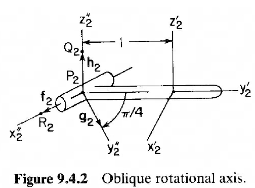

**第一步（$\mathbf{h}'_2$）**：$z_2''$ 与 $z_2'$ 平行，所以

$$\mathbf{h}_2'=[0,0,1]^T$$

**第二步（$\mathbf{f}'_2$）**：$x_2''$ 在 $x_2'\text{-}y_2'$ 平面内，从 $x_2'$ 逆时针转 $-\pi/4$（图中箭头方向），因此

$$\mathbf{f}_2'=\left[\frac{\sqrt2}{2},\;-\frac{\sqrt2}{2},\;0\right]^T$$

**第三步（$\mathbf{g}'_2=\tilde{\mathbf{h}}'_2\mathbf{f}'_2$）**：由 tilde 算子（Eq. 9.1.21），$\tilde{\mathbf{h}}'_2=\begin{bmatrix}0&-1&0\\1&0&0\\0&0&0\end{bmatrix}$，则

$$
\mathbf{g}_2'=\begin{bmatrix}0&-1&0\\1&0&0\\0&0&0\end{bmatrix}\begin{bmatrix}\sqrt2/2\\-\sqrt2/2\\0\end{bmatrix}=\begin{bmatrix}\sqrt2/2\\\sqrt2/2\\0\end{bmatrix}
$$

**装配 $\mathbf{C}_2^P$**：按 Eq. 9.4.1，把三列拼起来

$$
\mathbf{C}_2^P=[\mathbf{f}_2',\mathbf{g}_2',\mathbf{h}_2']=\begin{bmatrix}
\dfrac{\sqrt2}{2}&\dfrac{\sqrt2}{2}&0\\[6pt]
-\dfrac{\sqrt2}{2}&\dfrac{\sqrt2}{2}&0\\[6pt]
0&0&1
\end{bmatrix}
$$

---

## 9.4.2 向量与点上的约束（Constraints on Vectors and Points）

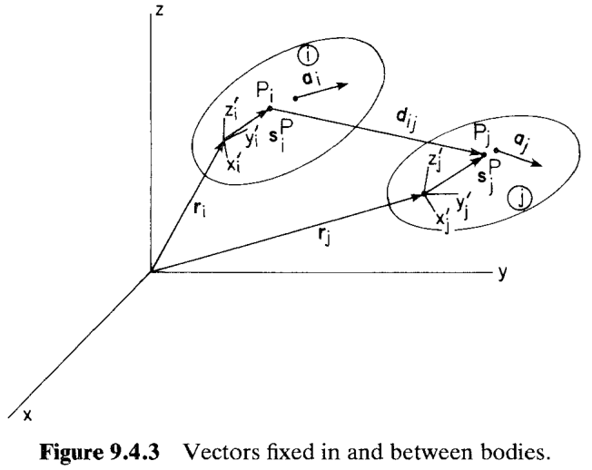

如图 9.4.3，$\mathbf{a}_i,\mathbf{a}_j$ 分别是刚体 $i,j$ 上的固定随体向量；$P_i,P_j$ 是各自刚体的刚体坐标系参考点；$\mathbf{d}_{ij}=\mathbf{r}_j+\mathbf{A}_j\mathbf{s}_j'^P-\mathbf{r}_i-\mathbf{A}_i\mathbf{s}_i'^P$ 是从 $P_i$ 指向 $P_j$ 的连线。

### 基本约束（Basic Constraints）

本小节造**四个基本约束原子**——两个"点积型"（dot-1、dot-2）、一个球副（点重合）、一个球-球（距离固定）。所有更复杂的关节约束都是它们的线性组合。

#### d1：向量正交约束

两非零向量 $\mathbf{a}_i,\mathbf{a}_j$ 正交的充要条件是它们的点积为 0。在全局坐标系下有：

$$
\Phi^{d1}(\mathbf{a}_i,\mathbf{a}_j)\equiv\mathbf{a}_i^T\mathbf{a}_j=0\tag{9.4.2}
$$

在刚体坐标系下（$\mathbf{a}_i=\mathbf{A}_i\mathbf{a}_i'$）：

$$
\boxed{\;\Phi^{d1}(\mathbf{a}_i,\mathbf{a}_j)=\mathbf{a}_i'^T\mathbf{A}_i^T\mathbf{A}_j\mathbf{a}_j'=0\;}\tag{9.4.3}
$$

$\Phi^{d1}$ 只包含**姿态**（$\mathbf{A}_i,\mathbf{A}_j$），不含平移 $\mathbf{r}_i,\mathbf{r}_j$；因此它**只约束两个刚体的相对朝向**，不约束位置。

##### 例 9.4.2：斜置摆的 dot-1 约束

> 例 9.4.1 中的杆 2 通过铰链绑到地面（体 1），铰链在体 1 上就是 $y_1$ 轴（图 9.4.4）。要让斜置摆能绕 $y_1$ 轴转，铰的转轴 $\mathbf{f}_2$ 必须始终垂直于体 1 的 $\mathbf{h}_1$ 与 $\mathbf{f}_1$。

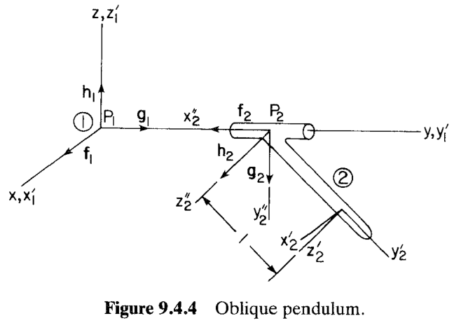

**基本量**：因为刚体 1 是地面，其坐标系与全局坐标系重合，$\mathbf{A}_1=\mathbf{I}$；$\mathbf{f}_1'=[1,0,0]^T$，$\mathbf{h}_1'=[0,0,1]^T$；刚体 2 的朝向由 Euler 参数 $\mathbf{p}=[e_0,e_1,e_2,e_3]^T$ 描述，$\mathbf{f}_2'=\left[\tfrac{\sqrt2}{2},-\tfrac{\sqrt2}{2},0\right]^T$。

**约束 1（$\mathbf{f}_2\perp\mathbf{f}_1$）**：

$$
\Phi^{d1}(\mathbf{f}_2,\mathbf{f}_1)=\mathbf{f}_2'^T\mathbf{A}_2^T\mathbf{A}_1\mathbf{f}_1'=\sqrt2\,(e_0^2+e_1^2-\tfrac12-e_1e_2+e_0e_3)=0
$$

**约束 2（$\mathbf{f}_2\perp\mathbf{h}_1$）**：类似可得：

$$
\Phi^{d1}(\mathbf{f}_2,\mathbf{h}_1)=\sqrt2\,(e_1e_3+e_0e_2-e_2e_3-e_0e_1)=0
$$

#### d2：随体向量与体间连线正交

给定随体向量 $\mathbf{a}_i$ 与体间连线 $\mathbf{d}_{ij}=\mathbf{r}_j+\mathbf{A}_j\mathbf{s}_j'^P-\mathbf{r}_i-\mathbf{A}_i\mathbf{s}_i'^P$（要求 $\mathbf{d}_{ij}\ne\mathbf{0}$），dot-2 约束为

$$
\Phi^{d2}(\mathbf{a}_i,\mathbf{d}_{ij})\equiv\mathbf{a}_i^T\mathbf{d}_{ij}=0\tag{9.4.4}
$$

展开得到：

$$
\boxed{\;\Phi^{d2}(\mathbf{a}_i,\mathbf{d}_{ij})=\mathbf{a}_i'^T\mathbf{A}_i^T(\mathbf{r}_j+\mathbf{A}_j\mathbf{s}_j'^P-\mathbf{r}_i)-\mathbf{a}_i'^T\mathbf{s}_i'^P=0\;}\tag{9.4.6}
$$

**中间一步的细节**：$\mathbf{a}_i^T\mathbf{A}_i\mathbf{s}_i'^P=\mathbf{a}_i'^T\mathbf{A}_i^T\mathbf{A}_i\mathbf{s}_i'^P=\mathbf{a}_i'^T\mathbf{s}_i'^P$。

**注意**：
1. **不对 $i,j$ 对称**：交换 $i\leftrightarrow j$（要求 $\mathbf{a}_j\perp\mathbf{d}_{ij}$）不是同一条方程。
2. **$\mathbf{d}_{ij}=\mathbf{0}$ 时约束失效**：正交性关于零向量恒成立。

#### 两点重合 $\Phi^s$

$P_i,P_j$ 重合的充要条件是 $\mathbf{d}_{ij}=\mathbf{0}$：

$$
\boxed{\;\Phi^s(P_i,P_j)\equiv\mathbf{r}_j+\mathbf{A}_j\mathbf{s}_j'^P-\mathbf{r}_i-\mathbf{A}_i\mathbf{s}_i'^P=\mathbf{0}\;}\tag{9.4.7}
$$

#### 距离约束 $\Phi^{ss}$

两点间距离等于 $C\ne 0$：

$$
\boxed{\;\Phi^{ss}(P_i,P_j,C)\equiv\mathbf{d}_{ij}^T\mathbf{d}_{ij}-C^2=0\;}\tag{9.4.8}
$$

特别注意，**距离约束只用于 $C>0$；两点重合需要用约束 $\Phi^s$**，否则约束 Jacobi 会不满秩。

##### 例 9.4.4：复合摆的距离约束

> 如图 9.4.5(a)：刚体 2 上的点 $P_2$ 与地面上定点 $P_1$ 之间由长度为 $C$ 的刚性轻连杆连接。

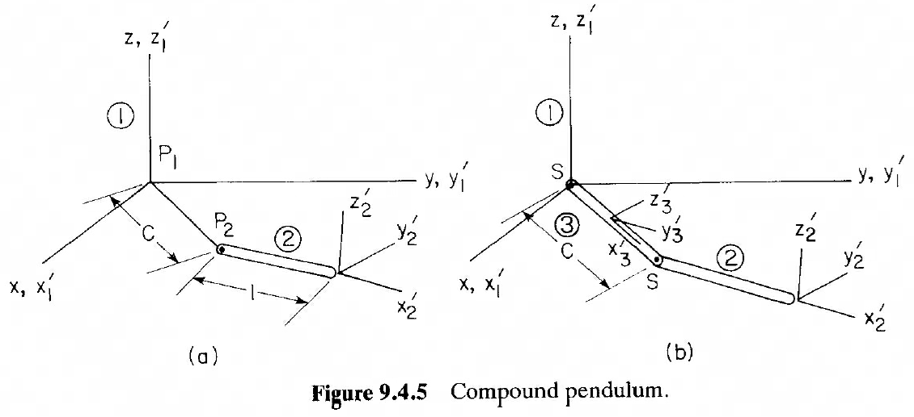

**$\mathbf{d}_{12}$ 展开**：

$$
\mathbf{d}_{12}=\mathbf{r}_2+\mathbf{A}_2[-1,0,0]^T=[x_2,y_2,z_2]^T+\mathbf{A}_2[-1,0,0]^T=[x_2-2e_0^2-2e_1^2+1,\;y_2-2e_1e_2-2e_0e_3,\;z_2-2e_1e_3+2e_0e_2]^T
$$

**代回 Eq. 9.4.8**：

$$
\Phi^{ss}(P_1,P_2,C)=(x_2-2e_0^2-2e_1^2+1)^2+(y_2-2e_1e_2-2e_0e_3)^2+(z_2-2e_1e_3+2e_0e_2)^2-C^2=0
$$

### 基本约束的组合

#### 两向量平行

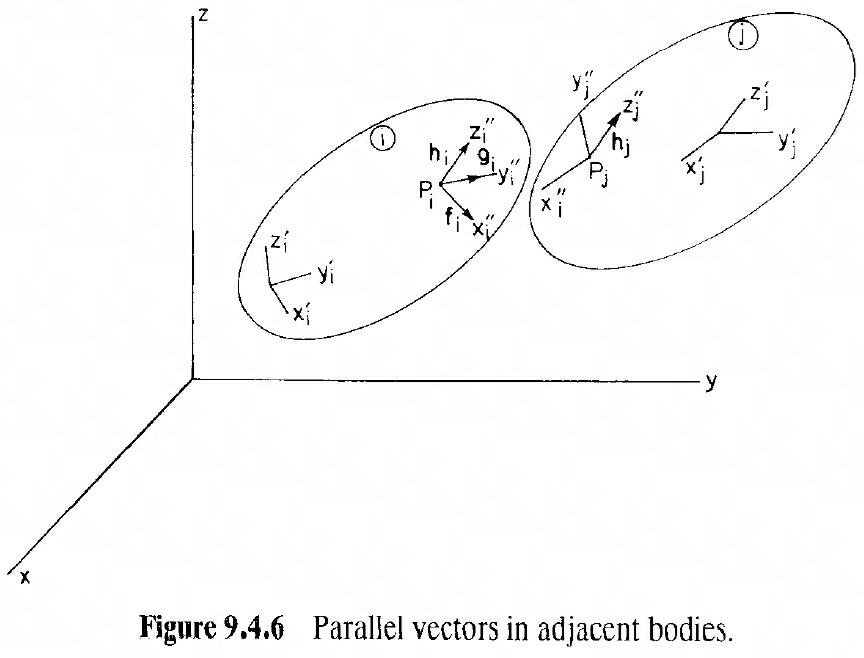

"$\mathbf{h}_i\parallel\mathbf{h}_j$"等价于"$\mathbf{h}_j$ 与 $\mathbf{f}_i,\mathbf{g}_i$（$\mathbf{h}_i$ 平面内的两根正交向量）都正交"。用两个 d1 表达：

$$
\boxed{\;\Phi^{p1}(\mathbf{h}_i,\mathbf{h}_j)=\begin{bmatrix}\Phi^{d1}(\mathbf{f}_i,\mathbf{h}_j)\\\Phi^{d1}(\mathbf{g}_i,\mathbf{h}_j)\end{bmatrix}=\mathbf{0}\;}\tag{9.4.9}
$$

#### 向量与连线平行

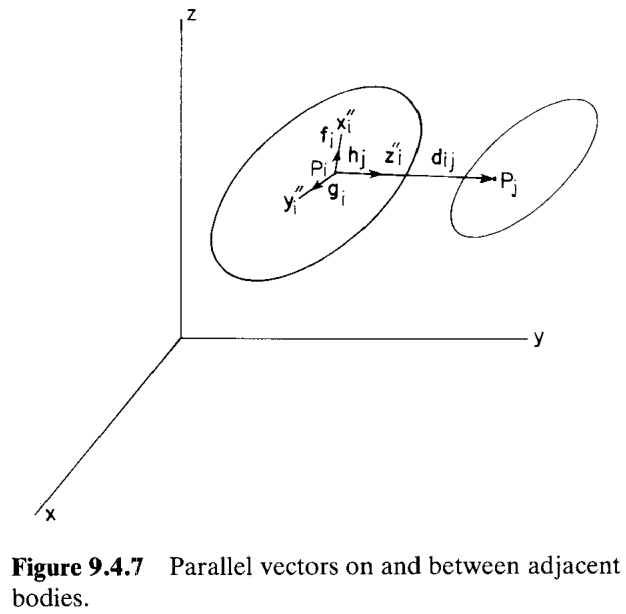

"$\mathbf{h}_i\parallel\mathbf{d}_{ij}$"等价于"$\mathbf{d}_{ij}\perp\mathbf{f}_i$ 且 $\mathbf{d}_{ij}\perp\mathbf{g}_i$"。用两个 d2 表达：

$$
\boxed{\;\Phi^{p2}(\mathbf{h}_i,\mathbf{d}_{ij})=\begin{bmatrix}\Phi^{d2}(\mathbf{f}_i,\mathbf{d}_{ij})\\\Phi^{d2}(\mathbf{g}_i,\mathbf{d}_{ij})\end{bmatrix}=\mathbf{0}\;}\tag{9.4.10}
$$

### 基本约束的微分与偏导

**动机**：动力学需要约束方程对 $(\mathbf{r}_i,\mathbf{p}_i;\mathbf{r}_j,\mathbf{p}_j)$ 的一阶偏导（构成 Jacobian $\Phi_\mathbf{q}$）。§9.2 已铺垫：$\delta\mathbf{A}=\delta\tilde{\boldsymbol{\pi}}\mathbf{A}$（Eq. 9.2.47），$\delta(\mathbf{A}\mathbf{s}')=-\mathbf{A}\tilde{\mathbf{s}}'\delta\boldsymbol{\pi}'$（Eq. 9.2.51）。这里逐条求出四个原子约束的**全微分**，再从中读出偏导。

**d1 微分**：

$$
\boxed{\;\delta\Phi^{d1}(\mathbf{a}_i,\mathbf{a}_j)=-\bigl(\mathbf{a}_j'^T\mathbf{A}_j^T\mathbf{A}_i\tilde{\mathbf{a}}_i'\,\delta\boldsymbol{\pi}_i'+\mathbf{a}_i'^T\mathbf{A}_i^T\mathbf{A}_j\tilde{\mathbf{a}}_j'\,\delta\boldsymbol{\pi}_j'\bigr)\;}\tag{9.4.11}
$$

**d2 微分**：

$$
\delta\Phi^{d2}(\mathbf{a}_i,\mathbf{d}_{ij})=\mathbf{a}_i^T\delta\mathbf{d}_{ij}+\mathbf{d}_{ij}^T\delta\mathbf{a}_i
$$

代入 $\delta\mathbf{d}_{ij}=\delta\mathbf{r}_j-\mathbf{A}_j\tilde{\mathbf{s}}_j'^P\delta\boldsymbol{\pi}_j'-\delta\mathbf{r}_i+\mathbf{A}_i\tilde{\mathbf{s}}_i'^P\delta\boldsymbol{\pi}_i'$（Eq. 9.2.53）与 $\delta\mathbf{a}_i=-\mathbf{A}_i\tilde{\mathbf{a}}_i'\delta\boldsymbol{\pi}_i'$：

$$
\begin{aligned}
\delta\Phi^{d2}
&=\mathbf{a}_i'^T\mathbf{A}_i^T\delta\mathbf{r}_j-\mathbf{a}_i'^T\mathbf{A}_i^T\delta\mathbf{r}_i-\mathbf{a}_i'^T\mathbf{A}_i^T\mathbf{A}_j\tilde{\mathbf{s}}_j'^P\delta\boldsymbol{\pi}_j'\\
&\quad+(\mathbf{a}_i'^T\tilde{\mathbf{s}}_i'^P-\mathbf{d}_{ij}^T\mathbf{A}_i\tilde{\mathbf{a}}_i')\delta\boldsymbol{\pi}_i'
\end{aligned}\tag{9.4.12}
$$

**两点重合微分**：

$$
\delta\Phi^{s}(P_i,P_j)=\delta\mathbf{r}_j-\mathbf{A}_j\tilde{\mathbf{s}}_j'^P\delta\boldsymbol{\pi}_j'-\delta\mathbf{r}_i+\mathbf{A}_i\tilde{\mathbf{s}}_i'^P\delta\boldsymbol{\pi}_i'\tag{9.4.13}
$$

**距离约束微分**：

$$
\delta\Phi^{ss}(P_i,P_j,C)=2\mathbf{d}_{ij}^T\delta\mathbf{d}_{ij}=2\mathbf{d}_{ij}^T(\delta\mathbf{r}_j-\mathbf{A}_j\tilde{\mathbf{s}}_j'^P\delta\boldsymbol{\pi}_j'-\delta\mathbf{r}_i+\mathbf{A}_i\tilde{\mathbf{s}}_i'^P\delta\boldsymbol{\pi}_i')\tag{9.4.14}
$$

**统一格式**：所有基本约束都可以写成

$$
\delta\Phi=\Phi_{\mathbf{r}_i}\delta\mathbf{r}_i+\Phi_{\pi_i'}\delta\boldsymbol{\pi}_i'+\Phi_{\mathbf{r}_j}\delta\mathbf{r}_j+\Phi_{\pi_j'}\delta\boldsymbol{\pi}_j'=\mathbf{0}
$$

对照系数得 Table 9.4.1：

| 约束 | $\Phi_{\mathbf{r}_i}$ | $\Phi_{\mathbf{r}_j}$ | $\Phi_{\pi_i'}$ | $\Phi_{\pi_j'}$ |
|------|---------------------|---------------------|-----------------|-----------------|
| $\Phi^{d1}(\mathbf{a}_i,\mathbf{a}_j)$ | $\mathbf{0}$ | $\mathbf{0}$ | $-\mathbf{a}_j'^T\mathbf{A}_j^T\mathbf{A}_i\tilde{\mathbf{a}}_i'$ | $-\mathbf{a}_i'^T\mathbf{A}_i^T\mathbf{A}_j\tilde{\mathbf{a}}_j'$ |
| $\Phi^{d2}(\mathbf{a}_i,\mathbf{d}_{ij})$ | $-\mathbf{a}_i'^T\mathbf{A}_i^T$ | $\mathbf{a}_i'^T\mathbf{A}_i^T$ | $\mathbf{a}_i'^T\tilde{\mathbf{s}}_i'^P-\mathbf{d}_{ij}^T\mathbf{A}_i\tilde{\mathbf{a}}_i'$ | $-\mathbf{a}_i'^T\mathbf{A}_i^T\mathbf{A}_j\tilde{\mathbf{s}}_j'^P$ |
| $\Phi^{s}(P_i,P_j)$ | $-\mathbf{I}$ | $\mathbf{I}$ | $\mathbf{A}_i\tilde{\mathbf{s}}_i'^P$ | $-\mathbf{A}_j\tilde{\mathbf{s}}_j'^P$ |
| $\Phi^{ss}(P_i,P_j,C)$ | $-2\mathbf{d}_{ij}^T$ | $2\mathbf{d}_{ij}^T$ | $2\mathbf{d}_{ij}^T\mathbf{A}_i\tilde{\mathbf{s}}_i'^P$ | $-2\mathbf{d}_{ij}^T\mathbf{A}_j\tilde{\mathbf{s}}_j'^P$ |

这里要注意，$\Phi_{\pi'}$ 不是真正的偏导——因为虚旋转 $\pi'$ 是准坐标，不可积；它只是 $\delta\boldsymbol{\pi}'$ 的系数矩阵。要得到对 Euler 参数 $\mathbf{p}$ 的偏导，用 $\delta\boldsymbol{\pi}'=2\mathbf{G}\,\delta\mathbf{p}$（Eq. 9.3.41），得到 $\Phi_{\mathbf{p}_i}=2\Phi_{\pi_i'}\mathbf{G}_i$。

**此时，完整的表达式为**：

$$
\delta\Phi=\Phi_{\mathbf{r}_i}\delta\mathbf{r}_i+2\Phi_{\pi_i'}\mathbf{G}_i\,\delta\mathbf{p}_i+\Phi_{\mathbf{r}_j}\delta\mathbf{r}_j+2\Phi_{\pi_j'}\mathbf{G}_j\,\delta\mathbf{p}_j=\mathbf{0}
$$

这正是**构建 Jacobian $\Phi_\mathbf{q}$（$\mathbf{q}=[\mathbf{r}_i;\mathbf{p}_i;\mathbf{r}_j;\mathbf{p}_j;\dots]$）的钥匙**。

---

## 9.4.3 单刚体的绝对约束（Absolute Constraints on a Body）

"绝对约束"是指：把刚体 $i$ 上某点 $P_i$ 的位置坐标或 Euler 参数直接**钉在常数**上，可获得 6 类基本约束（Eq. 9.4.15）：

$$
\begin{aligned}
\Phi^1&=x_i^P-x_i^0=0\\
\Phi^2&=y_i^P-y_i^0=0\\
\Phi^3&=z_i^P-z_i^0=0\\
\Phi^4&=e_{1i}-e_{1i}^0=0\\
\Phi^5&=e_{2i}-e_{2i}^0=0\\
\Phi^6&=e_{3i}-e_{3i}^0=0
\end{aligned}\tag{9.4.15}
$$

**用法**：
- 前 3 个可**独立使用**（钉住点 $P_i$ 的某个笛卡尔分量），每个消 1 DOF。
- 后 3 个应**成组使用**——3 个 Euler 分量再加 Eq. 9.3.9 归一化，完全锁定姿态；若单独钉住某一个 $e_{ki}$，物理意义模糊。
- **全部 6 条**联用即刚体 $i$ 对地面刚性固定（**ground constraint**）。

#### 例 9.4.6：柱铰

> 图 9.4.9：刚体 2 上取两点 $P_1,P_2$（均在 $x_2'$ 轴上、距原点各 $\pm 1$），若分别把它们的 $x$、$z$ 坐标钉在 0，则体 2 只能绕地面 $y$ 轴自转、沿 $y$ 轴滑动——正是一个**柱铰**。

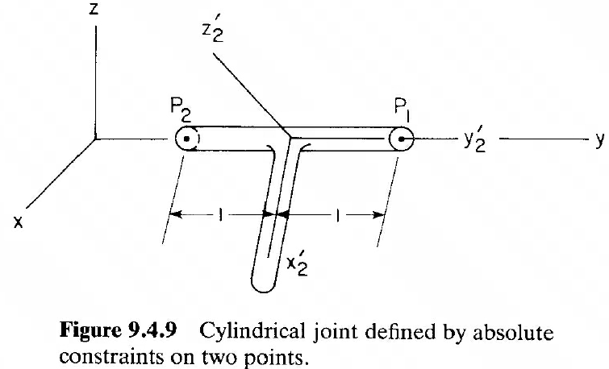

**位置向量**：$\mathbf{s}_2^{P_1}=[1,0,0]^T$、$\mathbf{s}_2^{P_2}=[-1,0,0]^T$。写全局系下的两点坐标：

$$
\mathbf{r}_2^{P_1}=\mathbf{r}_2+\mathbf{A}_2\mathbf{s}_2'^{P_1}=\begin{bmatrix}x_2+2e_1e_2-2e_0e_3\\y_2+2e_0^2+2e_2^2-1\\z_2+2e_2e_3+2e_0e_1\end{bmatrix}
$$

$$
\mathbf{r}_2^{P_2}=\mathbf{r}_2+\mathbf{A}_2\mathbf{s}_2'^{P_2}=\begin{bmatrix}x_2-2e_1e_2+2e_0e_3\\y_2-2e_0^2-2e_2^2+1\\z_2-2e_2e_3-2e_0e_1\end{bmatrix}
$$

**约束**：把两点的 $x,z$ 都钉在 0，得 4 条方程：

$$
\begin{bmatrix}x_2+2e_1e_2-2e_0e_3\\z_2+2e_2e_3+2e_0e_1\\x_2-2e_1e_2+2e_0e_3\\z_2-2e_2e_3-2e_0e_1\end{bmatrix}=\mathbf{0}
$$

---

## 9.4.4 两刚体间的运动约束（Constraints between Pairs of Bodies）

这一节基本是一些具体情况的讨论，对整体知识框架影响不大，因此简略介绍。

### 两点间的距离约束 $\Phi^{ss}$

已在 9.4.2 讨论，具体可见 Eq. 9.4.17：
$$\Phi^{ss}(P_i,P_j,C)=0$$

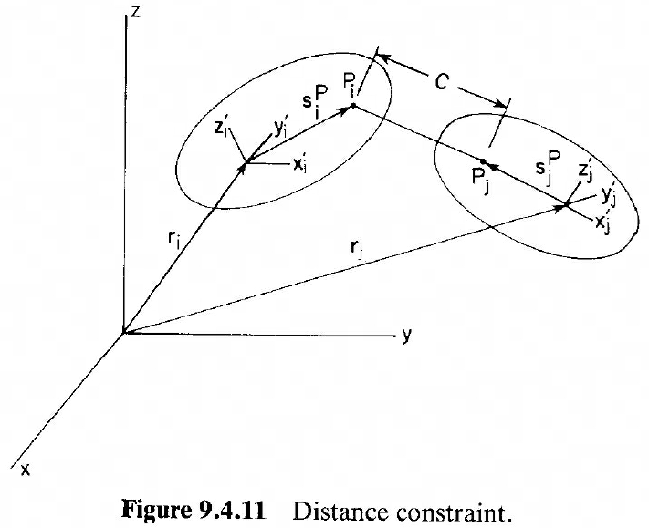

### 两点重合约束（球关节） $\Phi^s$

已在 Eq. 9.4.18 讨论：
$$\Phi^s(P_i,P_j)=\mathbf{0}$$

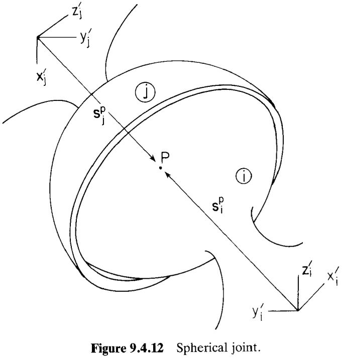

### 万向节（Universal Joint）

由中间的十字架（cross）与两个正交转动关节复合而成（图 9.4.13）。两刚体 $i,j$ 上的关节参考点 $P_i,P_j$ 重合，且两根叉轴 $\mathbf{h}_i,\mathbf{h}_j$ 保持正交：

$$
\boxed{\;\Phi^s(P_i,P_j)=\mathbf{0},\qquad \Phi^{d1}(\mathbf{h}_i,\mathbf{h}_j)=0\;}\tag{9.4.19}
$$

$3+1=4$ 方程，允许 2 个相对 DOF。

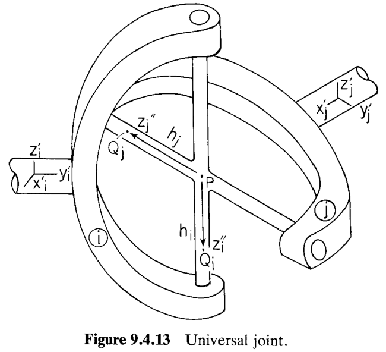

#### 例 9.4.7：万向节的奇异构型

> 图 9.4.14：驱动轴（刚体 1）绕 $y_1'$ 轴以角 $\theta_1$ 转动，输出轴（刚体 2）绕 $y_2'$ 轴以角 $\theta_2$ 转动；两轴夹角 $\phi$。求 $\theta_1,\theta_2$ 关系。

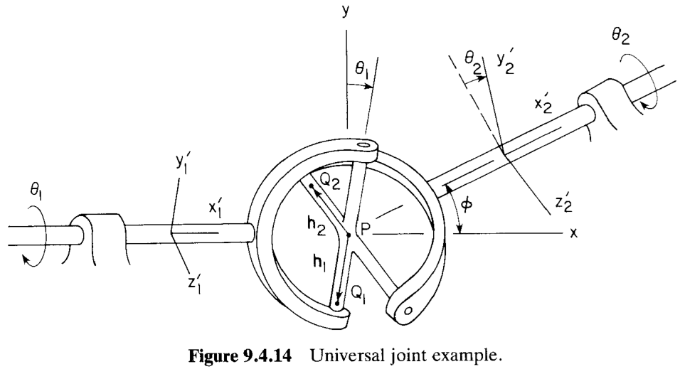

**基本量**：$\mathbf{h}_1'=[0,-1,0]^T$（体 1 十字架的叉沿 $-y_1'$），$\mathbf{h}_2'=[0,0,-1]^T$（体 2 十字架的叉沿 $-z_2'$）；

$$
\mathbf{A}_1=\begin{bmatrix}1&0&0\\0&\cos\theta_1&-\sin\theta_1\\0&\sin\theta_1&\cos\theta_1\end{bmatrix},\quad
\mathbf{A}_2=\begin{bmatrix}\cos\phi&-\cos\theta_2\sin\phi&\sin\theta_2\sin\phi\\\sin\phi&\cos\theta_2\cos\phi&-\sin\theta_2\cos\phi\\0&\sin\theta_2&\cos\theta_2\end{bmatrix}
$$

**d1 展开**：由 Eq. 9.4.3，

$$
\Phi^{d1}(\mathbf{h}_1,\mathbf{h}_2)=\mathbf{h}_1'^T\mathbf{A}_1^T\mathbf{A}_2\mathbf{h}_2'
$$

得到：

$$
\Phi^{d1}(\mathbf{h}_1,\mathbf{h}_2)=-\cos\theta_1\sin\theta_2\cos\phi+\sin\theta_1\cos\theta_2=0
$$

移项后两边除以 $\cos\theta_1\cos\theta_2$ 得到：

$$
\boxed{\;\tan\theta_1=\tan\theta_2\cos\phi\;}\tag{9.4.20}
$$

**变分方程**（从 Eq. 9.4.11 计算 $\delta\Phi^{d1}$，代 $\delta\boldsymbol{\pi}_1'=[\delta\theta_1,0,0]^T$、$\delta\boldsymbol{\pi}_2'=[\delta\theta_2,0,0]^T$）：书中一整块矩阵展开后得

$$
-(\sin\theta_2\cos\phi\sin\theta_1+\cos\theta_2\cos\theta_1)\,\delta\theta_1
+(\cos\theta_1\cos\theta_2\cos\phi+\sin\theta_1\sin\theta_2)\,\delta\theta_2=0
$$

特别的，取 $\phi=\pi/2$（两叉正交极端）。由 Eq. 9.4.20，$\tan\theta_1=\tan\theta_2\cdot 0=0\Rightarrow\theta_1=0$，此时无论 $\theta_2$ 是什么，$\theta_1$ 被锁死为 0。

代入变分方程，得到：

$$
-\cos\theta_2\,\delta\theta_1+\sin\theta_1\sin\theta_2\,\delta\theta_2=0
$$

$\sin\theta_1=0$，右侧 $=0$；左侧 $-\cos\theta_2\,\delta\theta_1=0$；只要 $\cos\theta_2\ne 0$ 就得 $\delta\theta_1=0$——**输入轴的任何虚转动都不被约束系统允许**。这就是万向节的**物理奇异构型**（Fig 9.4.15）——工程应用中必须避开 $\phi=\pi/2$。

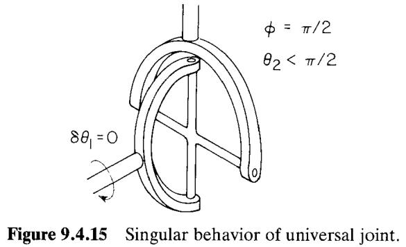

### 转动关节（Revolute Joint）

两体绕共同轴相对转动、不允许沿此轴平移（图 9.4.16）。分解为"两点重合 + 两轴平行"：

$$
\boxed{\;\Phi^s(P_i,P_j)=\mathbf{0},\qquad \Phi^{p1}(\mathbf{h}_i,\mathbf{h}_j)=\mathbf{0}\;}\tag{9.4.22}
$$

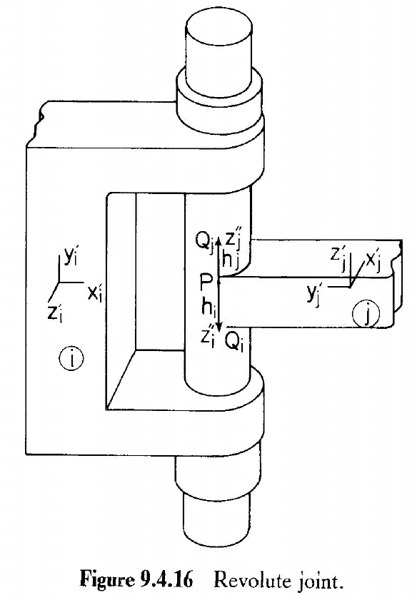

### 柱铰

允许绕共同轴相对转动 **且** 沿此轴相对平移（图 9.4.18）。共轴的条件："$\mathbf{h}_i\parallel\mathbf{h}_j$ 且 $\mathbf{h}_i\parallel\mathbf{d}_{ij}$"：

$$
\boxed{\;\Phi^{p1}(\mathbf{h}_i,\mathbf{h}_j)=\mathbf{0},\qquad \Phi^{p2}(\mathbf{h}_i,\mathbf{d}_{ij})=\mathbf{0}\;}\tag{9.4.23}
$$

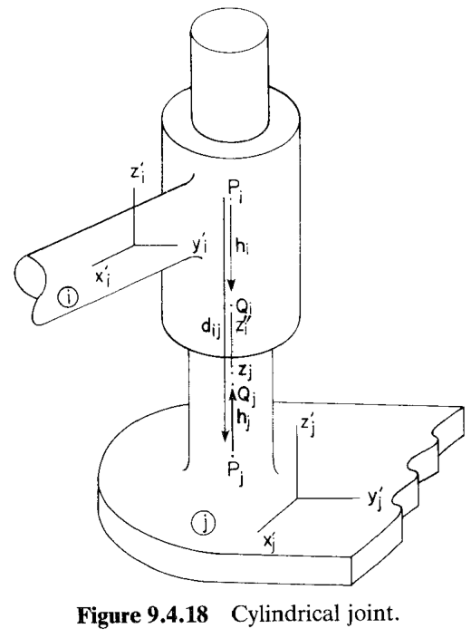

### 滑动关节

允许沿共同轴平移，**不允许**绕此轴相对转动（图 9.4.20）。在柱铰基础上再加"两刚体 $x''$ 轴保持正交"：

$$
\boxed{\;\Phi^{p1}(\mathbf{h}_i,\mathbf{h}_j)=\mathbf{0},\;\;\Phi^{p2}(\mathbf{h}_i,\mathbf{d}_{ij})=\mathbf{0},\;\;\Phi^{d1}(\mathbf{f}_i,\mathbf{f}_j)=0\;}\tag{9.4.24}
$$

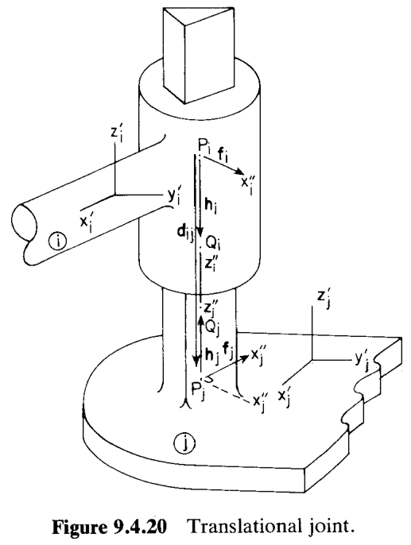

### 螺旋关节（Screw Joint）

柱铰 + 螺距耦合。当共轴两体相对转 $\theta$ 时，同时沿轴滑 $\alpha\theta$（$\alpha$ = 螺距，pitch）。**关键定义**：转角 $\theta$ 是 $x_i''$ 与 $x_j''$ 之间的夹角，**累计**转数用 $n$ 记录；$\theta_0$ 是当 $P_i=P_j$ 时两 $x''$ 轴的初始夹角。**进给条件**（Eq. 9.4.25）：

$$
\mathbf{h}_i^T\mathbf{d}_{ij}=\alpha(\theta+2n\pi-\theta_0)
$$

其中 $0\le (1/\alpha)\mathbf{h}_i^T\mathbf{d}_{ij}-2n\pi+\theta_0\le 2\pi$（把累计角度归位在一圈内）。

**完整螺旋副约束**：柱铰约束（Eq. 9.4.23）**加**上式移到齐次形：

$$
\boxed{\;\Phi^{scr}(\mathbf{h}_i,\mathbf{d}_{ij},\alpha,\theta_0)\equiv\Phi^{d2}(\mathbf{h}_i,\mathbf{d}_{ij})-\alpha(\theta+2n\pi-\theta_0)=0\;}\tag{9.4.26}
$$

（注：书中把 $\mathbf{h}_i^T\mathbf{d}_{ij}$ 记为 $\Phi^{d2}(\mathbf{h}_i,\mathbf{d}_{ij})$，形式一致。）加上柱铰 4 条 = **5 方程，1 DOF**。

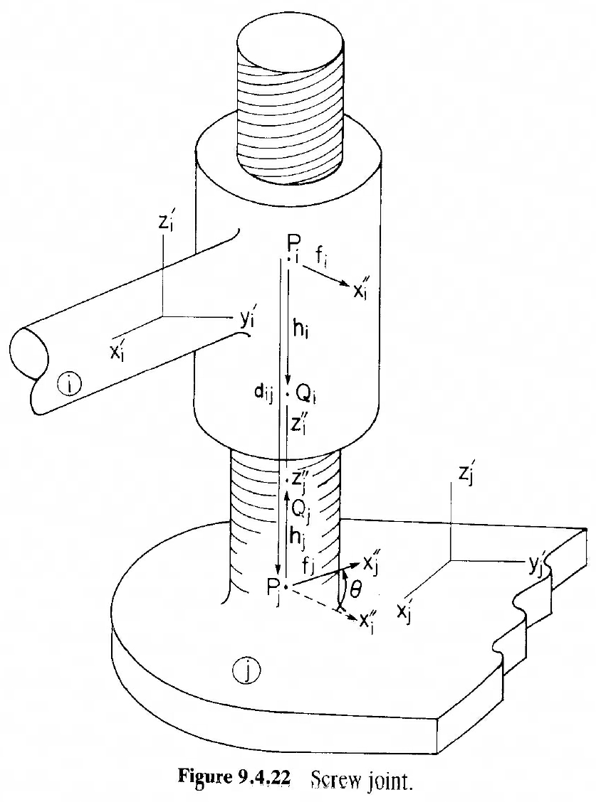

**$\theta$ 对广义坐标的偏导**（用于 Jacobian 装配）——从 $\theta$ 的定义 Eq. 9.2.61 出发，结合 $\delta\boldsymbol{\pi}'=2\mathbf{G}\,\delta\mathbf{p}$，得

$$
\begin{aligned}
&\theta_{\mathbf{r}_i}=\mathbf{0},\quad \theta_{\mathbf{r}_j}=\mathbf{0},\\
&\theta_{\pi_i'}=-\mathbf{h}_i'^T,\quad\frac{\partial\theta}{\partial\mathbf{p}_i}=-2\mathbf{h}_i'^T\mathbf{G}_i,\\
&\theta_{\pi_j'}=\mathbf{h}_i'^T\mathbf{A}_i^T\mathbf{A}_j,\quad\frac{\partial\theta}{\partial\mathbf{p}_j}=2\mathbf{h}_i'^T\mathbf{A}_i^T\mathbf{A}_j\mathbf{G}_j
\end{aligned}\tag{9.4.27}
$$

---

## 9.4.5 复合关节（Composite Constraints between Pairs of Bodies）

### 球-球复合关节（Spherical–Spherical）

连杆（coupler）两端各一个球副约束 + 长度约束 $C$。等价约束就是两端点距离固定：

$$
\boxed{\;\Phi^{ss}(P_i,P_j,C)=0\;}\tag{9.4.28}
$$

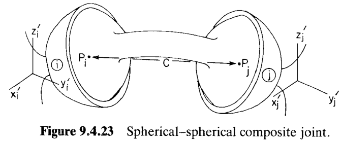

### 转-球复合关节（Revolute–Spherical）

Coupler 一端与体 $i$ 通过**转动副**连接（转轴沿 $\mathbf{h}_i$，中心在 $P_i$），另一端与体 $j$ 通过**球副**连接（中心在 $P_j$）。coupler 只能在过 $P_i$ 的垂直平面内摆动、加上绕自身长轴自转——但沿长轴自转在几何上不影响两端相对姿态：

$$
\boxed{\;\Phi^{ss}(P_i,P_j,C)=0,\qquad \Phi^{d2}(\mathbf{h}_i,\mathbf{d}_{ij})=0\;}\tag{9.4.29}
$$

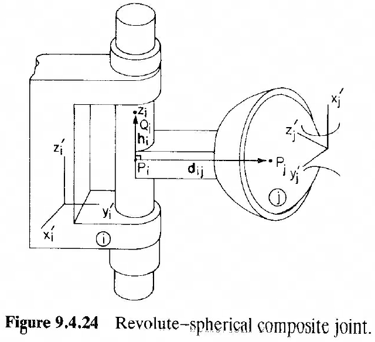

### 平行轴转-转复合关节（Revolute–Revolute Parallel，4 方程，2 DOF）

Coupler 两端各一个转动副，且两转轴**平行**、距离 $C$（图 9.4.25）。等价条件：
- $\mathbf{h}_i\parallel\mathbf{h}_j$（两转轴平行）：$\Phi^{p1}$
- $\mathbf{d}_{ij}\perp\mathbf{h}_i$（两转轴之间不"合流"）：$\Phi^{d2}$
- $|\mathbf{d}_{ij}|=C$：$\Phi^{ss}$

$$
\boxed{\;\Phi^{p1}(\mathbf{h}_i,\mathbf{h}_j)=\mathbf{0},\;\;\Phi^{d2}(\mathbf{h}_i,\mathbf{d}_{ij})=0,\;\;\Phi^{ss}(P_i,P_j,C)=0\;}\tag{9.4.30}
$$

$2+1+1=4$ 方程，$2$ 相对 DOF。

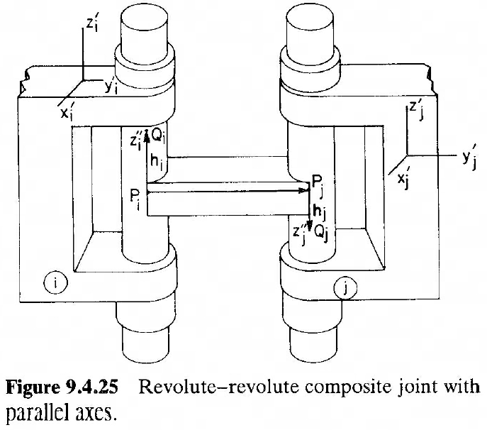

### 正交相交转-转复合关节（Revolute–Revolute Orthogonal Intersecting，4 方程，2 DOF）

Coupler 两端各一个转动副，两转轴**正交相交**（图 9.4.26）。等价条件（不同于平行版）：
- $\mathbf{h}_i\perp\mathbf{d}_{ij}$：$\Phi^{d2}(\mathbf{h}_i,\mathbf{d}_{ij})=0$
- $\mathbf{h}_j\parallel\mathbf{d}_{ij}$：$\Phi^{p2}(\mathbf{h}_j,\mathbf{d}_{ji})=\mathbf{0}$（注：$\mathbf{d}_{ji}=-\mathbf{d}_{ij}$，等价形式）
- $|\mathbf{d}_{ij}|=C$

$$
\boxed{\;\Phi^{d2}(\mathbf{h}_i,\mathbf{d}_{ij})=0,\;\;\Phi^{p2}(\mathbf{h}_j,\mathbf{d}_{ji})=\mathbf{0},\;\;\Phi^{ss}(P_i,P_j,C)=0\;}\tag{9.4.31}
$$

$1+2+1=4$ 方程，$2$ 相对 DOF。

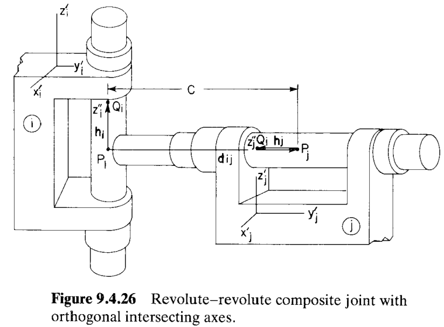

### 转-柱复合关节（Revolute–Cylindrical，3 方程，3 DOF）

Coupler 与体 $i$ 通过转动副（$\mathbf{h}_i$ 轴、点 $P_i$），与体 $j$ 通过柱铰（$\mathbf{h}_j$ 轴）连接（图 9.4.27）。几何条件：$\mathbf{h}_j\perp\mathbf{h}_i$、$\mathbf{h}_j$ 过 $P_i$：

$$
\boxed{\;\Phi^{d1}(\mathbf{h}_i,\mathbf{h}_j)=0,\qquad \Phi^{p2}(\mathbf{h}_j,\mathbf{d}_{ji})=\mathbf{0}\;}\tag{9.4.32}
$$

$1+2=3$ 方程，$3$ 相对 DOF（$3+3=6$ ✓）——**不显式写距离约束**，因为柱铰允许沿 $\mathbf{h}_j$ 滑动，$P_i$ 与 $P_j$ 的距离由 coupler 长度自然给定。**几何鲁棒性**：$\mathbf{d}_{ij}=\mathbf{0}$ 时 $P_i=P_j$，$\Phi^{p2}$ 的 $\mathbf{d}_{ij}$ 消失，但物理上此时 $\mathbf{h}_j$ 自然穿过 $P_i$，几何仍满足。

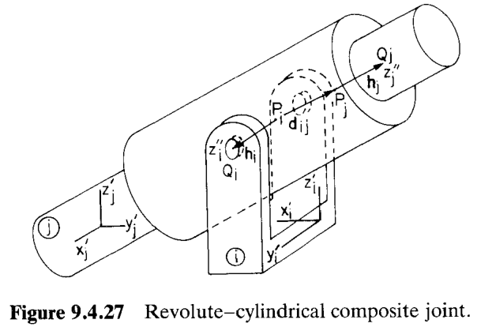

### 转-平移复合关节（Revolute–Translational，4 方程，2 DOF）

在转-柱基础上，coupler 与体 $j$ 的连接改为**平移副**（不许绕 $\mathbf{h}_j$ 转），额外要求 $\mathbf{f}_j\parallel\mathbf{h}_i$：

$$
\boxed{\;\Phi^{p1}(\mathbf{h}_i,\mathbf{f}_j)=\mathbf{0},\qquad \Phi^{p2}(\mathbf{h}_j,\mathbf{d}_{ij})=\mathbf{0}\;}\tag{9.4.33}
$$

$2+2=4$ 方程，$2$ 相对 DOF。

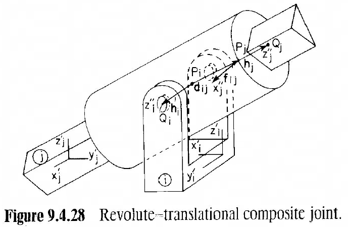

### 支柱复合关节（Strut，2 方程，4 DOF）

Coupler 与体 $i$ 通过**柱铰**（沿 $\mathbf{h}_i$）连接，与体 $j$ 通过球副连接（点 $P_j$）。几何本质：$\mathbf{h}_i$ 必须穿过 $P_j$——用 $\Phi^{p2}$ 表达：

$$
\boxed{\;\Phi^{p2}(\mathbf{h}_i,\mathbf{d}_{ij})=\mathbf{0}\;}\tag{9.4.34}
$$

$2$ 方程，$4$ 相对 DOF（沿 $\mathbf{h}_i$ 滑、绕 $\mathbf{h}_i$ 转、绕 $P_j$ 的球副 2 转）。**几何鲁棒性**：$\mathbf{d}_{ij}=\mathbf{0}$ 时 $P_j=P_i$，$\mathbf{h}_i$ 自然穿过 $P_j$——几何仍成立。

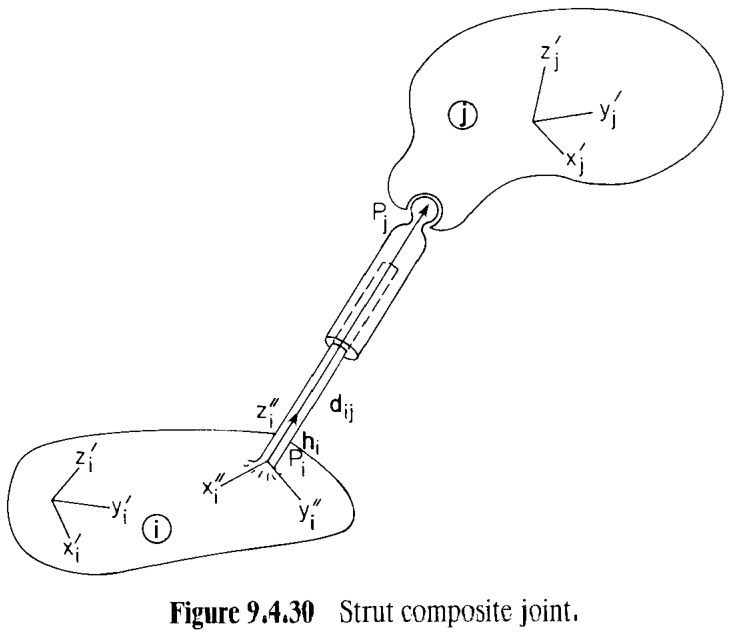
