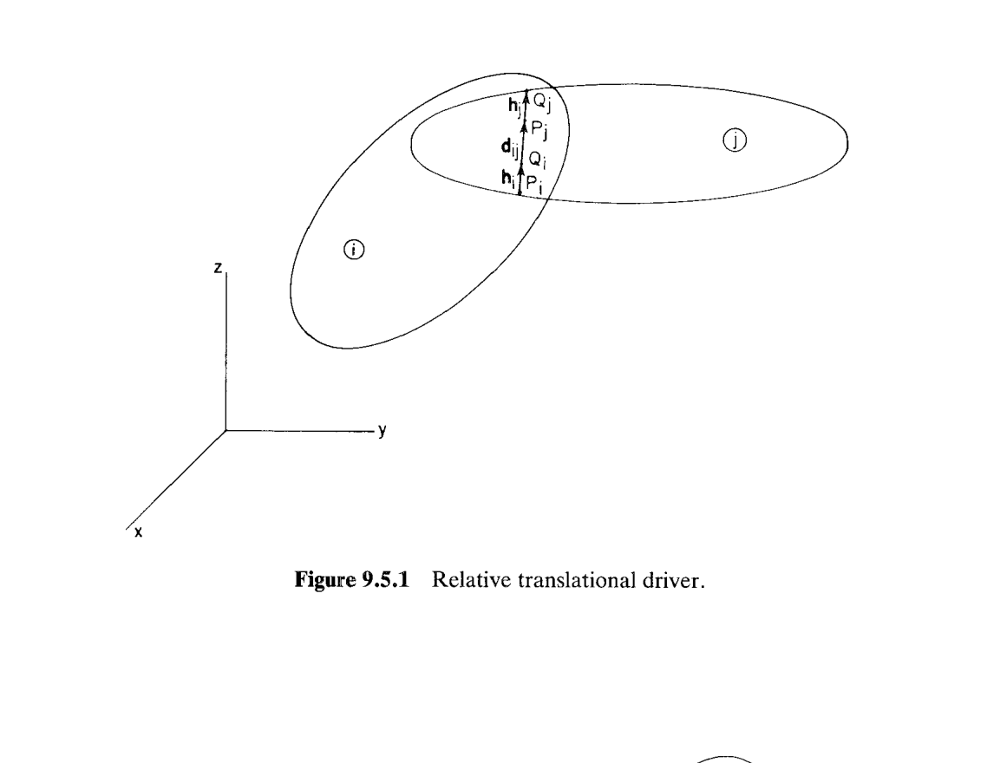
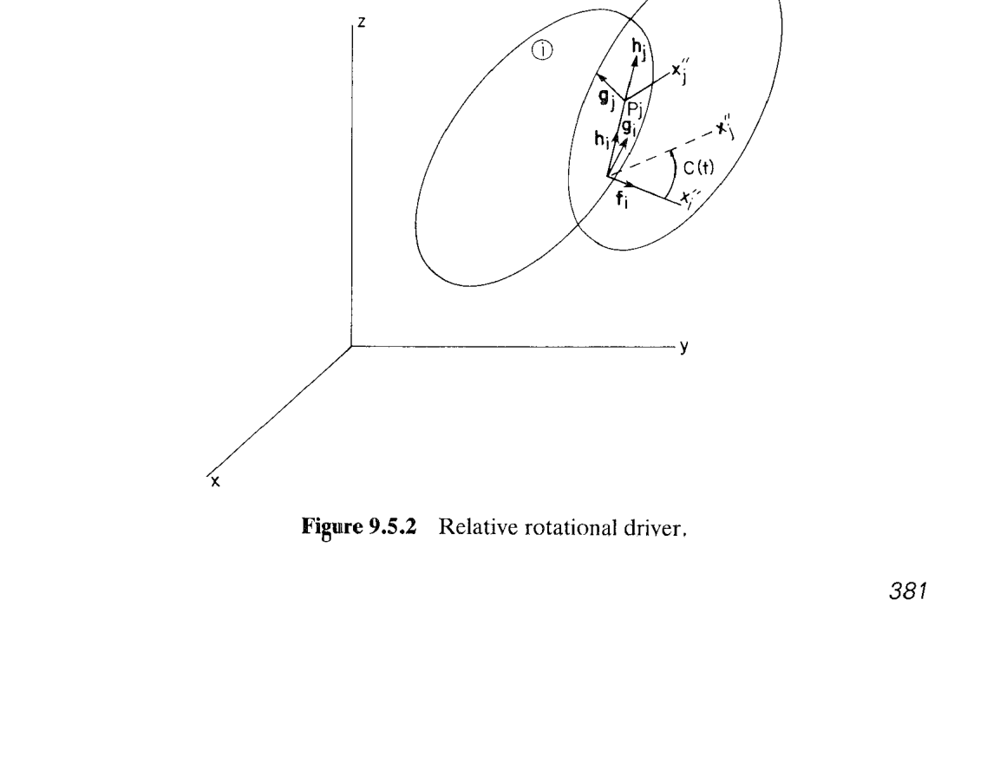

# 9.5 驱动约束（Driving Constraints）

> 来源：*Computer Aided Kinematics and Dynamics of Mechanical Systems*，第 9 章，§9.5（书页 380–382）。
> 本文按"文字讲解 + 逐式详细推导"组织，公式推导不跳步骤。

## 引言：本节要解决什么

§9.4 建立的所有约束（球副 $\boldsymbol\Phi^s$、点积约束 $\Phi^{d1},\Phi^{d2}$、平行约束 $\boldsymbol\Phi^{p1},\boldsymbol\Phi^{p2}$、球-球距离约束 $\Phi^{ss}$、螺旋副附加式 $\Phi^{scr}$，以及六类基本关节 + 七类复合关节）都是**定常约束**——它们只写死几何关系，不含时间。真实机构还需要**执行器（actuator）**来"驱动"某个自由度按给定时间历程运动（液压伸缩杆规定长度、伺服电机规定转角等）。把这些以 $C(t)$ 形式给出的时变输入嵌入约束方程，就得到**驱动约束（driving constraint）**。

本节的主线是"把 §9.4 定常约束里的常量替换成 $C(t)$，再把差值置零"，最终得到 4 类空间驱动约束：

1. **绝对驱动**（Eq. 9.5.1）——把点 $P_i$ 的 $x,y,z$ 坐标各自锁给 $C_k(t)$；由 Eq. 9.4.15 的前三行改写。
2. **距离驱动**（Eq. 9.5.2）——把两点 $P_i,P_j$ 之间的距离锁给 $C(t)$；由 Eq. 9.4.8 / Eq. 9.4.17 的 $\Phi^{ss}$ 改写。
3. **相对平移驱动**（Eq. 9.5.3）——沿共线轴 $\mathbf h_i$ 的有向位移 $\mathbf h_i^T\mathbf d_{ij}$ 锁给 $C(t)$；由 Eq. 9.4.6 的 $\Phi^{d2}$ 改写。用于**移动副 / 柱铰 / 螺旋副 / 支柱**上装的直线执行器。
4. **相对转动驱动**（Eq. 9.5.4）——绕共同轴的相对转角 $\theta$ 锁给 $C(t)$；由 Eq. 9.2.31 的相对转角公式改写。用于**转动副 / 柱铰 / 螺旋副**上装的旋转执行器。

每条驱动约束在方程数上等价于它替换掉的那一个定常标量约束（即：**一条驱动约束吃掉一个相对 DOF**），并且——由于变分是在 $t$ 冻结的前提下计算的——它对雅可比 $\boldsymbol\Phi_{\mathbf q}$ 的贡献与对应定常约束**完全相同**，只是在速度方程右端 $\boldsymbol\nu$、加速度方程右端 $\boldsymbol\gamma$ 中出现由 $\dot C,\ddot C$ 引起的非零补偿项。

---

## 9.5.1 绝对驱动（Absolute Drivers）

### 思路

回忆 Eq. 9.4.15 的**绝对点约束**（书页 361，配 Fig. 9.4.8）：

$$
\boldsymbol\Phi^P \;=\; \mathbf r_i+\mathbf A_i\mathbf s_i'^P-\mathbf r_i^{0}\;=\;\mathbf 0 \tag{9.4.15}
$$

三个标量行分别把点 $P_i$ 的 $x,y,z$ 全局坐标锁在**常数** $x_i^{0},y_i^{0},z_i^{0}$。把这三个常数替换为已知时间函数 $C_k(t)$，就获得三条独立的时变绝对约束——每条锁死体 $i$ 的一个平动 DOF。

### 推导

设点 $P_i$ 的全局位置为

$$
\mathbf r_i^{P}\;=\;\mathbf r_i+\mathbf A_i\mathbf s_i'^P\;=\;\bigl[x_i^{P},\;y_i^{P},\;z_i^{P}\bigr]^T
$$

对每一轴 $k=1,2,3$（对应 $x,y,z$），逐一置零：

$$
\boxed{\;
\begin{aligned}
\Phi^{1d} \;&=\; x_i^{P}-C_1(t)\;=\;0\\
\Phi^{2d} \;&=\; y_i^{P}-C_2(t)\;=\;0\\
\Phi^{3d} \;&=\; z_i^{P}-C_3(t)\;=\;0
\end{aligned}
\;}\tag{9.5.1}
$$

每一条锁死体 $i$ 相对全局 $x\text-y\text-z$ 系的一个平动自由度。

### 说明

- 三条方程互相独立，可单独启用一条、两条或三条，视执行器数目而定。
- $C_k(t)$ 是**任意**已知时间函数（多项式、分段线性、样条、正弦……），无须可微性以外的额外要求。
- 变分（时间冻结）：$\delta\Phi^{kd}=\delta(\mathbf r_i^P)_k$，与 Eq. 9.4.15 变分的第 $k$ 行完全一致——见 §9.5.5。

---

## 9.5.2 距离驱动（Distance Driver）

### 思路

Eq. 9.4.8 定义了**球-球距离约束**：把两个体上分别选定的点 $P_i,P_j$ 之间的距离锁在常量 $C\neq 0$：

$$
\Phi^{ss}(P_i,P_j,C)\;=\;\mathbf d_{ij}^T\mathbf d_{ij}-C^2\;=\;0,
\qquad \mathbf d_{ij}\equiv\mathbf r_j^P-\mathbf r_i^P \tag{9.4.8}
$$

Fig. 9.4.11 给出的距离约束（Eq. 9.4.17，$C\neq0$）本质上是同一式。让 $C\to C(t)$，即得**距离驱动**——正是液压/电动伸缩执行器的建模方式：两端点之间的距离由执行器行程 $C(t)$ 决定。

### 推导

按书中记法，把 $\Phi^{ss}$ 中的常量 $C$ 先设为 0，再显式减去 $\bigl(C(t)\bigr)^{2}$：

$$
\boxed{\;
\Phi^{ssd}\;=\;\Phi^{ss}\bigl(P_i,P_j,0\bigr)-\bigl(C(t)\bigr)^{2}
       \;=\;\mathbf d_{ij}^T\mathbf d_{ij}-\bigl(C(t)\bigr)^{2}\;=\;0
\;}\tag{9.5.2}
$$

其中 $C(t)\neq 0$ 是执行器规定的 $P_i,P_j$ 之间的距离历程。

### 说明

- 该式为**标量方程**，消去体 $i,j$ 之间一个相对 DOF。
- 与 Eq. 9.4.8 的球-球约束一样，$C(t)=0$ 会退化为"两点重合"这个更强的约束（对应球副），本节仅取 $C(t)\neq 0$。
- 变分（时间冻结）：$\delta\Phi^{ssd}=2\mathbf d_{ij}^T\,\delta\mathbf d_{ij}$，与 Eq. 9.4.8 变分完全相同。

---

## 9.5.3 相对平移驱动（Relative Translational Driver）

### 思路

考察一对由**移动副（translational joint）/柱铰（cylindrical joint）/螺旋副（screw joint）/支柱复合关节（strut composite joint）**连接的体 $i,j$。这类关节都有一条"共同的平移轴"——由体 $i$ 上的随体单位向量 $\mathbf h_i$（Eq. 9.4.1 定义的关节定义系 $\mathbf h$ 轴）指定方向。从关节上的定义点 $P_i$ 指向另一体上的对应点 $P_j$ 的向量 $\mathbf d_{ij}=\mathbf r_j^P-\mathbf r_i^P$ 一定与 $\mathbf h_i$ **共线**（这一共线性由这些关节自身的约束保证，见 §9.4.4–§9.4.6）。因此 $\mathbf d_{ij}$ 沿 $\mathbf h_i$ 的**有向投影**

$$
\mathbf h_i^T\mathbf d_{ij}
$$

就是两体在关节滑轨上的**有向平移量**。让它跟随执行器行程 $C(t)$，就是相对平移驱动的建模。

**Fig. 9.5.1（相对平移驱动）**：体 $i$ 上的 $P_i,Q_i$ 与体 $j$ 上的 $P_j,Q_j$ 分别沿随体向量 $\mathbf h_i,\mathbf h_j$ 排列；由上一层关节保证 $\mathbf h_i\parallel\mathbf h_j\parallel\mathbf d_{ij}$，故 $\mathbf h_i^T\mathbf d_{ij}$ 是滑轨方向的有向长度。

### 推导

回忆 Eq. 9.4.6 定义的 dot-2 约束：

$$
\Phi^{d2}(\mathbf a_i,\mathbf d_{ij})\;=\;\mathbf a_i^T\mathbf d_{ij}
\tag{9.4.6}
$$

它本身只是"取向量在体固定向量上的投影"这一线性组合，并不要求 $=0$——书中把它作为一个记号函数使用。用 $\mathbf a_i=\mathbf h_i$ 代入，投影 $\Phi^{d2}(\mathbf h_i,\mathbf d_{ij})=\mathbf h_i^T\mathbf d_{ij}$ 即为滑轨方向有向长度。让它等于执行器给定值 $C(t)$：

$$
\boxed{\;
\Phi^{td}\;=\;\Phi^{d2}(\mathbf h_i,\mathbf d_{ij})-C(t)
       \;=\;\mathbf h_i^T\mathbf d_{ij}-C(t)\;=\;0
\;}\tag{9.5.3}
$$

### 说明

- **$C(t)$ 可以为零或负**——它是**有向**距离而非欧氏距离。执行器可以把 $P_j$ 拉回到 $P_i$ 后侧（$C<0$），也可以让二者重合（$C=0$）。这与距离驱动 Eq. 9.5.2 里 $C(t)\neq 0$ 的要求形成对比。
- 这一条驱动**要与它所依附的关节约束联用**：单独使用 Eq. 9.5.3 并不保证 $\mathbf d_{ij}\parallel\mathbf h_i$；正是移动副/柱铰/螺旋副/支柱各自的 $\boldsymbol\Phi^{p1},\boldsymbol\Phi^{p2}$ 之类的约束提供了共线性，Eq. 9.5.3 只是在这条共线轨上再增补一个"位置读数"约束。
- 每个用到 Eq. 9.5.3 的关节，都会因这条驱动**再减一个相对 DOF**（移动副从 1 DOF 变 0；柱铰从 2 变 1；螺旋副的独立 DOF 已经与它的 $\Phi^{scr}$ 绑定，见下方补注；支柱从 4 变 3）。
- 变分（时间冻结）：$\delta\Phi^{td}=\delta(\mathbf h_i^T\mathbf d_{ij})=\bigl(\delta\mathbf h_i\bigr)^T\mathbf d_{ij}+\mathbf h_i^T\,\delta\mathbf d_{ij}$，与 Eq. 9.4.6 的变分完全一致——$C(t)$ 对 $\mathbf q$ 的变分无贡献。

---

## 9.5.4 相对转动驱动（Relative Rotational Driver）

### 思路

对含"共同转动轴"的关节——**转动副 / 柱铰 / 螺旋副**——两体除轴向平动外还可以绕轴相对转动。设体 $i,j$ 上的关节定义系分别以 $x_i''\text-y_i''$ 与 $x_j''\text-y_j''$ 为轴（$z''$ 都沿关节公共轴 $\mathbf h$），把 $x_j''$ 相对 $x_i''$ 的**逆时针**夹角记为 $\theta$（Eq. 9.2.31 给出用方向余弦矩阵与 $\mathbf h,\mathbf f,\mathbf g$ 计算的显式表达；螺旋副的 Eq. 9.4.25–9.4.26 里也已用到这个 $\theta$）。用旋转执行器把 $\theta$ 锁给 $C(t)$，即相对转动驱动。

**Fig. 9.5.2（相对转动驱动）**：$\mathbf h_i,\mathbf h_j$ 与 $\mathbf g_i,\mathbf g_j$ 由上一层关节约束保持轴向一致；$x_i''$ 到 $x_j''$ 之间的相对角 $C(t)$ 就是执行器规定的相对转动历程。

### 推导

沿用螺旋副（Eq. 9.4.25）中处理"绕轴累计转角"的做法：由于 Eq. 9.2.31 给出的角函数只在一个基本周期内取值，为了描述连续多圈转动，引入**圈数计数** $n\in\mathbb Z$，使实际累计转角为 $\theta+2n\pi$。把它等于 $C(t)$：

$$
\boxed{\;
\Phi^{rotd}\;\equiv\;\theta+2n\pi-C(t)\;=\;0
\;}\tag{9.5.4}
$$

$n$ 的取值约定为：

$$
0\;\le\; C(t)-2n\pi\;<\;2\pi \tag{9.5.4a}
$$

——即令 $n$ 跟随执行器累计转过的整圈数递增，$\theta$ 始终保持在基本周期 $[0,2\pi)$ 内的对应值。

### 说明

- 与 Eq. 9.5.3 类似，本条驱动依附于上一层关节：转动副/柱铰/螺旋副各自的 $\boldsymbol\Phi^s+\boldsymbol\Phi^{p1}$（或 $\boldsymbol\Phi^{p1}+\boldsymbol\Phi^{p2}$）保证"存在唯一的共同转动轴"，Eq. 9.5.4 只是在此基础上钉死绕轴的相对转角。
- $C(t)$ 可以是任意实数（多圈甚至无界增长），$n$ 自动调整。
- 变分（时间冻结）：$\delta\Phi^{rotd}=\delta\theta$，与 $\theta$ 的定义 Eq. 9.2.31 的变分完全一致——$2n\pi$ 是常数、$C(t)$ 对 $\mathbf q$ 变分为零。

---

## 9.5.5 变分、速度方程右端 $\boldsymbol\nu$、加速度方程右端 $\boldsymbol\gamma$

书末段有一句关键的话（p.382 上）：

> Variations of each of the foregoing driving constraints are identical to the previously derived variations of corresponding kinematic constraints, since time is suppressed in calculating the variations with respect to position and orientation.

它的含义是：**对广义坐标 $\mathbf q$ 求变分或雅可比时，$C(t)$ 被视作常量**（因为变分只挪动 $\mathbf q$、不挪动 $t$），所以驱动约束的雅可比行 $\boldsymbol\Phi^{drv}_{\mathbf q}$ **完全等于**对应定常约束的雅可比行。区别只在**显式 $t$ 的偏导** $\boldsymbol\Phi^{drv}_t$——它出现在速度方程和加速度方程的**右端**。

统一记速度方程 $\boldsymbol\Phi_{\mathbf q}\dot{\mathbf q}=-\boldsymbol\Phi_t\equiv\boldsymbol\nu$、加速度方程 $\boldsymbol\Phi_{\mathbf q}\ddot{\mathbf q}=\boldsymbol\gamma$。逐条驱动的右端如下（$'$ 表 $\mathrm d/\mathrm dt$）：

| 驱动 | $\Phi_t$ | $\boldsymbol\nu=-\Phi_t$ | $\boldsymbol\gamma$（含 $\ddot{\mathbf q}$ 无关项） |
|------|----------|-------------------------|------------------|
| $\Phi^{kd}=(\mathbf r_i^P)_k-C_k(t)$ | $-\dot C_k$ | $\dot C_k$ | $\ddot C_k-[$ 对应 $\Phi^{kd}$ 定常项 $\gamma]$ |
| $\Phi^{ssd}=\mathbf d_{ij}^T\mathbf d_{ij}-C(t)^2$ | $-2C\dot C$ | $2C\dot C$ | $2\bigl(\dot C^{\,2}+C\ddot C\bigr)-\gamma^{ss}$ |
| $\Phi^{td}=\mathbf h_i^T\mathbf d_{ij}-C(t)$ | $-\dot C$ | $\dot C$ | $\ddot C-\gamma^{d2}$ |
| $\Phi^{rotd}=\theta+2n\pi-C(t)$ | $-\dot C$ | $\dot C$ | $\ddot C-\gamma^{\theta}$ |

其中 $\gamma^{ss},\gamma^{d2},\gamma^{\theta}$ 分别代表对应定常约束的加速度右端项（由二次求导中 $\dot{\mathbf q}$ 的二次项贡献，见 §9.4 相应约束的加速度分析）。**结论**：把 §9.4 已推得的速度/加速度右端向量，在对应行上分别加 $\dot C$（或 $2C\dot C$）与 $\ddot C$（或 $2(\dot C^2+C\ddot C)$）即可——数值实现时几乎"零改动"就能引入驱动。

---

## 小结：4 类驱动一览表

| 驱动 | 公式 | 依附的关节/约束 | 方程数 | 消去的相对 DOF |
|------|------|-----------------|--------|----------------|
| 绝对驱动 $\Phi^{kd}$（$k=1,2,3$） | Eq. 9.5.1 | Eq. 9.4.15 绝对点约束的第 $k$ 分量 | 每条 1 | 1（体 $i$ 相对地面的一个平动） |
| 距离驱动 $\Phi^{ssd}$ | Eq. 9.5.2 | Eq. 9.4.8 球-球距离约束 | 1 | 1（$P_i,P_j$ 之间的一个相对 DOF） |
| 相对平移驱动 $\Phi^{td}$ | Eq. 9.5.3 | 移动副 / 柱铰 / 螺旋副 / 支柱 | 1 | 1（沿 $\mathbf h_i$ 的相对平动） |
| 相对转动驱动 $\Phi^{rotd}$ | Eq. 9.5.4 | 转动副 / 柱铰 / 螺旋副 | 1 | 1（绕 $\mathbf h_i$ 的相对转动） |

**要点**：驱动约束是**规格上完备的库**——绝对锁位置 3 条、相对锁距离 1 条、相对锁沿轴平动 1 条、相对锁绕轴转角 1 条——足以配合 §9.4 关节库覆盖所有工程执行器建模，且与位置雅可比结构完全兼容，只在 $\boldsymbol\nu,\boldsymbol\gamma$ 上附加显式时间项。这样，§9.6 的三段（位置/速度/加速度）统一求解框架就可以在同一雅可比矩阵下同时处理"关节约束 + 驱动约束"两类方程。
