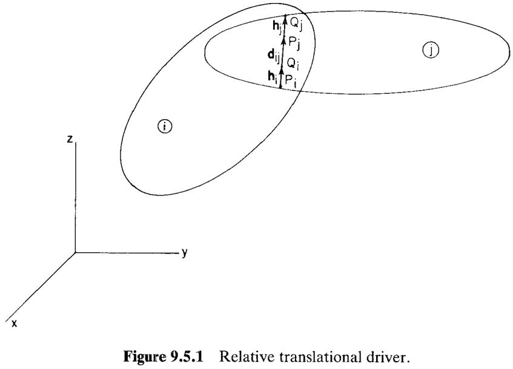
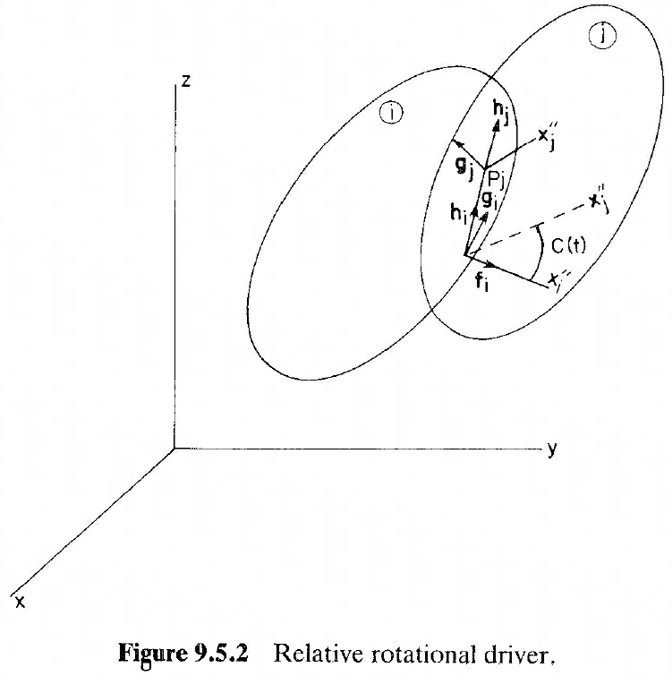

# 9.5 驱动约束（Driving Constraints）

> 来源：*Computer Aided Kinematics and Dynamics of Mechanical Systems*，第 9 章，§9.5（书页 380–382）。

## 引言：本节要解决什么

本节介绍了几种常用的驱动约束的表达式。

---

## 9.5.1 绝对驱动（Absolute Drivers）

设点 $P_i$ 的全局位置为

$$
\mathbf r_i^{P}\;=\;\mathbf r_i+\mathbf A_i\mathbf s_i'^P\;=\;\bigl[x_i^{P},\;y_i^{P},\;z_i^{P}\bigr]^T
$$

对各分量设定绝对约束，分别为：

$$
\boxed{\;
\begin{aligned}
\Phi^{1d} \;&=\; x_i^{P}-C_1(t)\;=\;0\\
\Phi^{2d} \;&=\; y_i^{P}-C_2(t)\;=\;0\\
\Phi^{3d} \;&=\; z_i^{P}-C_3(t)\;=\;0
\end{aligned}
\;}\tag{9.5.1}
$$

---

## 9.5.2 距离驱动（Distance Driver）

设定两个点 $P_i,P_j$ 的距离常数 $C\neq 0$：

$$
\boxed{\;
\Phi^{ssd}\;=\;\mathbf d_{ij}^T\mathbf d_{ij}-\bigl(C(t)\bigr)^{2}\;=\;0
\;}\tag{9.5.2}
$$

---

## 9.5.3 相对平移驱动（Relative Translational Driver）

如下图，关节滑轨方向为向量 $\mathbf h_i$。则刚体 $i$ 上一点 $P_i$ 指向刚体 $j$ 上一点 $P_j$ 的向量 $\mathbf d_{ij}=\mathbf r_j^P-\mathbf r_i^P$ 在滑轨 $\mathbf h_i$ 方向上的平移量 $\mathbf h_i^T\mathbf d_{ij}$ 跟随执行器行程 $C(t)$，就是**相对平移驱动**。

注意，图绘制的有一定歧义，相对平移驱动**并不**要求 $\mathbf d_{ij}\parallel\mathbf h_i$。

约束表达式为：

$$
\boxed{\;
\Phi^{td}\;=\;\Phi^{d2}(\mathbf h_i,\mathbf d_{ij})-C(t)
       \;=\;\mathbf h_i^T\mathbf d_{ij}-C(t)\;=\;0
\;}\tag{9.5.3}
$$

---

## 9.5.4 相对转动驱动（Relative Rotational Driver）

设刚体 $i,j$ 上的关节坐标系分别以 $x_i''\text-y_i''\text-z_i''$ 与 $x_j''\text-y_j''\text-z_j''$ 为轴。其中 $z_i''$ 和 $z_j''$ 同向，$x_j''$ 相对 $x_i''$ 的逆时针夹角记为 $\theta$。则**相对转动驱动**就是约束该夹角 $\theta$ 跟随执行器行程 $C(t)$。

约束表达式为：

$$
\boxed{\;
\Phi^{rotd}\;\equiv\;\theta+2n\pi-C(t)\;=\;0
\;}\tag{9.5.4}
$$

$n$ 的取值约定为：

$$
0\;\le\; C(t)-2n\pi\;<\;2\pi \tag{9.5.4a}
$$

---

## 9.5.5 变分、速度方程右端 $\boldsymbol\nu$、加速度方程右端 $\boldsymbol\gamma$

书中原文（p.382 上）：

> Variations of each of the foregoing driving constraints are identical to the previously derived variations of corresponding kinematic constraints, since time is suppressed in calculating the variations with respect to position and orientation.

即，**对广义坐标 $\mathbf q$ 求变分或雅可比时，$C(t)$ 被视作常量**（因为变分中只有 $\mathbf q$ 是变量，$t$ 是常量），所以驱动约束的雅可比行 $\boldsymbol\Phi^{drv}_{\mathbf q}$ **完全等于**对应定常约束的雅可比行。区别只在**显式 $t$ 的偏导** $\boldsymbol\Phi^{drv}_t$——它出现在速度方程和加速度方程的**右端**。

统一记速度方程 $\boldsymbol\Phi_{\mathbf q}\dot{\mathbf q}=-\boldsymbol\Phi_t\equiv\boldsymbol\nu$、加速度方程 $\boldsymbol\Phi_{\mathbf q}\ddot{\mathbf q}=\boldsymbol\gamma$。逐条驱动的右端如下（$'$ 表 $\mathrm d/\mathrm dt$）：

| 驱动 | $\Phi_t$ | $\boldsymbol\nu=-\Phi_t$ | $\boldsymbol\gamma$（含 $\ddot{\mathbf q}$ 无关项） |
|------|----------|-------------------------|------------------|
| $\Phi^{kd}=(\mathbf r_i^P)_k-C_k(t)$ | $-\dot C_k$ | $\dot C_k$ | $\ddot C_k-[$ 对应 $\Phi^{kd}$ 定常项 $\gamma]$ |
| $\Phi^{ssd}=\mathbf d_{ij}^T\mathbf d_{ij}-C(t)^2$ | $-2C\dot C$ | $2C\dot C$ | $2\bigl(\dot C^{\,2}+C\ddot C\bigr)-\gamma^{ss}$ |
| $\Phi^{td}=\mathbf h_i^T\mathbf d_{ij}-C(t)$ | $-\dot C$ | $\dot C$ | $\ddot C-\gamma^{d2}$ |
| $\Phi^{rotd}=\theta+2n\pi-C(t)$ | $-\dot C$ | $\dot C$ | $\ddot C-\gamma^{\theta}$ |
