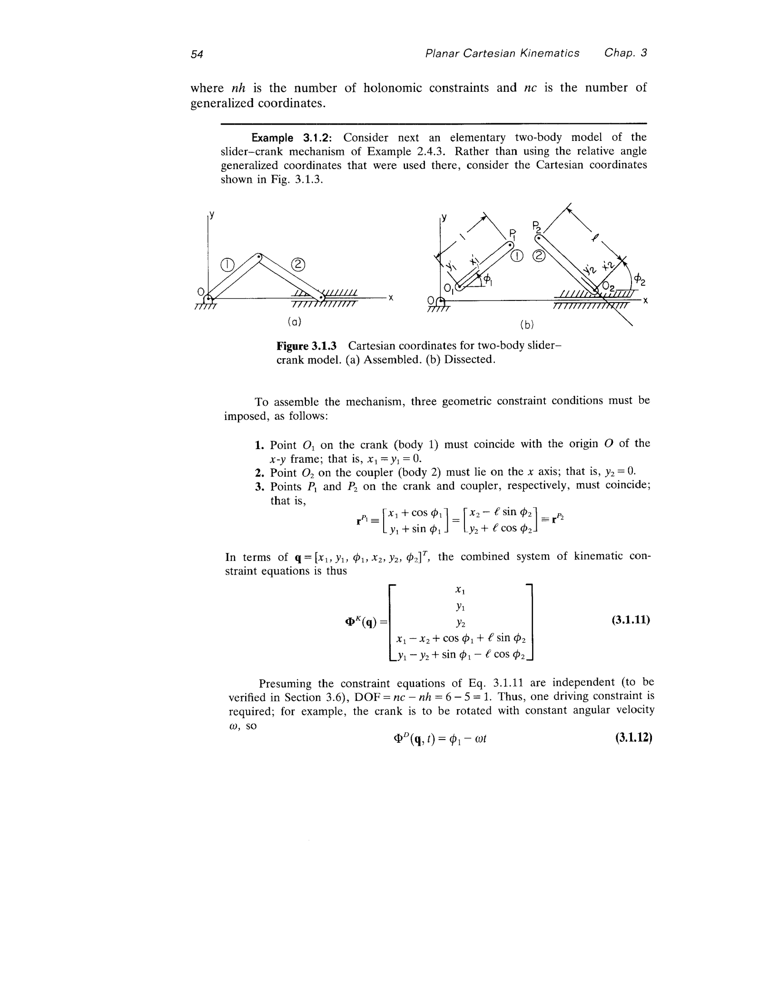
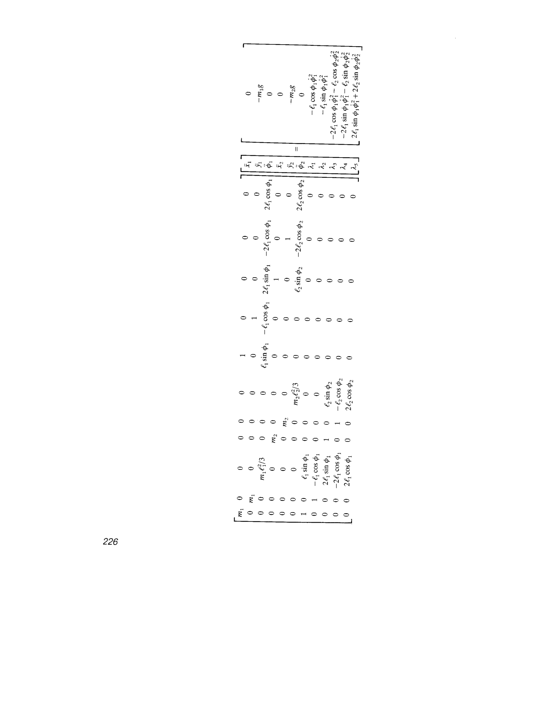
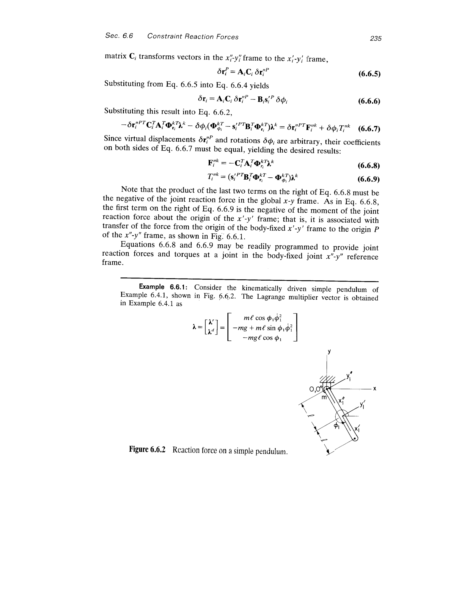
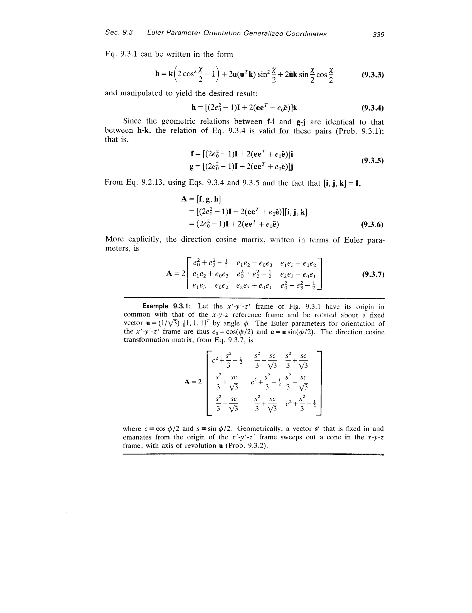

## Essence

> [!abstract]
> **One-Sentence Summarization**: "以**笛卡尔坐标**为核心，系统建立了机械系统运动学与动力学的计算机辅助分析方法论，覆盖从平面到空间系统的约束建模、数值求解和工程应用全链路。"
> **Contribution**: 本书将传统分散的、针对特定机构的解析方法统一为一套**通用的面向计算机实现的方法框架**——基于约束方程库的模块化组装思想，使得任意拓扑的刚体机构均可用统一流程进行运动学和动力学分析。这是 DADS（Dynamic Analysis and Design System）软件的理论基础。

## Factors

### Context
**机械系统运动学和动力学**的分析由于大幅度运动带来的**几何非线性**而产生高度复杂的非线性代数方程和微分方程。传统方法依赖于针对特定机构的专门解析技术，无法泛化；而与之对比，**有限元**和**电子电路分析**领域早已发展出系统化的计算机公式化和求解方法。

### Related Work
- **传统图形法（Graphical Methods）**: 手工作图求解特定机构的位置、速度和加速度，精度低且不适用于复杂系统
- **传统解析法（Analytical Methods）**: 为每种机构推导专门的封闭解，无法推广到一般机构
- **Nikravesh, Wehage 等人的工作**: 与作者同时期在爱荷华大学推进的笛卡尔坐标多体动力学方法
- **Intermediate Dynamics [35]**: Haug 的相关教材，提供动力学的基础理论

### Gap
传统方法**每种机构需要独立推导**，既不适合计算机自动化处理，也无法应对工业中不断变化的机构拓扑。缺乏一种**统一的、模块化的约束描述语言**，可以将任意运动副、齿轮、凸轮、驱动条件组装成完整系统方程。

### Proposal
采用**笛卡尔坐标方法（Cartesian coordinate approach）**，将每个刚体用全局坐标系下的质心位置和姿态角（平面3个、空间7个含Euler参数）描述。**运动副约束被统一表达为广义坐标的代数方程**，可按需组装成系统约束方程组。运动学归结为非线性代数方程求解（Newton-Raphson），动力学归结为微分-代数方程组（DAE）求解（Lagrange 乘子法 + 预测-校正积分）。

## Architecture

### 整体结构：全书技术框架精读

全书的技术架构可以概括为以下数据流：

```
物理机构
    │
    ▼
[刚体建模] ──→ 广义坐标 q = [r₁,φ₁, r₂,φ₂, ...]ᵀ  (平面3nb / 空间7nb)
    │
    ▼
[约束方程库] ──→ Φ(q,t) = 0     (运动副 + 驱动条件)
    │
    ├─── 运动学分析路径 ──→ [Newton-Raphson 求解 Φ=0] → 位置 q(t)
    │                         [速度方程 Φ_q·q̇ = ν]    → 速度 q̇(t)
    │                         [加速度方程 Φ_q·q̈ = γ]  → 加速度 q̈(t)
    │
    └─── 动力学分析路径 ──→ [D'Alembert 虚功原理]
                              │
                              ▼
                         [Lagrange 乘子法]
                         ┌              ┐ ┌    ┐   ┌      ┐
                         │  M    Φ_qᵀ  │ │ q̈  │ = │  Q^A │
                         │  Φ_q   0    │ │ λ  │   │  γ   │
                         └              ┘ └    ┘   └      ┘
                              │
                              ▼
                         [DAE 数值积分] → q(t), q̇(t), λ(t)
                              │
                              ▼
                         [后处理: 约束力、平衡态、逆动力学]
```

全书分为两大部分，**Part One（Ch.2-8）** 处理平面系统，**Part Two（Ch.9-12）** 处理空间系统。两部分使用完全一致的方法论框架，空间部分是平面部分的自然推广。

### 广义坐标描述

每个刚体用体固连坐标系描述。坐标原点一般取质心。

**平面情况**：每个刚体 $i$ 的广义坐标为 $\mathbf{q}_i = [x_i, y_i, \phi_i]^T$（3个自由度），其中 $(x_i, y_i)$ 为质心在全局系下的坐标，$\phi_i$ 为转角。$nb$ 个刚体的系统有 $nc = 3nb$ 个广义坐标。

**空间情况**：每个刚体的广义坐标为 $\mathbf{q}_i = [x_i, y_i, z_i, e_{0i}, e_{1i}, e_{2i}, e_{3i}]^T$（7个坐标），其中 $(x_i, y_i, z_i)$ 为质心位置，$(e_0, e_1, e_2, e_3)$ 为 **Euler 参数**。Euler 参数满足归一化约束 $e_0^2 + e_1^2 + e_2^2 + e_3^2 = 1$。

> [!note] 为什么用 Euler 参数而非 Euler 角？
> **Euler 参数避免了万向节锁（Gimbal Lock）的奇异性问题**。Euler 角在某些姿态下旋转矩阵的 Jacobian 奇异，导致计算失败。Euler 参数以四个参数描述三自由度旋转，虽然引入了一个额外约束，但旋转矩阵的表达式对所有姿态均为多项式形式，全局非奇异。

**坐标变换矩阵**（平面）：

$$\mathbf{A}_i = \begin{bmatrix} \cos\phi_i & -\sin\phi_i \\ \sin\phi_i & \cos\phi_i \end{bmatrix}$$

**坐标变换矩阵**（空间，Euler 参数表示，Eq. 9.3.7）：

$$\mathbf{A} = 2\begin{bmatrix} e_0^2+e_1^2-\frac{1}{2} & e_1e_2-e_0e_3 & e_1e_3+e_0e_2 \\ e_1e_2+e_0e_3 & e_0^2+e_2^2-\frac{1}{2} & e_2e_3-e_0e_1 \\ e_1e_3-e_0e_2 & e_2e_3+e_0e_1 & e_0^2+e_3^2-\frac{1}{2} \end{bmatrix}$$

体上任意点 $P$ 在全局系下的位置：

$$\mathbf{r}^P = \mathbf{r}_i + \mathbf{A}_i \mathbf{s}_i'^P$$

其中 $\mathbf{s}_i'^P$ 为 $P$ 在体坐标系下的常向量。

### 运动学约束方程库

约束按性质分为三类：**运动副约束** $\Phi^K(\mathbf{q})=0$、**驱动约束** $\Phi^D(\mathbf{q},t)=0$，以及系统约束的组合 $\Phi(\mathbf{q},t)=0$。

#### 绝对约束（Absolute Constraints）

约束单个刚体相对于地面的运动：
- **绝对位置约束**: $x_i - c = 0$ 或 $y_i - c = 0$，消除1个DOF
- **绝对角度约束**: $\phi_i - c = 0$，消除1个DOF
- **绝对距离约束**: $(x_i - x_0)^2 + (y_i - y_0)^2 - d^2 = 0$，消除1个DOF

#### 相对约束（Relative Constraints，运动副）

约束两个刚体之间的相对运动：

**转动副（Revolute Joint，Eq. 3.3.10）**：要求两体上的指定点重合

$$\Phi^{r(i,j)} = \mathbf{r}_i + \mathbf{A}_i\mathbf{s}_i'^P - \mathbf{r}_j - \mathbf{A}_j\mathbf{s}_j'^P = \mathbf{0}$$



> 图示两个刚体 $i$ 和 $j$ 通过转动副连接。$P_i$ 和 $P_j$ 为两体上的指定点，约束要求 $P_i = P_j$，消除2个DOF（平面），仅允许相对转动。

消除 2 个 DOF（平面），仅允许相对转动。

**移动副（Translational Joint）**：要求两体沿指定方向相对滑动，约束法向位移和相对转角，消除 2 个 DOF（平面）。

**复合铰（Composite Joints）**：如圆柱副（Cylindrical）= 转动 + 沿轴移动；球面副（Spherical）= 三方向位置重合。

#### 齿轮与凸轮（Gears and Cam-Followers）

**齿轮约束（Eq. 3.4.1）**：通过齿轮比建立两个转角之间的关系。

**凸轮约束（Cam-Follower）**：通过凸轮轮廓函数建立接触条件，涉及法线方向和接触点的隐式关系。

#### 驱动约束（Driving Constraints）

将 DOF 数目减少至零，使系统完全运动学确定：
- **绝对驱动**: $\phi_i - f(t) = 0$，直接指定某个坐标随时间的变化
- **相对驱动**: 指定两体之间的相对角度或距离随时间变化

**自由度计算（Grübler公式推广）**：$\text{DOF} = nc - nh$，其中 $nc = 3nb$（平面）为广义坐标数，$nh$ 为独立约束方程数。

### 运动学求解流程

**三级求解**：位置 → 速度 → 加速度，层层递进。

**位置分析**（Position Analysis）：求解非线性约束方程

$$\Phi(\mathbf{q}, t) = \mathbf{0}$$

使用 **Newton-Raphson 迭代**：

$$\mathbf{q}^{(k+1)} = \mathbf{q}^{(k)} - \Phi_\mathbf{q}^{-1}\Phi(\mathbf{q}^{(k)}, t)$$

其中 $\Phi_\mathbf{q}$ 为约束 Jacobian 矩阵。收敛需要良好的初始估计（装配分析）。

**速度分析**（Velocity Analysis，Eq. 3.1.9）：对约束方程求时间导数

$$\Phi_\mathbf{q}\dot{\mathbf{q}} = -\Phi_t \equiv \boldsymbol{\nu}$$

这是线性方程组，直接求解。

**加速度分析**（Acceleration Analysis）：再次求导

$$\Phi_\mathbf{q}\ddot{\mathbf{q}} = -(\Phi_\mathbf{q}\dot{\mathbf{q}})_\mathbf{q}\dot{\mathbf{q}} - 2\Phi_{\mathbf{q}t}\dot{\mathbf{q}} - \Phi_{tt} \equiv \boldsymbol{\gamma}$$

同为线性方程组。注意右端项 $\boldsymbol{\gamma}$ 包含二次速度项。

> [!note] 为什么运动学求解如此高效？
> **只需对非线性方程组做一次Newton-Raphson求解（位置级），后续速度和加速度级均为线性方程组**，且系数矩阵 $\Phi_\mathbf{q}$ 相同，只需分解一次。这是笛卡尔坐标法的关键优势之一。

### 动力学方程推导

#### D'Alembert 原理与虚功

从 Newton 第二定律出发，通过**D'Alembert 原理**（即虚功原理），推导平面刚体的运动方程（Eq. 6.1.4）：

$$\int_m \delta\mathbf{r}^{PT}\ddot{\mathbf{r}}^P\,dm(P) = \int_m \delta\mathbf{r}^{PT}\mathbf{F}(P)\,dm(P)$$

其中 $\delta\mathbf{r}^P$ 为与刚体运动约束相容的虚位移。

将虚位移展开为广义坐标的变分（Eq. 6.1.7）：

$$\delta\mathbf{r}^P = \delta\mathbf{r} + \delta\phi\,\mathbf{B}\mathbf{s}'^P$$

选择体坐标系原点在**质心**，利用 $\int_m \mathbf{s}'^P\,dm = \mathbf{0}$，方程大幅简化。

#### 质心坐标下的运动方程（Eq. 6.1.16）

$$m\ddot{\mathbf{r}} = \mathbf{F}$$
$$J'\ddot{\phi} = n'$$

其中 $m$ 为总质量，$J'$ 为绕质心的极惯性矩，$\mathbf{F}$ 为合外力，$n'$ 为绕质心的合力矩。

矩阵形式（单体）：

$$\mathbf{M}_i\ddot{\mathbf{q}}_i = \mathbf{Q}_i^A$$

其中 $\mathbf{M}_i = \text{diag}(m_i, m_i, J'_i)$。

#### 约束系统的 Lagrange 乘子形式（Eq. 6.3.18）

对含约束的系统，虚位移不独立，引入 **Lagrange 乘子** $\boldsymbol{\lambda}$：

$$\begin{bmatrix} \mathbf{M} & \Phi_\mathbf{q}^T \\ \Phi_\mathbf{q} & \mathbf{0} \end{bmatrix} \begin{bmatrix} \ddot{\mathbf{q}} \\ \boldsymbol{\lambda} \end{bmatrix} = \begin{bmatrix} \mathbf{Q}^A \\ \boldsymbol{\gamma} \end{bmatrix}$$

这是**混合微分-代数方程组（DAE, Differential-Algebraic Equations）**。

> [!note] 为什么用 Lagrange 乘子而非消去法？
> **Lagrange 乘子法保留了全部广义坐标，使约束方程可模块化组装**，同时 $\boldsymbol{\lambda}$ 的物理意义即为约束力（关节反力），可直接提取用于结构设计。消去法虽然降低了方程维度，但破坏了模块化结构，不适合通用软件。



> 简单摆的动力学 DAE 示例（Eq. 6.3.20）：5×5 系统，包含 3 个广义坐标 $(x_1, y_1, \phi_1)$ 和 2 个 Lagrange 乘子 $(\lambda_1, \lambda_2)$。左端系数矩阵即为质量矩阵与约束 Jacobian 转置的混合矩阵。

#### 约束动力学存在性定理（Constrained Dynamic Existence Theorem）

设 $\Phi_\mathbf{q}$ 满秩，且对所有满足约束的非零虚速度，系统动能为正：

$$\delta\dot{\mathbf{q}}^T\mathbf{M}\,\delta\dot{\mathbf{q}} > 0$$

则 DAE 系统（Eq. 6.3.18）有唯一解。这保证了系数矩阵非奇异。

### DAE 数值求解方法

#### 广义坐标分区法（Generalized Coordinate Partitioning）

将广义坐标分为**独立坐标** $\mathbf{v}$（维度 = DOF）和**从属坐标** $\mathbf{u}$：

$$\mathbf{q} = \begin{bmatrix}\mathbf{u}\\\mathbf{v}\end{bmatrix}$$

约束方程可显式求解 $\mathbf{u} = \mathbf{h}(\mathbf{v})$。动力学方程投影到独立坐标空间后成为**纯常微分方程（ODE）**：

$$\hat{\mathbf{M}}\ddot{\mathbf{v}} = \hat{\mathbf{Q}}$$

其中 $\hat{\mathbf{M}} = \mathbf{B}_v^T\mathbf{M}\mathbf{B}_v$，$\hat{\mathbf{Q}}$ 包含外力和二次速度项的投影。

#### 直接积分法（Direct Integration）

不做坐标分区，直接对 DAE 数值积分。每步求解增广系统：
1. 用位置约束 $\Phi(\mathbf{q},t)=0$ 和 Newton-Raphson 校正位置
2. 用速度方程 $\Phi_\mathbf{q}\dot{\mathbf{q}}=\boldsymbol{\nu}$ 校正速度
3. 求解加速度级 DAE 得 $\ddot{\mathbf{q}}$ 和 $\boldsymbol{\lambda}$

#### 约束稳定化（Constraint Stabilization，Baumgarte 方法）

直接积分时约束满足可能漂移。**Baumgarte 稳定化**将加速度方程修改为：

$$\Phi_\mathbf{q}\ddot{\mathbf{q}} = \boldsymbol{\gamma} - 2\alpha\dot{\Phi} - \beta^2\Phi$$

引入阻尼项 $\alpha$ 和刚度项 $\beta$ 将约束偏差渐近衰减至零。

#### 混合算法（Hybrid Algorithm）

结合坐标分区法（保证约束精确满足）和直接积分法（计算效率高），在大部分时步用直接积分，周期性地用坐标分区法校正。

#### 数值积分器

采用 **Adams-Bashforth 预测器** + **Adams-Moulton 校正器**（预测-校正法），适用于非刚性或中等刚性 ODE/DAE。



> DADS 动力学分析程序的三层结构：ANALYSIS（控制层）→ JUNCTION（数据组装层）→ MODULES（刚体/关节/力元模块层）。这种模块化结构直接反映了笛卡尔坐标法的组装思想。

### 空间系统的推广

空间系统使用 **Euler 参数** $\mathbf{p} = [e_0, e_1, e_2, e_3]^T$ 描述姿态，满足归一化约束 $\mathbf{p}^T\mathbf{p} = 1$。



> Euler 参数基于轴角表示：绕单位轴 $\mathbf{u}$ 旋转角度 $\chi$，则 $e_0 = \cos(\chi/2)$，$\mathbf{e} = \mathbf{u}\sin(\chi/2)$（Eq. 9.3.2）。

空间约束（如球面副、万向节、圆柱副等）的表达与平面类似，但维度更高。空间动力学的 DAE 形式与平面完全类似，质量矩阵扩展为包含惯性张量的 $6\times6$ 块对角矩阵（或 $7\times7$ 含 Euler 参数的形式）。

## Evidence

| 实验项 | 方法 | 结果 |
|--------|------|------|
| 简单摆运动学 | 笛卡尔坐标 + 驱动约束 | 验证位置/速度/加速度三级求解的一致性（Ch.3） |
| 曲柄滑块机构（Slider-Crank） | 平面运动学+动力学全分析 | 多种建模方案等价性验证，DADS 结果对比（Ch.5, 8） |
| 四连杆机构（Four-Bar） | 平面运动学+动力学 | 含锁死构型（Lock-up）的奇异性分析（Ch.5, 8） |
| 快回机构（Quick-Return） | 平面完整分析 | 设计变量对性能影响的参数研究（Ch.5, 8） |
| 齿轮-滑块机构（Gear-Slider） | 含齿轮约束的运动学 | 验证齿轮约束方程的正确性（Ch.5） |
| 气门升程机构（Valve-Lifter） | 含凸轮约束+动力学 | 凸轮接触力、涌浪波和冲击振动分析（Ch.5, 8） |
| 弹簧螺旋动力学（Coil Spring） | 冲击波和振颤分析 | 揭示弹簧内部应力波传播现象（Ch.8） |
| 空间曲柄滑块 | 空间运动学+动力学 | 验证 Euler 参数方法（Ch.10, 12） |
| 空间四连杆 | 空间完整分析 | 万向节等空间铰的约束验证（Ch.10, 12） |
| 空气压缩机（Air Compressor） | 空间建模+动力学 | 实际工程应用案例（Ch.10, 12） |
| 车辆动力学（Vehicle） | 多体空间动力学 | 含转向输入的车辆响应分析（Ch.12） |
| 调速器机构（Governor） | 稳态+瞬态分析 | 外力矩下的调速器动态响应（Ch.12） |

## Critical Analysis

### Novel Insight

- **Insight**: 本书确立了**约束方程库 + 模块化组装 = 通用多体动力学软件**的基本范式
  - *Prior*: 运动学与动力学分析依赖于对每种机构推导专门公式，不同机构无法复用
  - *Update*: 通过**统一的笛卡尔坐标约束方程库**，任何新机构只需定义约束方程即可接入系统，软件架构与机构拓扑解耦

- **Insight**: **Lagrange 乘子的物理意义即为约束力**，这一关系被充分利用于工程分析
  - *Prior*: Lagrange 乘子常被视为纯数学工具
  - *Update*: 本书系统展示了**从 $\boldsymbol{\lambda}$ 直接提取关节反力**的方法，使动力学仿真的结果可直接用于机构零件的强度设计

- **Insight**: **奇异构型（Singular Configuration）** 是约束方程 Jacobian 退化的本质体现
  - *Prior*: 机构锁死或运动失效被视为设计问题
  - *Update*: 本书将其系统化为**$|\Phi_\mathbf{q}|=0$ 的数学条件**，可在仿真中自动检测和预警

### Fundamental Limitations

- **Limitation**: **仅处理刚体系统**，不涉及柔性体多体动力学
  - *Root cause*: 刚体假设下每个刚体仅需有限个广义坐标（3或7个），**柔性体需要无穷维描述**（如有限元离散），方法论框架需根本扩展
  - *Also affects*: 高速机构分析（杆件弹性变形不可忽略）、航天器柔性附件动力学
  - *Implication*: 实际工程中**高速/轻质/大变形机构必须考虑柔性效应**，需要 floating frame of reference 或 absolute nodal coordinate formulation (ANCF) 等方法

- **Limitation**: **DAE 数值积分采用经典显式预测-校正法**，面对刚性问题效率不高
  - *Root cause*: Adams-Bashforth/Moulton 方法的**稳定域有限**，无法以大步长积分含高频的约束系统
  - *Also affects*: 含接触/碰撞、刚弹簧的系统
  - *Implication*: 现代多体动力学软件（如 MSC.ADAMS, Simpack）已转向 **BDF（Backward Differentiation Formulas）隐式积分器**

- **Limitation**: **约束稳定化方法（Baumgarte）参数选择缺乏理论指导**
  - *Root cause*: 阻尼和刚度系数 $\alpha, \beta$ 与系统特性相关，**选择不当会引入虚假动力学**或导致约束漂移不收敛
  - *Also affects*: 所有使用 Baumgarte 稳定化的 DAE 求解器
  - *Implication*: 后续发展出**更鲁棒的方法**如 index reduction、GGL stabilization、projection methods

### Research Frontier

- **Direction**: **柔性多体动力学**——将有限元柔性体描述嵌入笛卡尔坐标框架
  - *Prerequisite*: 需要 floating frame formulation 或 ANCF 等柔性体建模方法
  - *Closest attempt*: Shabana 的 ANCF 方法 但**与通用软件的高效整合仍是挑战**

- **Direction**: **实时仿真**——利用相对坐标法和并行计算实现人在环仿真
  - *Prerequisite*: 需要 O(n) 递推算法和 GPU 并行化
  - *Closest attempt*: Haug 在前言中提到的 Volume II 内容 但**笛卡尔坐标法的 O(n³) 复杂度是瓶颈**

- **Direction**: **设计灵敏度分析与优化**——利用伴随方法计算性能对设计参数的灵敏度
  - *Prerequisite*: 需要 DAE 伴随方法的理论基础
  - *Closest attempt*: Haug 自身后续工作 但**非光滑动力学（接触/摩擦）的灵敏度计算仍未完全解决**

## Relations

**Temporal context:** 本书（1989）处于多体动力学计算方法从学术研究走向工程软件的关键转折期。在此之前，Wittenburg（1977）建立了空间多体系统的理论框架，Nikravesh 和 Wehage 在爱荷华大学与 Haug 共同发展了笛卡尔坐标法。本书系统化了这些成果并为 DADS 软件奠定理论基础。此后，Shabana（1989, *Dynamics of Multibody Systems*）从柔性体角度推进了该领域。

- **Wittenburg (1977)** (*builds_on*): Wittenburg 的空间刚体运动学理论提供了空间约束的几何基础，**本书将其发展为可直接计算机实现的约束方程库**
- **Nikravesh & Wehage** (*builds_on*): 爱荷华大学同期工作的笛卡尔坐标方法，**本书将其系统化为完整教材**
- **Shabana (1989)** (*contrasts_with*): Shabana 侧重柔性多体系统，**本书限于刚体但计算框架更完整**
- **DADS Software** (*complements*): 本书是 DADS 的理论手册，**书中所有算例均可用 DADS 复现**

## Transferable Inspirations

- **约束方程库 + 模块化组装**的思想可迁移到任何需要"通过局部描述组装全局方程"的领域（如：渲染管线中 pass 依赖图的自动推导、shader 资源绑定的约束检查）
- **Jacobian 非奇异性**作为系统良定义的判据可迁移到优化问题（约束优化的 constraint qualification 与此直接对应）
- **虚功原理**的思维方式——不直接追踪约束力，而是通过"虚位移投影"消去约束力——可推广到任何含约束的计算问题

## Open Questions

- **Baumgarte 稳定化的参数选择**: 是否存在普适的自适应选择策略？现代方法（如 index reduction + projection）在效率和鲁棒性上是否全面优于 Baumgarte？
- **笛卡尔坐标法 vs 相对坐标法的适用边界**: 对于链状拓扑（如机器人臂），相对坐标法（O(n)递推）显然优于笛卡尔法（O(n³)），但对于闭链/复杂拓扑，两者的效率交叉点在哪里？
- **Euler 参数的归一化约束漂移**: 长时间积分中 $e_0^2+e_1^2+e_2^2+e_3^2=1$ 的漂移如何高效稳定化？与四元数重归一化的关系？
- **本书方法与现代接触/碰撞力学的衔接**: 书中未涉及间隙、摩擦、碰撞等非光滑动力学，这些在现代多体软件中如何与 DAE 框架融合？
